# **파운데이션 모델을 활용한 AI 애플리케이션 입문**  
2020년 이후의 AI를 한 단어로 표현하면 규모라고 할 수 있다.  
  
이처럼 AI 모델의 규모가 커지면서 두 가지 중요한 현상이 나타났다. 첫째, AI 모델이 더욱 강력해지고 더 많은 작업을 수행할 수 있게 되어 더 많은 애플리케이션을 
개발할 수 있게 되었다. 그 결과로 많은 사람과 팀이 생산성을 높이고 경제적 가치를 창출하며 삶의 질을 향상시키기 위해 AI를 활용한다.  
  
둘째, 대규모 언어 모델(LLM)을 학습하려면 데이터, 컴퓨팅 자원, 전문 인력이 필요하고 이는 소수의 조직(거대 기업)만이 감당할 수 있었다. 이로 인해 
모델을 서비스로 젝오하는 방식(model as a service)이 등장했다. 즉, 소수의 거대 조직이 개발한 모델을 다른 사람들이 서비스로 이용할 수 있게 되었다. 
이제 AI를 활용해 애플리케이션을 만들고 싶은 사람이라면 처음부터 모델 개발에 투자하지 않아도 개발된 모델들을 바로 사용할 수 있다.  
  
요약하면 AI 애플리케이션에 대한 수요는 증가한 반면 AI 애플리케이션을 만드는 진입 장벽은 낮아졌다. 이로 인해 쉽게 사용할 수 있는 모델들을 기반으로 
애플리케이션을 만드는 과정인 AI 엔지니어링은 엔지니어링 분야 중 가장 빠르게 성장하는 분야가 되었다.  
  
# **AI 엔지니어링의 부상**  
파운데이션 모델은 대규모 언어 모델에서 나왔고 대규모 언어 모델은 단순한 언어 모델에서 비롯되었다. 챗GPT와 깃허브의 코파일럿 같은 애플리케이션이 
갑자기 나온 것처럼 보일 수 있지만 이는 수십 년간의 기술 발전의 결실이며 최초의 언어 모델은 1950년대에 등장했다.  
  
# **언어 모델에서 대규모 언어 모델로**  
언어 모델은 예전부터 존재했지만 자기 지도 학습(self-supervised learning) 덕분에 오늘날과 같은 규모로 성장할 수 있었다.  
  
# **언어 모델**  
언어 모델(language model)은 하나 이상의 언어에 대한 통계 정보를 인코딩한다. 직관적으로 이 정보는 주어진 컨텍스트에서 어떤 단어가 나타날 것 같은지를 
알려준다. 예를 들어 '내가 가장 좋아하는 색상은 __' 라는 컨텍스트가 주어졌을 때 언어 모델은 자동차보다 파란색을 더 자주 예측할 것이다.  
  
클로드 섀넌은 2차 세계대전 중에 적의 메시지를 해독하기 위해 더 정교한 통계를 사용했다. 영어를 모델링하는 방법에 대한 그의 연구는 1951년 Prediction and 
Entropy of Printed English 논문에서 발표되었다. 이 논문에서 소개된 엔트로피를 비롯한 여러 개념이 오늘날에도 언어 모델링에 사용되고 있다.  
  
초기에는 언어 모델이 하나의 언어만을 다뤘다. 하지만 오늘날 언어 모델은 여러 언어를 다룰 수 있다.  
  
언어 모델의 기본 단위는 토큰이다. 토큰은 모델에 따라 문자, 단어, 또는 단어의 일부(--tion과 같은) 가 될 수 있다. 예를 들어 챗GPT의 기반 모델인 
GPT-4는 'I cna't wait to build awesome AI applications'라는 문구를 아래의 그림과 같이 9개의 토큰으로 나눈다. 이 예시에서 'can't'라는 단어는 
can과 't 두 개의 토큰으로 나뉜다. 오픈 AI의 여러 모델이 텍스트를 어떻게 토큰화하는지는 오픈AI 웹사이트에서 확인할 수 있다.  
  
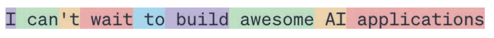  
  
토큰화(tokenization)는 원문을 모델이 정한 길이로 나누는 과정을 말한다. GPT-4의 경우 토큰 하나의 평균 길이는 단어의 약 3/4 정도다. 따라서 100 
토큰은 약 75개의 단어에 해당한다.  
  
모델이 다룰 수 있는 모든 토큰의 집합은 모델의 어휘(vocabulary)라고 부른다. 알파벳의 몇 글자를 사용해 많은 단어를 만들 수 있는 것처럼 소수의 토큰만 
사용해 많은 고유한 단어를 만들 수 있다. 예를 들어 믹스트랄(Mixtral) 8x7B 모델은 어휘 크기가 32000개이고 GPT-4의 어휘 크기는 100,256개다. 
토큰화 방법과 어휘 크기는 모델 개발자가 결정한다.  

언어 모델에는 두 가지 유형이 있다. 마스크 언어 모델과 자기회귀 언어 모델이다. 이들은 토큰을 예측할 때 사용할 수 있는 정보에 따라 구분된다.  
  
## **언어 모델은 왜 단어나 문장이 아닌 토큰을 사용할까?**  
1. 문자에 비해 토큰은 단어를 의미 있는 구성 요소로 나눌 수 있다. 예를 들어 '요리하기'는 '요리'와 '하기'로 나눌 수 있으며 두 구성 요소 모두 원래 
단어의 일부 의미를 담고 있다.  
2. 고유한 토큰의 수가 고유한 단어의 수보다 적기 떄문에 모델의 어휘 크기가 줄어들어 모델이 더 효율적이게 된다.  
3. 토큰은 모델이 알려지지 않은 단어를 처리할 때도 도움을 준다. 예를 들어 chatgpting이라는 단어는 chatgpt와 -ing로 나눌 수 있어 모델이 그 구조를 
이해하는 데 도움이 된다. 토큰은 단어보다 단위가 적으면서도 개별 문자보다 더 많은 의미를 유지한다.  
  
# **마스크 언어 모델**  
마스크 언어 모델(masked language model)은 누락된 토큰 전후 컨텍스트를 사용해 시퀀스의 어느 위치에서든 누락된 토큰을 예측하도록 학습한다. 
기본적으로 마스크 언어 모델은 빈칸을 채울 수 있도록 학습된다. 예를 들어 '내가 가장 좋아하는 __는 파란색이다' 라는 컨텍스트에서 마스크 언어 모델은 빈칸이 
'색상'일 가능성이 높다고 예측해야 한다. 잘 알려진 마스크 언어 모델의 예시는 BERT: Pre-training of Deep Bidirectional Transformers for 
Language Understanding 에서 볼 수 있다.  
  
마스크 언어 모델은 감정 분석이나 텍스트 분류처럼 새로운 텍스트를 만들지 않는 작업에 주로 사용된다. 또한 코드 디버깅처럼 모델이 앞뒤 코드를 모두 
이해해서 오류를 찾아야 하는 전체적인 컨텍스트 이해가 필요한 작업에도 유용하다.  
  
# **자기회귀 언어 모델**  
자기회귀 언어 모델(autoregressive language model)은 이전 토큰들만 보고 시퀀스의 다음 토큰을 예측하도록 학습된다. 즉 '내가 가장 좋아하는 색상은 
__이다' 에서 빈칸에 무엇이 올지 예측한다. 이런 원리 덕분에 토큰을 하나씩 순차적으로 생성할 수 있으며 오늘날 자기회귀 언어 모델은 텍스트 생성 분야의 
대세로 자리 잡아 마스크 언어 모델보다 훨씬 더 큰 인기를 누리고 있다.  
  
아래 그림은 이 두 가지 유형의 언어 모델을 보여준다.(앞으로 명시적으로 언급되지 않는 한 언어 모델은 자기회귀 모델을 의미한다.)  
  
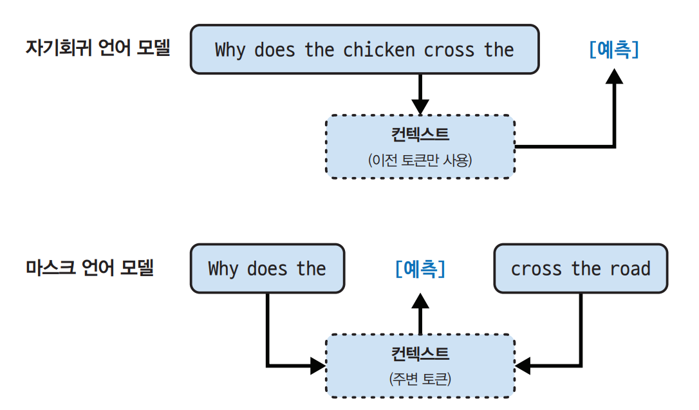  
  
언어 모델의 출력에는 제한이 없다. 언어 모델은 정해진 유한한 어휘만을 사용해서 무한히 다양한 결과물을 만들어 낼 수 있다. 이처럼 정해진 답 없이 
개방형 출력을 생성하는 모델을 생성 모델(generative model)이라고 부르는데 바로 여기에서 생성형 AI(generative AI)라는 용어가 유래됐다.  
  
언어 모델은 텍스트(프롬프트)가 주어지면 해당 텍스트를 완성하려는 일종의 완성 기계(completion machine)로 생각하면 된다. 예를 들어 다음과 같다.  
  
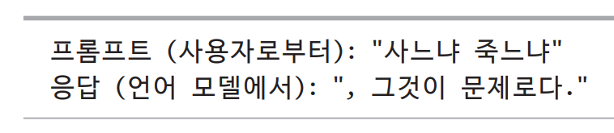  
  
여기서 중요한 점은 완성된 결과가 확률에 기반한 예측이며 정확성이 보장되지 않는다는 것이다. 이처럼 언어 모델의 이런 확률적 특성 때문에 사용할 때 
흥미롭기도 하고 답답하기도 한 것이다.  
  
단순해 보이지만 언어 모델의 완성 능력은 매우 강력하다. 번역, 요약, 코딩, 수학 문제 풀이 등 많은 작업을 완성할 수 있다. 예를 들어 'How are you in French Is...' 
라는 프롬프트가 주어지면 언어 모델은 'Comment ca va'라고 완성할 수 있는데 이는 사실상 한 언어를 다른 언어로 효과적으로 번역하는 셈이다.  
  
다음은 또 다른 예시다.  
  
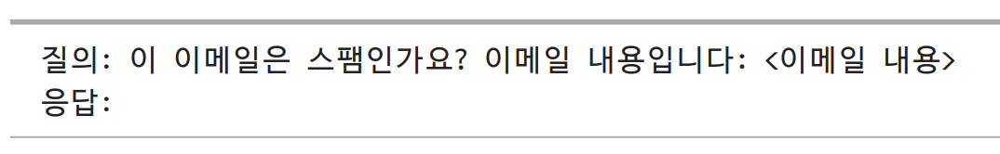  
  
언어 모델은 이 질의에 '스팸일 가능성 높음'이라고 응답을 완성하는 방식으로 스팸 분류기 역할을 할 수도 있다.  
  
완성 기능은 강력하지만 대화를 나누는 것과 같지는 않다. 예를 들어 언어 모델에 질의를 하면 질의에 답을 하는 대신 또 다른 질의로 문장을 완성할 수 있다.  
  
# **자기 지도 학습**  
언어 모델링은 수많은 ML 알고리즘 중 하나일 뿐이다. 언어 모델링 외에도 객체 탐지, 토픽 모델링, 추천 시스템, 일기 예보, 주가 예측 등을 위한 
모델들도 있다. 그렇다면 언어 모델에 어떤 특별한 점이 있기에 챗GPT 시대를 연 규모 확장 접근법의 핵심이 될 수 있었을까?  
  
이 질의에 대한 답은 많은 다른 모델이 지도 학습(supervised learning)을 필요로 하는 반면 언어 모델은 자기 지도 학습(self-supervised learning)으로 
학습할 수 있다는 점이다. 지도 학습은 레이블이 있는 데이터를 사용해 ML 알고리즘을 학습하는 과정을 말하는데 이는 비용이 많이 들고 시간도 오래 걸린다. 
자기 지도 학습은 이런 데이터 레이블링 병목 현상을 극복해 모델이 학습할 수 있는 더 큰 데이터셋을 만들 수 있게 해주므로 모델의 규모를 효과적으로 키울 수 있다. 
방법은 다음과 같다.  
  
지도 학습에서는 모델이 학습해야 할 행동을 보여주는 예시에 레이블을 달고 이 예시들로 모델을 학습한다. 학습이 끝나면 새로운 데이터에 모델을 적용할 수 있다. 
예를 들어 사기 탐지 모델을 학습할 때는 각각의 거래 내역에 '사기' 또는 '정상' 레이블이 붙은 예시들을 사용한다. 이런 예시들로부터 학습을 마친 모델은 
거래가 사기인지 예측하는 데 사용할 수 있다.  
  
2010년대 AI 모델은 지도 학습 덕분에 성공했다. 딥러닝 혁명을 시작한 모델로 알려진 알렉스넷은 대표적인 지도 학습 방식의 결과였다. 이미지넷 데이터셋에 
있는 100만 개 이상의 이미지를 분류하는 방법을 배우도록 학습했고 이는 이미지를 자동차, 풍선, 원숭이와 같은 1000개의 범주 중 하나로 분류한다.  
  
이러한 지도 학습의 단점은 데이터 레이블링에 많은 비용과 시간이 소요되는 점이다. 단순하게 계산했을 때 한 사람이 이미지 하나에 레이블을 붙이는 데 
5센트의 비용이 든다면 이미지넷의 이미지 100만 개에 레이블을 붙이는 데에 5만 달러가 필요하다. 여기서 레이블 품질을 교차 검증하기 위해 두 명의 다른 
사람이 각 이미지에 레이블을 붙이려면 두 배의 비용이 들게 된다. 세상에는 1000개가 훨씬 넘는 물체가 존재하기 때문에 더 많은 물체로 작업할 수 있도록 
모델의 기능을 확장하려면 더 많은 범주의 레이블을 추가해야 한다. 범주를 100만 개까지 확장하려면 레이블링 비용만 5처만 달러까지 증가한다.  
  
일상적인 물건에 레이블을 다는 것은 대부분의 사람이 별도의 교육 없이도 할 수 있는 일이다. 따라서 비교적 적은 비용으로 할 수 있다. 하지만 모든 
레이블링 작업이 그렇게 단순한 것은 아니다. 예를 들어 영어-라틴어 번역 모델을 위해 라틴어 번역문을 만드는 일은 더 많은 비용이 든다. CT 스캔에서 암의 
징후가 있는지 레이블을 다는 일은 천문학적인 비용이 소요된다.  
  
이와 다르게 자기 지도 학습은 데이터 레이블링 병목 현상을 극복하는 데 도움이 된다. 자기 지도 학습에서는 명시적인 레이블이 필요하지 않고 모델이 입력 
데이터에서 레이블을 추론할 수 있다. 언어 모델리은 각 입력 시퀀스가 레이블(예측할 토큰)과 모델이 이런 레이블을 예측하는 데 사용할 수 있는 컨텍스트를 
모두 제공하기 때문에 자기 지도 학습이 가능하다. 예를 들어 I love street food 라는 문장은 아래 포에 표시된 것처럼 6개의 학습 샘플을 제공한다.  
  
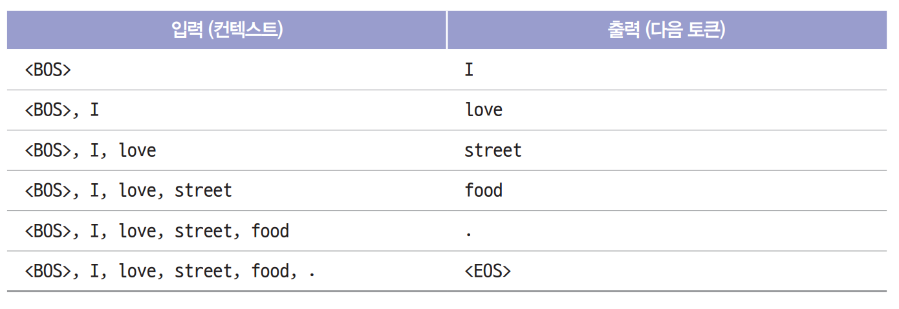  
  
표에서 <BOS>와 <EOS>는 시퀀스의 시작과 끝을 표시한다. 이런 마커는 언어 모델이 여러 시퀀스를 구분해서 처리할 수 있도록 도우며 모델은 보통 각 마커를 
하나의 특수 토큰으로 인식한다. 특히 시퀀스 종료 마커는 언어 모델이 응답을 끝낼 시점을 알 수 있게 해주기 때문에 중요하다.  
  
자기 지도 학습과 비지도 학습은 다르다. 자기 지도 학습은 입력 데이터에서 레이블을 추론하지만 비지도 학습은 레이블이 전혀 필요하지 않다.  
  
자기 지도 학습은 언어 모델이 레이블링 없이도 텍스트 시퀀스를 통해 학습할 수 있다. 텍스트 시퀀스는 책, 블로그 게시물, 기사, 레딧 댓글 등 어디에나 
존재하기 때문에 방대한 양의 학습 데이터를 구축할 수 있으며 이를 통해 언어 모델을 LLM으로 확장할 수 있다.  
  
그러나 LLM은 과학적인 용어라 보긴 어렵다. 언어 모델이 얼마나 커야 대규모(large)로 간주될 수 있을까? 오늘 대규모라고 여겨지는 것이 내일이면 아주 
작게 여겨질 수 있다. 모델의 크기는 일반적으로 파라미터의 수로 측정된다. 파라미터는 학습 과정을 통해 업데이트되는 ML 모델 내의 변수다. 항상 그런 것은 
아니지만 일반적으로 모델의 파라미터가 많을수록 원하는 행동을 더 잘 학습할 수 있다.  
  
2018년 6월애 오픈AI의 첫 번째 생성형 사전 학습 트랜스포머(GPT) 모델이 나왔을 떄는 1억 1700만 개의 파라미터를 가지고 있었고, 이는 대규모로 여겨졌다. 
2019년 2월 오픈 AI가 15억 개의 파라미터를 갖춘 GPT-2를 출시했을 떄 기존 1억 1700만 개는 소규모로 여겨지게 되었다. 현재는 1000억 개의 파라미터를 
가진 모델을 대규모로 본다. 어쩌면 언젠가 이 크기도 소규모로 여겨질 수 있다.  
  
더 큰 모델은 왜 더 많은 데이터가 필요할까? 당연하게도 모델이 클수록 학습할 수 있는 용량이 커지므로 성능을 극대화하려면 더 많은 학습 데이터가 필요하다. 
큰 모델을 작은 데이터셋으로 학습할 수 있지만 이는 컴퓨팅 자원 낭비일 뿐이다. 데이터셋이 작다면 더 작은 모델을 사용했어도 비슷하거나 더 나은 결과를 
얻을 수 있다.  
  
# **대규모 언어 모델에서 파운데이션 모델로**  
언어 모델은 놀라운 작업을 수행할 수 있지만 글자에만 국한되어 있다. 사람은 언어뿐만 아니라 시각, 청각, 촉각 등을 통해서도 세상을 인식한다. 따라서 
AI가 실제 세상에서 유의미하게 작동하기 위해서는 글자 이상의 데이터를 처리하는 능력이 꼭 필요하다.  
  
이런 이유로 언어 모델은 더 많은 데이터 모달리티를 포함하도록 확장되고 있다. GPT-4V와 클로드 3은 이미지와 텍스트를 이해할 수 있다. 일부 모델은 
동영상, 3D 에셋, 단백질 구조 등을 이해하기도 한다. 이처럼 언어 모델에 더 많은 데이터 모달리티를 통합하면 훨씬 더 강력해진다. 이에 오픈 AI는 
2023년 GPT-4V 시스템 카드에서 '추가적인 모달리티(이미지 입력)를 LLM에 통합하는 것이 AI 연구 및 개발의 중요한 영역으로 여겨진다'고 언급했다.  
  
많은 사람이 여전히 제미나이와 GPT-4V를 LLM이라 부르지만 이들을 파운데이션 모델(foundation model)로 설명하는 것이 더 적절하다. 파운데이션이란 
단어는 이 모델들이 AI 애플리케이션에서 갖는 중요성과 다양한 요구사항에 맞게 발전시킬 수 있다는 사실을 의미한다.  
  
파운데이션 모델은 AI 연구의 전통적인 구조에 획기적인 변화를 가져왔다. 그동안 AI 연구는 데이터 형태에 따라 구분되어 왔다. 자연어 처리(NLP)는 
텍스트를, 컴퓨터 비전은 이미지를 각각 독립적으로 처리했다. 텍스트 전용 모델은 번역과 스팸 탐지에, 이미지 전용 모델은 객체 탐지와 이미지 분류에 
활용되었다. 오디오 전용 모델의 경우 음성 인식(음성을 글자로 바꾸는 것, STT, speech-to-text)과 음성 합성(글자를 음성으로 바꾸는 것, TTS, text-to-speech)
을 담당했다.  
  
둘 이상의 데이터 형태를 처리할 수 있는 모델은 멀티모달 모델이라고 부른다. 생성형 멀티모달 모델은 대규모 멀티모달 모델(large multimodal model - LMM) 
이라고도 한다. 언어 모델이 텍스트 토큰에 기반해 토큰을 생성할 떄 멀티모달 모델은 아래 그림과 같이 텍스트와 이미지 토큰, 또는 모델이 지원하는 다른 
모달리티를 기반으로 다음 토큰을 생성한다.  
  
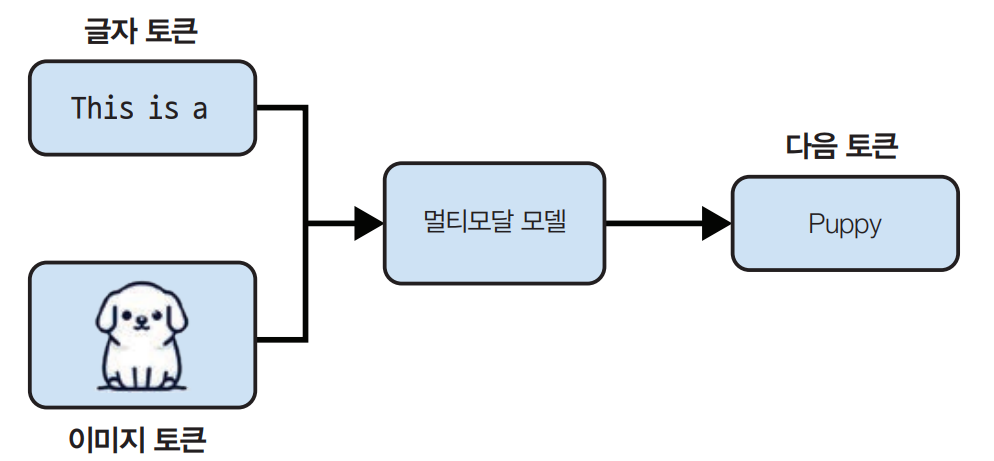  
  
언어 모델처럼 멀티모달 모델도 규모를 확장하기 위해 데이터가 필요하다. 자기 지도 학습은 멀티모달 모델에서도 효과가 있다. 예를 들어 오픈 AI는 자연어 지도
(natural language supervision) 자기 지도의 변형을 사용해 언어 이미지 모델 CLIP (OpenAI, 2021)을 학습했다. 각 이미지에 대한 레이블을 수동으로 
생성하는 대신 인터넷에서 함께 발견되는 (이미지, 텍스트) 쌍을 수집했다. 그 결과 수동 레이블링 비용 없이 이미지넷보다 400배 더 큰 4억 개의 (이미지, 텍스트) 
쌍으로 구성된 데이터셋을 생성할 수 있었다. 이 데이터셋 덕분에 CLIP은 사상 최초로 추가 학습 없이도 여러 이미지 분류 작업을 일반화할 수 있었다.  

(앞으로 파운데이션 모델이란 용어를 대규모 언어 모델과 대규모 멀티모달 모델을 모두 지칭하는 표현으로 사용한다.)  
  
CLIP은 생성 모델이 아니며 무엇이든 생성할 수 있도록 학습된 모델이 아니다. CLIP은 임베딩 모델(embedding model)로 텍스트와 이미지를 함께 임베딩하도록 
학습되었다. 임베딩을 원본 데이터의 의미를 담아내는 것을 목표로 하는 벡터 정도로만 생각해도 충분하다. CLIP과 같은 멀티모달 임베딩 모델은 플라밍고
(Flamingo), LLaVA, 제미나이(이전에 Bard로 알려짐)와 같은 생성형 멀티모달 모델의 핵심이다.  
  
파운데이션 모델은 특정 작업에 맞춘 모델에서 범용 모델로 전환하는 것을 의미한다. 이전에는 감정 분석이나 번역과 같은 특정 작업을 위해 모델이 개발되는 
경우가 많았다. 감정 분석용으로 학습된 모델은 번역을 수행할 수 없었고 그 반대의 경우도 마찬가지였다.  
  
그러나 파운데이션 모델은 규모와 학습 방식 덕분에 다양한 작업을 수행할 수 있다. 즉 하나의 LLM으로 감정 분석과 번역을 모두 수행할 수 있다. 물론 특정 
작업에 대한 성능을 올리고 싶다면 파인튜닝(fine-tuning)이 필요하다.  
  
아래 그림에서는 Super-NaturalInstructions 벤치마크에서 파인데이션 모델 평가에 사용하는 작업들을 보여주며 파운데이션 모델이 수행할 수 있는 작업의 
종류를 알 수 있다.  
  
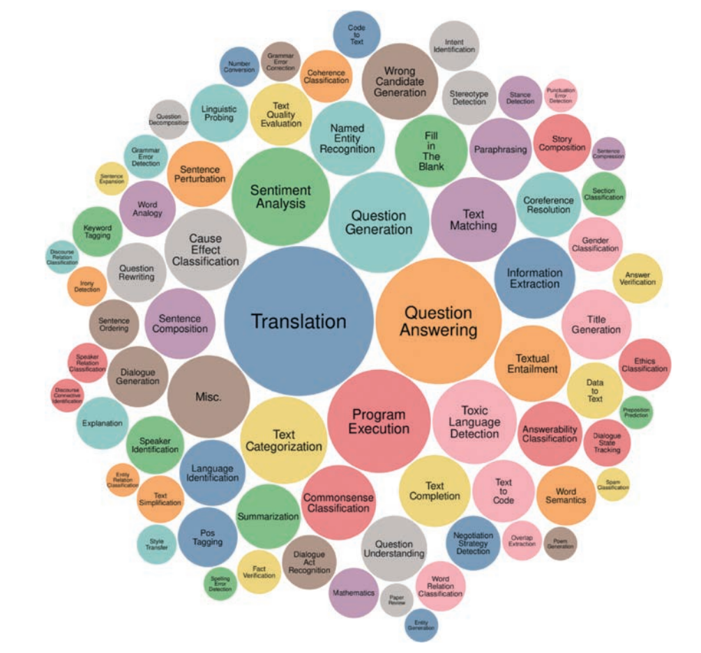  
  
소매업체와 협력해 웹사이트에 대한 제품 설명을 생성하는 애플리케이션을 개발한다고 가정하자. 기존 상용 모델은 제품에 대한 정확한 설명은 생성할 수 
있겠지만 브랜드만의 차별성 있는 목소리나 메시지를 강조하지 못할 수 있다. 심지어 생성된 설명이 마케팅 용어와 진부한 표현으로 가득할 수도 있다.  
  
이처럼 결과가 만족스럽지 않을 경우 모델이 원하는 결과물을 내놓도록 유도하는 몇 가지 기법을 써볼 수 있다. 예를 들어 원하는 제품 설명 예시와 함꼐 
상세한 지시를 모델에게 제공하는 방법이다. 이런 접근 방식을 프롬프트 엔지니어링(prompt engineering)이라 부른다. 또 다른 방법으로는 모델을 고객 리뷰 
데이터베이스에 연결하여 더 나은 설명을 생성하도록 할 수도 있다. 이처럼 데이터베이스를 활용해 지시를 보완하는 것을 검색 증강 생성(retrieval-augmented generation, RAG)  
이라고 부른다. 그리고 고품질 제품 설명 데이터셋을 사용하여 모델을 추가로 파인튜닝하는 방법도 있다.  
  
프롬프트 엔지니어링, RAG, 파인튜닝은 모델을 목적에 맞게 조정하는 데 널리 쓰이는 대표적인 AI 엔지니어링 기법들이다.  
  
특정 작업용 모델을 처음부터 만드는 것과 비교하면 기존에 존재하는 강력한 모델을 그 작업에 맞게 조정하는 것이 훨씬 쉽다. 예를 들어 전자는 100만 개의 
예시와 6개월이 필요하지만 후자는 10개의 예시로 주말 하루면 충분하다. 파운데이션 모델을 사용하면 AI 애플리케이션을 더 쉽게 개발하고 출시 기간을 단축할 
수 있다. 모델을 조정하는 데 필요한 데이터의 정확한 양은 어떤 기술을 사용하는지에 따라 달라진다. 파운데이션 모델의 장점만을 언급했으나 작업 특화(task-specific) 
모델도 여전히 많은 장점이 있다. 예를 들어 작업 특화 모델은 더 작기 떄문에 빠르고 저렴하게 사용할 수 있다.  
  
# **파운데이션 모델에서 AI 엔지니어링으로**  
AI 엔지니어링은 파운데이션 모델을 기반으로 애플리케이션을 만드는 과정을 의미한다. 그러나 이미 사람들은 10년이 넘는 기간 동안 AI 애플리케이션을 
만들어 왔다. 이 과정은 ML 엔지니어링 또는 MLOps(machine learning operations의 약자)라고 불러 왔다.  
  
전통적인 ML 엔지니어링이 모델 자체를 개발하는 것이라면 AI 엔지니어링은 이미 존재하는 모델을 활용한다. 강력한 파운데이션 모델의 이용 가능성과 
접근성은 AI 엔지니어링의 빠른 성장을 위한 이상적인 조건을 만드는 세 가지 요인으로 이어진다.  
  
- 요인 1: 범용 AI 능력  
파운데이션 모델은 기존 작업을 더 잘 수행할 수 있다는 이유만으로 강력한 것이 아니다. 더 많은 작업을 수행할 수 있기 때문에 능력이 뛰어나다. 이전에 불가능하다고 
여겨졌던 애플리케이션 서비스가 이제는 가능해졌고 이전에 생각하지 못했던 애플리케이션이 계속 등장하고 있다. 오늘날 불가능하다고 생각되는 애플리케이션 
서비스도 내일은 가능할 수 있다. 이로 인해 AI는 생활의 여러 측면에서 더욱 유용해졌으며 사용자 수와 AI 애플리케이션에 대한 수요가 크게 늘어났다. (소설, 
계약서 설명, 사진 편집, 코드 작성 등)  
  
- 요인 2: AI 투자 증가  
챗GPT의 성공으로 벤처 캐피털과 기업 모두에서 AI에 대한 투자가 급격히 증가했다. AI 애플리케이션의 구축 비용이 저렵해지고 시장에 출시되는 속도가 
빨라지면서 AI에 대한 투자 수익이 더욱 매력적으로 다가왔다. 그 결과로 점점 더 많은 기업이 AI를 자사 제품과 프로세스에 빠르게 통합하고 있다. 또한 
AI는 종종 경쟁 우위의 요소로 언급되기도 한다.  
  
- 요인 3: AI 애플리케이션 개발에 대한 낮아진 진입 장벽  
오픈AI 및 기타 모델 제공업체가 대중화한 서비스형 모델 접근 방식으로 AI를 활용해 애플리케이션을 더 쉽게 개발할 수 있게 되었다. 이 접근 방식에서 
모델은 사용자의 질의를 받고 모델 출력을 반환하는 API를 통해 노출된다. 이런 API가 없는 상태에서 AI 모델을 사용하려면 이 모델을 호스팅하고 서비스할 
인프라가 필요하지만 API를 이용하면 단일 API 호출을 통해 강력한 모델에 접근할 수 있다.  
  
그뿐만 아니라 AI는 최소한의 코딩으로 애플리케이션을 개발할 수 있게 해준다. 첫째, AI가 코드를 작성해 주므로 소프트웨어 엔지니어링에 대한 배경지식이 
없는 사람도 아이디어를 코드로 빠르게 전환해 사용자에게 제공할 수 있다. 둘째, 프로그래밍 언어를 사용하지 않고도 일반 대화체로 이런 모델을 사용할 수 
있다. 즉, 이제 누구나 AI 애플리케이션을 개발할 수 있게 된 것이다.  
  
파운데이션 모델을 개발하려면 많은 자원이 필요하기 때문에 아직 이 과정은 대기업(구글, 메타 등), 정부(일본, 아랍에미리트), 야심차고 자금력이 풍부한 
스타트업(오픈AI, 엔트로픽 등)만이 가능하다. 오픈AI의 CEO 샘 올트먼은 2022년 9월 인터뷰에서 대다수의 사람에게 가장 큰 기회는 이런 모델을 특정 
애플리케이션에 적용하는 것이라 말했다.  
  
그리고 전 서계는 이 기회를 빠르게 받아들이고 있다. AI 엔지니어링은 매우 빠르게 성장하는 공학 분야 중 하나로 그중에서도 가장 성장세가 가파른 분야일 
것이다. AI 엔지니어링을 위한 도구는 이전의 그 어떤 소프트웨어 엔지니어링 도구보다 빠르게 주목받고 있다. 불과 2년 만에 4개의 오픈 소스 AI 엔지니어링 도구
(오토GPT, 스테이블 디퓨전 웹 UI, 랭체인, 올라마)가 이미 깃허브에서 비트코인보다 더 많은 별을 획득했다.   
  
# **파운데이션 모델 활용 사례**  
파운데이션 모델로 개발할 수 있는 잠재적 애플리케이션의 수는 무궁무진하다. 어떤 활용 사례를 생각하든 그에 맞는 AI가 있을 것이다. 따라서 AI의 
잠재적 활용 사례를 이 책에서 모두 나열하는 것은 불가능하다.  
  
또한 설문조사마다 다른 분류를 사용하기 때문에 이런 활용 사례를 분류하는 것조차 쉽지 않다. 각 설문조사 마다 여러 범주로 나눈다. 딜로이트 같은 조직들은 
비용 절감, 프로세스 효율성, 성장, 혁신 가속화 등 가치 확보 측면에서 활용 사례를 분류했다. 가치 확보와 관련해 카트너는 생성형 AI를 도입하지 않으면 
조직이 도태될 수 있다는 의미의 비즈니스 연속성이라는 범주를 두고 있다.  
  
엘룬두 등의 연구는 각 직업이 AI에 얼마나 노출되어 있는지에 대해 정리했다. AI와 AI 기반 소프트웨어가 작업 완료에 필요한 시간을 50% 이상 줄일 수 
있다면 해당 작업이 AI에 노출된 것으로 정의했다. 한 직업이 80% 노출되었다는 것은 해당 직업의 작업 중 80%가 AI에 노출되었다는 의미다. 연구에 따르면 통역사와 
번역가, 세무사, 웹 디자이너, 작가는 100% 또는 거의 100%에 가깝게 노출된 직업이다. 요리사, 석공, 운동 선수는 AI에 전혀 노출되지 않은 직업이다. 
이 연구는 AI가 어떤 활용 사례에 적합한지 잘 보여준다.  
  
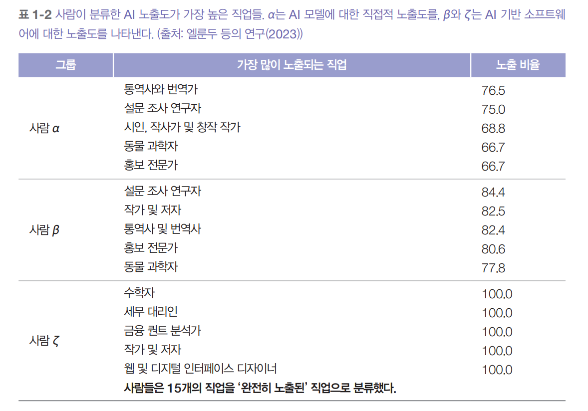  
  
기업 활용 사례를 위해 50개 기업의 AI 전략에 대해 인터뷰하고 100개 이상의 사례 연구를 조사하고 소비자 애플리케이션을 이해하기 위해 깃허브에서 별 
500개 이상을 받은 205개의 오픈 소스 AI 애플리케이션을 8개의 그룹으로 분류한것이 아래 표이다.  
  
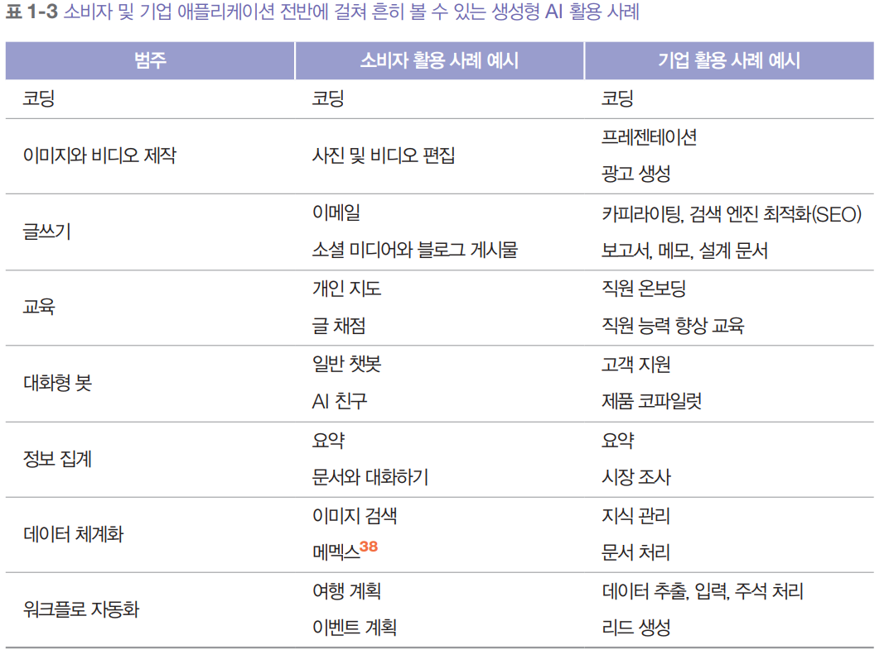  
  
파운데이션 모델은 범용적이므로 이를 활용해 만든 애플리케이션은 다양한 문제를 해결할 수 있다. 즉 하나의 애플리케이션이 여러 범주에 속할 수 있다는 
뜻이다. 봇 하나가 사용자와 대화하는 동반자 역할을 하면서 동시에 정보를 모아주는 기능도 할 수 있다. 또한 하나의 애플리케이션 PDF에서 구조화된 데이터를 
추출하는 동시에 해당 PDF에 대한 질의에 응답할 수 있다.  
  
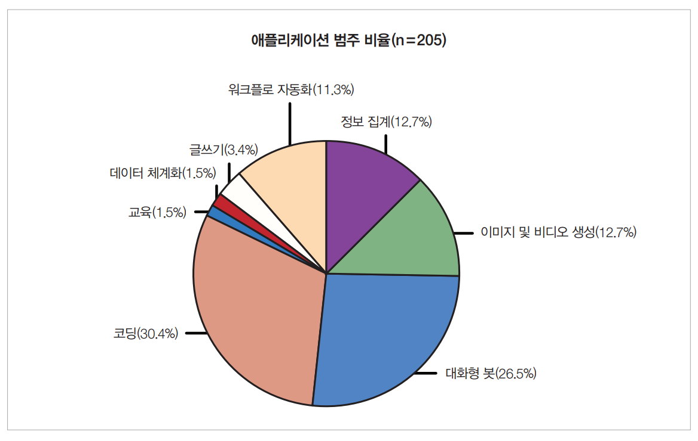  
  
위 그림은 205개의 오픈 소스 애플리케이션에서 활용 사례들의 분포를 보여준다. 교육, 데이터 체계화, 글쓰기 관련 활용 사례의 비율이 작다고 해서 이런 
활용 사례가 인기 없다는 뜻은 아니다. 단지 이런 애플리케이션이 오픈 소스로 많이 공개되지 않았다는 의미다. 이런 애플리케이션의 개발자들은 기업용 
활용 사례에 더 적합하다고 판단했을 수 있다.  
  
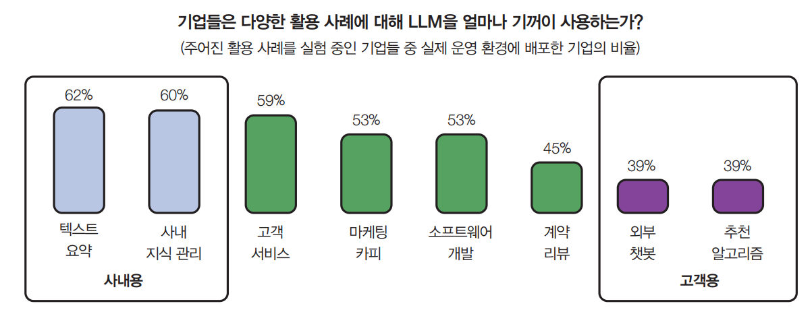  
  
기업들은 일반적으로 위험도가 낮은 애플리케이션을 선호한다. 예를 들어 2024년 a16z 성장 보고서에 따르면 위 그림과 같이 기업들이 외부 지향형 애플리케이션
(고객 지원 챗봇)보다 내부 지향적 애플리케이션(사내 지식 관리)을 더 빠르게 도입하는 것으로 나타났다. 내부용 애플리케이션은 데이터 프라이버시, 
규정 준수, 잠재적 치명적 실패와 관련된 위협을 최소화하면서 기업의 AI 엔지니어링 전문성을 개발하는 데 도움을 준다. 이런 위험 회피 경향은 파운데이션 
모델의 활용법에서도 찾아볼 수 있다. 파운데이션 모델이 개방형이고 모든 작업에 사용할 수 있ㅈ만 이를 활용해 만든 많은 애플리케이션은 분휴 작업처럼 
여전히 폐쇄형이다. 폐쇄적이지만 분류 작업은 그만큼 평가하기가 더 쉬워서 위험을 추정하기도 더 쉽다.  
  
# **코딩**  
여러 생성형 AI 설문조사에서 코딩은 가장 인기 있는 활용 사례로 뽑혔다. AI 코딩 도구가 인기 있는 이유는 AI가 코딩을 잘하기 때문이기도 하고 이 
기술의 초기 AI 엔지니어들이 대부분 개발자여서 자신들에게 가장 익숙한 코딩 문제에 AI를 먼저 적용해 보았기 떄문이다.  
  
일반적인 코딩을 돕는 도구 외에도 특정 코딩 작업에 특화된 도구가 많이 있다. 다음은 이런 작업의 예시들이다.  
  
- 웹 페이지와 PDF에서 구조화된 데이터를 추출하기 (AgentGPT)  
- 자연어를 코드로 변환하기 (DB-GTP, SQL chat, PandasAI)  
- 디자인이나 스크린샷을 주면 주어진 이미지처럼 보이는 웹사이트로 변환할 코드 생성하고 (screenshot-to-code, draw-a-ui)  
- 하나의 프로그래밍 언어나 프레임워크에서 다른 것으로 번역하기 (GPT-Migrate, AI Code Transtator)  
- 문서 작성하기 (Autodoc)  
- 테스트 만들기 (PentestGPT)
- 커밋 메시지 만들기 (AI Commits)  
  
AI가 많은 소프트에어 엔지니어링 작업을 수행할 수 있다는 것은 분명하다. 문제는 AI가 소프트웨어 엔지니어링을 완전히 자동화할 수 있냐는 것이다. 엔비디아 CEO 
젠승 황은 AI가 사람 소프트웨어 엔지니어를 대체할 것이며 아이들에게 코딩을 배워야 한다는 말을 멈춰야 한다고 주장한다. 유출된 녹음에서 AWS CEO 
맷 가맨은 가까운 미래에 대부분의 개발자가 코딩을 멈출 것이라고 말하기도 했다. 이는 소프트웨어 개발자의 종말을 의미하는 것이 아니라 단지 그들의 직무가 
변화할 것이라는 뜻이다.  
  
다른 한편에는 기술적인 이유와 감정적인 이유(대부분의 사람은 자신이 대체될 수 있다는 사실을 인정하는 것을 싫어한다)로 자신이 결코 AI로 대체되지 않을 
것이라고 확신하는 소프트웨어 엔지니어가 많다.  
  
소프트웨어 엔지니어링은 많은 작업으로 이뤄진다. AI는 어떤 작업에서는 다른 작업보다 더 나은 성과를 보인다. 연구원들은 AI가 개발자의 문서화 생산성을 2배로, 
코드 생성과 코드 리팩터링 생산성을 25~50% 높일 수 있다는 것을 발견했다.  
  
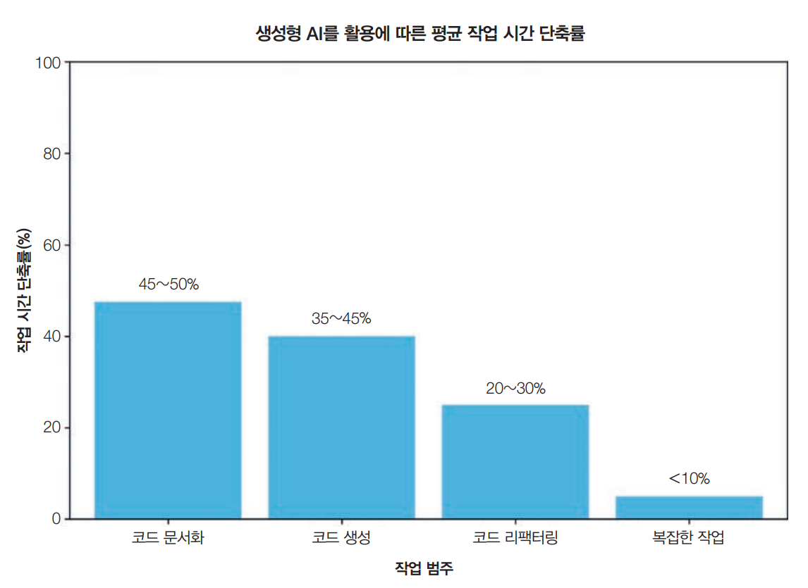  
  
# **이미지 및 동영상 제작**  
확률적 특성 덕분에 AI는 창의적인 작업에서 뛰어난 성과를 보인다. 이런 작업의 성공적인 AI 사례는 이미지 생성을 위한 미드저니(Midjourney), 사진 
편집을 위한 어도비 파이어플라이 (AdobeFirefly), 영상 생성을 위한 런웨이 (Runway), 피카 랩스(Pika Labs), 소라 (Sora)와 같은 창의적 애플리케이션이 있다.  
  
링크드인에서 틱톡에 이르기까지 소셜 미디어의 프로필 사진을 생성할 때 일반적으로 AI를 사용한다. 대부분의 취업 준비생은 AI가 생성한 프로필 사진이 자신을 
돋보이게 하고 취업 가능성을 높이는 데 도움이 된다고 생각한다. AI가 생성한 프로필 사진에 대한 인식도 크게 바뀌었다. 2019년에 페이스북(현재 메타) 
은 안전상의 이유로 AI가 생성한 프로필 사진을 사용하는 계정을 금지했었다. 그러나 2023년 이후로 많은 소셜 미디어 애플리케이션에서 사용자가 AI를 
사용해 프로필 사진을 생성할 수 있는 도구를 제공한다.  
  
기업의 경우 광고와 마케팅 분야에서 AI를 빠르게 도입했다. AI를 사용하면 홍보용 이미지와 동영상을 외주가 아닌 직접 생성할 수 있고 아이디어 브레인스토밍을 
도와주거나 전문가가 수정해 나갈 초안을 만들어 줄 수도 있다. AI로 여러 광고를 생성하고 테스트해 고객에게 가장 효과적인 것을 비교적 쉽게 찾을 수 
있다. 또한 AI는 계절과 위치에 따라 기존 광고를 수정할 수도 있다.  
  
# **글쓰기**  
AI는 오래전부터 글쓰기 보조 도구로 활용되어 왔다. 스마트폰을 사용한다면 자동 수정과 자동 완성 기능에 이미 익숙할 것이다. 글쓰기는 AI가 활약하기에 
더없이 좋은 분야인데 누구나 자주 하는 일인 데다 때로는 과정이 지루하게 느껴지기 떄문이다. 무엇보다 AI가 제안한 내용이 마음에 들지 않으면 무시하면 
그만이라 실수가 발생해도 위험 부담이 적다.  
  
LLM이 문장 완성을 위해 학습된다는 점을 생각하면 글쓰기를 잘하는 것은 어찌 보면 당연하다. 챗GPT가 글쓰기에 미치는 영향을 연구하기 위해 MIT 연구진은 
453명의 대학 교육을 받은 전문가들에게 직업별 글쓰기 과제를 할당하고 그중 절반에게 무작위로 챗GPT를 사용하게 했다. 연구 결과에 따르면 챗GPT를 
사용한 집단은 글쓰기에 걸리는 평균 시간이 40% 감소했고 결과물의 품질은 18% 향상됐다. 이는 챗GPT가 작업자들 간의 결과물 품질 격차를 줄여주고 
글쓰기 능력이 부족한 사람들에게 더 도움이 된다는 뜻이다. 실험 중 챗GPT를 사용한 사람들은 실험 2주 후 실제 업무에서 이를 사용할 가능성이 2배, 
2개월 후에는 1.6배 더 높았다.  
  
일반 소비자들은 더 나은 의사소통을 위해 AI를 사용하고 있고 학생들이 글쓰기 과제 등에 AI를 활용한다. 작가들도 책을 쓸 때 AI를 사용한다.  
  
하지만 AI의 글쓰기 능력도 악용될 수 있다. 2023년 뉴욕타임스는 아마존에 AI를 통해 조잡하게 작성된 여행 가이드북이 넘쳐난다고 보도했다.  
  
기업의 경우 AI 글쓰기를 영업, 마케팅, 일반적인 팀 커뮤니케이션에서 흔히 사용한다. 많은 관리자가 실적 보고서 작성에 AI를 활용하고 있다고 말했다.  
  
AI는 검색 엔진 최적화(SEO)에 유독 강한 면모를 보이는데 아마도 수많은 AI 모델이 SEO에 최적화된 인터넷 텍스트로 학습했기 떄문일 것이다. AI는 SEO를 
너무나 잘해서 안타깝게도 좋지 않은 콘텐츠 양산 공장을 만들어 냈다. 이러한 공장은 저질 웹사이트를 만들고 AI가 생성한 콘텐츠로 채워 구글 검색 순위를 
높여서 트래픽을 유도한다. 그런 다음 광고 거래소를 통해 광고 자리를 판매한다. 이런 흐름을 막기 위한 조치가 없다면 미래의 인터넷은 AI가 생성한 글로 
뒤덮일 것이며 이는 꽤 암울한 전망이다.  
  
# **교육**  
챗GPT가 다운될 때마다 오픈 AI의 디스코드 서버는 과제를 완료하지 못했다는 학생들의 불평으로 넘쳐난다. 뉴욕시 공립 학교와 로스앤젤레스 통합 교육청을 
비롯한 여러 교육청은 학생들이 부정행위를 할 것을 우렿 챗GPT를 금지했다가 불과 몇 달 후 결정을 번복하기도 했다.  
  
학교가 AI를 금지하기보다는 오히려 적극적으로 활용한다면 학생들의 학습 속도를 지금보다 훨씬 더 끌어올릴 수 있을 것이다. AI는 교과서를 요약하고 
학생별 맞춤형 강의 계획을 생성할 수도 있다. 광고는 사람마다 취향이 다르다는 점을 고려해 개인 맞춤형으로 제공되는데 교육은 그렇지 않다는 게 이상하다.  
  
특히 AI는 언어 학습에 도움이 되는데 AI와 함께 다양한 역할 연기를 요청할 수 있기 때문이다.  
  
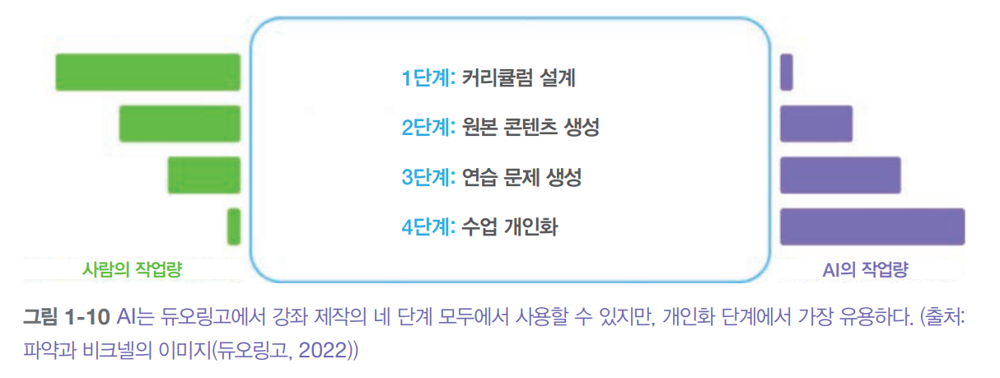  
  
위 그림에서 볼 수 있듯이 파약과 비크넬(듀오링고)은 코스 제작의 4단계 중 수업 개인화가 AI의 혜택을 가장 많이 받을 수 있는 단계라는 사실을 밝혀냈다.  
  
AI는 객관식과 주관식 퀴즈를 모두 생성하고 응답을 평가할 수 있다. 이처럼 AI는 토론 파트너가 될 수 있는데 같은 주제에 대해 다양한 관점을 제시하는 데 
있어 평균적인 사람보다 훨씬 뛰어나기 떄문이다.  
  
많은 교육 기업이 더 나은 제품을 만들기 위해 AI를 도입하는 한편, 반대로 AI에게 밥그릇을 빼앗기는 기업 또한 많이지고 있다. 예를 들어 학생들의 과제를 
도와주는 회사인 체그는 학생들이 도움을 받기 위해 AI로 눈을 돌리면서 주가가 큰폭으로 하락했다.  
  
이처럼 AI가 많은 기술을 대체할 수 있다는 것은 위험일 수 있지만 AI를 튜터로 활용해 어떤 기술이든 배울 수 있다는 점은 기회다.  
  
# **대화형 봇**  
대화형 봇은 다양한 용도로 활용할 수 있다. 정보를 찾고, 개념을 설명하고, 아이디어를 브레인스토밍하는 데 도움을 줄 수 있다. AI는 친구 또는 심리상담가가 
될 수도 있다. 심지어 원하는 사람의 성격을 모방하여 마치 그 사람과 대화하는 것 같은 경험을 느끼게 해 주기도 한다. 실제로 이 기술을 응용한 디지털 
연인은 믿을 수 없을 정도로 짧은 시간 안에 큰 인기를 얻고 있다.  
  
연구 분야에서는 대화형 봇 그룹을 활용해 사회를 시뮬레이션해서 사회 역학에 대한 연구를 수행할 수 있다는 결과도 있다.  
  
기업에서 가장 인기 있는 봇은 고객 지원 봇이다. 사람 상담원보다 비용을 절감할 수 있으면서도 더 빨리 사용자에게 응답할 수 있어 고객 경험을 개선하는 데 
도움이 된다.  
  
텍스트 기반 대화형 봇은 거대한 파도가 되었다. 하지만 이를 활용하는 인터페이스가 텍스트만 있는 것은 아니다. 구글 어시스턴트, 시리 같은 음성 비서는 
이미 수년 전부터 사용되어 왔다. 3D 대화형 봇은 이미 게임에서 흔히 볼 수 있으며 소매업과 마케팅 분야에서도 주목받고 있다.  
  
AI 기반 3D 캐릭터의 한 가지 활용 사례는 스마트 NPC, 즉 비플레이어 캐릭터다(인월드와 콘바이에 대한 엔비디아의 데모 참조).  
  
# **정보 집계**  
현대의 성공은 유용한 정보를 걸러내고 소화하는 능력에 달려있다고 믿는 사람이 많다. 하지만 이메일, 슬랙 메시지, 뉴스를 계속 확인하는 것은 때때로 
부담스러울 수 있다. 다행스럽게도 AI로 이 문제를 해결할 수 있다. AI는 정보를 취합하고 요약하는 데 뛰어난 능력을 보여주고 있다. 세일즈포스의 2023 
생성형 AI 스냅샷 연구에 따르면 생성형 AI는 사용자의 74%가 복잡한 아이디어를 추출하고 정보를 요약하는 데 사용한다.  
  
이제는 많은 사람이 다양한 AI 애플리케이션을 이용해서 문서, 계약서, 설명서 등을 처리하고 대화 형시으로 정보를 검색할 수 있다. 이 활용 사례는 문서와 대화하기 
라고도 한다. AI는 웹사이트를 요약하고, 조사하고, 원하는 주제에 대한 보고서를 작성하는 데 도움을 줄 수 있다.  
  
정보를 수집하고 정제하는 것은 기업 운영에 필수적이다. 이런 정보를 효율적으로 전파할수록 중간 관리자의 부담이 줄어들어 조직이 더 날렵해지는 데 도움이 
된다.  
  
또한 AI를 잠재 고객의 중요 정보를 파악하고 경쟁사에 대한 분석을 실행하는 데도 활용할 수 있다. 수집하는 정보가 많을수록 이를 체계화하는 것이 더욱 
중요하다. 따라서 정보 집계는 데이터 체계화와 밀접하게 관련이 있다.  
  
# **데이터 체계화**  
미래에 대해 한 가지 확실한 점은 우리가 계속해서 더 많은 데이터를 생산할 것이라는 사실이다. 스마트폰 사용자들은 계속해서 사진과 동영상을 찍을 것이다. 
그리고 기업들은 제품, 직원, 고객에 대해 모든 것을 로그로 기록할 것이며 매년 수십억 건의 계약서가 종이가 아닌 파일로 만들어지고 있다. 사진, 동영상. 
로그, PDF는 모두 비정형 또는 반정형 데이터다. 따라서 이 모든 데이터를 나중에 검색할 수 있는 방식으로 체계화하는 것이 필수적이다.  
  
AI는 바로 이런 부분에서 도움이 될 수 있다. 이미지와 동영상에 대해 텍스트 설명을 자동으로 생성하거나 텍스트 설명과 그에 맞는 시각 자료를 매칭할 수도 있다. 
  
또한 AI는 데이터 분석에 매우 뛰어나다. 데이터 시각화를 생성하고 이상치를 식별하고 매출 예측 같은 예측을 수행하는 프로그램을 작성할 수 있다. 
따라서 기업은 AI를 활용해 비정형 데이터에서 정형 정보를 추출할 수 있으며 이는 데이터를 체계화하고 검색하는 데 도움이 된다. 지능형 데이터 처리
(IDP) 산업은 매년 32.9%씩 성장하고 있다.  
  
