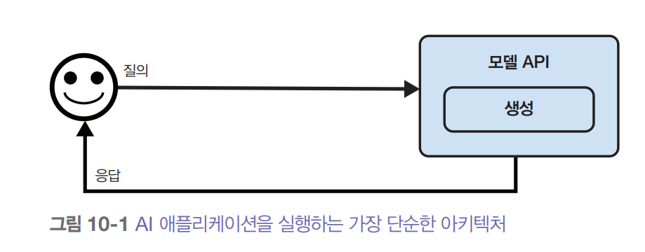
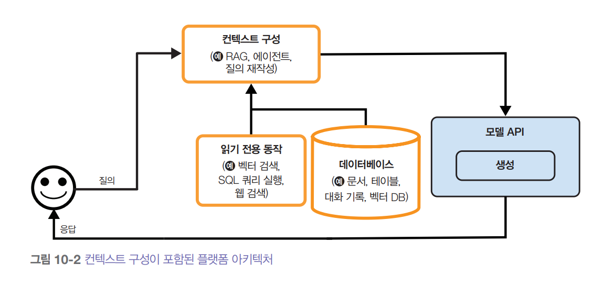

# **AI 엔지니어링 아키텍처와 사용자 피드백**  
  
# **AI 엔지니어링 아키텍처**  
완전한 형태의 AI 아키텍처는 꽤 복잡할 수 있다. 그래서 가장 단순한 아키텍처에서 시작해 점진적으로 더 많은 구성요소를 추가하는, 실제 운영 환경에서 
팀이 따를 법한 과정으로 살펴본다. AI 애플리케이션은 다양한 종류가 있지만 수많은 구성 요소를 공통으로 공유한다. 여기서 제안하는 아키텍처는 경험을 
통해 여러 회사의 다양한 애플리케이션에 두루 적용할 수 있다는 것을 확인했다. 물론 특정 애플리케이션에서는 다를 수도 있다.  
  
가장 단순한 형태는 애플리케이션이 질의를 받아 모델로 보내는 것이다. 그러면 아래 그림에서 볼 수 있듯이 모델이 응답을 생성해 사용자에게 반환한다. 
이 구조에는 컨텍스트 증강은 물론 가드레일, 최적화도 없다. 여기서 모델 API 상자는 오픈 AI, 구글, 엔트로픽 같은 서드파이 API와 자체 호스팅 모델을 
모두 가리킨다.  
  
  
  
이런 단순한 아키텍처에서 시작해서 필요할 떄마다 구성요소를 추가할 수 있다. 그 과정은 대략 다음과 같다.  
  
1. 모델이 정보 수집을 위해 외부 데이터 소스와 도구에 접근할 수 있게 해서 모델에 입력되는 컨텍스트를 보강한다.  
2. 시스템과 사용자를 보호하기 위해 가드레일을 도입한다.  
3. 복잡한 파이프라인을 지원하고 보안을 강화하기 위해 모델 라우터와 게이트웨이를 추가한다.  
4. 캐싱을 통해 지연 시간과 비용을 최적화한다.  
5. 시스템 성능을 극대화하기 위해 복잡한 로직과 실행 기능을 추가한다.  
  
실제 운영 환경처럼 점진적으로 아키텍처를 설계하고 하나씩 발전하는 순서로 내용을 전개한다. 하지만 모든 애플리케이션의 상황이 다르므로 자신에게 가장 
적합한 순서로 접근해도 좋다.  
  
# **1단계: 컨텍스트 보강**  
플랫폼을 처음 확장할 떄는 보통 시스템이 각 질의에 응답하는 데 필요한 컨텍스트를 시스템이 구축할 수 있도록 하는 메커니즘부터 추가한다. 컨텍스트는 
텍스트 검색, 이미지 검색, 표 형태 데이터 검색 등 다양한 검색 메커니즘을 통해 구성할 수 있다. 또한 웹 검색, 뉴스, 날씨, 이벤트 등의 API를 통해 모델이 
자동으로 정보를 수집할 수 있게 도구를 사용해서 컨텍스트를 보강할 수도 있다.  
  
컨텍스트 구성(context construction)은 파운데이션 모델을 위한 특성 공학(feature engineering)과 같다. 이는 모델이 출력을 생성하는 데 필요한 
정보를 제공하는 것이다. 컨텍스트 구성이 시스템의 출력 품질에 핵심적인 역할을 하기 떄문에 거의 모든 모델 API 제공업체가 이 기능을 지원한다. 예를 
들어 챗GPT, 클로드, 제미나이 같은 도구의 제공업체는 사용자가 파일을 업로드하거나 모델이 도구를 사용할 수 있도록 허용한다.  
  
하지만 모델마다 성능이 다른 것처럼 제공업체별로 컨텍스트 구성을 지원하는 방식도 제각각이다. 예를 들어 업로드할 수 있는 문서의 유형과 수에 제한이 
있을 수 있다. 전문 RAG 솔루션이라면 벡터 데이터베이스 용량이 허용하는 만큼 문서를 무제한으로 올릴 수 있지만 범용 모델 API는 문서 몇 개만 올릴 수 있게 
할 수도 있다. 또한 프레임워크마다 검색 알고리즘이나 청크 크기 같은 검색 설정도 다르다. 도구 사용에서도 마찬가지로 솔루션마다 어떤 도구를 지원하는지 
여러 함수를 병렬로 실행할 수 있는지 오래 걸리는 작업을 처리할 수 있는지 등이 다르다.  
  
컨텍스트 구성을 추가하면 아키텍처가 아래 그림과 같아진다.  
  
  
  
