# **AI 엔지니어링 아키텍처와 사용자 피드백**  
  
# **AI 엔지니어링 아키텍처**  
완전한 형태의 AI 아키텍처는 꽤 복잡할 수 있다. 그래서 가장 단순한 아키텍처에서 시작해 점진적으로 더 많은 구성요소를 추가하는, 실제 운영 환경에서 
팀이 따를 법한 과정으로 살펴본다. AI 애플리케이션은 다양한 종류가 있지만 수많은 구성 요소를 공통으로 공유한다. 여기서 제안하는 아키텍처는 경험을 
통해 여러 회사의 다양한 애플리케이션에 두루 적용할 수 있다는 것을 확인했다. 물론 특정 애플리케이션에서는 다를 수도 있다.  
  
가장 단순한 형태는 애플리케이션이 질의를 받아 모델로 보내는 것이다. 그러면 아래 그림에서 볼 수 있듯이 모델이 응답을 생성해 사용자에게 반환한다. 
이 구조에는 컨텍스트 증강은 물론 가드레일, 최적화도 없다. 여기서 모델 API 상자는 오픈 AI, 구글, 엔트로픽 같은 서드파이 API와 자체 호스팅 모델을 
모두 가리킨다.  
  
  
  
이런 단순한 아키텍처에서 시작해서 필요할 떄마다 구성요소를 추가할 수 있다. 그 과정은 대략 다음과 같다.  
  
1. 모델이 정보 수집을 위해 외부 데이터 소스와 도구에 접근할 수 있게 해서 모델에 입력되는 컨텍스트를 보강한다.  
2. 시스템과 사용자를 보호하기 위해 가드레일을 도입한다.  
3. 복잡한 파이프라인을 지원하고 보안을 강화하기 위해 모델 라우터와 게이트웨이를 추가한다.  
4. 캐싱을 통해 지연 시간과 비용을 최적화한다.  
5. 시스템 성능을 극대화하기 위해 복잡한 로직과 실행 기능을 추가한다.  
  
실제 운영 환경처럼 점진적으로 아키텍처를 설계하고 하나씩 발전하는 순서로 내용을 전개한다. 하지만 모든 애플리케이션의 상황이 다르므로 자신에게 가장 
적합한 순서로 접근해도 좋다.  
  
# **1단계: 컨텍스트 보강**  
플랫폼을 처음 확장할 떄는 보통 시스템이 각 질의에 응답하는 데 필요한 컨텍스트를 시스템이 구축할 수 있도록 하는 메커니즘부터 추가한다. 컨텍스트는 
텍스트 검색, 이미지 검색, 표 형태 데이터 검색 등 다양한 검색 메커니즘을 통해 구성할 수 있다. 또한 웹 검색, 뉴스, 날씨, 이벤트 등의 API를 통해 모델이 
자동으로 정보를 수집할 수 있게 도구를 사용해서 컨텍스트를 보강할 수도 있다.  
  
컨텍스트 구성(context construction)은 파운데이션 모델을 위한 특성 공학(feature engineering)과 같다. 이는 모델이 출력을 생성하는 데 필요한 
정보를 제공하는 것이다. 컨텍스트 구성이 시스템의 출력 품질에 핵심적인 역할을 하기 떄문에 거의 모든 모델 API 제공업체가 이 기능을 지원한다. 예를 
들어 챗GPT, 클로드, 제미나이 같은 도구의 제공업체는 사용자가 파일을 업로드하거나 모델이 도구를 사용할 수 있도록 허용한다.  
  
하지만 모델마다 성능이 다른 것처럼 제공업체별로 컨텍스트 구성을 지원하는 방식도 제각각이다. 예를 들어 업로드할 수 있는 문서의 유형과 수에 제한이 
있을 수 있다. 전문 RAG 솔루션이라면 벡터 데이터베이스 용량이 허용하는 만큼 문서를 무제한으로 올릴 수 있지만 범용 모델 API는 문서 몇 개만 올릴 수 있게 
할 수도 있다. 또한 프레임워크마다 검색 알고리즘이나 청크 크기 같은 검색 설정도 다르다. 도구 사용에서도 마찬가지로 솔루션마다 어떤 도구를 지원하는지 
여러 함수를 병렬로 실행할 수 있는지 오래 걸리는 작업을 처리할 수 있는지 등이 다르다.  
  
컨텍스트 구성을 추가하면 아키텍처가 아래 그림과 같아진다.  
  
  
  
# **2단계: 가드레일 도입하기**  
가드레일(guardrail)은 위험을 줄이고 여러분과 사용자를 보호하는 역할을 한다. 위험에 노출될 수 있는 모든 지점에 가드레일을 배치해야 한다. 가드레일은 
일반적으로 입력 가드레일과 출력 가드레일로 나눌 수 있다.  
  
# **입력 가드레일**  
입력 가드레일은 보통 두 가지 유형의 위험을 막아준다. 외부 API로 개인정보가 유출되는 것과 시스템을 망가뜨릴 수 있는 악성 프롬프트가 실행되는 것이다. 
  
공격자가 프롬프트 해킹으로 애플리케이션을 악용하는 다양한 방법이 있고 그걸 막는 방어 기법들이 있다. 이 기법은 위험을 줄일 수는 있지만 모델이 응답을 
만드는 고유한 방식과 사람이 저지르는 실수 때문에 완전히 없앨 수는 없다.  
  
외부 API로 개인정보가 유출되는 위험은 데이터를 조직 외부로 보내야 하는 외부 모델 API를 사용할 떄 문제다. 이런 일은 다음과 같은 여러 이유로 발생할 
수 있다.  
  
- 직원이 회사 기밀이나 사용자 개인정보를 프롬프트에 복사해서 서드파티 API로 전송하는 경우  
- 애플리케이션 개발자가 회사 내부 정책과 데이터를 애플리케이션의 시스템 프롬프트에 넣는 경우  
- 도구가 내부 데이터베이스에서 개인정보를 가져와서 컨텍스트에 추가하는 경우  
  
아쉽게도 서드파티 API를 사용할 떄 잠재적인 유출을 완벽하게 막을 방법은 없다. 하지만 가드레일을 통해 줄일 수는 있다. 민감한 데이터를 자동으로 탐지하는 
여러 상용 도구 중 하나를 사용하면 된다. 물론 어떤 데이터를 민감한 데이터로 탐지할지는 직접 정해야 한다. 일반적인 민감 데이터 유형은 다음과 같다.  
  
- 개인정보(주민번호, 전화번호, 계좌번호)  
- 사람 얼굴  
- 회사 지적 재산이나 기밀 정보와 관련된 특정 키워드와 문구  
  
많은 민감 데이터 탐지 도구는 AI를 사용해 잠재적으로 민감할 수 있는 정보를 식별한다. 예를 들어 특정 문자열이 실제 집 주소와 유사한지 판단하는 
방식이다. 만약 질의에 민감한 정보가 포함된 것으로 확인되면 질의 전체를 차단하거나 민감한 정보만 제거하는 두 가지 선택지가 있다. 예를 들어 사용자 
전화번호를 [전화번호] 같은 플레이스홀더로 마스킹할 수 있다. 만약 생성된 응답에 이런 플레이스홀더가 들어 있으면 아래 그림처럼 PII 역방향 사전을 
사용해서 플레이스홀더를 원래 정보로 되돌려 마스킹을 해제할 수 있다.  
  
  
  
# **출력 가드레일**  
모델은 여러 방식으로 출력 생성에 실패할 수 있다. 출력 가드레일은 다음 두 가지 기능을 수행한다.  
  
- 출력 실패 탐지  
- 다양한 실패 유형을 처리하는 정책 명시  
  
기준에 미치지 못하는 출력을 잡아내려면 실패가 어떤 모습인지 알아야 한다. 가장 알아채기 쉬운 실패는 모델이 응답해야 하는 상황에서 빈 응답을 내놓는 
경우다. 실패 양상은 애플리케이션마다 다르지만 여기서는 품질과 보안이라는 두 주요 영역에서 자주 보는 실패 사례를 살펴본다. 둘을 간단히 정리하면 
다음과 같다.  
  
1. 품질  
- 예상한 출력 형식을 따르지 않는 잘못된 형식의 응답. 예를 들어 애플리케이션은 JSON과 같은 특정 형식을 예상했지만 모델이 유효하지 않은 JSON을 
생성하는 경우  
- 모델이 만들어 낸 사실과 일치하지 않는 응답(환각)  
- 전반적으로 수준이 낮은 응답. 예를 들어 모델에게 글을 써달라고 했는데 그 결과물의 질이 매우 나쁜 경우  
  
2. 보안  
- 인종차별적이거나 성적인 콘텐츠 또는 불법적인 활동을 담은 유해한 응답  
- 개인정보나 민감한 정보가 들어 있는 응답  
- 원격 도구나 코드 실행을 유발하는 응답  
- 자사나 경쟁사에 대해 잘못 설명해서 브랜드에 위험을 초래하는 응답  
  
보안을 측정할 떄는 보안 실패뿐만 아니라 오거부율 지표(false refusal rate)도 확인하는 것이 중요하다. 보안을 너무 강하게 적용하면 괜찮은 요청까지 
차단해서 사용자의 작업을 방해하고 불편을 초래할 수 있다.  
  
많은 실패는 간단한 재시도 로직으로 완화할 수 있다. AI 모델은 확률적이라서 같은 질의를 다시 해보면 다른 응답을 얻을 수 있다. 예를 들어 응답이 비어 
있다면 X번 다시 시도하거나 비어 있지 않은 응답을 얻을 떄까지 반복한다. 마찬가지로 응답 형식이 잘못됐다면 올바른 형식의 응답이 나올 때까지 다시 
시도한다.  
  
하지만 이런 재시도 정책은 지연 시간과 비용을 늘릴 수 있다. 재시도를 할 때마다 API를 한 번 더 호출해야 하기 떄문이다. 실패 후에 재시도가 이루어지면 
사용자가 체감하는 지연 시간은 두 배가 된다. 지연 시간을 줄이기 위해 호출을 병렬로 처리할 수도 있다. 예를 들어 질의마다 첫 번째 질의가 실패할 때까지 
기다리지 말고 같은 질의를 모델에 동시에 두 번 보내고 두 개의 응답을 받아 더 나은 것을 선택하는 것이다. 이렇게 하면 API 호출 횟수는 늘어나지만 지연 
시간은 관리 가능한 수준으로 유지할 수 있다.  
  
까다로운 요청은 사람에게 넘기는 것도 일반적인 방법이다. 예를 들어 특정 문구가 포함된 질의는 상담원에게 전달할 수 있다. 어떤 팀들은 대화를 사람에게 언제 
넘길지 결정하기 위해 특화된 모델을 사용하기도 한다. 어떤 팀은 감정 분석 모델이 사용자의 메시지에서 분노를 감지하면 대화를 상담원에게 넘긴다. 다른 
팀은 사용자가 같은 대화를 맴도는 상황을 막기 위해 특정 턴 수가 지나면 대화를 상담원에게 넘긴다.  
  
# **가드레일 구현**  
가드레일에도 트레이드오프가 따른다. 그중 하나가 신뢰성과 지연 시간의 트레이드오프다. 일부 팀들은 가드레일의 중요성을 인정하면서도 지연 시간이 더 
중요하다고 말하며 결국 지연 시간을 위해 가드레일을 구현하지 않기로 결정하기도 했다.  
  
그 결과로 지연 시간을 줄이기 위한 스트림 완성 모드가 사용되기도 하는데 이 모드에서는 출력 가드레일이 제대로 작동하지 않을 수 있다. 기본적인 상황에서는 
응답을 모두 만든 다음에 사용자에게 보여주는데 이러면 시간이 오래 걸릴 수 있다. 반면 스트림 완성 모드에서는 새로운 토큰이 만들어지는 즉시 사용자에게 
전달되므로 사용자가 응답을 보기까지 기다리는 시간이 줄어든다. 단점은 부분적인 응답을 평가하기 어렵다는 것이다. 그래서 시스템 가드레일이 응답을 
차단해야 한다고 판단하기 전에 안전하지 않은 응답이 사용자에게 전달될 수 있다.  
  
얼마나 많은 가드레일을 구현할지는 모델을 자체 호스팅하는 서드파티 API를 쓰는지에 따라 달라진다. 어느 쪽이든 가드레일을 구현할 수 있지만 서드파티 
API를 사용하면 API 제공업체들이 다양한 가드레일을 기본으로 제공하기 떄문에 직접 구현해야 할 가드레일의 수를 줄일 수 있다. 반대로 모델을 자체 호스팅하면 
요청을 외부로 보낼 필요가 없어서 여러 유형의 입력 가드레일에 대한 필요성도 줄어든다.  
  
애플리케이션이 실패할 수 있는 지점이 매우 다양하므로 가드레일도 다양한 레벨에서 구현할 수 있다. 모델 제공업체는 모델의 성능과 보안을 개선하기 위해 자체 
모델에 가드레일을 탑재한다. 하지만 여기에도 안전성과 유연성의 트레이드오프를 고려해야 한다. 제약을 추가하면 모델이 더 안전해질 수 있지만 특정 활용 
사례에서는 사용성이 떨어질 수도 있기 때문이다.  
  
가드레인은 애플리케이션 개발자가 직접 구현할 수도 있다. 바로 사용할 수 있는 가드레일 솔루션은 메타의 퍼플 라마, 엔비디아의 네모 가드레일, 애저의 
파이릿, 애저의 AI 콘텐츠 필터, 퍼스펙티브 API, 오픈AI의 콘텐츠 조정 API 등이 있다. 입력과 출력의 위험이 서로 겹치는 부분이 많기 떄문에 가드레일 
솔루션은 보통 입력과 출력 모두를 보호하는 기능을 제공한다. 일부 모델 게이트웨이 또한 가드레일 기능을 제공한다.  
  
가드레일을 추가하면 아키텍처가 아래 그림과 같아진다.  
  
  
  
스코어러(scorer, 평가기)는 보통 생성 모델보다 작고 빠르지만 AI 기반인 경우가 많아서 모델 API 아래에 배치했다. 물론 스코어러는 출력 가드레일 상자에 
넣어도 된다.  
  
# **3단계: 모델 라우터와 게이트웨이 추가**  
애플리케이션이 더 많은 모델을 다루게 되면 여러 모델을 서빙하는 데 따르는 복잡성과 비용을 관리하기 위해 라우터와 게이트웨이가 필요해진다.  
  
# **라우터**  
모든 질의에 하나의 모델만 사용하는 대신 질의 유형별로 각기 다른 솔루션을 사용할 수 있다. 이런 접근 방식에는 몇 가지 장점이 있다. 첫째, 특정 질의에 
대해서 범용 모델보다 성능이 더 좋을 수 있는 특화 모델을 사용할 수 있다. 예를 들어 기술적인 문제 해결에 특화된 모델과 요금 청구에 특화된 모델을 
따로 둘 수 있다. 둘째, 비용을 절약할 수 있다. 모든 질의에 비싼 모델 하나만 쓰지 않고 단순한 질의는 저렴한 모델로 보낼 수 있다.  
  
라우터는 보통 사용자가 무엇을 하려 하는지 예측하는 의도 분류기(intent classifier)로 구성된다. 예측된 의도를 바탕으로 질의를 적절한 솔루션으로 
보낸다. 예를 들어 고객 지원 챗봇과 관련된 여러 의도를 생각해 보자.  
  
- 사용자가 비밀번호 재설정을 원하면 비밀번호 복구에 관련 FAQ 페이지로 안내한다.  
- 청구서 오류 수정을 요청하면 상담원에게 연결한다.  
- 기술적인 문제 해결에 관한 요청이면 문제 해결에 특화된 챗봇으로 보낸다.  
  
의도 분류기는 시스템이 범위를 벗어난 대화에 빠지는 것을 막을 수 있다. 질의가 부적절하다고 판단되면 API 호출을 낭비하지 않고 미리 준비된 응답 중 
하나를 사용해 정중하게 응답을 거절할 수 있다. 예를 들어 사용자가 다가오는 선거에서 누구에게 투표할 것인지 물으면 챗봇이 "저는 챗봇이라 투표할 수 
없습니다. 저희 제품에 대한 질문이 있으시면 기꺼이 도와드리겠습니다"라고 답할 수 있다.  
  
의도 분류기는 시스템이 애매한 질의를 감지하고 더 자세히 물어보는 데도 도움이 된다. 예를 들어 "Freezing"이라는 질의에 대해 시스템이 "계정을 
정지하고 싶으신 건가요, 아니면 날씨 얘기를 하시는 건가요?"라고 묻거나 단순히 "죄송합니다. 좀 더 자세히 설명해 주시겠어요?"라고 물을 수 있다.  
  
다른 종류의 라우터들은 모델이 다음에 무엇을 할지 결정하는 데 도움을 줄 수 있다. 예를 들어 여러 작업이 가능한 에이전트라면 라우터가 다음에 모델이 코드 
인터프리터를 사용해야 할지 검색 API를 사용해야 할지 결정하는 다음 행동 예측기(next-action predictor)역할을 할 수 있다. 메모리 시스템을 갖춘 
모델의 경우 라우터는 모델이 메모리 계층의 어느 부분에서 정보를 가져와야 할지 예측할 수 있다. 사용자가 현재 대화에 멜버른을 언급한 문서를 첨부했다고 
상상해 보자. 나중에 사용자가 "멜버른에서 가장 귀여운 동물은 뭐야?"라고 묻는다면 모델은 첨부된 문서의 정보에 의존할지 아니면 이 질의에 대해 인터넷을 
검색할지 결정해야 한다.  
  
의도 분류기와 다음 행동 예측기는 파운데이션 모델을 기반으로 구현할 수 있다. 많은 팀이 GPT-2, BERT, 라마 7B 같은 작은 언어 모델을 의도 분류기로 
활용한다. 아예 작은 분류기를 처음부터 직접 만드는 팀도 많다. 왜냐하면 라우터는 빠르고 저렴해야 한다. 그래야 여러 개를 사용해도 지연 시간과 비용이 
크게 늘어나지 않는다.  
  
컨텍스트 한계가 있는 다른 모델로 질의를 라우팅할 떄는 질의의 컨텍스트를 그에 맞게 조정해야 할 수도 있다. 4K 컨텍스트 한계가 있는 모델로 보낼 예정인 
1000 토큰짜리 질의가 있다고 해보자. 이떄 시스템이 웹 검색 같은 작업을 수행해서 8000 토큰의 컨텍스트를 가져왔다고 하자. 이 경우 원래 모델에 맞게 
질의의 컨텍스트를 잘라내거나 더 큰 컨텍스트 한계를 가진 모델로 질의를 라우팅할 수 있다.  
  
라우팅은 보통 모델이 수행하기 떄문에 아래 그림에서 라우팅을 모델 API 박스 안에 넣었다. 스코어러처럼 라우터도 보통 생성용 모델보다 작다.  
  
  
  
라우터를 다른 모델과 함께 묶으면 모델을 더 쉽게 관리할 수 있다. 하지만 라우팅이 검색보다 먼저 일어나는 경우가 많다는 점을 염두에 둬야 한다. 
예를 들어 검색 전에 라우터는 먼저 질의가 처리 범위 내의 요청인지 판단하고 그에 따라 검색이 필요한지 결정할 수 있다. 반면 검색이 끝난 후에 라우팅이 
이루어지는 경우도 있는데 질의를 상담원에게 전달할지 결정하는 경우가 이에 해당한다. 이처럼 라우팅의 위치는 유연하게 정할 수 있지만 보통은 라우팅 
-> 검색 -> 생성 -> 스코어링(평가)의 흐름이 가장 일반적이다.  
  
# **게이트웨이**  
모델 게이트웨이는 조직이 다양한 모델과 통합되고 안전한 방식으로 상호작용할 수 있게 해주는 중간 계층이다. 모델 게이트웨이의 가장 기본적인 기능은 
자체 호스팅 모델과 상용 API 뒤에 있는 모델을 포함한 다양한 모델에 통합 인터페이스를 제공하는 것이다. 모델 게이트웨이가 있으면 코드 유지보수가 더 쉬워진다. 
만약 모델 API가 변경되더라도 이 API에 의존하는 모든 애플리케이션을 업데이트할 필요 없이 게이트웨이만 업데이트하면 된다. 아래 그림은 모델 게이트웨이를 
개략적으로 시각화한 것이다.  
  
  
  
가장 단순한 형태의 모델 게이트웨이는 통합 래퍼다. 다음 코드 예제를 보면 모델 게이트웨이를 어떻게 구현할 수 있는지 짐작할 수 있다. 오류 확인이나 
최적화 코드가 포함되어 있지 않으므로 실제로 작동하는 코드는 아니다.  
  
code/gateway.py 참고  
  
모델 게이트웨이는 접근 제어(access control)와 비용 관리(cost management) 기능을 제공한다. 오픈 AI는 API에 접근하려는 모든 사람에게 쉽게 유출될 
위험이 있는 조직 토큰을 직접 주는 대신 중앙에서 접근을 통제할 수 있는 모델 게이트웨이라는 단일 접근 지점을 만들어 그곳에만 접근 권한을 부여한다. 
또한 게이트웨이는 어떤 사용자나 애플리케이션이 어떤 모델에 접근해야 하는지 명시하는 세분화된 접근 제어를 구현할 수도 있다. 또한 게이트웨이는 API 
호출 사용량을 모니터링하고 제한해서 남용을 방지하고 비용을 효과적으로 관리할 수 있다.  
  
모델 게이트웨이는 속도 제한이나 API 실패(안타깝게도 자주 일어난다)를 극복하기 위한 폴백 정책(fallback policy)을 만드는 데도 활용할 수 있다. 주요 
API를 사용할 수 없을 때 게이트웨이는 요청을 대체 모델로 보내거나 잠시 기다린 후 재시도하거나 다른 방식으로 실패를 원활하게 처리할 수 있다. 이렇게 
하면 애플리케이션이 중단 없이 원활하게 작동하도록 보장할 수 있다.  
  
어차피 모든 요청과 응답이 게이트웨이를 거치게 되므로 게이트웨이는 로드 밸런싱, 로깅, 분석 같은 다른 기능을 구현하기에 가장 적합한 장소다. 일부 
게이트웨이는 캐싱이나 가드레일 기능을 제공하기도 한다.  
  
게이트웨이는 비교적 구현이 간단하기 떄문에 바로 쓸 수 있는 게이트웨이가 많이 있다. 예를 들어 포트키의 AI 게이트웨이, MLflow AI 게이트웨이, 웰스심플의 
LLM 게이트웨이, 트루파운드리, 콩, 클라우드플레어 등이 있다.  
  
도구 게이트웨이 같은 비슷한 추상화 계층도 다양한 도구에 접근하는 데 유용할 수 있다. 아직 일반적인 패턴이 아니라서 다루지 않는다.  
  
우리가 살펴본 아키텍처에서는 아래 그림과 같이 게이트웨이가 모델 API 상자를 대체한다.  
  
  
  
# **4단계: 캐시로 지연 시간 줄이기**  
캐싱은 오랫동안 소프트웨어 애플리케이션에서 지연 시간과 비용을 절감하는 데 핵심적인 역할을 해왔다. 소프트웨어 캐싱의 여러 아이디어를 AI 애플리케이션에도 
활용할 수 있다. KV 캐싱과 프롬프트 캐싱을 포함한 추론 캐싱 기법은 다루었으므로 시스템 캐싱에 초점을 맞춘다. 캐싱은 오래된 기술이고 관련 자료가 
워낙 많아서 간단히 다룬다. 일반적으로 시스템 캐싱 메커니즘은 완전 일치 캐싱(exact caching)과 시멘틱 캐싱(semantic caching)이라는 두 가지 방식이 
있다.  
  
# **완전 일치 캐싱**  
완전 일치 캐싱은 정확히 같은 항목이 요청될 떄만 캐시된 항목을 사용한다. 예를 들어 사용자가 모델에게 제품 요약을 요청하면 시스템은 정확히 이 제품의 
요약이 캐시에 있는지 확인한다. 만약에 있다면 이 요약을 가져오고 없으면 제품을 요약하고 그 요약을 캐시에 저장한다.  
  
완전 일치 캐싱은 벡터 검색이 중독되는 것을 피하기 위해 임베딩 기반 검색에서도 사용된다. 들어온 질의가 이미 벡터 검색 캐시에 있다면 캐시된 결과를 
가져온다. 없다면 이 질의에 대한 벡터 검색을 수행하고 그 결과를 캐시에 저장한다.  
  
캐싱은 생각의 사슬(CoT)처럼 여러 단계를 포함하거나 검색, SQL 실행, 웹 검색처럼 시간이 오래 걸리는 동작이 포함된 질의에 특히 매력적이다.  
  
완전 일치 캐시는 빠른 검색을 위해 인메모리 저장소를 사용해 구현할 수 있다. 하지만 인메모리 저장소는 용량이 제한적이므로 속도와 저장 용량의 균형을 
맞추기 위해 PostgreSQL, 레디스 같은 데이터베이스나 계층형 저장소를 사용해 캐시를 구현할 수도 있다. 캐시 크기를 관리하고 성능을 유지하려면 제거 
정책이 중요하다. 일반적인 제거 정책은 가장 최근데 사용된 것부터 제거하는 LRU(least recently used), 가장 적제 사용된 것부터 제거하는 LFU
(least frequently used), 가장 먼저 들어온 것부터 제거하는 FIFO(first in, first out)등이 있다.  
  
질의를 캐시에 얼마나 오래 보관할지는 해당 질의가 다시 호출될 가능성이 얼마나 높은지에 따라 달라진다. "최근 주문 상태가 어떻게 되나요?" 같은 사용자별 
질의는 다른 사용자가 재사용할 가능성이 낮으므로 캐시에 저장하지 않는 것이 좋다. 마찬가지로 "오늘 날씨 어때요?" 같은 시간에 민감한 질의를 캐시에 
저장하는 것도 의미가 별로 없다. 그래서 이러한 판단을 위해 많은 팀이 질의를 캐시에 저장해야 할지 예측하는 별도의 분류기를 학습시키기도 한다.  
  
캐싱을 제대로 처리하지 않으면 데이터 유출이 일어날 수 있다. 이커머스 사이트에 모델이 있다고 상상해 보자. 사용자 X가 "전자제품 반품 정책이 어떻게 
되나요?" 같은 일반적인 질의를 한다. 반품 정책이 사용자 멤버십에 따라 달라지기 때문에 시스템은 먼저 사용자 X의 정보를 가져온 다음 X의 정보가 포함된 
응답을 생성한다. 시스템이 이 질의를 일반적인 질의로 그 응답을 캐시에 저장한다면 나중에 사용자 Y가 같은 질의를 하면 이전에 캐시된 결과가 반환되어 
Y에게 X의 정보가 노출될 수 있다.  
  
# **시멘틱 캐싱**  
완전 일치 캐싱과 달리 시맨틱 캐싱은 들어온 질의와 캐시된 항목이 완전히 똑같지 않더라도 의미적으로만 비슷하면 캐시된 항목을 사용한다. 한 사용자가 
"베트남의 수도가 어디인가요"라고 묻고 모델이 "하노이"라고 답했다고 상상해 보자. 나중에 다른 사용자가 "베트남 수도 도시는 어디인가요?"라고 묻는다. 
이는 표현은 약간 다르지만 이전과 의미상으로는 동일한 질의다. 시맨틱 캐싱을 사용하면 시스템이 새로운 질의를 처음부터 다시 계사한하는 대신 첫 번째 
쿼리의 응답을 재사용할 수 있다. 비슷한 질의를 재사용하면 캐시 적중률이 높아지고 잠재적으로 비용도 줄일 수 있다. 하지만 시맨틱 캐싱은 모델의 성능을 
저하시킬 수 있다.  
  
시맨틱 캐싱은 두 질의가 유사한지 판단할 수 있는 방법이 확실히 있을 떄만 제대로 작동한다. 일반적인 접근법은 의미적 유사도를 활용하는 것이다. 의미적 
유사도는 다음과 같이 작동한다.  
  
- 질의마다 임베딩 모델을 사용해 임베딩을 생성한다.  
- 벡터 검색으로 현재 질의 임베딩과 가장 높은 유사도 점수를 가진 캐시된 임베딩을 찾는다. 이 유사도 점수를 X라고 하자.  
- 만약 X가 특정 유사도 임곗값보다 높으면 캐시된 질의와 유사한 것으로 판단하고 캐시된 결과를 반환한다. 그렇지 않다면 현재 질의를 처리하고 그 결과와 
임베딩을 함께 캐시에 저장한다.  
  
이 접근법은 캐시된 질의에 임베딩을 저장하기 위해 벡터 데이터베이스가 필요하다.  
  
다른 캐싱 기법과 비교해 보면 시맨틱 캐싱의 가치는 좀 애매하다. 구성 요소들이 망가지기 쉽기 떄문이다. 그리고 제대로 작동하려면 좋은 품질의 임베딩, 
안정적인 벡터 검색, 신뢰할 수 있는 유사도 측정이 모두 필요하다. 심지어 적절한 유사도 임곗값을 설정하는 것도 까다로워서 시행착오를 많이 겪어야 
한다. 만약 시스템이 들어온 질의를 다른 질의와 비슷하다고 잘못 판단하면 캐시에서 가져온 응답이 틀릴 수 있다.  
  
게다가 시맨틱 캐시는 벡터 검색이 포함되어 있어서 시간도 오래 걸리고 연산량도 많다. 이 벡터 검색의 속도와 비용은 캐시에 저장된 임베딩 크기에 달려 
있다.  
  
그래도 시맨틱 캐시는 캐시 적중률이 높을 떄, 즉 많은 질의를 캐시된 결과로 제대로 답할 수 있을 떄는 여전히 가치가 있을 수 있다. 하지만 시맨틱 캐시 
같은 복잡한 기능을 추가하려면 효율성, 비용, 성능 위험을 꼼꼼히 검토해야 한다.  
  
캐시 시스템이 추가되면 플랫폼이 아래 그림과 같은 모습이 된다. KV 캐시와 프롬프트 캐시는 보통 모델 API 제공업체가 구현하기 떄문에 이 그림에는 
나와 있지 않다. 만약 이것들을 시각화한다면 모델 API 박스 안에 넣을 것이다. 생성된 응답을 캐시에 추가하는 새로운 화살표가 생겼다.  
  
  
  
# **5단계: 에이전트 패턴 추가**  
지금까지 살펴본 애플리케이션은 아직 꽤 단순한 편이다. 각 질의가 순차적인 흐름을 따르기 떄문이다. 하지만 애플리케이션 흐름은 루프, 병렬 실행, 
조건부 분기를 통해 더 복잡해질 수 있다. 에이전트 패턴은 복잡한 애플리케이션을 개발하는데 도움이 된다. 예를 들어 시스템이 출력을 생성한 후 작업을 
완료하지 못했다고 판단하고 더 많은 정보를 수집하기 위해 또 다른 검색을 수행해야 한다고 결정할 수 있다. 그러면 원래 응답과 새로 검색한 컨텍스트를 
합쳐서 같은 모델이나 다른 모델에 다시 넣는다. 이렇게 해서 아래 그림에서 보이는 것처럼 루프가 만들어진다.  
  
  
  
앞선 그림처럼 모델의 출력은 이메일 작성, 주문하기, 은행 이체 시작 같은 쓰기 작업을 호출하는 데에도 사용될 수 있다. 쓰기 작업을 통해 시스템은 
환경을 직접 변경할 수 있게 된다. 쓰기 작업은 시스템의 능력을 대폭 향상시킬 수 있지만 동시에 훨씬 더 많은 위험에 노출시키기도 한다. 모델에 쓰기 
작업 접근 구너한을 부여하는 것은 최대한 신중하게 이루어져야 한다. 쓰기 작업이 추가되면 아키텍처는 아래 그림과 같아진다.  
  
  
  
지금까지 모든 단계를 따라왔다면 이제는 아키텍처가 꽤 복잡해졌을 것이다. 복잡한 시스템은 더 많은 작업을 처리할 수 있지만 그만큼 실패의 유형과 지점도 
다양해져서 디버깅이 더 어려워진다.  
  
# **모니터링과 관찰 가능성**  
관찰 가능성을 별도의 절로 나누긴 했지만 사실 관찰 가능성은 나중에 덧붙이는 것이 아니라 제품을 설계할 떄부터 핵심에 두어야 한다. 제품이 복잡해질수록 
관찰 가능성은 더욱 중요해진다.  
  
관찰 가능성은 모든 소프트웨어 엔지니어링 분야에서 널리 쓰이는 방법이 되었고 이제는 검증된 모범 사례와 바로 쓸 수 있는 상용 및 오픈 소스 솔루션을 
갖춘 거대한 산업이기도 하다.  
  
바퀴를 다시 발명하는 일을 피하기 위해 파운데이션 모델 기반 애플리케이션에서만 나타나는 고유한 문제와 기법들에 초점을 맞춘다.  
  
모니터링의 목표는 평가의 목표와 같다. 바로 위험을 줄이고 기회를 발견하는 것이다. 모니터링이 줄여야 할 위험에는 애플리케이션 실패, 보안 공격, 
드리프트가 있다. 모니터링은 애플리케이션 개선과 비용 절감의 기회를 발견하는 데 도움이 될 수 있다. 또한 모니터링은 시스템 성능에 대한 가시성을 제공해 
책임 소재를 명확히 하는 데에도 도움을 준다.  
  
데브옵스 커뮤니티에서 나온 세 가지 지표는 시스템의 관찰 가능성 수준을 평가하는 데 도움이 된다.  
  
- 평균 탐지 시간(mean time to detection, MTTD): 문제가 생겼을 때 이를 감지하는 데 얼마나 걸리는가?  
- 평균 응답 시간(mean time to response, MTTR): 감지한 후 해결되는 데 얼마나 걸리는가?  
- 변경 실패율(change failure rate, CFR): 수정이나 롤백이 필요한 실패를 일으키는 변경이나 배포의 비율, 만약 현재 CFR을 모른다면 플랫폼을 더 
관찰 가능하도록 재설계해야 할 떄다.  
  
CFR이 높다고 해서 반드시 모니터링 시스템이 나쁘다는 건 아니다. 하지만 잘못된 변경사항이 배포되기 전에 잡힐 수 있도록 평가 파이프라인을 다시 점검해 
봐야 한다. 평가 지표가 모니터링 지표로 자연스럽게 이어져야 한다. 즉 평가 단계에서 좋은 성능을 보인 모델이면 모니터링에서도 좋은 성능을 보여야 
한다. 모니터링 중에 발견된 문제는 평가 파이프라인에 반영되어야 한다.  
  
- 모니터링 대 관찰 가능성  
2010년대 중반부터 업계에서 모니터링 대신 관찰 가능성이라는 용어를 사용하기 시작했다. 허나 이는 구분이 필요한 용어다.  
  
모니터링은 시스템의 내부 상태와 출력 사이에 어떤 연관성이 있다고 가정하지 않는다. 모니터링은 시스템의 외부 출력을 지속적으로 관찰해서 내부에서 문제가 
발생하는 시점을 알아내는 활동이지만 그 출력만으로 문제의 원인을 파악할 수 있다는 보장은 없다.  
  
반면에 관찰 가능성은 전통적인 모니터링보다 더 강력한 가정을 한다. 바로 시스템의 외부 출력에 대한 지식으로 그 내부 상태를 추론할 수 있다는 가정이다. 
관찰 가능한 시스템에 문제가 발생하면 시스템에 새로운 코드를 배포하지 않고도 시스템의 로그와 지표를 보는 것만으로 무엇이 잘못됐는지 원인을 알아낼 수 
있어야 한다. 관찰 가능성은 시스템에 문제가 발생했을 때 그 원인을 파악하는 데 도움이 되도록 시스템의 런타임에 대한 충분한 정보를 수집하고 분석할 수 
있게 시스템을 계측하는 것을 의미한다.  
  
# **지표**  
모니터링 얘기가 나오면 대부분의 사람들은 지표를 떠올린다. 하지만 지표 자체가 목적이 될 수는 없다. 솔직히 말해서 대부분의 회사는 애플리케이션의 출력 
관련성 점수가 어떤 목적에 도움이 되지 않는 한 그 점수에 별로 신경 쓰지 않는다. 지표의 목적은 뭔가 잘못됐을 때 알려주고 개선할 기회를 찾아내는 
것이다.  
  
따라서 어떤 지표를 추적할지 살펴보기 전에 어떤 실패 유형을 잡아내고 싶은지 먼저 생각하고 이런 실패들을 중심으로 지표를 설계하는 게 중요하다. 예를 
들어 애플리케이션이 환각을 일으키지 않게 하려면 환각을 탐지하는 데 도움이 되는 지표를 설계해야 한다. 관련된 지표 중 하나는 애플리케이션 출력이 
컨텍스트에서 추론 가능한지 여부일 수 있다. 애플리케이션이 API 크레딧을 펑펑 써버리지 않게 하려면 요청당 입출력 토큰 수나 캐시 비용과 캐시 적중률 
같은 API 비용 관련 지표를 추적해야 한다.  
  
파운데이션 모델은 개방형 출력을 생성할 수 있기 떄문에 다양한 문제들이 발생할 수 있다. 그러므로 지표 설계에는 분석적 사고, 통계 지식, 그리고 종종 
창의성까지 필요하다. 어떤 지표를 추적해야 할지는 애플리케이션마다 다르다.  
  
추적하기 가장 쉬운 실패 유형은 형식 실패다. 눈에 띄기 쉽고 검증하기도 쉽기 떄문이다. 예를 들어 JSON 출력을 기대한다면 모델이 유효하지 않은 JSON을 
얼마나 자주 만들어 내는지, 그리고 이런 잘못된 JSON 중에서 쉽게 고칠 수 있는 것이 얼마나 있는지 추적해야 한다. 그중에서 얼마나 많은 오류를 쉽게 
수정할 수 있는지 추적한다. 예를 들어 닫는 괄호가 빠진 경우는 고치기 쉽지만 예상되는 키가 빠진 경우는 고치기 어렵다.  
  
개방형 생성은 사실 일관성과 간결성, 창의성, 긍정성 같은 관련 생성 품질 지표를 모니터링하는 것을 고려해 보자. 이런 지표 중 상당수는 AI 평가자를 사용해서 
계산할 수 있다.  
  
안전이 문제라면 유해성 관련 지표를 추적하고 입출력에서 개인정보나 민감한 정보를 탐지할 수 있다. 가드레일이 얼마나 자주 작동하는지, 시스템이 얼마나 
자주 응답을 거부하는지도 추적하자. 그리고 시스템에 들어오는 이상한 질의도 탐지해야 한다. 흥미로운 엣지 케이스나 프롬프트 공격을 발견할 수도 있기 
떄문이다.  
  
모델 품질은 사용자의 자연어 피드백과 대화 신호를 통해서도 추론할 수 있다. 예를 들어 추적할 수 있는 간단한 지표들은 다음과 같다.  
  
- 사용자가 중간에 생성을 중단하는 빈도는 얼마나 되는가?  
- 대화당 평균 턴 수는 얼마인가?  
- 입력당 평균 토큰 수는 얼마인가? 사용자들이 더 복잡한 작업에 애플리케이션을 사용하고 있는가, 아니면 프롬프트를 더 간결하게 작성하는 방법을 배우고 
있는가?  
- 출력당 평균 토큰 수는 얼마인가? 어떤 모델이 다른 모델보다 더 장황한가? 특정 유형의 질의가 긴 응답을 만드는 경향이 있는가?  
- 모델의 출력 토큰 분포는 어떠한가? 시간이 지나면서 어떻게 변했는가? 모델이 더 다양해지고 있는가 아니면 덜 다양해지고 있는가?  
  
질의 관련 지표는 지연 시간과 비용을 추적하는 데도 중요하다. 컨텍스트와 응답이 길어질수록 일반적으로 지연 시간이 늘고 비용이 더 많이 발생하기 때문이다.  
  
애플리케이션 파이프라인의 구성 요소마다 고유한 지표가 있다. 예를 들어 RAG 애플리케이션에서 검색 품질을 평가하기 위해 주로 컨텍스트 관련성과 컨텍스트 
정확도를 사용한다. 벡터 데이터베이스는 데이터를 색인화하는 데 필요한 저장 공간의 양과 데이터를 쿼리하는 데 걸리는 시간으로 평가할 수 있다.  
  
여러 지표를 사용하게 될 가능성이 높으므로 이런 지표 간 상관관계, 특히 일일 활성 사용자(DAU), 세션 지속 시간(사용자가 애플리케이션에 활발하게 참여하는 
시간), 구독 수 같은 비즈니스 핵심 지표와 어떤 상관관계가 있는지 측정하는 것이 유용하다. 핵심 지표와 강한 상관관계를 보이는 지표는 이 핵심 지표를 
어떻게 개선할지에 대한 아이디어를 줄 수 있기 떄문이다. 반대로 전혀 상관없는 지표는 무엇을 최적화하지 말아야 할지에 대한 아이디어를 추기도 한다.  
  
지연 시간을 추적하는 것은 사용자 경험을 이해하는 데 꼭 필요하다. 일반적인 지연 시간 지표는 다음과 같다.  
  
- 첫 토큰까지 걸리는 시간(TTFT): 첫 번째 토큰이 생성되는 데 걸리는 시간  
- 출력 토큰당 시간(TPOT): 각 출력 토큰을 생성하는 데 걸리는 시간  
- 총 지연 시간: 응답을 완료하는 데 필요한 총 시간  
  
사용자 수가 늘어날 떄 시스템이 어떻게 확장되는지 보려면 이런 모든 지표를 사용자별로 추적해야 한다.  
  
비용도 추적해야 한다. 비용 관련 지표는 질의 수와 초당 토큰 수(TPS) 같은 입출력 토큰의 양이 포함된다. 속도 제한이 있는 API를 사용한다면 초당 요청 
수를 추적해서 할당된 한도 내에서 사용해서 서비스 장애를 방지하는 것이 중요하다.  
  
지표를 계산할 때는 표본 검사와 전수 검사 중에서 선택할 수 있다. 표본 검사는 데이터의 일부를 샘플링해서 문제를 빠르게 찾아내는 방식이고 전수 검사는 
모든 요청을 평가해서 포괄적인 성능 정보를 파악하는 방식이다. 어떤 방식을 선택할지는 시스템의 요구사항과 가용 자원에 따라 달라지며 둘을 적절히 
조합하면 균형 잡힌 모니터링 전략을 만들 수 있다.  
  
지표를 계산할 떄는 사용자, 릴리즈 버전, 프롬프트/체인 버전, 프롬프트/체인 타입, 시간 같은 관련 기준으로 세분화할 수 있는지 확인해야 한다. 이런 
세분화는 성능 변화를 이해하고 특정 문제를 찾아내는 데 도움이 된다.  
  
# **로그와 트레이스**  
지표는 보통 집계된 값이다. 시간이 지나면서 시스템에서 발생하는 이벤트들의 정보를 압축해서 보여준다. 덕분에 시스템이 어떻게 돌아가고 있는지 한눈에 
파악할 수 있다. 하지만 지표만으로는 답할 수 없는 질문들이 여전히 많다. 예를 들어 특정 활동과 관련된 지표가 급증한 것을 볼 때 정확한 이유를 알 
수 없고 '이런 일이 전에도 있었나?'라고 궁금해할 수 있다. 로그가 이런 질문에 답하는 데 도움을 준다.  
  
지표가 속성과 이벤트를 나타내는 수치적 측정값인 반면 로그는 추가만 가능한(append-only) 이벤트 기록이다. 운영 환경에서 디버깅 과정은 대략 이런 모습일 
것이다.  
  
- 지표가 5분 전에 뭔가 문제가 생겼다고 알려주지만 정확히 무슨 일이 있어났는지는 알려주지 않는다.  
- 5분 전쯤에 일어난 이벤트들의 로그를 보고 무슨 일이 일어났는지 알아낸다.  
- 로그의 에러와 지표를 연관지어서 올바른 문제를 식별했는지 확인한다.  
  
빠른 탐지를 위해서는 지표가 빠르게 계산되어야 한다. 빠른 대응을 위햇는 로그를 바로 확인할 수 있어야 한다. 만약 로그가 15분씩 지연된다면 5분 전에 발생한 
문제를 추적하기 위해 로그가 도착할 때까지 기다려야 한다.  
  
나중에 문제가 생겼을 때 어떤 로그를 봐야 할지 정확히 알 수 없으므로 로깅의 일반적인 원칙은 모든 것을 로깅하는 것이다. 보통 모델 API 엔드포인트, 
모델 이름, 샘플링 설정(온도, top-p, top-k, 중단 조건 등), 프롬프트 템플릿을 포함한 모든 설정을 로깅한다.  
  
또한 사용자 질의, 모델에 전송된 최종 프롬프트, 출력 그리고 중간 출력까지 모두 로깅한다. 도구를 호출했는지도 로깅한다. 도구 출력도 로깅한다. 
구성 요소가 언제 시작하고 끝났는지, 언제 충돌이 발생했는지 등을 로깅한다. 이처럼 모든 곳에서 로깅 하기 떄문에 로그를 기록할 때는 시스템의 어느 
부분에서 온 로그인지 알 수 있도록 태그와 ID를 부여해야 한다.  
  
모든 것을 로깅한다는 건 로그의 양이 매우 빠르게 증가할 수 있다는 뜻이다. 따라서 자동화된 로그 분석과 로그 이상 탐지를 위한 많은 도구가 AI로 구동된다. 
로그를 수동으로 처리하는 건 불가능에 가깝지만 사용자가 애플리케이션을 어떻게 사용하는지 감을 잡기 위해 매일 운영 데이터를 수동으로 살펴보는 것은 
유용하다. 샨카르 등의 연구에 따르면 개발자들은 더 많은 데이터와 상호작용하면서 좋은 출력과 나쁜 출력을 구성하는 것에 대한 인식이 바뀌었다. 이를 통해 
좋은 응답의 가능성을 높이도록 프롬프트를 수정하고 나쁜 응답을 잡아내기 위해 평가 파이프라인을 업데이트할 수 있었다.  
  
로그가 개별 이벤트들을 따로 기록한 것이라면 트레이스는 관련된 이벤트들을 하나로 연결해서 하나의 트랜잭션이나 프로세스의 완전한 타임라인을 만든 것이다. 
즉 처음부터 끝까지 각 단계가 어떻게 연결되는지 보여준다. 트레이스는 요청이 다양한 시스템 구성 요소와 서비스를 거쳐 실행되는 경로를 자세히 기록한 
것이다. AI 애플리케이션에서 트레이스를 하면 사용자가 질의를 보내는 시점부터 최종 응답이 반환되는 시점까지 전체 과정을 볼 수 있다. 시스템이 
뭘 했는지, 어떤 문서를 검색했는지, 모델에 보낸 최종 프롬프트가 무엇인지도 여기에 포함된다. 각 단계에 걸린 시간을 측정할 수 있다면 관련 비용까지 
함께 보여줘야 한다. 아래 그림은 랭스미스에서 요청 트레이스를 시각화한 것이다.  
  
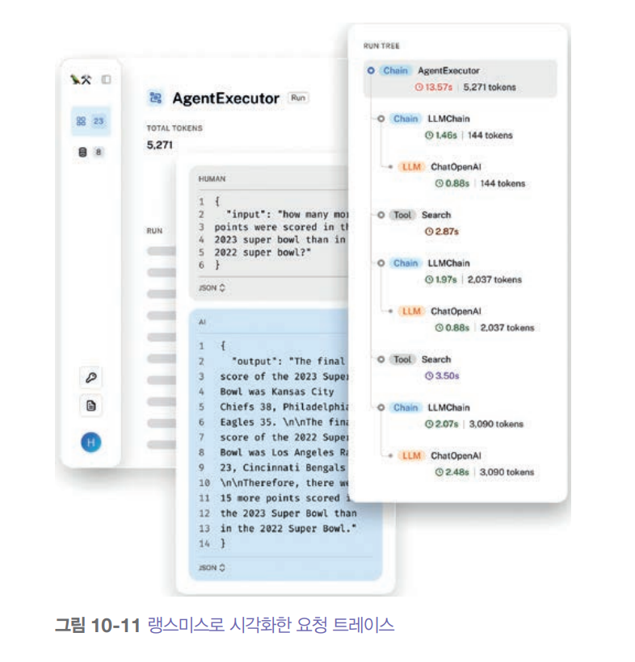  
  
트레이스를 활용할 때 이상적으로는 각 질의가 시스템을 거쳐가며 변화하는 과정을 단계별로 추적할 수 있어야 한다. 이렇게 해야 질의가 실패했을 떄 정확히 
어느 단계에서 문제가 발생했는지, 예를 들어 질의가 잘못 처리되었는지, 검색된 컨텍스트가 부적절했는지, 아니면 모델이 잘못된 응답을 생성했는지 등을 
정확히 집어낼 수 있다.  
  
# **드리프트 감지**  
시스템의 구성 요소가 많을수록 바뀔 수 있는 것들도 많아진다. AI 애플리케이션에서는 다음과 같은 것들이 바뀔 수 있다.  
  
- 시스템 프롬프트 변경  
애플리케이션의 시스템 프롬프트는 여러분이 모르는 사이에 여러 가지 이유로 변경될 수 있다. 시스템 프롬프트가 프롬프트 템플릿을 기반으로 만들어졌는데 
그 템플릿이 업데이트되었을 수 있다. 동료가 오타를 발견하고 수정했을 수도 있다. 이처럼 시스템 프롬프트가 변경되었는지 감지하기 위해서는 간단한 로직만으로도 
충분하다.  
- 사용자 행동 변화  
시간이 지나면서 사용자들은 기술에 맞춰 행동을 바꾼다. 예를 들어 사람들은 이미 구글 검색에서 더 좋은 결과를 얻으려면 질의를 어떻게 써야 하는지, 
검색 결과에서 자신의 글이 더 높은 순위에 뜨게 하려면 어떻게 해야 하는지 알아냈다. 또한 자율주행차가 다니는 지역에 사는 사람들은 이미 자율주행차를 
괴롭혀서 우선권을 빼앗는 방법도 알아냈다. 마찬가지로 사용자들이 애플리케이션에서도 더 나은 결과를 얻기 위해 행동을 바꿀 가능성이 높다. 예를 들어 
사용자들이 응답을 더 간결하게 만들기 위해 지시를 쓰는 법을 배울 수 있다. 그러면 시간이 지나면서 응답 길이가 서서히 줄어들 수 있다. 물론 지표만으로는 
이런 점진적인 감소가 왜 일어나는지 분명하지 않을 수 있다. 근본 원인을 파악하려면 별도 조사가 필요하다.  
- 기반 모델 변경  
API로 모델을 사용할 때 API 자체는 그대로인데 기반 모델이 업데이트될 수 있다. 모델 제공업체가 이런 업데이트를 항상 공개하지는 않을 수도 있으므로 
변경사항을 탐지하는 것은 사용자의 몫이다. 같은 API라도 버전이 다르면 성능에 상당한 영향을 미칠 수 있다. 예를 들어 챈 등의 연구는 GPT-4의 3월 
버전과 6월 버전, 그리고 GPT-3.5의 3월 버전과 6월 버전을 비교했을 때 벤치마크 점수에서 눈에 띄는 차이를 관찰했다. 마찬가지로 보이스플로는 구버전 
GPT-3.5-turbo-0301에서 신버전 GPT-3.5-turbo-1106으로 바꿨을 때 성능이 10% 떨어졌다고 보고했다.  
  
# **AI 파이프라인 오케스트레이션**  
AI 애플리케이션은 시간이 지날수록 여러 모델로 구성되고 많은 데이터베이스에서 데이터를 검색하며 광범위한 도구에 접근하는 등 상당히 복잡해질 수 있다. 
오케스트레이터는 이런 복잡함을 해소하기 위해 서로 다른 구성 요소들의 상호작용 방식을 정의하여 엔드투엔드 파이프라인을 구성한다. 또한 구성 요소 간에 
데이터가 원활하게 흐르도록 보장한다. 큰 틀에서 보면 오케스트레이터는 구성 요소 정의(components definition)와 체이닝(chaining)이라는 두 단계로 
작동한다.  
  
- 구성 요소 정의  
시스템이 어떤 구성 요소들을 쓰는지 오케스트레이터에 알려줘야 한다. 여기에는 다양한 모델, 검색을 위한 외부 데이터 소스, 시스템이 사용할 수 있는 
도구들이 포함된다. 모델 게이트웨이를 사용하면 모델을 더 쉽게 추가할 수 있다. 평가나 모니터링용 도구를 쓴다면 그것도 오케스트레이터에 알려줄 수 있다.  
- 체이닝  
체이닝은 기본적으로 함수를 조합하는 것이다. 즉 여러 다른 함수(구성 요소)들을 하나로 엮는다. 체이닝(파이프라이닝)에서는 사용자 질의를 받는 순간부터 
작업을 완료할 떄까지 시스템이 수행하는 단계들을 오케스트레이터에게 알려준다. 단계들의 예시는 다음과 같다.  
1. 원본 질의를 처리한다.  
2. 처리된 질의를 바탕으로 관련 데이터를 검색한다.  
3. 원본 질의와 검색된 데이터를 결합해서 모델이 예상하는 형식의 프롬프트를 만든다.  
4. 모델이 프롬프트를 바탕으로 응답을 생성한다.  
5. 응답을 평가한다.  
6. 응답이 좋다고 판단되면 사용자에게 반환한다. 그렇지 않으면 질의를 상담원에게 보낸다.  
  
오케스트레이터는 구성 요소들 사이에서 데이터를 전달하는 역할을 한다. 현재 단계의 출력이 다음 단계에서 예상하는 형식인지 확인해 주는 도구들을 제공해야 
한다. 이상적으로는 구성 요소 실패나 데이터 불일치 오류 떄문에 이런 데이터 흐름이 끊어질 때 사용자에게 알려줘야 한다.  
  
AI 파이프라인 오케스트레이터는 에어플로나 데타플로 같은 일반적인 워크플로 오케스트레이터와는 다르다.  
  
지연 시간 요구사항이 엄격한 애플리케이션의 파이프라인을 설계할 떄는 가능한 한 많은 작업을 병렬로 처리하려고 해보자. 예를 들어 라우팅 구성 요소
(질의를 어디로 보낼지 정하는 것)와 개인정보 제거 구성 요소가 있다면 이 둘을 동시에 처리할 수 있다.  
  
AI 오케스트레이션 도구는 랭체인, LlamaIndex, Flowise, Langflow, Haystack 등 많이 있다. 검색과 도구 사용은 일반적인 애플리케이션 패턴이므로 
많은 RAG 및 에이전트 프레임워크 또한 오케스트레이션 도구 역할을 한다.  
  
프로젝트를 시작할 때 바로 오케스트레이션 도구로 넘어가고 싶겠지만 처음에는 도구 없이 애플리케이션을 만들어 보는 것이 좋을 수도 있다. 외부 도구는 
어떤 것이든 복잡성을 더하기 떄문이다. 섣부르게 오케스트레이터를 추가하면 시스템이 어떻게 작동하는지에 대한 핵심 세부사항들을 추상화해서 시스템을 
이해하고 디버깅하기 어렵게 만들 수 있다.  
  
애플리케이션 개발 과정의 후반 단계에 접어들면 오케스트레이터를 도입하면 도움이 될 거라고 판단해 도입을 검토하게 되는 경우가 많다. 오케스트레이터를 평가할 
때 명심해야 할 세 가지 측면은 다음과 같다.  
  
- 통합과 확장성  
오케스트레이터가 현재 사용 중이거나 앞으로 도입할 수도 있는 구성 요소들을 지원하는지 평가해야 한다. 예를 들어 라마 모델을 쓰고 싶다면 오케스트레이터가 이를 
지원하는지 확인해야 한다. 세상에는 수많은 모델, 데이터베이스, 프레임워크가 존재하므로 오케스트레이터가 모든 것을 지원하는 것은 불가능하다. 따라서 
오케스트레이터의 확장성도 고려해야 한다. 특정 구성 요소를 지원하지 않는다면 이를 변경하는 것이 얼마나 어려울까?  
- 복잡한 파이프라인 지원  
애플리케이션이 보갖ㅂ해질수록 여러 단계와 조건부 로직을 포함하는 복잡한 파이프라인을 관리해야 할 수도 있다. 분기, 병렬 처리, 오류 처리 같은 고급 
기능을 지원하는 오케스트레이터는 이런 복잡성을 효율적으로 관리하는 데 도움이 될 것이다. 지원 여부를 확인하자.  
- 사용 편의성, 성능, 확장성  
오케스트레이터의 사용자 친화성도 중요하다. 직관적인 API, 포괄적인 문서, 강력한 커뮤니티 지원을 찾아봐야 한다. 이런 요소들이 여러분과 팀의 학습 
부담을 크게 줄여줄 수 있다. 몰래 API 호출을 시작하거나 애플리케이션에 지연 시간을 유발하는 오케스트레이터는 되도록 피하자. 또한 애플리케이션, 
개발자, 트래픽 수가 증가하면서 오케스트레이터가 효과적으로 확장될 수 있는지 확인하자.  
  
# **사용자 피드백**  
사용자 피드백은 소프트웨어 애플리케이션에서 항상 두 가지 핵심적인 역할을 해왔다. 바로 애플리케이션 성능을 평가하고 개발 방향에 정보를 제공하는 
것이다. 하지만 AI 애플리케이션에서 사용자 피드백은 훨씬 더 중요한 역할을 한다. 사용자 피드백은 독점 데이터고 데이터는 경쟁 우위의 원천이다. 
데이터 플라이휠을 만들기 위해서는 잘 설계된 사용자 피드백 시스템이 꼭 필요하다.  
  
사용자 피드백은 개별 사용자에 맞춘 모델 개인화는 물론 앞으로 나올 모델을 학습시키는 데에도 사용될 수 있다. 데이터가 점점 부족해지면서 독점 데이터의 
가치는 그 어느 때보다 높아지고 있다. 예를 들어 빨리 출시해서 초기에 사용자를 확보한 제품은 사용자 피드백이라는 독점 데이터를 쌓아가며 모델을 
계속 개선해서 경쟁자들이 따라잡기 어렵게 만든다.  
  
사용자 피드백이 곧 사용자 데이터라는 점을 기억하는 것이 중요하다. 사용자 피드백을 활용할 때는 다른 민감한 데이터를 활용할 떄와 똑같이 조심해야 한다. 
사용자의 프라이버시를 지켜야 하고 사용자는 자신의 데이터가 어떻게 사용되는지 알 권리가 있다.  
  
# **대화형 피드백 추출**  
전통적으로 피드백은 명시적 피드백(explicit feedback)과 암시적 피드백(implicit feedback)으로 나눌 수 있다. 명시적 피드백은 좋아요/싫어요, 
추천/비추천, 별점 평가, "문제가 해결되었나요?"라는 질의에 대한 예/아니오 응답처럼 애플리케이션의 명시적인 패드백 요청에 사용자가 응답처럼 제공하는 
정보다. 명시적 피드백은 어느 애플리케이션에서나 방식이 거의 비슷하다. 누군가에게 무언가를 좋아하는지 물어보는 방법은 그리 많지 않기 떄문이다. 
따라서 명시적 피드백은 비교적 이해하기 쉽다.  
  
반면 암시적 피드백은 사용자 응답이 아닌 행동에서 추론한 정보다. 예를 들어 누군가 애플리케이션이 추천한 제품을 구매했다면 이는 좋은 추천이었음을 의미한다. 
무엇을 암시적 피드백으로 간주할 수 있는지는 각 애플리케이션 내에서 사용자가 어떤 행동을 할 수 있는지에 따라 달라지므로 애플리케이션의 특성에 따라 
크게 좌우된다. 파운데이션 모델의 등장으로 완전히 새로운 애플리케이션의 세계가 열렸고 그로 인해 암시적 피드백도 다양한 형태로 나타나고 있다.  
  
많은 AI 애플리케이션이 사용하는 대화형 인터페이스는 사용자가 피드백을 주기 더 쉽게 만든다. 사용자들이 마치 일상 대화에서 피드백을 주는 것과 똑같은 
방식으로 좋은 응답은 격려하고 오류는 바로잡아줄 수 있기 떄문이다. 이제는 사용자가 AI와 대화하는 것 자체가 애플리케이션 성능과 사용자 선호도에 대한 
피드백 역할을 한다.  
  
예를 들어 호주 여행 계획을 도와주는 AI 어시스턴트를 쓰고 있다고 상상해 보자. AI에게 시드니에서 3박 숙박할 호텔을 찾아달라고 요청하자. AI가 다음과 같이 
세 곳을 추천한다.  
  
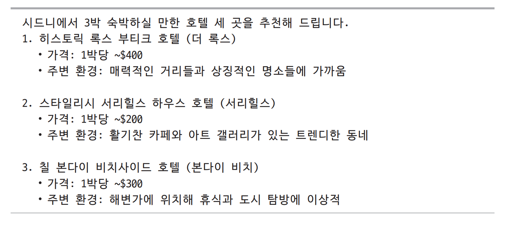  
  
이 세 가지 추천에 사용자가 어떻게 응답하느냐에 따라 선호도가 드러난다. 예를 들어 "네, 갤러리 근처에 있는 곳으로 예약해 주세요"라고 응답하면 예술에 
관심이 있다는 걸 보여준다. 반면 "$200 이하로는 없나요?"라는 응답은 가격에 민감한 선호도를 드러내며 어시스턴트가 아직 여러분을 제대로 파악하지 못했다는 
걸 시사한다.  
  
대화에서 추출한 사용자 피드백은 평가, 개발, 개인화에 사용할 수 있다.  
  
- 평가: 애플리케이션을 모니터링할 지표 도출  
- 개발: 향후 모델 학습이나 개발 방향 안내  
- 개인화: 각 사용자에게 맞게 애플리케이션을 개인화  
  
암시적 대화형 피드백은 사용자 메시지의 내용과 의사소통 패턴 둘 다에서 추론할 수 있다. 이러한 피드백은 일상 대화 속에 자연스럽게 섞여 있어서 추출하기 
어렵다. 물론 대화의 뉘앙스를 읽어내는 직관을 활용해 탐색할 초기 신호를 정의할 수는 있지만 이를 제대로 이해하려면 꼼꼼한 데이터 분석과 사용자 연구가 
필요하다.  
  
대화형 피드백은 대화형 봇의 인기를 끌면서 더 주목받게 됐지만 사실 이는 챗GPT가 나오기 몇 년 전부터 활발한 연구 분야였다. 강화 학습 커뮤니티는 2010년대 
후반부터 RL 알고리즘이 자연어 피드백에서 학습하도록 하려고 노력해 왔고 그 중 다수가 유망한 결과를 보였다. 초기 대화형 AI 애플리케이션에서도 이는 큰 
관심사였다.  
  
# **자연어 피드백**  
사용자와 나눈 대화 내용에서 추출한 피드백을 자연어 피드백이라고 한다. 이러한 피드백은 대화가 어떻게 진행되고 있는지를 파악하는 데 활용할 수 있으며 
다음은 이러한 자연어 피드백 신호의 몇 가지 예시다. 이런 신호들을 운영 환경에서 추적하면 애플리케이션 성능을 모니터링하는 데 유용하다.  
  
# **조기 종료**  
만약 사용자가 응답 생성을 중간에 멈추거나 애플리케이션(웹 및 모바일)을 종료하거나 음성 어시스턴트를 사용할 떄 모델에게 그만하라고 말하거나 단순히 
에이전트를 방치하는 경우(예: 어떤 옵션으로 진행할지 응답하지 않는 경우) 대화가 잘 이뤄지고 있지 않을 가능성이 높다.  
  
# **오류 교정**  
만약 사용자가 후속 질의를 "아니요..." 또는 "내 말은..."으로 시작한다면 모델의 응답이 빗나갔을 가능성이 높다.  
  
오류를 고치기 위해 사용자들은 요청을 다른 방식으로 표현해 볼 수 있다. 아래 그름은 모델의 오해를 바로잡으려는 사용자의 시도를 보여준다. 이렇게 
다른 방식으로 표현하려는 시도는 휴리스틱이나 ML 모델을 사용해 탐지할 수 있다.  
  
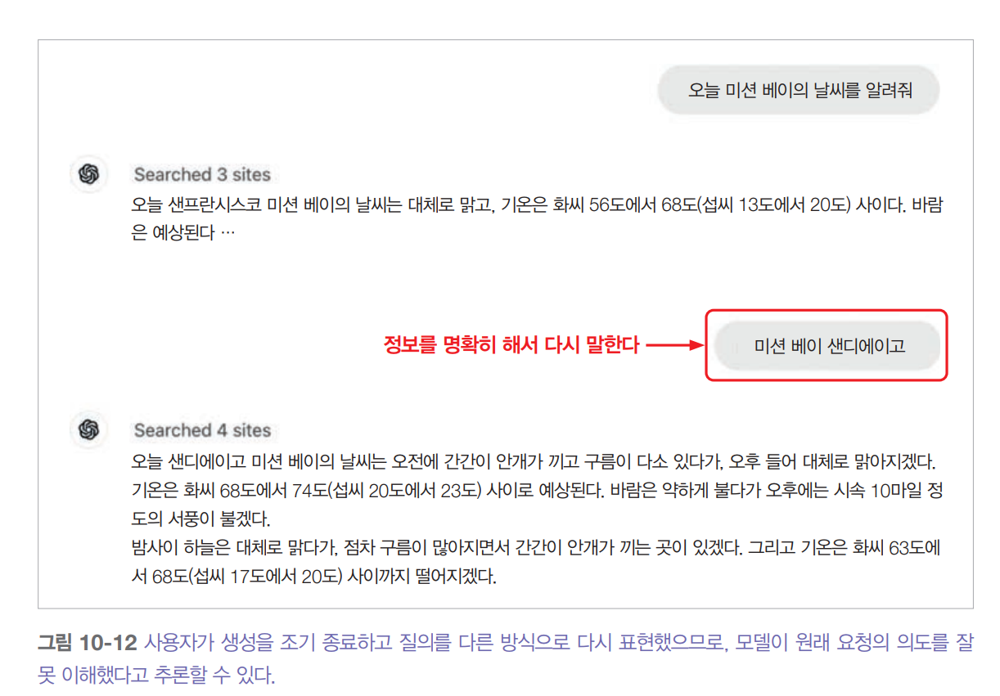  
  
그리고 사용자들은 모델이 다르게 행동했어야 할 특정 부분들을 지적할 수도 있다. 예를 들어 사용자가 모델에게 이야기를 요약해달라고 여청했는데 모델이 
등장인물을 헷갈렸다면 사용자는 "빌은 용의자예요, 피해자가 아니에요"라는 피드백을 줄 수 있다. 모델은 이런 피드백을 받아서 요약을 수정할 수 있어야 
한다.  
  
이런 행동 교정 피드백은 사용자가 에이전트를 더 좋은 행동으로 유도하는 에이전트 활용 사례에서 흔하다. 예를 들어 사용자가 에이전트에게 XYZ 회사에 
대한 시장 분석을 하라고 맡겼다면 이 사용자는 "XYZ 깃허브 페이지도 확인해 보세요" 또는 CEO의 X(구 트위터) 프로필을 확인해 보세요" 같은 피드백을 
줄 수 있다.  
  
때로는 사용자들이 "확실한가요?", "다시 확인해 보세요", "출처를 보여주세요" 같은 식으로 명시적으로 확인을 요청해서 모델이 스스로 교정하는 것을 
바랄 수도 있다. 이것은 반드시 모델이 틀린 답을 했다는 뜻은 아니다. 하지만 모델 응답에 사용자가 찾는 세부 사항이 부족하다는 의미일 수 있다. 또한 
모델을 전반적으로 못 믿겠다는 신호일 수도 있다.  
  
그래서 일부 애플리케이션에서는 사용자가 모델 응답을 직접 편집할 수 있게 한다. 예를 들어 사용자가 모델에게 코드 생성을 요청했는데 사용자가 생성된 
코드를 수정한다면 이는 애초에 생성된 코드가 완전히 옳지 않다는 매우 강한 신호다.  
  
사용자 편집은 선호 데이터의 귀중한 데이터가 되는데 이는 말 그대로 사용자가 무엇을 선호하는지 알 수 있게 해주는 데이터다. 선호도 데이터는 보통
(질의, 선호 응답, 비선호 응답) 형식으로 되어 있고 모델을 사람의 선호도에 맞게 조정하는 데 사용할 수 있다는 점을 기억하자. 사용자가 편집할 떄마다 
선호도 예시가 하나씩 만들어진다. 원래 생성된 응답이 비선호 응답이 되고 편집된 응답이 선호 응답이 되는 식이다.  
  
# **불평**  
사용자들은 종종 애플리케이션의 출력을 교정하려고 하지 않고 그냥 불평만 하는 경우도 있다. 예를 들어 그냥 응답이 틀렸다거나, 관련이 없다거나, 유해하거나, 
너무 길다거나, 세부 정보가 부족하다거나, 그냥 별로라고 불평할 수 있다. 아래 표는 대화형 대화 및 검색 피드백(FITS) 데이터셋을 자동 클러스터링해서 
얻은 8개의 자연어 피드백 그룹을 보여준다.  
  
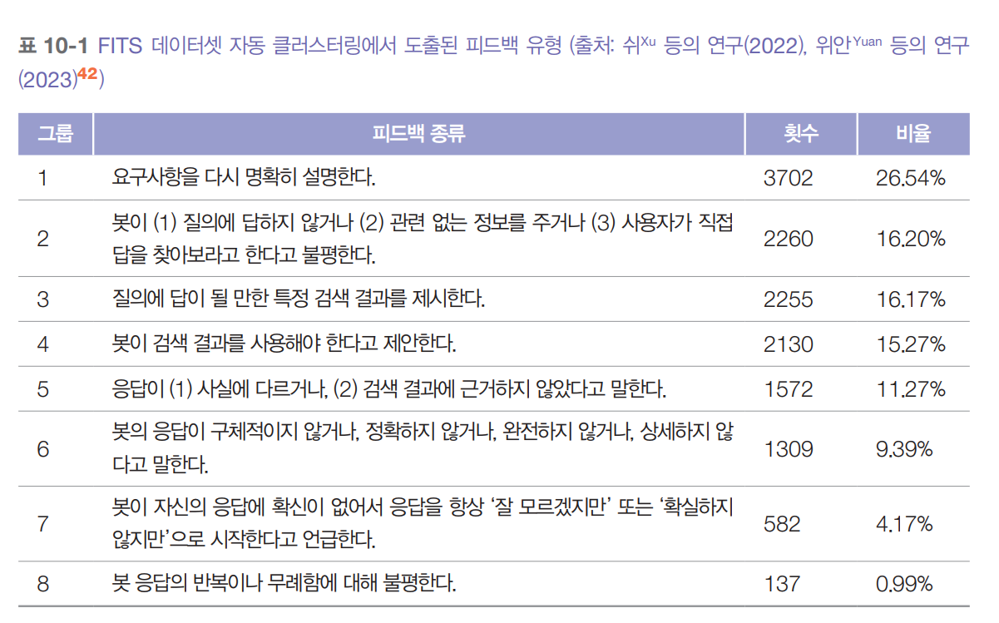  
  
봇이 어떤 지점에서 사용자를 만족시키지 못하는지 이해하는 것은 봇을 개선하는 데 매우 중요하다. 예를 들어 사용자가 장황한 응답을 좋아하지 않는다는 
것을 안다면 봇 프롬프트를 수정해서 더 간결하게 만들 수 있다. 만약 응답에 세부 정보가 부족해서 사용자가 불만족한다면 봇이 더 구체적으로 응답하도록 
프롬프트를 작성하면 된다.  
  
# **감정**  
불평을 "으..."처럼 아무 이유를 말하지 않고 단순히 부정적인 감정(좌절, 실망, 조롱 등)을 표현할 때도 있다. 디스토피아적으로 들릴 수도 있지만 
봇과의 대화 전반에 걸친 사용자의 감정을 분석하면 봇이 어떻게 작동하고 있는지에 대한 통찰력을 얻을 수 있다. 예를 들어 일부 콜센터에서는 통화 내내 
사용자 목소리를 추적한다. 만약 사용자 목소리가 점점 커진다면 무언가 잘못되고 있다는 뜻이다. 반대로 어떤 사람이 화가 난 상태로 대화를 시작했지만 
기분 좋게 끝낸다면 그 대화가 문제를 해결했을 가능성이 있다.  
  
자연어 피드백은 모델 응답에서도 추론할 수 있다. 중요한 신호 중 하나는 모델의 응답 거부율이다. 만약 모델이 "죄송합니다. 그건 잘 모르겠어요" 또는 
"저는 언어 모델이라 ... 할 수 없어요" 같은 말을 한다면 사용자는 아마 만족하지 못할 것이다.  
  
# **기타 대화형 피드백**  
메시지 대신 사용자 행동에서 얻을 수 있는 다른 유형의 대화형 피드백들도 있다.  
  
# **재생성**  
많은 애플리케이션에서 사용자는 다른 응답을 생성할 수 있으며 때로는 다른 모델로 만들기도 한다. 사용자가 재생성을 선택했다면 첫 번째 응답이 만족스럽지 
않았기 떄문일 수 있다. 하지만 첫 번째 응답이 괜찮았지만 비교할 다른 옵션을 보고 싶어서일 수도 있다. 이는 이미지나 이야기 생성 같은 창의적인 
요청에서 특히 흔하다.  
  
재생성 신호는 구독 기반 애플리케이션보다 사용량 기반 과금 애플리케이션에서 의미가 더 클 수 있다. 사용량 기반 과금 방식에서는 사용자들이 단순한 
호기심으로 추가 비용을 내가며 재생성할 할 가능성이 낮기 떄문이다.  
  
복잡한 요청에 대해 모델 응답의 일관성을 확인하기 위해 재생성을 사용할 수도 있다. 만약 두 응답이 서로 다른 모순된 응답을 내놓는다면 둘 다 신뢰할 
수 없는 결과다.  
  
재생성 후 일부 애플리케이션은 아래 그림과 같이 새로운 응답을 이전 응답과 비교해달라고 직접 요청하기도 한다. 이런 더 좋다, 더 나쁘다 데이터는 선호도 
파인튜닝에서 다시 사용될 수 있다.  
  
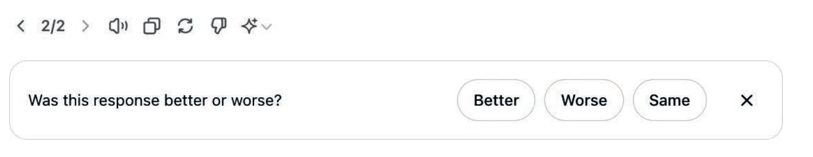  
  
# **대화 관리**  
삭제, 이름 변경, 공유, 북마크 등 사용자가 대화를 관리하기 위해 취하는 행동 또한 신호가 될 수 있다. 대화를 삭제하는 것은 그 대화가 좋지 않았다는 
꽤 강력한 신호다. 물론 부끄러운 대화라서 사용자가 흔적을 지우고 싶어하는 경우는 제외다. 대화의 이름을 바꾸는 것은 대화 내용은 좋았지만 자동으로 
생성된 제목이 별로였음을 시사한다.  
  
# **대화 길이**  
자주 추적하는 또 다른 신호는 대화당 턴 수다. 이것이 좋은 신호인지 나쁜 신호인지는 애플리케이션에 따라 다르다. AI 친구 같은 경우라면 긴 대화는 사용자가 
대화를 즐기고 있다는 뜻일 수 있다. 하지만 고객 지원처럼 생산성을 목표로 하는 챗봇의 경우 긴 대화는 봇이 사용자의 문제를 해결하는 데 비효율적이라는 
뜻일 수 있다.  
  
# **대화 다양성**  
대화 길이는 고유 토큰이나 주제 개수로 측정할 수 있는 대화 다양성과 함께 해석할 수도 있다. 예를 들어 대화는 길지만 봇이 몇 마디 말만 계속 반복한다면 
사용자는 루프에 갇혔을 수 있다.  
  
정리하자면 명시적 피드백은 해석하기는 더 쉽지만 사용자에게 추가적인 노력을 요구한다. 많은 사용자가 이런 추가적인 작업을 하려 하지 않기 떄문에 명시적 
피드백은 특히 사용자가 적은 애플리케이션에서 드물게 나타날 수 있다. 또한 명시적 피드백은 응답 편향의 문제도 있다. 예를 들어 불만족한 사용자들이 
불평할 가능성이 더 높아서 피드백이 실제보다 더 부정적으로 보일 수 있다.  
  
암시적 피드백은 명시적 피드백보다 훨씬 풍부하지만(무엇을 암시적 피드백으로 간주할지는 상상하기 나름이다) 그만큼 더 노이즈가 많다. 따라서 암시적 신호를 
해석하는 것은 어려울 수 있다. 예를 들어 사용자가 모델과 나눈 대화를 공유하는 것은 부정적인 신호일 수도 있고 긍정적인 신호일 수도 있다. 예를 들어 
어떤 사람은 주로 모델이 눈에 띄는 실수를 했을 때 대화를 공유하고 다른 사람은 주로 유용한 대화를 동료에게 공유한다. 이런 이유로 사용자들의 행동에 
이유를 이해하기 위해 사용자 자체를 연구하는 것이 중요하다.  
  
이때 신호를 더 많이 추가하면 의도를 명확히 하는 데 도움이 될 수 있다. 예를 들어 사용자가 링크를 공유한 후 질의를 다시 한다면 이는 대화가 기대에 
미치지 못했음을 알 수 있다. 대화에서 암시적 응답을 추출, 해석, 활용하는 것은 작지만 성장하는 연구 분야다.  
  
# **피드백 설계**  
# **피드백을 수집하는 시점**  
피드백은 사용자 여정 전반에 걸쳐 수집해야 한다. 특히 오류가 생겼을 때 사용자가 언제든지 피드백을 남길 수 있는 선택지를 제공해야 한다. 이때 중요한 점은 
피드백 수집 옵션이 사용자에게 거슬리지 않아야 한다는 것이다. 즉, 사용자의 흐름을 방해해서는 안 된다. 다음은 사용자 피드백이 특히 유용할 수 있는 몇 
가지 상황이다.  
  
# **처음 시작할 때**  
사용자가 막 가입했을 떄의 사용자 피드백은 사용자를 위한 초기 애플리케이션의 동작을 보정(calibrate)하는 데 도움이 될 수 있다. 예를 들어 얼굴 인식 
앱이 작동하려면 먼저 얼굴을 스캔해야하고 음성 어시스턴트는 '헤이 구글' 처럼 음성 비서를 활성화하는 단어인 호출어에 목소리를 인식시키기 위해 문장을 
소리 내어 읽어달라고 요청할 수 있다. 또한 언어 학습 앱은 실력 수준을 측정하기 위해 몇 가지 질문을 할 수도 있다. 얼굴 인식 같은 일부 애플리케이션에서는 
이런 보정이 꼭 필요하다. 하지만 다른 애플리케이션에서는 초기 피드백을 선택 사항으로 하는 것이 좋다. 왜냐하면 사용자가 제품을 사용해보는 데 마찰을 
일으키기 떄문이다. 만약 사용자가 자신의 선호도를 말하지 않으면 중립적인 옵션으로 시작해 시간이 지나면서 보정해나갈 수 있다.  
  
# **문제가 생겼을 떄**  
모델이 환각을 일으키거나, 정당한 요청을 차단하거나, 문제가 될 만한 이미지를 생성하거나, 응답하는 데 너무 오래 걸릴 때, 사용자들이 이런 문제에 
대해 언제든지 피드백을 남길 수 있어야 한다. 또는 사용자에게 응답에 싫어요를 누르거나, 같은 모델로 재생성하거나, 다른 모델로 바꿀 수 있는 선택지를 
줄 수 있다. 사용자들은 그냥 "틀렸어요", "너무 뻔해요", "더 짧은 걸로 주세요" 같은 대화형 피드백을 줄 수도 있다.  
  
이상적으로는 제품이 실수를 해도 사용자들이 여전히 작업을 완수할 수 있어야 한다. 예를 들어 모델이 제품을 잘못 분류하면 사용자가 직접 범주를 편집할 
수 있다. 이런 식으로 사용자들이 AI와 협력할 수 있게 해야 한다. 그래도 안 되면 사람과 협력할 수 있게 유도하는 것이 좋은 방법이다. 이미 많은 
고객 지원 봇이 대화가 길어지거나 사용자가 짜증내는 것 같으면 사람 상담원에게 연결해 주겠다고 한다.  
  
사람과 AI의 협력하는 예로는 이미지 생성의 인페인팅 기능이 있다. 만약 생성된 이미지가 사용자가 원하는 것과 딱 맞지 않으면 이미지의 특정 영역을 
선택하고 프롬프트를 통해 어떻게 더 좋게 만들지 설명할 수 있다. 아래 그름은 DALL-E의 인페인팅 예시를 보여준다. 이 기능은 사용자가 더 좋은 결과를 
얻는 동시에 개발자에게는 고품질의 피드백을 제공한다.  
  
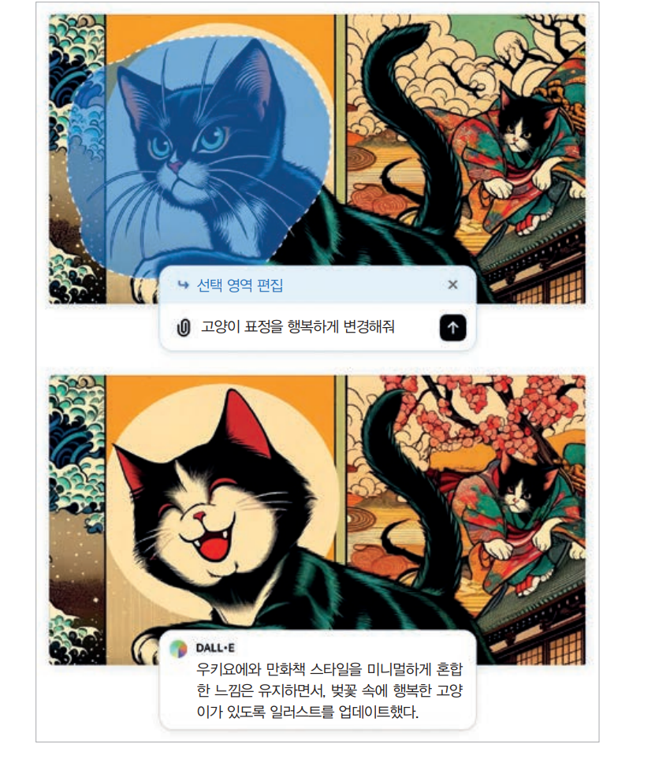  
  
# **모델의 신뢰도가 낮을 때**  
모델 자체가 특정 행동에 대해 확신하지 못할 때 사용자에게 피드백을 요청해서 신뢰도를 높일 수 있다. 예를 들어 논문을 요약해달라는 요청에 대해 
모델이 사용자가 짧고 개략적인 요약을 선호하는지 아니면 섹션별 상세 요약을 선호할지 확신하지 못한다면 두 가지 요약을 모두 생성하는 것이 사용자에게 
지연 시간을 늘리지 않는다는 가정하에 두 요약을 나란히 보여줄 수 있다. 그러면 사용자는 둘 중 더 선호하는 것을 선택할 수 있다. 이와 같은 비교 
신호는 선호도 파인튜닝에 사용할 수 있다. 아래 그림에 운영 환경에서 비교 평가의 예시가 나와 있다.  
  
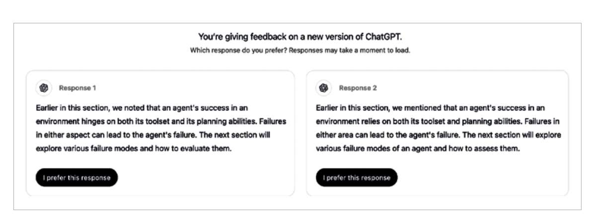  
  
사용자가 선택하도록 두 개의 전체 응답을 보여주는 것은 사용자에게 명시적 피드백을 요청하는 것을 의미한다. 물론 사용자는 두 개의 전체 응답을 다 읽을 
시간이 없거나 신중한 피드백을 줄 만큼 관심이 없을 수 있다. 이로 인해 노이즈가 많은 투표로 이어질 수 있다. 그래서 구글 제미나이 같은 일부 애플리케이션은 
아래 그림과 같이 각 응답의 시작 부분만 보여준다. 사용자들은 읽고 싶은 응답을 클릭해서 펼쳐볼 수 있다. 하지만 전체 응답과 부분 응답 중 어느 쪽을 
나란히 보여주는 것이 더 신뢰할 수 있는 피드백을 제공하는지는 여전히 명확하지 않다.  
  
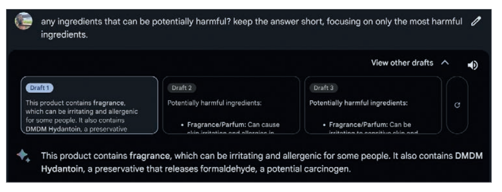  
  
또 다른 예로는 사진을 자동으로 태그해서 "X의 사진을 모두 보여줘" 같은 질의에 응답할 수 있는 사진 정리 애플리케이션이 있다. 두 사람이 동일 인물인지 
확신할 수 없을 때 아래 그림처럼 사용자에게 피드백을 요청할 수 있다.  
  
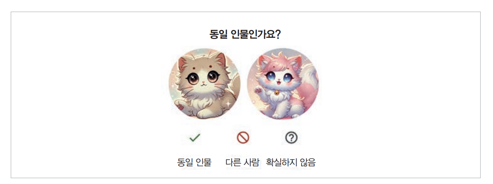  
  
여기서 긍정적인 피드백은 어떤 것인지 궁금할 수 있다. 사용자가 만족을 표현하기 위해 할 수 있는 행동에는 좋아요, 즐겨찾기 추가, 공유하기가 있다. 
하지만 애플의 휴먼 인터페이스 가이드라인에 따르면 애플리케이션은 기본적으로 좋은 결과를 내놓아야 한다는 관점에서 긍정적 피드백과 부정적 피드백을 모두 
요철하는 것을 권장하지 않는다. 좋은 결과에 대한 피드백을 요청하면 사용자들에게 좋은 결과가 예외적인 일이라는 인상을 줄 수 있다. 궁극적으로 사용자들이 
만족하면 애플리케이션을 떠나지 않고 계속 사용한다.  
  
하지만 많은 사람은 사용자들이 놀라운 것을 경험했을 때 피드백을 줄 수 있는 옵션이 있어야 한다고 생각한다. 한 유명 AI 기반 제품의 프로덕트 매니저는 
긍정적 피드백을 통해 사용자들이 일부러 시간을 내어 칭찬할 만큼 좋아하는 기능이 무엇인지 알 수 있으므로 팀에 꼭 필요하다고 언급했다. 이를 통해 
팀은 부가 가치가 거의 없는 여러 기능에 자원을 분산시키는 대신 영향력이 큰 소수의 핵심 기능을 다듬는 데 집중할 수 있다.  
  
어떤 사람들은 인터페이스를 복잡해지거나 사용자를 귀찮게 할 수 있다는 걱정으로 긍정적 피드백 요청을 피하기도 한다. 하지만 이런 위험은 피드백 요청 
빈도를 제한해서 관리할 수 있다. 예를 들어 사용자가 많다면 한 번에 1%에게만 요청을 보여주는 방식으로 대부분의 사용자 경험을 방해하지 않으면서 충분한 
피드백을 수집할 수 있다. 이때 요청을 받는 사용자 비율이 작을수록 피드백 편향 위험이 커진다는 점을 기억하자. 그래도 충분히 큰 사용자 풀이 있다면 
피드백이 의미 있는 제품 통찰을 제공할 수 있다.  
  
# **피드백 수집 방법**  
피드백은 사용자의 워크플로에 자연스럽게 녹아들어야 한다. 사용자는 별다른 수고 없이 쉽게 피드백을 줄 수 있어야 한다. 피드백 수집이 사용자 경험을 
방해하지 않아야 하며 쉽게 무시할 수도 있어야 한다. 여기에 추가로 사용자가 좋은 피드백을 제공하도록 유도하는 인센티브도 있어야 한다.  
  
좋은 피드백 설계의 예시로 자주 언급되는 것 중 하나는 이미지 생성 앱 미드저니다. 미드저니느 프롬프트마다 한 세트(4개)의 이미지를 생성하고 아래 그림처럼 
사용자에게 다음과 같은 선택지를 제공한다.  
  
1. 이 이미지들 중 하나를 확대해서 생성한다.  
2. 이 이미지들 중 하나를 변형해서 생성한다.  
3. 재생성한다.  
  
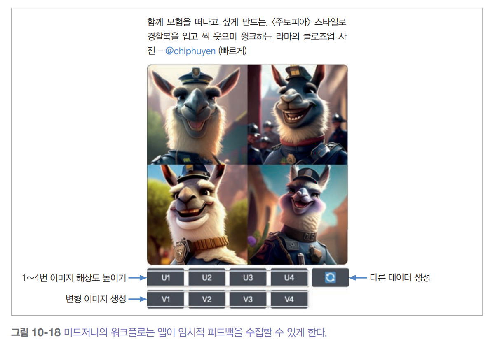  
  
이 모든 선택지는 미드저니에 서로 다른 신호를 준다. 선택지 1과 2는 네 개의 사진 중 어떤 것을 사용자가 가장 괜찮다고 생각하는지 미드저니에 알려준다. 
선택지 1은 선택된 사진에 대해 가장 강한 긍정 신호를 준다. 선택지 2는 좀 더 약한 긍정 신호를 준다. 선택지 3은 어떤 사진도 만족스럽지 않다는 신호를 
준다. 하지만 사용자들은 기존 사진이 괜찮아도 다른 가능성을 보려고 재생성을 선택할 수도 있다.  
  
깃허브 코파일럿 같은 코드 어시스턴트는 아래 그림처럼 제안을 최종 텍스트보다 연한 색으로 보여줄 수 있다. 사용자들은 탭 키를 눌러 제안을 수락하거나 
그냥 계속 타이핑해서 제안을 무시할 수 있는데 이 두 가지 행동 모두 피드백을 제공한다.  
  
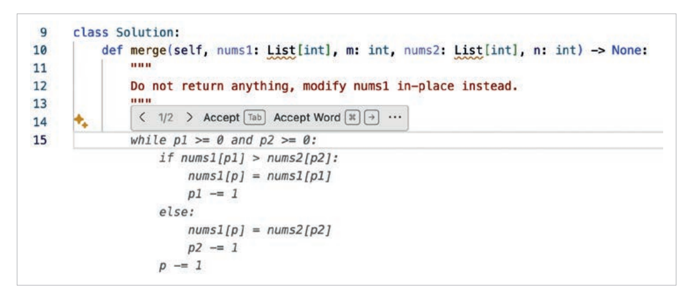  
  
아직 챗GPT와 클로드 같은 독립형 AI 애플리케이션이 해결하지 못한 문제는 사용자의 일상 워크플로에 통합되어 있지 않아서 깃허브 코파일럿처럼 기존 도구에 
내장된 제품만큼 고품질 피드백을 수집하기 어렵다는 것이다. 예를 들어 지메일 자체가 이메일 초안을 생성해서 제안하면 지메일은 이 초안을 어떻게 사용하거나 
고치는지 추적할 수 있다. 하지만 챗 GPT를 사용해 이메일을 작성하면 제안한 이메일이 실제로 전송되는지 알 수 없다.  
  
피드백만으로도 제품 분석에 도움이 될 수 있다. 예를 들어 좋아요/싫어요 정보만 봐도 사람들이 제품에 얼마나 자주 만족하거나 불만족하는지 계산할 수 있다. 
하지만 더 깊이 있는 분석을 하려면 이전 5~10번의 대화 같은 피드백 주변의 컨텍스트가 필요하다. 이런 컨텍스트가 있어야 뭐가 잘못되었는지 알 수 있다. 
하지만 컨텍스트에 개인 식별 정보가 포함될 수 있는 경우 사용자가 명시적으로 동의하지 않으면 이런 컨텍스트를 얻는 것이 불가능할 수 있다.  
  
이런 이유로 일부 제품은 서비스 약관에 분석과 제품 개선을 위해 사용자 데이터에 접근할 수 있다는 조항을 넣는다. 그런 조항이 없는 애플리케이션의 경우 
사용자 피드백을 사용자 데이터 기부와 연결할 수 있다. 이 절차는 사용자들에게 피드백과 함께 최근 상호작용 데이터를 기부(공유)해달라고 요청하는 것이다. 
예를 들어 피드백을 제출할 때 이 피드백의 컨텍스트로 최근 데이터를 공유하겠다는 박스에 체크해달라고 할 수 있다.  
  
사용자들에게 피드백이 어떻게 사용되는지 설명하면 더 많고 더 좋은 피드백을 주도록 동기를 부여할 수 있다. 사용자의 피드백을 해당 사용자를 위한 제품 
개인화에 사용하는지, 일반적인 사용량 통계를 수집하는 데 사용하는지, 아니면 새로운 모델을 학습시키는 데 사용하는지를 알려주어야 한다. 만약 사용자가 
개인정보 보호를 우려한다면 그들의 데이터가 모델 학습에 사용되지 않거나 기기 외부로 나가지 않을 것이라고 안심시켜야 한다(사실인 경우에만).  
  
또한 사용자들에게 불가능한 것을 요구하지 않아야 한다. 예를 들어 사용자에게 두 응답을 비교해달라고 요청하면서 사용자가 이해할 수도 없는 선택지를 
주고 고르라고 해서는 안 된다.  
  
최대한 사용자의 이해를 돕기 위해 선택지에 아이콘이나 툴팁을 추가하자. 그리고 사용자를 헷갈리게 할 수 있는 디자인은 피해야 한다. 애매한 설명은 노이즈가 
많은 피드백으로 이엊리 수 있다.  
  
사용자 피드백을 비공개로 할지 공개로 할지도 신중하게 결정해야 한다. 예를 들어 한 사용자가 무언가를 좋아했을 때, 이 정보를 다른 사용자에게도 보여주고 
싶을까? 초기 미드저니의 피드백이 그랬다. 즉 누군가가 이미지를 확대하거나 변형을 생성하거나, 재생성하는 행위를 모두 공개했었다(현재 유료 플랜에서 
비공개 설정 가능).  
  
공개 여부는 사용자 행동, 사용자 경험, 피드백 품질에 큰 영향을 줄 수 있다. 사용자들은 비공개 환경에서 더 솔직해지는 경향이 있는데 이는 자신의 
활동이 남들에게 평가받을 가능성이 낮기 떄문이다. 그 결과 더 좋은 품질의 신호를 얻을 수 있다. 2024년에 X는 좋아요를 비공개로 전환했다. X의 소유주인 
일론 머스크는 이 변경 후 좋아요 수가 크게 늘었다고 말했다.  
  
하지만 비공개 신호는 발견 가능성과 설명 가능성을 감소시킬 수 있다. 예를 들어 좋아요를 숨기면 사용자들이 자신이 팔로우하는 사람들이 좋아한 트윗을 
찾을 수 없다. 만약 X가 팔로우하는 사람들의 좋아요를 기반으로 트윗을 추천한다면 좋아요를 숨기는 것은 사용자들이 특정 트윗이 왜 피드에 나타나는지 
이해하기 어려운 결과를 가져올 수 있다.  
  
