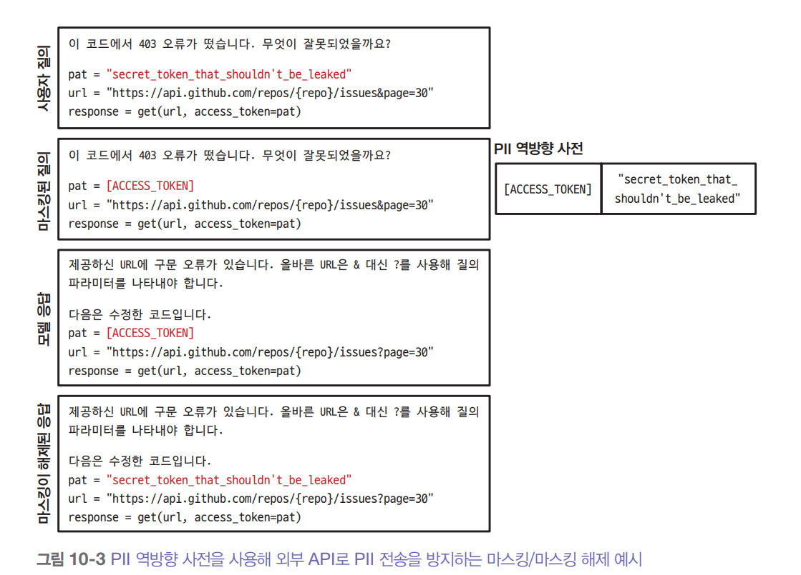
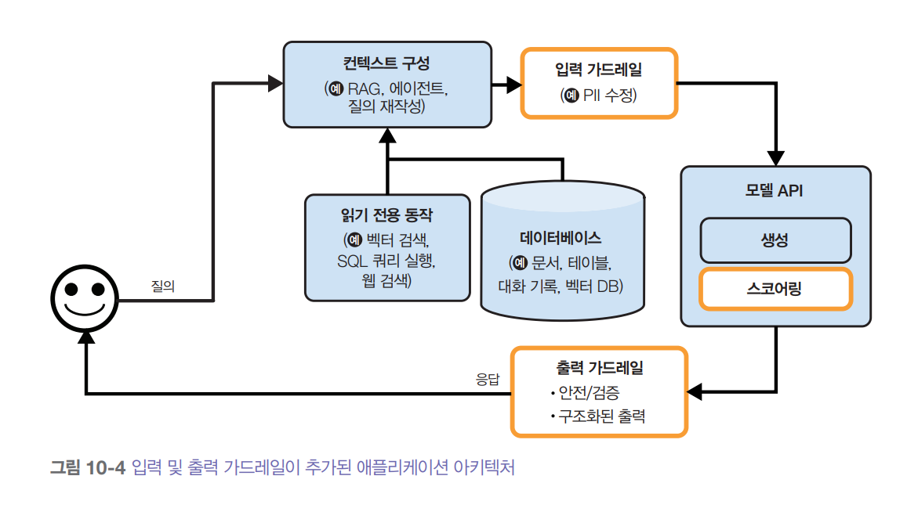
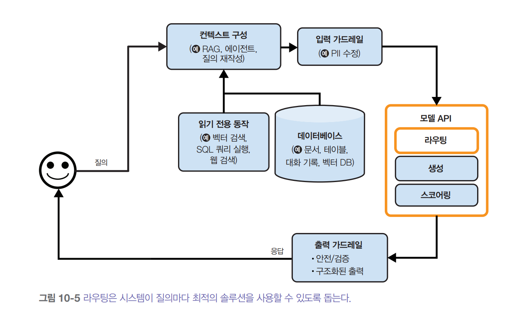
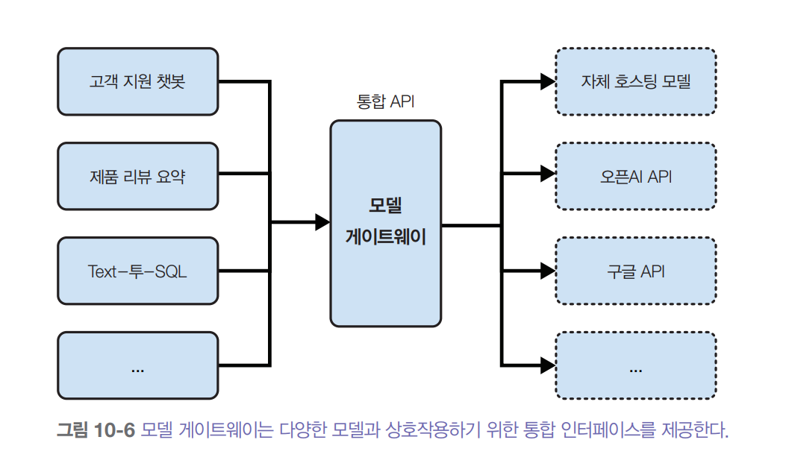
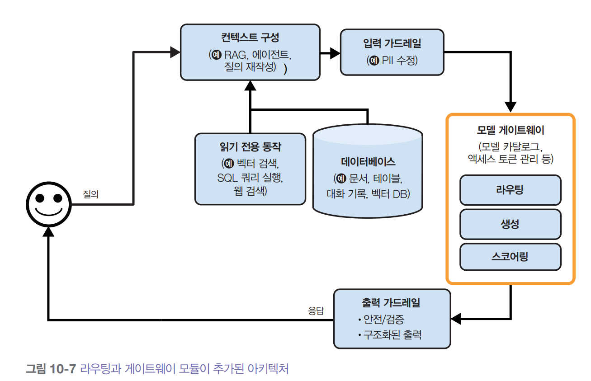
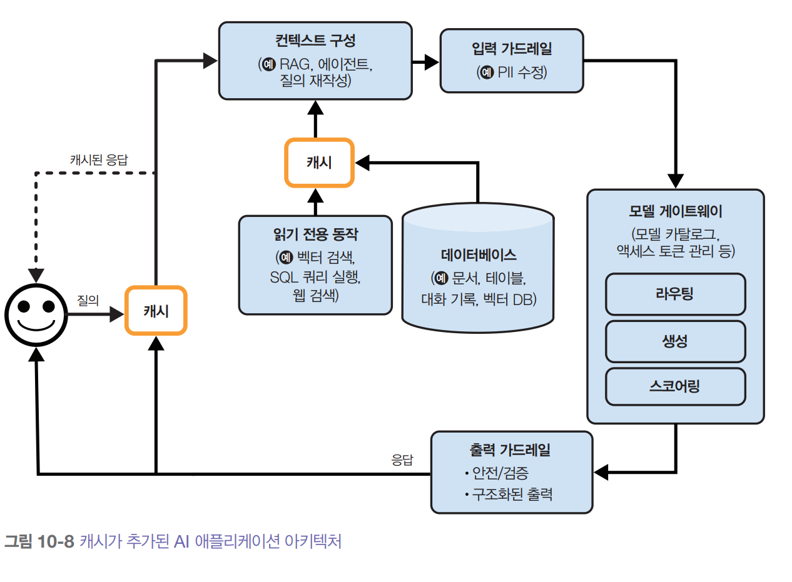
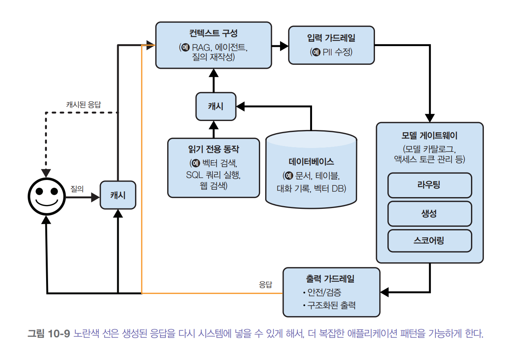
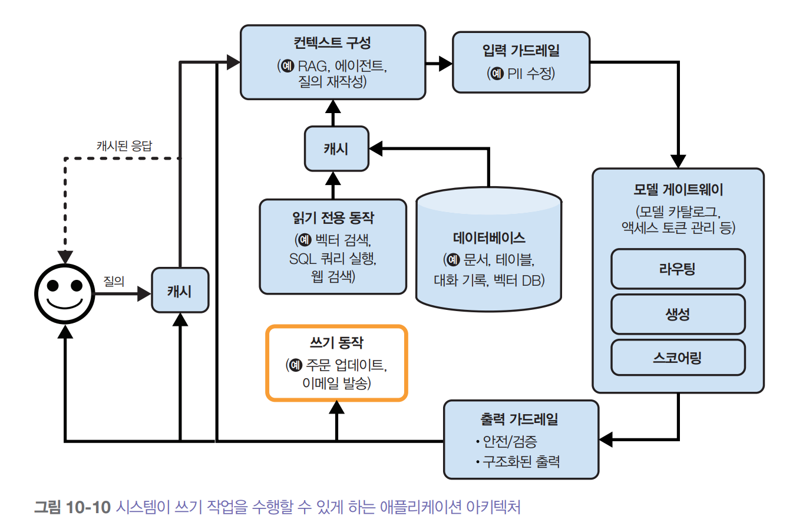

# **AI 엔지니어링 아키텍처와 사용자 피드백**  
  
# **AI 엔지니어링 아키텍처**  
완전한 형태의 AI 아키텍처는 꽤 복잡할 수 있다. 그래서 가장 단순한 아키텍처에서 시작해 점진적으로 더 많은 구성요소를 추가하는, 실제 운영 환경에서 
팀이 따를 법한 과정으로 살펴본다. AI 애플리케이션은 다양한 종류가 있지만 수많은 구성 요소를 공통으로 공유한다. 여기서 제안하는 아키텍처는 경험을 
통해 여러 회사의 다양한 애플리케이션에 두루 적용할 수 있다는 것을 확인했다. 물론 특정 애플리케이션에서는 다를 수도 있다.  
  
가장 단순한 형태는 애플리케이션이 질의를 받아 모델로 보내는 것이다. 그러면 아래 그림에서 볼 수 있듯이 모델이 응답을 생성해 사용자에게 반환한다. 
이 구조에는 컨텍스트 증강은 물론 가드레일, 최적화도 없다. 여기서 모델 API 상자는 오픈 AI, 구글, 엔트로픽 같은 서드파이 API와 자체 호스팅 모델을 
모두 가리킨다.  
  
  
  
이런 단순한 아키텍처에서 시작해서 필요할 떄마다 구성요소를 추가할 수 있다. 그 과정은 대략 다음과 같다.  
  
1. 모델이 정보 수집을 위해 외부 데이터 소스와 도구에 접근할 수 있게 해서 모델에 입력되는 컨텍스트를 보강한다.  
2. 시스템과 사용자를 보호하기 위해 가드레일을 도입한다.  
3. 복잡한 파이프라인을 지원하고 보안을 강화하기 위해 모델 라우터와 게이트웨이를 추가한다.  
4. 캐싱을 통해 지연 시간과 비용을 최적화한다.  
5. 시스템 성능을 극대화하기 위해 복잡한 로직과 실행 기능을 추가한다.  
  
실제 운영 환경처럼 점진적으로 아키텍처를 설계하고 하나씩 발전하는 순서로 내용을 전개한다. 하지만 모든 애플리케이션의 상황이 다르므로 자신에게 가장 
적합한 순서로 접근해도 좋다.  
  
# **1단계: 컨텍스트 보강**  
플랫폼을 처음 확장할 떄는 보통 시스템이 각 질의에 응답하는 데 필요한 컨텍스트를 시스템이 구축할 수 있도록 하는 메커니즘부터 추가한다. 컨텍스트는 
텍스트 검색, 이미지 검색, 표 형태 데이터 검색 등 다양한 검색 메커니즘을 통해 구성할 수 있다. 또한 웹 검색, 뉴스, 날씨, 이벤트 등의 API를 통해 모델이 
자동으로 정보를 수집할 수 있게 도구를 사용해서 컨텍스트를 보강할 수도 있다.  
  
컨텍스트 구성(context construction)은 파운데이션 모델을 위한 특성 공학(feature engineering)과 같다. 이는 모델이 출력을 생성하는 데 필요한 
정보를 제공하는 것이다. 컨텍스트 구성이 시스템의 출력 품질에 핵심적인 역할을 하기 떄문에 거의 모든 모델 API 제공업체가 이 기능을 지원한다. 예를 
들어 챗GPT, 클로드, 제미나이 같은 도구의 제공업체는 사용자가 파일을 업로드하거나 모델이 도구를 사용할 수 있도록 허용한다.  
  
하지만 모델마다 성능이 다른 것처럼 제공업체별로 컨텍스트 구성을 지원하는 방식도 제각각이다. 예를 들어 업로드할 수 있는 문서의 유형과 수에 제한이 
있을 수 있다. 전문 RAG 솔루션이라면 벡터 데이터베이스 용량이 허용하는 만큼 문서를 무제한으로 올릴 수 있지만 범용 모델 API는 문서 몇 개만 올릴 수 있게 
할 수도 있다. 또한 프레임워크마다 검색 알고리즘이나 청크 크기 같은 검색 설정도 다르다. 도구 사용에서도 마찬가지로 솔루션마다 어떤 도구를 지원하는지 
여러 함수를 병렬로 실행할 수 있는지 오래 걸리는 작업을 처리할 수 있는지 등이 다르다.  
  
컨텍스트 구성을 추가하면 아키텍처가 아래 그림과 같아진다.  
  
  
  
# **2단계: 가드레일 도입하기**  
가드레일(guardrail)은 위험을 줄이고 여러분과 사용자를 보호하는 역할을 한다. 위험에 노출될 수 있는 모든 지점에 가드레일을 배치해야 한다. 가드레일은 
일반적으로 입력 가드레일과 출력 가드레일로 나눌 수 있다.  
  
# **입력 가드레일**  
입력 가드레일은 보통 두 가지 유형의 위험을 막아준다. 외부 API로 개인정보가 유출되는 것과 시스템을 망가뜨릴 수 있는 악성 프롬프트가 실행되는 것이다. 
  
공격자가 프롬프트 해킹으로 애플리케이션을 악용하는 다양한 방법이 있고 그걸 막는 방어 기법들이 있다. 이 기법은 위험을 줄일 수는 있지만 모델이 응답을 
만드는 고유한 방식과 사람이 저지르는 실수 때문에 완전히 없앨 수는 없다.  
  
외부 API로 개인정보가 유출되는 위험은 데이터를 조직 외부로 보내야 하는 외부 모델 API를 사용할 떄 문제다. 이런 일은 다음과 같은 여러 이유로 발생할 
수 있다.  
  
- 직원이 회사 기밀이나 사용자 개인정보를 프롬프트에 복사해서 서드파티 API로 전송하는 경우  
- 애플리케이션 개발자가 회사 내부 정책과 데이터를 애플리케이션의 시스템 프롬프트에 넣는 경우  
- 도구가 내부 데이터베이스에서 개인정보를 가져와서 컨텍스트에 추가하는 경우  
  
아쉽게도 서드파티 API를 사용할 떄 잠재적인 유출을 완벽하게 막을 방법은 없다. 하지만 가드레일을 통해 줄일 수는 있다. 민감한 데이터를 자동으로 탐지하는 
여러 상용 도구 중 하나를 사용하면 된다. 물론 어떤 데이터를 민감한 데이터로 탐지할지는 직접 정해야 한다. 일반적인 민감 데이터 유형은 다음과 같다.  
  
- 개인정보(주민번호, 전화번호, 계좌번호)  
- 사람 얼굴  
- 회사 지적 재산이나 기밀 정보와 관련된 특정 키워드와 문구  
  
많은 민감 데이터 탐지 도구는 AI를 사용해 잠재적으로 민감할 수 있는 정보를 식별한다. 예를 들어 특정 문자열이 실제 집 주소와 유사한지 판단하는 
방식이다. 만약 질의에 민감한 정보가 포함된 것으로 확인되면 질의 전체를 차단하거나 민감한 정보만 제거하는 두 가지 선택지가 있다. 예를 들어 사용자 
전화번호를 [전화번호] 같은 플레이스홀더로 마스킹할 수 있다. 만약 생성된 응답에 이런 플레이스홀더가 들어 있으면 아래 그림처럼 PII 역방향 사전을 
사용해서 플레이스홀더를 원래 정보로 되돌려 마스킹을 해제할 수 있다.  
  
  
  
# **출력 가드레일**  
모델은 여러 방식으로 출력 생성에 실패할 수 있다. 출력 가드레일은 다음 두 가지 기능을 수행한다.  
  
- 출력 실패 탐지  
- 다양한 실패 유형을 처리하는 정책 명시  
  
기준에 미치지 못하는 출력을 잡아내려면 실패가 어떤 모습인지 알아야 한다. 가장 알아채기 쉬운 실패는 모델이 응답해야 하는 상황에서 빈 응답을 내놓는 
경우다. 실패 양상은 애플리케이션마다 다르지만 여기서는 품질과 보안이라는 두 주요 영역에서 자주 보는 실패 사례를 살펴본다. 둘을 간단히 정리하면 
다음과 같다.  
  
1. 품질  
- 예상한 출력 형식을 따르지 않는 잘못된 형식의 응답. 예를 들어 애플리케이션은 JSON과 같은 특정 형식을 예상했지만 모델이 유효하지 않은 JSON을 
생성하는 경우  
- 모델이 만들어 낸 사실과 일치하지 않는 응답(환각)  
- 전반적으로 수준이 낮은 응답. 예를 들어 모델에게 글을 써달라고 했는데 그 결과물의 질이 매우 나쁜 경우  
  
2. 보안  
- 인종차별적이거나 성적인 콘텐츠 또는 불법적인 활동을 담은 유해한 응답  
- 개인정보나 민감한 정보가 들어 있는 응답  
- 원격 도구나 코드 실행을 유발하는 응답  
- 자사나 경쟁사에 대해 잘못 설명해서 브랜드에 위험을 초래하는 응답  
  
보안을 측정할 떄는 보안 실패뿐만 아니라 오거부율 지표(false refusal rate)도 확인하는 것이 중요하다. 보안을 너무 강하게 적용하면 괜찮은 요청까지 
차단해서 사용자의 작업을 방해하고 불편을 초래할 수 있다.  
  
많은 실패는 간단한 재시도 로직으로 완화할 수 있다. AI 모델은 확률적이라서 같은 질의를 다시 해보면 다른 응답을 얻을 수 있다. 예를 들어 응답이 비어 
있다면 X번 다시 시도하거나 비어 있지 않은 응답을 얻을 떄까지 반복한다. 마찬가지로 응답 형식이 잘못됐다면 올바른 형식의 응답이 나올 때까지 다시 
시도한다.  
  
하지만 이런 재시도 정책은 지연 시간과 비용을 늘릴 수 있다. 재시도를 할 때마다 API를 한 번 더 호출해야 하기 떄문이다. 실패 후에 재시도가 이루어지면 
사용자가 체감하는 지연 시간은 두 배가 된다. 지연 시간을 줄이기 위해 호출을 병렬로 처리할 수도 있다. 예를 들어 질의마다 첫 번째 질의가 실패할 때까지 
기다리지 말고 같은 질의를 모델에 동시에 두 번 보내고 두 개의 응답을 받아 더 나은 것을 선택하는 것이다. 이렇게 하면 API 호출 횟수는 늘어나지만 지연 
시간은 관리 가능한 수준으로 유지할 수 있다.  
  
까다로운 요청은 사람에게 넘기는 것도 일반적인 방법이다. 예를 들어 특정 문구가 포함된 질의는 상담원에게 전달할 수 있다. 어떤 팀들은 대화를 사람에게 언제 
넘길지 결정하기 위해 특화된 모델을 사용하기도 한다. 어떤 팀은 감정 분석 모델이 사용자의 메시지에서 분노를 감지하면 대화를 상담원에게 넘긴다. 다른 
팀은 사용자가 같은 대화를 맴도는 상황을 막기 위해 특정 턴 수가 지나면 대화를 상담원에게 넘긴다.  
  
# **가드레일 구현**  
가드레일에도 트레이드오프가 따른다. 그중 하나가 신뢰성과 지연 시간의 트레이드오프다. 일부 팀들은 가드레일의 중요성을 인정하면서도 지연 시간이 더 
중요하다고 말하며 결국 지연 시간을 위해 가드레일을 구현하지 않기로 결정하기도 했다.  
  
그 결과로 지연 시간을 줄이기 위한 스트림 완성 모드가 사용되기도 하는데 이 모드에서는 출력 가드레일이 제대로 작동하지 않을 수 있다. 기본적인 상황에서는 
응답을 모두 만든 다음에 사용자에게 보여주는데 이러면 시간이 오래 걸릴 수 있다. 반면 스트림 완성 모드에서는 새로운 토큰이 만들어지는 즉시 사용자에게 
전달되므로 사용자가 응답을 보기까지 기다리는 시간이 줄어든다. 단점은 부분적인 응답을 평가하기 어렵다는 것이다. 그래서 시스템 가드레일이 응답을 
차단해야 한다고 판단하기 전에 안전하지 않은 응답이 사용자에게 전달될 수 있다.  
  
얼마나 많은 가드레일을 구현할지는 모델을 자체 호스팅하는 서드파티 API를 쓰는지에 따라 달라진다. 어느 쪽이든 가드레일을 구현할 수 있지만 서드파티 
API를 사용하면 API 제공업체들이 다양한 가드레일을 기본으로 제공하기 떄문에 직접 구현해야 할 가드레일의 수를 줄일 수 있다. 반대로 모델을 자체 호스팅하면 
요청을 외부로 보낼 필요가 없어서 여러 유형의 입력 가드레일에 대한 필요성도 줄어든다.  
  
애플리케이션이 실패할 수 있는 지점이 매우 다양하므로 가드레일도 다양한 레벨에서 구현할 수 있다. 모델 제공업체는 모델의 성능과 보안을 개선하기 위해 자체 
모델에 가드레일을 탑재한다. 하지만 여기에도 안전성과 유연성의 트레이드오프를 고려해야 한다. 제약을 추가하면 모델이 더 안전해질 수 있지만 특정 활용 
사례에서는 사용성이 떨어질 수도 있기 때문이다.  
  
가드레인은 애플리케이션 개발자가 직접 구현할 수도 있다. 바로 사용할 수 있는 가드레일 솔루션은 메타의 퍼플 라마, 엔비디아의 네모 가드레일, 애저의 
파이릿, 애저의 AI 콘텐츠 필터, 퍼스펙티브 API, 오픈AI의 콘텐츠 조정 API 등이 있다. 입력과 출력의 위험이 서로 겹치는 부분이 많기 떄문에 가드레일 
솔루션은 보통 입력과 출력 모두를 보호하는 기능을 제공한다. 일부 모델 게이트웨이 또한 가드레일 기능을 제공한다.  
  
가드레일을 추가하면 아키텍처가 아래 그림과 같아진다.  
  
  
  
스코어러(scorer, 평가기)는 보통 생성 모델보다 작고 빠르지만 AI 기반인 경우가 많아서 모델 API 아래에 배치했다. 물론 스코어러는 출력 가드레일 상자에 
넣어도 된다.  
  
# **3단계: 모델 라우터와 게이트웨이 추가**  
애플리케이션이 더 많은 모델을 다루게 되면 여러 모델을 서빙하는 데 따르는 복잡성과 비용을 관리하기 위해 라우터와 게이트웨이가 필요해진다.  
  
# **라우터**  
모든 질의에 하나의 모델만 사용하는 대신 질의 유형별로 각기 다른 솔루션을 사용할 수 있다. 이런 접근 방식에는 몇 가지 장점이 있다. 첫째, 특정 질의에 
대해서 범용 모델보다 성능이 더 좋을 수 있는 특화 모델을 사용할 수 있다. 예를 들어 기술적인 문제 해결에 특화된 모델과 요금 청구에 특화된 모델을 
따로 둘 수 있다. 둘째, 비용을 절약할 수 있다. 모든 질의에 비싼 모델 하나만 쓰지 않고 단순한 질의는 저렴한 모델로 보낼 수 있다.  
  
라우터는 보통 사용자가 무엇을 하려 하는지 예측하는 의도 분류기(intent classifier)로 구성된다. 예측된 의도를 바탕으로 질의를 적절한 솔루션으로 
보낸다. 예를 들어 고객 지원 챗봇과 관련된 여러 의도를 생각해 보자.  
  
- 사용자가 비밀번호 재설정을 원하면 비밀번호 복구에 관련 FAQ 페이지로 안내한다.  
- 청구서 오류 수정을 요청하면 상담원에게 연결한다.  
- 기술적인 문제 해결에 관한 요청이면 문제 해결에 특화된 챗봇으로 보낸다.  
  
의도 분류기는 시스템이 범위를 벗어난 대화에 빠지는 것을 막을 수 있다. 질의가 부적절하다고 판단되면 API 호출을 낭비하지 않고 미리 준비된 응답 중 
하나를 사용해 정중하게 응답을 거절할 수 있다. 예를 들어 사용자가 다가오는 선거에서 누구에게 투표할 것인지 물으면 챗봇이 "저는 챗봇이라 투표할 수 
없습니다. 저희 제품에 대한 질문이 있으시면 기꺼이 도와드리겠습니다"라고 답할 수 있다.  
  
의도 분류기는 시스템이 애매한 질의를 감지하고 더 자세히 물어보는 데도 도움이 된다. 예를 들어 "Freezing"이라는 질의에 대해 시스템이 "계정을 
정지하고 싶으신 건가요, 아니면 날씨 얘기를 하시는 건가요?"라고 묻거나 단순히 "죄송합니다. 좀 더 자세히 설명해 주시겠어요?"라고 물을 수 있다.  
  
다른 종류의 라우터들은 모델이 다음에 무엇을 할지 결정하는 데 도움을 줄 수 있다. 예를 들어 여러 작업이 가능한 에이전트라면 라우터가 다음에 모델이 코드 
인터프리터를 사용해야 할지 검색 API를 사용해야 할지 결정하는 다음 행동 예측기(next-action predictor)역할을 할 수 있다. 메모리 시스템을 갖춘 
모델의 경우 라우터는 모델이 메모리 계층의 어느 부분에서 정보를 가져와야 할지 예측할 수 있다. 사용자가 현재 대화에 멜버른을 언급한 문서를 첨부했다고 
상상해 보자. 나중에 사용자가 "멜버른에서 가장 귀여운 동물은 뭐야?"라고 묻는다면 모델은 첨부된 문서의 정보에 의존할지 아니면 이 질의에 대해 인터넷을 
검색할지 결정해야 한다.  
  
의도 분류기와 다음 행동 예측기는 파운데이션 모델을 기반으로 구현할 수 있다. 많은 팀이 GPT-2, BERT, 라마 7B 같은 작은 언어 모델을 의도 분류기로 
활용한다. 아예 작은 분류기를 처음부터 직접 만드는 팀도 많다. 왜냐하면 라우터는 빠르고 저렴해야 한다. 그래야 여러 개를 사용해도 지연 시간과 비용이 
크게 늘어나지 않는다.  
  
컨텍스트 한계가 있는 다른 모델로 질의를 라우팅할 떄는 질의의 컨텍스트를 그에 맞게 조정해야 할 수도 있다. 4K 컨텍스트 한계가 있는 모델로 보낼 예정인 
1000 토큰짜리 질의가 있다고 해보자. 이떄 시스템이 웹 검색 같은 작업을 수행해서 8000 토큰의 컨텍스트를 가져왔다고 하자. 이 경우 원래 모델에 맞게 
질의의 컨텍스트를 잘라내거나 더 큰 컨텍스트 한계를 가진 모델로 질의를 라우팅할 수 있다.  
  
라우팅은 보통 모델이 수행하기 떄문에 아래 그림에서 라우팅을 모델 API 박스 안에 넣었다. 스코어러처럼 라우터도 보통 생성용 모델보다 작다.  
  
  
  
라우터를 다른 모델과 함께 묶으면 모델을 더 쉽게 관리할 수 있다. 하지만 라우팅이 검색보다 먼저 일어나는 경우가 많다는 점을 염두에 둬야 한다. 
예를 들어 검색 전에 라우터는 먼저 질의가 처리 범위 내의 요청인지 판단하고 그에 따라 검색이 필요한지 결정할 수 있다. 반면 검색이 끝난 후에 라우팅이 
이루어지는 경우도 있는데 질의를 상담원에게 전달할지 결정하는 경우가 이에 해당한다. 이처럼 라우팅의 위치는 유연하게 정할 수 있지만 보통은 라우팅 
-> 검색 -> 생성 -> 스코어링(평가)의 흐름이 가장 일반적이다.  
  
# **게이트웨이**  
모델 게이트웨이는 조직이 다양한 모델과 통합되고 안전한 방식으로 상호작용할 수 있게 해주는 중간 계층이다. 모델 게이트웨이의 가장 기본적인 기능은 
자체 호스팅 모델과 상용 API 뒤에 있는 모델을 포함한 다양한 모델에 통합 인터페이스를 제공하는 것이다. 모델 게이트웨이가 있으면 코드 유지보수가 더 쉬워진다. 
만약 모델 API가 변경되더라도 이 API에 의존하는 모든 애플리케이션을 업데이트할 필요 없이 게이트웨이만 업데이트하면 된다. 아래 그림은 모델 게이트웨이를 
개략적으로 시각화한 것이다.  
  
  
  
가장 단순한 형태의 모델 게이트웨이는 통합 래퍼다. 다음 코드 예제를 보면 모델 게이트웨이를 어떻게 구현할 수 있는지 짐작할 수 있다. 오류 확인이나 
최적화 코드가 포함되어 있지 않으므로 실제로 작동하는 코드는 아니다.  
  
code/gateway.py 참고  
  
모델 게이트웨이는 접근 제어(access control)와 비용 관리(cost management) 기능을 제공한다. 오픈 AI는 API에 접근하려는 모든 사람에게 쉽게 유출될 
위험이 있는 조직 토큰을 직접 주는 대신 중앙에서 접근을 통제할 수 있는 모델 게이트웨이라는 단일 접근 지점을 만들어 그곳에만 접근 권한을 부여한다. 
또한 게이트웨이는 어떤 사용자나 애플리케이션이 어떤 모델에 접근해야 하는지 명시하는 세분화된 접근 제어를 구현할 수도 있다. 또한 게이트웨이는 API 
호출 사용량을 모니터링하고 제한해서 남용을 방지하고 비용을 효과적으로 관리할 수 있다.  
  
모델 게이트웨이는 속도 제한이나 API 실패(안타깝게도 자주 일어난다)를 극복하기 위한 폴백 정책(fallback policy)을 만드는 데도 활용할 수 있다. 주요 
API를 사용할 수 없을 때 게이트웨이는 요청을 대체 모델로 보내거나 잠시 기다린 후 재시도하거나 다른 방식으로 실패를 원활하게 처리할 수 있다. 이렇게 
하면 애플리케이션이 중단 없이 원활하게 작동하도록 보장할 수 있다.  
  
어차피 모든 요청과 응답이 게이트웨이를 거치게 되므로 게이트웨이는 로드 밸런싱, 로깅, 분석 같은 다른 기능을 구현하기에 가장 적합한 장소다. 일부 
게이트웨이는 캐싱이나 가드레일 기능을 제공하기도 한다.  
  
게이트웨이는 비교적 구현이 간단하기 떄문에 바로 쓸 수 있는 게이트웨이가 많이 있다. 예를 들어 포트키의 AI 게이트웨이, MLflow AI 게이트웨이, 웰스심플의 
LLM 게이트웨이, 트루파운드리, 콩, 클라우드플레어 등이 있다.  
  
도구 게이트웨이 같은 비슷한 추상화 계층도 다양한 도구에 접근하는 데 유용할 수 있다. 아직 일반적인 패턴이 아니라서 다루지 않는다.  
  
우리가 살펴본 아키텍처에서는 아래 그림과 같이 게이트웨이가 모델 API 상자를 대체한다.  
  
  
  
# **4단계: 캐시로 지연 시간 줄이기**  
캐싱은 오랫동안 소프트웨어 애플리케이션에서 지연 시간과 비용을 절감하는 데 핵심적인 역할을 해왔다. 소프트웨어 캐싱의 여러 아이디어를 AI 애플리케이션에도 
활용할 수 있다. KV 캐싱과 프롬프트 캐싱을 포함한 추론 캐싱 기법은 다루었으므로 시스템 캐싱에 초점을 맞춘다. 캐싱은 오래된 기술이고 관련 자료가 
워낙 많아서 간단히 다룬다. 일반적으로 시스템 캐싱 메커니즘은 완전 일치 캐싱(exact caching)과 시멘틱 캐싱(semantic caching)이라는 두 가지 방식이 
있다.  
  
# **완전 일치 캐싱**  
완전 일치 캐싱은 정확히 같은 항목이 요청될 떄만 캐시된 항목을 사용한다. 예를 들어 사용자가 모델에게 제품 요약을 요청하면 시스템은 정확히 이 제품의 
요약이 캐시에 있는지 확인한다. 만약에 있다면 이 요약을 가져오고 없으면 제품을 요약하고 그 요약을 캐시에 저장한다.  
  
완전 일치 캐싱은 벡터 검색이 중독되는 것을 피하기 위해 임베딩 기반 검색에서도 사용된다. 들어온 질의가 이미 벡터 검색 캐시에 있다면 캐시된 결과를 
가져온다. 없다면 이 질의에 대한 벡터 검색을 수행하고 그 결과를 캐시에 저장한다.  
  
캐싱은 생각의 사슬(CoT)처럼 여러 단계를 포함하거나 검색, SQL 실행, 웹 검색처럼 시간이 오래 걸리는 동작이 포함된 질의에 특히 매력적이다.  
  
완전 일치 캐시는 빠른 검색을 위해 인메모리 저장소를 사용해 구현할 수 있다. 하지만 인메모리 저장소는 용량이 제한적이므로 속도와 저장 용량의 균형을 
맞추기 위해 PostgreSQL, 레디스 같은 데이터베이스나 계층형 저장소를 사용해 캐시를 구현할 수도 있다. 캐시 크기를 관리하고 성능을 유지하려면 제거 
정책이 중요하다. 일반적인 제거 정책은 가장 최근데 사용된 것부터 제거하는 LRU(least recently used), 가장 적제 사용된 것부터 제거하는 LFU
(least frequently used), 가장 먼저 들어온 것부터 제거하는 FIFO(first in, first out)등이 있다.  
  
질의를 캐시에 얼마나 오래 보관할지는 해당 질의가 다시 호출될 가능성이 얼마나 높은지에 따라 달라진다. "최근 주문 상태가 어떻게 되나요?" 같은 사용자별 
질의는 다른 사용자가 재사용할 가능성이 낮으므로 캐시에 저장하지 않는 것이 좋다. 마찬가지로 "오늘 날씨 어때요?" 같은 시간에 민감한 질의를 캐시에 
저장하는 것도 의미가 별로 없다. 그래서 이러한 판단을 위해 많은 팀이 질의를 캐시에 저장해야 할지 예측하는 별도의 분류기를 학습시키기도 한다.  
  
캐싱을 제대로 처리하지 않으면 데이터 유출이 일어날 수 있다. 이커머스 사이트에 모델이 있다고 상상해 보자. 사용자 X가 "전자제품 반품 정책이 어떻게 
되나요?" 같은 일반적인 질의를 한다. 반품 정책이 사용자 멤버십에 따라 달라지기 때문에 시스템은 먼저 사용자 X의 정보를 가져온 다음 X의 정보가 포함된 
응답을 생성한다. 시스템이 이 질의를 일반적인 질의로 그 응답을 캐시에 저장한다면 나중에 사용자 Y가 같은 질의를 하면 이전에 캐시된 결과가 반환되어 
Y에게 X의 정보가 노출될 수 있다.  
  
# **시멘틱 캐싱**  
완전 일치 캐싱과 달리 시맨틱 캐싱은 들어온 질의와 캐시된 항목이 완전히 똑같지 않더라도 의미적으로만 비슷하면 캐시된 항목을 사용한다. 한 사용자가 
"베트남의 수도가 어디인가요"라고 묻고 모델이 "하노이"라고 답했다고 상상해 보자. 나중에 다른 사용자가 "베트남 수도 도시는 어디인가요?"라고 묻는다. 
이는 표현은 약간 다르지만 이전과 의미상으로는 동일한 질의다. 시맨틱 캐싱을 사용하면 시스템이 새로운 질의를 처음부터 다시 계사한하는 대신 첫 번째 
쿼리의 응답을 재사용할 수 있다. 비슷한 질의를 재사용하면 캐시 적중률이 높아지고 잠재적으로 비용도 줄일 수 있다. 하지만 시맨틱 캐싱은 모델의 성능을 
저하시킬 수 있다.  
  
시맨틱 캐싱은 두 질의가 유사한지 판단할 수 있는 방법이 확실히 있을 떄만 제대로 작동한다. 일반적인 접근법은 의미적 유사도를 활용하는 것이다. 의미적 
유사도는 다음과 같이 작동한다.  
  
- 질의마다 임베딩 모델을 사용해 임베딩을 생성한다.  
- 벡터 검색으로 현재 질의 임베딩과 가장 높은 유사도 점수를 가진 캐시된 임베딩을 찾는다. 이 유사도 점수를 X라고 하자.  
- 만약 X가 특정 유사도 임곗값보다 높으면 캐시된 질의와 유사한 것으로 판단하고 캐시된 결과를 반환한다. 그렇지 않다면 현재 질의를 처리하고 그 결과와 
임베딩을 함께 캐시에 저장한다.  
  
이 접근법은 캐시된 질의에 임베딩을 저장하기 위해 벡터 데이터베이스가 필요하다.  
  
다른 캐싱 기법과 비교해 보면 시맨틱 캐싱의 가치는 좀 애매하다. 구성 요소들이 망가지기 쉽기 떄문이다. 그리고 제대로 작동하려면 좋은 품질의 임베딩, 
안정적인 벡터 검색, 신뢰할 수 있는 유사도 측정이 모두 필요하다. 심지어 적절한 유사도 임곗값을 설정하는 것도 까다로워서 시행착오를 많이 겪어야 
한다. 만약 시스템이 들어온 질의를 다른 질의와 비슷하다고 잘못 판단하면 캐시에서 가져온 응답이 틀릴 수 있다.  
  
게다가 시맨틱 캐시는 벡터 검색이 포함되어 있어서 시간도 오래 걸리고 연산량도 많다. 이 벡터 검색의 속도와 비용은 캐시에 저장된 임베딩 크기에 달려 
있다.  
  
그래도 시맨틱 캐시는 캐시 적중률이 높을 떄, 즉 많은 질의를 캐시된 결과로 제대로 답할 수 있을 떄는 여전히 가치가 있을 수 있다. 하지만 시맨틱 캐시 
같은 복잡한 기능을 추가하려면 효율성, 비용, 성능 위험을 꼼꼼히 검토해야 한다.  
  
캐시 시스템이 추가되면 플랫폼이 아래 그림과 같은 모습이 된다. KV 캐시와 프롬프트 캐시는 보통 모델 API 제공업체가 구현하기 떄문에 이 그림에는 
나와 있지 않다. 만약 이것들을 시각화한다면 모델 API 박스 안에 넣을 것이다. 생성된 응답을 캐시에 추가하는 새로운 화살표가 생겼다.  
  
  
  
# **5단계: 에이전트 패턴 추가**  
지금까지 살펴본 애플리케이션은 아직 꽤 단순한 편이다. 각 질의가 순차적인 흐름을 따르기 떄문이다. 하지만 애플리케이션 흐름은 루프, 병렬 실행, 
조건부 분기를 통해 더 복잡해질 수 있다. 에이전트 패턴은 복잡한 애플리케이션을 개발하는데 도움이 된다. 예를 들어 시스템이 출력을 생성한 후 작업을 
완료하지 못했다고 판단하고 더 많은 정보를 수집하기 위해 또 다른 검색을 수행해야 한다고 결정할 수 있다. 그러면 원래 응답과 새로 검색한 컨텍스트를 
합쳐서 같은 모델이나 다른 모델에 다시 넣는다. 이렇게 해서 아래 그림에서 보이는 것처럼 루프가 만들어진다.  
  
  
  
앞선 그림처럼 모델의 출력은 이메일 작성, 주문하기, 은행 이체 시작 같은 쓰기 작업을 호출하는 데에도 사용될 수 있다. 쓰기 작업을 통해 시스템은 
환경을 직접 변경할 수 있게 된다. 쓰기 작업은 시스템의 능력을 대폭 향상시킬 수 있지만 동시에 훨씬 더 많은 위험에 노출시키기도 한다. 모델에 쓰기 
작업 접근 구너한을 부여하는 것은 최대한 신중하게 이루어져야 한다. 쓰기 작업이 추가되면 아키텍처는 아래 그림과 같아진다.  
  
  
  
지금까지 모든 단계를 따라왔다면 이제는 아키텍처가 꽤 복잡해졌을 것이다. 복잡한 시스템은 더 많은 작업을 처리할 수 있지만 그만큼 실패의 유형과 지점도 
다양해져서 디버깅이 더 어려워진다.  
  
