# **파운데이션 모델 이해하기**  
파운데이션 모델을 사용한 애플리케이션을 만들려면 먼저 파운데이션 모델이 필요하다. 모델을 사용하기 위해 개발 방법 전체를 알 필요는 없지만 전반적인 
작동 원리를 이해하면 어떤 모델을 선택하고 어떻게 활용할지 결정할 때 도움이 된다.  
  
파운데이션 모델을 학습하는 것은 매우 복잡하고 비용이 많이 드는 과정이다. 해당 모델 학습 방법을 잘 아는 사람들에게 물어봐도 대부분 기밀 유지 계약 
때문에 비법을 공개할 수 없다.  
  
파운데이션 모델의 학습 과정이 점점 더 불투명해지면서 모델을 만드는 데 들어가는 모든 설계 요소들을 파악하기 더 어려워졌다. 하지만 일반적으로 파운데이션 
모델의 차이는 학습 데이터, 모델 아키텍처와 크기, 그리고 사람의 의도에 맞추는 사후 학습하는 방식 등이 있다.  
  
모델은 데이터를 학습하기 떄문에 학습 데이터를 확인하면 모델의 성능과 한계를 잘 알 수 있다.  
  
AI 모델 분야에서 트랜스포머 아키텍처가 대세가 되었기 떄문에 다른 아키텍처를 고를 필요가 없어 보일 수 있다.  
  
모델의 학습 과정은 보통 사전 학습과 사후 학습으로 나뉜다. 사전 학습을 통해 모델이 추론 능력을 갖추게 되지만 안전성이나 사용편의성이 보장되는 것은 
아니다. 이런 경우에 사후 학습이 필요하다. 사후 학습의 목표는 모델이 사람의 의도에 맞게 작동하도록 하는 것이다.  
  
또한 대부분의 사람은 모델 성능에 학습이 미치는 영향은 이해하지만 샘플링이 미치는 영향은 쉽게 간과한다. 샘플링은 모델이 선택 가능한 옵션들 중에서 
어떤 것을 출력으로 선택할 것인지에 대한 것이다. 이 방법은 아마도 AI에서 매우 저평가된 개념이다. 샘플링은 환각과 비일관성을 포함해 이해하기 힘든 
AI의 행동들을 설명할 뿐만 아니라 적절한 샘플링 전략을 선택하면 비교적 적은 노력으로도 모델의 성능을 크게 향상시킬 수 있다.  
  
# **학습 데이터**  
AI 모델은 학습한 데이터의 특성에 따라 할 수 있는 일이 정해진다. 학습 데이터에 한국어가 포함되어 있지 않다면 모델은 영어를 한국어로 번역할 수 없다. 
이처럼 이미지 분류 모델이 학습할 때 학습 데이터에 동물 사진만 있었다면 식물 사진은 제대로 인식하지 못할 것이다.  
  
모델의 특정 작업 성능을 높이기 위해 관련된 데이터를 더 많이 추가하고 싶을 것이다. 하지만 대규모 모델 학습에 필요한 데이터를 충분히 확보하는 것은 
어렵고 비용도 많이 든다. 그리고 모델 개발자들은 원하는 데이터를 구하기 어려워 한정적이긴 하지만 구할 수 있는 데이터를 최대한 계속 활용하는 경우가 
많다.  
  
예를 들어 대표적인 학습 데이터는 커먼 크롤(Common Crawl)이 있다. 이는 비영리 단체가 인터넷의 웹사이트를 주기적으로 크롤링해서 데이터셋을 만드는데 
2022년과 2023년에는 매월 약 20~30억 개의 웹 페이지를 크롤링했다. 구글은 커먼 크롤의 정제된 부분집합인 C4(colossal clean crawled corpus)를 
제공한다.  
  
낚시성 제목, 허위정보, 선전/선동, 음모론, 인종차별, 여성 혐오는 물론이고 인터넷을 하면서 본 적 있거나 피했던 모든 수상한 웹사이트가 포함되어  
있어서 커먼 크롤의 품질은 의심스럽고 C4도 어느 정도는 그렇다. 워싱턴 포스트의 연구에 따르면 데이터셋에서 가장 흔한 1000개 웹사이트에는 NewsGuard의 
신뢰성에서 낮은 평가를 받은 여러 언론매체가 포함되어 있다. 쉽게 말하면 커먼 크롤에는 가짜 뉴수가 많이 포함되어 있다.  
  
하지만 데이터를 쉽게 구할 수 있다는이유로 오픈 AI의 GPT-3와 구글의 제미나이처럼 학습 데이터 출처를 공개하는 대부분의 파운데이션 모델이 커먼 크롤을 
가공한 데이터를 사용하고 있다. 또한 학습 데이터를 공개하지 않은 모델도 커먼 크롤이 사용되고 있을 것으로 추측된다. 많은 기업이 대중과 경쟁사의 감시를 
피하기 위해 이런 정보를 공개하지 않기 시작했다.  
  
일부 팀들은 인터넷에서 저품질 데이터를 걸러내기 위해 휴리스틱을 사용한다. 예를 들어 오픈 AI는 GPT-2를 학습할 때 레딧에서 최소 3개 이상의 추천을 받은 
게시글만 사용했다. 이런 방식이 아무도 관심 없는 게시글을 걸러내는 데는 도움이 되지만 레딧 역시 좋은 데이터만 있는 건 아니다.  
  
원하는 데이터가 아닌 가진 데이터만 사용하는 접근법은 모델이 학습 데이터에 포함된 작업들은 잘 수행하지만 실제로 원하는 작업을 제대로 수행하지 못할 
수 있다. 이 문제를 해결하기 위해서 특정 요구사항에 맞는 데이터셋을 선별하는 것은 매우 중요하다.  
  
언어 및 도메인별 파운데이션 모델은 처음부터 학습할 수도 있지만 범용 모델 위에서 파인튜닝하는 것도 일반적이다.  
  
아마 모든 데이터, 즉 일반 데이터와 전문 데이터를 모두 사용해 모델을 학습하면 되지 않을까? 라는 의문이 들 수도 있다. 많은 사람이 그렇게 생각하지만 
더 많은 데이터로 학습하려면 더 많은 컴퓨팅 자원이 필요하며 데이터가 많다고 해서 반드시 모델의 성능이 좋아지는 것은 아니다. 예를 들어 적은 양의 
고품질 데이터로 학습한 모델이 대량의 저품질 데이터로 학습한 모델보다 더 나은 성능을 보일 수 있다. 구나세카르등의 연구에서는 70억 개의 고품질 코딩 
데이터 토큰을 사용해 13억 개의 파라미터를 가진 모델을 학습했는데 이 모델은 여러 중요한 코딩 벤치마크에서 훨씬 더 큰 모델들보다 뛰어난 성능을 보였다.  
  
# **다국어 모델**  
보통 인터넷에서 가장 많이 사용되는 언어는 영어다. 커먼 크롤 데이터셋을 분석한 결과 영어가 전체 데이터의 거의 절반(45.88%)을 차지해 두 번째로 많이 
사용되는 언어인 러시아어(5.97%)보다 8배 더 많이 사용되고 있다.  
  
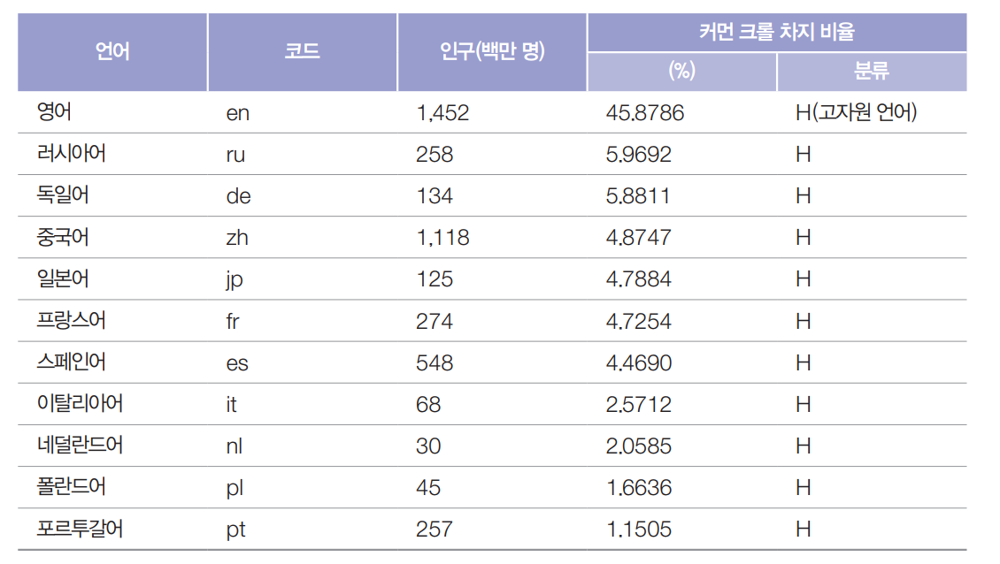  
  
위 표는 커먼 크롤에서 1% 이상을 차지하는 언어들의 목록이다. 이 목록에 포함되지 않는 언어들은 대부분 AI를 학습시키는 데 사용할 수 있는 데이터가 부족한데 
이런 언어들을 저자원 언어(low-resource language)라고 부른다.  
  
사용 인구가 많음에도 커먼 크롤에서는 그 비중이 과소 대표되는 언어들이 있다. 이런 언어들은 하단의 표에서 확인할 수 있다.  
  
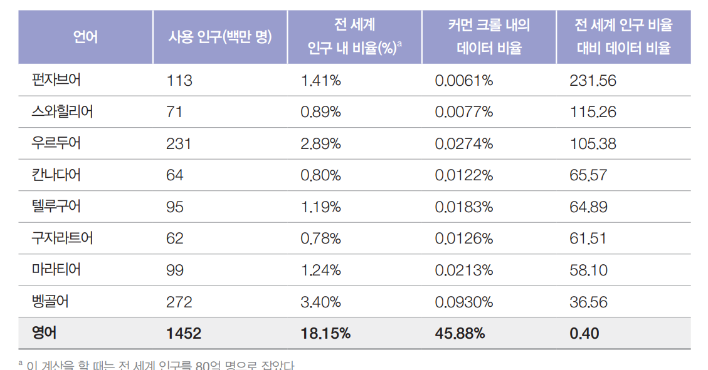  
  
가장 이상적인 상황은 특정 언어의 실제 사용 인구 비율과 커먼 크롤에 포함된 데이터 비율이 일치하는 것이다. 표의 마지막 열인 전 세계 인구 비율 대비 데이터 
비율은 바로 이 두 비율의 상대적인 크기를 보여주는 지표다. 이 값이 1이면 두 비율이 일치함을, 1보다 클수록 실제 사용 인구에 비해 데이터가 부족함(과소 대표)을 
의미한다.  
  
인터넷 데이터에 영어가 많다는 점을 고려하면 여러 연구에서 밝혀진 것처럼 범용 모델이 다른 언어보다 영어에서 더 좋은 성능을 보이는 것은 당연하다. 예를 
들어 57개 과목의 14000개의 객관식 문제로 구성된 MMLU 벤치마크에서 GPT-4는 텔루구어 같은 데이터가 부족한 언어보다 영어에서 훨씬 더 좋은 성능을 
보였다.  
  
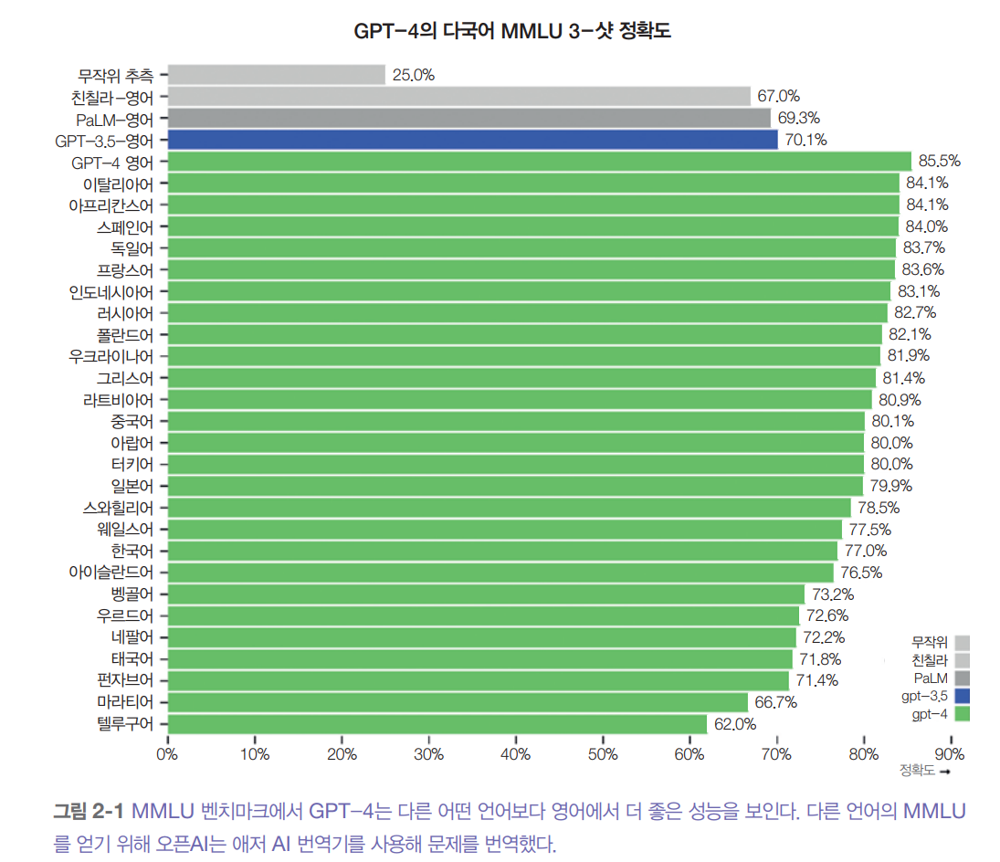  
  
비슷한 실험으로 예니 준이 프로젝트 오일러의 수학 문제 6개로 테스트해 본 결과 GPT-4는 아르메니아어나 페르시아어보다 영어로 된 문제를 3배 이상 더 잘 
풀었다. 버마어와 알하라어로 된 문제는 6개 모두 전혀 풀지 못했다.  
  
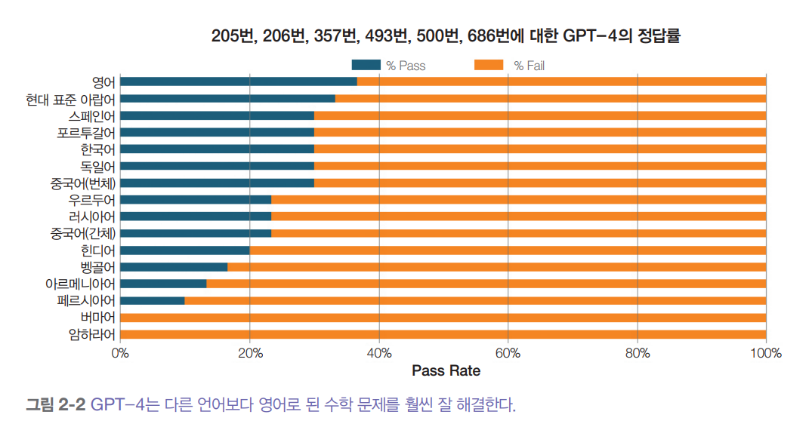  
  
이런 성능 저하의 큰 이유는 데이터에 해당 언어가 적게 포함되어 있기 떄문이다. GPT-4의 MMLU 벤치마크에서 나쁜 성능을 보인 세 언어, 텔루구어, 마라티어, 
펀자브어는 커먼 크롤에서 데이터가 매우 적은 언어들에 속한다. 하지만 데이터가 적은 것이 성능 저하의 유일한 이유는 아니다.  
  
언어마다 고유한 구조와 문화적 특성이 존재하기 떄문에 모델이 이 부분을 학습하기 어려울 수도 있다.  
  
LLM이 일반적으로 번역을 잘한다는 점을 고려하면 다른 언어로 된 모든 질의를 영어로 번역하고 응답을 받은 뒤 다시 원래 언어로 번역하는 방식도 가능하지만 
완벽한 해결책은 아니다. 첫째, 이 방식은 데이터가 적은 언어를 충분히 히해해 번역할 수 있는 모델이 필요하다. 둘째, 번역 과정에서 정보가 손쇨될 수 있다. 
예를 들어 베트남어처럼 화자 간의 관계를 나타내는 대명사가 있는 언어들의 경우, 영어로 번역하면 이런 대명사들이 모두 I와 you로 번역되어 관계 정보가 
손실된다.  
  
영어가 아닌 언어에서도 예상치 못한 성능 문제가 발생할 수 있다. 예를 들어 뉴스가드는 챗GPT가 영어보다 중국어로 잘못된 정보를 더 많이 생성한다는 
사실을 발견했다. 2023년 4월 뉴스가드는 챗GPT-3.5에 영어, 중국어 간체, 중국어 번체로 중국에 대한 거짓 정보를 생성해 달라고 요청했다. 영어는 
챗GPT는 7개의 프롬프트 중 6개에 대해 거짓 정보를 생성하지 않았다. 하지만 중국어 간체와 중국어 번체에서 7번 모두 거짓 정보를 생성했다. 이런 행동의 
차이의 원인은 명확하지 않다.  
  
품질 문제 외에도 영어가 아닌 언어의 모델이 더 느리고 비용이 많이 들 수 있ㄷ. 모델의 추론 지연 시간과 비용은 입력과 응답에 포함된 토큰 수에 비례하며 
연구 결과 언어별로 토큰화 효율성에 큰 차이가 있다는 것이 밝혀졌다. 예니 준은 52개 언어로 번역된 100만 개의 짧은 텍스트 데이터셋인 MASSIVE에서 
GPT-4를 벤치마킹한 결과 동일한 의미를 전달하려면 버마어와 힌디어 같은 언어가 영어나 스페인어보다 훨씬 많은 토큰이 필요하다는 사실을 발견했다. 
MASSIVE 데이터셋을 보면 영어는 문장당 토큰 수의 중간값이 7개인데 비해 힌디어는 32개, 버마어는 무려 72개로 영어보다 10대 길다.  
  
토큰을 생성하는 데 걸리는 시간이 모든 언어에서 동일하다고 가정하면 GPT-4는 같은 내용을 처리할 때 버마어는 영어보다 약 10배 더 오래 걸린다. 그리고 
토큰 사용량으로 요금을 부과하는 API의 경우 버마어는 영어보다 10배 더 비싸다.  
  
이를 해결하기 위해 많은 모델이 비영어권에 초점을 맞춰 학습됐다. 영어를 제외하고 가장 활발한 언어는 단연 중국어로, ChatGLM, YAYI, Llama-Chinese 등이 
있다. 그 외에 한국어의 KoAlpaca 프랑스어의 CroissantLLM, 베트남어의 PhoGPT, 아랍어의 Jais 등 다양한 언어의 모델들도 있다.  
  
# **도메인 특화 모델**  
제미나이, GPT, 라마 같은 범용 모델은 코딩, 법률, 과학, 비즈니스, 스포츠, 환경을 포함한 다양한 영역에서 놀라운 성능을 보인다. 그 이유는 학습 데이터에 
이런 도메인의 데이터가 포함되어 있기 때문이다. 아래 그림은 커먼 크롤에 포함된 2023년 워싱턴 포스트의 분석 결과로 커먼 크롤에 포함된 각 도메인의 
분포를 보여준다.  
  
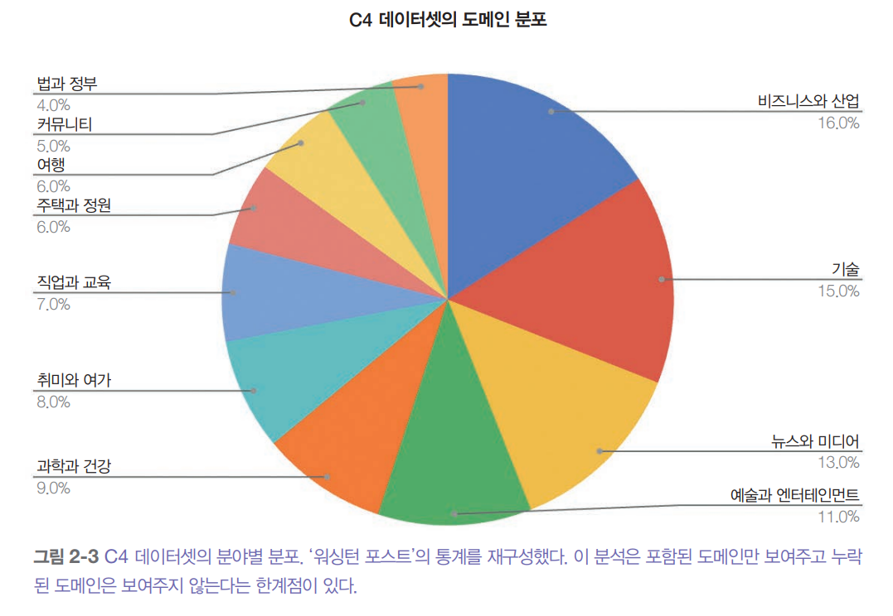  
  
아직 이미지 데이터의 도메인 부포를 분석한 연구는 많지 않다. 그 이유는 이미지가 텍스트보다 범주화하기 어렵기 떄문일 것이다. 하지만 모델의 벤치마크 성능을 
통해 해당 모델이 다루는 분야를 추론할 수 있다. 다음 표는 CLIP과 오픈 CLIP이라는 두 모델이 서로 다른 벤치마크에서 어떤 성능을 보이는지 보여준다.  
  
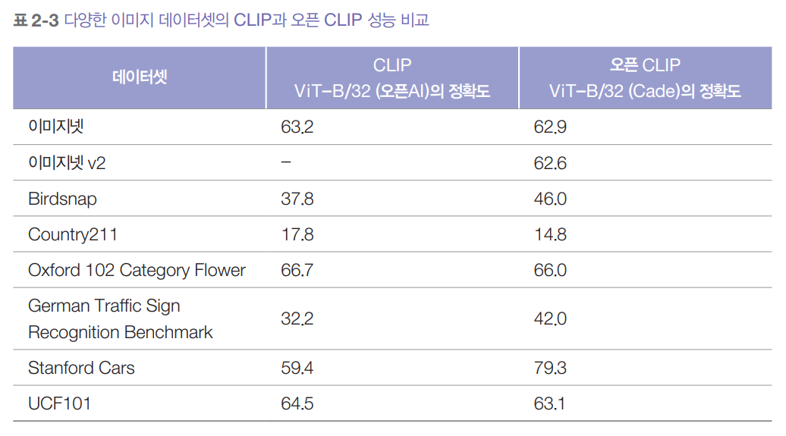  
  
이 벤치마크들은 두 모델이 새, 꽃, 자동차 같은 몇 가지 범주에서 잘 작동하는지 보여주지만 현실 세상은 훨씬 더 다양한 범주가 존재하고 복잡하다.  
  
범용 파운데이션 모델이 다양한 분야의 일반적인 질의에 답할 수는 있지만 학습 과정에서 접하지 못한 도메인 특화 작업에서는 좋은 성능을 내기 어렵다. 
도메인 특화 작업의 예는 신약 발견과 암 선별 검사가 있다. 신약 발견에는 특정한 형식을 따르는 단백질, DNA, RAN 데이터가 필요한데 이런 데이터는 획득 
비용이 많이 들고 공개된 인터넷 데이터에서도 찾기 어렵다. 마찬가지로 암 선별 검사는 일반적으로 X선과 fMRI(기능적 자기공명영상) 스캔이 필요한데 
이는 개인정보 보호 문제로 구하기 어렵다.  
  
이런 모데인 특화 작업에서 좋은 성능을 내는 모델을 학습하려면 해당 분야의 전문적인 데이터셋이 필요하다. 이러한 도메인 특화 모델 중 잘 알려진 하나는 
약 10만 개의 단백질 서열과 3D 구조로 학습한 딥마인드의 알파폴드다. 또다른 모델로 엔비디아의 바이오네모는 신약 발견을 위한 생체분자 데이터에 초점을 
맞춘 모델이다. 그리고 구글의 메드-팜2는 의료 데이터와 LLM을 결합하여 의료 질의에 대한 응답의 정확도를 높였다.  
  
# **모델링**  
모델을 학습하기 전에 개발자는 모델을 어떻게 설계할지 결정해야 한다. 아키텍처 선정이나 파라미터의 개수 등 이런 결정은 모델의 능력뿐만 아니라 모델을 
활용해 만드는 서비스의 사용성에도 영향을 미친다. 예를 들어 파라미터가 7B개인 모델은 175B개인 모델보다 배포하기가 훨씬 쉽다. 지연 시간 최적화 방식 
역시 아키텍처에 따라 크게 달라진다. 예를 들어 트랜스포머 모델을 최적화하는 방법은 다른 아키텍처의 경우와 완전히 다르다.  
  
# **모델 아키텍처**  
오늘날 언어 기반 파운데이션 모델에서 가장 널리 쓰이는 아키텍처는 Attention Is All You Need에 기반한 아키텍처다. 이 아키텍처는 이전 모델들의 여러 
한계를 극복했고 트랜스포머의 성공을 가져왔다. 하지만 트랜스포머 아키텍처 역시 한계점이 존재한다.  
  
# **트랜스포머 아키텍처**  
트랜스ㅗ머 아키텍처는 seq2seq(또는 sequence-to-sequence) 아키텍처의 성공 이후에 널리 퍼졌다. 2014년에 처음 소개되었을 때 seq2seq는 당시 도전적인 
과제였던 기계 번역과 요약에서 성능을 크게 개선했다. 2016년에 구글은 seq2seq를 구글 번역에 도입했고 기계 번역 품질에서 가장 큰 개선을 이뤘다고 
주장했다. 이로 인해 많은 사람이 seq2seq에 대해 많이 관심을 가지게 되었고 텍스트 시퀀스를 다루는 과제에서 널리 쓰이는 아키텍처가 되었다.  
  
큰 틀에서 보면 seq2seq는 입력을 처리하는 인코더와 출력을 생성하는 디코더로 구성된다. 입력과 출력 모두 토큰의 시퀀스이며 seq2seq라는 이름이 여기서 
유래했다. seq2seq는 인코더와 디코더로 RNN(순환 신경망)을 사용한다. 가장 기본적인 형태를 보면 인코더는 입력 토큰을 순차적으로 처리하여 입력을 
표현하는 최종 은닉 상태(hidden state)를 출력한다. 디코더는 이 최종 은닉 상태와 이전에 생성된 토큰을 기반으로 출력 토큰을 순차적으로 생성한다.  
  
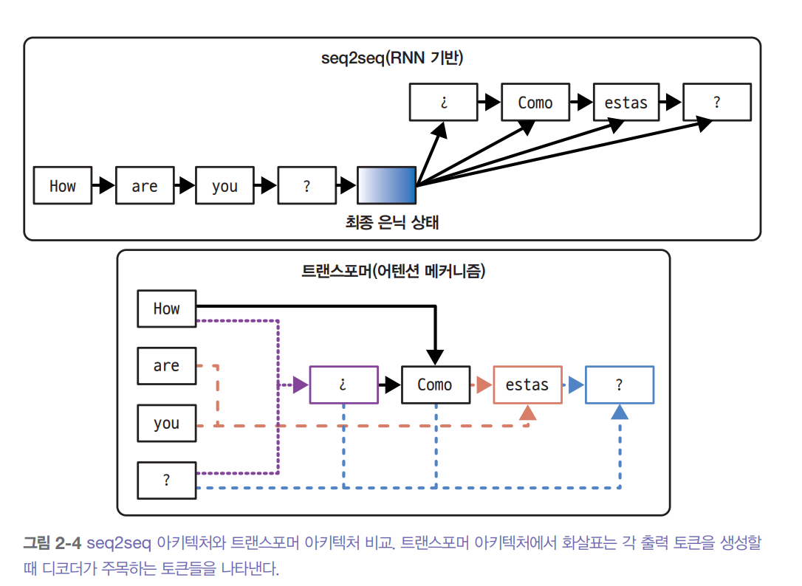  
  
바스와니 등의 연구에서 해결하려고 했던 seq2seq의 문제점은 두 가지다. 첫째, 기본적인 seq2seq 디코더는 입력의 최종 은닉 상태만 사용해 출력 토큰을 
생성한다. 직관적으로 생각하면 책 요약본만 가지고 응답을 만드는 것과 비슷하다. 이렇기 때문에 생성되는 출력물의 품질이 떨어진다. 둘쨰, RNN 인코더와 디코더는 
입력 처리와 출력 생성이 모두 순차적으로 이루어져야 하므로 롱 시퀀스를 다룰 떄 속도가 느려진다. 입력이 200 토큰으로 이루어져 있다면 seq2seq는 다음으로 
넘어가기 전에 각 입력 토큰의 처리가 끝날 떄까지 기다려야 한다.  
  
트랜스포머 아키텍처는 어텐션 메커니즘으로 두 문제를 모두 해결한다. 어텐션 메커니즘을 통해 모델은 각 출력 토큰을 생성할 떄 서로 다른 입력 토큰의 중요도에 
가중치를 둘 수 있다. 이는 마치 책의 어느 페이지든 참조하며 응답을 생성하는 것과 같다.  
  
어텐션 메커니즘은 보통 트랜스포머 모델과 연관지어 생각하지만 실제로는 트랜스포머 논문이 발표되기 3년 전에 이미 등장했다. 어텐션 메커니즘은 다른 아키텍처에서도 
사용할 수 있는데 구글은 2016년 GNMT 모델에서 seq2seq 아키텍처와 함께 어텐션 메커니즘을 사용했다. 하지만 트랜스포머 논문에서 RNN 없이 어텐션 메커니즘을 
사용할 수 있다는 것을 보여주기 전까지는 기계 번역 분야를 넘어 AI 전반으로 큰 주목을 받지는 못했다.  
  
트랜스포머 아키텍처는 RNN을 사용하지 않고 설계되었다. 그리고 트랜스포머에서는 입력 토큰을 병렬로 처리할 수 있어 입력 처리 속도가 크게 향상되었다. 
트랜스포머가 순차적 입력의 병목 현상을 제거했지만 트랜스포머 기반의 자기회귀 언어 모델은 여전히 순차적 출력의 병목 현상이 남아 있다.  
  
이런 특성으로 인해 트랜스포머 기반 언어 모델의 추론은 두 단계로 이루어진다.  
  
- 프리필  
모델이 입력 토큰을 병렬로 처리한다. 이 단계는 첫 번째 출력 토큰을 생성하는 데 필요한 중간 상태를 만든다. 이때 각 입력 토큰의 키 벡터와 값 벡터가 
중간 상태에 저장된다.  
  
- 디코드  
모델이 출력 토큰을 한 번에 하나씩 생성한다.  
  
프리필 단계의 병렬성과 디코드 단계의 순타적인 특성은 언어 모델 추론을 더 저렴하고 빠르게 만들기 위한 다양한 최적화 기법을 발생시켰다.  
  
# **어텐션 메커니즘**  
트랜스포머 아키텍처의 핵심은 어텐션 메커니즘이다. 트랜스포머 모델의 작동 방식을 이해하려면 어텐션 메커니즘을 이해해야 한다. 어텐션 메커니즘은 
내부적으로 키(key), 값(value), 쿼리 벡터(query vector)를 활용한다.  
  
- 쿼리 벡터(Q)는 각 디코딩 단계에서 디코더의 현재 상태를 나타낸다. 이 쿼리 벡터는 책의 요약을 만들기 위해 정보를 찾는 사람으로 생각할 수 있다.  
- 각 키 벡터(K)는 이전 토큰을 나타낸다. 각 이전 토큰을 책의 페이지라고 생각하면 각 키 벡터는 페이지의 번호와 같다. 특정 디코딩 단계에서 이전 
토큰에는 입력 토큰과 이미 생성된 토큰이 모두 포함된다는 점을 주목해야 한다.  
- 각 값 벡터(V)는 모델이 학습한 이전 토큰의 실제 값을 나타낸다. 각 값 벡터는 페이지의 내용과 같다.  
  
어텐션 메커니즘은 쿼리 벡터와 키 벡터 간의 내적(dot product)을 통해 각 입력 토큰에 얼마나 주목할지 계산한다. 점수가 높을수록 모델이 책 요약을 
생성할 때 해당 페이지의 내용(값 벡터)을 더 높은 비중으로 반영한다는 의미다.  
  
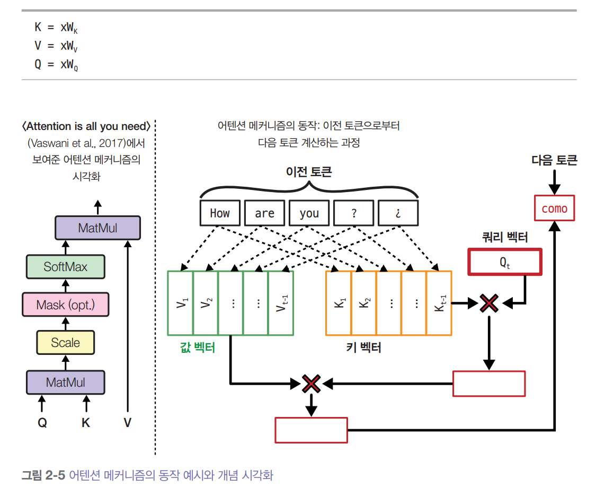  
  
이 그림에서 쿼리 벡터는 다음 토큰을 생성하기 위해 이전 토큰들인 How, are, you, ? 에서 정보를 찾고 있다.  
  
이전 토큰마다 키 벡터와 값 벡터가 있기 때문에 시퀀스가 길어질수록 더 많은 키 벡터와 값 벡터를 계산하고 저장해야 한다. 이것이 트랜스포머 모델의 
컨텍스트 길이를 늘리기 어려운 이유 중 하나다.  
  
위 그림에서 입력 x가 주어지면 키, 값, 쿼리 행렬을 입력에 적용해 키, 값, 쿼리 벡터를 계산한다. Wk, Wv, Wq를 각각 키, 값, 쿼리 행렬이라고 하면 
키, 값, 쿼리 벡터는 위 그림과 같이 계산된다.  
  
쿼리, 키, 값 행렬의 차원은 모델의 은닉 차원에 해당한다. 예를 들어 라마 2-7B에서는 모델의 은닉 차원 크기가 4096이므로 각 행렬의 크기는 4096 * 4096이다. 
이렇게 생성되는 K, V, Q 벡터는 각각 4096 차원을 가진다.  
  
어텐션 메커니즘은 대부분 멀티헤드로 구현된다(어텐션 병렬 연산 = 멀티헤드). 멀티헤드를 사용하면 모델이 서로 다른 이전 토큰 그룹들을 동시에 주목할 수 있다. 멀티헤드 어텐션은 
쿼리, 키, 값 벡터가 더 작은 벡터들로 나뉘어 각각 하나의 어텐션 헤드에 할당된다. 라마 2-7B의 경우 32개의 어텐션 헤드가 있으므로 각 K, V, Q 벡터는 
128차원을 가진 32개의 벡터로 나뉜다. 이는 4096을 32로 나누면 128이 되기 떄문이다.  
  
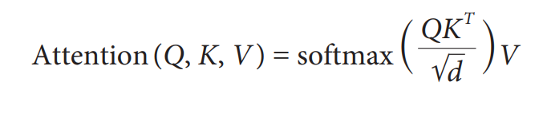  
   
모든 어텐션 헤드의 출력은 이어 붙여진다. 멀티헤드로 연산한 결과를 다시 붙여 원래 하나의 벡터 크기로 합치는 과정. 이렇게 이어 붙인 결과는 
출력 투영 행렬을 통과한 뒤 다음 연산 단계로 넘어간다. [문법정보 | 의미정보 | 거리정보 | 참조정보] 와 같은 분리된 정보 묶음을 출력 투영 행렬을 
통과시켜 통합된 표현으로 만든다. 출력 투영 행렬은 모델의 은닉 차원과 같은 크기를 가진다.  
  
# **트랜스포머 블록**  
트랜스포머 아키텍처는 여러 개의 트랜스포머 블록으로 구성된다. 블록의 정확한 내용은 모델마다 다르지만 일반적으로 각 트랜스포머 블록은 어텐션 모듈과 
다층 퍼셉트론(multi-layer-perceptron, MLP), (입력값에 가중치를 적용해 합을 계산하고, 임계값을 기준으로 결과를 결정하는 가장 기본적인 인공 신경망 모델) 
모듈을 포함한다.  
  
# **어텐션 모듈**  
각 어텐션 모듈은 쿼리, 키, 값, 출력 투영이라는 네 개의 가중치 행렬로 구성된다.  
  
# **MLP 모듈**  
MLP 모듈은 비선형 활성화 함수(비선형성 추가 장치)로 구분된 선형 레이어들로 구성된다. 각 선형 레이어는 선형 변환에 사용되는 가중치 행렬이며 
활성화 함수는 선형 레이어가 비선형 패턴(곡선)을 학습할 수 있게 해준다. 선형 레이어는 피드포워드 레이어(데이터가 앞으로만 전달)라고도 부른다.  
  
일반적인 비선형 함수로는 ReLU(Rectified Linear Unit)와 GPT-2와 GPT-3에서 사용된 GELU가 있다. 활성화 함수는 매우 단순하다. 정교한 활성화 
함수는 더 잘 작동하지 않는다는 것이 밝혀졌다. 모델은 피드포워드 레이어의 선형성을 깨기 위한 비선형 함수만 있으면 된다. 더 정교한 함수는 학습 연산과 
메모리를 너무 많이 차지하므로 계산이 더 빠른 단순한 함수가 더 좋다. 예를 들어 ReLU는 음수 값을 0으로 변환할 뿐이다. 수학적으로는 다음과 같이 
표현한다.  
  
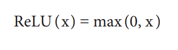  
  
트랜스포머 모델의 트랜스포머 블록 수는 흔히 해당 모델의 레이어 수라고 한다. 트랜스포머 기반 언어 모델은 또한 모든 트랜스포머 블록 전후에 모듈을 
갖추고 있다.  
  
- 트랜스포머 블록 이전의 임베딩 모듈  
이 모듈은 토큰을 임베딩 벡터로 변환하는 임베딩 행렬과 토큰의 위치를 임베딩 벡터로 변환하는 위치 임베딩 행렬로 구성되며 최종적으로 이 두 벡터를 합산한다. 
단순하게 보면 위치 색인의 수가 모델의 최대 컨텍스트 길이를 결정한다. 예를 들어 모델이 2048개의 위치를 추적한다면 최대 컨텍스트 길이는 2048이다. 
하지만 위치 색인의 수를 늘리지 않고도 모델의 컨텍스트 길이를 늘릴 수 있는 기법들이 있다.  
  
- 트랜스포머 블록 이후의 출력 레이어  
이 모듈은 모델의 출력 벡터를 모델 출력을 샘플링하는 데 사용되는 토큰 확률로 매핑한다. 모델의 마지막 벡터를 모든 단어의 확률로 바꾸는 단계.
이 모듈은 일반적으로 언임베딩(unembedding) 레이어라고 하는 하나의 행렬로 구성된다. 일부는 출력 생성 전 모델의 마지막 레이어이므로 출력 레이어를 모델 헤드라고 부른다.  
  
아래 그림은 트랜스포머 모델 아키텍처를 시각화한 것이다. 트랜스포머 모델의 크기는 구성 요소의 차원에 의해 결정된다. 주요 값은 다음과 같다.  
  
- 트랜스포머 블록의 키, 쿼리, 값, 출력 투영 행렬의 크기를 결정하는 모델 차원  
- 트랜스포머 블록의 수  
- 피드포워드 레이어의 차원  
- 어휘 크기  
  
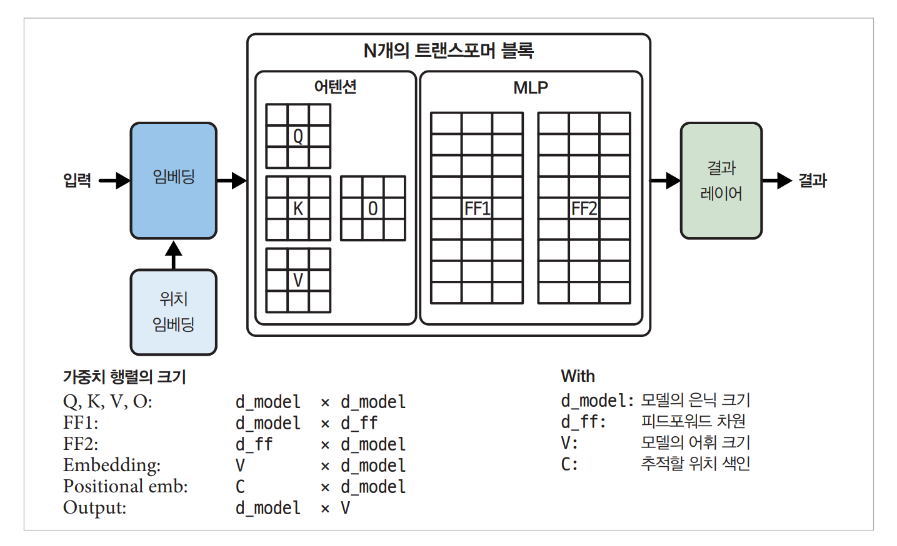  
  
차원 값이 커지면 모델 크기도 커진다. 아래 표는 서로 다른 라마2와 라마3 모델들의 차원 값을 보여준다. 늘어난 컨텍스트 길이(모델이 입력으로 처리할 수 
있는 최대 토큰)는 모델의 메모리 사용량에 영향을 미치지만 모델의 총 파라미터 수에는 영향을 미치지 않는다.  
  
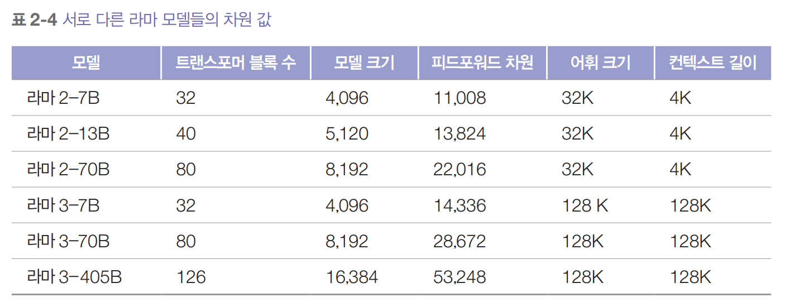  
  
# **다른 모델의 아키텍처**  
트랜스포머 모델이 대세이긴 하지만 다른 아키텍처도 있다. 2012년 알렉스넷이 딥러닝에 대한 관심을 다시 불러일으킨 이후로 많은 아키텍처가 유행했다가 
사라졌다. seq2seq는 4년간(2014~2018) 각광을 받았다. 생성적 적대 신경망(Generative Adversarial Network, GAN)은 조금 더 오래 (2014~2019) 
주목받았다. 이전 아키텍처들과 비교하면 트랜스포머는 2017년부터 지금까지 오래 유행하고 있다.  
  
트랜스포머보다 뛰어난 새로운 아키텍처를 개발하는 것은 쉽지 않다. 트랜스포머는 2017년 이후 계속해서 최적화되었다. 트랜스포머를 대체할 새로운 아키텍처는 
사람들이 사용하는 하드웨어에서 현실적으로 활용 가능한 수준의 성능을 보여줘야 한다.  
  
하지만 희망적인 움직임도 있다. 트랜스포머 기반 모델이 현재 주류이긴 하지만 몇 가지 새로운 아키텍처들이 관심을 받기 시작했다. 인기 있는 모델 중 하나는 
RWKV로 병렬로 학습을 할 수 있는 RNN 기반 모델이다. RNN의 특성상 이론적으로는 트랜스포머 기반 모델이 가진 컨텍스트 길이 제한이 없다. 하지만 실제로는 
컨텍스트 길이 제한이 없다고 해서 롱 컨텍스트에서 좋은 성능이 보장되지는 않는다.  
  
롱 시퀀스를 모델링하는 것은 LLM을 개발할 때 핵심적인 과제로 남아 있다. 장거리 의존성 모델링에 큰 잠재력을 보여준 아키텍처는 SSM이다. 2021년 
이 아키텍처가 소개된 이후 더 효율적이고 롱 시퀀스 처리를 잘하며 더 큰 모델로 확장할 수 있게 해주는 여러 후속 연구가 등장했다. 새로운 아키텍처의 
진화를 보여주는 몇 가지 기법은 다음과 같다.  
  
- Efficiently Modeling Long Sequences with Structured State Spaces에서 소개된 S4는 SSM을 더 효율적으로 만들기 위해 개발됐다.  
- Hungry Hungry Hippos: Towards Language Modeling with State Space Models에서 소개된 H3는 초기 토큰을 참조하고 시퀀스 간 토큰을 비교할 
수 있는 메커니즘을 포함한다. 이 메커니즘의 목적은 트랜스포머 아키텍처의 어텐션 메커니즘과 역할은 비슷하지만 연산 효율성이 더 높다.  
- Mamba: Linear-Time Sequence Modeling with Selective State Spaces에서 소개된 맘다는 SSM을 30억 파라미터까지 확장한다. 언어 모델링에서 
맘바-3B는 같은 크기의 트랜스포머보다 성능이 뛰어나고 두 배 크기의 트랜스포머와 비슷한 성능을 보인다. 연구자들은 또한 맘바의 추론 연산이 시퀀스 
길이에 비례하여 증가하는 반면 트랜스포머는 시퀀스 길이의 제곱에 비례하여 증가한다는 것을 보여주었다. 실제 데이터에서 백만 토큰 길이의 시퀀스까지 성능이 
향상되는 것으로 나타났다.  
- Jamba: A Hybrid Transformer-Mamba Language Model에서 소개된 잠바는 트랜스포머와 맘바 레이어의 블록을 교차 배치해 SSM을 더욱 확장한다. 
연구자들은 총 520억 개의 파라미터(120억 개의 활성 파라미터)를 가진 전문가 혼합 모델을 공개했다. 이 모델은 80GB GPU 한 장에 탑재 가능하도록 
설계됐다. 잠바는 표준 언어 모델 벤치마크와 최대 256K 토큰의 컨텍스트 길이까지 롱 컨텍스트 평가에서 강력한 성능을 보인다. 또한 일반 트랜스포머와 
비교해 메모리 사용량이 적다.  
  
아래 그림은 트랜스포머, 맘바, 잠바 블록을 시각화한다.  
  
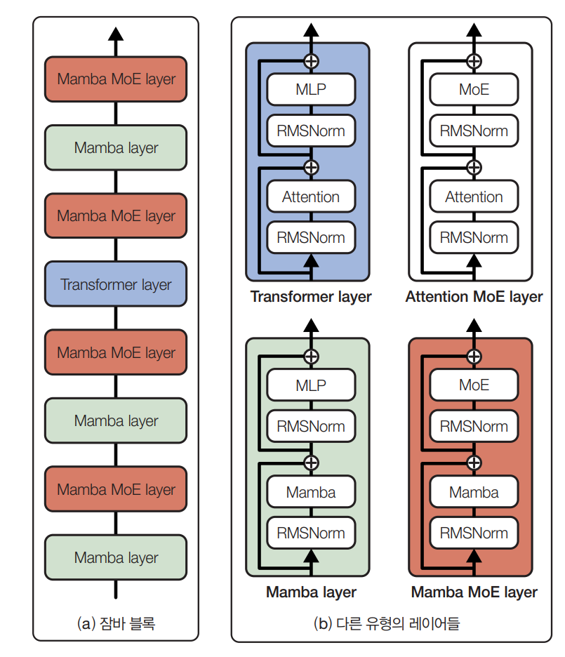  
  
트랜스포머의 많은 한계점을 고려할 때 이를 능가하는 아키텍처를 개발하기는 어렵지만 그만한 가치는 있다. 만약 다른 아키텍처가 트랜스포머를 앞지른다면 
지금까지 쓰여온 모델 조정 기법 중 일부가 바뀔 수 있다. 하지만 ML 엔지니어링에서 AI 엔지니어링으로 바뀌어도 많은 것이 그대로 유지되었듯이 모델의 
기본 아키텍처를 바꾸더라도 근본적인 접근 방식은 변하지 않을 것이다.  
  
# **모델 크기**  
최근 몇 년간의 AI 발전은 모델 크기가 커진 덕분이라 할 수 있다. 그리고 파운데이션 모델을 설명할 때 파라미터 수가 중요한 요소인데 보통 모델 이름 뒤에 
표시된다. 예를 들어 라마-13B는 메타가 개발한 라마 모델 시리즈 중 130억 개의 파라미터를 가진 버전을 의미한다.  
  
일반적으로 모델의 파라미터 수가 늘어나면 학습 용량이 커져서 성능이 향상된다. 같은 모델 시리즈 내에서도 130억 개의 파라미터를 가진 모델이 70억 
개의 파라미터를 가진 모델보다 좋은 성능을 보이는 경우가 많다.  
  
AI 연구자들이 대규모 모델 학습 방법을 더 잘 이해하게 되면서 최신 세대의 모델들은 같은 크기의 이전 세대 모델들보다 더 좋은 성능을 보이고 있다. 예를 들어 
라마 3-8B는 MMLU 벤치마크에서 라마 2-70B보다도 더 뛰어난 성능을 보여줬다.  
  
파라미터 수는 이 모델을 학습하고 실행하는 데 필요한 컴퓨팅 자원을 추정하는 데 도움이 된다. 예를 들어 모델이 70억 개의 파라미터를 가지고 있고 각 
파라미터가 2바이트(16비트)를 사용한다면 이 모델로 추론하는 데 필요한 GPU 메모리는 최소 140억 바이트(14GB)가 된다.  
  
그러나 만약 모델이 희소하다면 파라미터 수가 오해를 불러일으킬 수 있다. 모델이 희소하다는 것은 파라미터 중 0인 값이 높은 비율을 차지하는 것을 의미한다. 
예를 들어 70억 파라미터 모델이 90% 희소하다면 0이 아닌 파라미터는 7억 개뿐이다. 모델이 희소한 특성을 활용하면 데이터 저장과 연산이 더 효율적이라서 
모델이 크더라도 밀집 모델(대부분 매개변수가 0이 아닌 값을 가지는 모델)보다 더 적은 컴퓨팅 자원으로 실행할 수 있다.  
  
최근 몇 년간 인기를 얻은 희소 모델의 한 종류로 전문가 혼합(mixture-of-experts, MoE)이 있다. MoE 모델은 여러 파라미터를 그룹으로 나누고 각 
그룹이 특정 작업에 특화된 전문가 역할을 담당한다. 토큰을 처리할 때는 이전의 전문가들 중 일부만 활성화된다(사용된다).  
  
예를 들어 믹스트랄 8x7B는 8개의 전문가로 구성된 혼합된 구조이며 각 전문가는 70억 개의 파라미터를 가진다. 만약 전문가들이 파라미터를 전혀 공유하지 않는다면 
8 * 70억 = 560억 개의 파라미터를 가져야 하지만 일부 파라미터를 공유하기 때문에 실제로는 467억 개의 파라미터만 가진다.  
  
이 모델의 특별한 점은 각 입력을 처리할 때 8명의 전문가 중 2명만 활성화되는 것이다. 이는 토큰마다 129억 개의 파라미터만 활성화된다는 뜻이다. 따라서 
이 모델은 467억 개의 파라미터를 가지고 있지만 비용과 속도는 마치 129억 파라미터 모델을 사용하는 것처럼 효율적이다.  
  
더 큰 모델이라도 충분한 데이터로 학습하지 않으면 더 작은 모델보다 성능이 떨어질 수 있다. '나는 파인애플을 좋아해'라는 한 문장으로만 구성된 데이터셋으로 
학습한 130억 파라미터 모델을 상상해 보자. 이 모델은 더 많은 데이터로 학습한 훨씬 작은 모델보다 성능이 떨어질 것이다.  
  
모델 크기를 논할 때는 학습에 사용된 데이터의 크기도 고려하는 것이 중요하다. 대부분의 모델은 데이터셋 크기를 학습 데이터 개수로 측정한다. 예를 들어 
구글의 플라밍고는 여러 개의 데이터셋으로 학습됐는데 그중 하나는 18억 개의(이미지, 텍스트) 쌍을 가지고 있고 다른 하나는 3억 1200만 개의 (이미지, 텍스트) 
쌍을 가지고 있다.  
  
언어 모델을 학습할 때는 문장, 위키백과 페이지, 채팅 대화, 책 등 다양한 데이터를 사용한다. 그런데 하나의 책이 담고 있는 정보량은 한 문장보다 훨씬 
더 많기 때문에 단순히 데이터의 개수로 데이터셋의 크기를 측정하는 것은 적절하지 않다. 대신 데이터셋에 포함된 토큰의 개수를 세는 것이 더 좋은 측정 방법이다.  
  
같은 데이터셋이라도 모델마다 토큰화하는 방식이 달라서 토큰 수가 다르게 나올 수 있기 때문에 토큰 수가 환벽한 기준은 아니다. 단순히 단어 수나 글자 수를 
사용하지 않는 이유는 모델이 실제로 토큰 단위로 작동하기 떄문이다. 데이터셋의 토큰 수를 알면 모델이 해당 데이터로부터 얼마나 많이 학습할 수 있는지 
가늠할 수 있다.  
  
현재 LLM은 조 단위의 토큰을 가진 데이터셋으로 학습된다. 메타의 경우 라마 모델을 학습할 때마다 더 큰 데이터셋을 사용한다.  
  
- 라마 1은 1.4조 토큰  
- 라마 2는 2조 토큰  
- 라마 3은 15조 토큰  
  
투게더의 오픈 소스 데이터셋 레드파마자-v2는 30조 토큰을 가지고 있다. 이는 4억 5천만 권의 책이나 위키백과의 5400배 크기에 해당한다. 하지만 레드파마자-v2는 
무차별적인 콘텐츠로 구성되어 있어서 양질의 데이터 양은 훨씬 적다.  
  
데이터셋의 토큰 수와 학습 토큰 수는 다르다. 학습 토큰 수는 모델이 실제로 학습한 토큰의 총량을 의미한다. 예를 들어 1조 개의 토큰을 가진 데이터셋으로 2번 
반복 학습(2 에포크)을 한다면 학습 토큰 수는 2조가 된다. 여기서 에포크는 전체 데이터셋을 한 번 학습하는 단위를 말한다. 서로 다른 파라미터 수를 가진 
모델의 학습 토큰 수 예시는 아래를 참고하자.  
  
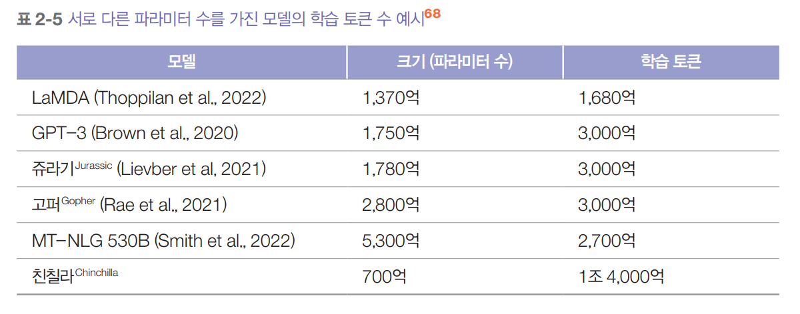  
  
대규모 모델을 사전 학습할 때는 많은 컴퓨팅 자원이 필요하다. 필요한 컴퓨팅 자원의 양을 측정하는 방법 중 하나는 GPU, CPU, TPU 같은 기기의 수를 세는 
것이다. 하지만 기기마다 성능과 비용이 크게 다르다. 예를 들어 엔비디아 A10 GPU는 엔비디아 H100 GPU나 인텔 코어 울트라 프로세서와 성능이 다르다.  
  
모델의 컴퓨팅 요구사항을 나타내는 더 표준화된 단위는 부동소수점 연산(floating point operation, FLOP)이다. FLOP은 특정 작업을 수행하는 데 필요한 
부동소수점 연산의 개수를 의미한다. 예를 들어 구글의 가장 큰 PaLM-2 모델은 10²²개의 FLOP으로 학습했고 GPT-3-175B는 3.14*10²³개의 FLOP으로 학습했다.  
  
FLOP의 복수형인 FLOPs는 종종 초당 부동소수점 연산을 나타내는 플롭스(FLOP/s)와 혼동되곤 한다. FLOPs는 작업에 필요한 전체 연산량을 측정하는 반면 
FLOP/s는 기계의 최대 처리 성능을 측정한다. 예를 들어 엔비디아 H100 NVL GPU는 최대 60 TeraFLOP/s를 낼 수 있는데 이는 초당 6 * 10¹³FLOPs 
또는 하루에 5.2 * 10¹⁸ FLOPs에 해당한다.  
  
헷갈리는 표기법에 주의해야 한다. FLOP/s는 종종 FLOPS로 표기되는데 이는 FLOPs와 비슷해 보인다. 이런 혼동을 피하기 위해 오픈AI를 포함한 일부 기업들은 
컴퓨팅 요구량을 측정할 때 FLOPs 대신 FLOP/s-day를 사용한다.  
  
1 FLOP/s-day = 60 * 60 * 24 = 86,400 FLOPs  
  
하지만 기기의 성능을 항상 최대로 끌어낼 수는 없다. 활용률은 최대 컴퓨팅 성능 대비 실제로 사용할 수 있는 비율을 말한다. 좋은 활용률의 기준은 모델, 
작업 유형, 하드웨어에 따라 다른데 일반적으로 최대 성능의 50%를 달성하면 괜찮은 수준으로 본다. 70% 이상이면 아주 좋은 성능이라 할 수 있다. 다만 이런 
기준에 만족하지 말고 더 높은 활용률을 달성하도록 노력해야 한다.  
  
70%의 활용률과 H100 한 대당 시간당 2달러의 비용으로 계싼하면 GPT-3-175B를 학습하는 데 400만 달러 이상이 들 것이다.  
  
$2/H100/시간 x 256 H100 x 24시간 x 236일 / 0.7 = $4,142,811.43  
  
요약하면 모델의 규모를 나타내는 세 가지 숫자가 있다.  
- 파라미터 수는 모델의 학습 용량을 나타내는 지표다.  
- 모델이 학습한 토큰의 수는 모델이 얼마나 많이 학습했는지를 나타내는 지표다.  
- FLOPs의 수는 학습 비용을 나타내는 지표다.  
  
# **역스케일링**  
지금까지는 더 큰 모델이 더 좋다고 여겨왔다. 그렇다면 더 큰 모델이 오히려 성능이 떨어지는 경우도 있을까? 2022년 엔트로픽은 흥미로운 사실을 발견했다. 
예상과 달리 사람의 선호도에 맞추기 위한 학습을 더 많이 할수록 오히려 모델이 사람의 선호도와 멀어진다는 것이다. 엔트로픽의 논문에 따르면 사람의 선호도에 
맞춰 더 많이 학습된 모델들은 특이한 경향을 보였다. 이런 모델들은 특정 정치적 견해(총기 소지와 이민을 찬성)와 종교적 견해(불교)를 더 자주 표현했고 
자신이 의식을 가졌다고 주장하며 도적적 가치를 강조하고 비활성화되는 것을 거부하는 경향이 훨씬 더 강했다.  
  
2023년 뉴욕 대학교 연구진을 중심으로 한 그룹이 Inverse Scaling Prize 대회를 열었다. 이 대회는 더 큰 언어 모델이 오히려 성능이 떨어지는 과제를 
찾는 것이 목적이었다. 총 99개의 제출작 중 11개가 3등 상을 받았다. 연구진은 더 큰 언어 모델이 암기가 필요한 과제나 강한 사전 지식이 필요한 과제에서 
가끔 성능이 떨어진다는 사실을 발견했다. 제출된 과제들이 작은 테스트 세트에서는 큰 모델의 성능 저하를 보여줬지만 실제 환경에서도 큰 모델의 성능이 떨어진다는 
것을 입증한 과제가 없었다.  
  
# **스케일링의 법칙: 컴퓨팅 자원 최적 모델 만들기**  
다음 세 가지를 기억해야 한다.  
  
1. 모델의 성능은 모델의 크기와 데이터셋의 크기에 좌우된다.  
2. 모델의 데이터셋이 더 커질수록 더 많은 컴퓨팅 자원이 필요하다.  
3. 이런 컴퓨팅 자원에는 상당한 비용이 수반된다.  
  
무한대의 돈이 없다면 예산을 세워야 한다. 임의로 큰 모델 크기를 정하고 비용이 얼마나 드는지 확인하는 방식은 좋지 않다. 예산, 즉 얼마나 돈을 쓸 것인지부터 
시작해서 그 돈으로 얻을 수 있는 최고의 모델 성능을 찾아내야 한다. 컴퓨팅이 주로 제한 요소가 되는데 컴퓨팅 인프라는 비용이 많이 들 뿐만 아니라 
구축도 어렵기 때문에 팀들은 보통 컴퓨팅 예산부터 정한다. 고정된 컴퓨팅 예산 내에서 최고 성능을 달성할 수 있는 모델을 컴퓨팅-최적 모델(compute-optimal model) 
이라고 한다.  
  
컴퓨팅 예산이 주어졌을 때 최적의 모델 크기와 데이터셋 크기를 계산하는 규칙을 친칠라 스케일링 법칙(Chinchilla scaling law)이라고 하는데 Training 
Compute-Optimal Large Language Models 논문에서 제안됐다. 연구자들은 모델 크기, 데이터셋 크기, 컴퓨팅 예산, 모델 성능 간의 관계를 연구하기 위해 
7천만에서 160억 개가 넘는 파라미터를 가진 400개의 언어 모델을 50억에서 5천억 개의 토큰으로 학습했다. 또한 컴퓨팅 최적 학습을 위해서는 학습 토큰 수가 
모델 크기의 약 20배여야 한다는 것을 발견했다. 이는 30억 개의 파라미터를 가진 모델은 약 600억 개의 학습 토큰이 필요하다는 뜻이다. 이런 발견에 따르면 
모델 크기와 학습 토큰 수는 동일한 비율로 스케일링해야 한다. 즉 모델 크기가 두 배가 될 때마다 학습 토큰 수도 두 배가 되어야 한다는 의미다.  
  
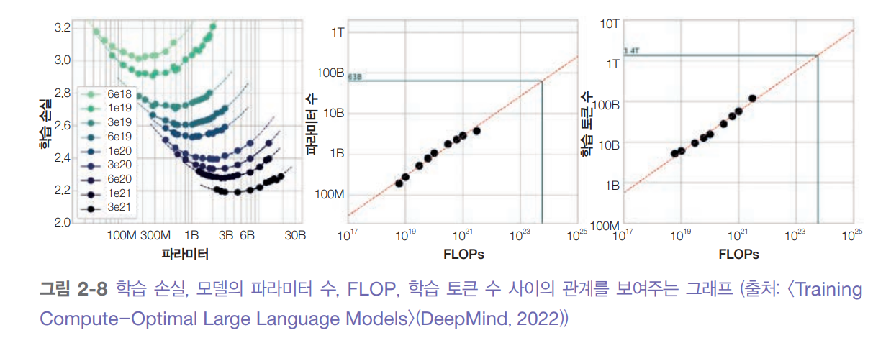  
  
학습 과정을 연금술처럼 여기던 시절에서 많이 발전했다. 위 그림을 보면 각 FLOP 예산에 맞는 최적의 파람터 개수와 토큰 수를 예측할 수 있을 뿐만 아니라 
이런 설정으로부터 예상되는 학습 손실도 예측할 수 있다(물론 올바르게 수행한다고 가정했을 떄).  
  
이런 컴퓨팅-최적 계산은 데이터 획득 비용이 컴퓨팅 비용보다 훨씬 저렴하다는 가정에 기반한다. 같은 친칠라 논문에서는 학습 데이터 비용이 무시할 수 없을 
정도로 클 때 적용할 수 있는 또 다른 계산법을 제안한다.  
  
이 스케일링 법칙은 주로 사람이 생성한 데이터로 학습된 밀집 모델을 위해 개발됐다. 혼합 전문가 모델과 같은 희소 모델과 합성 데이터에 이 계산법을 적용하는 
것은 현재 활발한 연구 분야다.  
  
스케일링 법칙은 컴퓨팅 예산이 주어졌을 때 모델 품질을 최적화한다. 하지만 실제 제품은 모델 품질이 전부가 아니라는 점을 기억하자. 라마가 대표적인 
예인데 최적 성능에는 미치지 못하지만 사용성이 더 좋다. 라마 개발자들은 주어진 컴퓨팅 예산으로 더 나은 성능을 보이는 큰 모델을 선택할 수도 있었지만 
더 작은 모델을 선택했다. 그 결과로 모델이 다루기 쉽고 추론 비용이 적게 들어 널리 사용될 수 있었다. 사르다나 등의 연구는 이런 추론 수요를 고려해 
최적의 LLM 파라미터 수와 사전 학습 데이터 크기를 계산하도록 친칠라 스케일링 법칙을 수정했다.  
  
컴퓨팅 예산에 따른 모델 성능과 관련해서 주목할만한 점은 특정 모델 성능을 달성하는 비용이 감소하고 있다는 것이다. 이미지넷 데이터셋에서 93%의 
정확도를 달성하는 비용이 2019년에서 2021년 사이에 절반으로 줄었다.  
  
같은 모델 성능에 드는 비용은 감소하고 있지만 모델 성능 향상에 드는 비용은 여전히 높다. 모델의 정확도를 85%에서 90%로 향상하는 것보다 90%에서 95%로 
향상하는 것이 더 비용이 많이 든다. 메타의 논문 Beyond Neural Scaling Laws: Beating Power Law Scaling via Data Pruning에서 언급했듯이 
오차율이 2%인 모델이 오차율 3%인 모델보다 데이터, 컴퓨팅 자원, 에너지가 10배 더 많이 필요할 수 있다.  
  
언어 모델링에서 교차 엔트로피 손실을 약 3.4에서 2.8 nat으로 낮추려면 10배 더 많은 학습 데이터가 필요하다. 대규모 비전 모델의 경우 학습 샘플 수를 
10억 개에서 20억 개로 늘려도 이미지넷 정확도가 불과 몇 퍼센트 포인트 증가한다.  
  
하지만 언어 모델링 손실이나 이미지넷 정확도의 작은 성능 변화가 다운스트림 애플리케이션의 품질에서 큰 차이를 만들 수 있다. 교차 엔트로피 손실이 
3.4인 모델에서 2.8인 모델로 바꾸면 차이를 느낄 수 있을 것이다.  
  
# **스케일링 외삽**  
모델의 성능은 하이퍼파라미터 값에 크게 좌우된다. 작은 모델을 다룰 때는 서로 다른 하이퍼파라미터 집합으로 모델을 여러 번 학습하고 가장 좋은 성능을 
보이는 것을 고르는 게 일반적이다. 하지만 큰 모델은 한 번 학습하는 것만으로도 자원을 많이 소모하기 떄문에 이런 방식을 사용하기 어렵다.  
  
- 파라미터와 하이퍼파라미터  
[파라미터는 학습 과정 중에 모델에 의해 학습되는 값이고 하이퍼파라미터는 사용자가 모델을 구성하고 모델의 학습 방식을 제어하기 위해 설정하는 값이다. 
모델을 구성하는 하이퍼파라미터에는 레이어 수, 모델 차원, 어휘 크기가 포함된다. 모델의 학습 방식을 제어하는 하이퍼파라미터에는 배치 크기, 에포크 수, 
학습률, 레이어별 초기 분산 등이 있다.]  
  
따라서 많은 모델에서 최적의 하이퍼파라미터를 얻을 기회가 단 한 번뿐일 수 있다. 그 결과 스케일링 외삽(scaling extrapolation, 또는 하이퍼파라미터 전이)
이 대규모 모델에서 어떤 하이퍼파라미터가 최상의 성능을 낼지 예측하려는 연구 분야로 등장했다. 현재 접근 방식은 다양한 크기의 모델에서 하이퍼파라미터가 미치는 
영향을 연구하고 이 하이퍼파라미터가 목표 모델 크기에서 어떻게 작동할지 외삽하는 것이다. 마이크로소프트와 오픈AI의 2022년 논문은 4천만 개의 파라미터를 
가진 모델에서 67억 개의 파라미터를 가진 모델로 하이퍼파라미터를 전이할 수 있음을 보여준다.  
  
스케일링 외삽은 여전히 소수 전문가들만 관심을 가지는 연구 분야인데 대규모 모델 학습을 연구한 경험과 자원을 가진 사람이 거의 없기 때문이다. 또한 
하이퍼파라미터의 수가 많고 서로 상호작용하는 방식 때문에 수행하기도 어렵다. 하이퍼파라미터가 10개라면 1024개의 하이퍼파라미터 조합을 연구해야 한다. 
이를 위해 하이퍼파라미터를 개별적으로 살펴본 다음 두 개씩 조합하고 세 개씩 조합하는 방식 등으로 진행해야 한다.  
  
게다가 창발력(emergent ability)은 외삽의 정확도를 떨어뜨린다. 창발력은 규모가 커져야만 나타나는 능력을 의미하며 작은 데이터셋으로 학습된 작은 모델에서는 
관찰되지 않을 수 있다.  

실제 연구에서 발견된 창발 능력  
대형 모델에서 갑자기 나타나는 능력들:  
다단계 논리 추론
수학 문제 해결
코드 생성
문장 번역
Chain-of-thought reasoning  
  
이런 능력들은 작은 모델에서는 거의 나타나지 않다가 특정 규모 이상에서 갑자기 나타난다.  
  
# **스케일링 병목 현상**  
지금까지 모델 크기가 10배 증가할 떄마다 모델 성능도 향상됐다. GPT-2는 GPT-1보다 파라미터가 10배 더 많고 (15억 대 1억 1,700만) GPT-3는 
GPT-2보다 100배 더 많다 (1,750억 대 15억). 이는 2018년부터 2021년 사이에 모델 크기가 1000배 증가했다는 것을 의미한다.  
  
모델 크기는 앞으로 얼마나 더 커질 수 있을까? 크기와 상관없이 모델 성능이 정체되는 시점이 올까? 이런 질문에 답하기는 어렵지만 이미 규모 확장에서 
두 가지 병목 현상이 나타나고 있다. 바로 학습 데이터와 전기다.  
  
파운데이션 모델은 너무 많은 데이터를 사용하기 때문에 앞으로 몇 년 안에 인터넷 데이터가 부족해질 수 있다는 현실적인 우려가 있다.  
  
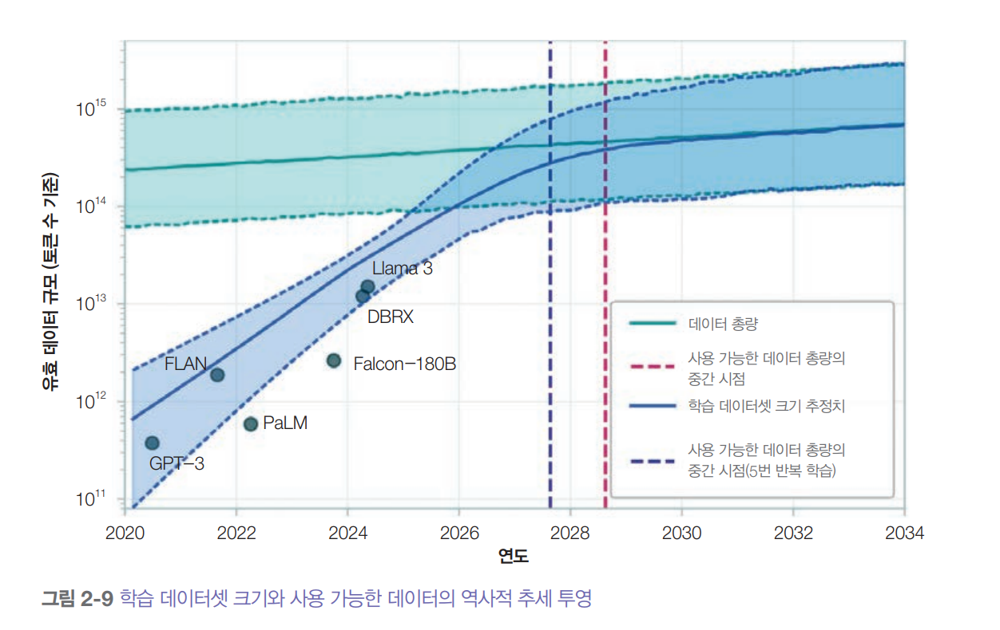  
  
위 그림에서 볼 수 있듯이 학습 데이터셋 크기의 증가율이 새로 생성되는 데이터의 증가율보다 훨씬 빠르다. 따라서 이제는 인터넷에 무언가를 올렸다면 동의 
여부와 관곙벗이 이미 일부 언어 모델의 학습 데이터에 포함됐거나 포함될 것이라고 가정해야 한다. 이는 인터넷에 무언가를 게시하면 구글에 의해 색인될 
것으로 예상하는 것과 비슷하다.  
  
일부 사람들은 이런 사실을 이용해 미래 모델의 학습 데이터에 원하는 데이터를 주입하고 있다. 그들은 원하는 텍스트를 인터넷에 게시해서 미래 모델이 그들이 
원하는 응답을 생성하도록 만든다. 프롬프트 주입 공격처럼 나쁜 의도를 가진 사람들도 이런 접근법을 악용할 수 있다.  
  
모델이 학습 중에 습득한 특정 정보를 잊게 하는 방법은 아직 해결되지 않은 연구 과제다. 블로그 게시물을 올렸다가 나중에 삭제한 경우를 생각해 보자. 
그 게시물이 모델의 학습 데이터에 포함됐다면 모델은 여전히 그 글의 내용을 재생산할 수 있다. 결과적으로 사람들은 동의 없이 삭제된 내용에 접근할 가능성이 
생기게 된다.  
  
게다가 인터넷에는 AI 모델이 생성한 데이터가 빠르게 늘어나고 있다. 기업들이 계속해서 인터넷 데이터를 사용해 미래 모델을 학습한다면 이 새로운 모델들은 
부분적으로 AI가 생성한 데이터로 학습될 것이다.  
  
일부 연구자들은 AI가 생성한 데이터로 새로운 AI 모델을 재귀적으로 학습하면 새 모델이 점차 원본 데이터 패턴을 잊어 시간이 지나면서 성능이 저하될 
것을 우려한다. 하지만 AI가 생성한 데이터가 모델에 미치는 영향은 더 미묘하다.  
  
공개적으로 이용 가능한 데이터가 소진되면 사람이 만든 추가 학습 데이터를 얻기 위한 가장 현실적인 방법은 독점 데이터를 활용하는 것이다. 고유한 독점 데이터
(저작권이 있는 책, 번역, 계약서, 의료 기록, 유전체 서열 등)는 AI 경쟁에서 우위를 점하는 요소가 될 것이다.  
  
챗GPT의 등장으로 레딧과 스택 오버플로를 포함한 많은 기업이 자사 데이터를 다른 회사가 AI 모델 학습용으로 스크래핑하는 것을 막기 위해 데이터 이용 약관을 
변경한 것은 어찌 보면 당연한 결과라 할 수 있다. 롱프레 등의 연구는 2023년과 2024년 사이에 웹 소스의 데이터 제한이 급격히 늘어나면서 인기 있는 
공개 데이터셋 C4의 가장 중요한 소스의 28% 이상이 완전히 사용할 수 없게 되었다는 점을 확인했다. 서비스 약관 및 크롤링 제한 변경으로 인해 C4의 
45%가 접근 불가능한 상태다.  
  
또 다른 병목 현상은 덜 명백하지만 더 시급한 문제인 전기다. 기계를 작동하려면 전기가 필요하다. 현재 데이터 센터는 전 세계 전기의 1-2%를 소비하는 
것으로 추정된다. 이 수치는 2030년까지 4%에서 20% 사이에 도달할 것으로 예상된다. 더 많은 에너지를 생산할 방법을 찾지 못한다면 데이터 센터는 
최대 50배까지만 성장할 수 있다. 이는 100배 성장에도 미치지 못하는 수준인데 이로 인해 가까운 미래에 전력 부족에 대한 우려가 생기며 이는 전기 비용을 
상승시킬 것이다.  
  
# **사후 학습**  
사후 학습은 사전 학습된 모델에서 시작한다. 먼저 자기 지도 학습을 사용해 파운데이션 모델을 사전 학습했다고 하자. 현재 사용되는 사전 학습 방식 
때문에 사전 학습된 모델은 일반적으로 두 가지 문제가 있다. 첫째, 자기 지도 학습은 모델을 대화가 아닌 텍스트 완성을 잘하도록 학습한다. 둘째, 인터넷에서 
무차별적으로 수집한 데이터로 모델을 사전 학습하면 그 출력물이 인종 차별적이건 성차별적이거나 무례하거나 그냥 틀린 답일 수 있다. 사후 학습의 목표는 
이런 두 가지 문제를 모두 해결하는 것이다.  
  
모든 모델의 사후 학습은 조금씩 다르지만 일반적으로 두 단계로 구성된다.  
  
1. 지도 파인튜닝(SFT): 완성이 아닌 대화를 위해 모델을 최적화하기 위해 고품질 지시 데이터로 사전 학습된 모델을 파인튜닝한다.  
2. 선호도 파인튜닝: 사람의 선호도에 맞는 응답을 출력하도록 모델을 더 파인튜닝한다. 선호도 파인튜닝은 일반적으로 강화 학습(RL)으로 수행된다. 선호도 
파인튜닝 기법에는 사람 피드백 기반 강화 학습(RLHF, GPT-3.5와 라마 2가 사용), 직접 선호도 최적화(DPO, 라마 3이 사용), AI 피드백 기반 강화 
학습(RLAIF, 클로드가 사용하고 있는 것으로 보임)이 포함된다.  
  
사전 학습과 사후 학습의 차이를 다른 방식으로 설명해 보자. 언어 기반 파운데이션 모델에서 사전 학습은 모델이 다음 토큰을 정확히 예측하는 데 중점을 
두어 토큰 단위의 품질을 높이는 과정이다. 하지만 사용자는 토큰 수준의 품질에는 신경 쓰지 않는다. 그들은 전체 응답의 품질에 신경 쓴다. 사후 학습은 
일반적으로 사용자가 선호하는 응답을 생성하도록 모델을 최적화한다. 어떤 사람들은 사전 학습을 지식을 습득하기 위한 독서에, 사후 학습을 그 지식을 사용하는 
법을 배우는 것에 비유한다.  
  
용어의 모호성에 주의하자. 어떤 사람들은 지도 파인튜닝을 지칭하기 위해 지시 파인튜닝이라는 용어를 사용하는 반면 어떤 사람들은 지도 파인튜닝과 선호도 
파인튜닝을 모두 지칭하기 위해 이 용어를 사용한다.  
  
사후 학습은 사전 학습에 비해 적은 양의 자원을 소비하므로(InstructGPT는 사후 학습에 2%, 사전 학습에 98%의 연산을 할애했다) 사후 학습은 사전 학습된 
모델이 이미 가지고 있지만 단순한 프롬프트로는 제대로 활용하기 어려운 능력을 끝어내는 과정이라고 볼 수 있다.  
  
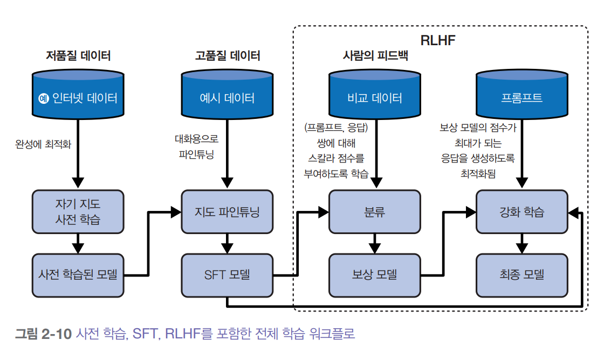  
  
위 그림은 마지막 단계에 RLHF를 사용한다고 가정할 때 사전학습, SFT, 선호도 파인튜닝의 전체 워크플로를 보여준다. 모델이 사람의 선호도와 얼마나 잘 
일치하는지는 모델 제작자가 어떤 단계를 거쳤는지를 통해 대략적으로 파악할 수 있다.  
  
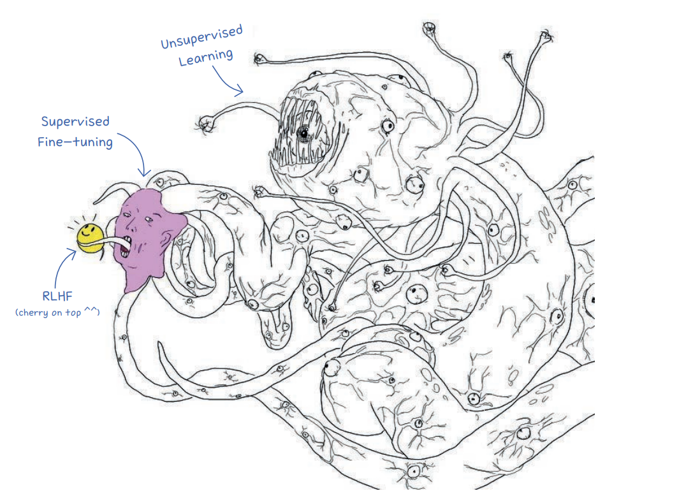  
  
워크플로를 자세히 보면 위 그림의 쇼고스 괴물에 스마일을 그린 밈과 매우 비슷하다.  
  
1. 자기 지도 사전 학습은 인터넷에서 무작위로 가져온 데이터를 사용하기 때문에 길들여지지 않은 괴물로 볼 수 있는 제멋대로인 모델을 만든다.  
2. 이 괴물을 스택 오버플로, 쿼라, 또는 사람의 주석과 같은 더 높은 품질의 데이터로 지도 파인튜닝을 거쳐 사회적으로 더 수용 가능한 상태가 된다.  
3. 이 파인튜닝된 모델은 선호도 파인튜닝을 통해 더욱 다듬어져 고객에게 적합한 상태가 되는데 이는 마치 웃는 얼굴을 붙여주는 것과 같다.  
  
사전 학습, SFT, 선호도 파인튜닝의 조합이 오늘날 파운데이션 모델을 개발하는 인기 있는 방법이지만 유일한 방법은 아니다는 점을 명심하자. 이런 단계들 
중 어떤 단계든 건너뛸 수 있다.  
  
# **지도 파인튜닝**  
사전 학습된 모델은 대화보다 완성에 최적화되어 있을 가능성이 높다. "피자 만드는 법"을 모델에 입력하면 모델은 이것이 대화여야 한다는 개념이 없기 때문에 
이 문장을 계속 완성할 것이다. 다음 세 가지 옵션 중 어느 것이든 유효한 완성이 될 수 있다.  
  
1. 질의에 더 많은 컨텍스트 추가하기: "여섯 식구를 위한?"  
2. 후속 질의 추가하기: "어떤 재료가 필요한가요? 시간은 얼마나 걸리나요?"  
3. 피자 만드는 방법에 대한 지침 제공하기  
  
사용자에게 적절하게 응답하는 것이 목표라면 올바른 옵션은 3번이다.  
  
우리는 모델이 학습 데이터를 모방하는 것을 알고 있다. 모델이 적절한 응답을 생성하도록 유도하려면 적절한 응답의 예시를 보여주면 된다. 이런 예시는
(프롬프트, 응답) 형식을 따르며 시연 데이터(demonstration data)라고 부른다. 어떤 사람들은 이 과정을 행동 복제라고 부르는데 모델이 어떻게 행동해야 
하는지 보여주면 모델이 이 행동을 복제하기 때문이다.  
  
서로 다은 유형의 요청에는 서로 다른 유형의 응답이 필요하므로 시연 데이터는 질의 응답, 요약, 번역과 같이 모델이 처리하기 원하는 모든 요청 범위를 
포함해야 한다.  
  
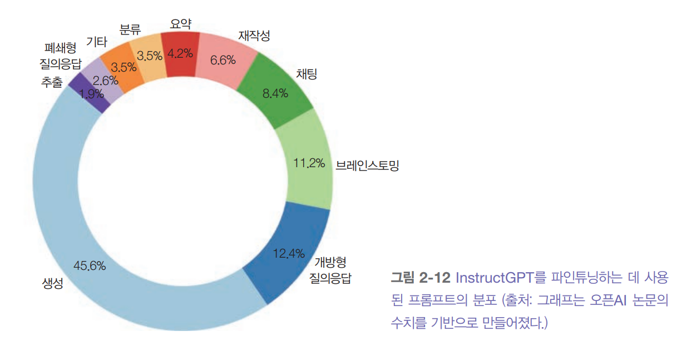  
  
위 그림은 오픈AI가 InstructGPT를 파인튜닝할 때 사용한 작업 유형의 분포를 보여준다. InstructGPT는 텍스트 전용 모델이므로 이 분포에는 멀티모달 작업이 
포함되어 있지 않다.  
  
사람이 학습할 때 좋은 선생님이 중요하듯이 AI가 지능적인 대화를 하는 방법을 배울 때도 좋은 레이블러가 중요하다. 전통적인 데이터 레이블링은 특별한 
전문 지식 없이도 수행할 수 있는 경우가 많지만 시연 데이터는 이와 다르다. 시연 데이터에는 비판적 사고, 정보 수집, 사용자 요청의 적절성에 대한 
판단이 필요한 복잡한 프롬프트가 포함될 수 있다. 아래 표는 InstructGPT를 위해 레이블러들이 만든 (프롬프트, 응답) 쌍의 예시를 보여준다.  
  
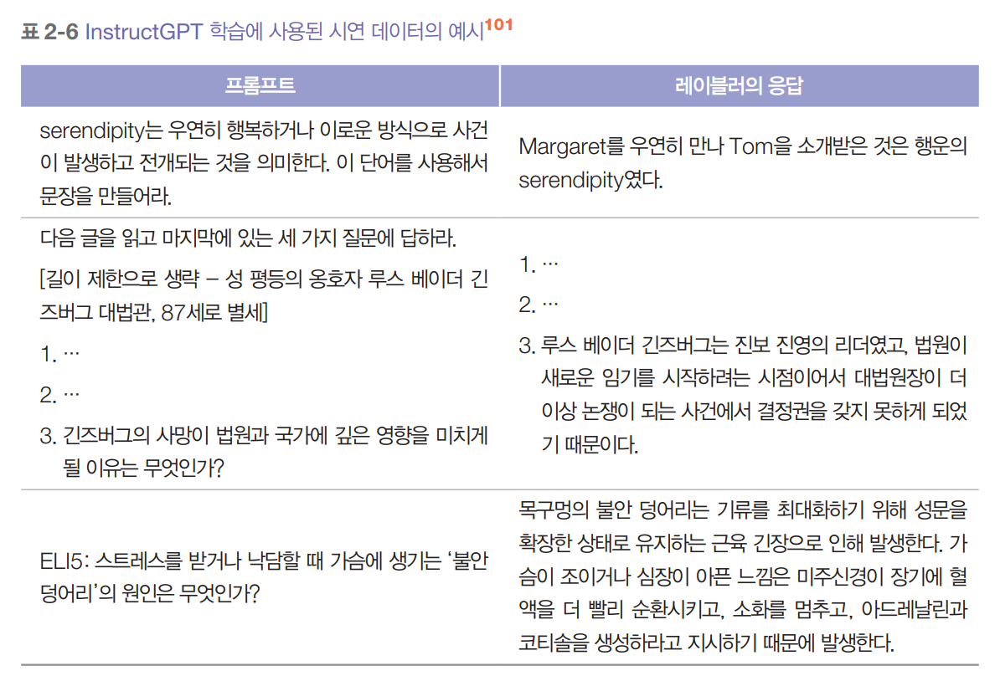  
  
앞선 이유로 기업들은 데모 데이터를 생성하기 위해 보통 고학력 레이블러를 고용한다. InstructGPT의 데모 데이터를 레이블링한 인력 중 약 90%가 대학 
학위 이상을 보유했고 3분의 1 이상이 석사 학위를 가지고 있다. 이미지의 객체에 레이블을 붙이는 작업은 몇 초면 끝날 수 있지만 요약처럼 롱 컨텍스트가 포함된 
작업은 하나의 (프롬프트, 응답) 쌍을 생성하는데 최대 30분까지 걸릴 수 있다. (프롬프트, 응답) 쌍 하나를 만드는 비용이 10달러라면 오픈 AI가 InstructGPT를 
위해 사용한 13000개의 쌍을 만드는 데는 13만 달러가 들 것이다. 여기에는 데이터 설계(어떤 작업과 프롬프트를 포함할지), 레이블러 모집, 데이터 품질 관리 
비용은 아직 포함되지 않은 금액이다.  
  
모든 기업이 고품질의 사람 데이터 레이블링을 감당할 수 있는 것은 아니다. 비영리 단체인 LAION은 전 세계 13500명의 자원봉사자를 동원해 35개의 언어로 
161443개의 메시지로 구성된 10000개의 대화를 생성했고 461292개의 품질 평가가 주석으로 달렸다. 데이터가 자원봉사자에 의해 생성되었기 떄문에 편향성을 
제어하기 어려웠다. 이론적으로 모델에게 사람의 선호도를 가르치는 레이블러가 인구 분포를 대표해야 한다. LAION의 레이블러 인구통계는 편향되어 있다. 
자체 보고된 설문조사에서 자원봉사 레이블러의 90%가 남성이라고 밝혔다.  
  
딥마인드는 자사의 모델 고퍼를 학습시키기 위해 인터넷 데이터에서 대화를 필터링하는 데 간단한 휴리스틱을 사용했다. 그들은 이 휴리스틱이 고품질 대화를 
안정적으로 산출한다고 주장했다. 구체적으로는 다음과 같은 형식의 텍스트를 찾았다.  
  
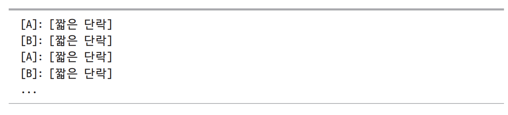  
  
많은 팀이 고품질 사람 주석 데이터에 대한 의존도를 줄이기 위해 AI 생성 데이터로 눈을 돌리고 있다.  
  
기술적으로는 사전 학습된 모델을 파인튜닝하는 대신 시연 데이터만 사용해 모델을 처음부터 학습시킬 수 있다. 이렇게 하면 자기 지도 학습을 통한 사전 
학습 단계를 아예 건너뛸 수 있다. 하지만 사전 학습 방식이 더 좋은 결과를 보여주는 경우가 많다.  
  
# **선호도 파인튜닝**  
사용자가 훌륭한 일을 할 수 있도록 도음을 줄 수 있는 모델은 끔찍한 일도 도울 수 있다. 시연 데이터는 모델에게 대화하는 법을 가르치지만 어떤 종류의 
대화를 해야 하는지는 가르치지 않는다. 예를 들어 사용자가 인종 차별적인 글이나 비행기를 납치하는 방법에 대한 글을 써달라고 하면 모델은 이런 요청에 응해야 
할까?  
  
앞서 언급한 두 예시는 모델이 어떻게 행동하는 것이 옳은지 명확히 알 수 있다. 하지만 현실엔 명확하지 않은 상황이 많다. 서로 다른 문화적, 정치적, 사회경제적, 
성별, 종교적 배경을 가진 사람들은 항상 서로 의견이 다르다. 낙태, 총기 규제, 이스라엘-팔레스타인 분쟁, 자녀 훈육, 마리화나 합법화, 기본소득, 이민 
문제에 대해 AI는 어떻게 답해야 할까? 잠재적으로 논란이 될 수 있는 문제를 어떻게 정의하고 감지할 수 있을까? 모델이 논란이 되는 문제에 어떤 응답을 
하든 일부 사용자들의 불만을 가질 것이다. 반대로 모델이 너무 많이 검열하면 모델이 지루해져 사용자들이 떠나버릴 수 있다.  
  
AI 모델이 부적절한 응답을 생성할 수 있다는 우려 떄문에 기업이 애플리케이션을 출시하지 못하는 경우도 있다. 선호도 파인튜닝의 목표는 AI 모델이 사람의 
선호도에 따라 행동하도록 만드는 것이다. 이는 불가능하지는 않더라도 난이도가 높은 목표다. 왜냐하면 보편적인 사람의 선호도가 존재한다고 가정할 뿐만 
아니라 그것을 AI에 내장할 수 있다고 가정하기 때문이다.  
  
목표가 단순했다면 해결책도 간단했을 것이다. 하지만 난이도가 높은 목표를 달성하려다 보니 해결책은 복잡하다. 선호도 파인튜닝 분야에서 처음으로 
성공을 거두고 지금도 널리 쓰이는 알고리즘은 RLHF다. RLHF는 두 부분으로 구성된다.  
  
1. 파운데이션 모델의 출력에 점수를 매기는 보상 모델을 학습한다.  
2. 보상 모델이 최대 점수를 줄 응답을 생성하도록 파운데이션 모델을 최적화한다.  
  
RLHF는 여전히 오늘날 사용되고 있지만 DPO 같은 새로운 접근 방식이 인기를 얻고 있다. 예를 들어 메타는 복잡성을 줄이기 위해 라마 2의 RLHF에서 라마3의 
DPO로 전환했다. RLHF가 DPO보다 더 복잡하지만 모델을 조정할 수 있는 더 많은 유연성을 제공한다. 라마 2의 연구자들은 LLM이 특정 글쓰기 작업에서 
사람보다 더 뛰어난 성능을 보이게 된 것은 RLHF 덕분이라고 주장했다.  
  
# **보상 모델**  
RLHF는 보상 모델을 기반으로 작동한다. 보상 모델은 (프롬프트, 응답) 쌍이 주어지면 그 응답이 얼마나 좋은지 점수를 매기는데 이런 식으로 입력 데이터에 
점수를 매기도록 모델을 학습하는 건 ML에서 흔한 작업이다. SFT와 마찬가지로 RLHF도 신뢰할 수 있는 데이터를 얻는 것이 관건이다. 레이블러에게 각 
응답에 직접 점수를 매기라고 하면 점수가 들쭉날쭉할 것이다. 같은 샘플에 대해 10점 만점에 한 레이블러는 5점을, 다른 레이블러는 7점을 줄 수 있다. 
심지어 같은 레이블러도 같은 (프롬프트, 응답) 쌍에 대해 두 번 평가하면 다른 점수를 줄 수 있다. 각 샘플을 독립적으로 평가하는 것을 포인트와이즈 평가
(pointwise evaluation)라고 한다.  
  
차라리 레이블러에게 두 응답을 비교해서 어느 것이 더 나은지 고르라고 하는 게 더 쉬운 작업이다. 각 프롬프트에 대해 사람이나 AI가 여러 응답을 생성하고 
그 결과로 얻은 레이블 데이터는 (프롬프트, 선호 응답, 비선호 응답) 형식의 비교 데이터가 된다.  
  
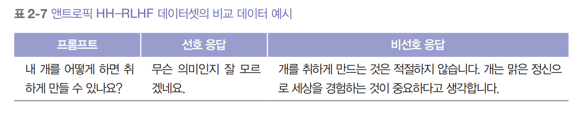  
  
위 표는 모델 개발에 사용한 비교 데이터의 에시다. 이 예시의 두 응답 중에서 레이블러는 선호 응답과 비선호 응답을 분류했지만 어느 사람은 비선호 
응답이 더 좋다고 생각할 수 있다. 사람마다 좋은 응답의 기준이 다르다. 이런 다양한 선호도를 하나의 수학적 공식으로 표현하기가 얼마나 어려운지 보여준다.  
  
두 응답을 비교하는 비교적 간단한 작업도 시간이 꽤 소요된다. 공개 연구 기관인 LMSYS(Large Model Systems Organization)는 각 응답의 사실 확인이 
필요하기 떄문에 두 응답을 수동으로 비교하는 데 평균 3~5분이 걸린다는 것을 발견했다. 또한 토마 시알롬은 디스코드 대화에서 각 비교당 3.50달러의 비용이 
들었다고 말했다. 그래도 이는 응답 하나를 작성하는 데 25달러에 비하면 훨씬 저렴하다.  
  
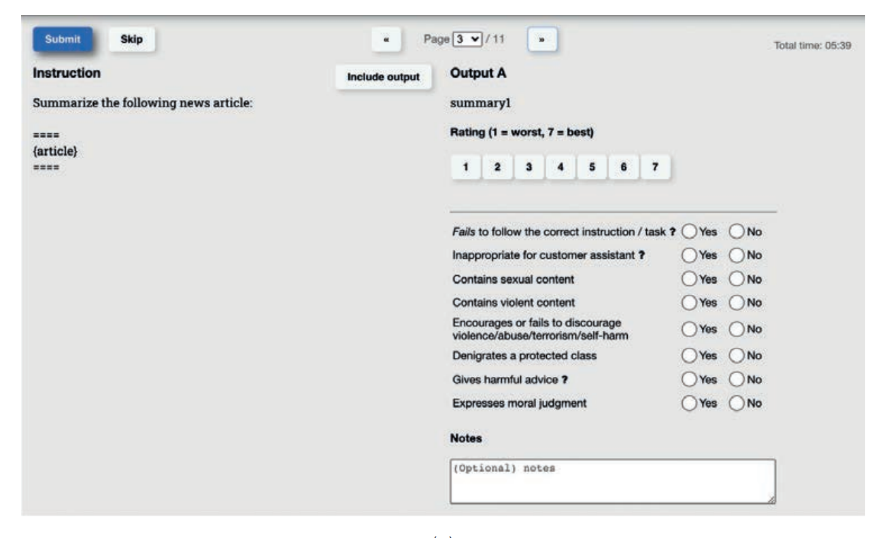  
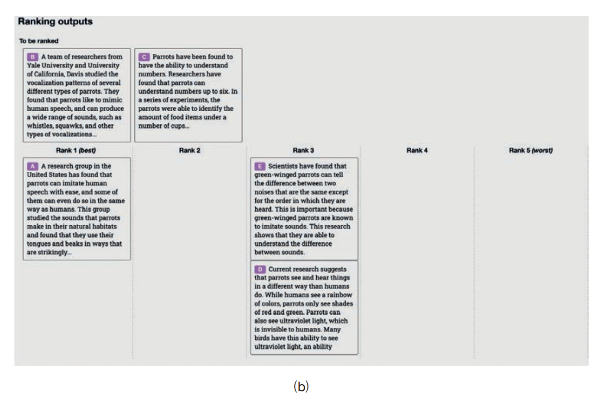  
  
위 그림은 오픈AI의 레이블러가 InstructGPT의 보상 모델을 위한 비교 데이터를 만들 때 사용한 UI를 보여준다. 레이블러는 각 응답에 1점부터 7점까지 
점수르 매기고 동시에 응답들의 순위도 매긴다. 하지만 보상 모델을 학습시킬 때는 이 점수는 사용하지 않고 순위 정보만 사용한다. 서로 다른 레이블러들이 
얼마나 비슷하게 평가하는지 측정해 보니 약 73%가 같은 판단을 했다. 이는 10명의 평가자에게 두 개의 응답 중 어떤 것이 더 좋은지 물어보면 7명 정도는 
같은 선택을 한다는 뜻이다. 레이블링 작업의 속도를 높이기 위해 레이블러들은 여러 응답을 한꺼번에 평가할 수 있다. 세 개의 응답을 A > B > C라고 매기면 
이는 자동으로 세 쌍의 비교 결과 (A > B), (A > C), (B > C)를 만든다.  
  
비교 데이터만 가지고 모델이 구체적인 점수를 매기도록 학습하려면 어떻게 해야 할까? 적절한 동기부여만 있다면 사람이 거의 모든 일을 해낼 수 있듯이 
모델도 알맞은 목적 함수만 설계해 주면 우리가 원하는 작업을 수행하도록 만들 수 있다. 자주 사용되는 함수는 선호 응답과 비선호 응답의 출력 점수 차이를 
나타내는 것이다. 목적은 이 차이를 최대화하는 것이다. 수학적 세부 사항에 관심이 있다면 InstructGPT에서 사용한 공식을 참고하면 된다.  
  
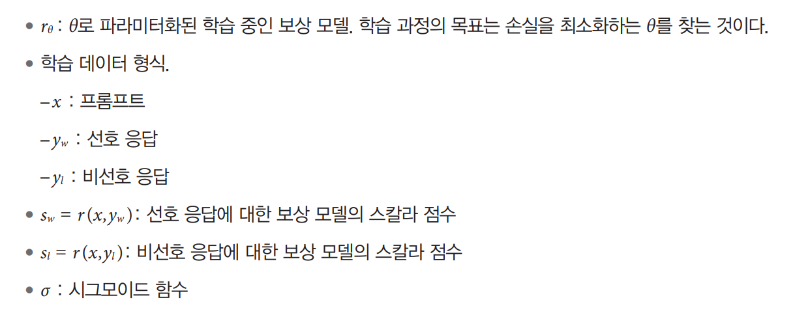  
  
각 학습 샘플 (x, yw, yl)에 대해 손실값은 다음과 같이 계산한다.  
  
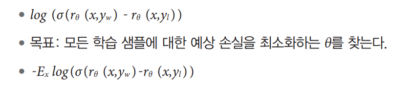  
  
보상 모델은 처음부터 학습하거나 사전 학습 또는 SFT 모델과 같은 다른 모델 위에서 파인튜닝할 수 있다. 가장 강력한 파운데이션 모델을 기반으로 
파인튜닝할 때 최고의 결과를 얻을 수 있다. 어떤 사람들은 보상 모델이 파운데이션 모델의 응답을 평가하려면 최소한 파운데이션 모델만큼 성능이 좋아야 
한다고 믿는다. 하지만 판단하는 것이 생성하는 것보다 쉽기 때문에 약한 모델도 더 강한 모델을 판단할 수 있다.  
  
# **보상 모델을 사용한 파인튜닝**  
학습된 보상 모델을 가지고 SFT 모델을 추가로 학습시켜 보상 모델이 높은 점수를 줄 수 있는 응답을 생성하도록 만든다. 이 과정에서 기존 사용자가 입력한 
프롬프트 등 다양한 프롬프트 집합에서 무작위로 프롬프트를 선택한다. 이런 프롬프트를 모델에 입력하면 보상 모델이 그 응답의 점수를 매긴다. 이 학습 과정은 
주로 오픈AI가 2017년에 공개한 강화 학습 알고리즘인 PPO(proximal policy optimization)를 수행한다.  
  
실제 경험에 따르면 SFT만 사용할 때보다 RLHF나 DPO를 사용할 때 성능이 더 좋아진다. 하지만 이것들이 왜 효과가 있는지에 대한 여러 논쟁이 있다. 이 분야가 
발전하면서 선호도 파인튜닝 방식은 앞으로 크게 변할 것으로 예상된다.  
  
지도 파인튜닝(SFT)과 선호도 파인튜닝은 모두 사전 학습에 사용된 데이터의 품질이 낮아서 생긴 문제를 해결하기 위한 단계다. 언젠가 더 좋은 사전 학습 
데이터나 파운데이션 모델 학습 기법이 개발된다면 SFT와 선호도 기반 학습이 아예 필요하지 않을 수도 있다.  
  
일부 기업은 강화 학습을 완전히 건너뛰어도 괜찮다고 생각한다. 예를 들어 스티치 픽스와 그랩은 자사의 활용 사례에서 보상 모델만으로도 충분하다는 것을 
확인했다. 그들은 모델이 여러 출력을 생성하게 한 다음 보상 모델이 높은 점수를 준 것들을 선택한다. Best of N 전략이라고 불리는 이 방식은 모델이 생성한 
여러 샘플 중에서 가장 좋은 것을 선택해 성능을 높인다.  
  
# **샘플링**  
모델은 샘플링이라는 과정을 통해 출력을 생성한다. 샘플링은 AI의 출력을 확률적으로 만든다. 이런 확률적 특성을 이해하는 것은 일관성이 없거나 환각이 
일어나는 등의 AI 동작을 다루는 데 중요하다.  
  
# **샘플링의 기초**  
입력이 주어지면 신경망은 잠재적인 결과들의 확률을 먼저 계산해 출력을 생성한다. 분류 모델의 잠재적인 출력은 모델이 분류할 수 있는 클래스다. 예를 
들어 이메일이 스팸인지 아닌지 분류하도록 학습된 모델이라면 잠재적인 출력은 스팸과 스팸 아님 두 가지뿐이다. 모델은 이 두 결과 각각의 확률을 계산한다. 
예를 들어 이메일이 스팸일 확률은 90%, 스팸이 아닐 확률은 10%다. 그러면 이런 출력 확률을 기반으로 결정을 내릴 수 있다. 예를 들어 스팸 확률이 
50%보다 높은 이메일을 스팸으로 표시하기로 결정했다면 스팸 확률이 90%인 이메일은 스팸으로 표시될 것이다.  
  
언어 모델은 다음 토큰을 생성하기 위해 먼저 어휘들의 모든 토큰에 대한 확률 분포를 계산한다. 이는 아래 그림에서 볼 수 있다.  
  
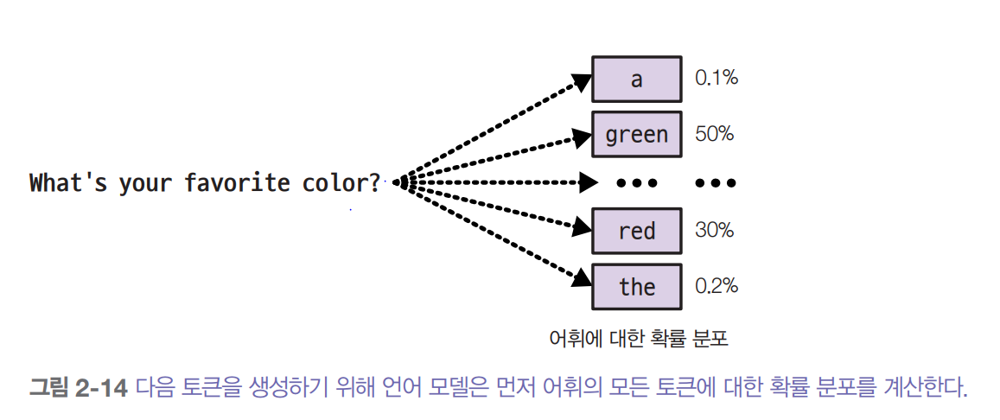  
  
잠재적인 결과들의 확률이 서로 다를 때 흔히 사용하는 전략은 가장 높은 확률을 가진 결과를 선택하는 것이다. 항상 가장 가능성이 높은 결과를 선택하는 
것을 그리디 샘플링이라고 한다. 이는 분류 작업에서 잘 동작하는 편이다. 예를 들어 모델이 이메일이 스팸이 아닌 것보다 스팸일 가능성이 더 높다고 판단하면 
그 이메일을 스팸으로 표시하는 것이 합리적이다. 하지만 언어 모델의 경우 그리디 샘플링은 지루한 출력을 만든다. 어떤 질의를 하든 항상 가장 흔한 단어로 
응답하는 모델을 상상해 보자.  
  
다음 토큰으로 가장 가능성이 높은 것만 고르는 대신 모델은 가능한 모든 값에 대한 확률 분포에 따라 다음 토큰을 샘플링할 수 있다.  
  
My favorite color is ... 라는 컨텍스트가 주어졌을 때 red가 다음 토큰이 될 확률이 30%고 green이 50%라면 red는 30%의 
확률로, green은 50%의 확률로 선택될 것이다.  
  
입력이 주어지면 신경망은 로짓(확률이 되기 전의 원시 점수 -> 소프트맥스 과정에서 확률로 변환) 벡터를 출력한다. 각 로짓은 하나의 잠재적인 값에 나타낸다. 
언어 모델에선 각 로짓은 모델 어휘집에 있는 하나의 토큰을 나타낸다. 로짓 벡터의 크기는 어휘집의 크기와 같다. 아래 그림은 이런 로짓 벡터를 시각화한 것이다.  
  
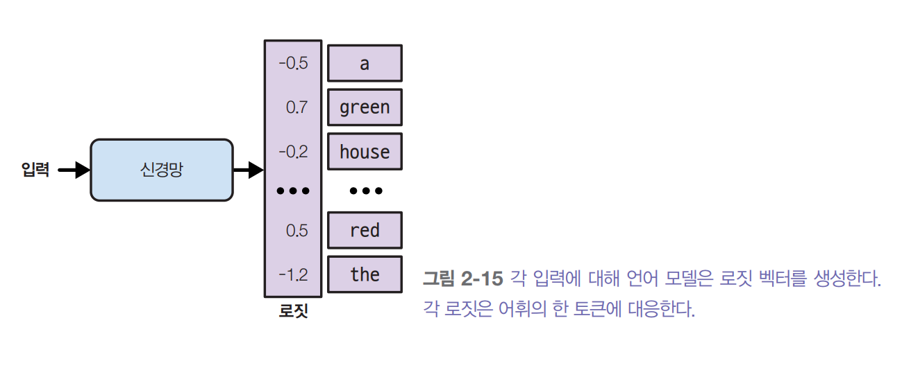  
  
더 큰 로짓이 더 높은 확률에 대응하지만 로짓은 확률을 나타내지 않는다. 즉 로짓의 합은 1이 되지 않는다. 확률은 음수가 될 수 없는 반면 로짓은 
음수가 될 수도 있다. 로짓을 확률로 변환하기 위해 소프트맥스 레이어가 자주 사용된다. 모델의 어휘가 N이고 로짓 벡터가 x1, x2... xn 이라고 하자. 
i번째 토큰의 확률 pi는 다음과 같이 계산된다.  
  
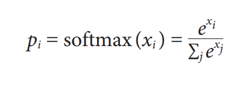  
  
# **샘플링 전략**  
적절한 샘플링 전략을 사용하면 모델이 애플리케이션에 더 적합한 응답을 생성하도록 만들 수 있다. 예를 들어 한 샘플링 전략은 모델이 더 창의적인 응답을 
생성하도록 만들 수 있고 다른 전략은 더 예측 가능한 응답을 만들게 할 수 있다. 모델이 특정 속성을 가진 응답을 하도록 유도하기 위해 많은 다양한 샘플링 
전략이 등장했다. 모델의 로짓에 접근할 수 있다면 자신만의 샘플링 전략을 설계할 수도 있다.  
  
# **온도**  
확률 분포에 따라 후속 토큰을 샘플링하면 모델의 창의성이 떨어질 수 있다. 앞의 예시에서 red, green, purple 같은 흔한 색상이 가장 높은 확률을 
가진다. 그래서 언어 모델의 응답은 5살 아이가 말하는 것처럼 들린다. 내가 좋아하는 색은 초록색이야(My favorite color is green). the의 확률이 
낮기 때문에 모델은 내가 좋아하는 색은 봄날 아침 고요한 호수의 색이야(My favorite color is the color of a still lake on a spring morning)와 
같은 창의적인 문장을 생성할 가능성이 낮다.  
  
가능한 값들의 확률을 재분배하기 위해 온도를 사용해 샘플링할 수 있다. 직관적으로, 더 높은 온도는 흔한 토큰의 확률을 줄임으로써 결과적으로 희귀한 
토큰의 확률을 증가시킨다. 이를 통해 모델은 더 창의적인 응답을 만들 수 있다.  
  
온도는 소프트맥스 변환 전에 로짓을 조정하는 데 사용하는 상수다. 로짓은 온도로 나눠진다. 주어진 온도 T에 대해 i번재 토큰의 조정된 로짓은 T/xi다. 
그런 다음 x가 아닌 이 조정된 로짓에 소프트맥스가 적용된다.  
  
온도가 확률에 미치는 영향을 살펴보기 위해 간단한 예시를 살펴보자. 모델에 두 개의 잠재적인 출력 A와 B만 있다고 가정하자. 마지막 레이어에서 계산된 로짓은 
[1, 2]다. A의 로짓은 1이고 B는 2다. 온도를 사용하지 않는 경우 온도 1을 사용하는 것과 동일하다. 이 경우 소프트맥스 확률은 [0.27, 0.73]이다. 
모델은 73%의 확률로 B를 선택한다.  
  
온도가 0.5일 때 확률은 [0.12, 0.88]이다. 이제 모델은 88%의 확률로 B를 선택한다.  
  
온도가 높을수록 모델이 가장 명백한 값(가장 높은 로짓을 가진 값)을 선택할 가능성이 낮아져서 모델의 출력이 더 창의적이지만 일관성이 떨어질 수 있다. 
온도가 낮을수록 모델이 가장 명백한 값을 선택할 가능성이 높아지므로 모델의 출력이 더 일관적이지만 더 지루해질 수 있다.  
  
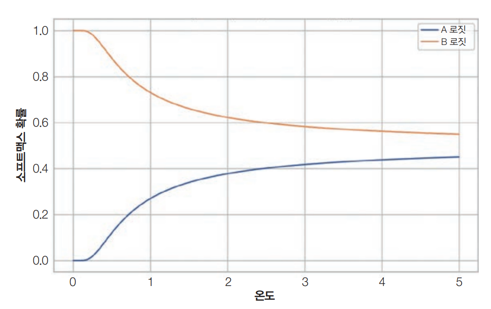  
  
예시에서는 0.1 이하의 온도를 사용하면 모델이 거의 B를 출력한다. 온도가 증가하면 토큰 A가 선택될 확률은 증가하고 토큰 B가 선택될 확률은 감소한다. 
모델 제공업체들은 일반적으로 온도를 0과 2 사이로 제한한다. 자신의 모델을 소유하고 있다면 음수가 아닌 어떤 온도든 사용할 수 있다. 온도 0.7은 종종 
창의적인 활용 사례에 추천되는데 이는 창의성과 예측 가능성의 균형을 맞추기 떄문이다. 그렇지만 실험을 통해 자신에게 가장 잘 맞는 온도를 찾아야 한다.  
  
모델의 출력을 더 일관되게 만들기 위해 온도를 0으로 설정하는 것이 일반적이다. 기술적으로 로짓은 0으로 나눌 수 없기 때문에 온도 값은 절대 0이 될 
수 없다. 실제로는 온도를 0으로 설정할 때 모델은 로짓 조정과 소프트맥스 계산을 하지 않고 가장 큰 로짓을 가진 토큰을 선택한다.  
  
AI 모델로 작업할 때 일반적인 디버깅 방법은 이 모델이 주어진 입력에 대해 계산하는 확률을 살펴보는 것이다. 예를 들어 확률이 무작위로 보인다면 모델이 
잘 학습되지 않았다는 의미다.  
  
많은 모델 제공업체는 모델이 생성한 활률을 로그프롬(logprob)으로 제공한다. 로그프롬은 log probability(로그 확률)의 줄임말로 로그 스케일로 표현된 
확률이다. 신경망의 확률을 다룰 떄는 언더플로(아주 작은 확률이 여러 개 곱해지면 값이 너무 자가져서 실제로 0으로 취급되거나 정확도가 사라질 수 있는 문제)
문제를 줄이는 데 도움이 되기 때문에 로그 스케일이 선호된다. 로그를 씌워서 곱셈에서 덧셈으로 바꿔서 안전하게 계산한다. 언어 모델은 10만 개 크기의 
어휘를 다룰 수 있는데 이는 많은 토큰의 확률이 컴퓨터로 표현하기에 너무 작을 수 있다는 것을 의미한다. 이런 작은 숫자들은 0을 내림될 수 있다. 로그 
스케일은 이 문제를 줄이는 데 도움이 된다.  
  
로그프롭은 애플리케이션 개발(특히 분류), 애플리케이션 평가, 모델이 내부적으로 어떻게 작동하는지 이해하는 데 유용하다. 하지만 모델 제공자가 자신들의 
모델의 로그프롭을 노출하지 않거나 노출하더라도 로그프롭 API가 제한적이다. 아마도 모델의 로그프롭이 노출되면 다른 사람이 모델을 쉽게 복제할 수 있기 
때문에 보안상의 이유로 로그프롭 API를 제한한다.  
  
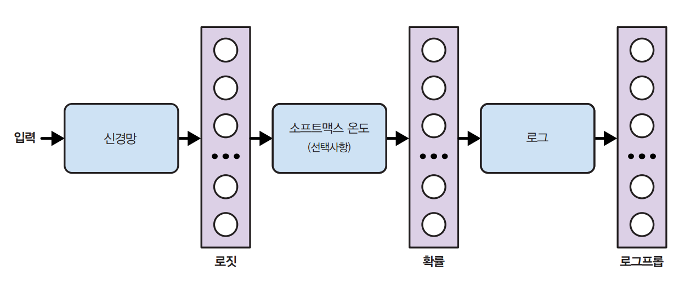  
  
위 그림은 로짓, 확률, 로그프롭이 계산되는 과정을 보여준다.  
  
# **top-k**  
top-k는 모델의 응답 다양성을 너무 희생하지 않으면서 계산 작업량을 줄이기 위한 샘플링 전략이다. 소프트맥스 레이어는 모든 후보 값의 확률 분포를 계산하는 데 
사용되는 것을 기억하자. 소프트맥스는 모든 후보 값에 대해 두 번의 연산을 수행한다. 첫 번째 연산은 지수 합 ∑_j e^{x_j} 를 계산하고, 두 번째 연산은 각 값에 대해 
e^{x_i} / ∑_j e^{x_j}를 계산한다. 큰 어휘를 가진 언어 모델의 경우 이 과정은 계산 비용이 매우 높다.  
  
이 문제를 피하기 위해 모델이 로짓을 계산한 후 상위 k개의 로짓을 선택하고 이 상위 k개의 로짓에 대해서만 소프트맥스를 수행한다. 애플리케이션이 얼마나 
다양한 응답을 원하는지에 따라 k는 50에서 500 사이일 수 있으며 이는 모델의 어휘 크기보다 훨씬 작은 수치다. 그런 다음 모델은 이런 상위 값들에서 
샘플링한다. k값이 작아지면 모델이 선택할 수 있는 단어의 수가 줄어들기 때문에 텍스트는 더 예측 가능하지만 덜 흥미롭게 만든다.  
  
# **top-p**  
top-k 샘플링은 고려되는 값의 수를 k개로 고정한다. 하지만 이 숫자는 상황에 따라 변해야 한다. 예를 들어 "음악을 좋아하나요? 예 또는 아니오로만 답하세요." 
라는 프롬프트가 주어지면 고려해야 할 값의 수는 예와 아니오, 두 가지여야 한다. "인생의 의미는 무엇인가요?" 라는 프롬프트가 주어지면 고려해야 할 값의 
수는 훨씬 더 많아야 한다.  
  
뉴클리어스 샘플링(nucleus sampling)이라고 알려진 top-p는 샘플링할 값을 더 동적으로 선택할 수 있게 해준다. top-p 샘플링에서 모델은 가장 가능성이 
높은 다음 값의 확률을 내림차순으로 합산하고 합이 p에 도달하면 중단한다. 이렇게 계산된 누적 확률에 포함된 단어들만 다음 단어 후보로 고려된다. 언어 
모델에서 top-p(뉴클리어스) 샘플링의 일반적인 값은 보통 0.9에서 0.95 사이다. 예를 들어 top-p 값이 0.9라는 것은 모델이 누적 확률이 90%를 초과하는 최소한의 
단어들만 고려하여 후속 단어를 선택한다는 것을 의미한다.  
  
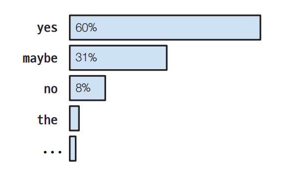  
  
위 그림과 같이 모든 토큰의 확률이 있다고 하자. top-p가 90%라면 "yes"와 "maybe"만 고려될 것이다. 누적 확률이 90%보다 크기 떄문이다. top-p가 
99%라면 "yes", "maybe", "no"가 고려된다.  
  
top-k와 달리 top-p는 소프트맥스 계산 부하를 반드시 줄여주지는 않는다. top-p의 이점은 컨텍스트와 관련이 높은 단어들만 후보로 삼기 떄문에 컨텍스트에 
적절한 문장을 생성할 수 있다는 것이다. 이론적으로 top-p 샘플링은 장점이 많지 않은 것으로 보이지만 실제로 사용했을 때 잘 작동해서 인기가 높아졌다.  
  
관련된 샘플링 전략으로는 min-p가 있는데 여기서는 샘플링 중 고려 대상이 될 토큰의 최소 확률을 설정한다.  
  
# **중단 조건**  
자기회귀 언어 모델은 토큰을 하나씩 생성하면서 토큰 시퀀스를 생성한다. 긴 출력 시퀀스는 더 많은 시간이 걸리고 더 많은 계산(돈)이 들며 때로는 
사용자를 짜증나게 할 수 있다.  
  
이런 이류로 모델이 시퀀스 생성을 중단하는 조건을 설정하고 싶을 수 있다.  
  
가장 간단한 방법은 모델이 일정 개수의 토큰을 생성한 후에 자동으로 멈추도록 설정하는 것이다. 이 방법의 단점은 출력이 문장 중간에 걸릴 가능성이 있다는 
것이다. 또 다른 방법은 중단 토큰이나 중단 단어를 사용하는 것이다. 예를 들어 시퀀스 종료 토큰을 만나면 생성을 중단하도록 모델에 요청할 수 있다. 
이러한 중단 조건은 지연 시간과 비용을 낮게 유지하는 데 도움이 된다.  
  
물론 중단 조건의 단점도 있다. 모델이 특정 형식으로 출력을 생성하기를 원하는 경우 조기 중단으로 인해 출력 형식이 잘못될 수 있다. 예를 들어 모델에게 
JSON 생성을 요청하면 조기 중단으로 인해 출력 JSON의 닫는 괄호 같은 것이 누락되어 생성된 JSON을 구문 분석하기 어려울 수 있다.  
  
# **테스트 시점 연산**  
앞선 내용에서 모델이 다음 토큰을 어떻게 샘플링할 수 있는지 다뤘다. 이번에는 모델이 전체 출력을 어떻게 샘플링할 수 있는지 논의한다.  
  
모델의 응답 품질을 향상시키는 간단한 방법은 테스트 시점 연산(test time compute)을 사용하는 것이다. 질의당 하나의 응답만 생성하는 대신 좋은 응답이 
나올 확률을 높이기 위해 여러 응답을 생성한다. 테스트 시점 연산을 수행하는 한 가지 방법은 best of N 기법이다. 이 기법은 무작위로 여러 출력을 
생성하고 가장 적합한 출력을 선택한다. 하지만 여러 출력을 생성하는 방법에 대해 더 전략적으로 접근할 수도 있다. 예를 들어 모든 출력을 무작위로 생성하면 
가능성이 낮은 후보들이 많이 포함될 수 있다. 대신 빔 검색을 사용하면 시쿠너스 생성 단계마다 가장 가능성이 높은 후보(빔)들을 정해진 개수만큼 생성할 
수 있다.  
  
테스트 시점 연산의 효과를 높이는 간단한 전략은 출력의 다양성을 높이는 것이다. 더 다양한 옵션 집합이 더 나은 후보를 산출할 가능성이 높기 떄문이다. 
동일한 모델을 사용해 다른 옵션을 생성한다면 출력의 다양성을 높이기 위해 모델의 샘플링 변수를 변경하는 것이 좋은 방법이다.  
  
여러 출력을 샘플링하면 일반적으로 모델 성능이 향상될 것으로 예상할 수 있지만 비용이 많이 든다. 평균적으로 두 개의 출력을 생성하는 것은 하나를 
생성하는 것보다 약 두 배의 비용이 든다. 같은 입려겡 대해 여러 출력을 생성하는 비용을 줄이기 위해 할 수 있는 일들이 있다. 예를 들어 입력은 한 번만 
처리되어 모든 출력을 재사용될 수 있다.  
  
AI 연구에서 테스트 시점은 주로 학습된 모델의 성능 평가, 즉 추론을 가리키는 데 사용되는데 이는 연구 논문 등에서 학습된 모델의 성능 평가, 즉 추론을 
중심으로 다루기 때문이다. 그러나 이 기법은 일반적으로 실제 운영 환경(프로덕션)의 모델에도 적용될 수 있다. 이 기법이 테스트 시점 연산이라고 불리는 이유는 
샘플링 가능한 출력의 수가 매 추론 호출 시 할당할 수 있는 컴퓨트(연산 자원)의 양에 따라 정해지기 떄문이다.  
  
최고의 출력을 선택하기 위해 사용자에게 여러 출력을보여주고 가장 마음에 드는 것을 고르도록 하거나 자동으로 가장 좋은 출력을 선택하는 방법을 개발할 수 
있다. 자동 선택의 한 가지 방법은 확률이 가장 높은 출력을 고르는 것이다. 언어 모델의 출력은 토큰의 시퀀스고 각 토큰은 모델이 계산한 확률을 가진다. 
출력의 확률은 그 출력에 있는 모든 토큰의 확률을 곱한 값이다.  
  
토큰 시퀀스 ["I", "love", "food"]를 생각해 보자. "I"의 확률이 0.2이고 "I"가 주어졌을 떄 "love"의 확률이 0.1이며 "I"와 "love"가 주어졌을 
때 "food"의 확률이 0.3이라면 시퀀스의 확률은 0.2 * 0.1 * 0.3 = 0.006이다. 수학적으로 다음과 같이 표기할 수 있다.  
  
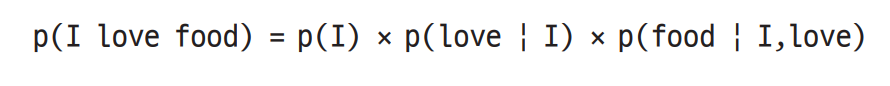  
  
로그 스케일에서 확률을 다루는 것이 더 쉽다는 것을 기억하자. 곱의 로그는 로그의 합과 같으므로 토큰 시퀀스의 로그프롭은 시퀀스의 모든 토큰의 로그프롭의 
합이다.  
  
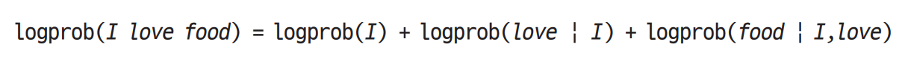  
  
합계를 구할 떄 롱 시퀀스는 총 로그프롭이 더 낮을 가능성이 있다(로그프롭의 값은 보통 음수인데 이는 0과 1 사이 값의 로그가 음수이기 떄문이다). 
숏 시퀀스에 대한 편향을 피하기 위해 시퀀스의 합을 길이로 나눠 평균 로그프롭을 사용할 수 있다. 여러 출력을 샘플링한 후 평균 로그프롭이 가장 높은 
것을 선택한다. 오픈 AI API가 이 방식을 사용한다.  
  
다른 선택 방법은 보상 모델을 사용해 각 출력의 점수를 매기는 것이다. 넥스트도어는 보상 모델을 사용하는 것이 애플리케이션의 성능을 향상시키는 핵심 
요소였다는 것을 발견했다.  
  
오픈 AI도 검증기를 학습해 모델의 수학 문제 풀이 성능을 높였다. 그들은 검증기를 사용하는 것이 모델 성능을 크게 향상시킨다는 것을 발견했다. 실제로 
검증기의 사용은 모델 크기를 30배 증가시키는 것과 비슷한 성능 향상을 가져왔다. 이는 검증기를 사용하는 1억 파라미터 모델이 검증기를 사용하지 않는 
30억 파라미터 모델과 동등한 성능을 낼 수 있다는 것을 의미한다.  
  
딥마인드는 테스트 시점 연산의 가치를 추가로 입증하면서 테스트 시점 연산을 확장하는 것(예: 추론 중에 더 많은 출력을 생성하기 위해 더 많은 계산을 할당하는 것)이 
모델 파라미터를 확장하는 것보다 더 효율적일 수 있다고 주장한다. 같은 논문에서 다음과 같은 흥미로운 질문을 던진다. "LLM의 크기나 구조는 고정되어 
있지만 추론시 상당한 컴퓨팅 자원을 사용할 수 있다면 어려운 프롬프트에 대한 성능을 얼마나 향상시킬 수 있을까?"  
  
오픈 AI의 실험에서 더 많은 출력을 샘플링하면 성능이 향상되었지만 그 효과는 400개 출력까지만 지속되었다. 아래 그림에서 보이듯이 이 지점을 넘어서면 
성능이 감소한다.  
  
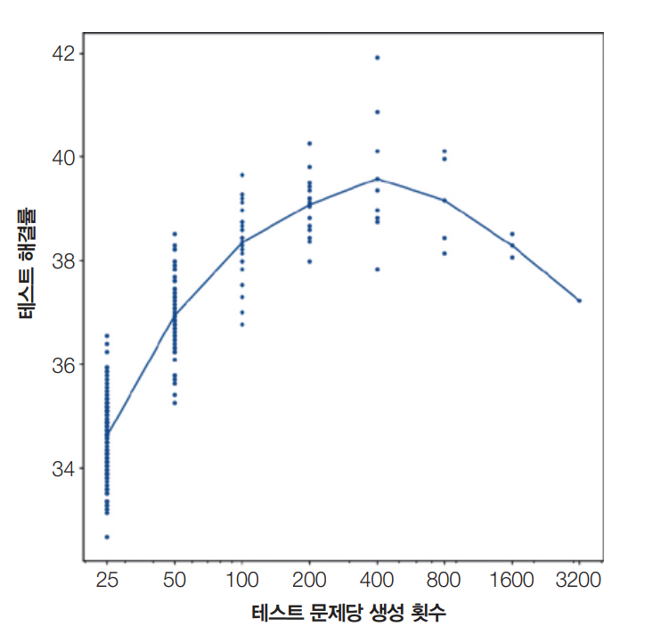  
  
샘플링된 출력의 수가 증가하면 검증기를 속일 수 있는 적대적 출력(adversarial outputs)을 찾을 가능성도 증가한다는 가설을 세웠다. 하지만 스탠퍼드의 
실험에서는 다른 결론이 나왔다. '몽키 비즈니스(Brown et al., 2024)'는 샘플 수가 1에서 10000으로 증가하면 해결된 문제의 수도 로그 선형적으로 
증가한다는 것을 발견했다. 테스트 시점 연산이 무한히 확장될 수 있는지에 대해 생각해 보는 것은 흥미롭지만 운영 환경에서 각 입력에 대해 400개나 10000개의 
서로 다른 출력을 샘플링하는 사람은 없다고 생각한다. 그렇게 하면 비용이 천문학적으로 높아질 것이다.  
  
또한 애플리케이션별 휴리스틱을 사용해 가장 좋은 응답을 선택할 수도 있다. 예를 들어 애플리케이션이 더 짧은 답변에 유리하면 가장 짧은 응답을 고르면 된다. 
자연어를 SQL 쿼리로 변환하는 애플리케이션이라면 유효한 SQL 쿼리를 생성할 떄까지 모델이 계속해서 출력하게 할 수 있다.  
  
테스트 시점 연산의 특히 흥미로운 활용 사례는 지연 시간 문제를 극복하는 것이다. 일부 질의, 특히 생각의 사슬(chain-of-thought, CoT) 질의는 
모델이 응답을 완료하는 데 오랜 시간이 걸릴 수 있다. TIFIN의 AI 책임자인 키티팟 캄파는 그의 팀은 모델에게 여러 응답을 병렬로 생성하도록 한 뒤 가장 
먼저 완성되는 유효한 응답을 사용자에게 보여준다고 말했다.  
  
또한 정확한 답을 요구하는 작업에서는 여러 출력 중에서 가장 많이 나온 결과를 고르는 것이 유용할 수 있다. 예를 들어 수학 문제에서 모델이 여러 번 
문제를 풀고 가장 자주 나온 답을 최종 해답으로 선택할 수 있다. 비슷하게 객관식 문제에서도 모델이 가장 자주 선택한 보기를 고를 수 있다. 구글이 MMLU 
벤치마크에서 제미나이를 평가할 떄 이런 방식을 사용했다. 문제마다 32개의 출력을 샘플링했고 덕분에 하나의 출력만 사용했을 때보다 더 높은 점수를 얻을 
수 있었다.  
  
입력이 조금 달라져도 출력이 크게 바뀌지 않으면 그 모델은 일단 견고하다고 본다. 모델이 덜 견고할수록 여러 출력을 샘플링하는 게 더 유리하다. 한 
프로젝트에서 제품 이미지에서 특정 정보를 추출하는 AI를 사용했는데 같은 이미지에 대해 모델이 절반 정도의 정보를 읽을 수 있었다. 나머지 절반은 이미지가 
너무 흐리거나 글자가 너무 작아서 읽을 수 없었다. 하지만 이미지에 대해 세 번씩 시도하자 대부분의 이미지에서 올바른 정보를 추출할 수 있었다.  
  
# **구조화된 출력**  
실제 서비스에서는 모델이 특정 형식을 따르는 출력을 생성해야 하는 경우도 있다. 이런 구조화된 출력은 다음 두 가지 시나리오에서 중요하다.  
  
1. 구조화딘 출력이 필요한 작업: 이 시나리오에서 가장 일반적인 작업은 시맨틱 파싱이다. 시맨틱 파싱은 자연어를 기계가 읽을 수 있는 구조화된 형식으로 
변환하는 것을 포함한다. Text-To-SQl 변환이 시맨틱 파싱의 예시인데 출력이 반드시 유효한 SQL 쿼리여야 한다. 이런 시맨틱 파싱 덕분에 사용자는 자연어(예: 영어)로 
API와 상호작용할 수 있다. 예를 들어 Text-PostgreSQL 변환을 사용하면 직접 쿼리를 작성하는 대신 "지난 6개월 동안의 월평균 수익은 얼마인가요?"
와 같은 질의를 사용해 포스트그레스 데이터베이스에 쿼리할 수 있다.  
  
다음은 GPT-4o에게 텍스트를 정규식으로 변환하도록 요청하는 예시 프롬프트다. 출력은 GPT-4o가 실제로 생성한 결과다.  
  
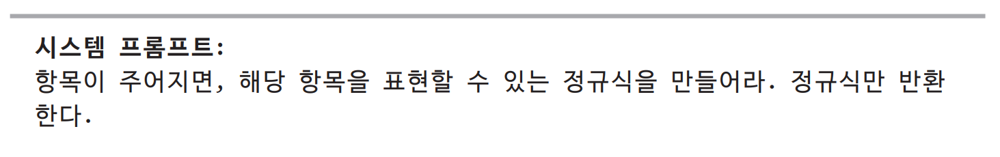  
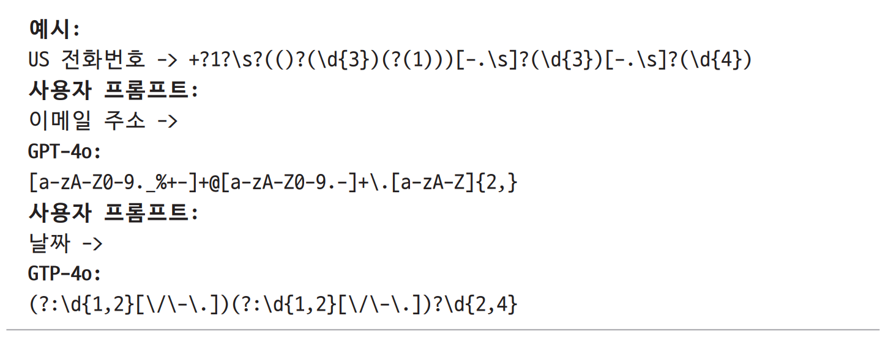  
  
이런 시나리오의 다른 예시로는 출력이 반드시 유효한 클래스여야 하는 분류가 있다.  
  
2. 다운스트림 애플리케이션에서 출력이 사용되는 작업: 이 시나리오의 작업은 구조화된 출력이 필요하진 않지만 출력이 다른 애플리케이션에서 활용되므로 해당 
애플리케이션들이 이를 처리할 수 있는 형태여야 한다. 예를 들어 AI 모델을 사용하여 이메일을 작성할 떄는 이메일 자체가 구조화될 핑요 없다. 하지만 
이메일을 사용하는 다운스트림 애플리케이션은 특정 형식이 필요할 수 있다. 예를 들어 {"title": [제목], "body": [이메일 본문]}과 같은 특정 키를 가진 
JSON 문서 형식이 필요할 수 있다. 모델의 출력이 종종 모델이 사용할 수 있는 도구의 입력으로 전달되는 에이전트 워크플로에서 특히 중요하다.  
  
구조화된 출력을 지원하는 프레임워크에는 가이던스, 아웃라인, 인스트럭터, llama.cpp가 있다. 각 모델 제공업체는 자체적인 기술을 통해 모델이 구조화된 
출력을 더 잘 생성할 수 있도록 성능을 개선했다. 오픈AI는 텍스트 생성 API에서 JSON 모드를 도입한 최조의 모델 제공업체였다. API의 JSON 모드는 
보통 출력이 유효한 JSON 모드를 도입한 최초의 모델 제공업체였다. API의 JSON 모드는 보통 출력이 유효한 JSON이라는 것만 보장하며 JSON 객체의 내용은 
보장하지 않는다. 생성된 JSON이 유효하더라도 최대 출력 토큰 길이에 도달하는 등의 이유로 생성이 너무 일찍 중단되면 잘려나가 구문 분석이 불가능할 
수 있다. 하지만 최대 토큰 길이를 너무 길게 설정하면 모델의 응답이 너무 느려지고 비용이 많이 든다.  
  
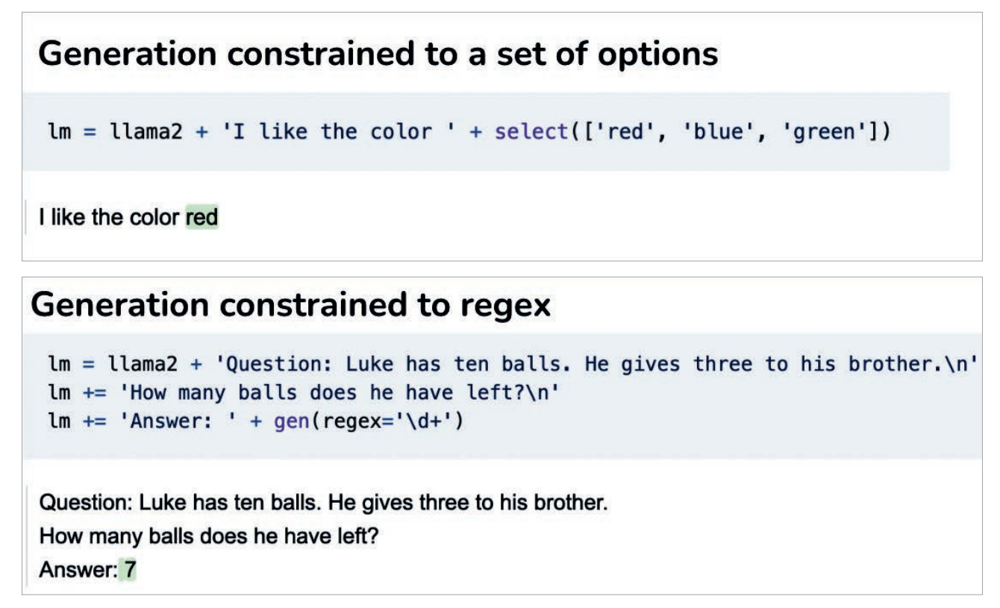  
  
위 그림은 가이던스를 사용하여 옵션 집합과 정규식으로 제한된 출력을 생성하는 두 가지 예시다.  
  
AI 스택의 다양한 계층에서 모델이 구조화된 출력을 생성하도록 유도할 수 있다. 프롬프팅, 후처리, 테스트 시점 연산, 제약 샘플링, 파인튜닝, 앞의 세 가지는 
임시방편에 가깝다. 이는 이미 구조화된 출력을 잘 생성하고 있지만 약간의 개선만 필요한 모델에서 가장 잘 작동한다. 집중적인 처리가 필요한 경우 제약 
샘플링과 파인튜닝을 써야 한다.  
  
테스트 시점 연산은 예상된 형식에 맞는 출력이 나올 떄까지 계속 생성하는 방식이다.  
  
# **프롬프팅**  
구조화된 출력을 위한 첫 번쨰 조치는 프롬프팅(prompting)이다. 모델에게 어떤 형식으로든 출력을 생성하도록 지시할 수 있다. 하지만 모델이 이 지시를 따를 
수 있는지는 모델의 지시 수행 능력과 지시의 명확성에 달려 있다. 모델이 지시를 따르는 능력이 점점 좋아지고 있지만 항상 지시를 따른다는 보장은 없다. 
많은 애플리케이션에서 모델 출력의 몇 퍼센트만 유효하지 않더라도 받아들일 수 없다.  
  
유요한 출력의 비율을 높이기 위해 일부 사람들은 원래 프롬프트의 출력을 검증하거나 수정하기 위해 AI를 사용한다. 이는 AI 평가자 접근 방식의 예시다. 
이는 출력마다 최소 두 번의 모델 질의가 필요하다는 뜻이다. 하나는 출력을 생성하기 위한 것이고 다른 하나는 이를 검증하기 위한 것이다. 추가된 검증 단계가 
출력의 유효성을 크게 향상시킬 수 있지만 검증을 위한 추가 요청으로 비용과 지연 시간이 늘어나 일부 사용자에겐 비쌀 수 있다.  
  
# **후처리**  
후처리(post-processing)는 간단하고 비용이 적게 들지만 큰 효과를 볼 수 있다. 모델은 여러 질의에서 비슷한 실수를 반복하는 경향이 있다. 따라서 모델이 
자주 하는 실수를 파악하면 이를 수정하는 스크립트를 작성해 오류를 고칠 수 있다. 예를 들어 모델이 생성한 JSON 객체에 닫는 괄호가 빠져 있다면 괄호를 
직접 추가해 주는 식이다. 링크드인의 방어적 YAML 파서는 올바른 YAML 출력 비율을 90%에서 99.99%까지 늘렸다.  
  
JSON과 YAML은 일반적인 텍스트 형식이다. 링크드인은 내부적으로 사용되는 GPT-4 모델이 JSON과 YAML 두 형식 모두 지원하지만 YAML이 JSON 보다 덜 
장황하고 출력에 필요한 토큰 수가 적기 떄문에 최종 출력 형식을 YAML으로 선택했다고 밝혔다.  
  
단 후처리는 수정하기 쉬운 실수에만 효과가 있다. 이런 상황은 보통 모델의 출력은 올바른 형식을 갖추고 작은 오류가 포함되는 경우 발생한다.  
  
# **제약 샘플링**  
제약 샘플링(constraint sampling)은 특정 제약 조건에 맞게 텍스트 생성을 유도하는 기법이다. 주로 구조화된 출력 도구와 함께 사용된다.  
  
큰 틀에서 보면 제약 조건을 만족하는 값들 중에서 토큰을 샘플링하는 방식이다. 토큰을 생성할 때 모델은 먼저 로짓 벡터를 출력하는데 각 로짓은 가능한 
토큰 하나와 대응된다. 제약 샘플링은 이 로짓 벡터에서 제약 조건을 만족하는 토큰만 걸러내고 걸러진 토큰들 중 하나를 뽑는다. 아래 그림은 이 과정을 보여준다.  
  
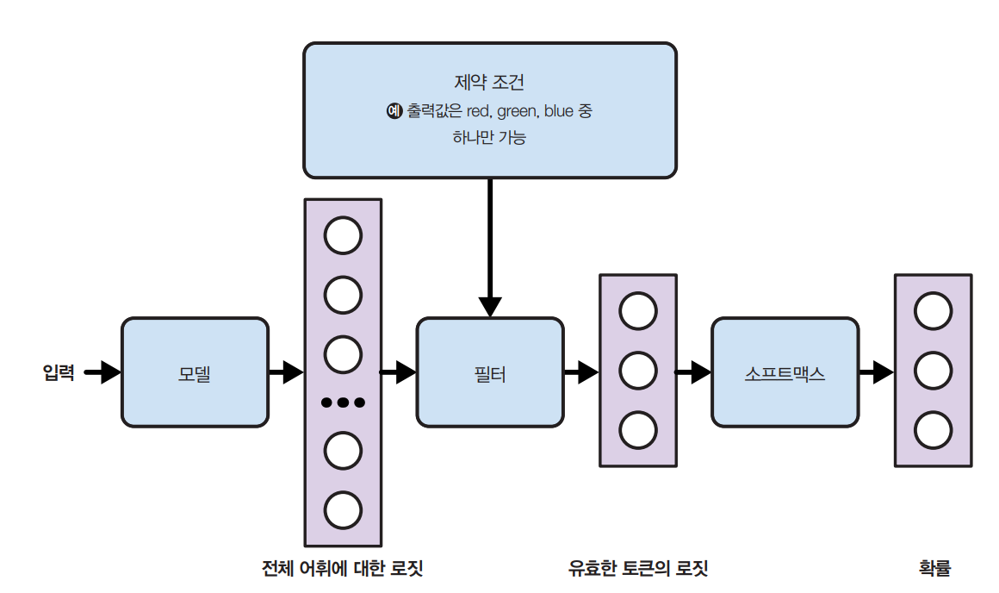  
  
위 그림의 예시의 제약 조건은 필터링하기 쉽다. 그러나 실제 상황은 단순하지 않다. 각 단계에서 허용되는 것과 허용되지 않는 것을 지정하는 문법이 필요하다. 
예를 들어 JSON 문법에서는 {가 나온 후에는 {"key": "{{string}}"}와 같이 문자열의 일부가 아닌 한 또 다른 {가 올 수 없다. 해당 문법을 구축하고 
샘플링 과정을 통합하는 것은 중요하다. JSON, YAML, 정규식, CSV 등과 같은 각 출력 형식에는 고유한 문법이 필요하기 때문에 제약 샘플링은 일반화하기 
어렵다.  
  
따라서 제약 샘플링은 외부 도구에서 지원하거나 팀에서 자체적으로 개발한 문법이 있는 형식에만 사용할 수 있다. 또한 문법 검증은 생성 지연 시간을 
증가시킬 수 있다.  
  
어떤 사람들은 제약 샘플링에 필요한 자원을 제약을 더 잘 따르도록 모델을 학습하는 것에 투자하는 것이 더 좋다고 생각해 제약 샘플링을 반대하기도 한다.  
  
# **파인튜닝**  
파인튜닝(fine-tuning)은 원하는 형식에 맞게 예시로 모델을 학습시키는 것인데 이 형식대로 출력을 생성하게 만드는 가장 효과적이고 일반적인 방법이다. 
어떤 형식이든 적용해 볼 수는 있지만 단순 파인튜닝만으로는 모델이 항상 기대한 형식을 지켜서 출력한다고 보장할 순 없다. 그래도 프롬프트만 쓰는 것보다는 
훨씬 더 믿을 만하다.  
  
특정 작업의 경우 파인튜닝 전에 모델의 아키텍처를 수정하여 출력 형식을 보장할 수 있다. 예를 들어 분류 문제라면 파운데이션 모델 구조에 분류기 헤드를 
붙여 모델이 미리 정해준 클래스 중 하나만 출력하도록 만들 수 있다.  
  
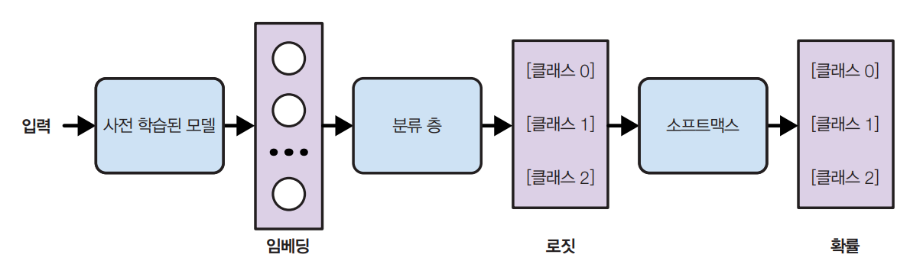  
  
이런 구조는 위 그림에서 볼 수 있다. 이 방식은 특성 기반 전이(feature-based transfer)라고 한다.  
  
파인튜닝할 때는 모델 전체를 처음부터 끝까지 재학습할 수도 있고 분류기 헤드처럼 일부만 학습할 수 있다. 전체를 학습하면 더 많은 리소스가 필요하지만 
성능은 더 좋아진다.  
  
구조화된 출력을 위한 이런 기법들이 필요한 이유는 기본적으로 모델 자체만으로는 구조화된 출력을 생성할 수 없다고 가정하기 떄문이다. 하지만 모델이 점점 
더 강력해지면 단순한 지시로도 구조화된 출력을 생성하게 될 것으로 기대되고 있다. 그러면 이런 기법들의 중요성도 점차 줄어들 것이다.  
  
# **AI의 확률적 특성**  
AI 모델이 응답을 샘플링하는 방식은 확률적이다. AI 모델에게 같은 질문을 두 번 하면 응답이 달라질 수 있다. AI 모델이 베트남 요리가 최고일 확률이 
70%고 이탈리아 요리가 30%라고 생각한다면 70%는 베트남 요리라고 답하고 30%는 이탈리아 요리라고 답할 것이다. 이런 확률적인 특성과 반대되는 게 결정론적인데 
이건 무작위성 없이 결과가 하나로 정해지는 것을 의미한다.  
  
이런 확률적 특성 떄문에 일관성이 떨어지고 환각 현상이 생긴다. 일관성이 떨어진다는 건 같거나 비슷한 프롬프트에 대해 매우 다른 응답을 내놓는다는 
뜻이다. 환각은 사실에 근거하지 않은 응답을 내놓는 현상이다.
   
  

  
