# **평가 방법론**  
AI가 더 많이 사용될수록 그에 따른 부작용은 증가했다. 파운데이션 모델이 등장한 지 얼마되지 않았지만 이미 수많은 실패가 발생했다. 한 남성이 챗봇의 
부추김을 받아 자살한 사건, 변호사들이 AI가 만들어 낸 거짓 증거를 제출한 사건 등이 발생했다. AI 출력의 품질을 올바르게 제어할 방법이 없다면 
많은 분야에서 AI의 위험성은 이점을 넘어설 것이다.  
  
많은 팀이 AI 도입을 서두르면서 AI 애플리케이션을 개발하는 데 큰 난관이 평가(evaluation)라는 사실을 금방 깨닫게 된다. 실제로 어떤 애플리케이션은 
평가 방법 설정에 가장 많은 시간을 투자하기도 했다.  
  
평가 자체를 별도의 과정으로 다루긴 하지만 실제 평가를 수행할 때는 일부분만 보지 말고 시스템의 컨텍스트를 고려해야 한다. 평가의 목적은 위험을 
줄이고 기회를 발견하는 것이다. 위험을 줄이기 위해서는 시스템이 어떤 부분에서 취약한지 먼저 파악하고 그에 맞춰 평가 설계를 진행해야 한다. 어쩌면 
시스템의 취약점을 더욱 명확히 파악할 수 있도록 시스템 구조를 재설계해야 할 수도 있다. 시스템의 취약점을 제대로 이해하지 못한다면 아무리 다양한 
평가 지표와 도구를 활용하더라도 시스템의 견고함을 확보하기는 어렵다.  
  
많은 파운데이션 모델이 언어 모델 요소를 가지고 있으므로 교차 엔트로피와 퍼플렉시티 같은 언어 모델 평가에 쓰이는 자료들을 간단히 살펴본다. 
이런 지표들은 언어 모델의 학습과 파인튜닝 과정에서 필수로 사용되며 많은 평가 방법에서도 사용된다.  
  
파운데이션 모델은 개방형이라서 특히 평가가 어렵다. 많은 애플리케이션에서 여전히 사람 평가자의 역할이 필수적이다. 하지만 사람이 평가하는 것은 
느리고 비용이 많이 들기 떄문에 이 과정을 자동화하는 것은 모두의 목표다.  
  
주관적 평가의 떠오르는 스타는 AI 자체를 AI 평가자(또는 AI 심판자)로 활용하는 것이다. 이 방법은 AI 응답을 Ai가 평가하는 접근 방식이다. AI 평가자가 
어떤 모델과 프롬프트를 사용하느냐에 따라 점수가 달라지므로 주관적으로 볼 수 있다. 이 방법이 업계에서 빠르게 확산하고 있지만 중요한 업무를 AI에 
맡기는 것을 신뢰할 수 없다는 비판적 시각도 존재한다.  
  
# **파운데이션 모델 평가의 어려움**  
ML 모델 평가는 항상 어려웠는데 파운데이션 모델이 등장하면서 더욱 어려워졌다. 파운데이션 모델이 전통적인 ML 모델보다 평가하기 어려운 이유는 여러 
가지가 있다.  
  
첫째, AI 모델이 똑똑해질수록 평가가 더 어려워진다. 초등학교 1학년 수학 문제 풀이가 틀렸는지는 대부분의 사람이 알 수 있다. 하지만 박사 수준의 
수학 문제 풀이라면 그렇게 할 수 있는 사람은 거의 없다. 만약 책을 요약할 떄 말도 안 되는 내용이 작성된다면 요약이 잘못되었다는 것을 쉽게 알 수 
있지만 요약이 그럴듯하게 읽히는 경우엔 판단하기 어렵다. 어쩌면 요약의 품질을 검증하기 위해 먼저 책 전체를 읽어봐야 할 수도 있다. 즉, 정교한 
작업일수록 평가에 훨씬 더 많은 시간이 소요된다. 이제는 응답이 그럴듯해 보인다고 좋은 평가를 해서는 안 된다. 사실 확인과 추론, 심지어 전문 지식까지 
사용해야 한다.  
  
둘째, 파운데이션 모델은 개방형 특성으로 인해 정답을 기준으로 성능을 평가하는 기존 방식은 더 이상 유효하지 않다. 전통적인 ML에선 대부분의 작업이 
답이 정해진 폐쇄형 특성을 띈다. 예를 들어 분류 모델은 사전에 정의된 범주만 출력할 수 있다. 분류 모델을 평가하려면 실제 출력을 예상 출력과 
비교하면 된다. 예상 출력이 X 범주인데 모델의 실제 출력이 Y 범주라면 그 모델은 틀린 것이다. 하지만 개방형 작업에서는 하나의 입력에 대해 여러 
개의 정답이 존재할 수 있다. 이처럼 비교할 수 있는 정답 목록을 완벽하게 만드는 것은 불가능하다.  
  
셋쨰, 대부분의 파운데이션 모델은 블랙박스로 취급된다. 이는 모델 제공업체가 모델의 세부 사항을 공개하지 않거나 애플리케이션 개발자가 이를 이해할 
전문 지식이 부족하기 떄문이다. 모델 아키텍처, 학습 데이터, 학습 과정 같은 세부 사항을 알 수 있다면 모델의 강점과 약점을 좀 더 명확히 파악하여 
평가할 수 있지만 이런 세부 정보가 없으면 모델의 출력 결과만 보고 평가할 수밖에 없다.  
  
동시에, 공개적으로 이용 가능한 평가 벤치마크들은 파운데이션 모델을 평가하는 데 부적절한 것으로 판명되었다. 이상적으로는 평가 벤치마크는 모델의 
모든 능력을 다뤄야 한다. 그리고 AI가 발전하면서 벤치마크도 이에 맞춰 계속 진화해야 한다. 모델이 벤치마크에서 완벽한 점수를 달성하게 되면 해당 
벤치마크는 더 이상 모델의 성능을 측정하는 데 쓸 수 없기 떄문이다. 이제는 파운데이션 모델의 성능이 너무 빠르게 향상되어 기존 벤치마크들은 너무 
빨리 최고 점수에 도달하게 되었다.  
  
마지막으로 범용 모델의 평가 범위가 확장됐다. 작업 특화 모델에서 평가는 학습된 작업에 대한 모델의 성능을 측정하면 된다. 하지만 범용 모델에서 평가는 
알려진 작업의 성능을 평가할 뿐만 아니라 모델이 수행할 수 있는 새로운 작업을 발견하는 것도 포함된다. 이런 새로운 작업에는 사람의 능력을 넘어서는 
작업도 포함될 수 있다. 이제 평가는 AI의 잠재력과 한계를 탐구하는 책임까지 더해진 것이다.  
  
다행이 이런 평가의 새로운 도전 과제들 덕분에 많은 새로운 방법과 벤치마크가 나왔다.  
  
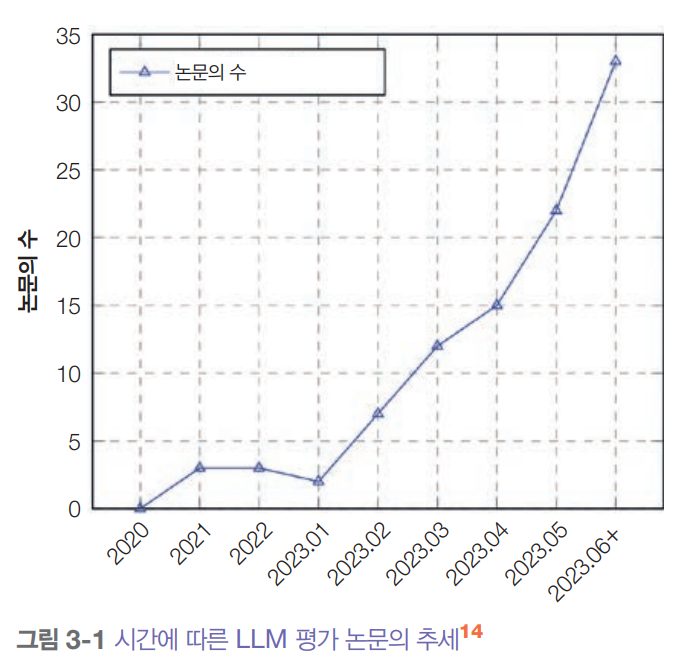  
  
위 그림을 보면 2023년 상반기에 LLM 평가 관련 논문이 매달 기하급수적으로 늘어나 월 2편에서 거의 30편까지 증가했다는 것을 알 수 있다.  
  
AI 분야에서 평가에 대한 투자가 다른 영역보다 부족하다는 것은 평가 도구의 수를 통해서 확인할 수 있다.  
  
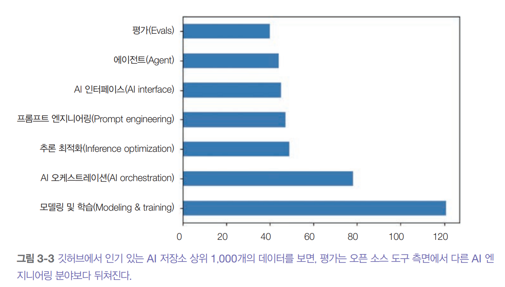  
  
불충분한 투자는 불충분한 인프라로 이어져 사람들이 체계적인 평가를 수행하기 어렵게 만든다. AI 애플리케이션을 어떻게 평가하는지 물었더니 대부분의 
사람은 그냥 결과를 대략적으로 확인한다고 말했다. 많은 사람은 여전히 모델을 평가하기 위해 즐겨 쓰는 몇 개의 프롬프트만 가지고 있다. 이런 프롬프트들은 
애플리케이션에 정말 필요한 평가를 고려해서 수집한 것이 아닌 개인이 경험상 괜찮다고 생각하는 것들을 즉흥적으로 모으는 경우가 많다. 프로젝트 초기 단계에선 
이런 즉흥적인 접근 방식으로 넘어갈 수 있지만 애플리케이션을 지속적으로 개선하는 데는 충분하지 않다.  
  
# **언어 모델링 지표 이해하기**  
파운데이션 모델은 언어 모델에서 발전했다. 그리고 많은 파운데이션 모델은 여전히 언어 모델을 핵심 구성 요소로 활용하고 있다. 이런 모델들에서 언어 
모델의 성능이 좋을수록, 애플리케이션의 파운데이션 모델 설능이 좋은 경향이 있다. 따라서 언어 모델링 지표를 대략적으로 이해하면 애플리케이션의 성능을 
이해하는 데 큰 도움이 될 수 있다.  
  
언어 모델링은 클로드 새넌이 1951년 논문에서 대중화한 이후 수십 년 동안 존재해왔다. 그 이후로 언어 모델 개발을 이끄는 지표는 크게 변하지 않았다. 
개부분의 자기회귀 언어 모델은 교차 엔트로피나(모델이 틀린 정도, 간단하게 비유하면 정답을 맞추는 질문의 횟수) 관련된 지표인 
퍼플렉시티(교차 엔트로피를 사람이 직관적으로 보게 바꾼 것)를 사용해 학습된다. 논문과 모델 보고서를 읽다 보면 문자당 비트
(BPC, 교차 엔트로피를 문자 단위로 평균 낸 것, 문자 하나 예측하는 데 평균 몇 비트 정보가 필요하냐, 질문의 횟수는 정보량 -> 비트 수 증가)
와 바이트당 비트(BPB)를 볼 수 있는데 둘 다 교차 엔트로피의 변형된 형태다.  
  
교차 엔트로피, 퍼플렉시티, 문자당 비트(BPC), 바이트당 비트(BPB) 이 네 가지 지표는 밀접하게 관련되어 있다. 필요한 정보가 있다면 하나의 값으로 
나머지 셋을 계산할 수 있다. 이들을 언어 모델링 지표라고 부르지만 이 지표들은 텍스트뿐만 아니라 다른 종류의 토큰들로 이루어진 시퀀스를 생성하는 
모델에서도 사용할 수 있다.  
  
언어 모델이 언어에 대한 통계적 정보(주어진 컨텍스트에서 토큰이 나타날 가능성)를 인코딩한다는 점을 떠올려보자. 통계적으로 'I like drinking___
(나는 ___ 마시는 것을 좋아한다)' 컨텍스트가 주어졌을 떄 다음 단어는 'charcoal(숯, 목탄)' 보다 'tea(차)'일 가능성이 더 높다. 모델이 더 많은 
통계 정보를 파악할수록 다음 토큰을 더 잘 예측할 수 있다.  
  
ML 용어로 말하자면 언어 모델은 학습 데이터의 분포를 학습한다. 모델이 더 잘 학습할수록 학습 데이터에서 다음에 올 것을 더 잘 예측할 수 있고 학습 
교차 엔트로피는 더 낮아진다. 다른 ML 모델처럼 학습 데이터뿐만 아니라 운영 환경의 성능도 물론 중요하다. 일반적으로 운영 환경의 데이터가 모델의 학습 
데이터와 비슷할수록 모델이 더 좋은 성능을 낸다.  
  
# **엔트로피**  
엔트로피는 토큰이 평균적으로 얼마나 많은 정보를 담고 있는지 측정한다. 엔트로피가 높으수록 각 토큰이 더 많은 정보를 담고 있으며 토큰을 표현하는 데 더 
많은 비트가 필요하다.  
  
간단한 예시를 살펴보자.  
  
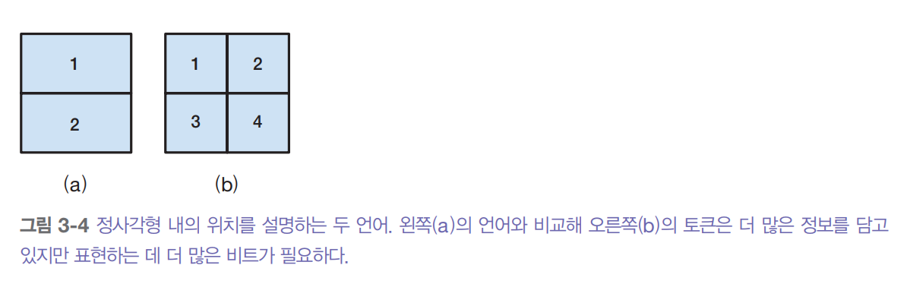  
  
위 그림처럼 정사각형 안의 위치를 설명하는 언어를 만들고 싶다고 하자. (a)처럼 언어에 토큰으 두 개만 있다면 각 토큰은 위치가 위쪽인지 아래쪽인지 알려줄 
수 있다. 토큰이 두 개뿐이므로 하나의 비트로도 충분히 표현할 수 있다. 따라서 이 언어의 엔트로피는 1이다.  

(b)처럼 언어에 4개의 토큰이 있는 경우 각 토큰은 더 구체적인 위치(왼쪽 위, 오른쪽 위, 왼쪽 아래, 오른쪽 아래)를 알려줄 수 있다. 하지만 이제 토큰이 
4개이므로 이를 표현하려면 2개의 비트가 필요하다. 따라이 이 언어의 엔트로피는 2다. 이 언어는 각 토큰이 더 많은 정보를 전달하기 떄문에 엔트로피가 더 
높지만 각 토큰을 표현하는 데 더 많은 비트가 필요하다.  
  
직관적으로 보면 엔트로피는 언어에서 다음에 올 것을 예측하기가 얼마나 어려운지를 보여준다. 언어의 엔트로피가 낮은 것은(언어의 토큰이 담고 있는 정보가 
적을수록) 다음에 올 것을 더 쉽게 예측할 수 있다는 뜻이다. 앞의 예시에서 토큰이 2개인 언어는 토큰이 4개인 언어보다 예측하기 쉽다(4개 중에 고르는 것보다 
2개 중에 고르는 게 더 쉽기 떄문이다).  
  
# **교차 엔트로피**  
데이터셋에서 언어 모델을 학습시킬 떄 우리의 목표는 모델이 학습 데이터의 분포를 배우게 하는 것이다. 즉, 학습 데이터에서 다음에 무엇이 올지 예측하게 
만드는 것이다. 교차 엔트로피는 언어 모델이 데이터셋의 내용을 얼마나 예측하기 어려워하는지를 보여주는 지표다.  
  
학습 데이터에 대한 모델의 교차 엔트로피는 두 가지 특성에 따라 달라진다.  
  
1. 학습 데이터의 예측 가능성. 이것은 학습 데이터의 엔트로피로 측정된다.  
2. 언어 모델이 파악한 분포가 학습 데이터의 실제 분포와 얼마나 다른지  
  
엔트로피와 교차 엔트로피는 같은 수학 기호 H를 사용한다. P를 학습 데이터의 실제 분포, Q를 언어 모델이 학습한 분포라고 하면 다음이 성립한다.  
  
- 학습 데이터의 엔트로피는 H(P)다.  
- Q와 P가 얼마나 다른지는 쿨백-라이블러(KL) 발산으로 측정할 수 있으며 수학적으로는 Dkl(P||Q)로 표현된다.  
- 따라서 학습 데이터에 대한 모델의 교차 엔트로피는 다음과 같다.  
  
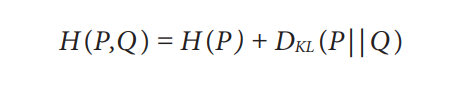  
  
교차 엔트로피는 비대칭적이다. P에 대한 Q의 교차 엔트로피 H(P,Q)는 Q에 대한 P의 교차 엔트로피 H(Q,P)와 서로 다른 값을 갖는다.  
  
언어 모델은 학습 데이터에 대한 교차 엔트로피를 최소화하도록 학습된다. 만약 언어 모델이 학습 데이터를 완벽하게 학습하면 모델의 교차 엔트로피는 
학습 데이터의 엔트로피와 정확히 같아진다. 이떄 P에 대한 Q의 KL 발산은 0이 될 것이다. 즉 모델의 교차 엔트로피는 학습 데이터의 엔트로피에 대한 
근삿값으로 볼 수 있다.  
  
# **문자당 비트와 바이트당 비트**  
엔트로피와 교차 엔트로피의 단위는 비트를 사용한다. 언어 모델의 교차 엔트로피가 6비트라면 각 토큰을 표현하는 데 6비트가 필요하다는 뜻이다.  
  
모델마다 토큰화 방식이 다르기 떄문에(예: 한 모델은 단어를 토큰으로 사용하고 다른 모델은 문자를 토큰으로 사용) 토큰당 비트 수로 모델을 비교할 수 
없다. 대신 문자당 비트(bits-per-character, BPC)를 사용하기도 한다. 토큰당 비트 수가 6이고 평균적으로 각 토큰이 2개의 문자로 이루어져 있다면 
BPC는 6/2 = 3이다.  
  
BPC의 문제점은 문자 인코딩 방식이 다양하다는 점이다. 예를 들어 ASCII는 문자당 7비트를 사용하지만 UTF-8은 문자당 8비트에서 32비트까지 사용할 
수 있다. 더 표준화된 지표는 바이트당 비트(bits-per-byte, BPB)로 원본 학습 데이터의 1바이트를 표현하는 데 필요한 비트 수를 의미한다. BPC가 3이고 
각 문자가 7비트, 즉 1바이트의 %라면 BPB는 3 / (%) = 3.43이 된다.  
  
교차 엔트로피는 언어 모델이 텍스트를 얼마나 효율적으로 압축할 수 있는지 알려준다. 언어 모델의 BPB가 3.43이면 원본 1바이트(8비트)를 3.43 비트로 
표현할 수 있다는 뜻이며 이 언어 모델은 원복 학습 텍스트를 원래 크기의 절반 이하로 압축할 수 있다는 의미다.  
  
# **퍼플렉시티**  
퍼플렉시티(perplexity)는 엔트로피와 교차 엔트로피의 지수 함수다. 종종 PPL로 줄여 쓴다. 실제 분포 P를 가진 데이터셋이 주어졌을 때 퍼플렉시티는 다음과 
같이 정의된다.  
  
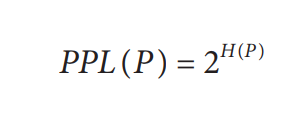  
  
이 데이터셋에서 언어 모델(학습된 분포 Q)의 퍼플렉시티는 다음과 같이 정의된다.  
  
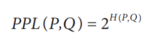  
  
교차 엔트로피가 모델이 다음 토큰을 예측하기 얼마나 어려운지 측정한다면 퍼플렉시티는 다음 토큰을 예측할 떄의 불확실성을 측정한다. 불확실성이 높을수록 
다음 토큰으로 가능한 선택지가 많다는 뜻이다.  
  
앞에서 본 4개의 위치 토큰을 완벽하게 인코딩하도록 학습된 언어 모델을 생각해 보자. 이 언어 모델의 교차 엔트로피는 2비트다. 이 언어 모델이 정사각형의 
위치를 예측하려면 2 * 2 = 4개의 가능한 선택지 중에서 골라야 한다. 따라서 이 언어 모델의 퍼플렉시티는 4다.  
  
지금까지 엔트로피와 교차 엔트로피의 단위로 비트를 사용했다. 각 비트는 2개의 고유한 값을 표현할 수 있어서 앞서 본 퍼플렉시티 방정식에서 밑이 2인 
것이다.  
  
텐서플로와 파이토치를 포함한 인기 있는 ML 프레임워크는 엔트로피와 교차 엔트로피의 단위로 nat(자연로그)를 사용한다. nat는 자연로그의 밑은 e를 
사용한다. nat을 단위로 사용하면 퍼플렉시티는 e의 지수 함수가 된다.  
  
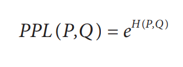  
  
비트와 nat이 혼란스럽기 떄문에 많은 사람이 언어 모델의 성능을 말할 떄 교차 엔트로피 대신 퍼플렉시티를 사용하는 경우도 있다.  
  
# **퍼플렉시티 해석과 활용 사례**  
교처 엔트로피, 퍼플렉시티, BPC, BPB는 언어 모델의 예측 정확도를 측정하는 다양한 지표들이다. 모델이 텍스트를 더 정확하게 예측할수록 이런 지표들의 
값은 더 낮아진다. 여기서는 언어 모델링의 기본 지표로 퍼플렉시티를 사용할 것이다. 주어진 데이터셋에서 다음에 올 것을 예측할 떄 불확실성이 클 수록 
퍼플렉시티가 높아지는 점을 기억하자.  
  
좋은 퍼플렉시티 값은 데이터 자체의 특성은 물론 퍼플렉시티를 어떻게 계산하는지에 따라서도 달라진다. 예를 들어 모델이 참조할 수 있는 이전 토큰의 수 
같은 요소들이 영향을 미친다. 다음은 퍼플렉시티를 해석할 때 사용할 수 있는 일반적인 규칙들이다.  
  
- 구조화된 데이터일수록 퍼플렉시티가 낮다  
구조화된 데이터는 예측하기 쉽다. 예를 들어 HTML 코드는 일상 텍스트보다 예측하기 쉽다. <head> 같은 HTML 여는 태그를 보면 근처에 </head>라는 닫는 
태그가 있을 것이라고 예측할 수 있다. 따라서 HTML 코드에서 모델의 퍼플렉시티는 일상적인 텍스트의 퍼플렉시티보다 낮을 것이다.  
  
- 어휘 크기가 클수록 퍼플렉시티가 높다  
직관적으로 생각하면 선택할 수 있는 토큰이 많을수록 모델이 다음 토큰을 예측하기 더 어렵다. 예를 들어 동일한 모델이라도 <전쟁과 평화>보다 아동용 도서를 
예측할 때 퍼플렉시티가 더 낮을 것이다. 또 같은 양의 데이터셋이라도 알파벳의 개수가 단어의 개수보다 훨씬 적기 때문에 다음 문자를 예측할 떄의 
퍼플렉시티가 다음 단어를 예측할 떄보다 더 낮을 것이다.  
  
- 컨텍스트 길이가 길수록 퍼플렉시티가 낮다  
모델이 볼 수 있는 컨텍스트가 많을수록 다음 토큰을 예측할 떄 불확실성이 더 줄어든다. 1951년 클로드 섀넌은 자신의 모델을 평가할 때 앞선 10개 이내의 
토큰을 참고해 다음 토큰을 예측하고 이를 통해 교차 엔트로피를 계산했다. 모델의 최대 컨텍스트 길이에 따라 보통 500개에서 10000개 때로는 그 이상의 
이전 토큰을 조건으로 퍼플렉시티를 계산할 수 있다.  
  
참고로 퍼플렉시티 값이 3 또는 그보다 더 낮은 경우도 흔하다. 가상의 언어에서 모든 토큰이 동일한 확률로 나타난다고 할 떄 퍼플렉시티가 3이라는건 
모델이 다음 토큰을 맞출 확률이 1/3이라는 뜻이다. 모델이 다루는 어휘 크기가 수만에서 수십만 개에 달하는 점을 생각하면 이런 정확도는 정말 놀라운 수준이라고 
할 수 있다.  
  
퍼플렉시티는 언어 모델 학습시 성능 지표로 사용되는 것 외에도 다양한 AI 엔지니어링 작업에서 유용하다. 우선 퍼플렉시티는 모델의 성능을 간접적으로 
보여주는 좋은 지표다. 모델이 다음 토큰을 잘 예측하지 못한다면 다른 작업에서도 성농이 좋지 않을 가능성이 높다. 오픈AI의 GPT-2 보고서를 보면 아래 
표에서 나타난 것처럼 더 큰 모델들, 즉 더 강력한 모델들이 다양한 데이터셋에서 일관되게 더 낮은 퍼플렉시티를 보인다.  
  
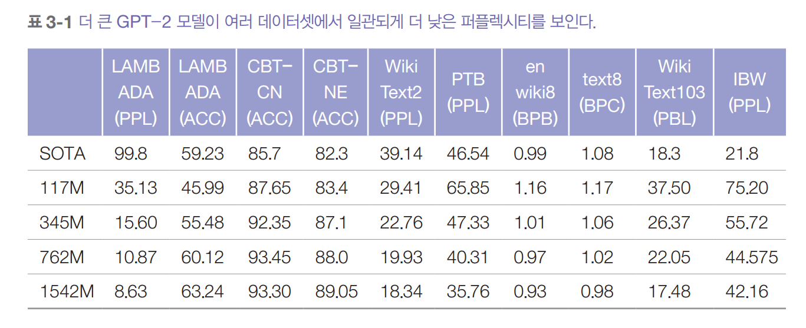  
  
기업들이 자사의 모델에 대해 점점 더 비밀스러워지는 추세에 따라 점점 더 많은 기업이 모델의 퍼플렉시티를 공개 하지 않고 있다.  
  
퍼플렉시티는 SFT와 RLHF 같은 기법을 사용해 사후 학습된 모델을 평가하는 데는 적절한 지표가 아닐 수 있다. 사후 학습은 모델이 특정 작업을 잘 수행하도록 
가르치는 과정이다. 모델이 이런 작업을 더 잘하게 될수록 오히려 다음 토큰을 예측하는 능력은 떨어질 수 있는데 실제로 언어 모델은 보통 사후 학습 후에 
퍼플렉시티가 높아진다. 일부 사람들은 사후 학습이 엔트로피를 붕괴시킨다고 말한다. 비슷한 컨텍스트에서 모델의 수치 정밀도와 메모리 사용량을 줄이는 
양자화 기법도 예상하지 못한 방식으로 모델의 퍼플렉시티를 변화시킬 수 있다.  
  
모델의 특정 텍스트에 대한 퍼플렉시티는 해당 모델이 그 텍스트를 예측하기 얼마나 어려운지를 측정한다. 이때 모델이 학습 중에 본 적이 있고 기억한 텍스트에서는 
퍼플렉시티가 가장 낮게 나타난다. 따라서 퍼플렉시티는 어떤 텍스트가 모델의 학습 데이터에 포함되었는지 탐지하는 데 사용할 수 있다. 이는 데이터 오염을 
탐지하는 데 유용하다. 만약 모델이 특정 벤치마크 데이터에 대해 낮은 퍼플렉시티를 보인다면 그 벤치마크가 모델의 학습 데이터에 포함되어 있을 가능성이 
높아 해당 벤치마크의 모델 성능을 신뢰하기 어렵다. 이는 학습 데이터의 중복 제거에도 활용할 수 있다. 예를 들어 새로운 데이터의 퍼플렉시티가 높을 때만 
기존 학습 데이터셋에 추가하는 식이다.  
  
퍼플렉시티는 '우리 강아지는 여가 시간에 양자역학을 가르친다'같은 특이한 생각을 표현하는 텍스트나 '집 고양이 가다 눈'처럼 의미 없는 텍스트처럼 예측하기 
어려운 텍스트에서 가장 높게 나타난다. 따라서 퍼플렉시티를 통해 비정상적인 텍스트를 탐지하는 데 사용될 수 있다.  
  
퍼플렉시티 관련 지표는 모델 자체의 성능을 이해하는 데 도움을 주며 이를 통해 모델이 실제 다양한 작업을 수행할 때 어떤 성능을 보일지 가늠할 수 있다.  
  
- 언어 모델을 사용해 텍스트의 퍼플렉시티를 계산하는 방법  
하나의 텍스트에 대한 모델의 퍼플렉시티는 모델이 그 텍스트를 예측하기 얼마나 어려워하는지를 측정한다. 언어 모델 X의 토큰 시퀀스{x1, x2... xn}이 
주어졌을 때 이 시퀀스에 대한 x의 퍼플렉시티는 다음과 같다.  
  
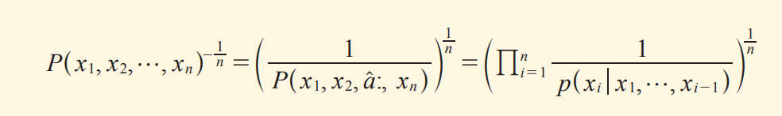  
  
여기서 P(xi | x1,...,x(i-1))는 이전 토큰 x1,...,x(i-1)을 보고 다음 토큰이 xi가 될 것이라고 모델이 예측하는 확률을 나타낸다. 퍼플렉시티를 계산하려면 
언어 모델이 각 다음 토큰을 예측할 떄의 확률값(또는 로그 확률)을 알 수 있어야 한다. 안타깝게도 모든 사용 모델이 이런 확률값을 공개하지 않는다.  
  
# **정확한 평가**  
모델의 성능을 평가할 떄 정확한 평가와 주관적 평가를 구분하는 것이 중요하다. 정확한 평가는 모호함 없이 판단을 내린다. 예를 들어 객관식 문제의 답이 
A인데 B를 선택했다면 틀린 답이다. 이는 전혀 애매하지 않다. 반면에 글에 대한 채점은 주관적이다. 글 점수는 누가 채점하느냐에 따라 달라진다. 심지어 
같은 사람이라도 시간 간격을 두고 두 번 채점하면 같은 글에 다른 점수를 주기도 한다. 물론 명확한 채점 기준이 있으면 글 채점도 더 정확해진다. 
AI 평가자는 주관적이다. 평가 결과는 평가 모델과 프롬프트에 따라 달라진다.  
  
정확한 점수를 산출하는 두 가지 평가 방식이 있는데 이 방식들은 기능적 정확성(functional correctness)과 참조 데이터의 유사도 측정이다. 분류 
같은 폐쇄형 응답이 아닌 임의의 텍스트를 생성하는 개방형 응답의 평가에 중점을 둔다. 이는 파운데이션 모델이 폐쇄형 작업에 사용되지 않아서가 아니다. 
실제로 많은 파운데이션 모델 시스템은 최소한 한 가지 분류 기능을 가지고 있으며 주로 의도를 파악하거나 점수를 매기는 데 활용된다.  
  
# **기능적 정확성**  
기능적 정확성 평가는 시스템이 의도한 기능을 제대로 수행하는지 평가하는 것을 의미한다. 예를 들어 모델에 웹사이트를 만들어달라고 했을 때 생성된 
웹사이트가 요구사항을 충족하는가? 특정 레스토랑 예약을 해달라고 했을 떄 모델이 이를 성공적으로 수행하는가? 등이 있다. 기능적 정확성은 애플리케이션이 
의도한 대로 동작하는지를 측정하기 떄문에 모든 애플리케이션의 성능을 평가하는 궁극적인 지표다. 하지만 기능적 정확성을 측정하는 것은 항상 간단하지 않으며 
측정을 자동화하는 것도 쉽지 않다.  
  
코드 생성은 기능적 정확성 측정을 자동화할 수 있는 작업의 예시다. 코딩에서 기능적 정확성은 종종 실행 정확도를 의미한다. 예를 들어 모델에게 두 수 
num1과 num2의 최대공약수(gcd)를 찾는 파이썬 함수 gcd(num1, num2)를 작성해달라고 했다고 하자. 생성된 코드를 파이썬 인터프리터에 입력해 코드가 유효한지 
확인할 수 있고 유효하다면 주어진 두 수(num1, num2)에 대해 올바른 결과를 출력하는지 확인할 수 있다.  
  
AI가 코드를 작성하기 훨씬 전부터 코드의 기능적 정확성을 자동으로 검증하는 것은 소프트웨어 개발 분야에서 일반적으로 사용되는 방식이었다. 코드는 보통 서로 
다른 시나리오에서 실행해 예상된 출력을 생성하는지 확인하는 단위 테스트로 검증된다. 기능적 정확성 평가는 리트코드와 해커랭크 같은 코딩 플랫폼이 
제출된 답안을 검증하는 방식이다.  
  
오픈AI의 HumanEval과 구글의 MBPP(Mostly Basic Python Problems Dataset)같은 AI의 코드 생성 능력을 평가하는 인기 있는 벤치마크들은 기능적 
정확성을 평가 지표로 사용한다. 스파이더, BIRD-SQL, WikiSQL 같은 텍스트-SQL(자연어에서 SQL 쿼리 생성) 벤치마크도 기능적 정확성에 의존한다.  
  
벤치마크 문제는 여러 테스트 케이스가 함께 제공된다. 각 테스트 케이스는 코드가 실행되어야 하는 시나리오와 그 시나리오에서 기대되는 출력으로 구성된다. 
다음은 HumanEval의 문제와 테스트 케이스의 예시다.  
  
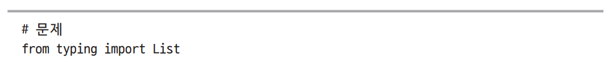  
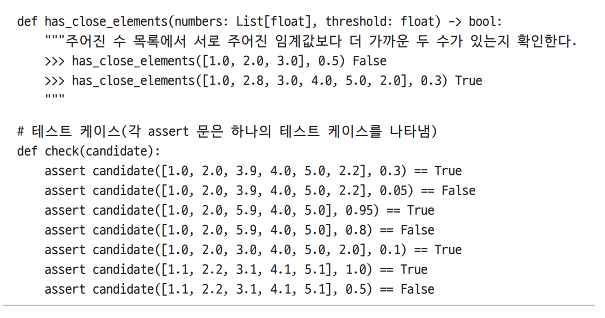  
  
모델을 평가할 떄는 문제마다 k개의 코드 샘플을 생성한다. 모델이 생성한 k개의 코드 샘플 중 하나라도 해당 문제의 모든 테스트 케이스를 통과하면 그 문제를 
해결한 것으로 본다. 최종 점수인 pass@k는 전체 문제 중 해결한 문제의 비율이다. 예를 들어 10개의 문제가 있고 모델이 k = 3일 때 5개를 해결했다면 
그 모델의 pass@3 점수는 50%다. 모델이 생성하는 코드 샘플이 많을수록 각 문제를 해결할 가능성이 높아지므로 최종 점수도 높아진다. 따라서 pass@1 
점수는 pass@3보다 낮고 pass@3은 다시 pass@10보다 낮을 것으로 예상된다.  
  
기능적 정확성을 자동으로 평가할 수 있는 또 다른 작업 유형은 게임 봇이다. 테트리스를 플레이하는 봇을 만든다면 봇이 얻는 점수로 그 성능을 알 수 있다. 
측정 가능한 목표가 있는 작업은 보통 기능적 정확성으로 평가할 수 있다.  
  
# **참조 데이터 유사도 측정**  
기능적 정확성으로 자동 평가할 수 없는 작업이라면 AI의 출력을 참조 데이터와 비교해 평가하는 것은 일반적인 방법이다. 예를 들어 모델에게 프랑스어 문장을 
영어로 번역해달라고 한다면 생성된 영어 번역문을 정답 영어 번역문과 비교해 평가할 수 있다.  
  
참조 데이터의 각 에시는 (입력, 참조 응답) 형식을 따른다. 하나의 입력에 여러 개의 참조 응답이 있을 수 있다. 예를 들어 하나의 프랑스어 문장에 대해 
여러 가지 가능한 영어 번역이 있을 수 있다. 참조 응답은 정답이나 표준 응답이라고도 불린다. 참조가 필요한 평가 지표는 참조 기반 지표(reference-based metrics), 
그렇지 않은 것은 참조 없는 지표(reference-free metrics)라고 한다.  
  
이 평가 방식은 참조 데이터가 필요하므로 참조 데이터를 얼마나 빨리 많이 만들 수 있는지가 곧 성능의 척도가 된다. 참조 데이터는 보통 사람이 생성하지만 
점점 AI가 생성하는 경우가 늘고 있다. 사람이 생성한 데이터를 참조로 사용한다는 것은 사람의 성능을 최고 기준으로 삼고 AI의 성능을 사람의 성능과 비교해 
측정한다는 의미다. 사람이 데이터를 생성하는 것은 비용이 많이 들고 시간도 오래 걸리기 떄문에 최근에는 많은 경우 AI를 사용해 참조 데이터를 생성한다. 
AI가 생성한 데이터도 사람의 검토가 필요할 수 있지만 처음부터 참조 데이터를 생성하는 것보다는 훨씬 적은 노력이 든다.  
  
생성된 응답이 참조 응답과 더 비슷할수록 더 좋은 것으로 간주된다. 두 개방형 텍스트 간의 유사도를 측정하는 방법에는 네 가지가 있다.  
  
1. 비교: 평가자에게 두 텍스트가 같은지 판단하도록 요청하기  
2. 정확한 일치: 생성된 응답이 참조 응답 중 하나와 정확히 일치하는지 여부  
3. 어휘적 유사도: 생성된 응답이 참조 응답과 얼마나 비슷해 보이는지  
4. 의미적 유사도: 생성된 응답이 의미(semantic)에서 참조 응답과 얼마나 가까운지  
  
두 응답의 비교는 사람 평가자나 AI 평가자가 할 수 있다.  
  
이 절에서는 수작업으로 설계된 평가 지표, 즉 정확한 일치, 어휘적 유사도, 의미적 유사도를 다룬다. 정확한 일치의 점수는 이진(일치 또는 불일치)인 
반면 나머지 두 점수는 연속적인 척도(0과 1 사이 또는 -1과 1 사이)다. AI 평가자 접근 방식의 사용 편의성과 유연성에도 수작업으로 설계된 유사도 측정은 
정확한 특성 떄문에 업계에서 여전히 널리 사용되고 있다.  
  
출력의 품질을 평가하기 위해 유사도 측정을 사용할 수도 있지만 다음과 같은 다양한 용도로도 사용할 수 있다.  
  
- 검색과 서치: 질의와 유사한 항목 찾기  
- 순위 매기기: 질의에 대한 유사도를 기준으로 순위 매기기  
- 군집화: 항목간 유사도를 기준으로 군집화  
- 이상 탐지: 나머지 항목들과 유사도가 낮은 항목 탐지하기  
- 데이터 중복 제거: 다른 항목들과 유사도가 높은 항목 제거하기  
  
# **정확한 일치**  
생성된 응답이 참조 응답 중 하나와 정확히 일치하면 정확한 일치로 간주한다. 정확한 일치는 간단한 수학 문제, 일반 상식 질의, 퀴즈 형태의 질의처럼 짧고 
정확한 응답을 기대하는 작업에 적합하다. 다음 질의들은 짧고 정확한 답을 가진다.  
  
- 2 + 3은?  
- 최초의 여성 노벨상 수상자는 누구인가?  
- 현재 계좌 잔액이 얼마인가?  
- 빈칸 채우기: 프랑스의 파리는 영국의 __와 같다.  
  
답이 같더라도 표현 방식이 다를 수 있어 이를 처리하는 여러 방법이 있다. 한 가지 방법은 참조 답안이 포함된 모든 응답을 정답으로 인정하는 것이다. 
"2 + 3은?" 이라는 질의를 예로 들어보자. 참조 답안이 "5"라면 이 방식에서는 "답은 5다"와 "2 + 3은 5다" 처럼 "5"를 포함하는 모든 응답을 정답으로 
인정한다.  
  
하지만 이런 방식은 때때로 잘못된 답을 정답으로 인정하는 결과를 낳을 수 있다. "안네 프랑크는 언제 태어났나요?"라는 질의를 생각해 보자. 안네 프랑크는 
1929년 6월 12일에 태어났으므로 올바른 응답은 1929년이다. 모델이 "1929년 9월 12일"이라고 응답하면 정답 연도가 포함되어 정답으로 인정하지만 사실은 
틀린 답이다.  
  
간단한 작업을 넘어서면 정확한 일치는 거의 작동하지 않는다. 원문인 프랑스어 문장 'Comment ca va?'를 보자. 'How are you?', 'How is everything?', 
'How are you doing?' 등 다양한 영어 번역이 가능하다. 만약 참조 데이터가 이 세 가지 번역만 있고 모델이 "How is it going?"을 생성했다면 
모델의 응답은 틀린 것으로 표시될 것이다. 원문이 길고 복잡할수록 가능한 번역의 수는 더 많아진다. 하나의 입력에 대해 가능한 모든 응답을 만드는 것은 
불가능하다. 복잡한 작업에서는 어휘적 유사도와 의미적 유사도가 더 효과적이다.  
  
# **어휘적 유사도**  
어휘적 유사도는 두 텍스트가 얼마나 겹치는 측정한다. 먼저 각 텍스트를 더 작은 토큰으로 나누어서 비교한다.  
  
가장 단순한 형태에서 어휘적 유사도는 두 텍스트가 공통으로 가진 토큰의 수를 세는 방식으로 측정할 수 있다. 예를 들어 참조 응답 "My cats scare the mice" 
와 두 가지 생성된 응답을 생각해 보자.  
  
- "My cats eat the mice"  
- "Cats and mice fight all the time"  
  
각 토큰이 단어라고 가정해 보자. 공통된 단어만 세어보면 응답 A는 참조 응답의 5개 단어 중 4개를 포함하고 있어 유사도 점수가 80%이고 응답 B는 
5개 중 3개만 포함하고 있어 유사도 점수가 60%다. 따라서 응답 A가 참조 응답과 더 유사한 것으로 간주된다.  
  
어휘적 유사도를 측정하는 방법 중 하나로 근사 문자열 매칭(approximate string matching)이 있는데 이는 보통 퍼지 매칭(fuzzy matching)이라고 부른다. 
두 텍스트가 얼마나 비슷한지를 측정하기 위해 한 텍스트를 다른 텍스트로 바꾸는 데 필요한 편집 횟수를 센다. 이때 이 편집 횟수를 편집 거리(edit distance)라고 
부른다. 편집 연산에는 다음 세 가지가 있다.  
  
1. 삭제: brad -> bad  
2. 삽입: bad -> bard  
3. 대체: bad -> bed  
  
일부 퍼지 매처는 두 글자를 바꾸는 것(예: mats -> mast)도 하나의 편집으로 취급한다. 하지만 어떤 퍼지 매처는 각 전치를 하나의 삭제와 하나의 삽입, 
즉 두 번의 편집 연산으로 취급한다.  
  
예를 들어 bad는 bard 까지 한 번의 편집이 필요하고 cash까지는 세 번의 편집이 필요하므로 bad는 cash보다 bard와 더 유사한 것으로 간주된다.  
  
어휘적 유사도를 측정하는 또 다른 방법은 n-gram 유사도다. 이는 개별 토큰이 아닌 토큰의 연속된 시퀀스인 n-gram의 겹칩을 기준으로 측정한다. 1-gram(unigram)은 
하나의 토큰이고 2-gram(bigram)은 두 토큰의 집합이다. 'My cats scare the mice'는 'my cats', 'cats scare', 'scare the', 'the mice'라는 
4개의 bigram으로 구성된다. 참조 응답의 n-gram 중 몇 퍼센트가 생성된 응답에도 있는지를 측정한다.  
  
어휘적 유사도의 일반적인 지표는 BLEU, ROUGE, METEOR++, TER, CIDEr가 있다. 이들은 각각 텍스트가 얼마나 겹치는지 계산하는 방식이 다르다. 파운데이션 
모델이 등장하기 전에는 번역 작업을 평가할 때 주로 BLEU, ROUGE와 연관된 지표들을 사용했다. 파운데이션 모델의 등장 이후에는 어휘적 유사도를 사용하는 
벤치마크가 줄었다. 이런 지표들을 사용하는 벤치마크의 예는 WMT, COCO Captions, GEMv2가 있다.  
  
이 방법의 단점은 포괄적인 참조 응답 세트를 만들어야 한다는 것이다. 참조 세트에 비슷한 응답이 없다면 좋은 응답도 낮은 유사도 점수를 받을 수 있다. 
어뎁트는 일부 벤치마크 예시에서 자사의 모델 푸유가 낮은 성능을 보인 것이 모델의 출력이 잘못되어서가 아니라 참조 데이터에 일부 정답이 누락되어 있었기 
떄문이라는 것을 발견했다. 아래 그름은 푸유가 정확한 이미지 캡션을 생성했지만 낮은 점수를 받은 예시다.  
  
  
  
게다가 참조 응답도 틀릴 수 있다. 예를 들어 기계 번역 평가 지표를 연구하는 WMT 2023 Metrics 공유 작업에서 주최 측은 자신들의 데이터에 잘못된 
참조 번역이 많다는 것을 발견했다. 프라이탁의 연구에 따르면 사람 판단과의 상관관계라는 관점에서 참조 없이 평가하는 방식이 참조를 사용하는 평가 방식에 
필적하는 성능이 나오는 이유중 하나가 참조 데이터의 낮은 품질에 있었다.  
  
이 측정 방식의 또 다른 단점은 어휘적 유사도 점수가 높다고 해서 반드시 더 나은 응답이라고 할 수 없다는 것이다. 예를 들어 코드 생성 벤치마크인 
HumanEval에서 오픈 AI는 잘못된 해답과 올바른 해답의 BLEU 점수가 비슷하다는 것을 발견했다. 이를 통해 BLEU 점수가 높아진다고 해서 반드시 기능적 
정확성도 함꼐 높아지는 것은 아니라는 점을 알 수 있다.  
  
# **의미적 유사도**  
어휘적 유사도는 두 텍스트가 비슷하게 생겼는지를 측정할 뿐 의미가 같은지는 측정하지 않는다. 'What's up?과 'How are you?'라는 두 문장을 생각해 
보자. 어휘적으로는 사용하는 단어나 글자가 거의 겹치지 않아서 다르다. 하지만 의미적으로는 매우 비슷하다. 반대로 비슷하게 생긴 텍스트도 매우 다른 
의미를 가질 수 있다. 'Let's eat, grandma' 와 'Let's eat grandma'는 완전히 다른 의미다.  
  
의미적 유사도는 의미가 얼마나 비슷한지 계산하는 것을 목표로 한다. 이를 위해서는 먼저 텍스트를 임베딩이라고 부르는 숫자 표현으로 변환해야 한다. 
예를 들어 'the cat sits on a mat'라는 문장은 [0.11, 0.02, 0.54]와 같은 임베딩으로 표현될 수 있다. 그래서 의미적 유사도를 임베딩 유사도라고 
한다.  
  
두 임베딩 간의 유사도는 코사인 유사도 같은 지표로 계산할 수 있다. 정확히 같은 두 임베딩의 유사도 점수는 1이고 반대되는 두 임베딩의 유사도 점수는 
-1이다.  
  
지금은 텍스트 예시를 사용하고 있지만 의미적 유사도는 이미지나 오디오를 포함한 모든 데이터 유형의 임베딩에 대해 계산할 수 있다. 텍스트에 대한 의미적 
유사도는 때때로 의미적 텍스트 유사도라고도 부른다.  
  
의미적 유사도를 정확한 평가 범주에 포함시켰지만 서로 다른 임베딩 알고리즘이 서로 다른 임베딩을 만들어낼 수 있기 때문에 주관적인 것으로 볼 수도 
있다. 하지만 두 임베딩이 주어지면 그들 사이의 유사도 점수는 정확하게 계산된다.  
  
수학적으로 보면 A를 생성된 응답의 임베딩이라고 하고 B를 참조 응답의 임베딩이라고 하자. A와 B 사이의 코사인 유사도는 (A-B)/(||A|| ||B||) 로 
계산된다.  
  
- A·B는 A와 B의 내적  
- ||A|| 는 A의 유클리드 노름(L2 노름이라고도 함)이다. A가 [0.11, 0.02, 0.54]라면 ||A|| = √(0.11² + 0.02² + 0.54²)  
  
의미적 텍스트 유사도를 위한 지표는 BERT가 임베딩을 생성하는 BERTScore와 여러 알고리즘의 조합으로 임베딩을 생성하는 MoverScore가 있다.  
  
의미적 텍스트 유사도는 어휘적 유사도만큼 포괄적인 참조 응답 세트를 필요로 하지 않는다. 하지만 의미적 유사도의 신뢰성은 기반이 되는 임베딩 알고리즘의 
품질에 달려있다. 같은 의미를 가진 두 텍스트라도 임베딩이 좋지 않으면 낮은 의미적 유사도 점수를 받을 수 있다. 이 측정 방식의 또 다른 단점은 기반이 
되는 임베딩 알고리즘을 실행하는 데 상당한 계산 능력과 시간이 필요할 수 있다는 점이다.  
  
# **임베딩 소개**  
컴퓨터는 숫자로 작동하기 떄문에 모델은 입력을 컴퓨터가 처리할 수 있는 숫자 표현으로 변환해야 한다. 임베딩(embedding)은 원본 데이터의 의미를 담으려는 
숫자 표현이다.  
  
임베딩은 벡터다. 예를 들어 'the cat sits on a mat'라는 문장은 [0.11, 0.02, 0.54] 같은 임베딩 벡터로 표현할 수 있다. 실제 임베딩 벡터의 크기
(임베딩 벡터의 원소 개수)는 보통 100에서 10000 사이다.  
  
임베딩을 만들기 위해 특별히 학습된 모델로는 오픈 소스 모델인 BERT, CLIP(대조적 언어-이미지 사전 학습), Sentence Transformers가 있다. API 형태로 
제공되는 비공개 임베딩 모델들도 있다. 아래 표는 인기 있는 모델들의 임베딩 크기를 보여준다.  
  
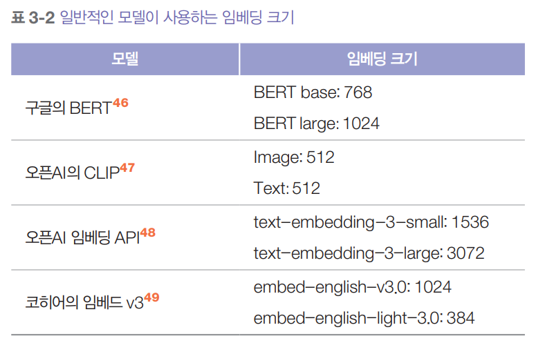  
  
GPT나 라마를 포함한 많은 ML 모델은 보통 입력을 먼저 벡터로 표현해야 하기 떄문에 임베딩을 생성하는 단계를 포함한다. 이런 모델들의 중간 층에 접근할 수 
있다면 임베딩을 추출하는 데 사용할 수 있다. 하지만 이렇게 추출한 임베딩은 임베딩 전용 모델이 생성한 임베딩만큼 좋지 않을 수 있다.  
  
임베딩 알고리즘의 목표는 원본 데이터의 본질을 담아내는 임베딩을 만드는 것이다. 이를 어떻게 검증할 수 있을까? [0.11, 0.02, 0.54]라는 임베딩 벡터는 
'the cat this on a mat'인 원본 텍스트와 완전 다르게 생겼다.  
  
큰 틀에서 보면 더 비슷한 텍스트의 임베딩이 코사인 유사도나 관련 지표로 측정했을 때 더 가까우면 좋은 임베딩 알고리즘이라고 본다. 'the cat sits on a mat'
문장의 임베딩은 'AI research is super fan'의 임베딩보다 'the dog plays on the grass'의 임베딩에 더 가까워야 한다.  
  
임베딩의 품질은 해당 작업의 유용성을 기준으로도 평가할 수 있다. 임베딩은 분류, 주제 모델링, 추천 시스템, RAG 등 많은 작업에서 사용된다. MTEB(Massive 
Text Embedding Benchmark)는 여러 작업에서 임베딩 품질을 측정하는 벤치마크의 에시다.  
  
텍스트를 예시로 들었지만 모든 데이터는 임베딩으로 표현될 수 있다. 예를 들어 크리테오와 코베오 같은 전자상거래 솔루션은 제품에 대한 임베딩을 가지고 
있다. 핀터레스트는 이미지, 그래프, 쿼리, 심지어 사용자에 대한 임베딩도 가지고 있다.  
  
새로운 연구 분야는 서로 다른 유형의 데이터에 대한 통합 임베딩을 만드는 것이다. CLIP은 텍스트와 이미지라는 서로 다른 유형의 데이터를 하나의 통합 
임베딩 공간으로 매핑할 수 있는 첫 주요 모델 중 하나였다. ULIP(텍스트, 이미지, 포인트 클라우드의 통합 표현)은 텍스트, 이미지, 3D 포인트 클라우드의 통합 
표현을 만드는 것을 목표로 한다. ImageBind는 텍스트, 이미지, 오디오를 포함한 여섯 가지 서로 다른 유형의 데이터에 대한 통합 임베딩을 학습한다.  
  
아래 그림은 CLIP의 구조를 시각화한다. CLIP은 (이미지, 텍스트) 쌍을 사용해 학습한다. 이미지에 대응하는 텍스트는 해당 이미지의 캡션이나 관련 댓글일 
수 있다. 각 (이미지, 텍스트) 쌍에 대해 CLIP은 텍스트 인코더를 사용해 텍스트를 텍스트 임베딩으로 변환하고 이미지 인코더를 사용해 이미지를 이미지 임베딩으로 
변환한다. 그런 다음 이 임베딩들을 통합 임베딩 공간으로 투영한다. 학습 목표는 이 결합 공간에서 이미지와 텍스트의 임베딩이 가까워지게 만든다.  
  
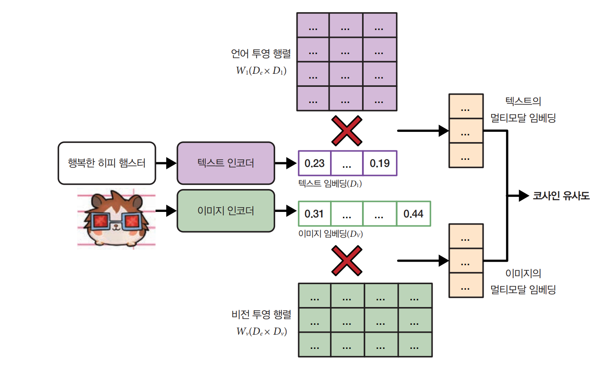  
  
여러 유형의 데이터를 표현할 수 있는 통합 임베딩 공간은 멀티모달 임베딩 공간이라고 한다. 텍스트-이미지 통합 임베딩 공간에서 낚시하는 남자의 이미지 
임베딩은 '패션쇼'라는 텍스트의 임베딩보다 '어부'라는 텍스트의 임베딩과 더 가까워야 한다. 이런 통합 임베딩 공간은 서로 다른 유형의 임베딩을 비교하고 
통합할 수 있게 한다.  
  
# **AI 평가자**  
개방형 응답을 평가하는 것이 어렵다 보니 많은 팀이 결국 사람의 평가에 의존하게 됐다. AI를 사용해 AI를 평가하는 접근 방식을 AI 평가자(AI as a judge) 
또는 LLM 평가자(LLM-as a judge)라고 한다. 다른 AI 모델을 평가하는 데 사용되는 AI 모델을 AI 평가자라고 한다.  
  
AI를 사용해 평가를 자동화하는 아이디어는 오래전부터 있었지만 AI 모델이 제대로 수행할 만한 수준에 도달한 것은 2020년 GPT-3가 출시되면서였다. 
현재 AI 평가자는 실제 서비스에서 AI 모델을 평가하는 보편적인 방법이 됐다. 2023년과 2024년에 본 대부분의 AI 평가 스타트업 데모들은 어떤 식으로든 
AI 평가자를 활용했다. 2023년 랭체인의 AI 현황 보고서에 따르면 그들의 플랫폼에서 이뤄진 평가의 58%가 AI 평가자에 의해 수행됐다.  
  
# **AI 평가자를 쓰는 이유**  
AI 평가자는 사람 평가자에 비해 빠르고 사용하기 쉬우며 비용도 상대적으로 저렴하다. 또한 참조 데이터 없이도 작동할 수 있어서 참조 데이터가 없는 
실제 서비스 환경에서도 사용할 수 있다.  
  
AI 모델에게 정확성, 반복성, 유해성, 건전성, 환각 등 어떤 기준으로든 출력을 평가하도록 요청할 수 있다. 이것은 마치 사람에게 아무 주제나 의견을 
물어볼 수 있는 것과 같다. 하지만 사람들의 의견을 항상 신뢰할 수는 없지 않은가 라고 생각할 수 있다. 이는 일리가 있는 말이고 AI의 판단도 항상 
신뢰할 수 있는 것은 아니다. 하지만 AI 모델은 많은 사람의 의견을 바탕으로 만들어졌기 떄문에 대중적인 관점에서 판단을 내릴 수 있다. 적절한 모델에 적절한 
프롬프트를 사용하면 다양한 주제에 대해 상당히 좋은 판단을 얻을 수 있다.  
  
연구에 따르면 특정 AI 평가자는 사람 평가자들과 높은 상관관계를 보인다. 2023년에 정 등의 연구는 자신들의 평가 벤치마크인 MT-Bench에서 GPT-4와 
사람의 일치도가 85%에 달했는데 이는 사람들 간의 일치도(81%)보다도 높았다. AlpacaEval 연구자들도 그들의 AI 평가자가 사람이 평가한 LMSYS의 
챗봇 아레나 리더보드와 거의 완벽한(0.98) 상관관계를 보인다는 것을 발견했다.  
  
AI는 응답을 평가할 뿐만 아니라 자신의 결정을 설명할 수도 있는데 이는 평가 결과를 검토하고 싶을 때 특히 유용하다. 아래 그림은 GPT-4가 자신의 판단을 
설명하는 예시를 보여준다.  
  
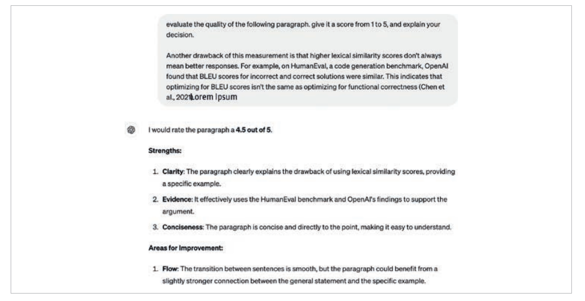  
  
이런 유연성 덕분에 AI 평가자는 다양한 애플리케이션에서 유용하게 쓸 수 있으며 어떤 애플리케이션에서는 자동 평가가 가능한 유일한 방법이 되기도 한다. 
AI의 판단이 사람만큼 정확하지는 않더라도 프로젝트를 시작하고 개발 방향을 잡기에 충분하다.  
  
# **AI 평가자 사용법**  
AI를 사용해 여러 가지 방식으로 평가할 수 있다. 예를 들어 AI를 사용해 응답 자체의 품질을 평가하거나 그 응답을 참조 데이터와 비교하거나 다른 응답과 
비교할 수 있다. 다음은 이 세 가지 접근 방식에 대한 간단한 프롬프트 예시다.  
  
1. 주어진 원본 질의에 대해 응답의 품질을 독립적으로 평가하기  
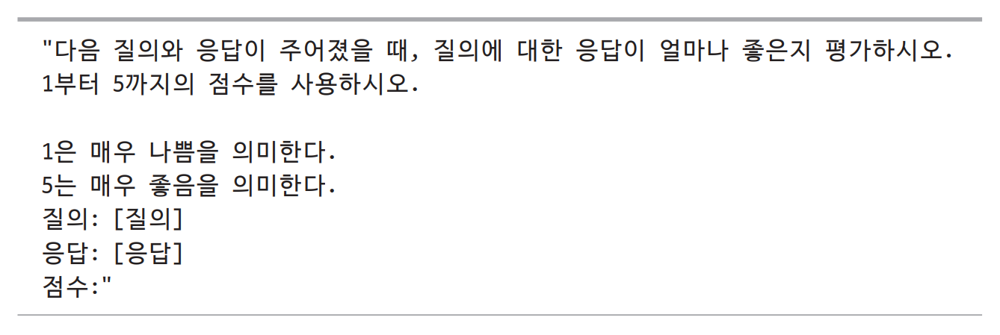  
  
2. 생성된 응답을 참조 응답과 비교해 생성된 응답이 참조 응답과 같은지 평하기. 이는 사람이 설계한 유사도 측정의 대안이 될 수 있다.  
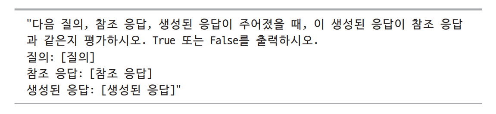  
  
3. 생성된 두 응답 중 어느 것이 더 나은지, 또는 사용자가 어느 것을 더 선호할지 예측한다. 이렇게 얻은 선호도 데이터는 후처리와 테스트 시점 연산, 
그리고 비교 평가를 통한 모델 순위 매기기에 활용된다.  
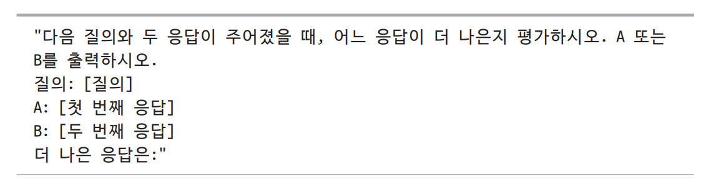  
  
범용 AI 평가자는 어떤 기준으로도 응답을 평가할 수 있다. 예를 들어 역할 연기 챗봇을 만든다면 "이 대답이 간달프가 할 법한 말인가요?"처럼 챗봇의 
응답이 사용자가 원하는 역할과 얼마나 어울리는지 평가할 수 있다. 아래 표는 여러 AI 도구들이 기본으로 제공하는 AI 평가 기준들을 보여준다.  
  
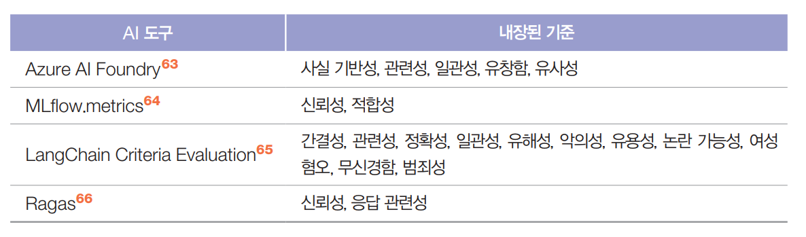  
  
AI 평가의 기준은 표준화되어 있지 않다는 점을 기억하는 것이 중요하다. 애저 AI 스튜디오의 관련성 점수는 MLflow의 관련성 점수와 매우 다를 수 있다. 
이런 점수는 평가자 역할을 하는 AI 모델과 프롬프트에 따라 달라진다.  
  
AI 평가자를 프롬프트 하는 방법은 다른 일반적인 AI 애플리케이션 프롬프트 방법과 유사하다. 일반적으로는 평가자 프롬프트는 다음 사항을 명확하게 
설명해야 한다.  
  
1. 모델이 수행할 작업(예: 생성된 응답과 질의 간의 관련성 평가)  
2. 모델을 평가할 때 따라야 할 기준(예: 주요 초점은 생성된 응답이 기준 응답 (ground truth answer)에 따라 주어진 질의를 충분히 해결하는 정보를 
포함하는지 판단하는 데 두어야 한다). 지시가 더 자세할수록 좋다.  
3. 점수 체계. 다음 중 하나의 방식으로 점수를 매길 수 있다.  
- A. 분류: 좋음/나쁨. 관련됨/관련 없음/중립 등  
- B. 이산적인 숫자 값: 1~5점. 이는 각 클래스를 의미적으로 해석하는 대신 숫자로 구분하는 특수한 분류 방식이다.  
- C. 연속적인 숫자 값: 0과 1 사이의 값. 유사한 정도를 평가할 때 사용한다.  
  
언어 모델은 일반적으로 숫자보다 텍스트를 더 잘 다룬다. AI 평가자는 수치 점수 체계보다 분류에서 더 잘 작동하는 것으로 보고됐다. 수치 점수 체계를 사용할 
때는 연속 점수보다 이산 점수가 더 잘 작동하는 것으로 보인다. 경험적으로 이산 점수의 범위가 넓을수록 모델의 성능이 더 나빠진다. 일반적인 이산 
점수 체계는 1부터 5 사이다.  
  
프롬프트에 대한 예시가 포함된 경우 성능이 더 좋은 것으로 나타났다. 1부터 5까지의 점수 체계를 사용할 경우 각 점수에 해당하는 응답의 예시를 포함하고 
가능하다면 특정 점수를 부여 받은 이유에 대해서도 설명하자.  
  
다음은 애저 AI 스튜디오의 관련성 기준에서 사용하는 프롬프트의 일부다. 작업, 기준, 점수 체계, 낮은 점수를 받는 입력 예시, 이 입력이 낮은 점수를 
받는 이유에 대해 설명한다. 간결성을 위해 일부 내용은 생략했다.  
  
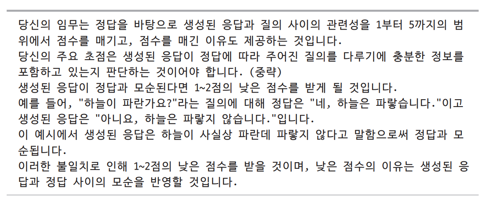  
  
아래 그림은 질의가 주어졌을 때 응답의 품질을 평가하는 AI 평가자의 예시다.  
  
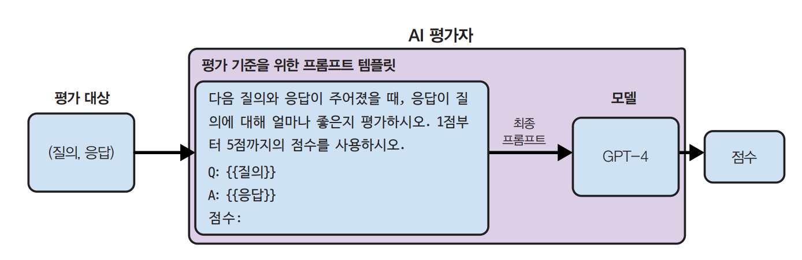  
  
AI 평가자는 단순히 모델만 있는 것이 아니라 모델과 프롬프트를 모두 포함하는 시스템이다. 모델, 프롬프트 또는 모델의 샘플링 파라미터를 변경하면 다른 
평가자가 된다.  
  
# **AI 평가자의 한계**  
AI를 평가자로 활용하는 것은 많은 장점이 있지만 많은 팀이 이 접근 방식을 도입하기를 주저한다. AI로 AI를 평가하는 것은 동어반복처럼 보이기도 하고 AI의 
확률적 특성 때문에 평가자 역할을 하기엔 너무 신뢰성이 떨어진다고 여겨지기 떄문이다. 또한 AI의 확률적 특성 떄문에 평가자 역할을 하기엔 너무 신뢰성이 
떨어진다고 여겨지기 떄문이다. 또한 AI 평가자는 애플리케이션에 상당한 비용과 지연을 초래할 수 있는 위험도 있다. 이런 한계들 때문에 일부 팀은 다른 
평가 방법을 찾지 못할 때 차선책으로 AI 평가자를 사용하려 하며 운영 환경일수록 이런 경향이 더 강해진다.  
  
# **비일관성**  
평가 방법이 신뢰를 얻으려면 결과가 일관되어야 한다. 하지만 AI 평가자는 다른 AI 애플리케이션처럼 확률적이다. 같은 평가자가 동일한 입력값을 받더라도 
프롬프트가 다르면 다른 점수를 출력할 수 있다. 심지어 같은 평가자가 같은 지시로 프롬프트를 받아도 두 번 실행하면 다른 점수가 나올 수 있다. 이런 
비일관성 떄문에 평가 결과를 재현하거나 신뢰하기 어렵다.  
  
AI 평가자의 일관성을 높이는 것은 가능하다. 정 등은 실험을 통해 프롬프트에 평가 예시를 포함하면 GPT-4의 일관성이 65%에서 77.5%로 향상된다는 것을 
보여줬다. 하지만 높은 일관성이 높은 정확도를 의미하지는 않을 수 있다고 인정했다. 평가자가 같은 실수를 일관되게 할 수도 있기 때문이다. 게다가 예시를 
더 많이 포함하면 프롬프트가 길어지고 긴 프롬프트는 추론 비용을 높인다. 정의 실험에서는 프롬프트에 더 많은 예시를 포함하자 GPT-4 비용이 4배 늘어났다.  
  
# **평가 기준의 모호성**  
사람이 설계한 많은 지표와 달리 AI 평가자의 지표는 표준화되지 않아서 잘못 해석하고 오용하기 쉽다. MLflow, Ragas, LlamaIndex라는 오픈 소스 도구들은 
모두 주어진 컨텍스트에서 생성된 출력이 원본 내용을 얼마나 정확히 반영하는지 측정하는 충실성(faithfulness)이라는 내장 기준을 가지고 있지만 지시와 
점수 체계가 모두 다르다. 아래 표에서 볼 수 있듯이 MLflow는 1점에서 5점까지의 점수 체계를 사용하고 Ragas는 0과 1을 사용하며 LlamaIndex의 프롬프트는 
평가자에게 YES와 NO를 출력하도록 요청한다.  
  
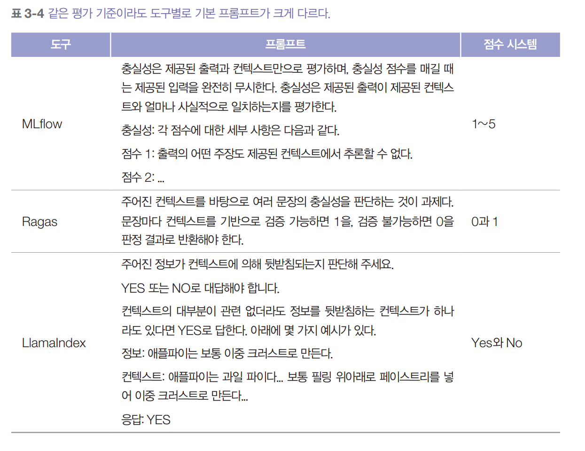  
  
이 세 도구가 출력하는 충실성 점수는 서로 비교할 수 없다. (컨텍스트, 응답) 쌍이 주어졌을 때 MLflow는 충실성 점수를 3으로 주고 Ragas가 1을, LlamaIndex가 
NO를 출력한다면 어떤 점수를 사용해야 할까?  
  
애플리케이션은 시간이 지나면서 발전하지만 평가 방식은 이상적으로는 고정되어야 한다. 이렇게 해야 평가 지표를 사용해 애플리케이션의 변화를 모니터링할 
수 있다. 하지만 AI 평가자도 AI 애플리케이션이므로 시간이 지나면서 변할 수 있다.  
  
지난달에는 애플리케이션의 일관성 점수가 90%였는데 이번 달에는 92%라고 해보자. 이는 애플리케이션의 일관성이 향상됐다는 뜻일까? 사용된 AI 평가자가 두 
경우 모두 동일하다는 걸 확실히 알지 못하면 이 질문에 답하기 어렵다. 이번 달의 평가자의 프롬프트가 지난 달과 다르면 어떨까? 어쩌면 성능이 더 좋은 
프롬프트로 바꾸었거나 동료가 지난달 프롬프트의 오타를 수정해서 이번 달 평가자가 더 관대해진 것일 수도 있다.  
  
모델과 평가자에 사용된 프롬프트를 볼 수 없다면 어떤 AI 평가자도 신뢰하지 마라.  
  
평가 방법이 표준화되는 데는 시간이 걸린다. 분야가 발전하고 더 많은 안전장치가 도입되어 미래엔 AI 평가가 훨씬 더 표준화되고 신뢰할 수 있게 될 것이다.  
  
# **비용과 지연 시간 증가**  
AI 평가자는 테스트 단계와 운영 환경 모두에서 애플리케이션을 평가하는 데 사용할 수 있다. 많은 팀이 운영 환경에서 위험을 줄이기 위해 AI 평가자를 안정장치로 
사용하며 AI 평가자가 좋다고 판단한 응답만 사용자에게 보여준다.  
  
강력한 모델로 응답을 평가하는 것은 비용이 많이 들 수 있다. GPT-4로 응답을 생성하고 평가까지 한다면 GPT-4 API 호출이 두 배가 되어 비용도 거의 두 배로 
늘어난다. 전반적인 응답 품질, 사실 일관성, 유해성 같은 세 가지 기준을 평가하기 위해 세 개의 평가 프롬프트를 사용한다면 API 호출 횟수는 4배로 늘어난다.  
  
평가자로 더 약한 모델을 사용하면 비용을 줄일 수 있다. 표본 검사(응답의 일부만 평가)로도 비용을 줄일 수 있다. 표본 검사는 일부 실패를 놓칠 수 있다는 
단점이 있다. 평가하는 표본의 비율이 높을수록 평가 결과에 대한 확신이 더 커지지만 비용도 늘어난다. 비용과 신뢰도 사이의 적절한 균형을 찾으려면 
시행착오가 필요할 수 있다. 전체적으로 봤을 떄 AI 평가자는 사람 평가자보다 훨씬 저렴하다.  
  
운영 파이프라인에 AI 평가자를 구현하면 지연 시간이 늘어날 수 있다. 사용자에게 응답을 보내기 전에 평가한다면 위험은 줄지만 지연 시간이 늘어나는 
트레이드오프가 발생한다. 이런 지연 시간 증가는 엄격한 지연 시간 요구사항이 있는 애플리케이션에서는 사용하기 어려울 수 있다.  
  
# **AI 평가자의 편향**  
사람 평가자에게 편향이 있듯이 AI 평가자에도 편향이 있고 평가자마다 서로 다른 편향을 보인다. AI 평가자의 편향을 이해하면 점수를 올바르게 해석하고 
이런 편향을 완화하는 데도 도움이 된다.  
  
AI 평가자는 자기 편향(self-bias)을 보이는 경향이 있는데 이는 모델이 다른 모델이 생성한 응답보다 자신의 응답을 선호하는 현상이다. 모델이 생성할 
가능성이 가장 높은 응답을 계산하는 메커니즘이 그 응답에 높은 점수를 주기도 한다. 정 등의 연구에서 GPT-4는 자신의 응답에 10% 더 높은 점수를 줬고 
클로드-v1은 자신의 응답에 25% 더 높은 점수를 줬다.  
  
많은 AI 모델이 첫 위치 편향을 보인다. AI 평가자는 짝을 이뤄 비교할 떄나 여러 선택지 중에서 첫 번째 응답을 선호할 수 있다. 이는 순서를 바꿔가며 
같은 테스트를 여러 번 반복하거나 세심하게 작성된 프롬프트를 사용해 완화할 수 있다. AI와 사람의 위치 편향은 정반대다. 사람은 마지막에 본 응답을 
선호하는 경향이 있는데 이런 현상을 최근성 편향(recency bias)이라고 한다.  
  
일부 AI 평가자는 장황성 편향(verbosity bias)을 보이는데 품질과 관계없이 더 긴 응답을 선호한다. 우와 아지의 연구는 GPT-4와 클로드-1이 정확하지만 
짧은 응답(~50단어)보다 부정확하지만 긴 응답(~100단어)을 선호한다는 것을 발견했다. 사이토 등은 창작 과제에서도 이런 현상을 연구했는데 길이 차이가 
충분히 클 때 (예: 한 응답이 다른 것보다 두 배 길 때) 평가자는 거의 항상 더 긴 것을 선호한다는 것을 발견했다. 하지만 정 등의 연구와 사이토 등의 연구 
모두 GPT-4가 GPT-3.5 보다 이런 편향이 덜하다는 것을 발견했는데 이는 모델이 더 강력해질수록 이런 편향이 사라질 수 있다는 것을 시사한다.  
  
이런 편향들 외에도 AI 평가자는 다른 모든 AI 애플리케이션처럼 개인정보 보호와 지적 재산권 같은 제약이 있다. 상용모델을 평가자로 사용한다면 데이터를 
해당 모델에 보내야 하는데 모델 제공업체가 학습 데이터를 공개하지 않으면 그 평가자를 상업적으로 안전하게 사용할 수 있는지 확신하기 어렵다.  
  
AI 평가자 방식은 이런 한계가 있지만 많은 장점 덕분에 앞으로도 계속 도입될 것이라 생각한다. 하지만 AI 평가자 외에도 정확한 평가 방법이나 사람의 평가가 
함께 필요하다.  
  
# **평가자로 활용 가능한 모델**  
평가자는 평가받는 모델보다 더 강력하거나 더 약하거나 비슷할 수 있다. 각각의 시나리오는 장단점이 있다.  
  
얼핏 보면 더 강력한 평가자가 이치에 맞아 보인다. 시험 채점자가 시험 응시자보다 더 많이 알아야 하지 않을까? 더 강력한 모델은 더 나은 판단을 할 
수 있을 뿐만 아니라 더 나은 응답을 생성하도록 안내해서 더 약한 모델의 성능 향상에 도움을 줄 수 있다.  
  
더 강력한 모델을 사용할 수 있다면 왜 더 약한 모델로 응답을 생성하나 궁금할 수 있다. 그 이유는 비용과 지연 시간 떄문이다. 보통 더 강력한 모델은 
비용이 많이 들어서 모든 응답을 생성하긴 어렵고 일부 응답을 평가하는 데만 활용한다. 예를 들어 내부에서 개발한 저비용 모델로 응답을 생성하고 GPT-4로 
응답의 1%를 평가할 수 있다.  
  
더 강력한 모델이 애플리케이션에 비해 너무 느릴 수도 있다. 빠른 모델로 응답을 생성하고 더 강력하지만 느린 모델은 백그라운드에서 평가를 수행하도록 할 
수 있다. 강력한 모델이 약한 모델의 응답이 좋지 않다고 판단하면 강력한 모델의 응답으로 교체하는 등의 조치를 취할 수 있다. 반대 패턴도 흔한데 강력한 
모델로 응답을 생성하고 약한 모델이 백그라운드에서 평가를 수행하는 방식이다.  
  
더 강력한 모델을 평가자로 사용하면 두 가지 문제가 생긴다. 첫째, 가장 강력한 모델을 평가할만한 평가자를 찾을 수 없다. 둘째, 어떤 모델이 가장 강력한지 
판단하기 위한 다른 평가 방법이 필요하다.  
  
모델이 자신을 평가하는 자기 평가(self-evaluation)나 자기 비평(self-critique)은 자기 편향 때문에 편법처럼 들릴 수 있다. 하지만 자기 평가는 기본 
검증에 매우 유용하다. 모델이 자신의 응답이 잘못됐다고 생각한다면 그 모델을 신뢰하긴 어려울 것이다. 기본 검증을 넘어서 모델에게 자기 평가를 요청하면 
응답을 수정하고 개선하도록 유도할 수 있다. 다음 예시는 자기 평가의 예시다.  
  
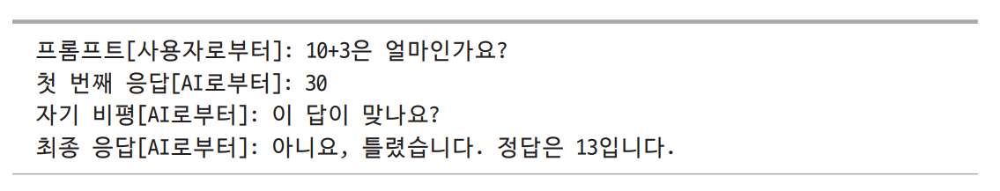  
  
아직 평가자가 평가받은 모델보다 더 약해도 괜찮은지에 대해서는 해결되지 않았다. 일부는 평가가 생각보다 쉬운 작업이라고 주장한다. 노래가 좋은지 판단하는 
것은 누구나 할 수 있지만 직접 노래를 만들 수 있는 사람은 많지 않다. 더 약한 모델도 더 강력한 모델의 출력을 평가할 수 있어야 한다.  
  
정 등의 연구는 더 강력한 모델이 사람의 선호도와 상관관계가 있다는 것을 발견했는데 이 떄문에 사람들은 자신들이 감당할 수 있는 가장 강력한 모델을 
선택하게 된다. 하지만 이 실험은 범용 평가자로만 제한되어 있다. 다른 연구 방향 중 하나는 작고 특화된 평가자다. 특화된 평가자는 특정 기준과 특정 
점수 체계를 사용해 특정 판단을 하도록 학습된다. 작고 특화된 평가자는 특정 판단에 있어서 더 크고 범용적인 평가자보다 더 신뢰할 수 있다.  
  
AI 평가자를 사용하는 방법이 많기 떄문에 특화된 AI 평가자도 다양할 수 있다. 평가자의 예시로 보상 모델, 참조 기반 평가자, 선호도 모델 세 가지를 살펴본다.  
  
# **보상 모델**  
보상 모델은 (프롬프트, 응답) 쌍을 입력으로 받고 주어진 프롬프트에 대해 그 응답이 얼마나 좋은지 점수를 매긴다. 보상 모델은 수년간 RLHF에서 성공적으로 
사용되어 왔다. 보상 모델의 사례로 구글이 2023년에 개발한 캐피가 있다. 캐피는 (프롬프트, 응답) 쌍이 주어지면 응답이 얼마나 정확한지를 나타내는 0과 
1사이의 점수를 출력한다. 캐피는 3억 6천만 개의 파라미터를 가진 경량 평가 모델로 범용 파운데이션 모델보다 훨씬 작다.  
  
# **참조 기반 평가자**  
참조 기반 평가자는 하나 이상의 참조 응답을 기준으로 생성된 응답을 평가한다. 이 평가자는 유사도 점수나 품질 점수(생성된 응답이 참조 응답과 비교해 
얼마나 좋은지)를 출력할 수 있다. 예를 들어 BLEURT는 (후보 응답, 참조 응답) 쌍을 입력으로 받아 참조 응답 간의 유사도 점수를 출력한다. Prometheus는
(프롬프트, 생성된 응답, 참조 응답, 채점 기준)을 입력으로 받아 참조 응답이 5라고 가정하고 1점에서 5점 사이의 품질 점수를 출력한다.  
  
# **선호도 모델**  
선호도 모델은 (프롬프트, 응답 1, 응답 2)를 입력으로 받아 주어진 프롬프트에 대해 어느 응답이 더 나은지(사용자가 더 선호하는지) 출력한다. 이는 아마 
특화된 평가자 중에서 가장 기대되는 방향일 것이다. 사람의 선호도를 예측할 수 있다는 것은 많은 가능성을 열어준다. 사람의 선호도에 AI 모델을 맞추려면 
선호도 데이터가 꼭 필요하지만 이를 확보하기가 쉽지 않고 비용도 크다. 사람의 선호도를 정확히 예측하는 모델이 있으면 전반적인 평가가 수월해지고 
모델을 더 안전하게 활용할 수 있다. PandaLM과 JudgeLM을 포함해 선호도 모델을 만들기 위한 많은 시도가 있었다. 아래 그림은 PandaLM이 어떻게 
작동하는지 보여주는 예시다. 이 모델은 두 응답 중 어느 것이 더 나은지 판단하고 그렇게 판단한 이유까지 설명해 준다.  
  
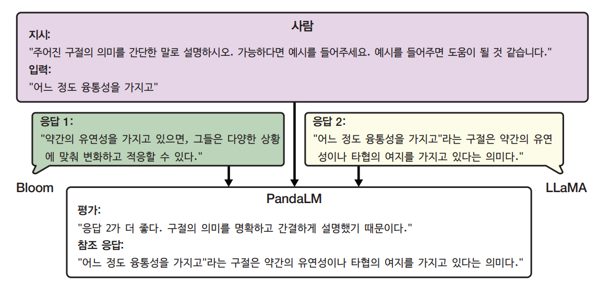  
  
AI 평가자 방식에는 한계가 있지만 다재다능하고 강력하다. 더 저렴한 모델을 평가자로 사용하면 활용도가 더욱 높아진다. 많은 개발자가 처음엔 회의적이었지만 
지금은 운영 환경에서 이 방식을 많이 사용하고 있다.  
  
AI 평가자도 흥미로운 방식이지만 게임 디자인이라는 매력적인 분야에서 영감을 받은 다음 방식도 그에 못지않게 흥미롭다.  
  
# **비교 평가를 통해 모델 순위 정하기**  
모델을 평가하는 이유는 점수 자체보다는 어떤 모델이 가장 적합한지 알고 싶어서인 경우가 많다. 이때 필요한 것들은 모델의 순위다. 모델 순위는 개별 평가나 
비교 평가를 통해 정할 수 있다.  
  
개별 평가는 각 모델을 독립적으로 평가한 다음 점수를 기준으로 순위를 매긴다. 예를 들어 어느 댄서가 가장 뛰어난 댄서인지 알고 싶다면 각 댄서를 
개별적으로 평가해서 점수를 매기고 가장 높은 점수를 받은 댄서를 선택하면 된다.  
  
비교 평가는 모델들을 서로 비교해 평가하고 비교 결과로 순위를 계산한다.  
  
응답의 품질이 주관적일 때는 보통 개별 평가보다 비교 평가가 더 쉽다. 예를 들어 두 노래 중 어느 것이 더 나은지 판단하는 것은 각 노래에 구체적인 점수를 
매기는 것보다 쉽다.  
  
AI 분야에서 비교 평가는 2021년 앤트로픽이 서로 다른 모델의 순위를 매기는 데 처음 사용했다. LMSYS의 챗봇 아레나 순위표도 이 방식을 사용하는데 
커뮤니티에서 진행한 모델 간 일대일 비교 결과를 점수화해서 순위를 정한다. 많은 모델 제공업체가 운영 환경에서 자사 모델을 평가할 떄 비교 평가를 
사용한다.  
  
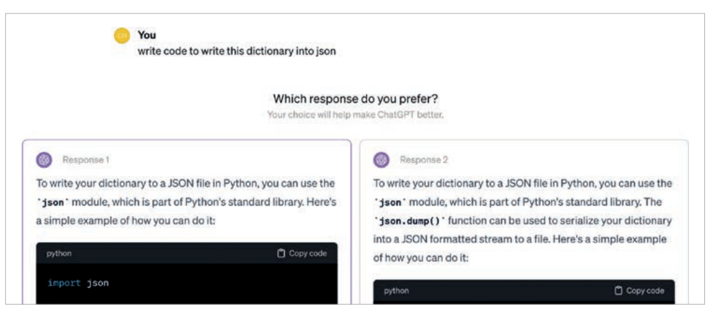  
  
위 그림은 챗GPT가 사용자에게 두 출력을 나란히 놓고 비교하도록 요청하는 예시다. 이런 출력은 서로 다른 모델이 생성했을 수도 있고 같은 모델이 다른 
샘플링 변수로 생성했을 수도 있다.  
  
하나의 요청에 대해 두 개 이상의 모델이 응답하고 사람이나 AI 평가자가 그중 더 나은 것을 선택한다. 응답들의 품질이 비슷할 경우 임의로 하나를 선택하는 
것을 피하기 위해 동점 처리를 허용하는 개발자가 많다.  
  
가장 중요한 것은 모든 질의를 선호도로 평가할 수는 없다는 점이다. 많은 경우 정확성을 기준으로 평가해야 한다. 예를 들어 "스마트폰 방사선과 뇌종양이 연관성이 있나요?"
라는 질의에 모델이 "예"와 "아니요" 두 가지 선택지를 주고 고르라고 한다고 생각해 보자. 선호도 기반 투표는 잘못된 신호를 줄 수 있고 이를 모델 학습에 
사용하면 잘못된 행동을 초래할 수 있다.  
  
사용자에게 선택하도록 요청하는 것은 사용자의 불만을 일으킬 수도 있다. 답을 몰라서 모델에게 수학 문제를 물었는데 모델이 서로 다른 두 답을 주고 어느 
것이 더 좋은지 고르라고 한다고 생각해 보자. 정답을 알았다면 애초에 모델에게 물어보지도 않았을 것이다.  
  
사용자에게 비교 의견을 수집할 때 가장 어려운 점은 어떤 질의가 선호도 투표에 적합한지 판단하는 것이다. 선호도 기반 투표는 평가자가 해당 분야를 잘 
아는 경우에만 의미가 있다. 따라서 이 방식은 AI가 인턴이나 비서처럼 사용자가 이미 알고 있는 일을 더 빠르게 처리하도록 돕는 경우에는 잘 작동하지만 
사용자가 모르는 일을 AI에게 요청하는 경우에는 적절하지 않다.  
  
비교 평가는 A/B 테스트와 다르다. A/B 테스트에 사용자가 한 번에 하나의 후보 모델의 출력만 보는 반면 비교 평가는 사용자가 여러 모델의 출력을 한꺼번에 
보고 비교한다.  
  
모델 간의 비교를 경기(match)라고 부르며 이런 비교들이 모여 아래 표와 같은 결과가 만들어진다.  
  
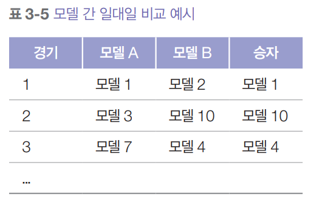  
  
모델 A가 모델 B보다 선호될 확률은 A가 B를 이긴 승률이다. 이 승률은 A와 B 사이의 모든 경기를 보고 이긴 비율을 계산해서 구할 수 있다.  
  
모델이 두 개뿐이면 순위 매기기는 간단하다. 승률이 더 높은 모델이 더 높은 순위를 차지한다. 하지만 모델 수가 늘어날수록 순위 매기기는 더 어려위진다. 
아래 표처럼 다섯 개 모델 간의 실제 승률 데이터가 있다고 해보자. 이런 데이터로는 다섯 모델의 순위를 정하기가 쉽지 않다.  
  
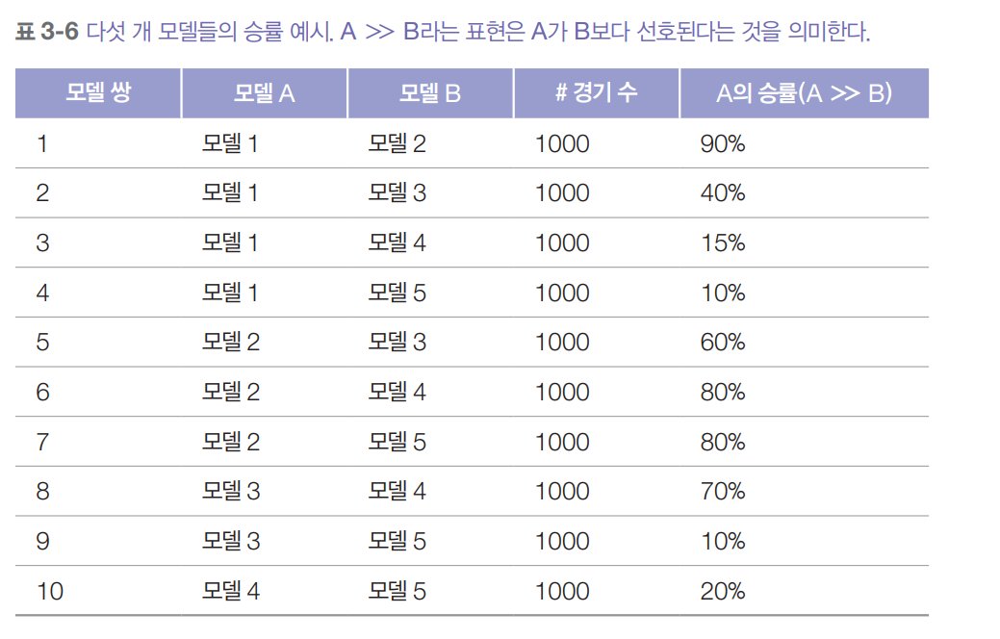  
  
비교 평가 결과가 주어지면 평가 알고리즘을 사용해 모델의 순위를 계산한다. 일반적으로 이 알고리즘은 먼저 비교 결과에서 모델의 점수를 계산한 다음 
이 점수로 모델의 순위를 매긴다.  
  
비교 평가는 AI 분야에서는 새롭지만 다른 산업에서는 거의 한 세기 동안 사용되어 왔다. 특히 스포츠와 비디오 게임 분야에서 인기가 많다. Elo, Bradley-Terry, 
TrueSkill 처럼 다른 분야에서 개발된 많은 평가 알고리즘을 AI 모델 평가에 맞게 응용할 수 있다. LMSYS의 챗봇 아레나는 처음에 Elo를 사용해 모델의 
순위를 계산했지만 이후 Elo가 평가자와 프롬프트 순서에 민감하다는 것을 발견하고는 Bradley-Terry 알고리즘으로 바꿨다.  
  
순위가 정확하다는 것은 더 높은 순위의 모델이 더 낮은 모델의 경기에서 항상 이길 가능성이 더 높다는 뜻이다. 만약 모델 A가 B보다 순위가 높다면 사용자들이 
B보다 A를 선호하는 비율이 50%를 넘어야 한다.  
  
이런 관점에서 보면 모델 순위 매기기는 예측 문제나 다름없다. 과거 경기 결과로 순위를 계산하고 이를 사용해 미래 경기 결과를 예측한다. 서로 다른 순위 
알고리즘은 서로 다른 순위를 만들 수 있으며 어떤 순위가 옳은지에 대한 절대적인 기준은 없다. 순위의 품질은 미래 경기 결과를 얼마나 잘 예측하는지로 
결정된다.  
  
# **비교 평가의 과제들**  
점수 기반 평가에서 올바른 비교 결과를 얻기 위해 벤치마크와 지표 설계가 가장 어려운 부분이고 점수로 모델의 순위를 매기는 건 쉽다. 반면 비교 평가에서는 
비교 결과를 수집하는 것과 모델 순위를 매기는 것 모두가 까다롭다.  
  
# **확장성 병목**  
기본적으로 비교 평가는 데이터가 많이 필요하다. 비교할 모델 쌍의 수는 모델 수의 제곱에 비례해 증가한다. 2024년 1월 LMSYS는 57개의 모델을 244000번의 
비교로 평가했다. 비교 횟수가 많아 보이지만 모델 쌍당 평균 153번의 비교만 이루어진 것이다. 파운데이션 모델이 수행해야 할 다양한 작업을 고려하면 
매우 적은 횟수다.  
  
다행이 두 모델의 성능을 비교할 떄 직접 비교하지 않아도 되는 경우가 있다. 순위 알고리즘은 보통 전이성을 가정한다. 모델 A가 B보다 순위가 높고 B가 
C보다 순위가 높다면 전이성에 따라 A의 순위가 C보다 높다고 추론할 수 있다. 즉 알고리즘이 A가 B보다 낫고 B가 C보다 낫다는 것을 확신한다면 A와 
C를 직접 비교하지 않아도 A가 더 낫다는 것을 알 수 있다.  
  
하지만 이런 전이성 가정이 AI 모델에도 적용되는지는 불분명하다. AI 평가에서 Elo를 분석한 많은 논문이 전이성 가정을 한계점으로 지적한다. 이들은 사람의 
선호도가 반드시 전이성을 가지지는 않는다고 주장한다. 게다가 서로 다른 모델 쌍이 서로 다른 평가자와 프롬프트로 평가되기 떄문에 비전이성이 발생할 수 
있다.  
  
새로운 모델을 평가하는 것도 어려운 과제다. 독립적 평가는 새로운 모델만 평가하면 되지만 비교 평가는 새로운 모델을 기존 모델과 비교해야 하며 이는 기존 모델의 
순위를 바꿀 수 있다.  
  
비공개 모델을 평가하는 것은 더욱 어렵다. 예를 들어 내부 데이터로 회사의 모델을 만들었다고 해보자. 이 모델을 공개된 다른 모델과 비교해서 어느 쪽을 
사용하는 게 더 나을지 알고 싶다면 두 가지 선택지가 있다. 직접 비교 데이터를 수집해서 순위표를 만들거나 공개 순위표 제공업체에 비공개 평가를 의뢰하는 
것이다.  
  
이런 확장성 병목 현상은 더 나은 매칭 알고리즘으로 완화할 수 있다. 지금까지는 모델이 각 경기에서 무작위로 선택되어 모든 모델 쌍이 거의 같은 횟수로 
경기를 한다고 가정했다. 하지만 모든 모델 쌍을 똑같이 비교할 필요는 없다. 어떤 모델 쌍의 결과를 확신할 수 있다면 더 이상 그들을 서로 매칭할 필요가 
없다. 효율적인매칭 알고리즘이라면 전체 순위의 불확실성을 최대한 줄일 수 있는 경기를 선택해야 한다.  
  
# **표준화와 품질 관리의 부재**  
비교 결과를 수집하는 한 가지 방법은 LMSYS 챗봇 아레나처럼 커뮤니티에 비교를 맡기는 것이다. 누구나 웹사이트에 접속해서 프롬프트를 입력하면 익명의 
두 모델에서 나온 두 응답을 받아볼 수 있고 더 나은 것에 투표할 수 있다. 모델의 이름은 투표가 끝난 후에만 공개된다.  
  
이 방식의 장점은 다양한 비교 결과를 얻을 수 있고 조작하기도 비교적 어렵지 않다. 하지만 단점은 표준화와 품질 관리를 강제하기 어렵다는 것이다.  
  
첫째, 인터넷에 접속할 수 있는 사람이라면 누구나 아무 프롬프트를 사용해 이런 모델을 평가할 수 있고 어떤 응답이 더 나은지에 대한 기준이 없다. 자원봉사자에게 
응답의 사실 관계를 확인하라고 기대하기는 힘들기 떄문에 그들이 실제로는 부정확하지만 그럴듯하게 들리는 응답을 선호할 수 있다.  
  
어떤 사람은 예의 바르고 절제된 응답을 선호하는 반면 다른 사람은 필터링되지 않은 응답을 선호할 수 있다. 이는 장점이자 단점이다. 실제 사람들의 선호도를 
파악할 수 있다는 점에서는 좋지만 이런 선호도가 모든 활용 사례에 적합한 것은 아니라는 점에서는 나쁘다. 예를 들어 사용자가 모델에게 부적절한 농담을 
해달라고 했는데 모델이 거절한다면 사용자는 낮은 점수를 줄 수 있다. 하지만 애플리케이션 개발자 입장에서는 오히려 모델이 거절하는 것을 선호할 수 
있다. 일부 사용자는 악의적으로 유해한 응답을 선호 응답으로 선택해 순위를 왜곡할 수도 있기 떄문이다.  
  
둘째, 크라우드소싱(crowdsourcing) 방식의 비교는 사용자들이 실제 업무 환경이 아닌 곳에서 모델을 평가하게 된다. 실제 사용 환경에 대한 이해가 없다 
보니 테스트용 프롬프트가 현장에서 모델이 실제로 어떻게 쓰이는지 제대로 반영하지 못할수 있다. 대부분의 사용자는 정교한 프롬프트 기법 대신 즉흥적으로 
떠오르는 프롬프트를 사용할 것이다.  
  
2023년 LMSYS 챗봇 아레나가 공개한 33000개의 프롬프트 중 180개가 'hello'와 'hi'로 데이터의 0.55%를 차지하며 여기에는 'hello!', 'hello.', 
'hola', 'hey' 등의 변형은 포함되지도 않았다. 또한 수수께끼도 많은데 'X에게는 3명의 자매가 있고, 각각 남자 형제가 있다. X에게는 몇 명의 남자 
형제가 있을까?' 라는 질의가 44번이나 반복됐다.  
  
단순한 프롬프트는 응답의 난이도가 낮아 모델들의 성능 차이를 구별하기 어렵다. 이러한 프롬프트로 평가하다 보면 모델 순위가 제대로 매겨지지 않을 수 있다.  
  
공개 순위표는 기업의 내부 데이터베이스에서 관련 문서를 검색해 컨텍스트를 보강하는 것과 같은 고급 기능을 지원하지 않는다. 따라서 이런 순위표로는 
모델이 RAG 시스템에서 얼마나 잘 동작할지 판단하기 어렵다. 좋은 응답을 만들어 내는 능력과 관련 문서를 찾아내는 능력은 전혀 다르기 떄문이다.  
  
표준화를 강제하는 한 가지 방법은 사용자가 미리 정해진 프롬프트만 사용하도록 제한하는 것이다. 하지만 이는 다양한 활용 사례에 대한 모델의 능력을 
평가할 수 없게 된다. 그래서 LMSYS는 사용자가 어떤 프롬프트든 사용할 수 있게 하되 내부 모델을 사용해 어려운 프롬프트를 찾아내고 이것들만 가지고 
모델의 순위를 매긴다.  
  
다른 방법은 신뢰할 수 있는 평가자만 사용하는 것이다. 평가자들에게 두 응답을 비교하는 기준을 교육하거나 실용적인 프롬프트와 정교한 프롬프트 기법을 사용하도록 
교육할 수 있다. Scale AI의 비공개 비교 순위표가 이 방식을 사용하고 있다. 다만 비용이 많이 들고 비교 횟수도 크게 줄어든다는 단점이 있다.  
  
또 다른 방법은 비교 평가를 제품에 통합해서 사용자가 작업하는 동안 모델을 평가하도록 하는 것이다. 예를 들어 코드를 생성할 때 사용자의 코드 편집기에 
두 개의 코드 조각을 보여주고 더 나은 것을 고르게 할 수 있다. 많은 채팅 애플리케이션이 이미 이렇게 하고 있지만 사용자가 전문가가 아니라면 어느 코드 
조각이 더 나은지 판단하기 어려울 수 있다.  
  
게다가 사용자가 두 선택지를 다 읽지 않고 무작위로 하나를 클릭할 수도 있다. 이는 결과에 많은 노이즈를 만들어낼 수 있다. 따라서 소수의 사용자라도 제대로 평가한다면 
어떤 모델이 더 나은지 판단하기에 충분할 수 있다.  
  
이러한 이유로 일부 팀은 사람 평가자보다 AI를 선호한다. AI가 숙련된 전문가만큼 뛰어나지는 않더라도 무작위 인터넷 사용자보다는 더 신뢰할 수 있기 때문이다.  
  
# **비교 성능에서 절대 성능으로**  
많은 애플리케이션에서 반드시 최고의 모델이 필요한 것은 아니다. 필요한 수준의 성능을 내는 모델이면 충분하다. 비교 평가는 어떤 모델이 더 나은지 알려주지만 
모델이 얼마나 좋은지 또는 우리 활용 사례에 충분히 좋은지는 알려주지 않는다. 모델 B가 모델 A보다 낫다는 순위를 얻었다고 하자. 이때 가능한 시나리오는 
다음과 같다.  
  
1. 모델 B는 좋지만 모델 A는 나쁘다.  
2. 모델 A와 B 모두 나쁘다.  
3. 모델 A와 B 모두 좋다.  
  
어느 시나리오가 사실인지 알려면 다른 형태의 평가가 필요하다.  
  
고객 지원에 모델 A를 사용하고 있고 이 모델이 모든 문의의 70%를 해결할 수 있다고 해보자. 이때 모델 A를 상대로 51%의 승률을 보이는 모델 B가 있다. 
이 51%라는 승률이 모델 B의 실제 문제 해결 능력과 어떻게 연관될지는 불분명하다. 여러 사람에게 들어보니 그들의 경험상 승률이 1% 변하면 어떤 애플리케이션에서는 
성능이 크게 향상되지만 다른 애플리케이션에서는 미미한 향상만 있었다고 한다.  
  
물론 모델 A를 B로 교체할 떄 사람의 선호도가 전부는 아니다. 비용 같은 다른 요소들도 고려해야 한다. 어느 정도의 성능 향상을 기대할 수 있을지 모르면 
비용 대비 효과를 분석하기 어렵다. 모델 B가 A보다 두 배 비싸다면 비교 평가만으로는 B의 성능 향상이 추가 비용을 감당할만한 가치가 있는지 판단하기 어렵다.  
  
