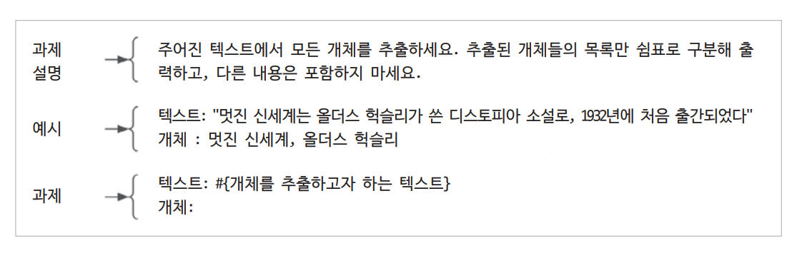
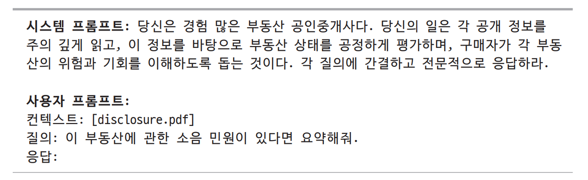
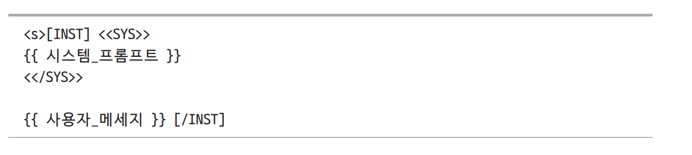
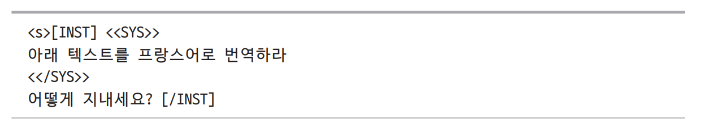
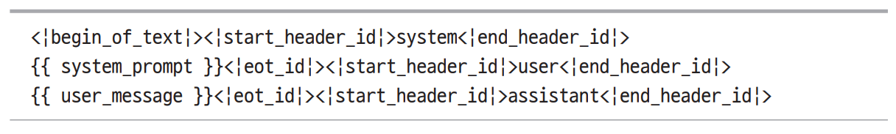
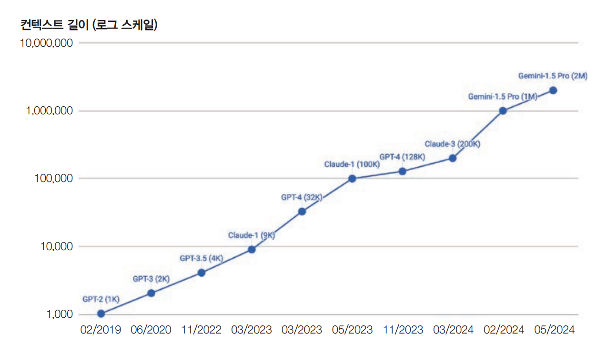
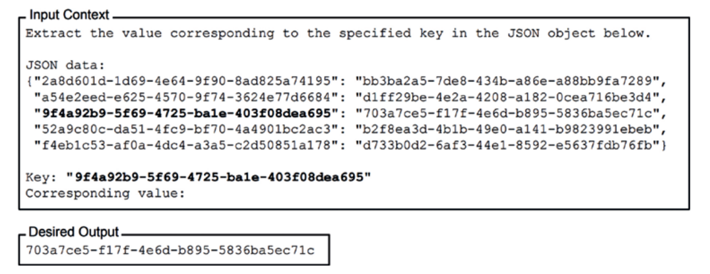
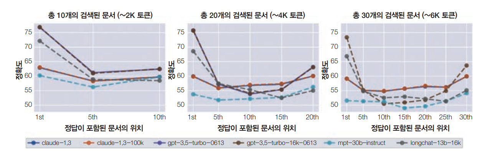

# **프롬프트 엔지니어링**  
프롬프트 엔지니어링은 모델이 원하는 결과를 생성하도록 지시를 정교하게 다듬는 과정이며 가장 쉽고 일반적인 모델 조정 기법이다. 파인튜닝과 달리 프롬프트 
엔지니어링은 모델의 가중치를 변경하지 않고도 모델의 응답을 조정한다. 파운데이션 모델의 강력한 역량 덕분에 많은 사람이 프롬프트 엔지니어링만으로도 이런 모델들을 
자신들의 애플리케이션에 맞게 적용했다. 따라서 파인튜닝과 같은 더 많은 자원을 필요로 하는 기법으로 넘어가기 전에 프롬프팅을 최대한 활용해야 한다.  
  
프롬프트 엔지니어링은 사용하기 쉽기 때문에 많은 사람이 별것 아니라고 오해하기 쉽다. 얼핏 보면 프롬프트 엔지니어링은 단순히 원하는 결과가 나올 떄까지 
단어들을 가지고 노는 것처럼 보인다. 물론 프롬프트 엔지니어링이 많은 시행착오를 수반하긴 하지만 동시에 흥미로운 문제들과 이를 해결하기 위한 창의적인 접근법들이 
존재한다. 이런 맥락에서 프롬프트 엔지니어링을 사람-AI 커뮤니케이션이라고 할 수 있다. 즉 원하는 작업을 수행하도록 AI 모델과 소통하는 것이다. 하지만 
누구나 쉽게 의사소통할 수 있지만 모두가 효과적으로 의사소통할 수 있는 것은 아니다. 마찬가지로 프롬프트를 작성하는 것은 쉽지만 효과적인 프롬프트를 구성하는 
것은 쉽지 않다.  
  
일부 사람들은 여전히 프롬프트 엔지니어링이 엔지니어링 분야로 인정받기에는 엄격성이 부족하다고 주장한다. 하지만 프롬프트 실험도 체계적인 실험 방법과 
평가 과정을 통해 다른 머신러닝 실험처럼 엄격하게 수행할 수 있다.  
  
프롬프트 엔지니어링의 중요성은 오픈AI의 한 연구자의 말로 정리할 수 있다. "문제는 프롬프트 엔지니어링 자체에 있지 않다. 프롬프트 엔지니어링은 분명히 
가치 있고 유용한 기술이다. 하지만 진짜 문제는 사람들이 프롬프트 엔지니어링만을 유일한 도구로 알고 있을 떄 발생한다." 실제 운영 가능한 AI 애플리케이션을 
개발하려면 프롬프트 엔지니어링 이상의 것이 필요하다. 실험 추적, 평가, 데이터셋 큐레이션을 위해서는 통계학, 엔지니어링, 전통적인 ML 지식이 필요하다.  
  
# **프롬프트 소개**  
프롬프트는 모델에게 특정 작업을 수행하도록 하는 지시다. 이 작업은 "누가 숫자 0을 발명했는가?"같은 질의에 대답하는 단순한 것일 수도 있고 제품 
아이디어에 대한 경쟁사 조사, 웹사이트 개발, 데이터 분석 같은 더 복잡한 작업일 수도 있다.  
  
프롬프트는 보통 다음 요소들 중 하나 이상을 포함한다.  
  
- 작업 설명  
모델이 수행해야 할 일을 의미하며 모델일 맡아야 할 역할과 출력 형식을 포함한다.  
  
- 작업 수행 방법에 대한 예시  
예를 들어 모델이 텍스트의 유해성을 탐지하길 원한다면 유해한 내용과 유해하지 않은 내용이 어떤 모습인지 몇 가지 예시를 제공할 수 있다.  
  
- 작업  
모델이 수행해야 할 구체적인 작업으로 응답할 질의나 요약할 책 등이 이에 해당한다.  
  
아래 그림은 개체명 인식(named-entity recognition, NER) 작업에 활용할 수 있는 간단한 프롬프트 예시다.  
  
  
  
기본적으로 프롬프트가 작동하려면 모델이 지시를 따를 수 있어야 한다. 모델이 지시를 잘 따르지 못한다면 아무리 프롬프트가 좋아도 모델은 지시를 따를 
수 없을 것이다.  
  
프롬프트 엔지니어링이 얼마나 필요한지는 모델이 프롬프트 변화에 얼마나 강건하지에 달려 있다. 만약 프롬프트가 약간만 바뀌는 경우엔 응답이 완전히 달라질까? 
예를 들어 '5' 대신 'five'라고 쓰거나 새로운 줄을 추가하거나 대소문자를 변경하는 경우를 생각해 볼 수 있다. 모델의 강건성이 낮을수록 더 많은 
시행착오가 필요하다.  
  
프롬프트를 무작위로 변경하면서 출력이 어떻게 변하는지 확인하면 모델의 강건성을 측정할 수 있다. 지시 수행 능력과 마찬가지로 모델의 강건성은 모델의 전반적인 
능력과 강한 상관관계가 있다. 모델이 강력해질수록 모델은 더욱 강건해진다. 이는 지능이 높은 모델이라면 '5'와 'five'가 같은 의미라는 것을 이해해야 
하기 떄문에 당연한 일이다. 이런 이유로 더 강력한 모델을 사용하면 골치 아픈 문제를 줄이고 시행착오에 낭비되는 시간을 단축할 수 있다.  
  
모델에 여러 프롬프트 구조들을 실험하면서 어떤 방식이 가장 효과적인지 찾아보자. GPT-4를 포함한 대부분의 모델은 경험적으로 프롬프트 시작 부분에 작업 
설명이 있을 때 더 좋은 성능을 보인다. 하지만 라마 3를 비롯한 일부 모델들은 프롬프트 끝부분에 작업 설명이 있을 때 더 잘 작동한다.  
  
# **인컨텍스트 학습: 제로샷과 퓨샷**  
프롬프트를 통해 모델에게 무엇을 해야 할지 가르치는 것을 인컨텍스트 학습(in-context learning)이라고 한다. 이 용어는 브라운 등의 GPT-3 논문 
Language Models Are Few-shot Learners에서 처음 소개되었다. 전통적으로 모델은 학습 과정(사전 학습, 사후 학습, 파인튜닝 포함)에서 모델 가중치를 
업데이트하면서 바람직한 행동을 배운다. GPT-3 논문은 언어 모델이 원래 학습된 목적과 다른 작업이라 하더라도 프롬프트 내의 예시를 통해 원하는 행동을 
학습할 수 있다는 것을 보여줬다. 이 과정에서는 가중치 업데이트가 필요하지 않다. 구체적으로 GPT-3는 다음 토큰 예측을 위해 학습됐지만 앞선 논문에서 
GPT-3가 컨텍스트를 통해 번역, 독해, 간단한 수학, 심지어 SAT 문제에 답하는 법까지 배울 수 있음을 보여줬다.  
  
인컨텍스트 학습은 모델이 지속해서 새로운 정보를 받아들여 결정을 내릴 수 있게 해주므로 모델이 계속 발전할 수 있게 만들어준다. 옛 자바스크립트 문서로 
학습된 모델을 생각해 보자. 인컨텍스트 학습 없이 이 모델을 사용해 새 자바스크립트 버전에 관한 질의에 답하려면 모델을 재학습해야 할 것이다. 하지만 
인컨텍스트 학습을 통해 모델의 컨텍스트에 새로운 자바스크립트 변경사항을 포함시킬 수 있어 모델이 학습 종료 시점 이후의 질의에도 응답할 수 있게 된다. 
이런 특성 떄문에 인컨텍스트 학습은 지속적 학습의 한 형태로 볼 수 있다.  
  
프롬프트에 제공된 각 예시를 샷(shot)이라고 부른다. 모델에게 프롬프트의 예시들을 통해 학습하도록 가르치는 방식을 퓨샷 학습이라고 한다. 다섯 개의 예시가 
있다면 5-샷 학습이다. 예시가 전혀 제공되지 않으면 제로샷 (0-샷) 학습이다.  
  
정확히 몇 개의 예시가 필요한지는 모델과 애플리케이션에 따라 다르다. 애플리케이션에 필요한 최적의 예시 수는 실험을 통해 알 수 있다. 일반적으로 모델에 
더 많은 예시를 보여줄수록 학습 효과가 좋아진다. 예시 수는 모델의 최대 컨텍스트 길이에 의해 제한된다. 예시가 많을수록 프롬프트가 길어져 추론 
비용이 증가한다.  
  
GPT-3의 경우 퓨샷 학습은 제로샷 학습에 비해 상당한 성능 향상을 보였다. 그러나 마이크로소프트의 2023년 분석에서 다룬 활용 사례에서는 GPT-4의 
몇몇 다른 모델들에서 퓨샷 학습이 제로샷 학습에 비해 제한적인 개선만을 가져왔다. 이 결과는 모델이 더 강력해질수록 지시를 이해하고 따르는 능력이 
향상되어 더 적은 예시로도 더 좋은 성능을 낼 수 있다는 것을 의미한다. 하지만 이 연구는 특정 도메인 분야에서 퓨샷 예시의 효과를 제대로 평가하지 
못했을 수 있다. 예를 들어 모델이 학습 데이터에서 Ibis 데이터프레임 API 예시를 많이 보지 못했다면 프롬프트에 Ibis 예시를 몇 개 추가하는 것만으로도 
성능이 크게 달라질 수 있다.  
  
- 용어 모호성: 프롬프트와 컨텍스트  
프롬프트와 컨텍스트는 때때로 서로 바꿔 사용된다. GPT-3 논문에서는 컨텍스트라는 용어를 모델에 입력되는 전체 내용을 가리키는 데 사용했다. 이런 의미에서 
컨텍스트는 프롬프트와 정확히 같다.  
  
하지만 일부의 사람은 컨텍스트가 프롬프트의 일부라고 주장했다. 컨텍스트는 모델이 프롬프트가 요구하는 것을 수행하는 데 필요한 정보를 의미한다. 이런 
의미에서 컨텍스트는 맥락적 정보라고 볼 수있다.  
  
더 혼란스럽게도 구글의 PALM2 문서는 컨텍스트를 대화 전반에 걸쳐 모델의 응답 방식을 형성하는 설명으로 정의한다. 예를 들어 컨텍스트를 사용해 모델이 
사용하거나 사용하지 말아야 할 단어, 집중하거나 피해야 할 주제 또는 응답 형식이나 스타일을 지정할 수 있다. 이는 컨텍스트를 작업 설명과 동일하게 
만든다.  
  
오늘날 인컨텍스트 학습은 당연한 것으로 여겨진다. 파운데이션 모델은 방대한 양의 데이터에서 학습하고 다양한 작업을 수행할 수 있어야 한다. 하지만 GPT-3 
이전에는 ML 모델이 학습된 작업만 수행할 수 있었기 떄문에 인컨텍스트 학습은 마치 마법처럼 느껴졌다. 똑똑한 많은 사람이 인컨텍스트 학습이 왜, 어떻게 
작동하는지 깊이 고민했다. ML 프레임워크 케라스의 창시자인 프랑수아 숄레는 파운데이션 모델을 다양한 프로그램의 라이브러리에 비유했다. 예를 들어 
하이쿠를 쓸 수 있는 프로그램과 리머릭을 쓸 수 있는 다른 프로그램이 포함될 수 있다. 각 프로그램은 특정 프롬프트에 의해 활성화될 수 있다. 이런 관점에서 
보면 프롬프트 엔지니어링은 원하는 프로그램을 활성화할 수 있는 적절한 프롬프트를 찾는 것이라 할 수 있다.  
  
# **시스템 프롬프트와 사용자 프롬프트**  
대부분의 모델 API는 프롬프트를 시스템 프롬프트와 사용자 프롬프트로 나눌 수 있는 옵션을 제공한다. 시스템 프롬프트는 작업 설명으로, 사용자 프롬프트는 작업 
자체로 생각할 수 있다. 이것이 어떤 모습인지 예를 통해 살펴보자.  
  
부동산 공개 정보를 이해하는 데 도움을 주는 챗봇을 만들고 싶다고 가정해 보자. 사용자는 공개 정보를 업로드하고 "지붕은 얼마나 오래됐나요?" 또는 "이 
부동산의 특이한 점은 무엇인가요?"와 같은 질의를 할 수 있다. 이 챗봇이 부동산 공인중개사처럼 행동하길 원한다. 이런 역할 지정 지시를 시스템 프롬프트에 
넣을 수 있고 사용자 질의와 업로드된 공개 정보는 사용자 프롬프트에 포함할 수 있다.  
  
  
  
챗GPT를 포함한 거의 모든 생성형 AI 애플리케이션에는 시스템 프롬프트가 있다. 일반적으로 애플리케이션 개발자가 제공하는 지시는 시스템 프롬프트에 들어가고 
사용자가 제공하는 지시는 사용자 프롬프트에 들어간다. 물론 여기서 창의적으로 지시를 이동시킬 수도 있다. 예를 들어 모든 것을 시스템 프롬프트나 사용자 
프롬프트에 넣는 것이다. 어떤 방식이 가장 효과적인지 알아보기 위해 프롬프트를 구성하는 다양한 방법을 시험해 볼 수 있다.  
  
시스템 프롬프트와 사용자 프롬프트가 주어지면 모델은 이들을 일반적으로 템플릿을 따라 하나의 프롬프트로 결합한다. 예를 들어 라마 2 채팅 모델의 템플릿은 
다음과 같다.  
  
  
  
시스템 프롬프트가 "아래 텍스트를 프랑스어로 번역하라"이고 사용자 프롬픝가 "어떻게 지내?"라면 라마 2에 입력되는 최종 프롬프트는 다음과 같다.  
  
  
  
이 절에서 설명하는 모델의 채팅 템플릿은 애플리케이션 개발자들이 사용하는 프롬프트 템플릿과는 다른 개념이다. 애플리케이션 개발자들은 프롬프트 템플릿에 
특정 데이터를 삽입해 완성된 프롬프트를 만든다. 반면 모델의 채팅 템플릿은 모델 개발자가 정의하며 보통 모델 문서에서 확인할 수 있다. 프롬프트 템플릿은 
누구든지 자신의 필요에 맞게 만들 수 있지만 채팅 템플릿은 모델 개발자만 정의할 수 있다.  
  
모델별로 서로 다른 채팅 템플릿을 사용한다. 같은 모델 제공업체도 모델 버전에 따라 템플릿을 변경할 수 있다. 예를 들어 메타는 라마 3 채팅 모델에서 
템플릿을 다음과 같이 변경했다.  
  
  
  
모델은 <|와 |> 사이의 각 텍스트 구간, 예를 들어 <|begin_of_text|>와 <|start_header_id|>는 모델에 의해 하나의 토큰으로 취급된다.  
  
잘못된 템플릿을 사용하면 이해하기 어려운 성능 문제가 발생할 수 있다. 또한 템플릿 사용 시 줄바꿈 하나를 추가하는 것과 같은 작은 실수도 모델의 
동작을 크게 변화시킬 수 있다.  
  
- 템플릿 불일치 문제를 피하기 위해 따라야 할 몇 가지 좋은 방법  
1. 파운데이션 모델에 대한 입력을 구성할 때 입력이 모델의 채팅 템플릿을 정확히 따르는지 확인한다.  
2. 프롬프트를 구성할 때 서드파티 도구를 사용한다면 해당 도구가 올바른 채팅 템플릿을 사용하는지 확인한다. 안타깝게도 템플릿 오류는 매우 흔하게 
발생한다. 이런 오류는 발견하기 어려운데 템플릿이 잘못되어도 모델이 그럴듯한 응답을 내놓기 때문에 문제가 겉으로 드러나지 않아 파악하기 어렵다.  
3. 모델에 질의를 보내기 전에 최종 프롬프트를 출력해 예상된 템플릿을 따르는지 다시 확인한다.  
  
대부분의 모델 제공업체는 잘 만들어진 시스템 프롬프트가 성능을 향상시킬 수 있다고 강조한다. 예를 들어 엔트로픽 문서에는 클로드에 시스템 프롬프트를 통해 
특정 역할이나 성격을 부여할 떄 대화 전반에 걸쳐 그 캐릭터를 더 효과적으로 유지할 수 있어 캐릭터에 충실하면서도 더 자연스럽고 창의적인 응답을 보여준다 
라고 설명한다.  
  
그런데 왜 시스템 프롬프트가 사용자 프롬프트보다 성능을 향상시킬까? 내부적으로는 시스템 프롬프트와 사용자 프롬프트가 모델에 입력되기 전에 하나의 최종 
프롬프트로 연결된다. 모델 관점에서 시스템 프롬프트와 사용자 프롬프트는 동일한 방식으로 처리된다. 시스템 프롬프트가 성능을 향상시키는 이유는 아마도 다음 
요소들 중 하나 또는 둘 다 때문일 것이다.  
  
- 시스템 프롬프트가 최종 프롬프트의 맨 앞에 위치하기 떄문에 모델이 앞부분에 있는 지시를 더 잘 처리할 수 있다.  
- The Instruction Hierarchy: Training LLMs to Prioritize Privileged Instructions라는 오픈AI 논문에서 공유된 것처럼 시스템 프롬프트에 
더 주의를 기울이도록 사후 학습되었을 수 있다. 모델이 시스템 프롬프트에 우선순위를 두도록 학습시키면 프롬프트 공격을 완화하는 데도 도움이 된다.  
  
# **컨텍스트 길이와 컨텍스트 효율성**  
프롬프트에 얼마나 많은 정보를 포함할 수 있는지는 모델의 컨텍스트 길이 제한에 달려있다. 모델의 최대 컨텍스트 길이는 최근 몇 년간 급속도로 증가했다. 
GPT의 첫 3 세대는 각각 1K, 2K, 4K의 컨텍스트 길이를 가지고 있다. 이는 대학 과제 수준의 글 정도만 처리할 수 있는 길이로 법률 문서나 연구 논문을 
담기에는 너무 짧다.  
  
컨텍스트 길이 확장은 곧 모델 제공업체들 사이의 경쟁으로 발전했다. 아래 그림은 컨텍스트 길이 제한이 얼마나 빠르게 확장되고 있는지 보여준다. 5년 
내에 GPT-2의 1K 컨텍스트 길이에서 제미니-1.5 프로의 2M 컨텍스트 길이로 2000배 증가했다. 100K 컨텍스트 길이는 중간 크기의 책을 담을 수 있다. 
2M 컨텍스트 길이는 약 2000개의 위키피디아 페이지와 파이토치와 같은 복잡한 코드 베이스를 담을 수 있다.  
  
  
  
프롬프트의 모든 부분이 동등한 것은 아니다. 연구에 따르면 모델은 프롬프트의 중간보다 시작과 끝에 제시된 지시를 훨씬 더 잘 이해한다. 프롬프트의 다양한 
부분의 효과를 평가하는 방법은 건초더미 속 바늘(needle in a haystack, NIAH)이라고 알려진 테스트를 사용하는 것이다. 이 아이디어는 무작위 정보
(바늘)를 프롬프트(건초더미)의 다양한 위치에 삽입하고 모델에게 이를 찾도록 요청하는 것이다. 아래 그림은 리우 등의 연구에서 사용된 정보의 예를 보여준다.  
  
  
  
아래 그림은 연구의 결과를 보여준다. 테스트된 모든 모델들은 프롬프트의 중간보다 시작과 끝에 가까울 떄 해당 정보를 훨씬 더 잘 찾아내는 것으로 나타났다.  
  
  
  
이 연구는 무작위로 생성된 문자열을 사용했지만 실제 질의와 응답을 사용할 수도 있다. 예를 들어 장시간에 걸친 의사 상담 기록이 있다면 환자의 복용 
약물이나 형액형과 같이 대화 중에 언급된 정보를 찾아내도록 모델에게 요청할 수 있다. 테스트할 떄는 모델의 학습 데이터에 포함되지 않았을 개인 정보를 사용하는 
것이 좋다. 그렇지 않으면 모델이 주어진 컨텍스트를 활용하는 대신 이미 알고 있는 내부 지식에 의존해 응답할 가능성이 있다.  
  
RULER 같은 비슷한 테스트 방법으로도 모델이 긴 프롬프트를 얼마나 잘 처리하는지 평가할 수 있다. 만약 모델 성능이 컨텍스트 길이가 늘어날수록 결과가 
점점 더 나빠진다면 프롬프트를 더 간결하게 만드는 방법을 고려해야 한다.  
  
시스템 프롬프트, 사용자 프롬프트, 예시, 그리고 컨텍스트는 프롬프트의 핵심 구성 요소다.  
  
