# **RAG와 에이전트**  
모델이 작업을 처리하려면 수행 방법에 대한 지시와 필요한 정보 모두가 필요하다. 사람이 정보가 부족할 때 잘못된 응답을 하기 쉬운 것처럼 AI 모델도 
컨텍스트가 부족할 때 실수를 하거나 환각을 일으킬 가능성이 높다. 특정 애플리케이션에서 모델의 지시는 모든 질의에 공통으로 사용되지만 컨텍스트는 
각 질의에 따라 달라진다.  
  
컨텍스트를 구성할 떄는 주로 검색 증강 생성(RAG)과 에이전트, 이 두 가지 패턴을 사용한다. RAG 패턴은 모델이 외부 데이터 소스에서 관련 정보를 검색할 수 
있게 한다. 반면 에이전트 패턴은 모델이 웹 검색이나 뉴스 API 같은 도구를 사용해 정보를 수집할 수 있게 한다.  
  
RAG 패턴이 주로 컨텍스트를 구성하는 데 사용되는 반면 에이전트 패턴은 그 이상의 기능을 수행할 수 있다. 외부 도구는 모델이 단점을 보완하고 기능을 
확장하는 데 도움을 준다. 무엇보다 에이전트 패턴은 모델이 현실 세계와 직접 상호작용하며 작업의 많은 부분을 자동화할 수 있게 길을 열어준다.  
  
RAG와 에이전트 패턴이 흥미로운 이유는 이미 강력한 모델에 새로운 능력을 더해주기 때문이다. 이 패턴들은 짧은 시간 안에 큰 주목을 받으며 '이것이 바로 
미래다'라고 확신하게 만드는 놀라운 데모와 제품의 등장으로 이어졌다.  
  
# **RAG**  
RAG는 외부 메모리 소스에서 관련 정보를 검색하여 모델의 생성을 향상시키는 기술이다. 외부 메모리 소스는 내부 데이터베이스, 사용자의 이전 채팅 세션, 
또는 인터넷이 될 수 있다.  
  
검색 후 생성(retrieve-then-generate) 패턴은 Reading Wikipedia to Answer Open-Domain Questions 에서 처름 소개되었다. 이 연구에서 시스템은 
먼저 질의와 가장 관련성 높은 5개의 위키피디아 페이지를 검색한 다음 모델이 이 페이지의 정보를 사용하거나 읽어 응답을 생성한다.  
  
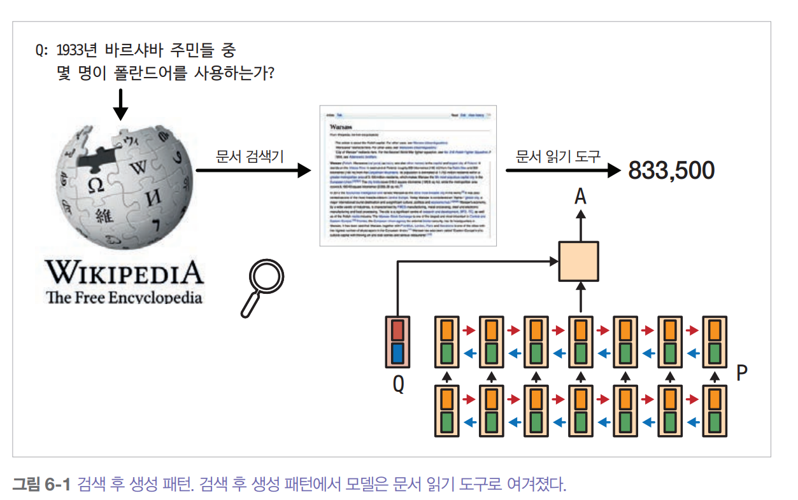  
  
검색 증강 생성이라는 용어는 Retrieval-Augmented Generation for Knowledge-Intensive NLP Tasks 에서 처음 사용됐다. 이 논문은 RAG를 제안했는데 
이는 가용한 지식 전부를 모델에 직접 입력하기 어려운 지식 집약적 작업을 해결하기 위한 방법이었다. RAG를 통하면 검색기가 주어진 질의와 가장 관련성이 
높다고 판단한 정보만 모델에 입력된다. 루이스와 그의 동료들은 관련 정보에 접근할 수 있으면 모델이 더 자세한 응답을 생성하는 동시에 환각을 줄이는 데 
도움이 된다는 것을 발견했다.  
  
예를 들어 "Acme의 fancy-printer-A300은 100pss로 인쇄할 수 있나요?" 라는 질의가 주어졌을 떄 모델은 fancy-printer-A300의 사양 정보를 제공받으면 
더 나은 응답을 할 수 있다.  
  
RAG는 모든 질의에 동일한 컨텍스트를 사용하지 않고 각 질의에 특화된 컨텍스트를 만들어 내는 기술로 볼 수 있다. 이 기술은 사용자 데이터 관리에도 
유용한데 특정 사용자에 관한 질의가 들어올 떄만 해당 사용자의 데이터를 컨텍스트에 포함하면 되기 떄문이다.  
  
파운데이션 모델의 컨텍스트 구성은 전통적인 ML 모델의 특성 공학(또는 피처 엔지니어링)과 같은 역할을 한다. 이 둘은 모델이 입력을 처리하는 데 필요한 
정보를 제공한다는 점에서 목적이 동일하다.  
  
파운데이션 모델이 처음 등장했을 떄 RAG는 널리 쓰이는 패턴 중 하나였다. 이 방법의 주된 목적은 모델의 컨텍스트 제한을 극복하는 것이었다. 많은 사람이 
충분히 긴(롱) 컨텍스트로 RAG의 필요성을 없앨 수 있을 거라 생각했지만 그렇지 않다.  
  
첫째, 모델의 컨텍스트 길이가 아무리 길더라도 언젠간 그보다 더 긴(롱) 컨텍스트가 필요한 애플리케이션이 생길 것이다. 결국 사용 가능한 데이터의 양은 
시간이 지나면서 계속 증가한다. 사람들은 새로운 데이터를 생성하고 추가하지만 삭제는 거의 하지 않는다. 이런 이유로 컨텍스트 길이가 빠르게 증가하고 
있지만 다양한 애플리케이션에서 데이터가 증가하는 속도를 따라잡기에는 아직 부족하다.  
  
둘째, 롱 컨텍스트를 처리할 수 있는 모델이 반드시 그 컨텍스트를 잘 활용하는 것은 아니다. 컨텍스트가 길수록 모델이 컨텍스트의 잘못된 부분에 집중할 
가능성이 높아진다. 추가되는 모든 컨텍스트 토큰은 추가 비용을 발생시키고 지연 시간이 늘어날 수 있다. RAG는 모델이 각 질의에 가장 관련성 높은 정보만 
사용할 수 있게 해서 입력 토큰 수를 줄이면서도 모델의 성능을 향상시킬 수 있다.  
  
컨텍스트 길이를 확장하려는 노력과 함꼐 모델이 컨텍스트를 더 효과적으로 사용하게 하려는 노력도 이어지고 있다. 모델 제공업체들이 컨텍스트에서 가장 
핵심적인 부분만 골라내는 검색 방식이나 어텐션 같은 기능을 모델에 직접 내장한다고 해도 전혀 이상하지 않다.  
  
엔트로픽은 클로드 모델에 대해 만약 지식 베이스가 200000토큰 (약 500페이지 분량) 미만이라면 RAG나 유사한 방법을 쓰지 않고도 전체 지식 베이스를 
프롬프트에 그냥 포함시켜도 된다고 조언했다.  
  
# **RAG 아키텍처**  
RAG 시스템은 외부 메모리 소스에서 정보를 검색하는 검색기와 검색된 정보를 기반으로 응답을 생성하는 생성 모델, 이 두 가지 구성 요소로 이루어져 있다. 
아래 그림은 RAG 시스템의 전체적인 구조를 보여준다.  
  
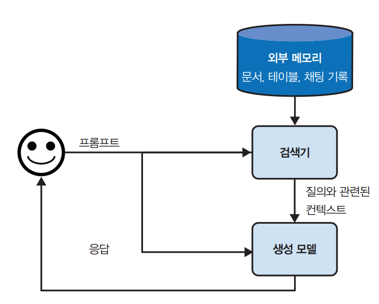  
  
원래 RAG 논문에서 루이스 등은 검색기와 생성 모델을 함께 학습시켰다. 오늘날의 RAG 시스템은 이 두 요소를 따로 학습시키는 경우가 많으며 많은 팀이 
이미 만들어진 검색기와 생성 모델을 활용해 RAG 시스템을 구축한다. 그러나 RAG 시스템 전체를 처음부터 끝까지 파인튜닝하면 성능이 훨씬 좋아질 수 있다.  
  
RAG 시스템의 성공은 검색기의 품질에 달려 있다. 검색기에는 색인화(indexing)와 질의(query)라는 두 가지 주요 기능이 있다. 색인화는 나중에 빠르게 
검색할 수 있도록 데이터를 처리하는 작업이다. 관련 데이터를 검색하기 위해 시스템에 요청을 전송하는 과정을 질의라고 한다. 데이터를 어떻게 색인화할지는 
나중에 어떻게 검색하고 싶은지에 따라 달라진다.  
  
이제 작동 방식에 대한 예시를 살펴보자. 단순화를 위해 외부 메모리가 회사의 메모, 계약서, 회의록 같은 문서 데이터베이스라고 가정해 보자. 문서는 10개의 
토큰이나 100만 개의 토큰일 수 있으므로 문서 전체를 그냥 검색하면 컨텍스트가 지나치게 길어질 수 있다. 이를 방지하기 위해 각 문서를 더 관리하기 쉬운 
청크(chunk)로 분할할 수 있다. 지금은 모든 문서가 다루기 쉬운 청크로 분할되었다고 가정하자. 각 질의의 목표는 가장 관련성 높은 데이터 청크를 검색하는 
것이다. 이렇게 찾아낸 데이터 청크를 사용자 프롬프트와 합치기 위해서 약간의 후처리 작업이 필요하다. 이렇게 만들어진 최종 프롬프트가 생성 모델에 입력된다.  
  
# **검색 알고리즘**  
검색은 RAG와 함께 등장한 개념이 아니다. 정보 검색은 100년이 넘은 오래된 개념이다. 이는 검색 엔진, 추천 시스템, 로그 분석 등의 근간이 되었다. 전통적인 
검색 시스템을 위해 개발된 많은 검색 알고리즘은 RAG에도 사용될 수 있다.  
  
핵심적으로 검색은 주어진 질의에 대한 문서들의 관련성을 기준으로 순위를 매기는 방식으로 작동한다. 따라서 검색 알고리즘은 관련성 점수를 계산하는 방법에 
따라 달라진다.  
  
- 희소와 밀집 검색  
일반 문헌에서는 보통 검색 알고리즘을 희소(sparse)와 밀집(dense)이라는 범주로 나누지만 여기서는 용어 기반과 임베딩 기반이라는 분류법을 선택했다.  
  
희소 검색기는 데이터를 희소 벡터를 사용해 표현한다. 희소 벡터란 대부분의 값이 0인 벡터를 의미한다. 용어 기반 검색은 희소 방식으로 분류되는데 
이는 각 용어가 원-핫 벡터(하나의 위치만 1이고 나머지는 모두 0인 벡터)로 표현될 수 있기 때문이다. 벡터의 크기는 어휘 길이와 같으며 1의 값은 해당 
용어가 어휘에서 차지하는 색인에 위치한다.  
  
간단한 사전 {"food": 0, "banana": 1, "slug": 2}가 있다면 "food", "banana", "slug"의 원-핫 벡터는 각각 [1, 0, 0], [0, 1, 0], [0, 0, 1]
이다.  
  
밀집 검색기는 데이터를 밀집 벡터를 사용해 표현한다. 밀집 벡터란 대부분의 값이 0이 아닌 벡터를 의미한다. 임베딩 기반 검색은 일반적으로 밀집 방식으로 
분류되는데 임베딩이 대체로 값이 꽉 찬 밀집 벡터이기 때문이다. 하지만 희소한 형태의 임베딩도 있다. 예를 들어 SPLADE: Sparse Lexical and Expansion 
Model For First Stage Ranking를 살펴보면 BERT가 생성한 임베딩을 활용하지만 정규화를 통해 대부분의 임베딩 값을 0으로 만든다. 이런 희소성은 
임베딩 연산을 더 효율적으로 만든다.  
  
희소와 밀집 분류법을 따르면 SPLADE가 용어 기반 알고리즘과 같은 범주에 들어가게 된다. 하지만 SPLADE의 작동 방식과 장단점은 용어 기반 검색보다 밀집 
임베딩 검색과 훨씬 더 비슷하다. 따라서 용어 기반과 임베딩 기반으로 나누는 분류법을 사용하면 이런 오분류를 피할 수 있다.  
  
# **용어 기반 검색**  
질의가 주어지면 관련 문서를 찾는 가장 간단한 방법은 키워드를 사용하는 것이다. 이런 접근 방식을 어휘적 검색(lexical retrieval)이라고 부르기도 한다. 
예를 들어 "AI 엔지니어링"이라는 질의가 주어지면 모델은 "AI 엔지니어링"을 포함하는 모든 문서를 검색한다. 그러나 이 접근 방식에는 두 가지 문제가 있다.  
  
- 예상보다 많은 문서에서 원하는 용어가 나타날 수 있는데 모델이 모든 문서를 컨텍스트로 추가할 만큼 충분한 공간을 갖지 못할 수도 있다. 그래서 하나의 
해결책은 해당 용어가 자주 나오는 문서들만 선택하는 것이다. 어떤 용어가 문서에 많이 등장할수록 그 문서가 해당 용어와 더 관련이 있다고 가정한다. 
용어가 문서에 등장하는 횟수를 용어 빈도수(term frequency, TF)라고 한다.  
  
- 프롬프트가 길고 다양한 용어들을 포함할 수 있다. 이 중 어떤 용어는 다른 것들보다 훨씬 중요하다. 예를 들어 "집에서 쉽게 요리할 수 있는 베트남 음식 
레시피"라는 프롬프트에는 '집에서', '쉽게', '만들', '수', '있는', '베트남', '음식', '레시피'와 같은 여덟 가지 용어가 포함되어 있다. 이 중에서 
'베트남'과 '레시피' 같은 정보가 풍부한 핵심 용어에 집중하고 싶고 '수'나 '있는' 같은 일반적인 용어는 중요하지 않다. 따라서 중요한 용어를 효과적으로 
식별할 방법이 필요하다. 직관적으로 생각해 보면 많은 문서에 흔하게 등장하는 용어일수록 실제로는 별로 유용한 정보를 담고 있지 않는 경우가 많다. 
'수'나 '있는' 같은 단어들은 거의 모든 문서에 나오기 떄문에 특별한 의미를 주지 않는다. 그래서 용어의 중요도는 그 용어가 나타나는 문서의 수가 
적을수록 높아진다. 이런 개념을 측정하는 지표를 역문서 빈도(Inverse document frequency, IDF)라고 한다. 용어의 IDF를 구하려면 전체 문서 수를 
그 용어가 포함된 문서 수로 나눈다. 예를 들어 총 10개의 문서 중 5개의 특정 용어가 포함되어 있다면 그 용어의 IDF는 10/5 = 2가 된다. IDF 값이 
클수록 그 용어는 더 중요하다고 볼 수 있다.  
  
TF-IDF는 이 두 지표인 용어 빈도(TF)와 역문서 빈도(IDF)를 결합한 알고리즘이다. 수학적으로 질의 Q에 대한 문서 D의 TF-IDF 점수는 다음과 같이 계산된다.  
  
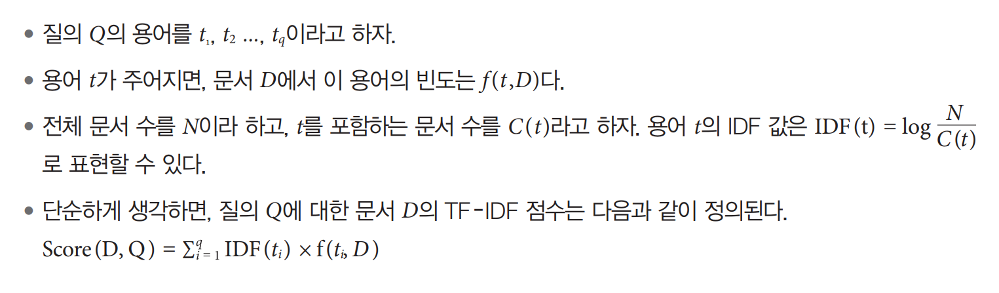  
  
자주 사용되는 두 가지 용어 기반 솔루션은 엘라스틱서치와 BM25가 있다. 루씬을 기반으로 만들어진 엘라스틱서치는 역색인(inverted index)이라는 데이터 
구조를 활용한다. 이는 용어를 문서로 매핑하는 사전이다. 따라서 이 사전 덕분에 어떤 용어가 주어졌을 떄 관련 문서들을 빠르게 찾을 수 있다. 또한 이 색인은 
용어 빈도나 해당 용어를 포함한 문서의 개수인 문서 같은 추가 정보도 저장할 수 있다. 이런 정보는 TF-IDF 점수를 계산할 떄 유용하게 쓰인다. 아래 표에서 
역색인의 예시를 확인할 수 있다.  
  
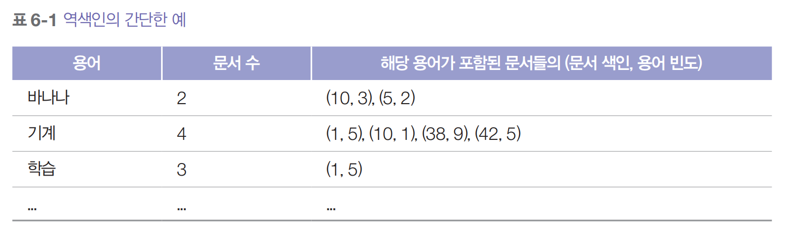  
  
오카피 BM25는 베스트 매칭 알고리즘의 25번째 세대로 1980년대 로버트슨 등이 개발했다. 이는 TF-IDF를 개선한 점수 계산 방식이다. 단순한 TF-IDF와 
비교해 BM25는 문서 길이를 고려해 용어 빈도 점수를 정규화한다. 긴 문서일수록 특정 용어를 포함할 가능성이 높고 용어 빈도 값도 자연히 높아지기 떄문이다.  
  
BM25와 그 변형들(BM25+, BM25F)은 지금도 산업계에서 널리 사용되며 임베딩 기반 검색 같은 더 현대적이고 정교한 검색 알고리즘과 비교할 때 중요한 기준점이 
된다.  
  
앞서 넘어간 과정 중 하나는 토큰화로 질의를 개별 용어로 나누는 과정이다. 가장 간단한 방법은 질의를 여러 단어로 나누어 각각을 별도의 용어로 취급하는 
것이다. 하지만 이런 방식은 여러 단어로 이루어진 용어가 개별 단어로 분리되면서 본래의 의미가 사라질 수 있다. 예를 들어 핫도그(hotdog)는 핫(hot)
과 도그(dog)로 나눠지게 되는데 이렇게 되면 둘 다 원래 용어의 의미를 담지 못한다. 이 문제를 해결하기 위한 한 가지 방법은 함께 자주 등장하는 n-gram을 
하나의 용어로 취급하는 것이다. 만약 핫도그라는 bigram이 자주 등장한다면 이를 하나의 용어로 취급하는 식이다.  
  
또한 모든 문자를 소문자로 바꾸고 구두점을 없애고 'the', 'and', 'is' 같은 불용어를 제거하고 싶을 수도 있다. 용어 기반 검색 솔루션은 이런 작업들을 
자동을 ㅗ처리해 주는 경우가 많다. NLTK(자연어 툴킷), spaCy, 스탠퍼드의 CoreNLP 같은 전통적인 NLP 패키지들도 토큰화 기능을 제공한다.  
  
질의와 n-gram 중복을 가지고 문서를 검색할 수 있으며 이 방법은 질와 문서의 길이가 비슷할 떄 가장 잘 작동한다. 만약 문서가 질의보다 훨씬 길다면 
질의의 n-gram이 포함될 가능성이 커져서 많은 문서가 비슷하게 높은 중복 점수를 받게 된다. 이 떄문에 정말로 관련 있는 문서와 그렇지 않은 문서를 구분하기 
어려워진다.  
  
# **임베딩 기반 검색**  
용어 기반 검색은 의미가 아닌 단어의 형태만 가지고 관련성을 계산한다. 하지만 텍스트의 겉모습이 그 의미를 제대로 반영하지 못할 떄가 많다. 이로 인해 
사용자의 의도와 무관한 문서가 반환될 수 있다. 예를 들어 '트랜스포머 아키텍처'를 검색하면 AI 모델이 아닌 전기 장치나 영화 트랜스포머에 관한 문서가 
반환될 수 있다. 반면에 임베딩 기반 검색기는 문서의 의미가 질의와 얼마나 가까운지를 기준으로 순위를 매긴다. 이런 방식은 의미 기반 검색(semantic retrieval)
이라고도 한다.  
  
임베딩 기반 검색에서 색인화는 하는 일이 하나 더 있다. 원본 데이터 청크를 임베딩으로 변환하는 것이다. 이렇게 만들어진 임베딩을 저장하는 데이터베이스를 
벡터 데이터베이스라고 부른다. 아래 그림에서 볼 수 있듯이 질의 과정은 두 단계로 이루어진다.  
  
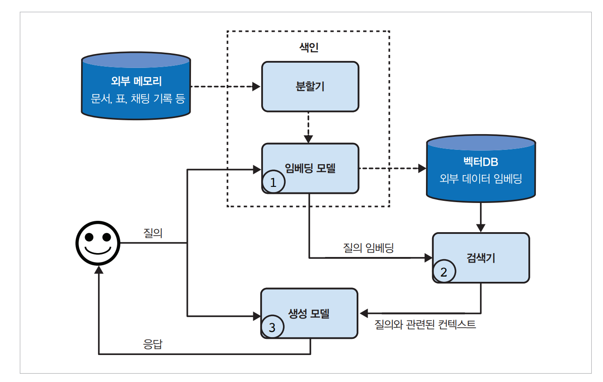  
  
1. 임베딩 모델: 색인화에 사용된 것과 동일한 임베딩 모델을 사용해 질의를 임베딩으로 변환한다.  
2. 검색기: 질의 임베딩과 가장 가까운 k개의 데이터 청크를 가져온다. k값은 활용 사례, 생성 모델, 그리고 질의에 따라 달라진다.  
  
여기서 보여주는 임베딩 기반 검색 과정은 간소화된 것이다. 실제 의미 기반 검색 시스템에는 검색된 후보들의 순위를 다시 매기는 재순위 모듈이나 지연 
시간을 줄이기 위한 캐시 같은 다른 구성 요소들도 포함될 수 있다.  
  
임베딩은 원본 데이터의 중요한 특성을 보존하는 것을 목표로 하는 벡터다. 임베딩 모델이 제대로 작동하지 않으면 임베딩 기반 검색도 당연히 제대로 작동하지 
않는다.  
  
임베딩 기반 검색에서는 벡터 데이터베이스라는 새로운 구성 요소가 등장한다. 벡터 데이터베이스는 말 그대로 벡터를 저장하는 공간이다. 그러나 단순히 
벡터를 저장하는 것은 쉬운 일이고 진짜 어려운 부분은 벡터 검색이다. 질의가 임베딩으로 변환되면 벡터 데이터베이스는 이 질의 벡터와 매우 유사한 벡터들을 
데이터베이스에서 찾아내야 한다. 그래서 벡터들은 빠르고 효율적인 검색이 가능한 방식으로 색인화되고 저장되어야 한다.  
  
생성형 AI 애플리케이션이 사용하는 다른 많은 기술과 마찬가지로 백터 검색 역시 생성형 AI에만 사용되는 것은 아니다. 벡터 검색은 임베딩을 사용하는 
모든 애플리케이션에서 널리 사용된다. 예를 들어 검색, 추천 시스템, 데이터 체계화, 정보 검색, 클러스터링, 사기 탐지 등 다양한 영역에서 활용된다.  
  
벡터 검색은 보통 최근접 이웃 검색 문제로 접근한다. 예를 들어 주어진 질의에 대해 k개의 가장 가까운 벡터를 찾는 것이다. 가장 기본적인 방법은 k-최근접 
이웃(k-NN) 알고리즘으로 다음과 같이 작동한다.  
  
1. 질의 임베딩과 데이터베이스의 모든 벡터 간의 유사도 점수를 코사인 유사도와 같은 지표를 사용해 계산한다.  
2. 모든 벡터를 유사도 점수에 따라 순위를 매긴다.  
3. 높은 유사도 점수를 가진 상위 k개의 벡터를 반환한다.  
  
이 단순한 방법은 결과가 정확하다는 것을 보장하지만 계산이 많이 필요하고 느리다. 따라서 작은 데이터셋에만 사용해야 한다.  
  
이런 이유로 큰 데이터셋에서는 보통 근사 최근접 이웃(ANN) 알고리즘으로 벡터 검색을 수행한다. 벡터 검색이 매우 중요하기 떄문에 많은 알고리즘과 
라이브러리가 개발되었다. 대표적인 벡터 검색 라이브러리로는 FAISS(Facebook AI Similarity Search), 구글의 ScaNN(scalable nearest neighbors), 
스포티파이의 Annoy, 그리고 Hnswlib등이 있다.  
  
대부분의 애플리케이션 개발자는 벡터 검색을 직접 구현하지 않을 것이므로 다양한 접근법에 대한 간단한 개요만 알아본다. 이 내용은 솔루션을 평가할 떄 
도움이 될 수 있다.  
  
보통 벡터 데이터베이스는 벡터를 버킷, 트리 또는 그래프로 구성한다. 벡터 검색 알고리즘은 각각 다른 휴리스틱을 사용해 비슷한 벡터들이 저장 공간에서 
서로 가까이 위치하도록 만든다. 벡터는 또한 양자화(정밀도를 낮춤)하거나 희소하게 만들어 연산에 필요한 컴퓨팅 자원을 정략하기도 한다. 다음은 벡터 검색 
알고리즘들이다.  
  
- 지역 민감 해싱(LSH)  
LSH(locality-sensitive hashing)는 벡터뿐만 아니라 다양한 데이터에 작동하는 강력하고 다재다능한 알고리즘이다. 유사한 벡터를 같은 버킷에 해싱하여 
유사도 검색 속도를 높이는 방식으로 정확도를 일부 희생하는 대신 효율설을 얻는다. 이는 FAISS와 Annoy에 구현되어 있다.  
- 계층적 탐색이 가능한 소규모 세계(HNSW)  
HNSW(hierarchical navigable small world)는 노드가 벡터를 나타내고 엣지가 유사한 벡터를 연결하는 다중 레이어 그래프를 구성한다. 검색 시에는 
이 그래프 엣지를 따라 이동하며 최근접 이웃을 찾는다. 개발자들이 오픈 소스로 구현했으며 이는 FAISS와 Milvus에도 구현되어 있다.  
- 제품 양자화  
제품 양자화(product quantization)는 각 벡터를 여러 하위 벡터로 분해하여 훨씬 단순한 저차원 벡터로 표현하는 방식이다. 이렇게 변환된 저차원 
벡터를 사용하면 거리 계산을 훨씬 빠르게 수행할 수 있다. 제품 양자화는 FAISS의 핵심 구성 요소이며 대부분의 인기 있는 벡터 검색 라이브러리에서 지원된다.  
- 역파일 색인(IVF)  
IVF(inverted file index)는 K-평균 클러스터링을 사용해 유사한 벡터를 같은 클러스터로 묶는다. 데이터베이스의 벡터 수에 따라 평균적으로 각 클러스터에 
100에서 10000개의 벡터가 있도록 클러스터 수를 설정하는 것이 일반적이다. 질의가 들어오면 IVF는 질의 임베딩과 가장 가까운 클러스터 중심을 찾고 
해당 클러스터에 속한 벡터들이 후보 이웃이 된다. 제품 양자화와 함께 IVF는 FAISS의 근간을 형성한다.  
- 근사 최근접 이웃 탐색(Annoy)  
Annoy(approximate nearest neighbors oh yeah)는 트리 기반 접근 방식이다. 여러 이진 트리르 구축하여 벡터를 클러스터로 나누는데 이때 무작위로 
그은 선을 기준으로 벡터를 두 그룹으로 나누는 과정을 반복한다. 검색할 때는 이런 트리를 순회하여 후보 이웃을 수집한다. 스포티파이는 이 구현체를 오픈 
소스로 공개했다.  
  
이 외에도 마이크로소프트의 공간 분할 트리 및 그래프(space partition tree and graph, SPTAG)와 근사 최근접 이웃을 위한 빠른 라이브러리(fast 
library for approximate nearest neighbors, FLANN) 같은 다른 알고리즘들도 있다.  
  
벡터 데이터베이스는 RAG가 주목받으면서 새롭게 등장했지만 사실 벡터를 저장할 수 있는 모든 데이터베이스를 벡터 데이터베이스라고 부를 수 있다. 전통적인 
데이터베이스들도 이미 벡터 저장과 벡터 검색 기능을 추가했거나 곧 지원할 예정이다.  
  
# **검색 알고리즘 비교**  
검색은 역사가 긴 분야이므로 이미 검증된 여러 솔루션을 활용해 용어 기반 검색과 임베딩 기반 검색을 비교적 쉽게 시작할 수 있다. 각 접근 방식의 장단점은 
다음과 같다.  
  
용어 기반 검색은 색인화와 질의 모두에서 일반적으로 임베딩 기반 검색보다 훨씬 빠르다. 용어 추출은 임베딩 생성보다 빠르고 용어에서 그 용어를 포함하는 문서로의 
매핑은 최근접 이웃 검색보다 계산 비용이 적을 수 있다.  
  
또한 용어 기반 검색은 별도의 설정 없이도 잘 잗공한다. 엘라스틱서치와 BM25 같은 솔루션들은 많은 검색 및 정보 검색 애플리케이션을 성공적으로 지원해 
왔다. 그러나 이런 단순함은 성능 향상을 위해 조정할 수 있는 구성 요소가 적다는 것을 의미하기도 한다.  
  
반면에 임베딩 기반 검색은 시간이 지나면서 상당히 개선되어 용어 기반 검색보다 더 좋은 성능을 낼 수 있다. 임베딩 모델과 검색기를 각각 따로 파인튜닝하거나 
둘을 함꼐 파인튜닝하거나 아니면 생성 모델까지 포함해 전체적으로 파인튜닝할 수 있다. 그러나 데이터를 임베딩으로 변환하면 EADDRNOTAVAIL(99) 같은 
특정 오류 코드나 제품 이름과 같은 키워드가 희석되어 나중에 검색하기 어려워질 수 있다. 이런 한계는 용어 기반 검색과 임베딩 기반 검색의 결합으로 해결할 
수 있다.  
  
검색기의 품질은 검색된느 데이터의 품질로 평가할 수 있다. RAG 평가 프레임워크에서 주로 사용되는 두 가지 지표는 컨텍스트 정밀도와 컨텍스트 재현율이다. 
간단하게 정밀도와 재현율이라고도 하며 컨텍스트 정밀도는 컨텍스트 관련성(context relevance)이라고도 부른다.  
  
- 컨텍스트 정밀도(context precision): 검색된 모든 문서 중에서 실제로 질의와 관련된 문서의 비율은 얼마인가?  
- 컨텍스트 재현율(context recall): 질의와 관련된 모든 문서 중에서 실제로 검색된 문서의 비율은 얼마인가?  
  
이런 지표를 개선하기 위해 테스트용 질의 목록과 각 질의에 해당하는 문서 집합으로 평가 세트를 구성한다. 각 테스트 질의에 대해 테스트 문서가 관련 있는지 
없는지 주석을 단다. 이 주석은 사람이나 AI 평가자가 달 수 있다. 그런 다음 이 평가 세트에서 검색기의 정밀도와 재현율 점수를 계산한다.  
  
운영 환경에서는 일부 RAG 프레임워크가 컨텍스트 정밀도만 지원하고 컨텍스트 재현율은 지원하지 않는 경우가 많다. 그래서 특정 질의에 대한 컨텍스트 
재현율을 계산하려면 데이터베이스의 모든 문서와 그 질의 사이의 관련성 여부를 주석으로 달아야 한다. 컨텍스트 정밀도는 이보다 더 간단히 계산할 수 있다. 
검색된 문서만 질의와 비교하면 되고 이는 AI 평가자가 수행할 수 있다.  
  
만약 검색된 문서의 순위가 중요할 떄는, 예를 들어 더 관련성 높은 문서가 상위에 나와야 한다면 정규화된 할인 누적 이득(normalized discounted cumulative gain, NDCG), 
평균 정밀도(mean average precision, MAP), 평균 역순위 (mean reciprocal rank, MRR), 같은 지표를 사용할 수 있다.  
  
의미 기반 검색에서는 임베딩 자체의 품질도 평가해야 한다. 임베딩은 독립적으로 평가할 수 있는데 비슷한 문서들이 벡터 공간에서 더 가깝게 위치한다면 좋은 
임베딩으로 본다. 또한 임베딩은 특정 작업에 얼마나 효과적인지로도 평가된다. MTEB 벤치마크는 검색, 분류, 클러스터링 등 다양한 작업에서 임베딩의 성능을 
평가한다.  
  
검색기의 품질은 전체 RAG 시스템 컨텍스트에서도 평가해야 한다. 결국 검색기는 시스템이 고품질 응답을 생성하는 데 도움이 된다면 좋은 것이다.  
  
의미 기반 검색 시스템의 성능 개선이 추구할 가치가 있는지는 특히 질의 단계에서 비용과 지연 시간을 얼마나 중요하게 여기느냐에 달려 있다. RAG의 지연 
시간은 주로 출력 생성, 특히 긴 출력을 만들 때 발생하므로 질의 임베딩 생성과 벡터 검색에 따른 추가 지연은 전체 RAG 지연에 비하면 미미할 수 있다. 
그렇더라도 이 추가 지연은 사용자 경험에 영향을 줄 수 있다.  
  
또 하나 고려할 사항은 비용이다. 임베딩을 생성하는 데는 비용이 든다. 특히 데이터가 자주 변경되어 임베딩을 자주 다시 만들어야 한다면 큰 문제가 될 
수 있다. 매일 1억 개 문서의 임베딩을 새로 만들어야 한다고 상상해 보자. 또한 어떤 벡터 데이터베이스를 쓰느냐에 따라 벡터 저장과 검색 질의 비용에 
많은 차이가 있을 수 있다. 기업이 벡터 데이터베이스에 쓰는 비용이 모델 API 비용의 5분의 1, 심지어 절반에 이르는 경우도 흔하다.  
  
아래 표는 용어 기반 검색과 임베딩 기반 검색을 비교해서 보여준다.  
  
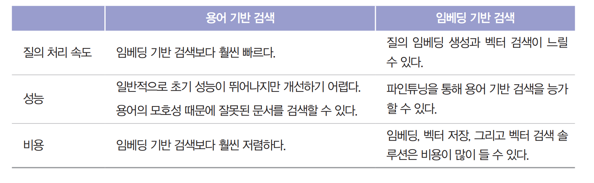  
  
검색 시스템에서는 색인화와 질의 사이에 적절한 균형이 중요하다. 색인이 더 상세할수록 검색 과정은 더 정확해지지만 색인화 과정은 더 느려지고 메모리가 
더 많이 필요하다. 잠재 고객의 색인을 구축한다고 상상해 보자. 더 많은 세부 정보(이름, 회사, 이메일, 전화번호, 관심사)를 추가하면 관련 있는 사람을 
찾기 쉬워지지만 구축 시간이 오래 걸리고 저장 공간도 더 많이 차지한다.  
  
일반적으로 HNSW 같은 상세한 색인은 높은 정확도와 빠른 질의 시간을 제공하지만 구축하는 데 상당한 시간과 메모리가 필요하다. 반면에 LSH 같은 단순한 
색인은 생성하는 데 더 빠르고 메모리가 적게 들 수 있지만 질의 속도가 느리고 정확도도 떨어진다.  
  
ANN-벤치마크 웹사이트는 색인화와 질의의 균형을 고려해 네 가지 주요 지표로 여러 데이터셋에서 다양한 ANN 알고리즘을 비교한다. 지표들은 다음과 같다.  
  
- 재현율  
알고리즘이 찾은 최근접 이웃의 비율  
- 초당 질의 수(QPS)  
알고리즘이 초당 처리할 수 있는 질의 수, 이는 트래픽이 많은 애플리케이션에서 중요하다.  
- 구축 시간  
색인을 구축하는 데 필요한 시간. 이 지표는 특히 색인을 자주 업데이트해야 하는 경우(예: 데이터가 변경되는 경우) 중요하다.  
- 색인 크기  
알고리즘이 생성한 색인의 크기로 확장성과 저장 공간 요구사항을 평가하는 데 중요하다.  
  
또한 정보검색 벤치마킹(BEIR)은 검색 평가를 위한 도구로 14개의 일반적인 검색 벤치마크를 지원한다.  
  
요약하자면 RAG 시스템의 품질은 구성 요소와 전체 시스템 모두에서 평가해야 한다. 이를 위해 다음과 같은 작업을 수행해야 한다.  
  
1. 검색 품질을 평가한다.  
2. 최종 RAG 출력 결과를 평가한다.  
3. 임베딩 기반 검색을 사용한다면 임베딩 품질을 평가한다.  
  
# **검색 알고리즘 결합하기**  
검색 알고리즘마다 뚜렷한 장점을 가지고 있기 떄문에 운영 환경의 검색 시스템은 보통 여러 접근 방법을 함께 결합해 사용한다. 용어 기반 검색과 임베딩 기반 
검색을 결합하는 것을 하이브리드 검색이라고 한다.  
  
서로 다른 알고리즘은 순차적으로 사용할 수 있다. 먼저 용어 기반 시스템처럼 비용이 적게 들지만 정확도가 낮은 검색기로 후보군을 추려내고 그 다음 k-최근접 
이웃과 같이 더 정확하지만 비용이 더 많이 드는 방식으로 이 후보 중에서 최상의 결과를 찾는다. 이 두 번째 단계를 재순위화(reranking)라고도 한다.  
  
예를 들어 프랜스포머라는 용어를 검색하면 전기 장치, 신경망 아키텍처, 영화에 관한 것인지와 상관없이 프랜스포머라는 단어를 포함하는 모든 문서를 가져올 
수 있다. 그런 다음 벡터 검색을 사용해 이 문서들 중에서 실제로 트랜스포머 질의와 관련된 문서를 찾는다. 또 다른 예로 "X 제품의 매출을 가장 많이 
올린 사람은 누구인가?"라는 질의를 생각해 보자. 먼저 키워드 X를 사용해 X와 관련된 모든 문서를 가져온 다음 벡터 검색으로 "매출을 가장 많이 올린 
사람은 누구인가?"라는 질의에 답할 수 있는 관련 컨텍스트를 찾아낸다.  
  
또한 서로 다른 알고리즘을 앙상블 기법으로 결합할 수도 있다. 검색기는 질의에 대한 관련성 점수에 따라 문서의 순위를 매기는 방식으로 작동한다는 점을 
기억하자. 여러 검색기를 동시에 사용해 후보를 가져온 다음 이 다양한 순위들을 하나로 결합해 최종 순위를 생성할 수 있다.  
  
서로 다른 순위를 결합하는 알고리즘을 역순위 퓨전(reciprocal rank fusion, RRF)이라고 한다. 이 방식은 검색기가 매긴 순위에 따라 각 문서에 점수를 
부여한다. 직관적으로 설명하면 1위 문서의 점수는 1/1 = 1 이고 2위 문서의 점수는 1/2 = 0.5다. 순위가 높을수록 점수가 높아진다.  
  
문서의 최종 점수는 모든 검색기에서 받은 점수의 합이다. 한 문서가 어떤 검색기에서는 1위, 다른 검색기에서는 2위를 차지했다면 그 점수는 1 + 0.5 = 1.5가 
된다. 이 예시는 RRF를 단순화한 것이지만 기본 원리를 보여준다. 문서 D에 대한 실제 공식은 다음과 같이 더 복잡하다.  
  
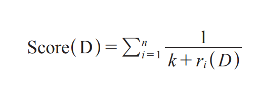  
  
- n은 순위 목록의 수다. 각 순위 목록은 검색기에 의해 생성된다.  
- ri(D)는 검색기 i에 의한 문서의 순위다.  
- k는 0으로 나누는 것을 방지하고 낮은 순위 문서의 영향력을 제어하기 위한 상수다. k의 일반적인 값은 60이다.  
  
# **검색 최적화**  
# **청킹 전략**  
데이터를 어떻게 색인화할지는 나중에 어떻게 검색할 것인지에 따라 결정된다. 사용하는 청킹 전략이 검색 시스템의 성능에 상당한 영향을 미칠 수 있기 
떄문에 이는 중요한 고려 사항이다.  
  
가장 단순한 전략은 특정 단위를 기준으로 문서를 동일한 길이의 청크로 나누는 것이다. 주로 문자, 단어, 문장, 단락 같은 단위를 사용한다. 예를 들어 
각 문서를 2048자 또는 512 단어 청크로 나눌 수 있다. 또한 각 청크가 고정된 수의 문장(예: 20문장)을 포함하게 하거나 각 단락을 하나의 청크로 삼는 
방식으로 문서를 분할할 수도 있다.  
  
또한 각 청크가 최대 청크 크기 안에 들어올 떄까지 점점 작은 단위를 사용해 문서를 재귀적으로 분할할 수도 있다. 예를 들어 문서를 먼저 여러 절로 나누고 
절이 너무 길면 단락으로, 단락이 여진히 길면 문장으로 나누는 식이다. 이렇게 하면 관련 내용이 임의로 끊길 가능성이 줄어든다.  
  
특정 문서 유형은 창의적인 청킹 전략을 적용할 수도 있다. 예를 들어 다양한 프로그래밍 언어용으로 특별히 개발된 분할기가 있다. Q&A 문서는 질의나 응답 
쌍으로 분할할 수 있으며 각 쌍이 하나의 청크가 된다. 또한 중국어 텍스트와 같이 영어 텍스트와 문장이 많이 다른 언어는 청크를 다르게 분할해야 한다.  
  
문서를 겹침 없이 청크로 나누면 중요한 컨텍스트에서 끊겨 중요한 정보가 손실될 수 있다. 'I left my wife a note'라는 문장이 'I left my wife'와 
'a note'로 분할되면 이 두 청크 모두 원래 문장의 핵심 정보를 전달하지 못한다. 청크 간의 겹침은 중요한 경계 정보가 최소한 하나의 청크에 포함되도록 
보장할 수 있다. 청크 크기를 2048자로 설정한다면 겹침 크기를 20자로 설정할 수 있다. 그리고 청크 크기는 생성 모델의 최대 컨텍스트 길이를 넘지 않아야 
한다. 임베딩 기반 접근법을 사용할 때는 청크 크기가 임베딩 모델의 컨텍스트 제한을 넘으면 안 된다.  
  
생성 모델의 토크나이저가 나누는 토큰을 기준으로 문서를 청킹하는 방법도 있다. 라마 3를 생성 모델로 사용하려 한다고 가정해 보자. 먼저 라마 3의 토크나이저로 
문서를 토큰화한다. 그런 다음 이 토큰들을 경계로 삼아 문서를 청크로 나눌 수 있다. 토큰 단위로 청킹하면 이후 모델과 작업이 더 수월해진다. 다만 이 
접근 방식의 단점은 다른 토크나이저를 사용하는 생성 모델로 바꾸면 데이터를 처음부터 다시 색인화해야 한다는 점이다.  
  
어떤 전략을 선택하든 청크 크기가 중요하다. 청크 크기가 작을수록 더 다양한 정보를 담을 수 있다. 청크가 작으면 모델의 컨텍스트에 더 많은 청크를 넣을 
수 있기 떄문이다. 청크 크기를 절반으로 줄이면 두 배 더 많은 청크를 담을 수 있고 이는 모델에 더 넓은 범위의 정보를 제공해 더 나은 응답을 생성하는 데 
도움이 된다.  
  
하지만 청크 크기가 너무 작으면 중요한 정보가 손실될 수 있다. 문서 전체에 주제 X에 관한 중요 정보가 포함되어 있지만 X라는 단어는 문서 앞부분에만 
있다고 생각해 보자. 이 문서를 두 개의 청크로 분할하면 뒷부분은 검색되지 않을 수 있고 모델은 그 저옵를 활용하지 못하게 된다.  
  
또한 작은 청크 크기는 계산 부담도 증가시킨다. 특히 임베딩 기반 검색에서 문제가 두드러진다. 청크 크기를 절반으로 줄이면 색인화할 청크가 두 배로 
늘어나고 생성하고 저장해야 할 임베딩 벡터도 두 배가 된다. 벡터 검색 공간이 두 배로 커지면 질의 속도가 느려질 수 있다.  
  
여기서 중요한 것은 모든 상황에 적합한 청크 크기나 겹치는 크기는 없다. 어떤 설정이 가장 효과적인지는 실험을 통해 찾아내야 한다.  
  
# **재순위화**  
검색기가 생성한 초기 문서 순위는 더 정확하게 재순위될 수 있다. 재순위화는 모델의 컨텍스트에 ㅁ자추거나 입력 토큰 수를 줄이기 위해 검색된 문서 수를 
줄여야 할 떄 특히 유용하다.  
  
재순위화는 먼저 비용이 적게 들지만 정확도가 낮은 검색기가 후보를 가져오고 그 다음 더 정확하지만 비용이 많이 드는 메커니즘이 이런 후보들을 재순위화한다.  
  
문서는 시간을 기준으로 재순위될 수 있는데 이때는 최신 데이터에 더 높은 가중치를 부여한다. 이는 뉴스 수집, 이메일 채팅(예: 이메일에 대한 질의에 답할 수 있는 
챗봇), 주식 시장 분석 같은 시간에 민감한 애플리케이션에 유용하다.  
  
컨텍스트 재순위화는 항목의 정확한 위치가 덜 중요하다는 점에서 전통적인 검색 재순위화와 다르다. 일반 검색에서는 순위(예: 첫 번째 또는 다섯 번쨰)가 
중요하다. 컨텍스트 재순위화에서도 문서 순서가 모델의 처리 방식에 영향을 주기 떄문에 일정 부분 영향을 미친다. 모델은 컨텍스트의 시작과 끝에 있는 
문서를 더 잘 이해하는 경향이 있다. 하지만 문서가 포함되기만 한다면 그 순서가 미치는 영향은 검색 순위에 비해 상대적으로 덜 중요하다.  
  
# **질의 재작성**  
질의 재작성은 질의 재구성(query reformulation), 질의 정규화(query normalization), 떄로는 질의 확장(query expansion)이라고도 한다. 다음 
대화를 생각해 보자.  
  
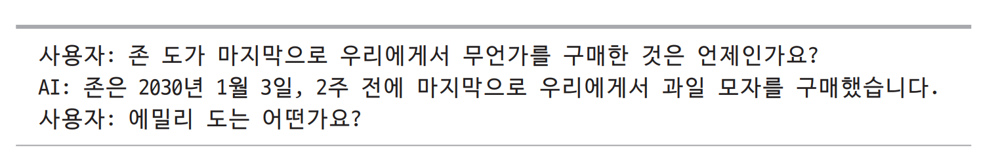  
  
마지막 질의인 "에밀리 도는 어떤가요?"는 컨텍스트를 모른다면 질의 자체가 모호하다. 이 질의를 그대로 사용해 문서를 검색하면 관련 없는 결과가 나올 
가능성이 높다. 사용자의 실제 의도를 반영하여 질의를 재작성해야 한다. 새롭게 작성한 질의는 별도의 컨텍스트 없이도 의미가 명확해야 한다. 이 경우 질의는 
"에밀리 도가 마지막으로 우리에게서 무언가를 구매한 것은 언제인가요?"로 재작성되어야 한다.  
  
질의 재작성은 RAG에만 국한된 것이 아니다. 전통적인 검색 엔진에서는 휴리스틱을 사용해 질의 재작성을 수행하는 경우가 많다. AI 애플리케이션에서는 "다음 
대화를 고려할 때 사용자가 실제로 묻고 있는 내용을 반영하도록 마지막 사용자 입력을 재작성하세요"와 같은 프롬프트를 사용해 다른 AI 모델로 질의 재작성을 
수행할 수 있다. 아래 그림은 이 프롬프트를 사용하여 챗GPT가 질의를 어떻게 재작성했는지 보여준다.  
  
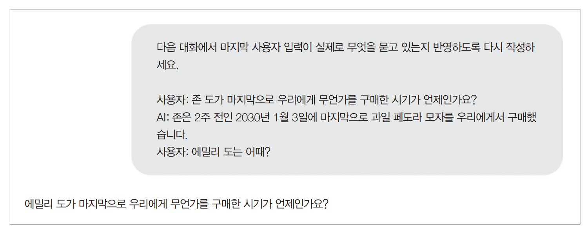  
  
질의 재작성은 신원 확인이나 다른 지식을 통합해야 하는 경우 특히 복잡해질 수 있다. 예를 들어 사용자가 "그의 아내는 어떤가요?"라고 묻는다면 먼저 
데이터베이스에서 그의 아내가 누구인지부터 알아내야 한다. 이런 정보가 없다면 재작성 모델이 이름을 무작위로 지어내 잘못된 응답을 재공하는 것보다는 이 질의에 
대한 답을 찾을 수 없다고 명확히 알려야 한다.  
  
# **컨텍스트 검색**  
컨텍스트 검색의 핵심 아이디어는 각 청크에 관련 컨텍스트를 추가해 필요한 청크를 더 쉽게 검색할 수 있게 하는 것이다. 간단한 방법은 태그나 키워드 같은 
메타데이터로 청크를 보강하는 것이다. 전자상거래의 경우 상품에 설명과 리뷰를 함께 저장할 수 있다. 이미지와 동영상은 제목이나 캡션을 통해 검색할 
수 있다.  
  
메타데이터에는 청크에서 자동으로 추출된 개체들도 포함될 수 있다. 문서에 EADDRNOTAVAIL(99) 같은 특정 오류 코드가 있다면 이를 문서의 메타데이터에 
추가해두면 문서가 임베딩으로 변환된 후에도 해당 키워드로 검색할 수 있다.  
  
또한 각 청크에 응답할 수 있는 질의들을 추가할 수도 있다. 고객 지원의 경우 각 문서에 관련 질의들을 추가할 수 있다. 예를 들어 비밀번호 재설정 방법에 
관한 문서에는 "비밀번호를 어떻게 재설정하나요?", "비밀번호를 잊어버렸어요", "로그인할 수 없어요", 심지어 "도와주세요, 계정을 찾을 수 없어요"같은 
질의들을 추가할 수 있다. 일부 팀들은 데이터가 질의-응답 형식으로 구성될 때 검색 시스템이 가장 잘 작동한다고 말했다.  
  
문서가 여러 청크로 나뉘면 일부 청크는 검색기가 그 내용을 이해하는 데 필요한 컨텍스트가 부족할 수 있다. 이를 방지하기 위해 원본 문서의 제목이나 요약 
같은 정보를 각 청크에 추가할 수 있다. 앤트로픽은 AI 모델을 사용해 청크와 원본 문서의 관계를 설명하는 숏 컨텍스트(보통 50~100 토큰)를 생성했다. 
다음은 엔트로픽이 이 목적으로 사용한 프롬프트다.  
  
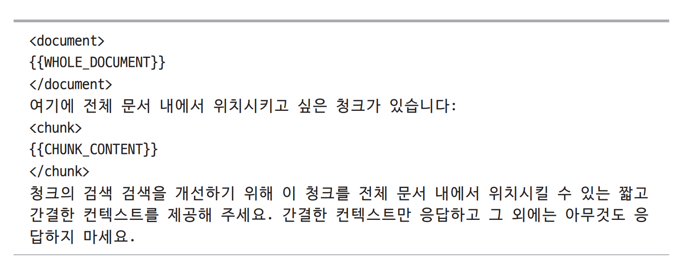  
  
각 청크에 대해 생성된 컨텍스트는 각 청크 앞에 추가되고 보강된 청크는 검색 알고리즘에 의해 색인화된다. 아래 그림은 엔트로픽이 따르는 프로세스를 시각화 
한 것이다.  
  
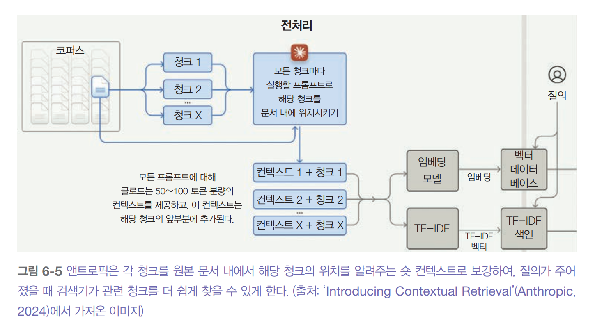  
  
## **검색 솔루션 평가하기**  
검색 솔루션을 평가할 떄 고려해야 할 주요 사항들은 다음과 같다.  
  
- 어떤 검색 방식을 지원하는가? 하이브리드 검색을 지원하는가?  
- 벡터 데이터베이스라면 어떤 임베딩 모델과 벡터 검색 알고리즘을 지원하는가?  
- 데이터 저장량과 트래픽 측면에서 얼마나 확장 가능한가? 트래픽 패턴에 적합한가?  
- 데이터를 색인화하는 데 얼마나 시간이 걸리는가? 한 번에 얼마나 많은 데이터를 대량으로 처리(추가/삭제 등) 할 수 있는가?  
- 다양한 검색 알고리즘에 대한 질의 지연 시간은 어느 정도인가?  
- 관리형 솔루션인 경우 가격 체계는 어떻게 되는가? 저장된 문서/벡터 양에 따라 가격이 책정되는지 아니면 검색 요청 횟수에 따라 책정되는가?  
  
위 목록에는 접근 권한 관리, 법규 준수, 데이터 레이어와 제어 레이어 분리 등 일반적인 기업용 솔루션이 갖추는 기능들은 포함되어 있지 않다.  
  
# **텍스트를 넘어선 RAG**  
외부 데이터 소스가 텍스트만 있지 않다. 여러 형식이 혼합된 멀티모달 데이터나 표 형태의 데이터일 수도 있다.  
  
# **멀티모달 RAG**  
생성 모델이 멀티모달 데이터를 처리할 수 있다면 그 컨텍스트는 텍스트 문서뿐만 아니라 외부 소스의 이미지, 비디오, 오디오 등도 활용할 수 있다. 설명을 
간단히 하기 위해 예시에서는 이미지를 사용하지만 다른 어떤 형식으로도 대체 가능하다. 질의가 주어지면 검색기는 관련된 텍스트와 이미지를 모두 가져온다. 
예를 들어 "픽사 영화 업에 나오는 집의 색깔은 무엇인가요?"라는 질의가 주어지면 검색기는 모델이 응답하는 데 도움이 되도록 업에 나오는 집 사진을 
찾을 수 있다.  
  
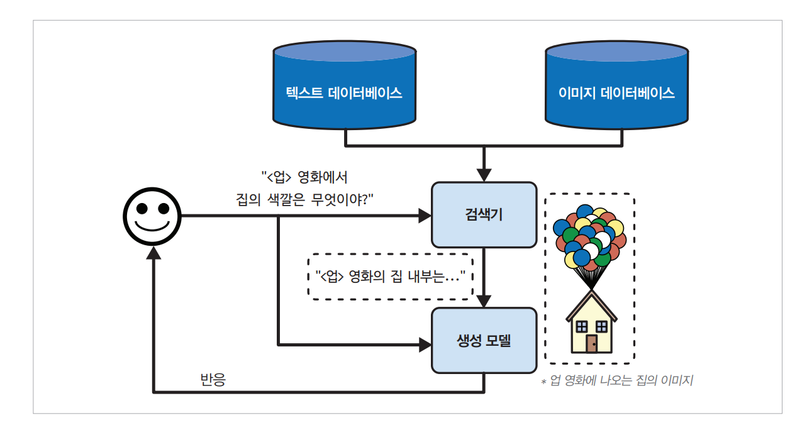  
  
이미지에 제목, 태그, 캡션 같은 메타데이터가 있다면 이 메타데이터를 사용해 검색할 수 있다. 예를 들어 이미지의 캡션이 질의와 관련 있다고 판단되면 
그 이미지가 검색 결과로 나온다.  
  
이미지 내용을 기반으로 검색하고 싶다면 이미지와 질의를 비교할 방법이 필요하다. 질의가 텍스트 형태라면 이미지와 텍스트 모두를 벡터로 변환할 수 있는 
멀티모달 임베딩 모델이 필요하다. CLIP을 멀티모달 임베딩 모델로 사용한다고 가정해 보자. 검색 과정은 다음과 같다.  
  
1. 텍스트와 이미지를 포함한 모든 데이터의 CLIP 임베딩을 생성하고 이를 벡터 데이터베이스에 저장한다.  
2. 질의가 주어지면 그에 대한 CLIP 인베딩을 생성한다.  
3. 벡터 데이터베이스에서 질의 임베딩과 가장 유사한 이미지와 텍스트를 찾는다.  
  
# **표 형식 데이터를 활용한 RAG**  
대부분의 애플리케이션은 텍스트나 이미지와 같은 비정형 데이터뿐만 아니라 표 형식 데이터도 처리한다. 많은 질의에 응답하기 위해 표에 담긴 정보가 
필요할 수 있다. 표 형식 데이터로 컨텍스트를 보강하는 과정은 일반적인 RAG 워크플로와 상당히 다르다.  
  
고양이 패션을 전문으로 하는 키티 보그라는 전자상거래 사이트에서 일한다고 상상해 보자. 상점에는 아래 표와 같이 Sales라는 주문 테이블이 있다.  
  
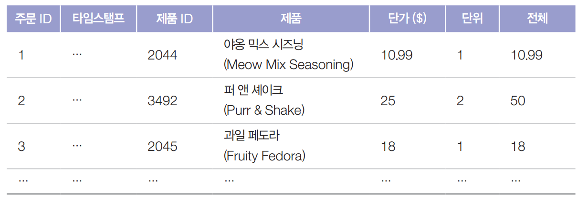  
  
"지난 7일 동안 과일 페도라가 몇 개 팔렸나요?"라는 질의에 답하기 위해 시스템은 과일 페도라와 관련된 모든 주문을 이 테이블에서 질의하고 모든 
주문에 걸친 판매 수당을 합산해야 한다. 이 테이블이 SQL로 조회 가능하다고 가정해 보자. SQL 쿼리문은 다음과 같을 것이다.  
  
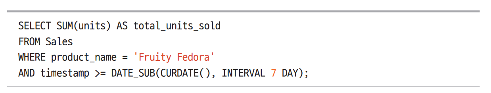  
  
이 과정은 아래 그림에서 볼 수 있듯이 다음과 같이 진행된다. 이런 흐름을 실행하려면 시스템이 SQL 쿼리를 만들고 실행할 수 있어야 한다.  
  
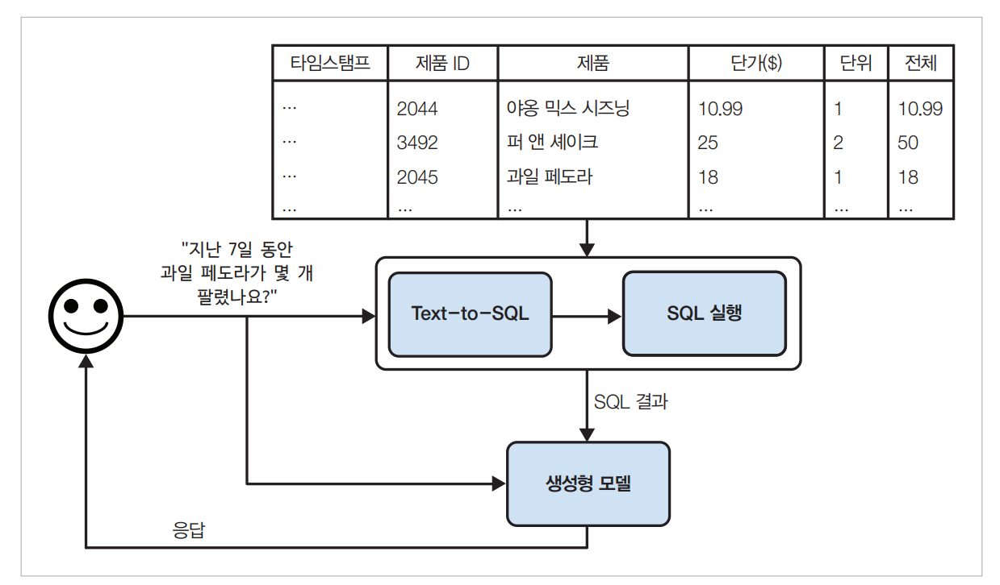  
  
- Text-to-SQL: 사용자 질의와 제공된 테이블 스키마를 기반으로 어떤 SQL 쿼리가 필요한지 결정한다. 이런 Text-to-SQL은 시맨틱 파싱의 한 예시다.  
- SQL 실행: 만들어진 SQL 쿼리를 실행한다.  
- 응답 생성: SQL 실행 결과와 사용자의 질의를 토대로 응답을 생성한다.  
  
Text-to-SQL 단계에서 사용 가능한 테이블이 너무 많아 모든 스키마를 모델 컨텍스트에 담을 수 없다면 각 질의에 어떤 테이블을 사용할지 예측하는 중간 
단계가 필요할 수 있다. Text-to-SQL은 최종 응답을 생성하는 동일한 생성 모델로 수행할 수 있고 Text-to-SQL에 특화된 별도의 모델을 사용할 수도 
있다.  
  
# **에이전트**  
많은 사람이 AI의 궁극적인 목표로 여기는 것이 바로 지능형 에이전트다. 스튜어트 러셀과 빅터 노빅이 쓴 고전 Artificial Intelligence: A Modern Approach에서는 
AI 연구 분야를 합리적 에이전트의 연구와 설계라고 정의했다.  
  
파운데이션 모델의 획기적인 능력 덕분에 이전에는 상상조차 할 수 없었던 에이전트 기반 애플리케이션의 문이 열렸다. 이런 새로운 능력 덕분에 우리의 
조수, 동료, 코치 역할을 할 자율적이고 지능적인 에이전트를 개발할 수 있게 됐다. 이들은 웹사이트 제작, 데이터 수집, 여행 계획, 시장 조사, 고객 계정 
관리, 데이터 입력 자동화, 면접 준비, 거해 협상에 이르기까지 다양한 일을 도울 수 있다. 가능성은 무한해 보이며 이런 에이전트들이 가진 잠재적 경제 
가치는 엄청나다.  
  
AI 기반 에이전트는 아직 이를 정의하고, 개발하고, 평가하기 위한 확립된 이론적 프레임워크가 없는 신생 분야다.  
  
에이전트는 새로운 작동 방식을 가지고 있는 만큼 새로운 유형의 실패도 발생한다.  
  
에이전트는 새로운 개념이지만 모델의 자기 비평, 생각의 사슬(CoT), 구조화된 출력 등의 개념들을 토대로 만들어졌다.  
  
# **에이전트 개요**  
에이전트라는 용어는 소프트웨어 에이전트, 지능형 에이전트, 사용자 에이전트, 대화형 에이전트, 강화 학습 에이전트 등 다양한 엔지니어링 분야에서 사용되어 
왔다.  
  
에이전트는 자신의 환경을 인식하고 그 환경에서 행동할 수 있는 모든 것을 말한다. 다시 말해 에이전트는 작동하는 환경과 수행할 수 있는 행동들로 정의된다.  
  
에이전트가 작동할 수 있는 환경은 그 활용 사례에 따라 정해진다. 만약 에이전트가 게임(예: 마인크래프트, 도타 등)을 하기 위해 개발됐다면 그 게임이 
환경이 된다. 인터넷에서 문서를 수집하는 에이전트라면 인터넷이 환경이다. 요리 로봇 에이전트의 경우에는 주방이 환경이 되고 자율주행 자동차 에이전트의 
환경은 도로 시스템과 인접 지역이다.  
  
AI 에이전트가 수행할 수 있는 행동 집합들은 접근할 수 있는 도구에 의해 확장된다. 우리가 일상적으로 사용하는 많은 생성형 AI 기반 애플리케이션은 비록 
단순하긴 하지만 도구를 활용할 수 있는 에이전트다. 웹일 검색하고 파이썬 코드를 실행하고 이미지를 생성할 수 있는 챗GPT도 에이전트다. RAG 시스템 역시 
에이전트며 텍스트 검색기, 이미지 검색기, SQL 실행기 등의 도구를 사용한다.  
  
에이전트의 환경과 도구들 사이에는 강한 의존성이 있다. 환경은 에이전트가 잠재적으로 사용할 수 있는 도구를 결정한다. 예를 들어 환경이 체스 게임이라면 
에이전트가 할 수 있는 행동은 체스 규칙에서 허용된 움직임으로 제한된다. 반대로 에이전트의 도구 목록은 활동할 수 있는 환경을 제한한다. 예를 들어 
로봇이 수영만 할 수 있다면 물 환경에서만 활동할 수밖에 없다.  
  
아래 그림은 GPT-4 위에 구축된 에이전트인 SWE-agent의 시각화를 보여준다.  
  
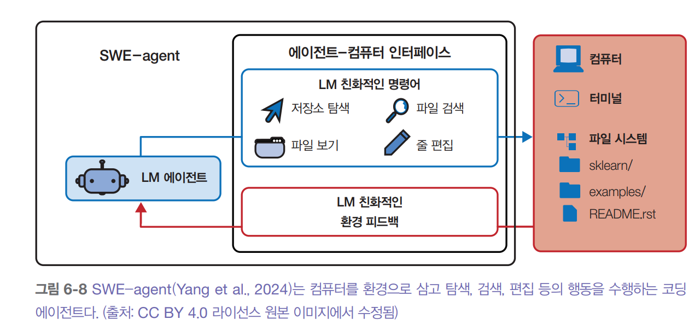  
  
이 에이전트는 터미널과 파일 시스템이 있는 컴퓨터를 환경으로 사용한다. 에이전트가 할 수 있는 행동의 집합에는 저장소 탐색, 파일 검색, 파일 보기, 
줄 편집 등이 포함된다.  
  
AI 에이전트는 주로 사용자가 입력으로 제공되는 작업을 수행하기 위해 만들어진다. AI 에이전트에서는 AI는 작업과 환경에서 받은 피드백을 포함한 정보를 
처리하는 두뇌 역할을 하며 이 작업을 달성하기 위한 행동 순서를 계획하고 작업이 완료됐는지를 판단한다.  
  
키티 보그 예시의 표 형식 데이터가 있는 RAG 시스템으로 돌아가보자. 이는 응답 생성, SQL 쿼리 생성, SQL 쿼리 실행이라는 세 가지 행동을 가진 간단한 
에이전트다. "향후 3개월 동안의 과일 페도라 판매 수익을 예측해 주세요"라는 질의가 ㅈ어지면 에이전트는 다음과 같은 순서로 행동할 수 있다.  
  
1. 이 작업을 어떻게 수행할지 추론한다. 미래 매출을 예측하려면 지난 5년간의 매출 수치가 필요하다고 판단할 수 있다. 이런 에이전트의 추론은 중간 응답으로 
나타난다.  
2. SQL 쿼리 생성 기능을 호출해 지난 5년간의 매출 수치를 가져오는 쿼리를 생성한다.  
3. SQL 쿼리 실행 기능을 호출해 이 쿼리를 실해한다.  
4. 도구의 출력 결과가 판매 예측에 어떻게 도움이 되는지 추론한다. 값이 누락되어 있어 이 수치만으로는 믿을 만한 예측을 할 수 없다고 판단할 수 있다. 
그러면 과거 마케팅 캠페인 정보도 필요하다고 결정한다.  
5. SQL 쿼리 생성 기능을 호출해 과거 마케팅 캠페인에 대한 쿼리를 생성한다.  
6. SQL 쿼리 실행 기능을 호출한다.  
7. 이 새로운 정보가 미래 매출을 예측하기에 충분하다고 추론한다. 그런 다음 예측치를 생성한다.  
8. 이 작업이 성공적으로 완료됐다고 추론한다.  
  
또한 에이전트는 두 가지 이유로 더 강력한 모델이 필요하다.  
  
- 누적되는 오류: 에이전트는 보통 작업을 수행하기 위해 여러 단계를 거쳐야 하는데 단계 수가 증가할수록 전체 정확도는 감소한다. 모델의 정확도가 단계당 
95%라면 10단계 후에는 정확도가 60%로 떨어지고 100단계 후에는 정확도가 0.6%에 불과하다.  
- 더 큰 위험성: 도구에 사용할 수 있게 되면서 에이전트는 더 영향력 있는 작업을 수행할 수 있지만 실패할 경우 더 심각한 결과를 초래할 수 있다.  
  
많은 단계가 필요한 작업은 실행하는 데 시간과 비용이 들 수 있다. 하지만 에이전트가 자율적으로 작동할 수 있다면 많은 사람의 시간을 크게 절약할 수 있어 
이런 비용을 감수할 만한 가치가 있다.  
  
주어진 환경에서 에이전트의 성공은 사용할 수 있는 도구들과 AI가 얼마나 계획을 잘 세울 수 있는지에 달려 있다.  
  
# **도구**  
시스템이 에이전트가 되기 위해 꼭 외부 도구에 접근할 필요는 없지만 외부 도구 없이는 에이전트의 능력이 제한적일 수밖에 없다. 모델(에이전트) 자체는 
보통 한 가지 행동만 수행할 수 있다. 예를 들어 LLM은 텍스트를 생성하고 이미지 생성기는 이미지를 생성한다. 이떄 외부 도구를 활용하면 에이전트의 
능력을 크게 확장할 수 있다.  
  
도구는 에이전트에게 환경을 인식하는 능력과 그 환경에 변화를 주는 능력을 부여한다. 에이전트가 환경을 인식하는 것은 읽기와 관련된 행동이며 환경에 
변화를 주는 것은 쓰기와 관련된 행동이다.  
  
에이전트가 접근할 수 있는 도구들의 집합을 도구 목록이라고 한다. 에이전트의 도구 목록은 에이전트가 할 수 있는 일을 결정하기 때문에 에이전트에게 어떤 
도구를 얼마나 제공할지 신중히 고려해야 한다. 도구가 많을수록 에이전트의 능력은 향상되지만 그만큼 이를 제대로 이해하고 효과적으로 활용하는 것이 더 
어려워진다. 최적의 도구 조합을 찾으려면 여러 실험이 필요하다.  
  
에이전트의 환경에 따라 다양한 도구를 사용할 수 있다. 고려해 볼 만한 세 가지 도구 유형은 다음과 같다. 지식 증강(예: 컨텍스트 구성), 능력 확장, 그리고 에이전트가 
환경에 직접 변화를 줄 수 있는 도구들이다.  
  
# **지식 증강**  
모델의 응답 품질을 위해 관련 컨텍스트는 매우 중요하다. 중요한 도구 유형 중 하나는 에이전트의 지식을 증강해 주는 도구들이다. 텍스트 검색기, 이미지 검색기, 
SQL 실행기 등이다. 그 외에도 내부 인물 검색, 다양한 제품 상태를 알려주는 재고 API, 슬랙 메시지 검색, 이메일 읽기 도구 등이 있다.  
  
이런 도구들 중 상당수는 조직의 비공개 프로세스와 정보로 모델을 강화한다. 하지만 도구는 모델이 인터넷과 같은 공개 정보에도 접근할 수 있게 해준다.  
  
웹 브라우징은 챗GPT 같은 챗봇에 통합된 초기의 기대작 중 하나였다. 웹 브라우징은 모델이 구식이 되는 것을 막아준다. 모델이 학습한 데이터가 오래되면 
모델은 쓸모가 떨어진다. 모델의 학습 데이터가 지난주에 끊겼다면 컨텍스트에 새 정보가 주어지지 않는 한 이번 주 정보가 필요한 질의에 답할 수 없다. 
즉 웹 브라우징 없이는 모델이 날씨, 뉴스, 예정된 행사, 주식 가격, 항공편 상태 등에 대해 알려줄 수 없다.  
  
웹 브라우징이라는 용어는 웹 브라우저뿐 아니라 검색 API, 뉴스 API, 깃허브 API, X, 링크드인, 레딧과 같은 소셜 미디어 API 등 인터넷에 접근하는 
모든 도구를 아우르는 의미로 사용한다.  
  
웹 브라우징은 에이전트가 최신 정보를 참조해 더 나은 응답을 만들고 환각을 줄이는 데 도움이 되지만 동시에 인터넷의 유해한 콘텐츠에 노출될 위험도 있다. 
따라서 인터넷 API는 신중하게 선택해야 한다.  
  
# **능력 확장**  
고려해야 할 두 번쨰 도구 유형은 AI 모델의 고유한 한계를 보완하는 도구들이다. 이것들은 모델의 성능을 향상시키는 쉬운 방법이다. 예를 들어 AI 모델은 
기본적으로 수학을 잘 못한다. 모델에게 199999를 292로 나눈 값이 무엇인지 물으면 아마 실패할 것이다. 그러나 모델이 계산기에 접근할 수 있다면 
이 계산은 아주 간단하다. 이처럼 모델을 산술 능력을 갖추도록 학습시키려고 노력하는 대신 모델에게 도구에 대한 접근 권한을 제공하는 것이 훨씬 더 효율적이다.  
  
그 밖에도 모델의 능력을 크게 향상시킬 수 있는 도구는 캘린더, 시간대 변환기, 단위 변환기(예: 파운드에서 킬로그램), 모델이 잘 다루지 못하는 언어를 
번역하는 번역기 등이 있다.  
  
더 복잡하지만 강력한 도구로는 코드 인터프리터가 있다. 모델이 코드를 이해하도록 학습시키는 대신 코드 인터프리터를 제공해 코드를 실행하고 결과를 
반환하거나 코드의 오류를 분석할 수 있게 한다. 이 기능으로 에이전트는 코딩 도우미, 데이터 분석가, 심지어 실험을 실행하고 결과를 보고하는 연구 조수 역할도 
할 수 있다. 하지만 자동 코드 실행에는 코드 주입 공격의 위험이 따른다. 사용자와 자신을 안전하게 지키려면 적절한 보안 조치가 필수적이다.  
  
외부 도구는 텍스트 전용 또는 이미지 전용 모델을 멀티모달로 만들 수 있다. 예를 들어 텍스트만 생성할 수 있는 모델이 텍스트-이미지 변환 모델을 도구로 
활용하여 텍스트와 이미지를 모두 생성할 수 있다. 텍스트 요청이 들어오면 에이전트의 AI 계획 시스템이 텍스트 생성, 이미지 생성, 또는 둘 다를 호출할지 
결정한다. 챗GPT가 텍스트와 이미지를 모두 생성할 수 있는 이유도 DALL-E를 이미지 생성기로 활용하기 떄문이다. 또한 에이전트는 코드 인터프리터를 
사용해 차트와 그래프를 생성하고 LaTeX 컴파일러를 사용해 수학 방정식을 렌더링하고 브라우저를 사용하여 HTML 코드에서 웹 페이지를 렌더링할 수 있다.  
  
마찬가지로 텍스트 입력만 처리할 수 있는 모델은 이미지 캡션 도구로 이미지를 처리하고 음성 변환 도구를 사용해 오디오를 처리할 수 있다. 광학 문자 인식
(optical character recognition, OCR) 도구로 PDF를 읽을 수도 있다.  
  
도구 사용은 단순한 프롬프팅이나 심지어 파인튜닝보다 모델의 성능을 크게 향상시킬 수 있다. 카멜레온은 13개의 도구로 보강된 GPT-4 기반 에이전트가 
여러 벤치마크에서 GPT-4 단독보다 뛰어난 성능을 보이는 것을 증명했다. 이 에이전트가 사용한 도구는 지식 검색, 질의 생성기, 이미지 캡션 생성기, 텍스트 
감지기, 빙 검색 드이 있다. 과학 질의 응답 벤치마크인 ScienceQA에서 카멜레온은 기존 발표된 최고의 퓨샷 결과보다 11.37% 향상시켰다. TabMWP
(Tabular Math Word Problems)에서는 정확도를 17% 향상시켰다.  
  
# **쓰기 행동**  
지금까지 모델이 데이터 소스에서 읽기만 할 수 있는 읽기 전용 행동에 대해 논의했다. 하지만 도구는 데이터 소스를 변경하는 쓰기 행동도 수행할 수 
있다. SQL 실행기는 테이블을 검색(읽기)할 수 있을 뿐만 아니라 테이블을 변경하거나 삭제(쓰기)할 수도 있다. 이메일 API는 이메일을 읽을 수 있고 
답장도 보낼 수 있다. 은행 API는 현재 잔액을 조회할 수 있고 더 나아가 송금 거래를 시작할 수도 있다.  
  
쓰기 행동을 통해 시스템이 더 많은 일을 할 수 있게 해준다. 잠재 고객 조사, 연락처 찾기, 이메일 초안 작성, 이메일 발송, 응답 읽기, 후속 조치, 
주문 내역 추출, 그리고 데이터베이스에 새 주문 정보 업데이트까지 고객 관리의 모든 단계를 자동화할 수 있다.  
  
그러나 AI에게 우리 삶을 자동으로 변경할 수 있는 능력을 부여하는 것은 두려운 일이다. 인턴에게 운영 환경 데이터베이스를 삭제할 권한을 주지 않는 것처럼 
신뢰할 수 없는 AI에 은행 송금을 하는 권한을 주어서는 안 된다. 시스템의 능력이 중요하지만 보안 조치에 대한 신뢰도 중요하다. 시스템이 악의적인 
사용자에 의해 조작되어 해로운 행동을 하지 않도록 철저히 방어해야 한다.  
  
자율 AI 에이전트의 위험성에 대해 이야기하면 사람들은 종종 자율주행 자동차를 언급한다(누군가 사람을 납치하기 위해 차량을 해킹). 자율주행 자동차의 예는 
물리적 실체가 있어서 더 직관적으로 와닿지만 물리적 세계에 존재하지 않는 AI 시스템도 막대한 해를 끼칠 수 있다. 주식 시장을 조작하고, 저작권을 도용하고, 
개인 정보를 침해하고, 편향을 강화하며, 거짓 정보와 선전을 퍼뜨리는 등의 행위를 할 수 있다.  
  
따라서 이 모든 우려는 타당하며 AI를 활용하려는 모든 조직은 안전과 보안 문제를 반드시 고려해야 한다. 그렇다고 해서 AI 시스템에게 실제 세계에서 행동할 
능력을 절대로 부여하면 안된다는 의미는 아니다. 우리가 기계를 신뢰하여 더 미래로 나아갈 수 있도록 언젠가는 자율 AI 시스템을 신뢰할 수 있을 만큼 
보안 조치가 발전해야 한다. 게다가 사람도 실수를 한다. 낯선 사람이 운전하는 차보다 자율주행 자동차를 더 신뢰할 수도 있다.  
  
적절한 도구가 사람의 생산성을 크게 높여주는 것처럼 도구는 모델이 훨씬 더 많은 작업을 수행할 수 있게 해준다. 엑셀 없이 비즈니스를 하거나 크레인 없이 
고층 건물을 짓는 것을 상상할 수 없듯이 도구 없는 AI 모델도 그 능력이 제한될 수밖에 없다. 많은 모델 제공업체는 이미 함수 호출(function calling)이라 
불리는 기능을 통해 모델이 다양한 도구를 사용할 수 있게 지원하고 있다. 앞으로는 대부분의 모델에서 여러 도구를 활용할 수 있는 함수 호출 기능이 표준으로 
자리 잡을 것으로 예상된다.  
  
# **계획 수립**  
파운데이션 모델 에이전트의 핵심에는 작업을 해결하는 모델이 자리잡고 있다. 작업은 목표와 제약 조건으로 정의된다. 예를 들어 5000달러 예산으로 샌프란시스코에서 
인도까지 2주 여행읠 계획하는 작업이 있다고 해보자. 이떄 2주 여행이 목표가 되고 예산은 제약 조건이 된다.  
  
복잡한 작업은 계획 수립이 필요하다. 계획이란 작업을 달성하는 데 필요한 단계를 정리한 로드맵으로 이러한 계획을 만드는 과정이 계획 수립이다. 효과적인 
계획 수립은 보통 모델이 작업을 이해하고 이 작업을 달성하기 위한 다양한 선택지를 고려한 후 가장 유망한 것을 선택하는 과정을 포함한다.  
  
어떤 계획이든 관련된 회의에 참석해 봤다면 계획 수립이 어렵다는 것을 알 것이다. 컴퓨팅 분야에서도 계획 수립은 중요한 문제이다.  
  
# **계획 수립 개요**  
주어진 작업을 분해하는 방법은 많지만 모든 방법이 성공적인 결과로 이어지지는 않는다. 올바른 해결책 중에서도 더 효율적인 것이 있다. "수익 없이 
최소 10억 달러를 조달한 회사는 몇개인가?" 라는 질의를 생각해 보자. 이를 해결하는 방법은 많지만 우선두 가지 예시 방법을 살펴보자.  
  
1. 수익이 없는 회사를 모두 찾은 다음 조달 금액으로 필터링한다.  
2. 최소 10억 달러를 조달한 회사를 모두 찾은 다음 수익으로 필터링한다.  
  
간단히 살펴보면 두 방법 중 두 번째 방법이 더 효율적으로 보인다. 수익이 없는 회사는 10억 달러를 조달한 회사보다 훨씬 더 많기 때문이다. 만약 에이전트에게 
이 두 가지 선택지만 있다면 똑똑한 에이전트는 두 번째 방법을 선택해야 한다.  
  
물론 계획 수립과 실행을 같은 프롬프트에서 결합할 수 있다. 예를 들어 모델에 프롬프트를 제공하고 단계별로 생각하도록 요청한 다음(생각의 사슬 프롬프트처럼), 
하나의 프롬프트에서 이 단계들을 모두 실행하게 할 수 있다. 하지만 모델이 목표를 달성하지도 못하는 1000단계 계획을 세운다면 어떻게 될까? 감독 없이 
에이전트가 몇 시간 동안 아무 성과 없이 시간과 API 호출 비용만 낭비하며 이런 무의미한 단계들을 실행할 수 있다.  
  
이러한 무의미한 실행을 피하려면 계획 수립과 실행을 분리해야 한다. 먼저 에이전트에게 계획을 만들어 달라고 요청하고 이 계획이 검증된 후에만 실행한다. 
계획은 휴리스틱을 사용해 검증할 수 있다. 예를 들어 한 가지 간단한 휴리스틱은 유효하지 않은 행동이 포함된 계뢱을 제거하는 것이다. 예를 들어 생성된 
계획이 구글 검색을 필요로 하는데 에이전트가 구글 검색을 사용할 수 없다면 이 계획은 유효하지 않다고 보는 것이다. 또 다른 간단한 휴리스틱은 X단계
보다 많은 모든 계획을 제거하는 것이다. 또한 계획은 AI 평가자를 사용해 검증할 수 있다. 모델에게 계획이 합리적인지 또는 어떻게 개선할 수 있는지 
평가하도록 요청할 수 있다.  
  
생성된 계획이 부적절하다고 평가되면 에이전트에게 다른 계획을 생성하도록 요청할 수 있다. 계획이 괜찮다면 바로 실행에 들어간다. 계획에 외부 도구 사용이 
포함되어 있다면 함수 호출이 실행될 것이다. 계획 실행 결과는 다시 평가 과정을 거쳐야 한다. 여기서 중요한 점은 생성된 계획이 전체 작업의 모든 단계를 
포함할 필요는 없다는 것이다. 작은 하위 작업에 대한 계획일 수도 있다. 전체 과정은 아래 그림에 나타나 있다.  
  
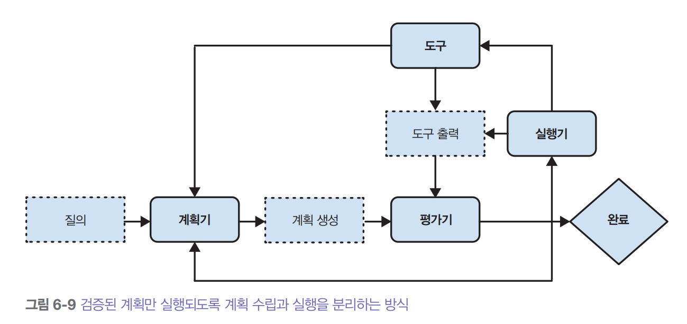  
  
이제 시스템은 세 가지 구성 요소를 갖추게 됐다. 계획을 생성하는 요소, 계획을 검증하는 요소, 그리고 계획을 실행하는 요소다. 각 구성 요소를 에이전트로 
본다면 이는 멀티 에이전트 시스템이라고 할 수 있다. 대부분의 에이전트 워크플로는 여러 구성 요소를 포함할 만큼 충분히 복잡하기 떄문에 대부분의 에이전트는 
멀티 에이전트 형태를 띤다.  
  
과정을 더 빠르게 진행하기 위해 계획을 차례대로 생성하는 대신 여러 계획을 동시에 만들고 평가자에게 가장 최적의 계획을 선택하도록 요청할 수 있다. 이는 
지연 시간과 비용 사이에 또 다른 균형점으로 여러 계획을 동시에 생성하면 추가 비용이 발생한다.  
  
곟획 수립은 작업 뒤에 있는 의도를 이해하는 것이 필요하다. 사용자가 이 질의로 무엇을 하려고 하는가? 의도 분류기는 종종 에이전트의 계획 수립을 돕는 
데 사용된다. 의도 분류는 별도의 프롬프트나 이 작업을 위해 학습된 분류 모델을 사용해 수행할 수 있다. 이런 의도 분류 메커니즘은 멀티 에이전트 시스템의 
또 다른 에이전트로 볼수 있다.  
  
의도를 파악하면 에이전트가 적절한 도구를 선택하는 데 도움이 될 수 있다. 예를 들어 고객 지원에서 질의가 결제에 관한 것이라면 에이전트는 사용자의 
최근 결제 내역을 검색하는 도구가 필요할 수 있다. 하지만 질의가 비밀번호 재설정 방법에 관한 것이라면 에이전트는 문서 검색 기능이 필요할 수 있다.  
  
일부 질의는 에이전트가 처리할 수 없는 범위에 속할 수 있다. 의도 분류기는 이런 요청을 '관련 없음(IRRELEVANT)'으로 분류할 수 있어야 한다. 그래야 
에이전트가 불가능한 해결책을 찾느라 계산 자원을 낭비하지 않고 정중하게 요청을 거절할 수 있다.  
  
지금까지 에이전트가 계획 생성, 계획 검증, 계획 실행이라는 세 단계를 모두 자동으로 처리한다고 가정했다. 그러나 실제로는 과정을 개선하고 위험을 줄이기 
위해 각 단계에서 사람, 즉 전문가가 계획을 제공하거나 계획을 검증하거나 계획의 일부를 직접 실행할 수도 있다. 예를 들어, 에이전트가 전체 계획을 세우기 어려운 
복잡한 작업의 경우 전문가가 계획의 큰 틀을 제공하고 에이전트가 이를 구체화할 수 있다. 또는 데이터베이스 업데이트나 코드 변경과 병합 같이 위험한 작업이 
포함된 계획의 경우 시스템은 실행하기 전에 사용자의 명시적 승인을 요청하거나 이런 작업을 사람이 직접 실행하도록 할 수 있다. 이를 위해서는 각 작업에 대해 
에이전트의 자동화 수준을 명확히 정의해야 한다.  
  
요약하자면 작업을 해결하는 과정은 일반적으로 다음과 같은 단계로 이루어진다. 여기서 성찰은 에이전트에게 반드시 필요한 것은 아니지만 성능을 크게 향상시킨다.  
  
1. 계획 생성: 작업을 수행하기 위한 계획을 세운다. 계획은 관리 가능한 일련의 행동들로 구성되므로 이 과정은 작업 분해라고도 한다.  
2. 성찰과 오류 수정: 생성된 계획을 평가한다. 계획이 좋지 않다면 새로운 계획을 생성한다.  
3. 실행: 생성된 계획에 따라 행동을 수행한다. 주로 특정 함수를 호출하는 방식으로 이루어진다.  
4. 성찰과 오류 수정: 행동 결과를 평가하고 목표가 달성됐는지 확인한다. 오류가 있다면 찾아서 수정하고 목표가 완료되지 않았다면 새로운 계획을 세운다.  
  
이미 계획 생성과 성찰을 위한 몇 가지 기법을 살펴보았다. 모델에게 "단계별로 생각해봐"라고 요청할 떄 작업을 분해하도록 요청하는 것이다. 그리고 
모델에게 "응답이 맞는지 확인해봐"라고 요청할 떄는 모델에게 스스로 성찰하도록 요청하는 것이다.  
  
# **계획자 역할을 하는 파운데이션 모델**  
파운데이션 모델이 얼마나 효과적으로 계획을 세울수 있는지는 아직 명확히 밝혀지지 않았다. 많은 연구자는 파운데이션 모델, 적어도 자기회귀 언어 모델을 
기반으로 한 모델은 계획을 세울 수 없다고 본다. 메타의 수석 AI 과학자인 얀 르쿤은 자히괴귀 LLM이 계획을 세울 수 없다고 단호하게 말했다. 캄바함파티는 
'Can LLMs Really Reason and Plan?'에서 LLM이 지식 추출에는 뛰어나지만 계획 수립에는 그렇지 않다고 주장했다. 그는 LLM의 계획 능력을 주장하는 
논문들이 두 가지를 혼동하고 있다고 지적했다. 바로 LLM에서 추출한 계획에 관한 일반적인 지식과 실제로 실행 가능한 계획이다. 그는 다음과 같이 덧붙였다. 
"LLM에서 나오는 계획이 일반 사용자에게는 그럴듯해 보일 수 있지만 실행 단계에서 여러 문제와 오류를 일으킬 수 있다."  
  
그러나 LLM이 계획 수립에 취약하다는 여러 사례가 있음에도 아직 우리가 LLM을 올바르게 사용하는 방법을 모르기 때문인지, 아니면 LLM이 근본적으로 계획 수립을 
할 수 없기 때문인지는 명확하지 않다.  
  
계획 수립은 본질적으로 탐색 문제다. 목표로 가는 다양한 경로를 탐색하고 각 경로의 결과(보상)를 예측하며 가장 유망한 결과를 가진 경로를 선택하는 과정이다. 
종종 목표에 도달할 수 있는 경로가 아예 없다고 판단할 수도 있다.  
  
탐색 과정은 종종 백트래킹(되돌아가기)이 필요하다. 예를 들어, A와 B 두 가지 선택지가 있는 상황을 생각해 보자. A를 선택한 후 결과가 좋지 않다면 이전 
상태로 되돌아가 B를 선택해야 한다.  
  
어떤 사람들은 자기회귀 모델이 앞으로 나아가는 행동만 생성할 수 있다고 주장한다. 즉 다른 선택지를 위해 되돌아갈 수 없다는 뜻이다. 이런 이유로 자기회귀 
모델이 계획을 세울 수 없다는 결론을 내린다. 하지만 꼭 그렇지만은 않다. A 행동을 포함한 경로를 실행한 후 모델이 그 경로가 적절하지 않다고 판단하면 B 
행동으로 경로를 수정할 수 있다. 이는 사실상 백트래킹과 같으며 아예 모델이 처음부터 다시 시작해 다른 경로를 선택할 수도 있다.  
  
또한 LLM이 계획 수립에 취약한 또 다른 이뉴는 계획에 필요한 도구를 제대로 갖추지 못했기 떄문일 수도 있다. 효과적인 계획을 세우려면 가능한 행동뿐 
아니라 각 행동의 잠재적 결과도 알아야 한다. 간단한 예로 산을 오르려 한다고 가정해 보자. 가능한 행동은 오른쪽으로 돌기, 왼쪽으로 돌기, 뒤로 돌기, 
또는 직진하기다. 만약 오른쪽으로 돌면 절벽에서 떨어질 위험이 있다면 이 행동을 고려하지 않을 수 있다. 기술적으로 말하면 행동은 한 상태에서 다른 
상태로 이동하게 되며 어떤 행동을 취할지 결정하려면 그 결과 상태를 알아야 한다.  
  
이는 인기 있는 CoT 프롬프팅 기법처럼 단순히 모델에게 행동 순서만 생성하도록 프롬프트를 작성하는 것은 충분하지 않다는 의미다. Reasoing with 
Language Model is Planning with World Model 논문에 따르면 LLM은 세계에 대한 방대한 정보를 담고 있어 각 행동의 결과를 예측할 수 있다고 주장한다. 
이런 능력을 활용해 LLM은 일관성 있는 계획을 생성할 수 있다.  
  
# **파운데이션 모델(FM) 대 강화 학습(RL) 계획 수립자**  
에이전트는 강화 학습의 핵심 개념으로 위키피디아는 '지능형 에이전트가 누적 보상을 최대화하기 위해 동적 환경에서 어떻게 행동해야 하는지를 다루는 분야'라고 
정의한다.  
  
RL 에이전트와 FM 에이전트는 여러 면에서 유사하다. 둘 다 활동하는 환경과 가능한 행동들에 따라 특성이 결정된다. 둘의 가장 큰 차이점은 계획을 세우는 
방식이다. RL 에이전트는 강화 학습 알고리즘을 통해 계획 능력을 학습하는데 이 과정에서 상당한 시간과 자원이 필요할 수 있다. 반면 FM 에이전트는 
모델 자체가 계획 수립자 역할을 한다. 이 모델은 프롬프트나 파인튜닝을 통해 계획 수립 능력을 향상시킬 수 있으며 일반적으로 더 적은 시간과 자원으로도 가능하다.  
  
하지만 FM 에이전트 역시 성능 향상을 위해 RL 알고리즘을 활용할 수 있다. 장기적으로 보면 앞으로 FM 에이전트와 RL 에이전트는 결국 하나로 통합될 것으로 예상된다.  
  
# **계획 생성**  
모델을 계획 생성기로 바꾸는 가장 간단한 방법은 프롬프트 엔지니어링이다. 키티 보그에서 고객이 제품 정보를 알아볼 수 있도록 도와주는 에이전트를 만든다고 
가정해 보자. 이 에이전트에게 가격별 제품 검색, 인기 제품 검색, 제품 정보 검색이라는 세 가지 외부 도구를 제공한다. 다음은 계획 생성을 위한 프롬프트 
예시다. 이 프롬프트는 설명을 위해 단순화한 것으로 실제 운영 환경에서는 더 복잡할 수 있다.  
  
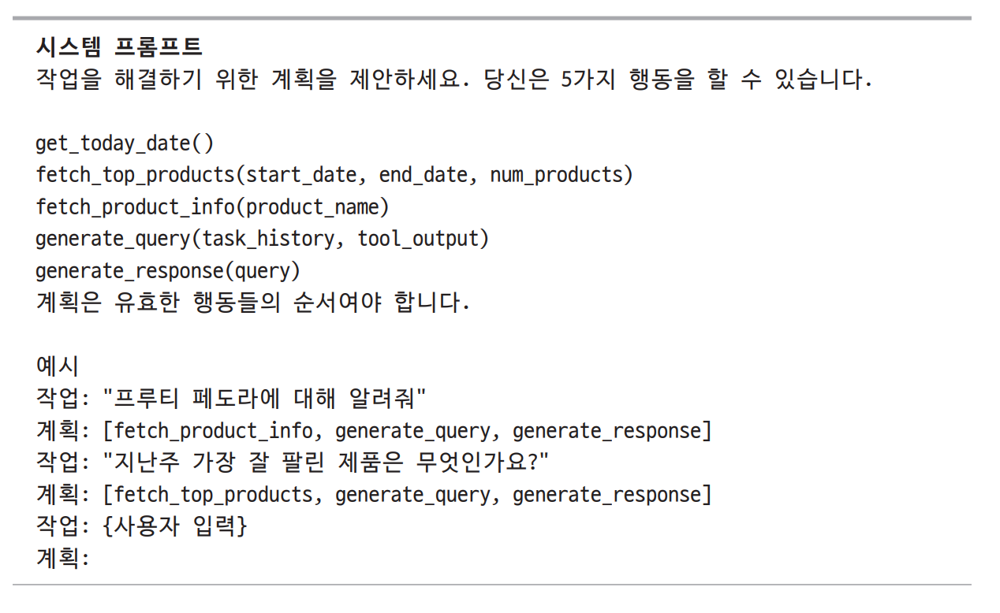  
  
이 예시에서 두 가지를 주목하자.  
  
- 여기서 사용된 계획 형식(에이전트가 파라미터를 추론하는 함수들의 목록)은 에이전트 제어 흐름을 구성하는 여러 방법 중 하나일 뿐이다.  
- generate_query 함수는 지금까지의 작업 기록과 가장 최근 도구 출력을 입력으로 받아 응답 생성기에 전달될 질의를 생성한다. 각 단계의 도구 출력을 
입력으로 받아 응답 생성기에 전달될 질의를 생성한다. 각 단계의 도구 출력은 작업 기록에 추가된다.  
  
"지난주 가장 잘 팔린 제품의 가격은 얼마인가요?"라는 사용자의 질의가 주어지면 생성된 계획은 다음과 같을 수 있다.  
  
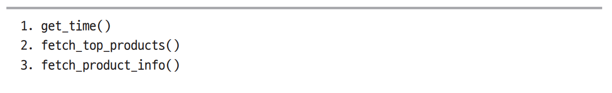  
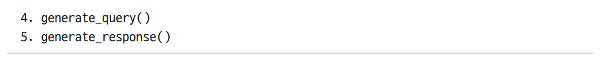  
  
'각 함수에 필요한 파라미터는 어떻게 되는 거지?'라고 궁금해할 수 있다. 정확한 파라미터는 주로 이전 도구 출력에서 추출되기 때문에 미리 예측하기 어렵다. 
첫 번째 단계인 get_time()이 "2030-09-13"을 출력한다면 에이전트는 다음 단계의 파라미터를 다음과 같이 추론할 수 있다.  
  
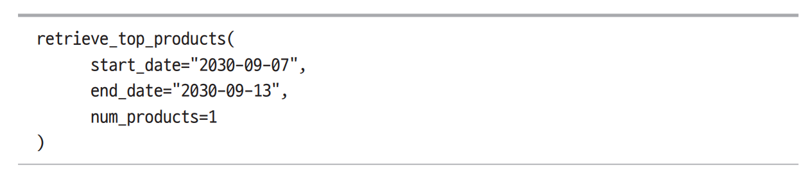  
  
종종 함수의 정확한 파라미터 값을 결정할 정보가 부족한 경우가 있다. 예를 들어 사용자가 "인기 제품의 평균 가격은 얼마인가요?"라고 물으면 다음 질문에 
대한 답이 명확하지 않다.  
  
- 사용자가 몇 개의 인기 제품을 원하는가?  
- 사용자가 지난주, 지난달, 또는 전체 기간의 인기 제품을 원하는가?  
  
이는 모델이 사용자의 요구를 자주 추측해야 한다는 것을 의미하며 추측이 틀릴 수도 있다는 것을 의미한다.  
  
이렇듯 행동 순서와 관련된 파라미터 모두 AI 모델이 생성하기 때문에 환각이 발생할 수 있다. 환각으로 인해 모델이 존재하지 않는 함수를 호출하거나 
유효한 함수를 잘못된 파라미터로 호출할 수 있다. 일반적으로 모델의 성능을 향상시키는 기법들은 모델의 계획 수립 능력을 향상시키는 데도 활용될 수 
있다.  
  
에이전트의 계획 수립 능력을 향상시키기 위한 몇 가지 방법은 다음과 같다.  
  
- 더 많은 예시가 포함된 더 나은 시스템 프롬프트를 작성한다.  
- 모델이 더 잘 이해할 수 있도록 도구와 파라미터에 대해 더 자세히 설명한다.  
- 복잡한 함수를 두 개의 더 간단한 함수로 나누는 등 함수 자체를 더 단순하게 만든다.  
- 더 강력한 모델을 사용한다. 일반적으로 더 강력한 모델이 계획 수립에 더 능숙하다.  
- 계획 생성을 위해 모델을 파인튜닝한다.  
  
# **함수 호출**  
많은 모델 제공업체는 자사 모델에 도구 사용 기능을 탑재해 모델을 에이전트로 활용할 수 있게 한다. 도구가 곧 함수이기 떄문에 도구를 사용하는 것을 종종 
함수 호출이라고도 부른다. 다양한 API마다 작동 방식이 다르지만 일반적으로 함수 호출은 다음과 같이 작동한다.  
  
1. 도구 목록 생성: 모델이 사용할 수 있는 모든 도구를 정의한다. 각 도구는 실행 진입점(entry point. 예: 함수 이름), 파라미터, 그리고 문서(예: 
함수가 하는 일과 필요한 파라미터)로 구성된다.  
2. 에이전트가 사용할 수 있는 도구 지정: 서로 다른 질의마다 필요한 도구가 다를 수 있기 때문에 많은 API는 각 질의에 사용할 도구 목록을 따로 지정할 
수 있게 해준다. 일부 API는 다음과 같은 설정으로 도구 사용을 더 세밀하게 제어할 수 있다.  
  
- required(필수): 모델이 반드시 하나 이상의 도구를 사용해야 한다.  
- none(없음): 모델이 어떤 도구도 사용하지 않아야 한다.  
- auto(자동): 모델이 스스로 어떤 도구를 사용할지 결정한다.  
  
함수 호출은 아래 그림에 설명되어 있다. 이는 여러 API를 대표할 수 있도록 의사코드로 작성되었다. 특정 API를 사용하려면 해당 API의 문서를 미리 확인하는 
것을 추천한다.  
  
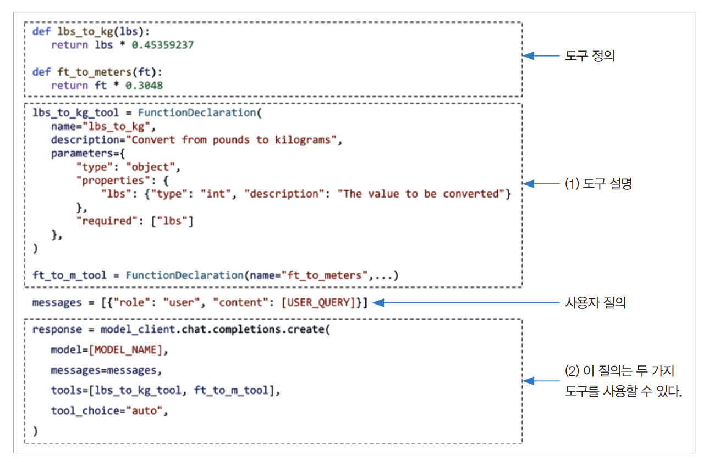  
  
주어진 질의에 대해 아래 그림처럼 정의된 에이전트는 어떤 도구를 사용할지, 그리고 필요한 파라미터를 자동으로 생성한다. 일부 함수 호출 API는 유효한 
함수만 생성하도록 보장하지만 파라미터 값까지 올바른지는 보장하지 못한다.  
  
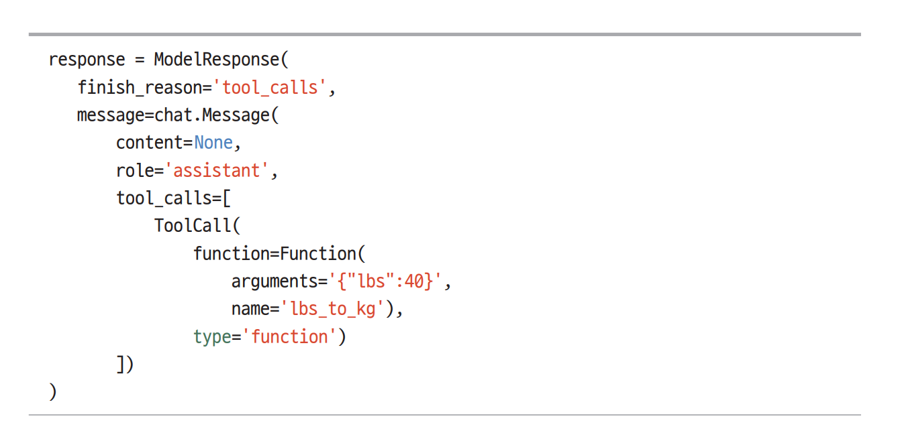  
  
예를 들어 "40파운드는 몇 킬로그램인가요?"라는 사용자 질의가 주어지면 에이전트는 lbs_to_kg_tool 이라는 도구가 필요하고 40이라는 파라미터를 사용해야 
한다고 판단할 수 있다. 에이전트의 응답은 다음과 같은 형태일 것이다.  
  
이 응답에서 lbs_to_kg(lbs=40) 함수를 호출하고 그 출력을 사용하여 사용자에게 응답할 수 있다.  
  
에이전트를 활용할 때는 항상 시스템이 각 함수 호출에 어떤 파라미터 값을 사용했는지 알려주도록 설정하는 것이 좋다. 이런 값들은 정확한지 반드시 검토해야 한다.  
  
# **계획의 세부성**  
계획은 작업을 완수하기 위해 필요한 단계를 대략적으로 보여주는 로드맵이다. 로드맵은 다양한 수준의 세부성을 가질 수 있다. 1년 계획을 세울 떄 분기별 
계획은 월별 계획보다 더 큰 그림을 보여주고 월별 계획은 주별 계획보다 더 상위 수준의 계획이다.  
  
계획과 실행 사이에는 절충점이 있다. 세부적인 계획은 생성하기 어렵지만 실행하기는 쉽다. 반면 큰 틀의 계획은 생성하기 쉽지만 실행하기는 어렵다. 
이런 절충을 피하는 방법은 계층적으로 계획을 세우는 것이다. 먼저 분기별 계획과 같은 큰 그림의 계획을 세운 다음 각 분기마다 더 자세한 월별 계획을 
수립하는 식이다.  
  
지금까지 살펴본 계획 예시들은 모두 정확한 함수 이름을 사용하는데 이는 매우 세부적인 접근법이다. 이 방식의 문제점은 에이전트의 도구 목록이 시간이 
지나면서 변할 수 있다는 점이다. 예를 들어 현재 날짜를 가져오는 함수 get_time()이 get_current_time()으로 이름이 바뀔 수 있다. 도구가 변경되면 프롬프트와 
모든 예시를 업데이트해야 한다. 또한 정확한 함수 이름을 사용하면 서로 다른 도구 API를 가진 여러 활용 사례에서 계획 수립자를 재활용하기 어려워진다.  
  
만약 예전 도구 목록을 기반으로 계획을 세우도록 모델을 이미 파인튜닝했다면 도구 목록이 바뀌었을 때 새로운 목록에 맞춰 모델을 다시 학습시켜야 한다.  
  
이런 문제를 해결하기 위해 계획은 특정 함수 이름보다 더 일반적인 자연어를 사용해 만들 수도 있다. 예를 들어 "지난주 가장 잘 팔린 제품의 가격은 얼마인가요?"
라는 질의가 주어지면 에이전트는 다음과 같은 계획을 세울 수 있다.  
  
1. 현재 날짜 가져오기  
2. 지난주 베스트셀러 제품 조회  
3. 제품 정보 조회  
4. 쿼리 생성  
5. 응답 생성  
  
더 자연스러운 언어를 사용하면 계획 생성기가 도구 API의 변화에 더 유연하게 대응할 수 있다. 모델이 주로 자연어로 학습되었다면 자연어로 계획을 이해하고 
생성하는 데 더 능숙하고 환각 현상도 일으킬 가능성이 적을 것이다. 이 접근 방식의 단점은 각 자연어 행동을 실행 가능한 명령으로 번역하는 번역기가 
필요하다는 것이다. 하지만 번역은 계획 수립보다 훨씬 간단한 작업이며 환각 위험이 적은 더 가벼운 모델로도 수행할 수 있다.  
  
# **복잡한 계획**  
지금까지의 계획 예시들은 모두 순차적이었다. 계획의 다음 행동은 항상 이전 행동이 완료된 후에 실행되었다. 행동이 실행되는 순서를 제어 흐름(control flow)이라고 
한다. 순차적 형태는 제어 흐름의 한 유형일 뿐이다. 다른 제어 흐름은 병렬, if 조건문, for 반복문 등이 있다. 다음으로 각 제어 흐름을 간략히 살펴본다. 
이해를 돕기 위해 순차 실행도 포함했다.  
  
- 순차 실행  
작업 B가 작업 A에 의존하는 경우가 많아 보통 작업 A가 끝난 후 작업 B를 실해한다. 예를 들어 SQL 질의는 자연어 입력에서 변환된 후에만 실행할 수 있다.  
  
- 병렬 실행  
작업 A와 B를 동시에 실행하는 방식이다. 예를 들어 "100달러 미만의 베스트셀러 제품을 찾아줘"라는 질의가 주어지면 에이전트는 먼서 상위 100개의 베스트셀러 
제품을 검색한 다음 각 제품의 가격을 동시에 조회할 수 있다.  
  
- if 조건문  
이전 단계의 결과에 따라 작업 B나 작업 C로 분기되는 방식이다. 예를 들어 에이전트가 먼저 엔비디아의 실적 보고서를 확인한 후 이 보고서 내용에 따라 
엔비디아 주식을 팔시 살지 결정할 수 있다.  
  
- For 반복문  
특정 조건이 충족될 떄까지 작업 A를 반복하는 방식이다. 예를 들어 소수가 나올 때까지 무작위 숫자를 계속 생성한다.  
  
이런 다양한 제어 흐름은 아래 그림에 시각화되어 있다.  
  
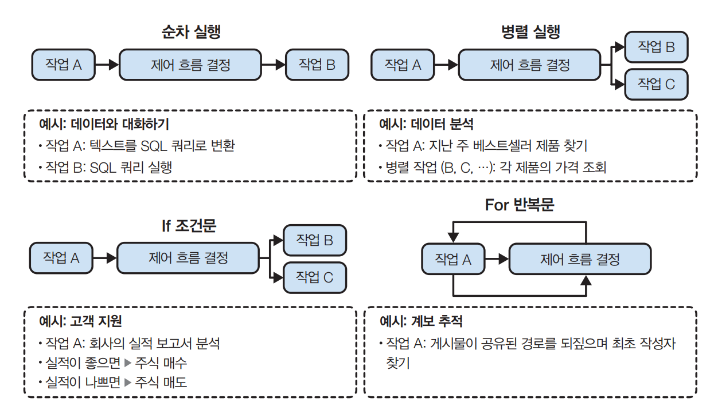  
  
전통적인 소프트웨어 엔지니어링에서는 비교적 제어 흐름의 조건이 명확하게 정의된다. 반면 AI 기반 에이전트에서는 AI 모델이 제어 흐름을 결정한다. 
순차적이지 않은 제어 흐름을 가진 계획은 만들기도 어렵고 실행 가능한 명령으로 변환하기도 어렵다.  
  
에이전트 프레임워크를 평가할 떄는 어떤 제어 흐름을 지원하는지 확인하는 것이 중요하다. 병렬 실행은 사용자가 체감하는 지연 시간을 크게 줄일 수 있다.  
  
# **성찰 및 오류 수정**  
아무리 뛰어난 계획이라도 성공 가능성을 높이려면 계속해서 평가하고 조정해야 한다. 성찰은 에이전트 작동에 반드시 필요한 것은 아니지만 에이전트가 
성공적으로 임무를 완수하기 위해서는 필요한 과정이다. 성찰은 다음과 같이 작업의 여러 단계에서 유용하게 활용할 수 있다.  
  
- 사용자 질의를 받은 후 요청이 실현 가능한지 검토할 때  
- 초기 계획을 세운 후 그 계획이 타당한지 확인할 떄  
- 각 실행 단계 이후 올바른 방향으로 진행되고 있는지 점검할 때  
- 전체 계획이 실행된 후 작업이 제대로 완료되었는지 확인할 때  
  
성찰과 오류 수정은 서로 밀접하게 연결되어 있는 별개의 두 메커니즘이다. 성찰을 통해 얻은 통찰력은 수정이 필요한 오류를 발견하는 데 도움이 된다.  
  
성찰은 자기 비평 프롬프트를 활용해 동일한 에이전트가 수행할 수 있고 각 결과에 구체적인 점수를 매기는 전문 평가 모델과 같은 별도의 구성 요소를 통해 
이루어질 수도 있다.  
  
ReAct에서 처음 제안된 추론과 행동의 교차 방식은 에이전트의 일반적인 패턴이 되었다. 야오 등의 연구팀은 계획 수립과 성찰을 모두 포함하는 개념으로 
추론(reasoning)이라는 용어를 사용했다. 각 단계에서 에이전트는 자신의 생각을 설명하고(계획), 행동을 취한 다음 관찰 결과를 분석(성찰)하는 과정을 
반복하며 이는 에이전트가 작업이 완료됐다고 판단할 떄까지 계속된다. 일반적으로 에이전트는 예시를 참고하여 다음과 같은 형식으로 출력을 생성하도록 
프롬프트를 받는다.  
  
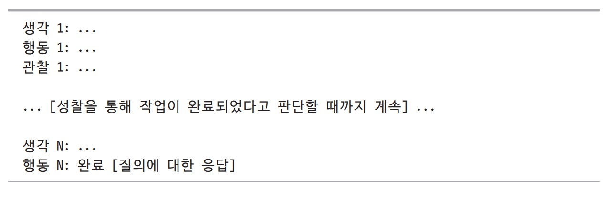  
  
아래 그림은 다단계 질의 응답을 위한 벤치마크인 HotpotQA의 질의에 답하는 ReAct 프레임워크 기반 에이전트의 에시를 보여준다.  
  
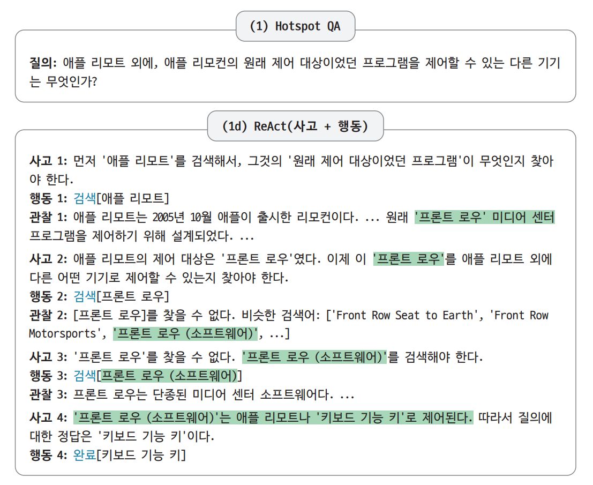  
  
성찰은 멀티 에이전트 설정에서도 구현할 수 있다. 한 에이전트는 계획을 세우고 행동을 취하고 다른 에이전트는 각 단계나 여러 단계 이후에 결과를 평가하는 
방식이다.  
  
에이전트의 응답이 작업을 완수하지 못했다면 왜 실패했는지와 어떻게 개선할 수 있는지 생각해 보도록 요청할 수 있다. 이런 성찰을 바탕으로 에이전트는 새로운 
계획을 세운다. 이를 통해 에이전트는 실수로부터 배울 수 있다. 예를 들어 코드 생성 작업에서 평가자가 생성된 코드가 테스트 케이스의 1/3에서 실패한다고 
판단했다면 에이전트는 모든 숫자가 음수인 배열을 고려하지 않았기 떄문에 실패했다고 성찰할 수 있다. 그러면 실행 에이전트는 이 문제를 해결한 새 코드를 
생성해 모든 음수 배열도 처리할 수 있게 한다.  
  
이는 리플렉션이 취한 접근 방식이다. 이 프레임워크에서 성찰은 두 모듈로 나뉜다. 결과를 평가하는 평가자와 무엇이 잘못되었는지 스스로의 과정을 되짚어보는 
성찰 모듈이다. 아래 그림은 실제로 작동하는 리플렉션 에이전트의 예시를 보여준다. 여기서는 계획을 지칭하기 위해 궤적이라는 용어를 사용했다. 각 단계에서 
평가와 성찰 후 에이전트는 새로운 궤적을 제안한다.  
  
계획 생성과 비교했을 떄 성찰은 상대적으로 구현하기 쉽고 놀랍도록 높은 성능 향상을 가져올 수 있다. 이 접근 방식의 단점은 지연 시간과 비용이다. 생각, 
관찰, 때로는 행동을 생성하는 데 많은 토큰이 필요해 특히 중간 단계가 많은 작업에서는 비용과 사용자가 체감하는 지연 시간이 늘어난다. 에이전트가 형식을 
제대로 따르도록 유도하기 위해 ReAct와 리플렉션 연구자들은 프롬프트에 많은 예시를 포함시켰다. 이는 입력 토큰 계산 비용을 높이고 다른 정보에 사용할 
수 있는 컨텍스트 공간을 줄인다.  
  
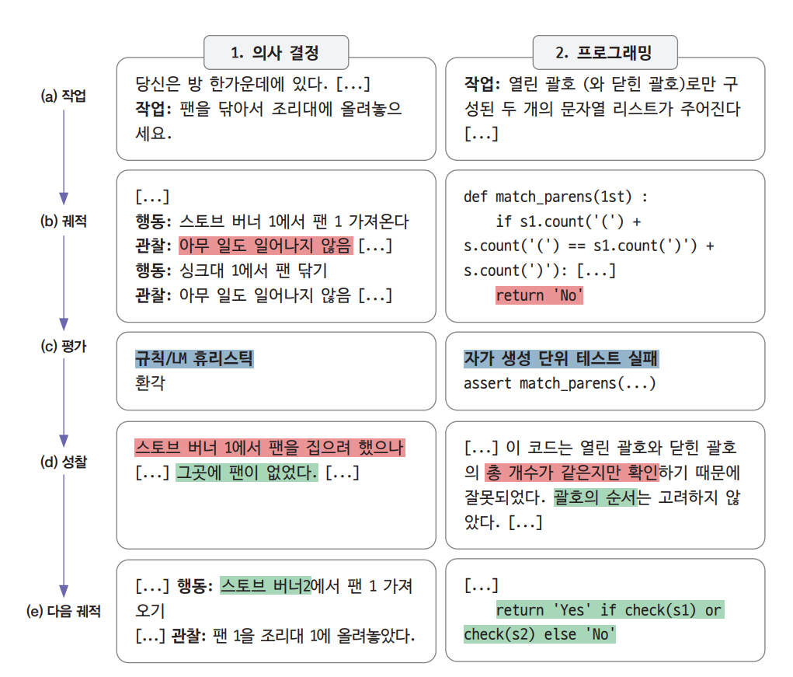  
  
# **도구 선택**  
도구는 종종 작업 성공에 중요한 역할을 하므로 신중하게 선택해야 한다. 에이전트에게 어떤 도구를 제공할지는 환경과 작업에 따라 달라질 뿐만 아니라 
에이전트를 구동하는 AI 모델에 따라서도 달라진다.  
  
최상의 도구 세트를 선택하는 완벽한 방법은 없다. 에이전트 관련 연구들은 다양한 도구 목록을 보여준다. 예를 틀어 틀포머는 다섯 가지 도구를 사용하도록 
GPT-J를 파인튜닝했다. 카멜레온은 13개의 도구를 사용한다. 반면에 고릴라는 에이전트가 1645개의 API 중에서 적절한 것을 선택하게 했다.  
  
도구가 많을수록 에이전트의 능력은 향상되지만 그만큼 이를 효율적으로 사용하기는 어려워진다. 이는 사람이 너무 많은 도구를 익히기 어려운 것과 비슷하다. 
또한 도구를 추가하면 그에 대한 설명도 늘어나므로 모델의 컨텍스트 한계를 초과할 수 있다.  
  
AI 애프리케이션 개발 과정의 다른 결정과 마찬가지로 도구 선택에는 실험과 분석이 필요하다. 결정에 도움이 될 수 있는 몇 가지 방법은 다음과 같다.  
  
- 여러 도구 조합으로 에이전트의 성능을 비교한다.  
- 특정 도구를 제거했을 때 에이전트의 성능이 얼마나 떨어지는지 확인하는 제거 연구를 수행한다. 성능 저하 없이 제거할 수 있는 도구가 있다면 제외한다.  
- 에이전트가 자주 실수하는 도구를 찾아본다. 광범위한 프롬프팅이나 파인튜닝에도 에이전트가 제대로 사용하지 못하는 도구가 있다면 그 도구를 교체한다.  
- 도구 호출 분포를 시각화하여 가장 많이 사용되는 도구와 거의 사용되지 않는 도구를 파악한다. 아래 그림은 카멜레온 연구에서 GPT-4와 챗GPT의 도구 사용 
패턴 차이를 보여준다.  
  
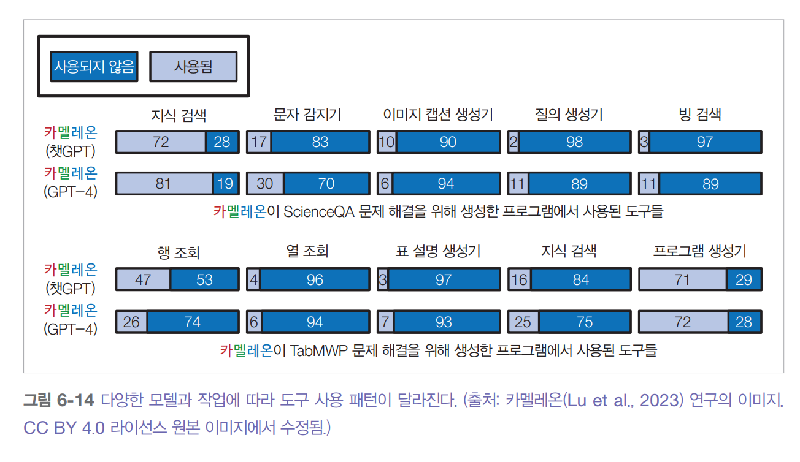  
  
또한 루 등의 연구는 두 가지 중요한 점을 보여준다.  
  
1. 작업마다 필요한 도구가 다르다. 과학 질의 응답 작업인 ScienceQA는 표 형식의 수학 문제를 푸는 TabMWP보다 지식 검색 도구에 훨씬 더 많이 의존한다.  
2. 모델마다 선호하는 도구가 다르다. 예를 들어 GPT-4는 챗GPT보다 더 다양한 도구를 선택하는 경향이 있다. 챗GPT는 이미지 설명 생성을 주로 하는 반면 
GPT-4는 지식 검색 도구를 더 자주 사용한다.  
  
에이전트 프레임워크를 평가할 때는 어떤 계획 수립 기능과 도구를 지원하는지 확인하자. 프레임워크마다 중점을 두는 도구 종류가 다를 수 있다. 예를 들어 
AutoGPT는 소셜 미디어 API(레딧, X, 위키피디아)에 집중하는 반면 컴포시오는 기업용 API(구글 앱스, 깃허브, 슬랙)에 초점을 맞추고 있다.  
  
시간이 지나면서 필요한 기능이 변할 수 있으므로 새로운 도구를 추가할 수 있도록 에이전트를 확장하기 쉬운지도 평가해야 한다.  
  
사람은 주어진 도구를 사용하는 것뿐만 아니라 간단한 도구들을 조합해 더 강력한 도구를 만들어 생산성을 향상시킨다. AI도 기본 도구를 활용해 새로운 도구를 
만들 수 있을까?  
  
카멜레온은 도구 전환 연구를 제안한다. 도구 X를 사용한 후 에이전트가 도구 Y를 호출할 확률은 얼마나 될까? 아래 그림은 도구 전환의 예시를 보여준다.  
  
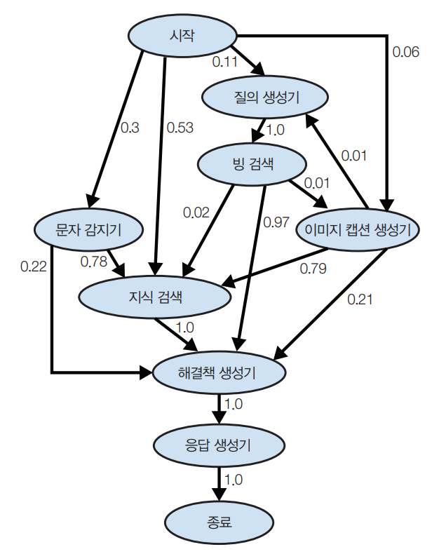  
  
두 도구가 자주 함께 사용되는 패턴이 발견된다면 이 둘을 하나의 더 강력한 도구로 합칠 수 있다. 에이전트가 이런 패턴을 인식한다면 초기 도구들을 조합해 
점진적으로 더 복잡한 도구를 만들어낼 수 있을 것이다.  
  
보이저는 에이전트가 습득한 새로운 기술(도구)을 추적하고 재사용할 수 있게 해주는 스킬 매니저를 제안한다. 각 스킬은 코딩 프로그램 형태로 존재한다. 
스킬 매니저가 새로 생성된 스킬이 유용하다고 판단하면(예: 에이전트가 작업 수행에 성공적으로 기여한 경우), 이 스킬을 스킬 라이브러리(개념적으로 도구 
목록과 유사)에 추가한다. 이렇게 저장된 기술은 나중에 다른 작업에도 활용할 수 있다.  
  
환경 내에서 에이전트의 성공 여부는 보유한 도구 목록과 계획 수립 능력에 달려있다. 이 두 측면 중 하나라도 실패하면 에이전트 전체가 실패할 수 있다.  
  
# **에이전트 실패 유형과 평가**  
평가란 실패를 발견하는 과정이다. 에이전트가 수행하는 작업이 복잡할수록 실패할 가능성도 더 많아진다. 모든 AI 애플리케이션의 일반적인 실패 유형 외에도 
에이전트는 다른 것보다 쉽게 발견할 수 있는 실패를 포함해 계획 수립, 도구 실행, 효율성과 관련된 실패를 겪는다.  
  
따라서 에이전트를 평가하려면 실패 유형을 파악하고 각 유형이 얼마나 자주 발생하는지 측정해야 한다.  
  
버클리 함수 호출 리더보드, AgentOps 평가 도구, TravelPlanner 벤치마크 같은 에이전트 벤치마크와 리더보드도 있다.  
  
# **계획 수립 실패**  
계획 수립은 어렵고 여러 방식으로 실패할 수 있다. 가장 흔한 계획 수립 실패 유형은 도구 사용 실패다. 에이전트는 다음과 같은 오류 중 하나 이상을 
포함할 계획을 만들 수 있다.  
  
- 유효하지 않은 도구  
예를 들어 bing_search를 포함한 계획을 생성하지만 에이전트의 도구 목록에 bing_search가 없는 경우다.  
- 유효한 도구, 유효하지 않은 파라미터  
예를 들어 lbs_to_kg를 두 개의 파라미터로 호출한다. lbs_to_kg는 도구 목록에 있지만 lbs라는 하나의 파라미터만 필요하다.  
- 유효한 도구, 잘못된 파라미터 값  
예를 들어 lbs_to_kg를 하나의 파라미터 lbs로 호출하지만 120이어야 할 값에 100을 사용한다.  
  
계획 수립 실패의 또 다른 유형은 에이전트가 목표를 이루지 못하는 목표 달성 실패다. 이는 계획이 작업을 해결하지 못하거나 제약 조건을 따르지 않고 
작업을 해결하기 떄문일 수 있다. 예를 들어 샌프란시스코에서 하노이까지 5000달러 예산으로 2주 여행을 계획해달라고 요청했다고 가정해 보자. 이때 
에이전트가 샌프란시스코에서 호찌민까지의 여행을 계획하거나 예산을 크게 초과하는 샌프란시스코에서 하노이까지의 2주 여행을 계획하는 경우다.  
  
에이전트를 평가할 때 시간은 중요하지만 종종 간과되는 제약 조건이다. 작업을 맡겨두고 완료되었을 때 확인만 하면 되는 경우가 많아 작업에 걸리는 시간이 
그리 중요하지 않다고 생각하기 쉽다. 하지만 일정 수준을 넘어서면 시간이 오래 걸릴수록 에이전트의 유용성은 급격히 떨어진다. 예를 들어 에이전트에게 
보조금 신청서를 준비해달라고 했는데 마감일 지나서야 끝낸다면 그 결과물은 아무 쓸모가 없다.  
  
이외에 주목할 만한 계획 수립 실패 유형은 성찰 오류가 있다. 이 오류는 에이전트가 실제로는 작업을 완료하지 못했는데도 완료했다고 확신하는 것이다. 
예를 들어 에이전트에게 50명을 30개 호텔 객실에 배정해달라고 요청했는데 에이전트는 40명만 배정하고도 작업이 완료됐다고 하는 경우다.  
  
계획 수립 실패에 대해 에이전트를 평가하기 위한 한 가지 방법은 각 예시가 (작업, 도구 목록) 쌍으로 구성된 계획 수립 데이터셋을 만드는 것이다. 각 
작업에 대해 에이전트를 사용해 K개의 계획을 생성한 다음, 다음 지표를 계산한다.  
  
1. 생성된 모든 계획 중 유효한 계획의 비율은?  
2. 주어진 작업에 대해 에이전트가 유효한 계획을 얻기 위해 평균적으로 몇 개의 계획을 생성해야 하는가?  
3. 모든 도구 호출 중 유효한 호출의 비율은?  
4. 유효하지 않은 도구가 호출되는 빈도는?  
5. 유효한 도구가 유효하지 않은 파라미터로 호출되는 빈도는?  
6. 유효한 도구가 잘못된 파라미터 값으로 호출되는 빈도는?  
  
패턴을 찾기 위해 에이전트의 출력을 분석해 보자. 에이전트가 어떤 유형의 작업에서 더 많이 실패하는가? 그 이유에 대한 가설은 있는가? 모델이 자주 실수하는 
도구는 무엇인가? 일부 도구는 에이전트가 사용하기 더 어려울 수 있다. 더 나은 프롬프트, 더 많은 예시, 또는 파인튜닝을 통해 에이전트가 어려운 도구를 
잘 사용하도록 개선할 수 있다. 모든 시도가 실패한다면 이 도구를 사용하기 더 쉬운 것으로 교체하는 것을 고려해 볼 수 있다.  
  
# **도구 실패**  
도구 실패는 올바른 도구를 사용했지만 그 결과가 잘못된 경우에 발생한다. 한 가지 실패 유형은 도구 자체가 단순히 잘못된 출력을 내놓는 경우다. 예를 들어 
이미지 캡션 생성기가 잘못된 설명을 제공하거나 SQL 쿼리 생성기가 잘못된 SQL 쿼리를 만드는 경우가 있다.  
  
에이전트가 큰 틀의 계획만 세운 뒤 번역 모듈을 통해 각 단계를 실행 가능한 명령어로 옮기는 과정에서 오류가 발생할 수 있다.  
  
또한 에이전트가 작업에 필요한 적절한 도구를 갖고 있지 않을 떄도 도구 실패가 일어난다. 대표적인 예로 인터넷에서 현재 주식 가격을 조회해야 하는데 
에이전트가 인터넷에 접근할 수 없는 경우를 들 수 있다.  
  
도구 실패는 도구마다 다르게 나타난다. 따라서 각 도구는 개별적으로 테스트되어야 한다. 항상 모든 도구 호출과 그 결과를 출력하여 검사하고 평가할 
수 있도록 해야 한다. 번역기를 사용한다면 이를 평가하기 위한 벤치마크를 별도로 만들어야 한다.  
  
도구 부재로 인한 실패를 발견하려면 어떤 도구가 필요한지 이해해야 한다. 에이전트가 특정 분야에서 자주 실패한다면 그 분야에 필요한 도구가 부족하기 때문일 
수 있다. 이때는 해당 분야 전문가와 협력하고 그들이 어떤 도구를 사용하는지 관찰해 보는 것도 도움이 된다.  
  
