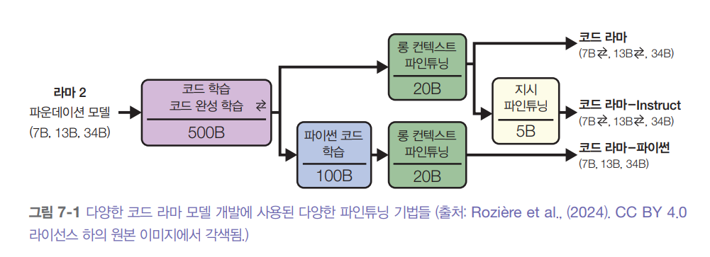
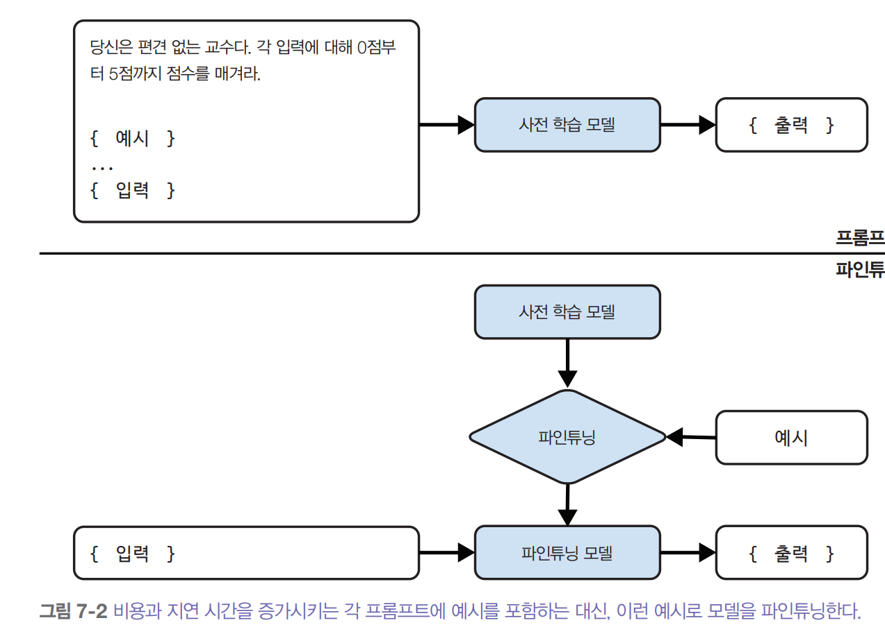
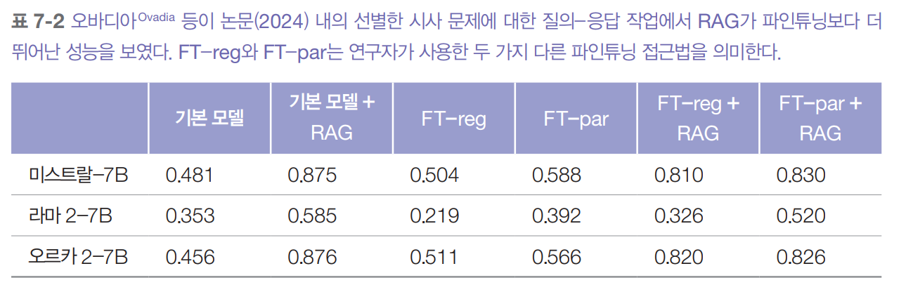

# **파인튜닝**  
파인튜닝은 모델 전체나 일부를 추가로 학습시켜 특정 작업에 맞게 모델을조정하는 과정이다. 파인튜닝은 모델의 가중치를 조정하는 방식으로 모델을 변화시킨다.  
  
파인튜닝을 통해 모델의 다양한 측면을 향상시킬 수 있다. 코딩이나 의료 질의 응답 같은 도메인별 능력을 향상시킬 수 있으며 안전성도 강화할 수 있다. 
하지만 가장 많이 사용되는 목적은 모델의 지시 수행 능력을 향상시키는 것이며 특히 특정 출력 스타일과 형식을 준수하도록 하는 데 사용된다.  
  
파인튜닝은 필요에 맞게 더 맞춤화된 모델을 만들 수 있지만 더 많은 초기 투자가 필요하다. 개발자들이 자주 받는 질문 중 하나는 언제 파인튜닝을 하고 언제 
RAG를 해야 하는가? 이다.  
  
프롬프트 기반 방법과 비교하면 파인튜닝은 훨씬 더 많은 메모리를 필요로 한다. 오늘날 파운데이션 모델은 규모가 매우 커서 단순하게 파인튜닝하는 데에도 
단일 GPU의 가용 메모리를 훌쩍 넘는 용량이 필요할 때가 많다. 이 때문에 파인튜닝은 점점 더 비용이 많이 들고 구현하기 어려워진다. 메모리 요구량 감소는 
많은 파인튜닝 기법의 핵심 목표가 되었다.  
  
최근 파인튜닝 분야에서 메모리 효율성을 높인 파라미터 효율적 파인튜닝(parameter-efficient finetuning, PEFT)이 대세로 자리 잡았다.  
  
프롬프트 기반 방법에서는 ML 모델의 내부 동작을 이해하면 좋지만 반드시 필요하지는 않았다. 하지만 파인튜닝은 모델을 직접 학습시키는 과정이므로 ML 
지식이 필요하다.  
  
# **파인튜닝 개요**  
파인튜닝은 모든 능력을 갖춘 모델이 아닌 필요한 기본적인 능력을 갖춘 기본 모델을 가지고 시작한다. 파인튜닝의 목표는 이 모델이 특정 작업을 충분히 잘 
수행하도록 만드는 것이다.  
  
파인튜닝은 전이 학습(transfer leaning, TL)의 한 방법인데 전이 학습은 1976년 보지노프스키와 풀고시가 처음 제안한 개념이다. 전이 학습은 한 작업에서 
얻은 지식을 새롭지만 관련된 작업에 활용해 학습 속도를 높이는 데 중점을 둔다. 이는 사람이 지식과 기술을 전이하는 방식과 개념적으로 비슷하다. 예를 들어 
피아노를 칠 줄 알면 다른 악기를 더 쉽게 배울 수 있는 것과 같다.  
  
전이 학습의 초기 대규모 성공 사례는 구글의 다국어 번역 시스템이었다. 이 모델은 포르투갈어-영어 및 영어-스페인어 번역에 대한 지식을 전이해 학습 
데이터에 포르투갈어-스페인어 예시가 없었음에도 포르투갈어를 스페인어로 번역할 수 있었다.  
  
딥러닝 초기부터 전이 학습은 학습 데이터가 부족하거나 구하기 어려운 작업에 좋은 해결책이 되어왔다. 풍부한 데이터가 있는 작업에서 기본 모델을 학습시킨 
다음 그 지식을 목표 작업에 활용하는 방식이다.  
  
LLM의 경우 텍스트 완성(데이터가 풍부한 작업)에서 사전 학습으로 얻은 지식은 법률 질의 응답이나 Text-to-SQL 변환 같은 더 전문적인 작업(보통 데이터가 적은)
으로 전이한다. 이런 전이 학습 능력은 파운데이션 모델의 가치를 한층 더 높여준다.  
  
전이 학습은 표본 효율성(sample efficiency)을 높여 모델이 더 적은 예시로도 같은 행동을 학습할 수 있게 한다. 표본 효율이 높은 모델은 적은 데이터로도 
효과적으로 학습한다. 예를 들어 법률 질의 응답을 위해 처음부터 모델을 학습하려면 수백만 개의 예시가 필요할 수 있지만 좋은 기본 모델을 파인튜닝하면 
단 몇백 개만으로도 충분할 수도 있다.  
  
이상적으로는 모델이 학습해야 할 많은 부분이 이미 기본 모델에 내재되어 있고 파인튜닝은 단지 모델의 행동을 다듬는 과정이다. 오픈 AI의 InstructGPT 
관련 논문에서는 파인튜닝을 모델이 이미 갖고 있지만 사용자가 프롬프트만으로는 끌어내기 어려운 능력을 활용 가능하게 만드는 것으로 볼 수 있다고 말했다.  
  
파인튜닝이 전이 학습의 유일한 방법은 아니다. 또 다른 접근법으로는 특성 기반 전이(feature-based transfer)가 있다. 이 방식에서는 모델이 데이터에서 
특성을 추출하도록 학습되며 주로 임베딩 벡터 형태로 추출된 특성을 다른 모델이 활용한다.  
  
특성 기반 전이는 컴퓨터 비전 분야에서 많이 사용된다. 예를 들어 2010년대 후반에 많은 사람이 이미지넷 데이터에서 학습된 모델을 사용해 이미지의 
특성을 추출하고 이런 특성들을 객체 탐지나 이미지 분할 같은 다른 컴퓨터 비전 작업에 활용했다.  
  
파인튜닝은 모델 학습 과정의 일부로 사전 학습의 확장이라고 볼 수 있다. 사전 학습 이후에 모델을 추가로 학습시키는 과정을 통칭하여 파인튜닝이라고 부르며 
그 목적과 방식에 따라 다양한 유형으로 나뉜다.  
  
모델 학습은 보통 자기 지도 학습 방식의 사전 학습에서 시작한다. 자기 지도 학습을 통해 모델은 레이블이 없는 대량의 데이터에서 학습할 수 있다. 언어 모델의 
경우 자시 지도 학습 데이터는 주로 주석이 필요 없는 텍스트 시퀀스다.  
  
비싼 작업별 데이터로 사전 학습 모델을 파인튜닝하기 전에 저렴한 관련 분야 데이터로 먼저 자기 지도 학습을 적용해 볼 수 있다. 예를 들어 법률 질의 응답을 
위해 모델을 파인튜닝할 때는 비싼(질의, 응답) 형태의 주석 데이터로 파인튜닝하기 전에 본 법률 문서로 파인튜닝할 수 있다. 마찬가지로 베트남어 책 요약 
모델을 파인튜닝하려면 대량의 베트남어 텍스트로 먼저 파인튜닝하는 방법이 있다. 이런 자기 지도 파인튜닝은 지속적 사전 학습(continued pre-training)이라고도 
불린다.  
  
언어 모델은 자기회귀 언어 모델과 마스크 언어 모델로 나뉜다. 자기회귀 모델은 이전 토큰들을 컨텍스트로 사용해 시퀀스의 다음 토큰을 예측한다. 마스크 모델은 
앞뒤 토큰을 모두 활용해 빈칸을 채운다. 마찬가지로 지도 파인튜닝을 통해 다음 토큰을 예측하거나 빈칸을 채우도록 모델을 파인튜닝할 수도 있다. 후자는 
인필링 파인튜닝(infilling finetuning)이라도 하며 텍스트 편집 및 코드 디버깅 같은 작업에 특히 유용하다. 자기회귀 방식으로 사전 학습된 모델이라도 
인필링 파인튜닝이 가능하다.  
  
자기 지도 학습을 통해 모델은 세상에 대한 방대한 지식을 얻지만 이 지식을 사용자가 원하는 특정 작업에 바로 활용하기는 어렵다. 또한 모델의 행동이 
사람의 선호와 일치하지 않을 수 있다. 지도 파인튜닝은 이런 격차를 줄이는 역할을 한다. 즉 고품질 주석 데이터를 활용해 모델을 사람의 사용 방식과 선호도에 
맞게 조정한다.  
  
지도 파인튜닝에서는 (입력, 출력) 쌍으로 모델을 학습한다. 입력은 지시가 될 수 있고 출력은 응답이 될 수 있다. 응답은 책 요약처럼 개방형 형태일 수도 있고 
분류 작업처럼 폐쇄형 형태일 수도 있다. 고품질 지시 데이터를 만드는 것은 특히 사실적 일관성, 도메인 전문 지식, 정치적 정확성이 필요한 경우 생성하기 
어렵고 비용이 많이 들 수 있다.  
  
모델은 또한 강화 학습을 통해 사람의 선호도를 최대화하는 응답을 생성하도록 파인튜닝할 수 있다. 선호도 파인튜닝은 주로 (지시, 선호 응답, 비선호 응답) 
형식의 비교 데이터가 필요하다.  
  
컨텍스트 길이를 늘리기 위해 모델을 파인튜닝하는 것도 가능하다. 롱 컨텍스트 파인튜닝(long-context finetuning)은 보통 위치 임베딩 조정 같은 모델 
구조의 수정이 필요하다. 롱 시퀀스는 토큰의 가능한 위치가 더 많다는 뜻이며 위치 임베딩이 이를 처리할 수 있어야 한다. 다른 파인튜닝 기법보다 롱 컨텍스트 
파인튜닝은 더 까다롭다. 결과로 얻어진 모델은 숏 시퀀스에서 성능이 오히려 떨어질 수도 있다.  
  
아래 그림은 다양한 파인튜닝 기법을 사용해 기본 모델 라마 2에서 여러 코드 라마 모델을 개발하는 과정을 보여준다.  
  
  
  
롱 컨텍스트 파인튜닝으로 모델의 최대 컨텍스트 길이를 4096 토큰에서 16384 토큰으로 늘려 더 긴 코드 파일을 다룰 수 있게 했다. 이 이미지에서 지시 
파인튜닝은 지도 파인튜닝을 가리킨다.  
  
파인튜닝은 모델 개발자와 애플리케이션 개발자 모두가 수행할 수 있다. 모델 개발자는 주로 모델을 출시하기 전에 다양한 파인튜닝 기법으로 모델을 사후 
학습시킨다. 모델 개발자는 각기 다른 정도로 파인튜닝된 여러 모델 버전을 출시할 수도 있다. 애플리케이션 개발자가 자신에게 가장 적합한 버전을 고를 
수 있게 할 수도 있다.  
  
애플리케이션 개발자라면 사전 학습된 모델을 파인튜닝할 수도 있지만 대개는 이미 사후 학습된 모델을 파인튜닝하게 된다. 모델이 더 정교하고 작업과 관련된 
지식이 풍부할수록 모델 조정에 들이는 노력이 줄어든다.  
  
# **파인튜닝이 필요한 경우**  
파인튜닝이 정말 적합한 선택인지 먼저 생각해 봐야 한다. 프롬프트 기반 방법과 비교하면 파인튜닝은 많은 데이터와 고사양 하드웨어를 요구할 뿐만 아니라 이를 
다룰 ML 전문가도 필요하다. 이런 이유로 보통 프롬프트 기반 방법을 충분히 시도한 후에 파인튜닝을 시도하는 것이 일반적이다. 하지만 두 방법이 양자택일의 
관계는 아니다. 실제 문제는 두 접근법을 함께 활용해야 하는 경우가 많다.  
  
# **파인튜닝을 해야 하는 이유**  
파인튜닝의 주요 목적은 일반 능력과 특정 작업 수행 능력을 모두 향상시키는 데 있다. 특히 JSON이나 YAML 같은 특정 구조의 출력을 생성할 떄 파인튜닝이 
효과적이다.  
  
다양한 벤치마크에서 뛰어난 성능을 보이는 범용 모델이 특정 작업에서는 성능이 떨어질 수 있다. 사용하려는 모델이 해당 작업에 충분히 학습되지 않았다면 해당 
작업에 관련된 자체 데이터로 파인튜닝하는 것이 특히 효과적이다.  
  
예를 들어 기본 모델이 텍스트를 표준 SQL 문법으로 변환하는 데는 뛰어나도 덜 흔한 SQL 문법에서는 실패할 수 있다. 이런 경우 해당 SQL 문법이 포함된 
데이터로 모델을 파인튜닝하면 도움이 된다. 마찬가지로 모델이 표준 SQL에서는 잘 작동하지만 고객 맞춤 쿼리에서 자주 실패한다면 고객 맞춤 쿼리로 모델을 
파인튜닝하는 것이 효과적이다.  
  
파인튜닝의 흥미로운 활용 사례 중 하나는 편향 완화다. 기본 모델이 학습 데이터의 특정 편향을 반영한다면 파인튜닝 과정에서 신중하게 선별된 데이터를 사용해 
이런 편향을 상쇄할 수 있다. 예를 들어 모델이 CEO를 항상 남성 이름으로 지정한다면 많은 여성 CEO가 포함된 데이터로 파인튜닝해 이런 편향을 줄일 수 있다. 
카리멜라 등의 연구는 BERT 계열 언어 모델을 여성 작가의 텍스트로 파인튜닝하면 성별 편향이 줄어들고 아프리카 작가들의 텍스트로 파인튜닝하면 인종적 
편향이 감소한다는 사실을 발견했다.  
  
큰 모델을 파인튜닝해 더 개선할 수도 있지만 작은 모델을 파인튜닝하는 경우가 훨씬 더 일반적이다. 작은 모델은 메모리 요구량이 적어 파인튜닝하기 쉽고 
운영 환경에서도 더 저렴하고 빠르게 사용할 수 있다.  
  
큰 모델이 생성한 데이터로 작은 모델을 학습시켜 마치 큰 모델처럼 작동하게 만드는 방식이 흔히 쓰인다. 이 방식은 큰 모델의 지식을 더 작은 모델에 
효율적으로 전달하는 과정인데 마치 복잡한 혼합물에서 핵심 성분을 추출하는 증류 과정과 유사해 동일하게 증류(distillation)라고 불른다.  
  
특정 작업에 파인튜닝된 작은 모델이 같은 작업에서 훨씬 더 큰 기본 모델보다 뛰어난 성능을 보일 수 있다. 예를 들어 그래머리는 파인튜닝된 Flan-T5 
모델이 텍스트 편집에 특화된 GPT-3 변형보다 다양한 글쓰기 보조 작업에서 더 좋은 성능을 보여줬다. 이 파인튜닝 과정에는 단 82000개의 (지시, 출력) 쌍만 
사용됐는데 (60배나 작은 크기) 이는 텍스트 편집 모델을 처음부터 학습시키는 데 필요한 일반적인 데이터량보다 훨씬 적은 양이다.  
  
파운데이션 모델 초기에는 가장 강력한 모델들이 파인튜닝 접근이 제한된 상업용이어서 파인튜닝할만한 경쟁력 있는 모델이 많지 않았다. 하지만 오픈 소스 
커뮤니티가 다양한 도메인에 맞춰진 여러 크기의 고품질 모델을 계속 개발하면서 파인튜닝은 훨씬 더 실현 가능하고 매력적인 선택지가 되었다.  
  
# **파인튜닝을 하지 말아야 하는 이유**  
파인튜닝이 모델을 여러 면에서 개선할 수 있지만 이런 개선 대부분은 파인튜닝 없이도 어느 정도 달성할 수 있다. 파인튜닝으로 모델 성능을 향상시킬 수 
있지만 잘 작성된 프롬프트와 컨텍스트도 비슷한 효과를 낸다. 특히 구조화된 출력에 파인튜닝이 도움되지만 다른 여러 기법으로도 비슷한 수준의 결과를 얻을 
수 있다.  
  
첫째, 특정 작업을 위해 모델을 파인튜닝하면 그 작업에서는 성능이 향상될 수 있지만 다른 작업에서는 오히려 성능이 떨어질 수 있다. 이는 다양한 프롬프트를 
사용해야 하는 애플리케이션에서는 이런 문제가 상당히 답답할 수 있다.  
  
예를 들어 제품 추천, 주문 변경, 일반 피드백이라는 세 가지 유형의 질의를 처리할 모델이 필요하다고 해보자. 원래 모델은 제품 추천과 일반 피드백은 잘 
작동하지만 주문 변경에는 성능이 좋지 않았다. 이 문제를 해결하기 위해 주문 변경에 관한 (질의, 응답) 쌍 데이터셋으로 모델을 파인튜닝했다. 파인튜닝된 
모델은 튜닝된 유형의 작업에는 더 나은 성능을 보일 수 있지만 다른 두 작업에서는 성능이 떨어질 수 있다.  
  
이런 상황에서는 어떻게 해야 할까? 물론 주문 변경뿐만 아니라 필요한 모든 질의에 대해 모델을 파인튜닝할 수 있다. 만약 모든 작업에서 잘 작동하게 
만들기 어렵다면 다른 작업에 별도 모델을 사용하는 것도 방법이다. 이런 별도 모델들을 하나로 합쳐 서빙을 쉽게 하고 싶다면 모델 병합을 고려해 볼 수 있다.  
  
프로젝트 실험을 막 시작하는 단계라면 파인튜닝은 가장 먼저 시도할 방법이 아니다. 파인튜닝은 초기 투자가 크고 지속적인 관리가 필요하다. 첫째, 데이터가 
필요하다. 주석이 달린 데이터는 수동으로 모으는 데에 시간이 걸리고 비용이 많이 드는데 특히 비판적 사고와 도메인 전문 지식이 필요한 작업에서는 더욱 그렇다. 
오픈 소스 데이터와 AI 생성 데이터로 비용을 줄일 수는 있지만 효과는 경우에 따라 크게 다르다.  
  
둘째, 파인튜닝은 모델 학습 방법에 대한 지식이 필요하다. 파인튜닝할 모델을 선택하기 위해 기본 모델을 평가해야 한다. 필요와 자원에 따라 선택지가 
제한될 수 있다. 파인튜닝 프레임워크와 API가 실제 파인튜닝 과정의 많은 단계를 자동화할 수 있지만 여전히 조정할 수 있는 다야한 학습 파라미터를 이해하고 
학습 과정을 모니터링하며 문제가 발생했을 때 디버깅할 줄 알아야 한다. 예를 들어 옵티마이저 작동 방식, 적절한 학습률, 필요한 학습 데이터 양, 과적합/과소적합 
해결 방법, 전체 과정에서 모델을 평가하는 방법 등을 이해해야 한다.  
  
셋째, 파인튜닝된 모델을 얻은 후에는 이를 서빙하는 방법을 알아내야 한다. 직접 호스팅할 것인지 아니면 API 서비스를 사용할지 정해야 한다. 대규모 모델 
특히 LLM의 추론 최적화는 결코 간단하지 않다. 이미 모델을 내부에서 호스팅하고 있고 모델 운영 방법에 익숙하다면 파인튜닝은 기술적으로 덜 어렵다.  
  
더 중요한 것은 모델을 모니터링하고 유지보수하며 업데이트하기 위한 정책과 예산을 수립해야 한다는 점이다. 파인튜닝된 모델을 계속 개선하는 동안에도 
새로운 기본 모델들이 빠른 속도로 개발되고 있다. 이런 기본 모델들은 여러분이 파인튜닝된 모델을 개선할 수 있는 속도보다 더 빠르게 발전할 수 있다. 
새로 나온 베이스 모델이 내가 공들여 파인튜닝한 모델보다 특정 작업에서 더 뛰어난 성능을 보인다고 가정해 보자. 과연 성능이 얼마나 좋아져야 새로운 
모델로 갈아탈 만한 가치가 있을까? 반대로 새로운 기본 모델이 당장은 기존 모델보다 못하지만 파인튜닝을 거치면 더 좋아질 잠재력이 보인다면 어떨까? 
이 모델로 실험해야 할까?  
  
실제로 더 좋은 모델로 바꿔도 성능 향상은 미미한 수준에 그치는 경우가 많다. 그래서 새로운 활용 사례를 개발하는 것처럼 더 큰 수익이 기대되는 다른 
프로젝트에 밀려 우선순위가 낮아지곤 한다. AI 엔지니어링 실험은 프롬프팅부터 시작하는 것이 좋다. 프롬프팅만으로 부족할 떄만 더 고급 솔루션을 고려하자. 
다양한 프롬프트를 철저히 테스트했는지 확인해야 한다. 모델의 성능은 프롬프트에 따라 크게 달라질 수 있다.  
  
많은 실무자가 비슷한 경험을 이야기한다. 누군가는 프롬프팅이 효과 없다고 불평하며 파인튜닝을 고집하기도 했다. 이를 자세히 조사해 보면 보통 프롬프트 
실험이 최소한으로만 진행됐고 체계적이지 않았다는 사실이 드러난다. 지시가 명확하지 않았고 예시가 실제 데이터를 제대로 반영하지 않았으며 평가 지표가 
제대로 정의되지 않았다. 프롬프트 실험 방식을 개선한 결과 프롬프트 품질이 크게 향상되어 대부분의 애플리케이션에서 요구하는 수준을 충분히 만족시킬 수 
있게 되었다.  
  
- 도메인 특화 작업 파인튜닝  
범용 모델이 특정 도메인 작업에 잘 작동하지 않으므로 일단 특정 작업에 맞게 모델을 파인튜닝하거나 학습시켜야 한다는 주장을 조심하자. 범용 모델의 모든 
능력이 더 강력해질수록 특정 도메인 작업에도 더 능숙해져 도메인 특화 모델보다 오히려 더 나은 성능을 보일 수 있다.  
  
초기 도메인 특화 모델의 흥미로운 사례는 2023년 3월 블룸버그가 공개한 블룸버그GPT가 있다. 당시 시장에서 가장 강력한 모델들은 모두 독점 모델이었고 
블룸버그는 금융 작업에 좋은 성능을 보이면서도 민감한 데이터를 다루는 업무를 위해 사내에서 호스팅할 수 있는 중간 규모의 모델을 원했다. 500억 개의 
파라미터를 가진 이 모델은 학습에 A100 GPU를 130만 시간이나 사용했다. 데이터 비용을 제외한 컴퓨팅 비용만 약 130만~260만 달러로 추정됐다.  
  
같은 달에 오픈 AI는 GPT-4-0314를 출시했다. 리 등의 연구에 따르면 GPT-4-0314는 다양한 금융 벤치마크에서 블룸버그GPT를 크게 앞섰다. 아래 표는 
이런 벤치마크 중 두 가지에 대한 정보를 보여준다.  
  
  
  
그 이후로 GPT-4에 버금가는 성능을 가진 여러 중간 규모 모델이 출시됐는데 여기에는 클로드 3.5 소넷(700억 파라미터), 라마 3-70B-Insturct, 그리고 
Qwen2-72B-Instruct가 포함된다. 뒤의 두 모델은 오픈 웨이트 방식(내부 구조와 학습된 파라미터가 공개)이라 누구나 이 모델을 자체 호스팅할 수 있다.  
  
물론 벤치마크만으로는 실제 성능을 완전히 파악하기 어렵기 떄문에 블룸버그GPT가 블룸버그의 특정 활용 사례에 잘 작동할 가능성이 있다. 또한 블룸버그 
팀은 이 모델을 학습시키면서 값진 경험을 쌓았을 것이며 이를 앞으로 더 나은 모델을 개발하고 운영할 수 있게 되었을 것이다.  
  
파인튜닝과 프롬프팅 실험 모두 체계적인 접근 방식이 필요하다. 프롬프트 실험을 진행하면 개발자들은 평가 파이프라인, 데이터 주석 가이드라인, 실험 추적 
방법 등을 구축할 수 있으며 이는 파인튜닝의 기반이 된다.  
  
프롬프트 캐싱이 도입되기 전에는 파인튜닝의 큰 장점 중 하나가 토큰 사용을 최적화하는 데 도움이 된다는 것이었다. 프롬프트에 예시를 많이 넣을수록 
모델이 처리해야 할 입력 토큰이 늘어나 처리 속도가 느려지고 비용도 증가한다. 매번 프롬프트에 예시를 포함하는 대신 이런 예시로 모델을 파인튜닝하면 
아래 그림에서 볼 수 있듯이 파인튜닝된 모델에는 더 짧은 프롬프트만으로도 같은 결과를 얻을 수 있다.  
  
  
  
이제는 반복적인 프롬프트 부분을 저장했다가 재사용할 수 있는 프롬프트 캐싱 기술이 도입되면서 이런 장점은 크게 줄어들었다. 그래도 여전히 프롬프트와 
함께 사용할 수 있는 예시 수는 최대 컨텍스트 길이에 제한을 받는 반면 파인튜닝에서는 활용할 수 있는 예시 수에 제한이 없다.  
  
# **파인튜닝과 RAG**  
프롬프팅을 통해 모델의 성능을 최대한 끌어올렸다면 다음으로 RAG를 적용할지 파인튜닝을 할지 고민하게 된다. 이 선택은 모델 오류의 원인이 정보 부족인지 
행동 방식의 문제인지에 따라 달라진다.  
  
모델이 정보가 부족해서 오답을 내놓는다면 관련 정보 소스에 접근할 수 있게 해주는 RAG 시스템이 효과적이다. 정보 기반 오류는 출력 내용이 사실과 
다르거나 정보가 오래된 경우에 발생한다. 정보 부족으로 인한 오류가 발생하는 두 가지 상황은 다음과 같다.  
  
- 모델이 정보를 가지고 있지 않은 경우  
공개 모델은 사용자나 조직의 비공개 정보를 알지 못하는 경우가 많다. 모델이 정보를 모르면 그 사실을 알려주거나 응답을 지어내게 된다.  
- 모델의 정보가 오래된 경우  
"테일러 스위프트는 정규 앨범을 몇 개 발매했나요?"라는 질의에 정답이 11개인데 모델이 10개라고 답한다면 이는 모델의 지식 기준 날짜가 최신 앨범 발매 
이전이었기 떄문일 수 있다.  
  
Fine-Tuning or Retrieval? 논문은 시사 문제에 관한 질의와 최신 정보가 필요한 작업에서는 RAG가 파인튜닝된 모델보다 더 좋은 성능을 보인다는 점을 
입증했다. 더 흥미로운 점은 아래 표에서 볼 수 있듯이 기본 모델을 사용한 RAG가 파인튜닝된 모델을 사용한 RAG보다도 더 나은 결과를 냈다는 것이다. 이는 
파인튜닝이 특정 작업의 성능은 높여줄 수 있지만 다른 영역에서는 오히려 성능이 떨어질 수 있음을 보여준다.  
  
  
  
반면에 모델의 행동 방식에 문제가 있다면 파인튜닝이 도움이 될 수 있다. 행동 방식의 문제 중 하나는 모델의 출력이 사실 관계는 맞지만 요청한 작업과 전혀 
무관한 경우다. 예를 들어 엔지니어링 팀에 제공할 소프트웨어 프로젝트의 기술 명세서를 만들어달라고 모델에 요청했다고 하자. 생성된 명세서가 정확하더라도 
팀이 실제로 필요로 하는 세부 사항이 없을 수 있다. 이때 모델을 파인튜닝하면 더 관련 있는 명세서를 얻을 수 있다.  
  
또 다른 문제는 모델이 원하는 출력 형식을 제대로 따르지 못하는 경우다. 예를 들어 모델에게 HTML 코드 작성을 요청했는데 생성된 코드가 제대로 작동하지 
않는다면 이는 모델이 학습 과정에서 HTML에 충분히 노출되지 않았기 떄문일 수 있다. 이때는 파인튜닝을 통해 더 많은 HTML 코드 예시를 학습시켜 이 문제를 
해결할 수 있다.  
  
시맨틱 파싱(semantic parsing)은 모델이 정해진 형식에 맞춰 출력을 생성하는 능력이 작업의 성패를 좌우한다. 이런 이유로 시맨틱 파싱 작업에는 종종 
파인튜닝이 필요하다. 시맨틱 파싱은 자연어를 JSON 같은 구조화된 형식으로 변환하는 과정이다.  
  
강력한 기성 모델은 일반적으로 JSON, YAML 및 정규 표현식 같은 흔하고 덜 복잡한 구문에 강하다. 하지만 인터넷에서 예시를 찾기 어려운 구문, 예를 들어 
덜 유명한 도구의 특수 언어나 복잡한 구문에는 성능이 떨어질 수 있다.  
  
요약하자면 파인튜닝은 형식을 위한 것이고 RAG는 사실을 위한 것이다. RAG 시스템은 모델에 외부 지식을 제공해 더 정확하고 유익한 응답을 만들 수 있게 
한다. 이는 모델의 환각 현상을 줄이는 데 도움이 될 수 있다. 반면에 파인튜닝은 모델이 특정 문구와 스타일을 이해하고 따르는 데 도움을 준다. 파인튜닝도 충분한 
고품질 데이터로 진행한다면 모델의 환각 현상을 줄일 수도 있지만 데이터 품질이 낮으면 오히려 더 심하게 만들 수도 있다.  
  
모델이 정보와 행동 측면 모두에 문제가 있다면 RAG부터 시작하는 것이 좋다. RAG는 일반적으로 학습 데이터를 수집하거나 파인튜닝된 모델을 별도로 운영할 
필요가 없어 더 쉽게 접근할 수 있다. RAG를 구현할 떄는 복잡한 벡터 데이터베이스로 바로 뛰어들기보다 BM25 같은 단순한 키워드 기반 검색부터 시작하는 
것이 좋다.  
  
RAG는 파인튜닝보다 더 큰 성능 향상을 가져올 수 있다. 오바디아 등의 논문은 MMLU 벤치마크의 거의 모든 질의 유형에서 RAG가 파인튜닝보다 뛰어난 
성능을 보인다는 점을 세 가지 모델(미스트랄-7B, 라마 2-7B, 오르카 2-7B)로 입증했다.  
  
하지만 RAG와 파인튜닝은 상호 배타적이지 않다. 떄로는 둘을 함께 사용해 애플리케이션의 성능을 극대화할 수 있다. 같은 연구에서 오바디아 등은 파인튜닝된 
모델에 RAG를 추가하면 MMLU 벤치마크에서 43%의 시나리오에서 성능이 향상된다는 결과를 보여줬다. 하지만 주목할 점은 나머지 57%에서는 파인튜닝된 
모델과 RAG를 함께 사용하는 것이 RAG만 단독으로 쓰는 것보다 어떤 성능 개선도 가져오지 못했다는 점이다.  
  
