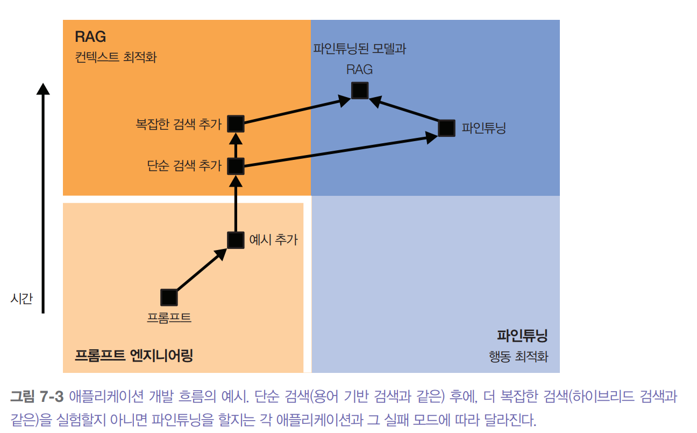
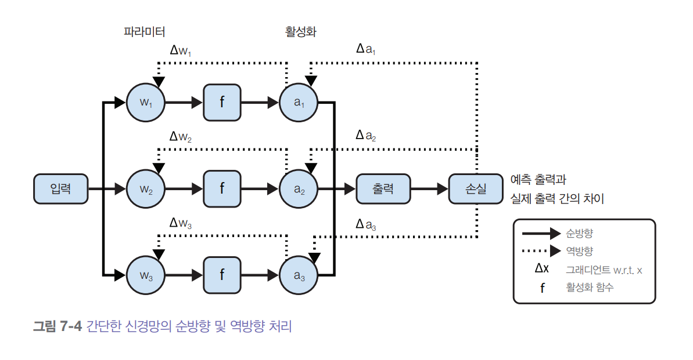
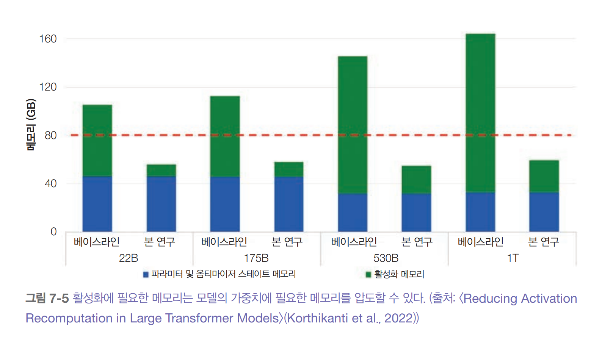
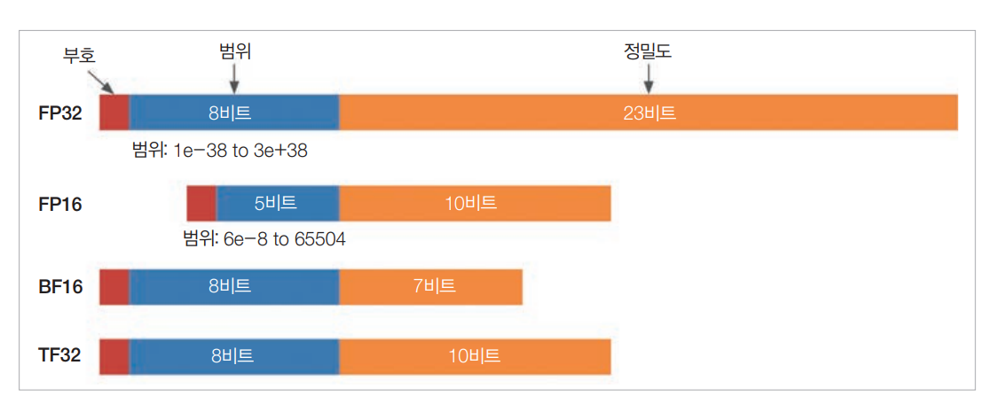
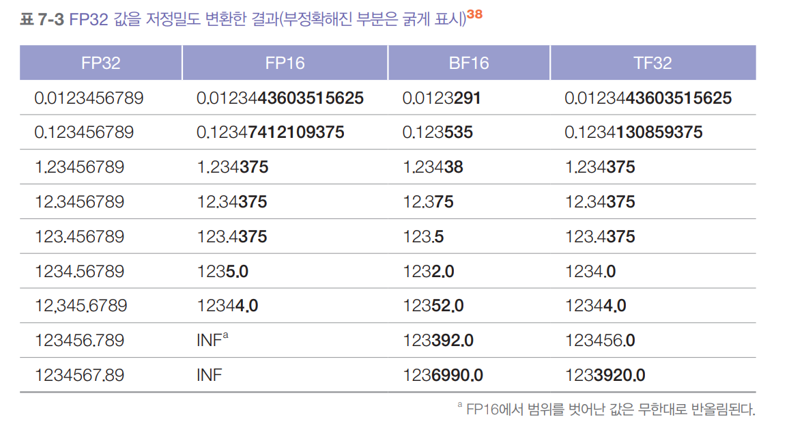
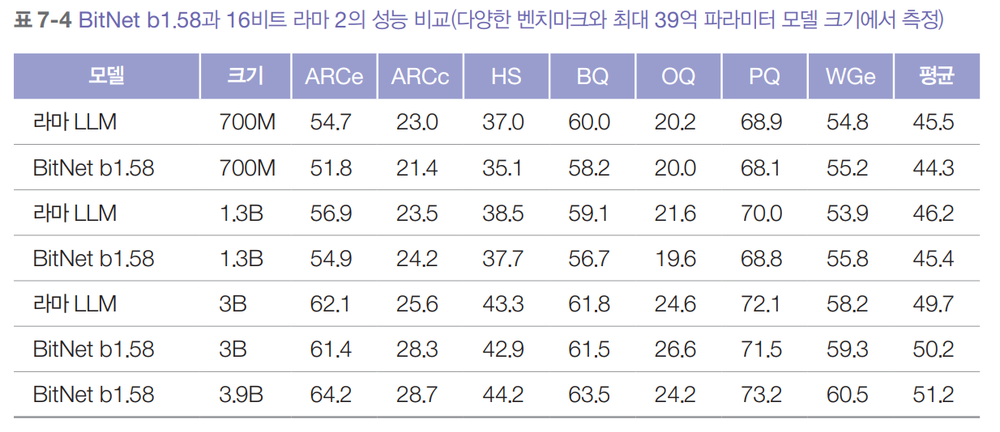
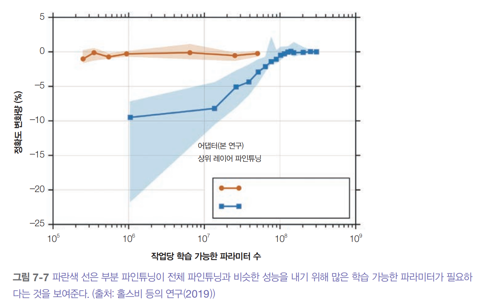

# **파인튜닝**  
파인튜닝은 모델 전체나 일부를 추가로 학습시켜 특정 작업에 맞게 모델을조정하는 과정이다. 파인튜닝은 모델의 가중치를 조정하는 방식으로 모델을 변화시킨다.  
  
파인튜닝을 통해 모델의 다양한 측면을 향상시킬 수 있다. 코딩이나 의료 질의 응답 같은 도메인별 능력을 향상시킬 수 있으며 안전성도 강화할 수 있다. 
하지만 가장 많이 사용되는 목적은 모델의 지시 수행 능력을 향상시키는 것이며 특히 특정 출력 스타일과 형식을 준수하도록 하는 데 사용된다.  
  
파인튜닝은 필요에 맞게 더 맞춤화된 모델을 만들 수 있지만 더 많은 초기 투자가 필요하다. 개발자들이 자주 받는 질문 중 하나는 언제 파인튜닝을 하고 언제 
RAG를 해야 하는가? 이다.  
  
프롬프트 기반 방법과 비교하면 파인튜닝은 훨씬 더 많은 메모리를 필요로 한다. 오늘날 파운데이션 모델은 규모가 매우 커서 단순하게 파인튜닝하는 데에도 
단일 GPU의 가용 메모리를 훌쩍 넘는 용량이 필요할 때가 많다. 이 때문에 파인튜닝은 점점 더 비용이 많이 들고 구현하기 어려워진다. 메모리 요구량 감소는 
많은 파인튜닝 기법의 핵심 목표가 되었다.  
  
최근 파인튜닝 분야에서 메모리 효율성을 높인 파라미터 효율적 파인튜닝(parameter-efficient finetuning, PEFT)이 대세로 자리 잡았다.  
  
프롬프트 기반 방법에서는 ML 모델의 내부 동작을 이해하면 좋지만 반드시 필요하지는 않았다. 하지만 파인튜닝은 모델을 직접 학습시키는 과정이므로 ML 
지식이 필요하다.  
  
# **파인튜닝 개요**  
파인튜닝은 모든 능력을 갖춘 모델이 아닌 필요한 기본적인 능력을 갖춘 기본 모델을 가지고 시작한다. 파인튜닝의 목표는 이 모델이 특정 작업을 충분히 잘 
수행하도록 만드는 것이다.  
  
파인튜닝은 전이 학습(transfer leaning, TL)의 한 방법인데 전이 학습은 1976년 보지노프스키와 풀고시가 처음 제안한 개념이다. 전이 학습은 한 작업에서 
얻은 지식을 새롭지만 관련된 작업에 활용해 학습 속도를 높이는 데 중점을 둔다. 이는 사람이 지식과 기술을 전이하는 방식과 개념적으로 비슷하다. 예를 들어 
피아노를 칠 줄 알면 다른 악기를 더 쉽게 배울 수 있는 것과 같다.  
  
전이 학습의 초기 대규모 성공 사례는 구글의 다국어 번역 시스템이었다. 이 모델은 포르투갈어-영어 및 영어-스페인어 번역에 대한 지식을 전이해 학습 
데이터에 포르투갈어-스페인어 예시가 없었음에도 포르투갈어를 스페인어로 번역할 수 있었다.  
  
딥러닝 초기부터 전이 학습은 학습 데이터가 부족하거나 구하기 어려운 작업에 좋은 해결책이 되어왔다. 풍부한 데이터가 있는 작업에서 기본 모델을 학습시킨 
다음 그 지식을 목표 작업에 활용하는 방식이다.  
  
LLM의 경우 텍스트 완성(데이터가 풍부한 작업)에서 사전 학습으로 얻은 지식은 법률 질의 응답이나 Text-to-SQL 변환 같은 더 전문적인 작업(보통 데이터가 적은)
으로 전이한다. 이런 전이 학습 능력은 파운데이션 모델의 가치를 한층 더 높여준다.  
  
전이 학습은 표본 효율성(sample efficiency)을 높여 모델이 더 적은 예시로도 같은 행동을 학습할 수 있게 한다. 표본 효율이 높은 모델은 적은 데이터로도 
효과적으로 학습한다. 예를 들어 법률 질의 응답을 위해 처음부터 모델을 학습하려면 수백만 개의 예시가 필요할 수 있지만 좋은 기본 모델을 파인튜닝하면 
단 몇백 개만으로도 충분할 수도 있다.  
  
이상적으로는 모델이 학습해야 할 많은 부분이 이미 기본 모델에 내재되어 있고 파인튜닝은 단지 모델의 행동을 다듬는 과정이다. 오픈 AI의 InstructGPT 
관련 논문에서는 파인튜닝을 모델이 이미 갖고 있지만 사용자가 프롬프트만으로는 끌어내기 어려운 능력을 활용 가능하게 만드는 것으로 볼 수 있다고 말했다.  
  
파인튜닝이 전이 학습의 유일한 방법은 아니다. 또 다른 접근법으로는 특성 기반 전이(feature-based transfer)가 있다. 이 방식에서는 모델이 데이터에서 
특성을 추출하도록 학습되며 주로 임베딩 벡터 형태로 추출된 특성을 다른 모델이 활용한다.  
  
특성 기반 전이는 컴퓨터 비전 분야에서 많이 사용된다. 예를 들어 2010년대 후반에 많은 사람이 이미지넷 데이터에서 학습된 모델을 사용해 이미지의 
특성을 추출하고 이런 특성들을 객체 탐지나 이미지 분할 같은 다른 컴퓨터 비전 작업에 활용했다.  
  
파인튜닝은 모델 학습 과정의 일부로 사전 학습의 확장이라고 볼 수 있다. 사전 학습 이후에 모델을 추가로 학습시키는 과정을 통칭하여 파인튜닝이라고 부르며 
그 목적과 방식에 따라 다양한 유형으로 나뉜다.  
  
모델 학습은 보통 자기 지도 학습 방식의 사전 학습에서 시작한다. 자기 지도 학습을 통해 모델은 레이블이 없는 대량의 데이터에서 학습할 수 있다. 언어 모델의 
경우 자시 지도 학습 데이터는 주로 주석이 필요 없는 텍스트 시퀀스다.  
  
비싼 작업별 데이터로 사전 학습 모델을 파인튜닝하기 전에 저렴한 관련 분야 데이터로 먼저 자기 지도 학습을 적용해 볼 수 있다. 예를 들어 법률 질의 응답을 
위해 모델을 파인튜닝할 때는 비싼(질의, 응답) 형태의 주석 데이터로 파인튜닝하기 전에 본 법률 문서로 파인튜닝할 수 있다. 마찬가지로 베트남어 책 요약 
모델을 파인튜닝하려면 대량의 베트남어 텍스트로 먼저 파인튜닝하는 방법이 있다. 이런 자기 지도 파인튜닝은 지속적 사전 학습(continued pre-training)이라고도 
불린다.  
  
언어 모델은 자기회귀 언어 모델과 마스크 언어 모델로 나뉜다. 자기회귀 모델은 이전 토큰들을 컨텍스트로 사용해 시퀀스의 다음 토큰을 예측한다. 마스크 모델은 
앞뒤 토큰을 모두 활용해 빈칸을 채운다. 마찬가지로 지도 파인튜닝을 통해 다음 토큰을 예측하거나 빈칸을 채우도록 모델을 파인튜닝할 수도 있다. 후자는 
인필링 파인튜닝(infilling finetuning)이라도 하며 텍스트 편집 및 코드 디버깅 같은 작업에 특히 유용하다. 자기회귀 방식으로 사전 학습된 모델이라도 
인필링 파인튜닝이 가능하다.  
  
자기 지도 학습을 통해 모델은 세상에 대한 방대한 지식을 얻지만 이 지식을 사용자가 원하는 특정 작업에 바로 활용하기는 어렵다. 또한 모델의 행동이 
사람의 선호와 일치하지 않을 수 있다. 지도 파인튜닝은 이런 격차를 줄이는 역할을 한다. 즉 고품질 주석 데이터를 활용해 모델을 사람의 사용 방식과 선호도에 
맞게 조정한다.  
  
지도 파인튜닝에서는 (입력, 출력) 쌍으로 모델을 학습한다. 입력은 지시가 될 수 있고 출력은 응답이 될 수 있다. 응답은 책 요약처럼 개방형 형태일 수도 있고 
분류 작업처럼 폐쇄형 형태일 수도 있다. 고품질 지시 데이터를 만드는 것은 특히 사실적 일관성, 도메인 전문 지식, 정치적 정확성이 필요한 경우 생성하기 
어렵고 비용이 많이 들 수 있다.  
  
모델은 또한 강화 학습을 통해 사람의 선호도를 최대화하는 응답을 생성하도록 파인튜닝할 수 있다. 선호도 파인튜닝은 주로 (지시, 선호 응답, 비선호 응답) 
형식의 비교 데이터가 필요하다.  
  
컨텍스트 길이를 늘리기 위해 모델을 파인튜닝하는 것도 가능하다. 롱 컨텍스트 파인튜닝(long-context finetuning)은 보통 위치 임베딩 조정 같은 모델 
구조의 수정이 필요하다. 롱 시퀀스는 토큰의 가능한 위치가 더 많다는 뜻이며 위치 임베딩이 이를 처리할 수 있어야 한다. 다른 파인튜닝 기법보다 롱 컨텍스트 
파인튜닝은 더 까다롭다. 결과로 얻어진 모델은 숏 시퀀스에서 성능이 오히려 떨어질 수도 있다.  
  
아래 그림은 다양한 파인튜닝 기법을 사용해 기본 모델 라마 2에서 여러 코드 라마 모델을 개발하는 과정을 보여준다.  
  
  
  
롱 컨텍스트 파인튜닝으로 모델의 최대 컨텍스트 길이를 4096 토큰에서 16384 토큰으로 늘려 더 긴 코드 파일을 다룰 수 있게 했다. 이 이미지에서 지시 
파인튜닝은 지도 파인튜닝을 가리킨다.  
  
파인튜닝은 모델 개발자와 애플리케이션 개발자 모두가 수행할 수 있다. 모델 개발자는 주로 모델을 출시하기 전에 다양한 파인튜닝 기법으로 모델을 사후 
학습시킨다. 모델 개발자는 각기 다른 정도로 파인튜닝된 여러 모델 버전을 출시할 수도 있다. 애플리케이션 개발자가 자신에게 가장 적합한 버전을 고를 
수 있게 할 수도 있다.  
  
애플리케이션 개발자라면 사전 학습된 모델을 파인튜닝할 수도 있지만 대개는 이미 사후 학습된 모델을 파인튜닝하게 된다. 모델이 더 정교하고 작업과 관련된 
지식이 풍부할수록 모델 조정에 들이는 노력이 줄어든다.  
  
# **파인튜닝이 필요한 경우**  
파인튜닝이 정말 적합한 선택인지 먼저 생각해 봐야 한다. 프롬프트 기반 방법과 비교하면 파인튜닝은 많은 데이터와 고사양 하드웨어를 요구할 뿐만 아니라 이를 
다룰 ML 전문가도 필요하다. 이런 이유로 보통 프롬프트 기반 방법을 충분히 시도한 후에 파인튜닝을 시도하는 것이 일반적이다. 하지만 두 방법이 양자택일의 
관계는 아니다. 실제 문제는 두 접근법을 함께 활용해야 하는 경우가 많다.  
  
# **파인튜닝을 해야 하는 이유**  
파인튜닝의 주요 목적은 일반 능력과 특정 작업 수행 능력을 모두 향상시키는 데 있다. 특히 JSON이나 YAML 같은 특정 구조의 출력을 생성할 떄 파인튜닝이 
효과적이다.  
  
다양한 벤치마크에서 뛰어난 성능을 보이는 범용 모델이 특정 작업에서는 성능이 떨어질 수 있다. 사용하려는 모델이 해당 작업에 충분히 학습되지 않았다면 해당 
작업에 관련된 자체 데이터로 파인튜닝하는 것이 특히 효과적이다.  
  
예를 들어 기본 모델이 텍스트를 표준 SQL 문법으로 변환하는 데는 뛰어나도 덜 흔한 SQL 문법에서는 실패할 수 있다. 이런 경우 해당 SQL 문법이 포함된 
데이터로 모델을 파인튜닝하면 도움이 된다. 마찬가지로 모델이 표준 SQL에서는 잘 작동하지만 고객 맞춤 쿼리에서 자주 실패한다면 고객 맞춤 쿼리로 모델을 
파인튜닝하는 것이 효과적이다.  
  
파인튜닝의 흥미로운 활용 사례 중 하나는 편향 완화다. 기본 모델이 학습 데이터의 특정 편향을 반영한다면 파인튜닝 과정에서 신중하게 선별된 데이터를 사용해 
이런 편향을 상쇄할 수 있다. 예를 들어 모델이 CEO를 항상 남성 이름으로 지정한다면 많은 여성 CEO가 포함된 데이터로 파인튜닝해 이런 편향을 줄일 수 있다. 
카리멜라 등의 연구는 BERT 계열 언어 모델을 여성 작가의 텍스트로 파인튜닝하면 성별 편향이 줄어들고 아프리카 작가들의 텍스트로 파인튜닝하면 인종적 
편향이 감소한다는 사실을 발견했다.  
  
큰 모델을 파인튜닝해 더 개선할 수도 있지만 작은 모델을 파인튜닝하는 경우가 훨씬 더 일반적이다. 작은 모델은 메모리 요구량이 적어 파인튜닝하기 쉽고 
운영 환경에서도 더 저렴하고 빠르게 사용할 수 있다.  
  
큰 모델이 생성한 데이터로 작은 모델을 학습시켜 마치 큰 모델처럼 작동하게 만드는 방식이 흔히 쓰인다. 이 방식은 큰 모델의 지식을 더 작은 모델에 
효율적으로 전달하는 과정인데 마치 복잡한 혼합물에서 핵심 성분을 추출하는 증류 과정과 유사해 동일하게 증류(distillation)라고 불른다.  
  
특정 작업에 파인튜닝된 작은 모델이 같은 작업에서 훨씬 더 큰 기본 모델보다 뛰어난 성능을 보일 수 있다. 예를 들어 그래머리는 파인튜닝된 Flan-T5 
모델이 텍스트 편집에 특화된 GPT-3 변형보다 다양한 글쓰기 보조 작업에서 더 좋은 성능을 보여줬다. 이 파인튜닝 과정에는 단 82000개의 (지시, 출력) 쌍만 
사용됐는데 (60배나 작은 크기) 이는 텍스트 편집 모델을 처음부터 학습시키는 데 필요한 일반적인 데이터량보다 훨씬 적은 양이다.  
  
파운데이션 모델 초기에는 가장 강력한 모델들이 파인튜닝 접근이 제한된 상업용이어서 파인튜닝할만한 경쟁력 있는 모델이 많지 않았다. 하지만 오픈 소스 
커뮤니티가 다양한 도메인에 맞춰진 여러 크기의 고품질 모델을 계속 개발하면서 파인튜닝은 훨씬 더 실현 가능하고 매력적인 선택지가 되었다.  
  
# **파인튜닝을 하지 말아야 하는 이유**  
파인튜닝이 모델을 여러 면에서 개선할 수 있지만 이런 개선 대부분은 파인튜닝 없이도 어느 정도 달성할 수 있다. 파인튜닝으로 모델 성능을 향상시킬 수 
있지만 잘 작성된 프롬프트와 컨텍스트도 비슷한 효과를 낸다. 특히 구조화된 출력에 파인튜닝이 도움되지만 다른 여러 기법으로도 비슷한 수준의 결과를 얻을 
수 있다.  
  
첫째, 특정 작업을 위해 모델을 파인튜닝하면 그 작업에서는 성능이 향상될 수 있지만 다른 작업에서는 오히려 성능이 떨어질 수 있다. 이는 다양한 프롬프트를 
사용해야 하는 애플리케이션에서는 이런 문제가 상당히 답답할 수 있다.  
  
예를 들어 제품 추천, 주문 변경, 일반 피드백이라는 세 가지 유형의 질의를 처리할 모델이 필요하다고 해보자. 원래 모델은 제품 추천과 일반 피드백은 잘 
작동하지만 주문 변경에는 성능이 좋지 않았다. 이 문제를 해결하기 위해 주문 변경에 관한 (질의, 응답) 쌍 데이터셋으로 모델을 파인튜닝했다. 파인튜닝된 
모델은 튜닝된 유형의 작업에는 더 나은 성능을 보일 수 있지만 다른 두 작업에서는 성능이 떨어질 수 있다.  
  
이런 상황에서는 어떻게 해야 할까? 물론 주문 변경뿐만 아니라 필요한 모든 질의에 대해 모델을 파인튜닝할 수 있다. 만약 모든 작업에서 잘 작동하게 
만들기 어렵다면 다른 작업에 별도 모델을 사용하는 것도 방법이다. 이런 별도 모델들을 하나로 합쳐 서빙을 쉽게 하고 싶다면 모델 병합을 고려해 볼 수 있다.  
  
프로젝트 실험을 막 시작하는 단계라면 파인튜닝은 가장 먼저 시도할 방법이 아니다. 파인튜닝은 초기 투자가 크고 지속적인 관리가 필요하다. 첫째, 데이터가 
필요하다. 주석이 달린 데이터는 수동으로 모으는 데에 시간이 걸리고 비용이 많이 드는데 특히 비판적 사고와 도메인 전문 지식이 필요한 작업에서는 더욱 그렇다. 
오픈 소스 데이터와 AI 생성 데이터로 비용을 줄일 수는 있지만 효과는 경우에 따라 크게 다르다.  
  
둘째, 파인튜닝은 모델 학습 방법에 대한 지식이 필요하다. 파인튜닝할 모델을 선택하기 위해 기본 모델을 평가해야 한다. 필요와 자원에 따라 선택지가 
제한될 수 있다. 파인튜닝 프레임워크와 API가 실제 파인튜닝 과정의 많은 단계를 자동화할 수 있지만 여전히 조정할 수 있는 다야한 학습 파라미터를 이해하고 
학습 과정을 모니터링하며 문제가 발생했을 때 디버깅할 줄 알아야 한다. 예를 들어 옵티마이저 작동 방식, 적절한 학습률, 필요한 학습 데이터 양, 과적합/과소적합 
해결 방법, 전체 과정에서 모델을 평가하는 방법 등을 이해해야 한다.  
  
셋째, 파인튜닝된 모델을 얻은 후에는 이를 서빙하는 방법을 알아내야 한다. 직접 호스팅할 것인지 아니면 API 서비스를 사용할지 정해야 한다. 대규모 모델 
특히 LLM의 추론 최적화는 결코 간단하지 않다. 이미 모델을 내부에서 호스팅하고 있고 모델 운영 방법에 익숙하다면 파인튜닝은 기술적으로 덜 어렵다.  
  
더 중요한 것은 모델을 모니터링하고 유지보수하며 업데이트하기 위한 정책과 예산을 수립해야 한다는 점이다. 파인튜닝된 모델을 계속 개선하는 동안에도 
새로운 기본 모델들이 빠른 속도로 개발되고 있다. 이런 기본 모델들은 여러분이 파인튜닝된 모델을 개선할 수 있는 속도보다 더 빠르게 발전할 수 있다. 
새로 나온 베이스 모델이 내가 공들여 파인튜닝한 모델보다 특정 작업에서 더 뛰어난 성능을 보인다고 가정해 보자. 과연 성능이 얼마나 좋아져야 새로운 
모델로 갈아탈 만한 가치가 있을까? 반대로 새로운 기본 모델이 당장은 기존 모델보다 못하지만 파인튜닝을 거치면 더 좋아질 잠재력이 보인다면 어떨까? 
이 모델로 실험해야 할까?  
  
실제로 더 좋은 모델로 바꿔도 성능 향상은 미미한 수준에 그치는 경우가 많다. 그래서 새로운 활용 사례를 개발하는 것처럼 더 큰 수익이 기대되는 다른 
프로젝트에 밀려 우선순위가 낮아지곤 한다. AI 엔지니어링 실험은 프롬프팅부터 시작하는 것이 좋다. 프롬프팅만으로 부족할 떄만 더 고급 솔루션을 고려하자. 
다양한 프롬프트를 철저히 테스트했는지 확인해야 한다. 모델의 성능은 프롬프트에 따라 크게 달라질 수 있다.  
  
많은 실무자가 비슷한 경험을 이야기한다. 누군가는 프롬프팅이 효과 없다고 불평하며 파인튜닝을 고집하기도 했다. 이를 자세히 조사해 보면 보통 프롬프트 
실험이 최소한으로만 진행됐고 체계적이지 않았다는 사실이 드러난다. 지시가 명확하지 않았고 예시가 실제 데이터를 제대로 반영하지 않았으며 평가 지표가 
제대로 정의되지 않았다. 프롬프트 실험 방식을 개선한 결과 프롬프트 품질이 크게 향상되어 대부분의 애플리케이션에서 요구하는 수준을 충분히 만족시킬 수 
있게 되었다.  
  
- 도메인 특화 작업 파인튜닝  
범용 모델이 특정 도메인 작업에 잘 작동하지 않으므로 일단 특정 작업에 맞게 모델을 파인튜닝하거나 학습시켜야 한다는 주장을 조심하자. 범용 모델의 모든 
능력이 더 강력해질수록 특정 도메인 작업에도 더 능숙해져 도메인 특화 모델보다 오히려 더 나은 성능을 보일 수 있다.  
  
초기 도메인 특화 모델의 흥미로운 사례는 2023년 3월 블룸버그가 공개한 블룸버그GPT가 있다. 당시 시장에서 가장 강력한 모델들은 모두 독점 모델이었고 
블룸버그는 금융 작업에 좋은 성능을 보이면서도 민감한 데이터를 다루는 업무를 위해 사내에서 호스팅할 수 있는 중간 규모의 모델을 원했다. 500억 개의 
파라미터를 가진 이 모델은 학습에 A100 GPU를 130만 시간이나 사용했다. 데이터 비용을 제외한 컴퓨팅 비용만 약 130만~260만 달러로 추정됐다.  
  
같은 달에 오픈 AI는 GPT-4-0314를 출시했다. 리 등의 연구에 따르면 GPT-4-0314는 다양한 금융 벤치마크에서 블룸버그GPT를 크게 앞섰다. 아래 표는 
이런 벤치마크 중 두 가지에 대한 정보를 보여준다.  
  
  
  
그 이후로 GPT-4에 버금가는 성능을 가진 여러 중간 규모 모델이 출시됐는데 여기에는 클로드 3.5 소넷(700억 파라미터), 라마 3-70B-Insturct, 그리고 
Qwen2-72B-Instruct가 포함된다. 뒤의 두 모델은 오픈 웨이트 방식(내부 구조와 학습된 파라미터가 공개)이라 누구나 이 모델을 자체 호스팅할 수 있다.  
  
물론 벤치마크만으로는 실제 성능을 완전히 파악하기 어렵기 떄문에 블룸버그GPT가 블룸버그의 특정 활용 사례에 잘 작동할 가능성이 있다. 또한 블룸버그 
팀은 이 모델을 학습시키면서 값진 경험을 쌓았을 것이며 이를 앞으로 더 나은 모델을 개발하고 운영할 수 있게 되었을 것이다.  
  
파인튜닝과 프롬프팅 실험 모두 체계적인 접근 방식이 필요하다. 프롬프트 실험을 진행하면 개발자들은 평가 파이프라인, 데이터 주석 가이드라인, 실험 추적 
방법 등을 구축할 수 있으며 이는 파인튜닝의 기반이 된다.  
  
프롬프트 캐싱이 도입되기 전에는 파인튜닝의 큰 장점 중 하나가 토큰 사용을 최적화하는 데 도움이 된다는 것이었다. 프롬프트에 예시를 많이 넣을수록 
모델이 처리해야 할 입력 토큰이 늘어나 처리 속도가 느려지고 비용도 증가한다. 매번 프롬프트에 예시를 포함하는 대신 이런 예시로 모델을 파인튜닝하면 
아래 그림에서 볼 수 있듯이 파인튜닝된 모델에는 더 짧은 프롬프트만으로도 같은 결과를 얻을 수 있다.  
  
  
  
이제는 반복적인 프롬프트 부분을 저장했다가 재사용할 수 있는 프롬프트 캐싱 기술이 도입되면서 이런 장점은 크게 줄어들었다. 그래도 여전히 프롬프트와 
함께 사용할 수 있는 예시 수는 최대 컨텍스트 길이에 제한을 받는 반면 파인튜닝에서는 활용할 수 있는 예시 수에 제한이 없다.  
  
# **파인튜닝과 RAG**  
프롬프팅을 통해 모델의 성능을 최대한 끌어올렸다면 다음으로 RAG를 적용할지 파인튜닝을 할지 고민하게 된다. 이 선택은 모델 오류의 원인이 정보 부족인지 
행동 방식의 문제인지에 따라 달라진다.  
  
모델이 정보가 부족해서 오답을 내놓는다면 관련 정보 소스에 접근할 수 있게 해주는 RAG 시스템이 효과적이다. 정보 기반 오류는 출력 내용이 사실과 
다르거나 정보가 오래된 경우에 발생한다. 정보 부족으로 인한 오류가 발생하는 두 가지 상황은 다음과 같다.  
  
- 모델이 정보를 가지고 있지 않은 경우  
공개 모델은 사용자나 조직의 비공개 정보를 알지 못하는 경우가 많다. 모델이 정보를 모르면 그 사실을 알려주거나 응답을 지어내게 된다.  
- 모델의 정보가 오래된 경우  
"테일러 스위프트는 정규 앨범을 몇 개 발매했나요?"라는 질의에 정답이 11개인데 모델이 10개라고 답한다면 이는 모델의 지식 기준 날짜가 최신 앨범 발매 
이전이었기 떄문일 수 있다.  
  
Fine-Tuning or Retrieval? 논문은 시사 문제에 관한 질의와 최신 정보가 필요한 작업에서는 RAG가 파인튜닝된 모델보다 더 좋은 성능을 보인다는 점을 
입증했다. 더 흥미로운 점은 아래 표에서 볼 수 있듯이 기본 모델을 사용한 RAG가 파인튜닝된 모델을 사용한 RAG보다도 더 나은 결과를 냈다는 것이다. 이는 
파인튜닝이 특정 작업의 성능은 높여줄 수 있지만 다른 영역에서는 오히려 성능이 떨어질 수 있음을 보여준다.  
  
  
  
반면에 모델의 행동 방식에 문제가 있다면 파인튜닝이 도움이 될 수 있다. 행동 방식의 문제 중 하나는 모델의 출력이 사실 관계는 맞지만 요청한 작업과 전혀 
무관한 경우다. 예를 들어 엔지니어링 팀에 제공할 소프트웨어 프로젝트의 기술 명세서를 만들어달라고 모델에 요청했다고 하자. 생성된 명세서가 정확하더라도 
팀이 실제로 필요로 하는 세부 사항이 없을 수 있다. 이때 모델을 파인튜닝하면 더 관련 있는 명세서를 얻을 수 있다.  
  
또 다른 문제는 모델이 원하는 출력 형식을 제대로 따르지 못하는 경우다. 예를 들어 모델에게 HTML 코드 작성을 요청했는데 생성된 코드가 제대로 작동하지 
않는다면 이는 모델이 학습 과정에서 HTML에 충분히 노출되지 않았기 떄문일 수 있다. 이때는 파인튜닝을 통해 더 많은 HTML 코드 예시를 학습시켜 이 문제를 
해결할 수 있다.  
  
시맨틱 파싱(semantic parsing)은 모델이 정해진 형식에 맞춰 출력을 생성하는 능력이 작업의 성패를 좌우한다. 이런 이유로 시맨틱 파싱 작업에는 종종 
파인튜닝이 필요하다. 시맨틱 파싱은 자연어를 JSON 같은 구조화된 형식으로 변환하는 과정이다.  
  
강력한 기성 모델은 일반적으로 JSON, YAML 및 정규 표현식 같은 흔하고 덜 복잡한 구문에 강하다. 하지만 인터넷에서 예시를 찾기 어려운 구문, 예를 들어 
덜 유명한 도구의 특수 언어나 복잡한 구문에는 성능이 떨어질 수 있다.  
  
요약하자면 파인튜닝은 형식을 위한 것이고 RAG는 사실을 위한 것이다. RAG 시스템은 모델에 외부 지식을 제공해 더 정확하고 유익한 응답을 만들 수 있게 
한다. 이는 모델의 환각 현상을 줄이는 데 도움이 될 수 있다. 반면에 파인튜닝은 모델이 특정 문구와 스타일을 이해하고 따르는 데 도움을 준다. 파인튜닝도 충분한 
고품질 데이터로 진행한다면 모델의 환각 현상을 줄일 수도 있지만 데이터 품질이 낮으면 오히려 더 심하게 만들 수도 있다.  
  
모델이 정보와 행동 측면 모두에 문제가 있다면 RAG부터 시작하는 것이 좋다. RAG는 일반적으로 학습 데이터를 수집하거나 파인튜닝된 모델을 별도로 운영할 
필요가 없어 더 쉽게 접근할 수 있다. RAG를 구현할 떄는 복잡한 벡터 데이터베이스로 바로 뛰어들기보다 BM25 같은 단순한 키워드 기반 검색부터 시작하는 
것이 좋다.  
  
RAG는 파인튜닝보다 더 큰 성능 향상을 가져올 수 있다. 오바디아 등의 논문은 MMLU 벤치마크의 거의 모든 질의 유형에서 RAG가 파인튜닝보다 뛰어난 
성능을 보인다는 점을 세 가지 모델(미스트랄-7B, 라마 2-7B, 오르카 2-7B)로 입증했다.  
  
하지만 RAG와 파인튜닝은 상호 배타적이지 않다. 떄로는 둘을 함께 사용해 애플리케이션의 성능을 극대화할 수 있다. 같은 연구에서 오바디아 등은 파인튜닝된 
모델에 RAG를 추가하면 MMLU 벤치마크에서 43%의 시나리오에서 성능이 향상된다는 결과를 보여줬다. 하지만 주목할 점은 나머지 57%에서는 파인튜닝된 
모델과 RAG를 함께 사용하는 것이 RAG만 단독으로 쓰는 것보다 어떤 성능 개선도 가져오지 못했다는 점이다.  
  
모든 애플리케이션에 딱 맞는 보편적인 개발 과정은 없다. 아래 그림은 시간이 지나면서 애플리케이션 개발 과정이 취할 수 있는 여러 경로를 보여준다. 
화살표는 다음에 시도할 수 있는 단계를 나타낸다. 이 그림은 오픈AI가 제시한 예시 워크플로에서 영감을 받았다.  
  
  
  
모델을 특정 작업에 맞게 조정하는 단계를 시작하기 전에 평가 기준을 정하고 평가 파이프라인을 설계해야 한다. 이 평가 파이프라인은 애플리케이션 개발 과정에서 
진행 상황을 측정하는 기준점이 된다. 평가는 시작 단계에서만 하는 것이 아니라 전체 과정의 모든 단계에서 지속적으로 이루어져야 한다.  
  
모델 조정의 전체적인 과정은 다음과 같다.  
  
1. 우선 프롬프트만으로 모델이 원하는 작업을 수행하도록 해본다. 프롬프트 엔지니어링 모범 사례를 활용하고 프롬프트 버전도 체계적으로 관리한다.  
2. 프롬프트에 더 많은 셰리를 추가한다. 사용 사례에 필요한 예시의 수는 1~50개 정도다.  
3. 모델이 정보 부족으로 인해 자주 오류를 보인다면 관련 정보를 제공할 수 있는 데이터 소스에 연결한다. RAG를 시작할 떄는 키워드 기반 검색 같은 기본적인 
검색 방법부터 시작하는 것이 좋다. 단순한 검색이라도 관련성 높고 정확한 정보를 추가하면 모델의 성능에 어느 정도 향상이 있어야 한다.  
4. 모델의 오류 유형에 따라 다음 단계 중 하나를 시도해 볼 수 있다.  
A. 모델이 계속해서 정보 관련 오류를 보인다면 임베딩 기반 검색 같은 고급 RAG 방법을 시도해 볼 수 있다.  
B. 모델이 관련 없는 내용을 생성하거나 형식이 잘못되거나 안전하지 않은 응답을 생성하는 등의 행동 측면의 문제가 지속된다면 파인튜닝을 고려한다. 임베딩 
기반 검색은 파이프라인에 추가 구성 요소를 도입해 추론 과정의 복잡성을 높이는 반면 파인튜닝은 모델 개발 과정은 복잡해지지만 추론 과정은 그대로 유지된다.  
5. 더 큰 성능 향상을 위해 RAG와 파인튜닝을 함께 활용한다.  
  
# **메모리 병목 현상**  
파인튜닝은 메모리를 많이 사용하기 때문에 많은 파인튜닝 기법이 메모리 사용량을 최소화하는 데(병목 현상을 줄이는 데) 중점을 둔다. 이 메모리 병목 현상의 
원인을 이해하면 각 기법들이 왜 그리고 어떻게 작동하는지 이해하는 데 도움이 된다. 이런 이해를 바탕으로 자신에게 가장 알맞은 파인튜닝 방법을 선택할 
수 있다.  
  
각 모델의 메모리 사용량을 간단히 계산해 볼 수 있는 공식이 존재하며 이런 계산은 모델을 서빙하거나 파인튜닝하는 데 필요한 하드웨어를 추정하는 데 유용하다.  
  
메모리 계산은 ML의 내부 동작 원리와 시스템 수준의 컴퓨팅 개념을 깊이 이해해야 한다.  
  
## **메모리 병목 현상 이해를 위한 핵심 내용**  
1. 파운데이션 모델의 큰 규모로 인해 추론과 파인튜닝 모두에서 메모리가 주요 병목 지점이 된다. 신경망 학습 방식의 특성상 파인튜닝에 필요한 메모리는 
일반적인 추론보다 훨씬 더 많다.  
2. 파인튜닝 중 모델의 메모리 사용량에 큰 영향을 미치는 요소는 전체 파라미터 수, 학습 가능한 파라미터 수, 그리고 수치 표현 방식이다.  
3. 학습 가능한 파라미터가 많을수록 메모리 사용량이 늘어난다. 학습 가능한 파리미터 수를 줄이면 파인튜닝에 필요한 메모리를 줄일 수 있다. 이것이 바로 
파라미터 효율적 파인튜닝(PEFT)의 핵심 아이디어다.  
4. 양자화는 모델을 더 많은 비트 형식에서 더 적은 비트 형식으로 변환하는 기법이다. 이는 모델의 메모리 사용량을 줄이는 간단하고 효과적인 방법이다. 
예를 들어 130억 파라미터를 가진 모델이 FP32의 표현 형식이면 가중치당 4바이트, 즉 전체 가중치에 52GB가 필요하다. 화지만 각 값을 2바이트로 줄이면 
필요한 메모리는 26GB로 감소한다.  
5. 추론은 보통 16비트, 8비트, 심지어 4비트처럼 가능한 한 적은 비트를 사용해 수행한다.  
6. 학습은 수치 정밀도에 더 민감해서 낮은 정밀도로 모델을 학습하는 것이 어렵다. 따라서 학습은 주로 혼합 정밀도 방식을 사용하는데 일부 연사은 더 높은 정밀도
(예: 32비트)로 나머지는 낮은 정밀도(예 16비트 또는 8비트)로 처리한다.  
  
# **역전파와 학습 가능한 파라미터**  
파인튜닝 과정에서 모델의 메모리 사용량을 결정하는 핵심 요소는 학습 가능한 파라미터(trainable parameter)의 수다. 여기서 학습 가능한 파라미터는 
파인튜닝 중에 업데이트될 수 있는 파라미터를 말한다. 사전 학습 과정에서는 모든 모델 파라미터가 업데이트되지만 추론 과정에서는 어떤 파라미터도 
업데이트되지 않는다. 파인튜닝 중에는 일부 또는 모든 모델 파라미터가 업데이트될 수 있는데 변경되지 않고 그대로 유지되는 파라미터를 고정된 파라미터라고 한다.  
  
각 학습 가능한 파라미터에 필요한 메모리는 모델 학습 방식에서 비롯된다. 이 글을 쓰는 시점에서 신경망은 주로 역전파(backpropagation)라는 메커니즘을 
통해 학습된다.  
  
역전파 외에 신경망을 학습시키는 또 다른 유망한 접근법은 진화 전략이 있다. 마헤스와라니단 등이 제안한 한 예시는 실제 그래디언트 대신 무작위 검색과 
대리 그래디언트를 결합해 모델 가중치를 업데이트한다. 또 다른 흥미로운 방법은 아랄드 뇌클란드가 2016년에 발표한 직접 피드백 정렬이 있다.  
  
역전파를 사용하면 각 학습 단계는 두 단계로 구성된다.  
  
1. 순방향 패스: 입력값에서 출력값을 계산하는 과정  
2. 역방향 패스: 순방향 패스에서 집계된 신호를 활용해 모델의 가중치를 업데이트하는 과정  
  
추론 과정에서는 순방향 패스만 실행되지만 학습 과정에서는 두 패스가 모두 실행된다. 역방향 패스는 대략 다음과 같이 작동한다.  
  
1. 순방향 패스에서 계산된 출력값과 예상 출력값(정답)과 비교한다. 둘이 다르다면 모델이 실수를 한 것이므로 파라미터를 조정해야 한다. 계산된 출력값과 
예상 출력값의 차이를 손실이라고 부른다.  
2. 각 학습 가능한 파라미터가 이 실수에 얼마나 기여했는지 계산한다. 이 값을 그래디언트라고 한다. 수학적으로 그래디언트는 각 학습 가능한 파라미터에 대해 
손실의 미분을 통해 계산된다. 학습 가능한 파라미터마다 하나의 그래디언트 값이 있다. 만약 어떤 파라미터의 그래디언트가 높다면 그것은 손실에 크게 
기여했으므로 더 많이 조정해야 한다.  
3. 해당 그래디언트를 사용해 학습 가능한 파라미터 값을 조정한다. 그래디언트 값에 따라 각 파라미터를 얼마나 재조정할지는 옵티마이저가 결정한다. 
일반적인 옵티마이저는 확률적 경사 하강법과 Adam이 있다. 트랜스포머 기반 모델에서는 Adam이 가장 널리 사용되는 옵티마이저다.  
  
아래 그림은 세 개의 파라미터와 하나의 비선형 활성화 함수를 가진 가상의 신경망에 대한 순방향 및 역방향 패스를 시각화한 것이다. 시각화를 단순하게 하기 
위해 간단한 신경망 예시를 사용했다.  
  
  
  
역방향 패스 동안 각 학습 가능한 파라미터는 그래디언트와 옵티마이저 스테이스 같은 추가 값들을 동반한다. 그러므로 학습 가능한 파라미터가 많을수록 이런 
추가 값을 저장하기 위한 메모리도 더 많이 필요하다.  
  
# **메모리 계산**  
모델에 적절한 하드웨어를 선택하기 위해 모델에 필요한 메모리 양을 미리 하는 것은 유용하다. 종종 이미 보유한 하드웨어로 특정 모델을 실행할 수 있는지 
계산해야 할 수도 있다. 예를 들어 추론에 30GB 메모리가 필요한 모델이라면 24GB 메모리를 가진 칩으로는 부족하다.  
  
모델의 메모리 사용량은 모델 자체뿐 아니라 작업 부하와 메모리 사용량을 줄이기 위한 다양한 최적화 기법에 따라 달라진다. 모든 최적화 기법과 작업 
부하를 고려하는 것은 불가능하므로 대략적인 계산식만 다룬다. 이를 통해 추론과 학습 과정에서 모델 운영에 필요한 메모리 양을 대략적으로 가늠할 수 있다.  
  
학습용 칩과 추론용 칩이 서로 다른 방향으로 발전하는 이유 중 하나는 추론과 학습이 요구하는 메모리 특성이 각기 다르기 떄문이다.  
  
# **추론에 필요한 메모리**  
추론 중에는 순방향 패스만 실행된다. 순방향 패스에는 모델 가중치를 위한 메모리가 필요하다. N을 모델의 파라미터 수라고 하고 M을 각 파라미터에 필요한 
메모리라고 할 떄 모델 파라미터를 로드하는 데 필요한 메모리는 다음과 같다.  
  
N * M  
  
순방향 패스에는 활성화 값을 위한 메모리도 필요하다. 트랜스포머 모델은 어텐션 메커니즘을 위한 키-값 벡터에도 메모리가 필요하다. 활성화 값과 키-값 
벡터를 위한 메모리는 시퀀스 길이와 배치 크기에 비례해 증가한다.  
  
많은 애플리케이션에서 활성화(activation) 및 키-값 벡터에 필요한 메모리는 모델 가중치 메모리의 약 20%로 가정할 수 있다. 애플리케이션이 더 긴(롱) 
컨텍스트나 더 큰 배치 크기를 사용한다면 실제로 필요한 메모리는 더 많아질 것이다. 이 가정에 따르면 모델의 메모리 사용량은 다음과 같다.  
  
N * M * 1.2  
  
130억 파라미터를 가진 모델로 예를 들어보자. 각 파라미터에 2바이트가 필요하다면 모델 가중치에는 130억 * 2바이트 = 26GB가 필요할 것이다. 추론에 필요한 
총 메모리는 26GB * 1.2 = 31.2GB가 될 것이다.  
  
모델의 메모리 사용량은 크기에 따라 급격히 증가한다. 모델이 커질수록 메모리는 모델 운영의 병목이 된다. RuntimeError: CUDA out of memory 오류를 
보기 전까지는 진정한 AI를 하고 있지 않다는 농담도 있다. 파라미터당 2바이트를 사용하는 700억 파라미터 모델은 가중치만으로도 무려 140GB의 메모리가 
필요하다.  
  
# **학습에 필요한 메모리**  
모델을 학습시키려면 앞서 논의한 모델 가중치와 활성화를 위한 메모리가 필요하다. 여기에 추가로 그래디언트와 옵티마이저 스테이트를 위한 메모리도 필요한데 
이는 학습 가능한 파라미터 수에 비례한다.  
  
전체적으로 학습에 필요한 메모리는 다음과 같이 계산된다.  
  
학습 메모리 = 모델 가중치 + 활성화 + 그래디언트 + 옵티마이저 스테이트  
  
역방향 패스 동안 각 학습 가능한 파라미터는 그래디언트용 값 하나와 함께 옵티마이저에 따라 0~2개의 옵티마이저 스테이트가 필요하다.  
  
- 기본 SGD 옵티마이저는 스테이트가 없다.  
- 모멘텀 옵티마이저는 학습 가능한 파라미터당 스테이트를 하나 저장한다.  
- Adam 옵티마이저는 학습 가능한 파라미터당 스테이트를 두 개 저장한다.  
  
Adam 옵티마이저로 130억 파라미터 모델의 모든 파라미터를 업데이트한다고 해보자. 각 학습 가능한 파라미터는 그래디언트 값 하나와 두 개의 옵티마이저 스테이트, 
즉 총 세 개의 값을 필요로 한다. 각 값을 2바이트로 저장한다고 가정하면 그래디언트와 옵티마이저 스테이트에 필요한 메모리는 다음과 같을 것이다.  
  
130억 * 3 * 2바이트 = 78GB  
  
하지만 학습 가능한 파라미터가 10억 개만 있다면 그래디언트와 옵티마이저 스테이트에 필요한 메모리는 크게 줄어든다.  
  
10억 * 3 * 2바이트 = 6GB  
  
여기서 중요한 점은 이전 공식에서 활성화에 필요한 메모리가 모델 가중치 메모리보다 적다고 가정했다는 것이다. 그러나 실제로는 활성화 메모리가 훨씬 더 
클 수 있다. 그래디언트 계산을 위해 활성화를 저장한다면 활성화 메모리는 모델 가중치 메모리를 훨씬 웃돌 수 있다. 아래 그림은 Reducing Activation 
Recomputation in Large Transformer Models 논문에서 대형 프랜스포머 모델에서 활성화 재계산 감소에 따라 다양한 규모의 메가트론(Megatron, MT) 모델에서 
활성화 메모리와 모델 가중치 메모리를 비교한 것이다.  
  
  
  
활성화 메모리를 줄이는 한 가지 방법은 활성화를 아예 저장하지 않는 것이다. 활성화를 재사용하기 위해 저장하는 대신 필요할 떄마다 재계산하는 방식이다. 
이 기법을 그래디언트 체크포인팅(gradient checkpointing) 또는 활성화 ㄱ재계산(activation recomputation)이라고 한다. 이 방법은 메모리 요구량은 
줄여주지만 재계산으로 인해 학습 시간이 늘어난다.  
  
# **수치 표현 방식**  
지금까지 메모리 계산에서 각 값이 2바이트의 메모리를 차지한다고 가정했다. 모델에서 각 값을 표현하는 데 필요한 메모리는 모델의 전체 메모리 사용량에 
직접적인 영향을 미친다. 각 값에 필요한 메모리를 절반으로 줄이면 모델 가중치에 필요한 메모리도 절반으로 줄어든다.  
  
신경망의 수치 값은 전통적으로 부동소수점 수로 표현된다. 가장 일반적인 부동소수점 형식은 전기전자기술자협회(IEEE)의 부동소수점 산술 표준(IEEE 754)을 
준수하는 FP 계열이다.  
  
- FP32는 부동소수점을 표현하기 위해 32비트(4바이트)를 사용하며 이를 단정밀도(single precision)라고 한다.  
- FP64는 64비트(8바이트)를 사용하며 배정밀도(double precision)라고 한다.  
- FP16은 16비트(2바이트)를 사용하며 반정밀도(half precision)라고 한다.  
  
FP64는 여전히 많은 계산에 사용되고 있지만(넘파이와 판다스의 기본 형식은 FP64이다). 메모리 사용량 떄문에 신경망에서는 거의 사용되지 않는다.  
  
FP32와 FP16이 더 일반적이다. AI 워크로드에서 다른 인기 있는 부동소수점 형식은 BFloat16(BF16)과 TensorFloat-32(TF32)가 있다. BF16은 구글이 
TPU에서 AI 성능을 최적화하기 위해 설계했고 TF32는 엔비디아가 GPU를 위해 설계했다.  
  
숫자는 정수로도 표현될 수 있다. 아직 부동소수점 형식만큼 일반적이진 않지만 정수 표현 방식이 점점 더 인기를 얻고 있다. 일반적인 정수 형식은 INT8(8비트 정수)
과 INT4(4비트 정수)가 있다.  
  
각 부동소수점 형식은 보통 숫자의 부호(음수인지 양수인지)를 나타내기 위해 1비트를 사용한다. 나머지 비트는 범위와 정밀도로 나뉜다.  
  
- 범위  
범위 비트 수는 형식이 표현할 수 있는 값의 범위를 결정한다. 비트가 많을수록 더 넓은 범위를 표현할 수 있다. 이는 더 많은 자릿수가 있으면 더 넓은 범위의 
숫자를 표현할 수 있는 것과 비슷하다.  
  
- 정밀도  
정밀도 비트 수는 숫자를 얼마나 정확하게 표현할 수 있는지 결정한다. 정밀도 비트 수를 줄이면 숫자의 정밀도가 떨어진다. 예를 들어 10.1234를 소수점 
이하 두 자리만 지원하는 형식으로 변환하면 이 값은 10.12가 되어 원래 값보다 정밀도가 낮아진다.  
  
아래 그림은 다양한 부동소수점 형식과 그들의 범위 및 정밀도 비트를 보여준다.  
  
  
  
보통 비트 수가 많은 형식일수록 정밀도가 높다고 간주된다. 고정밀도 형식의 숫자를 저정밀도 형식(FP32에서 FP16)으로 변환하면 정밀도가 낮아진다. 정밀도를 
낮추면 값이 변하거나 오류가 발생할 수 있다. 아래 표는 FP32 값이 어떻게 FP16, BF16 및 TF32로 변환될 수 있는지 보여준다.  
  
  
  
위 표에서 주목할 점은 BF16과 FP16이 같은 비트 수를 가졌지만 BF16은 범위에 더 많은 비트를, 정밀도에는 더 적은 비트를 할당한다는 점이다. 이 덕분에 
BF16은 FP16에서 표현 불가능한 큰 값도 표현할 수 있다. 하지만 이로 인해 BF16은 FP16보다 정밀도가 떨어진다. 예를 들어 1234.56789는 FP16에서는 
1235.0(0.035% 값 변화)이 되지만 BF16에서는 1232.0(0.208% 값 변화)이 된다.  
  
모델을 사용할 때는 반드시 지정된 형식으로 모델을 로드해야 한다. 잘못된 수치 형식으로 모델을 로드하면 성능이 크게 저하될 수 있기 떄문이다. 예를 
들어 라마 2는 출시 당시 가중치가 BF16으로 설정됐다. 그러나 많은 팀이 모델을 FP16으로 로드했고 그 결과 모델의 품질이 광고된 것보다 훨씬 떨어진다는 
사실에 실망했다. 이런 오해로 많은 이의 시간이 낭비됐지만 긍정적인 점을 뽑자면 이를 계기로 많은 사람이 수치 표현 방식에 대해 배울 수 있었다는 것이다.  
  
적절한 형식은 워크로드의 수치 분포(필요한 값의 범위 등), 워크로드가 적은 수치 변화에 얼마나 민감한지, 그리고 기반 하드웨어에 따라 달라진다.  
  
# **양자화**  
모델 값을 표현하는 데 필요한 비트 수가 적을수록 모델의 메모리 사용량도 줄어든다. 100억 파라미터 모델이 32비트 형식이면 가중치에 40GB가 필요하지만 
같은 모델을 16비트 형식으로 표현하면 20GB면 충분하다. 정밀도를 낮추는 것(양자화, quantization라고도 한다)은 모델의 메모리 사용량을 줄이는 저렴하면서도 
매우 효과적인 방법이다. 구현이 간단하고 다양한 작업과 아키텍처에 두루 적용할 수 있다. ML 분야에서 저정밀도는 일반적으로 표준 FP32보다 적은 비트를 가진 
모든 형식을 의미한다.  
  
- 양자화와 정밀도 감소  
엄밀히 말하면 대상 형식이 정수일 때만 양자화라고 해야 한다. 그러나 실제로는 값을 저정밀도 형식으로 변환하는 모든 기법을 양자화라고 부른다.  
  
양자화를 수행하려면 무엇을 언제 양자화할지 결정해야 한다.  
  
- 무엇을 양자화할 것인가?  
원칙적으로는 메모리를 가장 많이 차지하는 요소부터 양자화하는 것이 이상적이다. 하지만 실제로는 성능 저하 없이 적용할 수 있는 부분이 무엇인지에 따라 
신중하게 대상을 선택해야 한다. 추론 중 모델의 메모리 사용량에 큰 영향을 미치는 요소는 모델의 가중치와 활성화 값이다. 이 중에서 가중치 양자화는 
활성화 양자화보다 더 일반적으로 사용되는데 이는 가중치 양자화가 대체로 더 안정적이고 정확도 손실이 적기 떄문이다.  
- 언제 양자화할 것인가?  
양자화는 학습 중이나 학습 후에 진행할 수 있다. 학습 후 양자화(post-training quantization, PTQ)는 모델이 완전히 학습된 후에 양자화하는 것을 
말한다. PTQ는 가장 널리 사용되는 방식이다. 또한 보통 모델을 직접 학습시키지 않는 AI 애플리케이션 개발자들에게 더 적합하다.  
  
# **추론 양자화**  
딥러닝 초기에는 32비트 FP32를 사용해 모델을 학습하고 서빙하는 것이 표준이었다. 하지만 2010년대 후반부터는 16비트 및 더 낮은 정밀도로 모델을 서빙하는 것이 
점점 보편화됐다. 예를 들어 데트머스 등의 연구는 LLM.int8을 통해 LLM을 8비트로 QLoRA를 4비트로 양자화하는 뛰어난 작업을 수행했다.  
  
모델은 혼합 정밀도로 서빙될 수 있는데 이는 상황에 맞춰 가능할 떄는 값의 정밀도를 낮추고 필요할 떄는 높은 정밀도를 유지하는 방식이다. 애플은 기기에서 
모델을 서빙하기 위해 2비트와 4비트 형식을 혼합해 평균 가중치당 3.5비트를 사용하는 양자화 방식을 도입했다. 또한 2024년 엔비디아는 4비트 신경망 시대를 
대비하기 위해 4비트 부동소수점으로 모델 추론을 지원하는 새로운 GPU 아키텍처인 블랙웰을 발표했다.  
  
8비트 이하로 내려가면 수치 표현 방식이 더 복잡해진다. FP8(8비트)과 FP4(4비트) 같은 미니플로트 형식 중 하나를 사용해 파라미터 값을 부동소수점으로 
유지할 수 있다. 그러나 더 일반적으로 파라미터 값은 INT8이나 INT4 같은 정수 형식으로 변환한다.  
  
양자화는 효과적인 기법이지만 무한정 적용할 수는 없다. 이론상 1비트보다 작게 양자화할 수 없다. BinaryConnect, Xnor-Net, 그리고 BitNet등이 바로 1비트 
표현에 도전한 대표적인 사례들이다.  
  
2024년 마이크로소프트 연구원들은 BitNet b1.58을 소개하면서 1비트 LLM 시대에 진입하고 있다고 선언했다. 이 모델은 파라미터당 1.58비트만 필요로 
하는 트랜스포머 기반 언어 모델로 아래 표에서 볼 수 있듯이 이 모델은 파라미터가 39억 개일 때까지는 16비트 라마2와 비슷한 성능을 보인다.  
  
  
  
정밀도를 낮추면 메모리 사용량이 줄어들 뿐 아니라 계산 속도가 향상되는 경우가 많다. 그 이유는 첫째, 더 큰 배치 크기를 사용할 수 있어 모델이 더 많은 
입력을 병렬로 처리할 수 있다. 둘째, 정밀도 감소는 계산 속도를 높여 추론 지연 시간과 학습 시간을 더욱 단축시킨다. 이를 설명하기 위해 두 숫자의 덧셈을 
생각해 보자. 비트별로 덧셈을 수행하고 각각 1 나노초가 걸린다면 32비트는 32t 나노초가 걸리지만 16비트는 16t 나노초면 충분하다. 하지만 정밀도를 낮춘다고 
해서 반드시 지연 시간이 줄어드는 것은 아니다. 형식 변환에 필요한 추가 계산이 오히려 시간을 더 소모할 수 있기 때문이다.  
  
물론 정밀도를 낮추면 그에 따른 단점도 생긴다. 각 변환은 작은 값 변화를 일으키는 경우가 많으며 이런 작은 변화들이 모여 큰 성능 차이를 만들 수 있다. 
값이 낮아진 정밀도 형식의 표현 범위를 벗어나면 무대나 임의의 값으로 변환될 수 있어 모델 품질이 예상보다 더 떨어질 수 있다. 그러므로 모델 성능에 
미치는 영향을 최소화하면서 정밀도를 낮추는 방법은 모델 개발자뿐만 아니라 하드웨어 제조업체와 애플리케이션 개발자들이 활발히 연구하는 분야다.  
  
낮은 정밀도로 추론하는 것은 이제 표준이 되었다. 모델은 성능을 최대화하기 위해 더 높은 정밀도 형식으로 학습된 다음 추론을 위해 정밀도가 낮아진다. 
파이토치, 텐서플로, 허깅페이스의 트랜스포머 같은 주요 ML 프레임워크는 몇 줄의 코드만드로 PTQ를 무료로 제공한다.  
  
일부 엣지 디바이스는 양자화된 추론만 지원한다. 따라서 텐서플로 라이트 및 파이토치 모바일 같은 온디바이스 추론용 프레임워크도 PTQ를 제공한다.  
  
# **학습 양자화**  
학습 양자화는 아직 PTQ만큼 보편적이진 않지만 점점 인기를 얻고 있다. 여기에는 두 가지 뚜렷한 목표가 있다.  
  
1. 추론 과정에서 낮은 정밀도에서 우수한 성능을 보이는 모델을 만드는 것. 이는 학습 후 양자화 과정에서 모델 품질이 저하될 수 있는 문제를 해결하기 
위한 것이다.  
2. 학습 시간과 비용을 줄이는 것. 양자화는 모델의 메모리 사용량을 줄여 더 저렴한 하드웨어에서 모델을 학습하거나 같은 하드웨어에서 더 큰 모델을 학습할 
수 있게 한다. 또한 계산 속도를 높여 비용도 추가로 절감할 수 있다.  
  
양자화 기법은 이런 목표 중 하나 또는 둘 다 달성하는 데 도움이 될 수 있다.  
  
양자화 인식 학습(quantization-aware training, QAT)은 추론 시 낮은 정밀도에서도 품질이 좋은 모델을 만드는 것이 목표다. QAT를 사용하면 모델은 
학습 중에 낮은 정밀도(8비트) 동작을 시뮬레이션하므로 낮은 정밀도에서도 품질 높은 출력을 생성하도록 학습할 수 있다. 그러나 QAT는 계산이 여전히 높은 
정밀도로 이루어지기 떄문에 모델의 학습 시간을 줄이지는 않는다. 오히려 낮은 정밀도 동작을 시뮬레이션하는 추가 작업으로 인해 학습 시간이 늘어날 
수도 있다.  
  
반면 모델을 처음부터 낮은 정밀도로 학습하면 두 가지 목표를 모두 달성하는 데 도움이 될 수 있다. 2016년부터 이미 낮은 정밀도로 모델을 학습하려는 시도가 
있었다. 후바라 등의 연구 및 제이콥 등의 연구를 참고하자. Character.AI는 모델을 완전히 INT8로 학습할 수 있었다고 밝혔는데 이를 통해 학습/서빙 
간의 정밀도 불일치를 없애는 동시에 학습 효율까지 크게 향상시켰다. 하지만 정밀도를 낮춰 학습하는 것은 더 어려운데 이는 역전파 과정이 낮은 정밀도에 더 
민감하게 반응하기 떄문이다. 학습 중에 모델의 가중치는 여러 단계를 거쳐 업데이트된다. 여기서 손실값은 정밀한 계산이 필요한데 작은 반올림의 변화가 
학습 과정에 누적되어 모델이 원하는 성능을 달성하기 어렵게 만들 수 있다. 이처럼 손실값의 작은 변화가 파라미터 업데이트 자체를 잘못된 방향으로 이끌 
수도 있다.  
  
낮은 정밀도 학습은 주로 혼합 정밀도(mixed precision)방식으로 수행된다. 이는 가중치 사본은 높은 정밀도로 유지하지만 그래디언트나 활성화 같은 다른 
값은 낮은 정밀도로 유지하는 방식이다. 또한 덜 민감한 가중치 값은 낮은 정밀도로 계산하고 더 민감한 가중치 값은 높은 정밀도로 계산할 수도 있다. 
예를 들어 LLM-QAT는 가중치와 활성화를 4비트로 양자화하지만 임베딩은 16비트로 유지한다.  
  
모델의 어떤 부분을 낮은 정밀도로 할지는 많은 ML 프레임워크가 제공하는 자동 혼합 정밀도(automatic mixed precision, AMP) 기능을 통해 자동으로 
설정할 수 있다.  
  
학습의 단계마다 다른 정밀도 수준을 사용하는 것도 가능하다. 예를 들어 모델은 높은 정밀도로 학습하되 낮은 정밀도로 파인튜닝될 수 있다. 이는 특히 
파운데이션 모델에서 흔한데 처음부터 모델을 학습시키는 팀은 높은 정밀도 학습에 필요한 충분한 컴퓨팅 자원을 가진 조직일 수 있다. 모델이 공개되면 컴퓨팅 
접근성이 낮은 개발자들은 그 모델을 낮은 정밀도로 파인튜닝할 수 있다.  
  
# **파인튜닝 기법**  
파인튜닝에 필요한 메모리가 많을수록 이를 감당할 수 있는 사람들은 적어진다. 모델의 메모리 사용량을 줄이는 기법들은 파인튜닝을 더 접근하기 쉽게 만들어 더 
많은 사람이 모델을 자신의 애플리케이션에 맞게 조정할 수 있게 해준다.  
  
또한 맞춤형 모델을 만들기 위한 흥미로우면서 실험적인 접근법인 모델 병합도 있다. 모델 병합은 보통 파인튜닝으로 간주되지는 않지만 파인튜닝을 보완하는 
역할을 하기 떄문에 함께 다룬다. 파인튜닝이 하나의 모델을 특정 요구에 맞게 조정한다면 모델 병합은 같은 목적을 위해 여러 모델, 특히 파인튜닝된 모델들을 
하나로 합치는 것이다.  
  
여러 모델을 결합하는 것은 새로운 개념이 아니지만 새로운 유형의 모델과 파인튜닝 기법들이 많은 창의적인 모델 병합 방식에 영감을 주었다.  
  
# **파라미터 효율적 파인튜닝**  
파인튜닝 초기에는 모델 크기가 충분히 작아서 사람들이 전체 모델을 파인튜닝 할 수 있었다. 이 방식을 전체 파인튜닝이라고 한다. 전체 파인튜닝에서는 
학습 가능한 파라미터의 수가 전체 파라미터 수와 동일하다.  
  
전체 파인튜닝은 학습과 비슷해 보일 수 있다. 주요 차이점은 학습은 무작위화된 모델 가중치로 시작하는 반면 파인튜닝은 이미 학습된 모델 가중치에서 시작한다.  
  
학습 가능한 파라미터가 많을수록 더 많은 메모리가 필요하다. 70억 파라미터 모델을 예로 생각해 보자.  
  
- FP16 같은 16비트 형식을 사용하면 모델 가중치만 로드하는 데 14GB의 메모리가 필요하다.  
- Adam 옵티마이저로 이 모델을 16비트 형식으로 전체 파인튜닝하려면 추가로 70억 * 3 * 2바이트 = 42GB의 메모리가 필요하다.  
- 모델 가중치, 그래디언트, 옵티마이저 스테이트에 필요한 총 메모리는 14GB + 42GB = 56GB이다.  
  
56GB는 대부분의 소비자용 GPU의 메모리 용량을 초과한다. 일반적인 소비자용 GPU는 12~24GB의 메모리를 갖추고 있으며 고급 GPU는 최대 48GB까지 제공한다. 
게다가 이 메모리 추정치는 활성화에 필요한 메모리를 아직 고려하지 않은 상태다.  
  
특정 하드웨어에 모델을 맞추려면 모델의 메모리 사용량을 줄이거나 하드웨어 메모리를 더 효율적으로 활용하는 방법을 찾아야 한다. 양자화나 PEFT 같은 
기법은 총 메모리 사용량을 최소화하는 데 도움이 된다. 하드웨어 메모리를 더 효과적으로 활용하는 방법은 CPU 오프로딩이 있다. 전체 모델을 GPU에 억지로 
맞추려 하는 대신 딥스피드가 보여준 것처럼 초과 메모리를 CPU로 넘길 수 있다.  
  
전체 파인튜닝, 특히 지도 파인튜닝과 선호도 파인튜닝은 대부분의 사람이 감당하기 어려운 고품질 주석 데이터를 많이 필요로 한다는 점도 있다. 이처럼 
전체 파인튜닝의 높은 메모리와 데이터 요구사항 떄문에 사람들은 부분 파인튜닝(partial finetuning)을 시작하게 됐다. 부분 파인튜닝에서는 모델 파라미터의 
일부만 업데이트된다. 예를 들어 모델에 10개 레이어가 있다면 처음 9개 레이어는 고정하고 마지막 레이어만 파인튜닝할 수 있다. 이렇게 하면 학습 가능한 
파라미터 수가 전체 파라미터의 10%로 줄어든다.  
  
부분 파인튜닝은 메모리 사용량을 줄일 수 있지만 파라미터 효율성이 떨어진다. 부분 파인튜닝은 전체 파인튜닝에 근접한 성능을 내기 위해 여전히 많은 
학습 가능한 파라미터가 필요하다. 홀스비 등의 연구에 따르면 BERT 대형 모델을 사용할 떄 GLUE 벤치마크에서 전체 파인튜닝과 비슷한 성능을 달성하려면 
전체 파라미터의 약 25%를 업데이트해야 한다. 아래 그림은 학습 가능한 파라미터에 따른 부분 파인튜닝의 성능 곡선을 보여준다.  
  
  
  
그럼 어떻게 하면 훨씬 적은 파라미터를 사용하면서도 전체 파인튜닝에 가까운 성능을 달성할 수 있을까? 이런 탐구에서 나온 파인튜닝 기법들을 파라미터 효율적
(parameter-efficient, PEFT)이라고 부른다. 파인튜닝 방법이 파라미터 효율적이라고 불리기 위한 명확한 기준은 없다. 하지만 일반적으로 수십 배 
더 적은 학습 가능한 파라미터를 사용해 전체 파인튜닝에 근접한 성능을 달성할 수 있다면 파라미터 효율적이라고 본다.  
  
