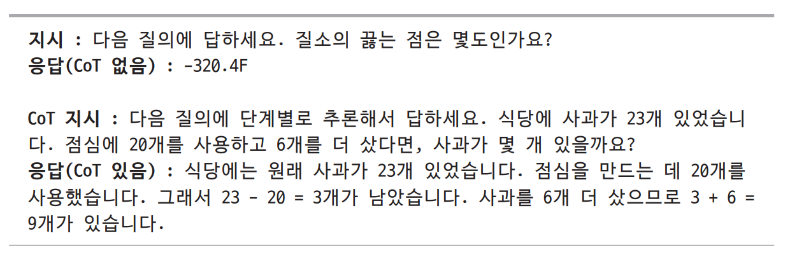
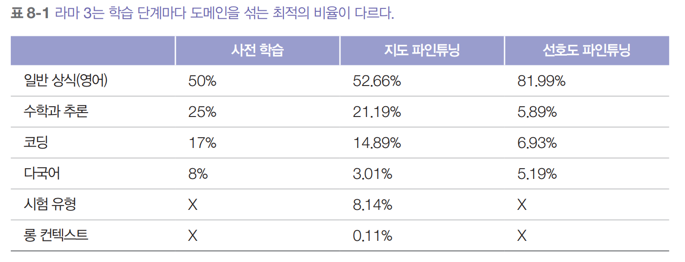
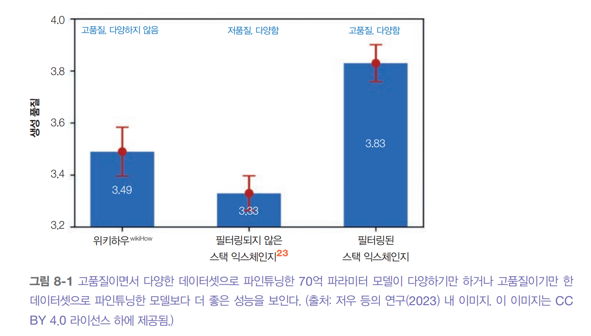
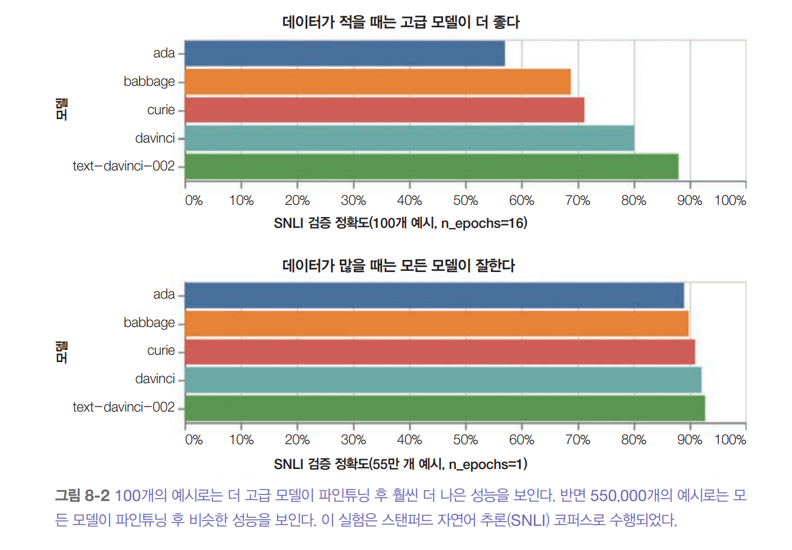
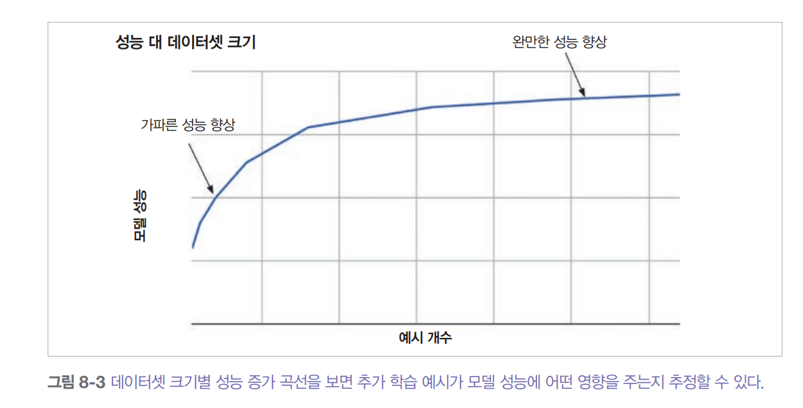
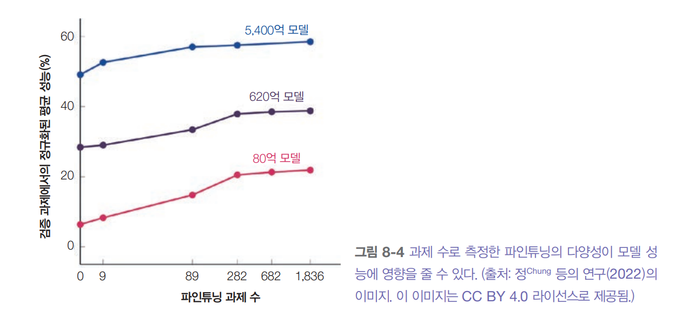
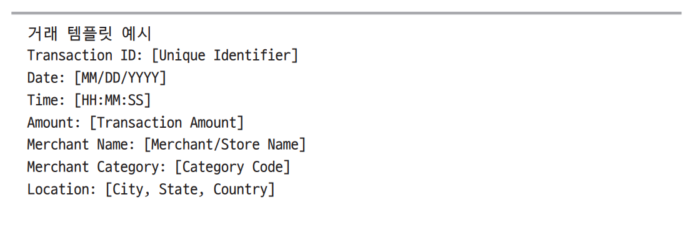
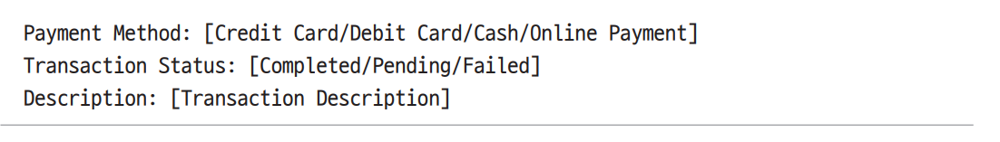
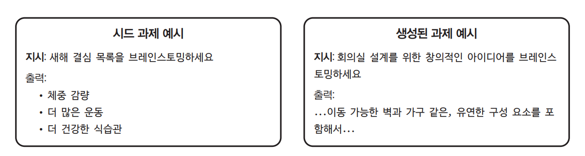

# **데이터셋 엔지니어링**  
모델의 품질은 학습 데이터의 품질에 달려 있다. 무한한 컴퓨팅 자원을 가진 세계 최고의 ML 팀이라도 데이터가 없으면 좋은 모델을 파인튜닝할 수 없다. 
데이터셋 엔지니어링의 목표는 최고의 모델을 학습할 수 있는 데이터셋을 만드는 것이며 이상적으로는 할당된 예산 내에서 이를 달성하는 것이다.  
  
처음부터 모델을 개발할 여력이 있는 회사가 줄어들면서 더 많은 회사가 AI 성능을 차별화하기 위해 데이터에 주목하고 있다. 모델이 더 많은 데이터를 
요구하게 되면서 데이터 처리는 더욱 어려워지고 있으며 인력과 인프라에 대한 투자도 늘어나고 있다.  
  
데이터 운영은 더 이상 여유 시간에 처리하는 부수적인 업무가 아니라 그 자체로 전문적인 전담 역할이 되었다. 많은 AI 회사가 이제 데이터 레이블, 
데이터셋 제작자, 데이터 품질 엔지니어를 고용하고 있으며 이들은 주요 개발 팀에 통합되거나 함께 작업하고 있다.  
  
수많은 선택지를 고려해야 하는 모델 환경도 충분히 복잡하지만 계속해서 새로운 데이터셋과 기법들이 나오는 데이터 환경은 훨씬 더 복잡하다.  
  
같은 모델이라도 학습 단계마다 학습하려는 능력이 다르기 떄문에 각각 다른 속성을 가진 데이터셋이 필요하다. 예를 들어 사전 학습에서는 데이터 
양을 보통 토큰 수로 측정하지만 지도 파인튜닝에서는 예시 수로 측정하는 등 세부적인 접근 방식에는 차이가 있다. 하지만 양질의 데이터를 선별하고 
정제한다는 근본 원칙만큼은 동일하게 적용된다.  
  
이런 과정들에 대하여 참고할 수 있는 모범 사례들과 일부 과정을 자동화할 수 있는 도구들이 있다. 하지만 이런 데이터 작업은 대부분 고된 노가다의 
연속일 것이다.  
  
# **데이터 중심 AI의 관점**  
AI 개발 과정에서 데이터에 대한 관심이 커지면서 기존의 모델 중심 AI(model-centric AI)와 다른 데이터 중심 AI(data-centric AI)가 떠오르고 있다.  
  
- 모델 중심 AI는 모델 자체를 개선해서 AI 성능을 올리는 방식이다. 새로운 아키텍처를 설계하거나 모델을 더 크게 만들거나 새로운 학습 기법을 개발하는 
방식이다.  
- 데이터 중심 AI는 데이터를 개선해서 AI 성능을 올리는 방식이다. 새로운 데이터 처리 기법을 개발하고 고품질 데이터셋을 만들어서 더 적은 자원으로도 더 
좋은 모델을 학습시키는 방식이다.  
  
딥러닝 초기에는 AI 벤치마크 대부분이 모델 중심이었다. 이미지넷 같은 데이터셋이 주어지면 사람들은 같은 데이터셋으로 최대한 좋은 모델을 만들려고 
했다. 최근에는 데이터 중심 벤치마크가 늘고 있다. 같은 모델이 주어지면 이 모델이 최고 성능을 낼 수 있는 데이터셋을 만드는 것이다.  
  
모델 중심과 데이터 중심으로 나누는 것은 연구 방향을 잡는 데 유용하다. 하지만 실제로 의미 있는 기술 발전을 위해서는 모델과 데이터 개선 모두에 투자해야 하는 
경우가 많다.  
  
# **데이터 큐레이션**  
AI 모델의 모든 문제가 데이터로 풀리지는 않지만 데이터는 해결의 중요한 열쇠인 경우가 많다. 좋은 데이터는 모델을 더 똑똑하고 안전하게 해주고 더 긴 
컨텍스트를 처리할 수 있게 해준다. 반면 나쁜 데이터는 모델의 편향과 환각을 키울   있다. 데이터에 실수가 있으면 모델이 망가지고 자원도 낭비된다.  
  
데이터 큐레이션(data curation)은 모델이 어떻게 학습하는지, 학습에 도움이 되는 자원이 무엇인지 이해해야 하는 분야다. 데이터셋을 만드는 사람은 애플리케이션 
개발자나 모델 개발자와 긴밀하게 협력해야 한다. 작은 팀에서는 한 사람이 여러 역할을 맡기도 한다. 즉 모델 학습을 담당하는 사람이 그 모델용 데이터 확보까지 
함꼐 하는 식이다. 하지만 데이터 수요가 많은 조직에서는 보통 전문 인력을 따로 둔다.  
  
어떤 데이터가 필요한지는 하려는 일과 모델에게 무엇을 가르치고 싶은지에 달려 있다. 자기 지도 학습 파인튜닝에는 데이터 시퀀스가 필요하고 지시 파인튜닝에는
(지시) 응답 형식의 데이터가 필요하다. 선호도 파인튜닝에는 (지시, 선호 응답, 비선호 응답) 형식이 필요하다. 보상 모델 학습에는 선호도 파인튜닝과 
같은 형식을 쓰거나 ((지시, 응답), 점수) 형식으로 각 예시에 주석이 달린 점수가 있는 데이터를 사용할 수 있다.  
  
학습 데이터는 모델이 학습했으면 하는 행동을 먼저 보여줘야 한다. 좋은 데이터 주석을 확보하는 것은 항상 어렵지만 생각의 사슬(CoT) 추론이나 도구 사용 
같은 복잡한 행동을 모델에게 가르치려면 더욱 어렵다. 이 두 가지 예시를 살펴보면서 그 이유를 알아보자.  
  
- 생각의 사슬(CoT)  
CoT 프롬프팅은 모델이 최종 답을 내기 전에 문제를 단계별로 풀어보도록 유도한다. 모델이 단계별 응답을 생성하도록 가르치려면 학습 데이터에 CoT 응답이 
들어 있어야 한다. Scaling Instruction-Finetuned Language Models에 따르면 파인튜닝 데이터에 단계별 응답을 넣으면 여러 크기의 모델들이 CoT 
작업에서 훨씬 좋은 성능을 보이고 어떤 작업에서는 정확도가 거의 두 배까지 올라간다고 한다.  
  
여러 단계의 응답을 생성하는 것은 지루하고 시간도 오래 걸린다. 수학 문제를 단계별로 풀어서 설명하는 것은 그냥 최종 답만 알려주는 것보다 훨씬 
어렵다. 정 등의 연구에서 가져온 두 가지 예시가 있다. 하나는 최종 답만 있고 다른 하나는 CoT가 포함되어 있다.  
  
  
  
이런 CoT 데이터셋은 다른 지시 데이터셋에 비해 만들기 어려워서 많지 않다.  
  
- 도구 사용  
모델이 사전 학습 중에 습득한 방대한 지식을 생각해 보면 많은 모델이 특정 도구 사용법을 이미 알고 있다고 생각하는 경우가 많다. 하지만 도구 사용 예시를 
다시 보여주면 모델의 도구 사용 능력을 더 확실히 키울 수 있다. 도구 사용 데이터를 만들 떄는 보통 도메인 전문가를 활용한다. 데이터셋의 각 프롬프트는 
도구가 필요한 작업에 해당하며 그에 대한 응답은 해당 작업을 수행하는 데 필요한 일련의 행동으로 구성된다. 예를 들어 개인 비서 역할의 모델을 파인튜닝할 
데이터가 필요하다면 실제 개인 비서들에게 평소 어떤 업무를 하는지, 어떻게 수행하는지, 어떤 도구가 필요한지 물어볼 수 있다. 하지만 사람 전문가에게 
자신이 어떻게 일하는지 설명해달라고 하면 기억이 잘못되었거나 그 단계들이 중요하지 않다고 생각해서 특정 단계를 빼먹을 수도 있다. 그래서 정확성을 높이려면 
사람이 실제로 이런 작업을 어떻게 수행하는지 직접 관찰하는 것이 필요할 떄가 많다.  
  
하지만 사람에게 효율적인 방법이 AI에게도 효율적인 건 아니고 그 반대도 마찬가지다. 그래서 사람이 만든 주석이 AI 에이전트에게는 최적이 아닐 수 있다. 
예를 들어 사람은 웹 화면을 선호할 수 있지만 모델에게는 API를 사용하는 것이 더 쉽다. 뭔가를 검색할 때 사람은 먼저 브라우저를 열고 검색어를 복사해서 
붙여넣거나 직접 검색창에 입력하고 결과를 하나씩 클릭한다. 반면 모델은 그냥 검색 API에 질의를 보내고 모든 결과를 한꺼번에 처리할 수 있다. 이런 
이유로 많은 사람이 시뮬레이션이나 다른 합성 기법을 활용해 도구 사용 데이터를 생성한다.  
  
도구 사용 데이터는 특별한 형식이 필요할 수도 있다. 일반적인 대화 데이터에서는 사용자와 AI가 번갈아가며 턴마다 하나의 메시지를 주고받는다. 하지만 도구를 
사용할 떄는 AI가 한 턴에 여러 메시지를 만들어야 할 수도 있고 각 메시지는 다른 곳으로 보내진다. 예를 들어 코드 인터프리터에 하나의 메시지를 보내고 
사용자에게는 다른 메시지를 보낼 수 있다(사용자에게 자신이 무엇을 하고 있는지 알려주는 식으로). 이를 지원하기 위해 라마 3 연구자들은 각 메시지의 출처와 
목적지를 표시하는 메시지 헤더와 사람과 AI의 턴이 어디서 시작하는지 알려주는 특별한 종료 토큰으로 구성된 멀티메시지 채팅 형식을 설계했다.  
  
대화 인터페이스가 있는 애플리케이션용 데이터를 큐레이션할 때는 싱글 턴 데이터가 필요한지, 멀티 턴 데이터가 필요한지, 아니면 둘 다 필요한지 고려해야 
한다. 싱글 턴 데이터는 모델이 개별 지시에 답하는 법을 가르친다. 반면 멀티 턴 데이터는 모델에게 작업을 해결하는 방법을 가르친다. 실제 세상의 대부분의 
작업은 주고받기를 포함하기 떄문이다. 예를 들어 쿼리를 받으면 모델이 먼저 사용자가 정확히 뭘 원하는지 확인하고 나서 작업을 처리해야 할 수도 있다. 모델이 
응답한 후에도 사용자가 다음 단계를 위해 수정 사항이나 추가 정보를 제공할 수도 있다.  
  
싱글 턴 데이터는 보통 간단해서 구하기 쉽지만 멀티 턴 데이터는 특별히 만든 시나리오나 더 복잡한 상호작용이 필요한 경우가 많다.  
  
데이터 큐레이션은 모델이 새로운 행동을 배우도록 돕는 새 데이터를 만드는 것뿐만 아니라 나쁜 행동을 잊게 하려고 기존 데이터를 없애는 것도 포함된다. 
챗GPT 같은 챗봇을 개발하느 팀에서 일한다고 상상해 보자. 사용자들로부터 챗봇이 좀 건방져서 짜증나고 토큰도 낭비한다는 이야기를 들었다. 예를 들어 
사용자가 어떤 말이 사실인지 확인해달라고 하면 챗봇이 "맞긴 하지만 문제를 개선하면 더 좋을 것 같습니다"라고 아무도 요청하지 않은 문장 고치기를 
진행하는 경우다.  
  
조사를 통해 학습 데이터에 요청하지 않은 제안을 포함한 주석 예시가 다수 포함된 것을 발견했다. 학습 데이터에서 이런 예시들을 제거하고 불필요한 
문장 수정 없이 사실 확인만 수행하는 새로운 예시로 대체해 달라고 요청한다.  
  
애플리케이션마다 필요한 데이터 특성이 다를 수 있다. 학습 단계가 달라져도 다른 데이터 조합이 필요하다. 하지만 전체적으로 보면 데이터 큐레이션은 
데이터 품질, 데이터 커버리지, 데이터 양이라는 세 가지 기준을 따른다.  
  
이 용어들을 쉽게 이해하기 위해 모델 학습을 요리로 비유해 보자. 모델에 넣는 데이터는 재료다. 데이터 품질은 재료의 품질과 같다. 재료가 상했으면 
좋은 음식을 만들 수 없다. 데이터 커버리지는 적절한 재료 조합을 갖는 것과 같다. 데이터 양은 재료를 얼마나 준비해야 하는지에 관한 것이다.  
  
# **데이터 품질**  
적은 양의 고품질 데이터가 많은 양의 노이즈가 있는 데이터보다 좋은 성능을 낼 수 있다. 여기서 노이즈가 있는 데이터란 관련이 없거나 일관성이 없는 
데이터를 말한다. Yi 모델 패밀리를 만든 연구팀은 신중하게 만든 1만 개의 지시가 수십만 개의 노이즈가 있는 지시보다 훨씬 낫다는 것을 발견했다.  
  
비슷하게 LIMA: Less Is More for Alignment 연구에서는 신중하게 큐레이션된 1000개의 프롬프트와 응답으로 파인튜닝한 650억 파라미터 라마 모델이 
사람 주석자 기준으로 43%의 경우에서 GPT-4와 비슷하거나 더 좋은 답을 만든다는 것을 보여줬다. 하지만 데이터 예시가 너무 적으면 LIMA가 상용 모델만큼 
강건하지 않다는 단점이 있다.  
  
라마 3팀도 같은 결론에 도달했다. 특히 사람이 만든 데이터는 오류의 불일치를 발견하기 쉬웠는데 이런 경향이 무엇이 유해하고 안전한지를 판단하는 복잡한 
안전 가이드라인을 적용할 떄 더욱 두드러졌다. 그래서 높은 데이터 품질을 보장하고자 AI 보조 주석 도구를 개발했다.  
  
대부분의 사람들은 데이터 품질이 중요하다는 것을 알고 있지만 여기서 고품질의 데이터라는 건 정확히 무슨 뜻일까? 간단히 말하면 데이터가 자신의 일을 
효율적이고 안정적으로 하는 데 도움이 되는 데이터를 고품질이라고 볼 수 있다. 하지만 사람마다 기준이 조금씩 다르다. 일반적으로는 여섯 가지 특성(관련성, 
작업 요구사항 부합, 일관성, 올바른 형식, 충분한 고유성, 규정 준수)을 가진 데이터를 고품질로 본다. 특정 활용 사례에서는 다른 요구사항도 있을 수 있다.  
  
- 관련성  
학습 예시는 모델이 학습하려는 작업과 관련이 있어야 한다. 예를 들어 현재의 법률 질의에 답하는 과제라면 19세기 법률 데이터셋은 관련성이 없을 수 있다. 
하지만 19세기 법률 시스템에 관한 과제라면 이 데이터셋은 매우 관련성이 높다.  
- 작업 요구사항 부합  
주석은 작업의 요구사항에 부합해야 한다. 예를 들어 과제에서 사실적 일관성이 필요하다면 주석이 사실적으로 정확해야 한다. 작업에서 창의성이 필요하다면 
주석이 창의적이어야 한다. 작업에서 점수뿐만 아니라 그 점수에 대한 근거도 요구한다면 주석에 점수와 근거가 모두 포함되어야 한다. 하지만 작업에서 
간결한 답을 요구한다면 주석이 간결해야 한다.  
정확한 또는 올바른 대신 부합이라는 표현을 쓴 이유는 과제에 따라서는 정확하거나 올바른 응답이 사용자가 원하는 것이 아닐 수도 있기 때문이다.  
- 일관성  
주석은 예시들끼리 그리고 주석자들 간에 일관되어야 한다. 두 주석자에게 같은 예시에 주석을 달 떄 결과가 너무 다르면 안 된다. 글을 1점에서 5점까지 
채점하는 작업이라면 같은 점수를 받은 두 글의 품질이 비슷해야 한다. 주석이 일관되지 않으면 모델이 헷갈려서 학습하기 어려워진다.  
작업 요구사항과 부합하면서도 일관된 주석을 만들려면 좋은 주석 가이드라인이 꼭 필요하다.  
- 올바른 형식  
모든 예시는 모델이 기대하는 형식을 따라야 한다. 불필요한 형식 토큰은 모델 학습을 방해할 수 있으므로 없애야 한다. 예를 들어 웹사이트에서 제품 리뷰를 
스크래핑한다면 HTML 태그를 제거해야 한다. 뒤쪽 공백, 줄바꿈, 일관되지 않은 대소문자, 숫자 형식을 조심해야 한다.  
- 충분한 고유성  
데이터에서 고유한 예시를 말한다. 모델 학습에서 중복은 편향을 만들고 데이터 오염을 일으킬 수 있다. 충분한 고유성이라고 한 이유는 특정 활용 사례에 
따라 허용할 수 있는 중복 수준이 다르기 떄문이다.  
- 규정 준수  
데이터는 모든 관련 내부 및 외부 정책(법률과 규정 포함)을 지켜야 한다. 예를 들어 PII 데이터를 모델 학습에 사용할 수 없다면 데이터에 PII 데이터가 
들어가면 안 된다.  
  
데이터를 만들기 시작하기 전에 이런 특성들이 자신에게 무엇을 의미하는지 생각해 보는 것이 중요하다.  
  
# **데이터 커버리지**  
모델의 학습 데이터는 모델이 풀어야 할 문제들의 범위를 포괄해야 한다. 실제 사용자들은 보통 다양한 문제를 가지고 있고 그 문제를 표현하는 방식도 
천차만별이다. 애플리케이션의 다양한 사용 패턴을 담은 데이터를 확보하는 것이 모델이 좋은 성능을 내는 핵심이다. 좋은 커버리지를 확보하려면 데이터의 
다양성이 필수적이므로 이 개념을 데이터 다양성(data diversity)이라고 부르기도 한다.  
  
예를 들어 어떤 사용자들은 풍부한 참고 자료와 함꼐 자세한 지시를 만들고 다른 사용자들은 짧은 지시를 좋아한다면 파인튜닝 데이터에는 자세한 것과 짧은 
것 모두 포함되어야 한다. 사용자 질의에 종종 오타가 있다면 오타가 포함된 예시들을 넣어야 한다. 애플리케이션이 여러 프로그래밍 언어를 다룬다면 학습 
데이터에 사용자들이 관심 있어 하는 프로그래밍 언어들이 포함되어야 한다.  
  
애플리케이션마다 필요한 다양성의 종류가 다르다. 예를 들어 프랑스어-영어 번역 도구는 언어 다양성은 필요 없지만 주제, 길이, 말투의 다양성은 도움이 될 
수 있다. 반면 전세계 고객에게 상품을 추천하는 챗봇은 반드시 모데인 다양성이 필요한 건 아니지만 언어와 문화의 다양성이 중요할 것이다.  
  
챗봇 같은 범용 용도인 경우 파인튜닝 데이터가 다양해야 하고 광범위한 주제와 말하기 패턴을 담아야 한다. 딩 등의 연구는 채팅 언어 모델의 성능을 
더 끌어올리는 가장 직접적인 방법이 학습 과정에서 사용되는 데이터의 품질과 다양성을 늘리는 것이라고 주장했다. 네모트론을 개발하기 위해 엔비디아 연구팀은 
과제 다양성, 주제 다양성, 지시 다양성을 가진 데이터셋을 만드는 데 집중했다. 여기에는 다양한 출력 형식을 위한 지시, 다양한 출력 길이를 가진 지시, 
개방형 응답과 예/아니오 응답을 위한 지시가 포함된다. The Data Addition Dilemma는 경우에 따라 이질적인 데이터를 추가하면 오히려 성능이 나빠질 
수 있다는 걸 보여줬다.  
  
메타에서는 라마 3 논문을 통해 모델 아키텍처 면에서는 이전 라마 버전들과 크게 다르지 않다고 밝혔다. 라마 3의 성능 향상은 주로 데이터 품질과 다양성 개선, 
그리고 늘어난 학습 규모에 의해 이뤄졌다. 해당 논문에서는 사전 학습, 지도 파인튜닝, 선호도 파인튜닝이라는 세 가지 학습 단계 전체에 걸친 데이터 
커버리지에 대한 자세한 내용이 담겨 있다.  
  
세 단계 모두에서 여러 도메인의 데이터를 사용한다는 공통점이 있다. 하지만 아래 표에서 알 수 있듯이 각 단게에서 실제로 포함되는 도메인의 종류와 
비중은 다르다. 이 표는 기하학 같은 수학의 하위 범주인 세부 주제는 포함하지 않고 상위 수준의 도메인만 보여준다.  
  
  
  
사후 학습 데이터에는 표에 나와 있지 않은 다른 것도 고려해야 하는데 예를 들어 토큰 수(컨텍스트와 응답 모두)와 턴 수가 있다. 이와 더불어 라마 3는 사후 
학습에 합성 데이터를 사용하므로 사람이 생성한 데이터와 AI가 생성한 데이터의 비율 또한 중요한 요소로 고려된다.  
  
흥미로운 점은 사전 학습과 지도 파인튜닝에서 수학, 추론, 코드 토큰을 모두 합치면 학습 데이터의 거의 절반을 차지한다는 것이다. 인터넷 데이터에서 수학과 
코드가 정확히 몇 퍼센트인지는 모르지만 50%보다는 훨씬 적을 것이다. 라마 3 연구자들은 소량의 고품질 코드와 수학 데이터로 모델을 어닐링(annealing)하면
(학습률을 점진적으로 낮추면서 코드와 수학 데이터를 점진적으로 늘려가며 모델을 학습시키면) 주요 벤치마크에서 모델 성능을 높일 수 있다고 밝혔다. 
이는 고품질 코드와 수학 데이터가 자연어 텍스트보다 모델의 추론 능력을 키우는 데 더 효과적이라는 통념을 뒷받침한다.  
  
선호도 파인튜닝에서 코드와 수학 데이터의 비중은 훨씬 적다(합쳐서 12.82%). 아마도 실제 사용자 선호도의 분포를 반영하려는 목적 떄문일 것이다.  
  
올바른 데이터 조합은 어떻게 결정할까? 간단한 방법은 실제 애플리케이션 사용 패턴을 맞춰 데이터 조합을 선택하는 것이다. 다른 방법으로는 실험을 통해 
최적의 데이터 조합을 찾을 수도 있다. 예를 들어 메타는 스케일링 외삽과 비슷한 스케일링 법칙 실험을 수행했다. 후보 데이터 조합마다 작은 모델을 여러 
개 학습시키고 이를 바탕으로 큰 모델이 그 조합에서 보일 성능을 예측했다. 최종 모델 조합은 실험 결과를 토대로 한 최선의 추정 조합이다.  
  
데이터 다양성과 품질이 미치는 영향을 평가하기 위해 저우 등은 연구를 통해 재미있는 실험을 진행했다. 크기는 같지만 (2000개 예시) 특성이 다른 세 개의 데이터셋으로 
70억 파라미터 언어 모델을 학습시켰다. 첫 번째는 고품질이지만 다양하지 않고 두 번쨰는 다양하지만 저품질이고 세 번째는 다양하면서도 고품질이다. 
아래 그림은 세 모델의 생성 품질을 보여준다.  
  
  
  
# **데이터 양**  
얼마나 많은 데이터가 필요한지 묻는 것은 얼마나 많은 돈이 필요한지 묻는 것과 같다. 상황에 따라 답이 완전히 달라진다. 한쪽에서는 제레미 하워드와 조나단 
휘태커가 LLM이 예시 하나 만으로도 학습할 수 있다는 걸 보여주는 재밌는 실험을 했다. 반대쪽에서는 여전히 수백만 개의 예시로 모델을 파인튜닝하는 
팀들도 있다.  
  
수백만 개의 예시는 많아 보이지만 파운데이션 모델을 처음부터 학습시키는 데 일반적으로 필요한 데이터와 비교하면 적은 양이다. 참고로 라마 2와 라마 3는 
각각 2조 개와 16조 개의 토큰으로 학습했다. 예시 하나가 2000개 토큰이라면 이는 각각 10억 개와 150억 개의 예시에 해당한다.  
  
수백만 개의 예시가 있다면 그냥 처음부터 모델을 학습시키는 것이 더 좋은 게 아닌가 궁금할 수 있다. 실제로 그렇게 하는 게 좋을 수도 있으므로 처음부터 
학습시크는 것이 성능 개선에 도움이 될지 평가해 봐야 한다. 사전 학습된 모델 위에 파인튜닝하는 것이 보통은 처음부터 학습시키는 것보다 효율적이지만 
파인튜닝이 오히려 더 나쁠 수 있는 상황들도 있다. 특히 학습 데이터가 많을 떄 그렇다. 이는 경화(ossification)라는 현상 떄문인데 사전 학습이 모델 
가중치를 경화시켜서(얼려서) 파인튜닝 데이터에 잘 적응하지 못하게 만들 수 있다. 작은 모델일수록 큰 모델보다 이런 경화 현상에 더 취약하다.  
  
데이터 품질과 데이터 다양성 외에도 필요한 데이터의 양을 결정하는 요소가 세 가지 더 있다.  
  
- 파인튜닝 기법  
전체 파인튜닝은 최고 성능을 낼 수 있지만 LoRA 같은 PEFT 방법보다 몇 배나 많은 데이터가 필요하다. (지시, 응답) 쌍이 수만 개에서 수백만 개 있다면 
전체 파인튜닝을 해볼 만하다. 수백 개나 수천 개 정도밖에 없다면 PEFT가 가장 효과적일 것이다.  
- 과제 복잡성  
제품 리뷰가 긍정인지 부정인지 분류하는 것 같은 간단한 과제는 금융 서류에 대한 질의응답 같은 복잡한 과제보다 훨씬 적은 데이터로 충분하다.  
- 기본 모델의 성능  
기본 모델이 원하는 성능에 가까울수록 목표에 도달하는 데 필요한 예시가 적다. 더 큰 기본 모델이 더 좋다고 가정하면 큰 모델을 파인튜닝할 때 더 
적은 예시가 필요할 수 있다. 이는 더 큰 모델이 더 많은 학습 데이터를 필요로 하는 사전 학습과는 정반대다.  
  
오픈AI의 파인튜닝 가이드를 보면 예시가 적을 때(100개) 더 고급 모델이 파인튜닝 성능도 더 좋다. 아마도 더 고급 모델이 애초에 기본 성능이 더 좋기 
때문일 것이다. 하지만 많은 예시(55만 개)로 파인튜닝한 후에는 아래 그림에서 보이듯이 실험에 쓰인 다섯 모델 모두 비슷한 성능을 보였다.  
  
  
  
간단히 말해 데이터가 적다면 더 고급 모델에 PEFT 방법을 사용하는 것이 좋다. 반대로 데이터가 많다면 더 작은 모델로 전체 파인튜닝을 사용하는 것이 좋다.  
  
대규모 데이터셋 구축에 투자하기 전에 먼저 잘 만들어진 소규모 데이터셋(예: 50개 예시)으로 시작해서 파인튜닝이 모델을 개선할 수 있는지 확인해 보는 
것이 좋다. 이런 소규모 데이터셋만으로도 원하는 성능을 달성할 수 있다면 더할 나위 없이 좋다. 또한 소규모 데이터 셋으로 명확한 개선이 보인다면 데이터를 
더 추가하면 성능이 향상될 가능성이 높다는 신호다. 하지만 소규모 데이터로 전혀 개선이 없다면 데이터를 아무리 늘려도 큰 효과를 기대하기 어렵다.  
  
하지만 소규모 데이터셋으로 파인튜닝해도 모델이 개선되지 않는다고 성급하게 결론내리지는 말아야 한다. 파인튜닝 결과에 영향을 미칠 수 있는 요소는 데이터 
외에도 많다. 예를 들어 하이퍼파라미터 선택(학습률이 너무 높거나 낮은 경우), 데이터 품질, 프롬프트 작성 방식 등이 모두 영향을 미친다. 대부분 50~100개의 
예시로 파인튜닝하면 성능 개선을 확인할 수 있을 것이다.  
  
먼저 품질이 낮거나 비교적 관련성이 떨어지는 데이터로 파인튜닝한 다음 고품질 데이터로 파인튜닝하면 필요한 고품질 데이터의 양을 줄일 수도 있다. 이런 
접근법의 예시 세 가지를 살펴보자.  
  
- 자기 지도 학습 -> 지도 학습  
법률 질의에 답하는 모델을 파인튜닝하려고 한다. (질의, 응답) 세트는 적지만 법률 문서는 많이 보유하고 있다. 먼저 법률 문서로 자기 지도 학습 방식으로 
모델을 파인튜닝한 다음 (질의, 응답) 쌍으로 추가 파인튜닝을 할 수 있다.  
- 관련성 낮은 데이터 -> 관련성 높은 데이터  
제품 리뷰의 감정을 분류하는 모델을 파인튜닝하고 싶지만 제품 감정 데이터는 적고 트윗 감정 데이터는 훨씬 많다. 먼저 트윗 감정 분류로 모델을 파인튜닝한 
다음 제품 감정 분류를 추가 파인튜닝할 수 있다.  
- 합성 데이터 -> 실제 데이터  
의료 보고서에서 질병을 예측하는 모델을 파인튜닝하려고 한다. 이 작업의 민감성 떄문에 데이터가 제한적이다. AI 모델을 사용해 대량의 데이터를 합성해서 
먼저 모델을 파인튜닝한 다음 실제 데이터로 추가 파인튜닝할 수 있다. 그러나 이 방법은 제대로 하기 어렵다. 서로 다른 두 번의 파인튜닝 작업을 하면서 
그 사이의 전환을 조율해야 하기 떄문이다. 뭘 하고 있는지 모르면 결국 더 많은 컴퓨팅 자원을 사용하고도 고품질 데이터만으로 파인튜닝했을 떄보다 못한 
모델을 만들어 낼 수 있다. 주석이 달린 데이터에 대한 의존도를 낮추는 다른 기법도 있는데 약한 지도 학습, 준지도 학습, 능동적 학습 등이 있다.  
  
작은 데이터셋으로 실험해보면 앞으로 데이터가 얼마나 더 필요한지 추정할 수 있다. 현재 데이터셋의 일부분(예: 25%, 50%, 100%)으로 모델을 파인튜닝하고 
데이터셋 크기에 따른 성능 변화를 그래프로 그려보자. 데이터셋이 커질수록 성능이 가파르게 올라간다면 데이터를 두 배로 늘렸을 떄 성능도 크게 좋아질 것이다. 
성능 증가폭이 없다면(평평하다면) 데이터를 두 배로 늘려도 개선 효과는 미미할 것이다. 아래 그림에서 이런 그래프의 예시를 확인할 수 있다.  
  
  
  
위 그림의 성능 증가 곡선은 상당히 일반적인 패턴이다. 대부분의 경우 학습 예시를 추가할 수록 점점 효과가 줄어든다. 즉 데이터셋이 커질수록 같은 수의 
예시로 얻는 성능 향상폭이 보통 작아진다는 뜻이다. 예를 들어 처음 1000개 예시는 모델 정확도를 10% 올릴 수 있지만 그다음 1000개 예시는 5%만 올릴 
수 있다.  
  
파인튜닝 예시가 많을수록 모델 성능이 일반적으로 좋아지지만 예시의 다양성도 중요하다. Scaling Instruction-Finetuned Language Models 논문에 
따르면 파인튜닝 과제 수가 9개에서 282개로 늘어났을 떄 모델 성능이 크게 향상됐다. 282개 과제를 넘어서면 성능 증가가 둔화되기 시작했지만 아래 그림처럼 
1836개 과제까지는 계속해서 조금씩 개선됐다. 이는 파인튜닝할 때 다양한 과제를 경험하는 게 모델에게 큰 도움이 된다는 걸 보여준다.  
  
  
  
데이터 다양성은 과제 종류(요약, 질의응답 등), 주제 다양성(패션, 금융, 기술 등), 출력 형식(JSON 출력이나 예/아니오 응답 등)으로 나타날 수 있다.  
  
파인튜닝에 데이터르 얼마나 쓸지는 필요에 따라 결정될 뿐만 아니라 예산에 따라서도 결정된다. 데이터 주석에 예산이 1만 달러를 예산으로 잡고 각 예시 하나에 
2달러가 든다면 최대 5000개 예시를 만들 수 있다. 그리고 데이터와 컴퓨팅 예산 사이의 균형도 생각해야 할 수 있다. 데이터에 돈을 더 쓰면 컴퓨팅에 
쓸 돈이 줄어든고 반대도 마찬가지다.  
  
# **데이터 수집과 주석**  
데이터 수집의 목표는 사용자 프라이버시를 존중하고 규정을 지키면서 필요한 품질과 다양성을 갖춘 충분한 크기의 데이터셋을 만드는 것이다. 데이터 수집에는 
공개 데이터 수집, 독점 데이터 구매, 데이터 주석 작업, 데이터 합성 등의 방법으로 데이터를 모으는 과정이 포함된다. 데이터 수집 전략을 연구하는 분야가 
있는데 아직은 틈새 영역이지만 점점 커지고 있다. 주어진 예산으로 특정 요구사항을 만족하는 데이터셋을 가장 효과적으로 확보하는 방법을 연구하는 것이다.  
  
하지만 가장 중요한 데이터 소스는 보통 자체 애플리케이션에서 나오는 데이터다. 사용자가 만든 데이터를 활용해서 제품을 지속적으로 개선하는 데이터 플라이휠을 
구축할 방법을 찾아낸다면 상당한 이점을 얻을 것이다. 애플리케이션 데이터는 완벽하게 관련성이 있고 과제와 정확히 맞아떨어지기 떄문에 이상적이다. 
즉 자신이 중요하게 여기는 데이터의 분포와 일치하는데 이는 다른 데이터 소스에서는 달성하기 매우 어렵다. 사용자 생성 데이터는 사용자 콘텐츠, 사용자 
로그 데이터, 또는 사용자 피드백일 수 있다.  
  
자체 데이터를 만들기 전에 먼저 사용 가능한 데이터셋을 확인해야 한다. 데이터 마켓플레이스는 매우 다양하며 오픈 소스와 독점 데이터를 모두 제공한다. 
운이 좋다면 필요한 데이터셋을 정확히 찾을 수 있다. 하지만 대부분은 여러 데이터를 조합해야 한다. 하나의 데이터셋이 다양한 획득 경로를 거쳐 여러 
데이터 소스에서 만들어질 수 있기 떄문이다. 예를 들어 (지시, 응답) 데이터셋을 만드는 과정은 다음과 같다.  
  
1. 원하는 특징을 가진 사용 가능한 데이터셋을 찾는다. 이때 10000개의 예시로 이루어진 유망한 데이터셋 하나를 발견할 수 있다.  
2. 낮은 품질의 지시를 제거한다. 이렇게 하면 9000개 예시가 남는다고 하자.  
3. 낮은 품질의 응답을 가진 지시들을 따로 빼둔다. 그런 예시가 3000개 있다고 하자. 그러면 좋은 품질의 지시와 응답을 가진 6000개 예시가 남는다.  
4. 좋은 품질의 지시 3000개에 대한 응답을 수동으로 작성한다. 이제 데이터셋에는 총 9000개 고품질 예시를 갖게 된다.  
5. 특정 주제 X에 대한 데이터가 부족하면 X에 관한 지시 템플릿 100개를 수동으로 만든다. 그리고 이 템플릿 100개를 사용해 AI 모델로 지시 2000개를 
합성한다.  
6. 이렇게 합성된 2000개 지시에 수동으로 주석을 추가한다. 이제 데이터셋에는 총 11000개의 예시가 있게 된다.  
  
물론 이는 실제 데이터셋 큐레이션 과정을 지나치게 단순화한 것이고 대부분의 실제 단계는 생략되었다. 예를 들어 주석 중 상당수가 도움이 되지 않는다는 
걸 깨닫고 주석 가이드라인을 업데이트해서 데이터에 다시 주석을 달아야 하는 단계가 여러 번 있을 수 있다. 더 나쁜 경우 일부 주석이 사실과 다르다는 
것을 발견하면 원래 주석을 사실 확인하기 위해 다른 주석자들을 고용해야 할 수도 있다. 또는 템플릿당 100개 합성 지시를 만드는 것이 데이터 다양성을 
해친다는 것을 발견해서 더 많은 템플릿을 만들고 템플릿당 더 적은 지시를 생성해야 할 수도 있다. 이외에도 다양한 상황이 발생할 수 있다.  
  
- 공개 데이터셋 리소스  
공개 데이터셋을 찾을 수 있는 몇 가지 리소스를 소개한다. 공개된 기존 데이터를 활용하지만 이를 맹신해서는 안 된다. 데이터는 반드시 꼼꼼히 살펴보고 
검증해야 한다.  
  
데이터셋을 사용하기 전에 항상 라이선스를 확인하자. 데이터가 어디서 나온 건지 최대한 파악하려고 노력하자. 데이터셋이 상업적 사용을 허용하는 라이선스를 
가지고 있어도 그 안의 일부가 허용하지 않는 출처에서 나왔을 수 있다.  
  
1. 허깅페이스와 캐글은 각각 수십만 개의 데이터셋을 제공한다.  
2. 구글의 Dataset Search는 훌륭하지만 많이 알려지지 않았다.  
3. 정부 기관들이 오픈 데이터를 많이 제공한다. Data.gov는 수십만 개의 데이터셋이 있고 data.gov.in은 수만 개가 있다.  
4. 미시간 대학교 사회연구소 ICPSR은 수만 개의 사회과학 연구 데이터가 있다.  
5. UC 어바인의 ML 저장소와 OpenML은 두 개의 오래된 데이터셋 저장소로 각각 수천 개의 데이터셋을 제공한다.  
6. Open Data Network에서는 수만 개의 데이터셋을 검색할 수 있다.  
7. 클라우드 서비스 제공업체들도 종종 소규모 오픈 데이터셋 모음을 제공하는데 가장 유명한 건 AWS의 Open Data다.  
8. ML 프레임워크들은 종종 프레임워크를 쓸 때 바로 불러올 수 있는 작은 데이터셋들을 제공한다. 예를 들어 텐서플로 데이터셋 같은 것들이다.  
9. 일부 평가 도구들은 PEFT 파인튜닝에 충분한 크기의 평가 벤치마크 데이터셋을 제공한다. 예를 들어 Eleuther AI의 lm-evaluation-harness는 400개 
이상의 벤치마크 데이터셋이 있고 데이터셋당 평균 2000개 이상의 예시가 있다.  
10. Stanford Large Network Dataset Collection은 그래프 데이터셋을 위한 훌륭한 저장소다.  
  
파인튜닝을 위해 자체 데이터에 주석을 달아야 할 떄가 많다. 주석 작업이 어려운 이유는 주석 과정 자체뿐만 아니라 명확한 주석 가이드라인을 만드는 것도 
복잡하기 떄문이다. 예를 들어 좋은 응답이 어떤 것인지, 어떤 기준으로 좋다고 판단하는지 명확하게 정의해야 한다. 응답이 정확하긴 하지만 별로 도움이 
안 되는 경우도 있다. 3점짜리 응답과 4점짜리 응답의 차이는 뭘까? 이런 주석 가이드라인은 사람이 직접 하는 주석과 AI가 하는 주석 모두에 필요하다.  
  
# **데이터 증강 및 합성**  
컴퓨팅과 전문 인력 그리고 데이터는 AI의 가장 어려운 문제다. 데이터를 프로그래밍으로 생성할 수 있게 되는 것은 업계 전체의 오랜 목표였다. 일반적으로 
쓰이는 두 가지 방법은 데이터 증강과 데이터 합성이다.  
  
- 데이터 증강(data augmentation)은 기존 데이터(실제 데이터)에서 새로운 데이터를 만든다. 예를 들어 고양이의 실제 이미지가 있으면 이를 뒤집어서 
같은 고양이의 새로운 이미지를 만들 수 있다.  
- 데이터 합성(data synthesis)은 실제 데이터의 특성을 모방하는 데이터를 생성한다. 예를 들어 마우스가 웹페이지에서 어떻게 움직이는지 시뮬레이션해서 
봇의 움직임 패턴에 대한 데이터를 생성할 수 있다.  
  
다시 말해서 증강된 데이터는 실제 데이터에서 나오지만 합성 데이터는 실제가 아니다. 하지만 증강과 합성 모두 데이터 생성을 자동화하는 것이 목표라서 
떄로는 두 용어를 같은 의미로 사용하기도 한다.  
  
인위적으로 데이터를 만드는 것은 소프트웨어 엔지니어링에서 오래전부터 해온 일이다. 처음에는 테스트용 가짜 데이터를 생성하는 데 사용됐다. 예를 들어 
Faker나 Chance 같은 라이브러리를 사용하면 테스트용으로 이름, 주소, 전화번호, 이메일 주소 같은 간단한 형식의 데이터를 생성할 수 있다. 만약 배송 주소를 
파싱하는 프로그램을 만들었다고 하자. 가짜 데이터 생성기로 여러 나라와 지역의 다양한 형식으로 주소를 만들어서 프로그램이 모든 주소를 잘 파싱하는지 
확인할 수 있다.  
  
AI가 사람이 생성한 것과 구별할 수 없는 데이터를 생성할 수 있게 되면서 의사 소견서, 계약서, 재무제표, 상품 설명, 이미지, 동영상 광고 등 훨씬 더 
정교한 데이터를 합성할 수 있게 됐다. 이로 인해 데이터 생성이 더 쉬워지고 합성 데이터를 쓸 수 있는 경우도 늘어났다.  
  
합성 데이터가 사람이 직접 데이터를 만들어야 하는 부담을 크게 덜어줄 것으로 기대되지만 합성 데이터가 사람이 만든 데이터를 완전히 대체하지는 못한다. 
많은 경우에 사람이 만든 데이터와 AI가 만든 데이터를 섞는 것이 종종 최고의 결과를 낸다.  
  
# **데이터 합성을 하는 이유**  
합성 데이터가 매력적인 이유는 여러 가지가 있다. 데이터를 합성해서 데이터의 세 가지 중요한 측면인 양, 커버리지, 품질을 개선할 수 있다. 또한 프라이버시 
문제를 해결하고 모델을 증류하기 위해서도 데이터를 합성할 수도 있다.  
  
- 데이터 양 늘리기  
데이터 합성의 가장 큰 이유는 데이터를 대규모로 만들 수 있어서 AI 모델 학습과 테스트에 풍부한 데이터를 공급할 수 있다는 점이다. 이론적으로는 데이터가 
많을수록 모델이 더 다양한 과제에 잘 적응할 수 있다. 이는 특히 실제 데이터를 구하기 어렵거나 부족한 경우에 유용하다. 예를 들어 희귀한 날씨 상황의 데이터, 
심해 탐사 데이터, 자율주행차 사고 데이터 같은 것들이 있다.  
- 데이터 커버리지 늘리기  
특정 특성을 가진 데이터를 생성해서 모델 성능을 개선하거나 모델이 특정 행동을 하도록 만들 수 있다. 예를 들어 아주 짧은 텍스트나 아주 긴 텍스트를 
생성할 수 있다. 또한 유해 콘텐츠 탐지 모델을 위해 유해 표현이 들어간 대화를 만들 수도 있다. 반대로 실제 데이터가 유해하다면 안전한 데이터를 합성할 
수 있다.  
Ai를 사용해서 적대적 예시를 만드는 것도 흔한 일이다. 클래스 불균형 문제를 해결하기 위해 희귀 클래스에 대한 데이터를 생성하는 것도 가능하다. 이에 
대해 TrueTeacher에서는 LLM을 사용해서 사실과 맞지 않는 요약문을 만들고 이를 사용해서 사실적 불일치를 탐지하는 모델을 학습시켰다.  
Discovering Language Model Behaviors with Model-Written Evaluations 논문에서 엔트로픽은 성격 특성, 정치적 견해, 윤리적 입장, 사회적 
편견을 포함한 154가지 AI 행동을 테스트할 수 있는 특정 데이터셋을 만드는 다양한 데이터 합성 기법을 소개했다. LM이 만든 데이터셋과 사람이 만든 데이터셋을 
직접 비교한 결과 LM이 만든 데이터셋이 사람이 만든 것만큼 좋고 떄로는 더 나은 품질을 보인다는 것을 발견했다.  
즉 합성 데이터를 사용해서 데이터 커버리지를 늘릴 수 있다. 기존 데이터가 부족한 부분을 채우는 맞춤형 데이터를 만드는 것이다.  
- 데이터 품질 향상  
보통은 합성 데이터가 사람이 만든 데이터보다 품질이 떨어진다고 생각하지만 때로는 그 반대일 수 있다. 때로는 사람의 근본적인 한계 때문에 사람이 만든 
데이터가 AI가 만든 데이터보다 품질이 낮을 수 있다. 도구 사용 데이터가 한 예다. 사람과 AI는 근본적으로 다른 방식으로 작동하고 다른 도구를 선호한다. 
또 다른 예는 복잡한 수학 문제를 만드는 것이다. AI는 평균적인 사람 전문가가 생각해낼 수 있는 것보다 훨씬 더 복잡한 문제를 만들 수 있다.  
일부 팀들은 AI로 선호도 데이터를 만드는 것을 선호한다. 개인은 자신의 선호도 안에서는 어느 정도 일관성을 보이지만 사람들 간의 평가는 크게 달라진다. 
각자의 선호도가 다를 뿐만 아니라 그때의 기분이나 동기에 따라서도 평가가 달라지기 떄문이다. 반면 AI가 만든 선호도 평가는 훨씬 더 일관되고 믿을 만하다.  
- 프라이버시 문제 해결  
프라이버시 문제로 인해 사람이 생성한 데이터를 사용할 수 없는 경우에는 합성 데이터가 유일한 선택지인 경우가 많다. 예를 들어 의료 분야에서는 법적 
규제로 인해 실제 환자 기록으로 모델을 학습시키기 어렵거나 불가능한 경우가 많다. 이때 민감한 정보가 없는 합성 환자 기록을 생성할 수 있다. 보험 분야에서도 
민감한 개인 및 금융 정보가 포함된 실제 청구 데이터 대신 합성 청구 데이터를 사용할 수 있다.  
- 모델 증류  
때로는 다른 모델의 행동을 모방하는 모델을 학습시키고 싶을 수 있다. 목표는 보통 원래 모델과 비슷한 성능을 내면서도 더 저렴하거나 빠른 모델(증류된 모델)
을 만드는 것이다. 이는 원래 모델이 생성한 데이터로 증류된 모델을 학습시키는 방식으로 이뤄진다.  
  
앞선 내용들은 사람들이 데이터 합성을 하는 여러 이유 중 다섯 가지에 불과하다. 이런 명백한 장점 떄문에 더 많은 모델이 합성 데이터로 학습되고 있고 
데이터를 합성하는 기법들도 계속 개발되고 있다.  
  
# **전통적인 데이터 생성 기법**  
데이터 합성은 AI에만 있는 기술이 아니다. 소프트웨어 테스팅, 게임, 로보틱스 분야에서 오랫동안 써온 방법이다. 사람이 직접 데이터를 만드는 것과 달리 
알고리즘으로 데이터를 생성하는 것을 절차적 생성(procedural generation)이라고 부른다. 절차적 생성은 게임에서 레벨, 맵, 아이템, 캐릭터 같은 콘텐츠를 
실시간으로 만드는 데 많이 쓰인다. 이런 분야에서 사용하는 데이터 생성 기법 대부분은 AI에도 적용할 수 있다.  
  
전통적으로 데이터 증강과 합성에는 규칙 기반 방식과 시뮬레이션 방식이 있다. 고성능 AI 모델로 가능해진 새로운 방법은 AI 자체로 데이터를 합성하는 것이다.  
  
# **규칙 기반**  
데이터를 생성하는 가장 간단한 방법은 미리 정해둔 규칙과 템플릿을 사용하는 것이다. 예를 들어 신용카드 거래 내역을 만들려면 거래 템플릿으로 시작해서 Faker 
같은 난수 생성기로 각 필드를 채우면 된다.  
  
  
  
  
거래 데이터는 민감한 정보라서 많은 사기 탐지 모델은 실제 데이터를 사용하기 전에 먼저 이런 템플릿으로 만든 합성 거래 데이터로 학습해서 제대로 
작동하는지 확인한다.  
  
템플릿을 사용해서 특정 형식을 따르는 문서들을 만드는 것도 흔한 일이다. 청구서, 이력서, 세금 신고서, 은행 명세서, 행사 일정표, 상품 카탈로그, 
계약서, 설정 파일 등이 그런 예다. 템플릿은 정규 표현식이나 수학 방정식처럼 특정 규칙과 형식을 따르는 데이터를 만드는 데도 쓸 수 있다. 템플릿으로 
AI 모델이 풀 수학 방정식을 만들 수도 있다. 딥마인드는 1억 개의 합성 예시로 올림피아드 수준의 기하학 모델인 AlphaGeometry를 학습시켰다.  
  
기존 데이터에 간단한 변형을 가해서 새로운 데이터를 절차적으로 생성할 수도 있다. 이미지라면 무작위로 회전, 자르기, 크기 변경, 일부 지우기 같은 것들을 
할 수 있다. 뒤집힌 고양이 사진도 여전히 고양이고 살짝 잘린 축구 경기 사진도 여전히 축구 경기다. 크리제브스키 등은 전설적인 알렉스넷 논문에서 
이미지넷 데이터셋을 증강하는 데 이 방법을 사용해서 얼마나 유용한지 보여줬다.  
  
텍스트라면 문자의 뜻이나 감정이 바뀌지 않는 선에서 단어를 비슷한 단어로 바꿀 수 있다. 예를 들어 원래 문장 She's a fantastic nerse에서 She's a 
great nurse라는 새로운 예시를 만들 수 있다.  
  
이런 방법은 데이터의 편향을 줄이는 데도 사용할 수 있다. 예를 들어 nurse라는 단어는 여성이 연관되고 doctor라는 단어가 남성과 연관되는 식으로 데이터에 
성별 편향이 있다고 걱정된다면 아래 표에서 보이듯이 she를 he로 바꾸는 식으로 성별을 나타내는 단어들을 반대로 교체할 수 있다.  
  
  
  
비슷한 단어는 유의어 사전을 쓰거나 단어 임베딩 공간에서 서로 가까운 임베딩을 가진 단어를 찾아서 구할 수 있다. AI에 예시를 바꿔 쓰거나 번역하게 해서 
단순한 단어 교체를 넘어설 수도 있다.  
  
흥미로운 변형 중 하나는 섭동(perturbation)이다. 기존 데이터에 노이즈를 넣어서 새로운 데이터를 생성하는 것이다. 처음에 연구자들은 데이터 샘플을 조금만 
건드려도 모델을 속여서 잘못 분류하게 만들 수 있다는 것을 발견했다. 예를 들어 배 사진에 화이트 노이즈를 추가하면 모델이 이를 자동차로 잘못 분류할 
수 있다. One Pixel Attack for Fooling Deep Neural Networks 논문에서는 Kaggle CIFAR-10 테스트 데이터셋의 자연 이미지 중 67.97%와 
ImageNet 테스트 이미지 중 16.04%가 픽셀 하나만 바꿔도 잘못 분류될 수 있다는 것을 보여줬다. 이것이 악용된다면 심각한 문제가 될 수 있다. 공격자가 
AI 모델을 속여서 자신을 권한이 있는 직원으로 잘못 인식하게 하거나 자율주행차가 중앙 분리대를 차선으로 착각하게 해서 사고를 낼 수 있다.  
  
반면 이런 섭동된 데이터로 모델을 학습시킬 수도 있다. 섭동은 모델 성능을 향상시키고 공격에 더 견고하게 만들 수 있다. 굿펠로 등의 연구와 무사비-데즈풀리 
등의 연구를 참고하자. 2019년 헨드릭스와 디터리히는 밝기 조정, 눈 효과 추가, 대비 변경, 노이즈 추가 등 15가지 흔한 시각적 왜곡을 ImageNet 이미지에 
적용해서 ImageNet-C와 ImageNet-P를 만들었다.  
  
섭동은 텍스트에도 사용할 수 있다. 예를 들어 BERT를 학습시킬 떄 연구자들은 토큰의 1.5%를 무작위 단어로 교체했다. 이런 섭동이 성능을 조금 높여준다는 걸 
발견했다.  
  
시각 데이터는 더 정교한 알고리즘을 사용해서 증강할 수 있다. Snap은 에셋을 증강해서 잘 다뤄지지 않는 특수한 경우들을 만들고 데이터의 숨은 편향을 줄이는 
방법에 대한 좋은 사례 연구가 있다. 캐릭터가 주어지면 비슷하지만 다른 피부색, 체형, 헤어스타일, 옷, 심지어 표정을 가진 캐릭터를 합성한다. 이렇게 
증강된 에셋들로 AI 모델을 학습시킨다.  
  
# **시뮬레이션**  
실제 세계에서 실험을 통해 데이터를 모으는 것은 비용도 많이 들고 위험할 수 있어서 이런 실험들을 가상으로 시뮬레이션할 수 있다. 예를 들어 자율주행차가 
고속도로에서 말을 만났을 떄 어떻게 반응하는지 테스트하기 위해 실제 고속도로에 말을 풀어놓는 것은 위험하다. 대신 가상 환경에서 이런 상황을 시뮬레이션하는 
것이다. 자율주행 시뮬레이션 엔진은 CARLA, 웨이모의 SimulationCity, 테슬라의 샌프란시스코 시뮬레이션 등이 있다.  
  
마찬가지로 로보틱스용 학습 데이터를 가상 환경에서 시뮬레이션하는 것도 아주 흔한 일이다. 로봇이 커피를 따르도록 학습시키고 싶은데 각 관절이 어떻게 
움직여야 성공할지 정확히 모른다고 하자. 다양한 관절 움직임으로 여러 시나리오를 시뮬레이션하고 커피가 제대로 따른 시나리오만 골라서 로봇을 학습시킬 수 
있다.  
  
시뮬레이션을 사용하면 사고나 물리적 손상 없이 최소 비용으로 여러 실험을 할 수 있다. 시뮬레이션에서 작동하는 로봇이 실제 세계에서는 작동하지 않을 
수 있지만 시뮬레이션에서 실패한다면 실제 세계에서도 실패할 가능성이 높다. 하지만 시뮬레이션이 아무리 정교해도 실제 세계를 단순화한 것일 뿐이다. 
Sim2Real은 시뮬레이션에서 학습한 알고리즘을 실제 세계에 적용하는 데 초점을 맞춘 분야다.  
  
시뮬레이션은 모델에게 도구 사용법을 가르치는 데이터를 생성하는 데도 많이 쓰인다. 사람이 만든 행동이 AI 에이전트에게 항상 제일 효율적인 것은 아닐 
수 있다. 시뮬레이션은 사람이 놓치는 행동들을 찾아내느 데 도움이 될 수 있다. 질의가 주어지면 다양한 행동 순서를 시뮬레이션하고 이 순서들을 실행해서 
결과를 확인할 수 있다. 가장 효율적인 행동 순서를 그 질의에 대한 정답 응답으로 사용한다.  
  
특히 시뮬레이션은 현실에서 일어나기 힘든 사건의 데이터를 생성하는 데 유용하다. 예를 들어 금융 분야에서는 연구자들이 회사의 성공적인 상장이나 대규모 
파산 같은 시나리오를 시뮬레이션해서 시장에 미치는 영향을 이해할 수 있다. 제조업체들은 재료나 부품의 결함을 시뮬레이션해서 이상 탐지와 품질 관리 모델을 
학습시킬 데이터를 생성할 수 있다. 마찬가지로 지구 시스템을 시뮬레이션해서 기후 과학자들은 온도 변화, 강수 패턴, 극한 날씨 시나리오의 변화를 
만들어낼 수 있다. 이런 합성 데이터를 AI 모델에 넣으면 더 다양한 가능성들로부터 학습할 수 있게 해준다.  
  
규칙 기반 방식과 시뮬레이션 기반 방식 모두 많은 경우에 유용했지만 AI가 현실적이고 고품질의 데이터를 생성할 수 있게 되고 나서야 데이터 합성이 
본격적으로 주목받기 시작했다.  
  
# **AI 기반 데이터 합성**  
사람이 데이터를 생성하는 방법이 거의 무한하듯이 AI도 여러 방법으로 데이터를 생성할 수 있다. 여기서 다루는 기법들이 전부는 아니지만 전체적인 그림을 
잘 보여줄 것이다.  
  
강력한 AI 모델 덕분에 시뮬레이션 분야에서 할 수 있는 일이 훨씬 많아졌다. AI는 프로그램이 어떤 결과를 시뮬레이션하게 할 수 있다. 예를 들어 StableToolBench는 
API를 실제로 호출하지 않고도 AI로 API를 시뮬레이션하는 방법을 보여준다. 여러 API와 상호작용하는 모델을 학습시키고 싶다고 해보자. 비용이 많이 들거나 
느릴 수 있는 실제 API 호출 대신 AI 모델로 그런 호출의 예상 결과를 시뮬레이션할 수 있다.  
  
또한 AI는 사람의 행동도 시뮬레이션할 수 있다. 예를 들어 체스를 두는 봇을 학습시키고 싶다고 상상해 보자. 사람이 두는 게임은 너무 오래 걸릴 수 있다. 
AI 플레이어와 진행하는 경기는 훨씬 빠를 것이다. 오픈AI는 Dota2 봇을 학습시킬 떄 봇이 매일 약 180년치의 게임을 할 수 있는 시뮬레이터를 사용했다. 
봇은 스스로와 경기하면서 학습했는데 이를 셀프플레이라고 부르며 시간이 지나면서 전략을 발전시키고 다듬는 데 도움이 됐다. 딥마인드도 마찬가지로 
셀프플레이로 수백만 번의 바둑 게임 데이터를 모아서 알파고를 학습시켰다.  
  
셀프플레이는 게임 봇뿐만 아니라 일반적인 에이전트에도 유용하다. AI들끼리 서로 다른 전략으로 협상하게 해서 어느 쪽이 더 잘 작동하는지 볼 수 있다. 
모델의 한 버전이 문제가 있는 고객 역할을 하고 다른 버전이 고객 지원 담당자 역할을 하게 할 수 있다.  
  
AI의 바꿔쓰기나 번역 능력은 기존 데이터셋을 늘리는 데 사용할 수 있다. 예를 들어 내 비밀번호 어떻게 재설정해? 라는 질의가 있으면 AI가 이를 바꿔써서 
새로운 질의 세 개를 만들 수 있다.  
  
1. 비밀번호를 잊어버렸어  
2. 비밀번호를 어떻게 변경할 수 있어?  
3. 비밀번호 재설정 단계  
  
유 등의 연구에서는 MATH와 GSM-8K의 15000개 예시를 다양한 방법으로 다시 써서 거의 40만 개 예시의 새로운 데이터셋인 MetaMath를 만들었다. 이 
새로운 데이터셋으로 학습한 모델이 관련 수학 벤치마크에서 더 큰 모델들보다 좋은 성능을 보였다.  
  
AI로 자원이 풍부한 언어(온라인에 많이 있는)의 데이터를 자원이 부족한 언어로 번역해서 저자원 언어 모델 학습을 돕는 것도 흔한 일이다. 이는 케추아어나 
라로어 같은 저자원 언어 전문 모델을 학습시킬 때 유용하다.  
  
역번역(back-translation)으로 변역 품질을 확인할 수 있다. 원래 영어 문장이 X고 번역된 라오어 문장이 Y라고 하자. 다른 모델로 번역본을 다시 원래 
언어로 번역해서 X를 만든 다음 X를 원래 문장 X와 비교할 수 있다. 둘이 많이 다르다면 번역된 문장 Y의 품질이 별로일 가능성이 높다.  
  
AI는 자연어뿐만 아니라 프로그래밍 언어도 번역할 수 있다. AI로 한 언어로 작성된 코드를 다른 언어로 번역할 수 있다. 라마 3 연구자들은 SFT 데이터셋을 더 
다양한 프로그래밍 언어로 번역했다. 실제로 라마 3의 학습은 합성 데이터에 크게 의존했고 연구자들은 유용한 데이터를 생성하기 위해 많은 창의적인 기법을 
사용했다.  
  
예를 들어 코드 설명과 문서를 생성하기 위해 역번역을 사용했다. 코드 조각으로 시작해서 AI로 설명과 문서를 생성했다. 그다음 다시 AI로 설명과 문서에서 
코드 조각을 생성했다. 생성된 코드가 원본을 제대로 구현했다고 여겨질 떄문 설명과 문서를 모델 파인튜닝에 사용했다.  
  
AI는 사전 학습과 사후 학습 모두를 위한 데이터를 생성할 수 있지만 합성 데이터는 사전 학습보다 사후 학습에서 훨씬 더 자주 쓰인다. 이런 이유 중 하나는 
사전 학습의 목표가 모델의 지식을 늘리는 것인데 AI가 기존 지식을 다른 형식으로 합성할 수는 있어도 새로운 지식을 합성하기는 더 어렵기 떄문이다.  
  
하지만 인터넷이 AI가 만든 콘텐츠로 넘쳐나면서 인터넷 데이터에 의존하는 모델들은 이미 합성 데이터로 사전 학습되고 있을 가능성이 높다. Cosmopedia 같은 
합성 데이터셋도 있는데 이는 Mixtral-8x7B-Instruct-v0.1이 생성한 합성 교과서, 블로그 글, 스토리, 게시물, WikiHow 글의 250억 토큰 모음이다.  
  
사후 학습을 위한 데이터 합성이 더 흔한 이유는 지시 데이터와 선호도 데이터를 포함한 사후 학습 데이터가 보통 만들기 가장 힘들기 떄문이기도 하다. 
AI로 여러 응답 중에서 더 나은 응답을 고르는 것은 더 간단하다. 주요 과제는 모델의 편향을 고려하는 것이다. 대표적인 예가 첫 번쨰 위치 편향으로 모델이 
첫 번째 옵션을 선호하는 현상이다. 이를 피하기 위해 엔비디아 연구자들은 AI 평가자에게 두 번 물어봤는데 한 번은 응답 순서를 바꿔서 물어봤다. AI 평가자가 
두 번 모두 같은 답을 선택했을 떄만 유효한 (프롬프트, 선호 응답, 비선호 응답) 조합으로 인정했다.  
  
# **지시 데이터 합성**  
지시 파인튜닝에서는 각 예시에 지시와 응답이 포함된다. AI로 지시를 만들 수도 있고 응답을 만들 수도 있으며 둘 다 만들 수도 있다. 예를 들어 AI로 
지시를 만들고 사람이 응답을 작성할 수 있다. 반대로 사람이 지시를 작성하고 AI가 응답을 만들 수도 있다.  
  
- 지시 생성: 활용 사례를 충분히 다루는 지시를 만들려면 데이터셋에 포함하고 싶은 주제, 키워드, 지시 유형 목록으로 시작할 수 있다. 그다음 목록의 
항목마다 일정 수의 지시를 만든다. 템플릿 세트로 시작해서 템플릿당 일정 수의 예시를 만드는 방법도 있다. 주제 목록과 템플릿 모두 AI로 만들 수 있다.  
- 응답 생성: 지시 하나당 하나 또는 여러 개의 응답을 만들 수 있다.  
  
예를 들어 멀티 턴 대화 데이터셋인 UltraChat을 만들기 위해 연구자들은 먼저 챗GPT에 기술, 음식과 음료, 패션, 자연, 교육, 금융, 여행 등 일상생활의 
다양한 측면에 관한 30개 주제를 만들어달라고 했다. 그리고 각 주제에 대해 30~50개의 세부 주제를 만들게 했다. 그다음 같은 모델로 이런 세부 주제들에 대한 
지시와 응답을 만들었다.  
  
비슷하게 알파카를 학습시키기 위해 연구자들은 Self-Instruct 시드 데이터셋의 175개 (지시, 응답) 예시로 시작했다. 이 예시들은 원래 다양하고 흥미로운 
활용 사례를 커버하도록 만들어졌다. 알파카의 연구자들은 그다음 GPT-3 모델인 text-davinci-003을 사용해서 아래 그림에서 보이듯이 이런 시드 예시들과 
비슷한 52000개의 (지시, 응답) 쌍을 만들었다.  
  
  
  
특성을 가진 데이터를 합성하는 창의적인 방법들도 많이 있다. 예를 들어 사람이 짧은 글보다 긴 글을 쓰기 어려운 것처럼 AI도 짧은 지시보다 고품질의 긴 
응답을 생성하기 어렵다. 응답이 길수록 AI가 환각을 일으킬 가능성이 높아진다. 그렇다면 사람이 만든 응답과 AI가 만든 지시를 함께 사용하면 어떻까? 
일부 연구자들(쾨크살 등의 연구, 리 등의 연구, 첸 등의 연구)은 역지시(reverse instruction)방법을 사용했다. 스토리, 책, 위키백과 글 같은 기존의 
긴 고품질 콘텐츠를 가져와서 AI로 그런 콘텐츠를 유도할 수 있는 프롬프트를 생성하는 것이다. 이렇게 하면 응답에서 AI가 생성한 환각을 피하면서 더 고품질의 
지시 데이터를 얻을 수 있다.  
  
수동으로 주석을 단 데이터를 추가하지 않고도 역지시를 사용해서 점점 더 강력한 모델을 개발할 수 있다. 리 등의 연구가 이 방법이 어떻게 작동하는지 보여준다.  
  
1. 소수의 초기 예시로 시작해서 약한 모델을 학습시킨다.  
2. 이 약한 모델로 기존 고품질 콘텐츠에 대한 지시를 생성해서 고품질 지시 데이터를 만든다.  
3. 이 새로운 고품질 지시 데이터로 약한 모델을 파인튜닝한다.  
4. 원하는 성능에 도달할 떄까지 반복한다.  
  
창의적인 방법 중 하나는 합성 데이터를 사용해서 더 긴(롱) 컨텍스트를 이해하도록 모델을 파인튜닝하는 것이다. 예를 들어 지금 모델이 최대 8K 토큰을 
처리하는데 128K 토큰을 처리하게 하고 싶다면 다음과 같은 롱 컨텍스트 파인튜닝 과정이 필요하다.  
  
- 긴 문서를 짧은 덩어리로 나눈다(예: 8K 토큰 미만).  
- 짧은 덩어리마다 여러 (질의, 응답) 쌍을 생성한다.  
- (질의, 응답) 쌍마다 원래 긴 문서를 컨텍스트로 사용한다. 이 문서는 8K 토큰을 초과할 수 있지만 목표 길이보다는 짧다. 이렇게 하면 모델이 확장된 
컨텍스트를 사용해서 질의에 답하도록 학습된다.  
  
해당 내용에 대한 라마 3 논문의 세부 내용은 지시 데이터 합성의 휼륭한 사례 연구가 된다. 앞서 라마 3가 데이터를 합성한 두 가지 방법(코드 번역, 코드 역번역)
을 언급했다. 이 두 방법 모두 기존 코드 조각에서 더 많은 데이터를 생성한다. 하지만 연구자들은 AI를 사용해서 처음부터 코딩 지시 데이터를 합성하기도 
했는데 다음과 같은 워크플로를 사용했다.  
  
1. AI를 사용해서 다양한 주제를 다루는 프로그래밍 문제 설명을 대량으로 생성한다.  
2. 문제 설명과 프로그래밍 언어가 주어지면 해결책을 생성한다. 이 과정에서 두베이 등의 연구는 좋은 프로그래밍의 일반 규칙과 CoT 추론을 포함하는 
것이 응답 품질 향상에 도움이 된다는 것을 발견했다.  
  
그다음 생성된 데이터의 품질을 보장하기 위해 엄격한 정확성 분석과 오류 수정 과정을 거쳤다.  
  
1. 생성된 코드를 파서(parser)와 린터(linter)로 돌려서 누락된 임포트나 초기화되지 않은 변수 같은 문법 오류를 잡아낸다.  
2. 단위 테스트를 사용해서 런타임 실행 오류를 잡아낸다. 흥미롭게도 이런 단위 테스트를 만드는 데도 AI를 사용했다.  
3. 해결책이 어떤 단계에서든 실패하면 모델에 코드를 수정하라고 프롬프트를 준다. 프롬프트에는 원래 문제 설명, 잘못된 해결책, 파서, 린터, 단위 테스트의 
피드백이 포함된다. 모든 검사를 통과한 예시만 최종 지도 파인튜닝 데이터셋에 포함된다.  
  
코드 번역, 코드 역번역, 코드 생성이라는 세 가지 방법을 모두 결합하는 라마 3의 데이터 합성 과정은 꽤 인상적이다. 이 세 방법이 함께 작동하는 방식을 
정리하면 다음과 같다.  
  
1. AI로 문제 설명을 생성한다.  
2. AI로 각 문제의 해결책을 다양한 프로그래밍 언어로 생성한다.  
3. AI로 생성된 코드를 테스트할 단위 테스트를 만든다.  
4. AI에게 합성된 코드의 오류를 수정하라고 시킨다.  
5. AI로 생성된 코드를 다양한 프로그래밍 언어로 번역한다. 테스트를 통과하지 못하는 번역된 코드는 걸러낸다.  
6. AI로 코드 설명과 문서 작성을 포함해서 코드에 대한 대화를 생성한다. 역번역 검증을 통과하지 못하는 설명과 문서는 걸러낸다.  
  
이 파이프라인을 사용해서 두베이 등의 연구에서 라마 3.1의 지도 파인튜닝을 위해 270만 개 이상의 합성 코딩 관련 예시를 생성할 수 있었다.  
  
# **데이터 검증**  
모델 성능에서 데이터 품질이 중요하기 떄문에 데이터 품질을 검증할 방법을 갖는 것이 중요하다. AI가 생성한 데이터의 품질은 다른 AI 결과물을 평가하는 
것과 같은 방식으로 측정할 수 있다. 즉 기능적 정확성과 AI 평가자를 쓰는 것이다.  
  
이 절에서는 합성 데이터에 집중하지만 대부분의 기법은 일반적으로 학습 데이터 품질 평가에도 쓸 수 있다.  
  
기업들은 평가할 수 있는 애플리케이션을 만들 가능성이 높다. 마찬가지로 사람들은 검증할 수 있는 데이터를 합성하는 경향이 있다. 코딩이 파운데이션 모델의 
인기 있는 활용 사례 중 하나인 이유는 기능적으로 평가할 수 있기 떄문이고 같은 이유로 코딩 관련 예시가 많이 합성되는 데이터 중 하나다. 라마 3 학습에 
사용된 합성 데이터 대부분이 코딩 관련이다. 연구자들이 데이터를 합성하는 데 사용한 세 가지 방법 모두 코드 실행과 역번역으로 프로그래밍 방식으로 
검증할 수 있는 데이터를 만들어 낸다.  
  
기능적 정확성으로 검증할 수 없는 합성 데이터는 AI 검증기(AI verifier)를 사용하는 것이 일반적이다. AI 검증기는 범용 AI 평가자거나 특화된 채점기일 
수 있다. 검증 문제를 구성하는 방법은 여러 가지가 있다. 가장 간단하게는 AI 검증기가 생성된 각 예시에 1점부터 5점까지 점수를 매기거나 각 예시를 
좋음 또는 나쁨으로 분류할 수 있다. 파운데이션 모델에 품질 요구사항을 설명하고 데이터 예시가 이런 요구사항을 만족하는지 판단하게 할 수도 있다.  
  
데이터의 사실적 일관성이 중요하다면 사실적 불일치 탐지 기법을 사용해서 환각이 들어 있을 가능성이 높은 예시들을 걸러낼 수 있다.  
  
활용 사례와 생성된 데이터에 따라 창의적인 방법을 쓸 수도 있다. 예를 들어 합성 데이터가 실제 데이터를 닮길 원한다면 둘을 얼마나 구별하기 어려운지로 
합성 데이터의 품질을 측정할 수 있다. 예를 들어 AI 콘텐츠 탐지기를 학습시켜서 AI가 생성한 데이터를 찾아내게 할 수 있다. 실제 데이터와 합성 데이터를 
구별하기 쉽다면 합성 데이터가 좋지 않은 것이다. 또는 합성 데이터가 고품질 학술 연구와 비슷하길 원한다면 생성된 논문이 NeurlPS 같은 권위 있는 학회에 
채택될지 에측하는 분류기를 학습시키고 명백히 거부될 것으로 예측되는 논문들은 버릴 수 있다.  
  
또 다른 방법은 생성된 각 예시의 주제를 탐지하는 모델을 만들어서 과제와 상관없는 주제의 예시들을 제거할 수 있다. 모든 데이터가 비슷한 패턴을 따를 거라고 
예상한다면 이상 탐지를 사용해서 이상값을 식별할 수도 있다. 여기서 이상값 예시들은 품질이 낮을 수 있다.  
  
실제 데이터와 마찬가지로 합성 데이터도 휴리스틱을 사용해서 걸러낼 수 있다. 보통은 애플리케이션에 비해 비어 있거나 너무 짧은 예시들을 제거하고 싶을 
것이다. 반대로 예시가 너무 길다면 자르거나 제거할 수 있다. 키워드, 사용자/연구자, 생성 날짜, 메타데이터, 출처로 데이터를 걸러낼 수 있다. 예를 들어 
Self-Instruct의 연구자들은 다음 휴리스틱을 사용해서 생성된 예시들을 걸러냈다.  
  
- 반복적인 예시  
- 너무 길거나 너무 짧은 지시  
- 같은 지시지만 다른 응답을 가진 예시  
- 출력이 입력을 그대로 반복하는 예시  
  
합성 데이터를 평가하는 기법이 많이 생겼지만 평가는 여전히 어렵다. 다른 AI 애플리케이션과 마찬가지로 AI가 생성한 데이터의 최종 품질 테스트는 실제 성능, 
즉 모델 성능을 개선할 수 있는지 여부다. 그리고 합성 데이터는 실제로 많은 모델의 성능을 개선하는 데 성공했다.  
  
# **AI 생성 데이터의 한계**  
합성 데이터가 점점 유용해지면서 어쩌면 미래에는 사람의 데이터 레이블링 작업이 더 이상 필요하지 않을 수도 있다는 상상을 해볼 법하다. 하지만 합성 데이터의 
역할이 시간이 지날수록 중요해지는 것과 별개로 AI가 생성한 데이터가 사람이 생성한 데이터를 완전히 대체하기는 어려울 것이다. 여러 이유가 있지만 
대표적으로 네 가지를 짚어볼 수 있다. 바로 품질의 차이, 피상적 모방의 한계, 모델 성능 저하 가능성 그리고 AI가 데이터를 생성하면서 데이터의 계보가 
불분명해지는 문제다.  
  
# **품질 관리**  
AI가 생성한 데이터는 품질이 낮을 수 있고 사람들이 늘 말하듯이 쓰레기가 들어가면 쓰레기가 나온다. 사람들은 합성 데이터의 품질을 검증할 수 없다면 사용을 
망설일 것이다. 데이터가 평가할 신뢰할 만한 방법과 지표를 개발할 수 있는 것이 합성 데이터를 더 유용하게 만드는데 꼭 필요하다.  
  
# **피상적 모방**  
The False Promise of Imitating Proprietary LLMs 논문이 경고하듯이 모방을 통해 얻는 성능은 겉보기에만 좋아 보일 수 있다. 이 연구는 모방 모델들이 
교사 모델의 스타일을 모방하는 데는 뛰어나지만 사실적 정확성과 학습 데이터 범위를 벗어난 과제에 대한 일반화에서는 어려움을 겪을 수 있다는 것을 
보여준다. 더 심각한 건 모방이 학생 모델로 하여금 환각을 일으키게 할 수 있다는 것이다. 교사 모델이 복잡한 수학 문제를 풀 수 있어서 그런 문제들에 
대한 응답이 정답이라고 상상해 보자. 이런 정답들로 학생 모델을 학습시키는 것은 사실상 학생 모델이 그런 문제들을 실제로는 풀 수 없으면서도 정답처럼 
보이는 답을 만들어 내도록 가르치는 것이다. 같은 문제가 사람이 작성한 주석에서도 일어날 수 있다. 사람 레이블러가 모델은 모르는 지식을 사용해서 질의에 
답한다면 사실상 모델에게 환각을 일으키도록 가르치는 것이다. 구디반데 등의 연구는 추론 능력을 개선하려면 기본 모델의 품질 향상에 집중해야 한다고 제안한다.  
  
# **모델 성능 저하 가능성**  
AI가 생성한 데이터로 모델이 얼마나 학습할 수 있는지도 확실하지 않다. 일부 연구에 따르면 AI가 생성한 데이터를 반복적으로 학습에 사용하면 모델에 돌이킬 
수 없는 결함이 생기고 시간이 지나면서 성능이 떨어진다고 한다. The Curse of Recursion: Training on Generated Data Makes Models Forget에서 
이 현상을 모델 붕괴(model collapse)라고 이름 짓고 변분 오토인코더(variational autoencoder, VAE), 가우시안 혼합 모델(Gaussian mixture model, GMM), 
LLM을 포함한 모델들에서 이런 현상이 발생한다는 것을 보여줬다. 모델 붕괴는 사전 학습과 사후 학습 모두에서 일어날 수 있다.  
  
한 가지 가능한 설명(의학적 예시)은 AI 모델이 확률이 높은 사건(예: 암에 걸리지 않는 것)을 생성할 가능성이 높고 확률이 낮은 사건(예: 암에 걸리는 것)
을 생성할 가능성이 낮다는 것이다. 여러 번 반복하면서 확률이 높은 사건은 생성된 데이터에서 많이 나타나고 확률이 낮은 사건은 너무 적게 나타난다. 
그래서 모델이 시간이 지나면서 더 일반적인 사건을 출력하면서 회귀한 사건을 아예 잊어버리게 된다.  
  
Is Model Collapse Inevitable? 에서는 학습 데이터셋 전체가 합성 데이터면 모델 붕괴를 피할 수 없지만 합성 데이터를 실제 데이터와 섞으면 피할 수 
있다고 주장한다. 베르트랑등의 연구와 도마토브등의 연구도 비슷한 결과를 보여준다. 하지만 이 연구들 중 어느 것도 합성 데이터와 실제 데이터를 어떤 비율로 
섞어야 하는지에 대한 명확한 답은 주지 않는다.  
  
어떤 사람들은 대량의 합성 데이터를 사용해서 모델 성능을 개선할 수 있었다. 예를 들어 Common 7B Language Models Already Possess Strong 
Math Capabilities는 수학 문제에 대한 라마 2-7B 모델 파인튜닝에서 합성 데이터가 실제 데이터만큼 효과적이라는 것을 보여준다. 실험에서 합성 데이터는 
약 100만 개 샘플까지 늘려도 성능 향상이 멈추는 기미를 보이지 않았다. 마찬가지로 네모트론-4 340B-Instruct는 지시 파인튜닝과 선호도 파인튜닝 단계에서 
98%의 합성 데이터를 사용했다. 하지만 이런 실험들은 모델을 한 번만 반복한 것이다.  
  
AI가 생성한 데이터는 편향을 계속 퍼뜨릴 수도 있다. Data Feedback Loops: Model-driven Amplification of Dataset Biases는 모델이 이전 
모델 출력을 포함한 데이터셋으로 학습되면 모델의 기존 편향이 더 커질 수 있다는걸 보여준다. 연구자들은 모델의 출력이 원래 학습 분포의 특성을 더 잘 
반영할수록 피드백 루프가 안정되고 따라서 편향이 커질 위험이 줄어든다는 걸 발견했다.  
  
# **불분명한 데이터 계보**  
AI가 생성한 데이터의 이런 한계는 더 미묘하다. AI가 데이터를 만들면 데이터 계보가 불분명해진다. AI 모델은 학습 데이터의 영향을 받고 떄로는 사용자도 
모르게 그 내용을 그대로 출력할 수 있다. 이 지점에서 위험이 발생한다. 예를 들어 모델 X를 사용해서 자신의 모델을 학습시킬 데이터를 만든다고 하자. 모델 
X가 저작권을 위반한 데이터로 학습됐다면 자신의 모델도 저작권을 위반할 수 있다.  
  
또는 벤치마크 B로 자신의 모델 X를 평가했는데 좋은 성능이 나왔다고 해보자. 하지만 모델 X가 벤치마크 B로 학습됐다면 B에서의 좋은 평가 결과는 오염된 
것이다. 이와 같이 명확한 데이터 계보 없이는 모델을 상업적으로 쓸 수 있는지 판단하거나 그 성능을 믿기 어렵다.  
  
# **모델 증류**  
모델 증류(model distillation, 지식 증류, knowledge distillation 라고도 함)는 작은 모델(학생)이 큰 모델(교사)을 모방하도록 학습시키는 방법이다. 
큰 모델의 지식이 작은 모델로 증류되어 들어간다고 해서 증류라는 용어를 쓴다.  
  
전통적으로 모델 증류의 목표는 배포용으로 더 작은 모델을 만드는 것이다. 큰 모델을 배포하려면 자원이 많이 든다. 이떄 증류를 통해 교사와 비슷한 성능을 
내면서도 더 작고 빠른 학생 모델을 만들 수 있다. 예를 들어 BERT에서 증류한 모델인 DistilBERT는 BERT 모델 크기를 40% 줄이면서도 언어 이해 능력의 
97%를 유지하고 60% 더 빠르다.  
  
학생 모델은 DistilBERT처럼 처음부터 학습시킬 수도 있고 알파카처럼 사전 학습된 모델에서 파인튜닝할 수도 있다. 타오리 등의 연구는 1750억 파라미터 
모델인 text-davinci-003이 생성한 예시로 70억 파라미터 버전인 라마-7B을 파인튜닝했다. 그 결과 모델인 알파카는 교사 모델 크기의 4%에 불과하면서도 
text-davinci-003과 비슷하게 동작한다.  
  
모든 모델을 증류할 수 있는 건 아니다. 많은 모델 라이선스가 자신의 출력을 다른 모델, 특히 경쟁 모델 학습에 사용하는 것을 금지한다.  
  
합성 지시 데이터는 LoRA 같은 어댑터 기반 기법과 함께 사용된다. 예를 들어 BuzzFeed는 LoRA와 오픈AI의 text-davinci-003이 생성한 예시를 사용해서 
Flan-T5 모델을 파인튜닝했다. 그 결과 모델은 추론 비용을 80% 줄였지만 모델 성능이 어느 정도인지는 불분명했다.  
  
합성 데이터로 학습한다고 해서 모두 모델 증류인 것은 아니다. 모델 증류는 교사 모델의 성능이 학생의 목표가 된다는 뜻이다. 하지만 합성 데이터를 사용해서 
교사보다 더 크고 강력한 학생 모델을 학습시키는 것도 가능하다.  
  
역지시를 이용한 모델 부트스트래핑이 한 예다. 또 다른 예는 엔비디아의 네모트론-4다. 엔비디아 연구팀은 먼저 3400억 파라미터 기본 모델을 사전 학습시켰다. 
그다음 이 기본 모델을 560억 파라미터 전문가 혼합 모델인 Mixtral-8x7B-Instruct-v0.1이 생성한 지시와 선호도 데이터로 파인튜닝했다. 그 결과 
학생 모델인 Nemotron-4-340B-Instruct는 다양한 과제에서 교사 모델보다 더 좋은 성능을 보였다.  
  
라마 3 논문에서는 더 뛰어난 모델이 생성한 데이터로 학습하면 모델 성능을 크게 높일 수 있지만 자신이 만든 데이터로 무턱대고 학습하는 건 모델 성능을 
개선하지 못하고 오히려 떨어뜨릴 수도 있다고 했다. 하지만 합성 데이터의 품질을 검증하는 장치를 만들고 검증된 합성 데이터만 쓰면 자신이 만든 데이터로도 
모델을 계속 개선할 수 있었다.  
  
# **데이터 처리**  
데이터는 각 활용 사례의 요구사항에 맞춰 처리해야 한다. 참고용으로 몇 가지 데이터 처리 단계를 다룬다.  
  
데이터셋 세부 사항을 공개한 모델 논문을 읽는 것이 도움이 된다. 연구자들이 어떻게 데이터를 큐레이션하고 생성하고 처리했는지에 대한 좋은 팁들이 많이 
담겨 있기 떄문이다.  
  
