# **추론 최적화**  
모델이 아무리 훌륭해도 너무 느리면 사용자가 기다리다 지치거나 더 심각하게는 예측 결과가 더 이상 쓸모 없어질 수도 있다. 예를 들어 다음 날 주가를 
예측하는 모델이 결과를 계산하는데 이틀이 걸린다면 어떨까? 그리고 모델이 너무 비싸면 투자 대비 효과가 떨어져 이용 가치가 없어진다.  
  
추론 최적화는 모델, 하드웨어, 서비스 수준에서 접근할 수 있다. 모델의 크기를 줄이거나 더 효율적인 아키텍처를 개발할 수 있다. 예를 들어 트랜스포머 
모델에서 자주 사용되는 어텐션 메커니즘의 연산 병목을 제거한 아키텍처를 개발하는 것이다. 하드웨어 수준에서는 더 성능이 좋은 하드웨어를 설계할 수 있다.  
  
추론 서비스는 주어진 하드웨어에서 모델을 실행해 사용자 요청을 처리한다. 이 서비스는 특정 하드웨어에 최적화된 모델을 위한 기법들을 활용할 수 있다. 
그리고 사용량과 트래픽 패턴을 고려해 리소스를 효율적으로 배분해 지연 시간과 비용을 줄여야 한다.  
  
이런 이유로 추론 최적화는 모델 연구자, 애플리케이션 개발자, 시스템 엔지니어, 컴파일러 설계자, 하드웨어 아키텍트, 심지어 데이터센터 운영자까지 
함께 작업하는 융합 분야다.  
  
때로는 모델을 빠르게 만드는 기법이 비용까지 줄여주는 경우도 있다. 예를 들어 모델의 정밀도를 줄이면 모델의 속도가 발라지고 더 작아져 비용도 줄어든다. 
하지만 대부분의 최적화에는 트레이드오프가 존재한다. 예를 들어 최고 성능의 하드웨어는 모델을 더 빠르게 실행할 수 있지만 비용이 더 든다.  
  
오픈 소스 모델이 늘어나면서 자체 추론 서비스를 만드는 팀이 많아졌다. 하지만 이런 추론 최적화 기법들을 직접 구현하지 않더라도 원리를 이해하면 추론 
서비스와 프레임워크를 평가하는 데 도움이 될 것이다.  
  
# **추론 최적화 이해하기**  
AI 모델의 생명주기에는 학습과 추론, 두 단계가 있다. 학습은 모델을 만드는 과정이고 추론은 만들어진 모델에 입력을 넣어서 결과를 얻는 과정이다. 보통 
모델을 직접 학습하거나 파인튜닝하지 않는다면 주로 추론만 다루게 된다.  
  
마크 사루핌이 모델의 학습 비용과 추론 비용 사이의 재미있는 관계를 알려줬다. 모델 제공업체라고 생각해 보자. T를 총 학습 비용. p를 추론당 부과하는 
비용. N을 판매할 수 있는 추론 호출 수라고 하자. 모델로부터 추론을 통해 회수할 수 있는 돈이 학습 비용보다 많을 떄만 모델 개발이 의미가 있다. 
즉 T <= p * N 이어야 한다. 모델이 운영 환경에서 많이 사용될수록 모델 제공업체는 추론 비용을 더 많이 줄일 수 있다. 하지만 이는 오픈 소스 모델을 
가져다가 API로 파는 업체에는 해당하지 않는다.  
  
# **추론 개요**  
운영 환경에서 모델 추론을 실행하는 구성 요소를 추론 서버라고 한다. 추론 서버는 여러 모델들을 호스팅하고 필요한 하드웨어를 사용할 수 있다. 애플리케이션에서 
요청 (예: 사용자가 입력한 프롬프트)이 들어오면 리소스를 할당해서 적절한 모델을 실행하고 결과를 사용자에게 반환한다. 추론 서버는 추론 서비스라는 더 
큰 시스템의 한 부분이다. 추론 서비스는 요청을 받아서 적절한 곳으로 보내고 추론 서버에 도달하기 전에 전처리하는 역할도 담당한다. 간단한 추론 서비스의 
구조는 아래 그림에서 볼 수 있다.  
  
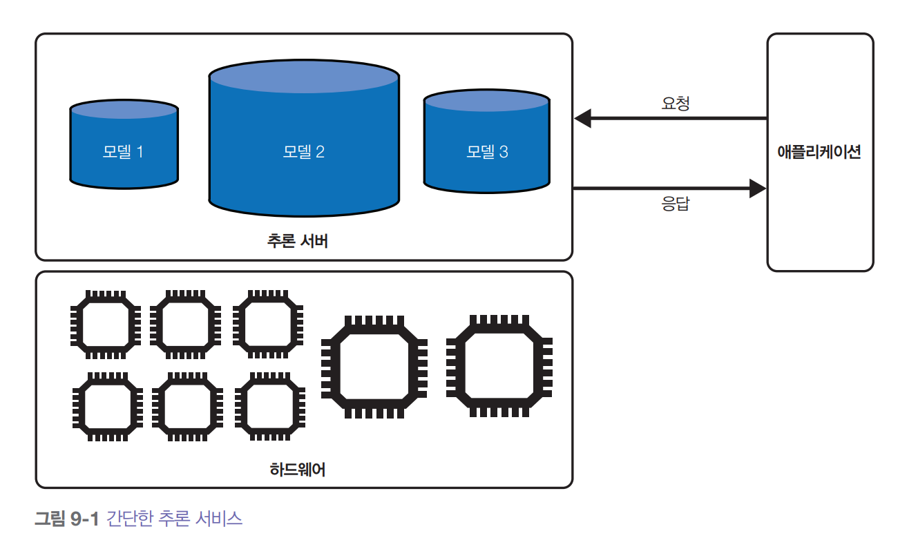  
  
오픈AI나 구글에서 제공하는 모델 API들이 추론 서비스다. 이런 서비스를 사용만 한다면 이번 장에서 설명하는 기법들을 직접 구현할 일이 거의 없다. 
하지만 모델을 직접 호스팅한다면 추론 서비스를 개발하고 최적화하고 유지보수하는 일을 모두 해야 한다.  
  
# **연산 병목**  
최적화는 병목을 찾아내서 해결하는 일이다. 예를 들어 교통을 최적화하려면 도시 계획자들이 정체 구간을 파악하고 이를 해소하는 방법을 찾는다. 마찬가지로 
추론 서버도 담당하는 추론 작업의 연산 병목을 해결하도록 설계해야 한다. 주요 연산 병목에는 연산 제약과 메모리 대역폭 제약, 두 가지가 있다.  
  
- 연산 제약  
연산 제약(compute-bound)은 작업을 끝내는 데 걸리는 시간이 연산량에 따라 결정되는 경우를 말한다. 예를 들어 암호 해독은 암호화 알고리즘을 뚫기 
위해 복잡한 수학 연산을 많이 해야 해서 보통 연산 제약을 받는다.  
- 메모리 대역폭 제약  
메모리 대역폭 제약(memory bandwidth-bound)은 시스템 내부의 데이터 전송 속도에 제약을 받는 경우를 말한다. 특히 메모리와 프로세서 간의 데이터 
전송 속도가 핵심적인 병목 지점이 된다. 예를 들어 CPU 메모리에 데이터를 저장하고 GPU에서 모델을 학습한다면 CPU에서 GPU로 데이터를 옮기는 데 시간이 
오래 걸릴 수 있다. 논문에서는 메모리 대역폭 제약을 그냥 메모리 제약이라고 부르기도 한다.  
  
- 용어릐 모호함: 메모리 제약과 대역폭 제약  
어떤 사람들은 메모리 제약을 메모리 대역폭이 아니라 메모리 용량 떄문에 제한되는 상황을 가리킬 때 사용한다. 이는 하드웨어에 작업을 처리할 충분한 
메모리가 없을 때 발생하는 문제다. 예를 들어 컴퓨터에 인터넷 전체를 저장할 만큼 메모리가 없는 경우에 이런 상황이 된다. 이런 메모리 부족은 모든 
엔지니어가 알고 있는 익숙한 오류로 나타난다. 바로 OOM, 메모리 부족 오류(out-of-memory)다.  
  
하지만 이런 문제는 작업을 작게 나누기만 해도 해결되는 경우가 많다. 예를 들어 GPU 메모리가 부족해서 모델 전체를 GPU에 올릴 수 없다면 모델을 GPU 
메모리와 CPU 메모리에 나누어 저장할 수 있다. 물론 이렇게 하면 CPU와 GPU 사시에서 데이터를 주고받는 시간 떄문에 연산이 느려지지만 데이터 전송이 
충분히 빠르다면 큰 문제가 되지 않는다. 결국 메모리 용량 제한도 실제로는 메모리 대역폭 문제인 셈이다.  
  
연산 제약과 메모리 대역폭 제약이라는 개념은 Roofline 논문에서 처음 소개됐다. 수학적으로는 산술 강도(arithmetic intensity)로 연산이 어느 쪽 
제약을 받는지 구분할 수 있다. 산술 강도는 메모리 1바이트에 접근할 때 몇 번의 산술을 하는지를 뜻한다. 엔비디아 엔사이트 같은 프로파일링 도구를 
쓰면 루프라인 차트(roofline chart)로 작업이 연산 제약인지 메모리 대역폭 제약인지 볼 수 있다. 이는 아래 그림에서 확인할 수 있다.  
  
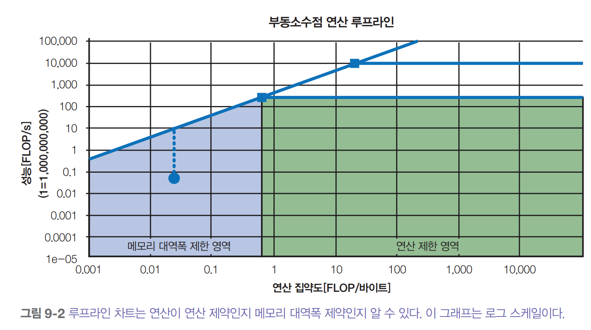  
  
이 차트가 지붕 모양과 비슷해서 루프라인 차트라고 부른다. 루프라인 차트는 하드웨어 성능 분석에서 자주 쓰이는 방법이다.  
  
최적화 기법마다 해결하는 병목이 다르다. 예를 들어 연산 제약 작업은 더 많은 칩에 분산시키거나 연산 성능이 더 좋은 칩(FLOP/s 수치가 높은)을 활용해서 
속도를 높일 수 있다. 메모리 대역폭 제약 작업은 대역폭이 더 넓은 칩을 활용해서 속도를 높일 수 있다.  
  
모델 구조와 작업 종류에 따라 연산 병목도 다르게 나타난다. 예를 들어 스테이블 디퓨전 같은 이미지 생성 모델 추론은 보통 연산 제약이고 자기회귀 언어 
모델 추론은 보통 메모리 대역폭 제약이다.  
  
언어 모델 추론을 예로 들어보자. 트랜스포머 기반 언어 모델 추론은 프리필(prefill)과 디코딩(decode), 두 단계로 나뉜다.  
  
- 프리필  
모델이 입력 토큰들을 병렬로 처리한다. 프리필은 트랜스포머 모델의 초기 KV 캐시를 만드는 과정이다. 한 번에 처리할 수 있는 토큰 개수는 하드웨어가 정해진 
시간에 실행할 수 있는 연산량에 달려 있다. 따라서 프리필은 연산 제약이다.  
- 디코딩  
모델이 출력 토큰을 한 번에 하나씩 생성한다. 큰 틀에서 보면 이 단계는 보통 큰 행렬들(모델 가중치)을 GPU에 불러오는 작업을 포함하는데 이는 하드웨어가 
얼마나 빨리 데이터를 메모리로 불러올 수 있는지에 따라 제한된다. 따라서 디코딩은 메모리 대역폭 제약이다.  
  
아래 그림은 프리필과 디코딩을 시각화한 것이다.  
  
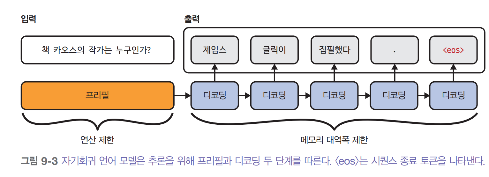  
  
프리필과 디코딩은 연산 방식이 달라서 실제 운영 환경에서는 따로 분리해서 다른 머신에서 돌리는 경우가 많다.  
  
LLM 추론 서버에서 프리필과 디코딩 연산량, 즉 병목이 어디서 생기는지는 컨텍스트 길이, 출력 길이, 배치 요청 방식(한 번에 처리)에 따라 달라진다. 
컨텍스트가 길면 보통 메모리 대역폭 제약이 생기지만 최적화 기법들로 이 병목을 제거할 수 있다.  
  
트랜스포머 아키텍처가 널리 쓰이고 현재 가속기 기술의 한계 떄문에 AI와 데이터 작업 대부분이 메모리 대역폭 제약을 받는다.  
  
# **온라인과 배치 추론 API**  
많은 모델 제공업체가 온라인과 배치, 두 종류의 추론 API를 제공한다.  
  
- 온라인 API는 지연 시간을 최적화한다. 요청이 들어오면 바로 처리한다.  
- 배치 API는 비용을 최적화한다. 애플리케이션에 지연 시간이 그리 중요하지 않다면 배치 API로 보내서 더 효율적으로 처리할 수 있다. 즉 요청을 모아서 
한 번에 처리하거나 저렴한 하드웨어를 쓰는 등 다양한 최적화 기법을 쓸 수 있다. 예를 들어 구글 제미나이와 오픈AI 모두 배치 API를 50% 할인된 
가격에 제공하지만 처리 시간은 훨씬 오래 걸린다. 초나 분 단위가 아니라 시간 단위로 오래 걸린다.  
  
온라인 API도 지연 시간에 큰 영향을 주지 않는 선에서는 요청을 모아서 처리할 수 있다. 우선 여기서 기억해야 할 차이점은 온라인 API는 낮은 지연 시간에, 
배치 API는 높은 처리량에 집중한다는 것이다.  
  
챗봇이나 코드 자동 생성 같은 고객 대면 서비스는 보통 낮은 지연 시간이 필요해서 온라인 API를 쓴다. 지연 시간 요구사항이 덜 엄격해서 배치 API가 적합한 
경우는 다음과 같다.  
  
- 합성 데이터 생성  
- 정기 보고서 작성(슬랙 메시지 요약, 소셜미디어 브랜드 언급 감정 분석, 고객 지원 티켓 분석 등)  
- 업로드한 문서를 모두 처리해야 하는 신규 고객 온보딩 과정  
- 모든 데이터를 다시 처리해야 하는 새 모델로의 마이그레이션  
- 대규모 고객층을 위한 개인화된 추천이나 뉴스레터 생성  
- 회사 데이터를 다시 정리하는 지식 베이스 업데이트  
  
API는 보통 완성된 응답을 통째로 반환한다. 하지만 자기회귀 디코딩에서는 모델이 응답을 완성하는 데 오랜 시간이 걸릴 수 있고 사용자들은 기다리기 
싫어한다. 그래서 많은 온라인 API가 스트리밍 모드를 제공한다. 이는 토큰이 생성되는 대로 하나씩 보내주는 방식이다. 이렇게 하면 사용자가 첫 번쨰 
토큰을 보기까지 기다리는 시간이 줄어든다. 허나 이 방식의 단점은 사용자에게 보여주기 전에 응답을 평가할 수 없어서 사용자가 나쁜 응답을 볼 가능성이 
커진다는 것이다. 하지만 위험이 발견되면 나중에라도 응답을 수정하거나 지울 수는 있다.  
  
파운데이션 모델의 배치 API는 기존 ML의 배치 추론과 다르다. 기존 ML에서는 다음과 같이 사용된다.  
  
- 온라인 추론은 요청이 들어온 후에 예측을 연산한다.  
- 배치 추론은 요청이 들어오기 전에 예측을 미리 연산해둔다.  
  
미리 연산하는 방식은 추천 시스템처럼 입력 범위가 정해져 있고 예측할 수 있는 경우에 가능하다. 모든 사용자에게 추천할 내용을 미리 만들어둘 수 있기 
떄문이다. 이렇게 미리 연산해둔 결과는 요청이 들어올 때 바로 가져다 쓴다. 하지만 파운데이션 모델에서는 사용자가 자유롭게 입력할 수 있어서 모든 
프롬프트를 미리 예측하기 어렵다.  
  
# **추론 성능 지표**  
최적화를 시작하기 전에 어떤 지표를 개선해야 하는지 이해하는 것이 중요하다. 사용자 관점에서는 지연 시간이 가장 중요하다(응답 품질은 모델 자체의 문제이지 
추론 서비스 문제가 아니다). 하지만 애플리케이션 개발자는 애플리케이션 운영 비용을 결정하는 처리량과 활용률도 신경 써야 한다.  
  
# **지연 시간, TTFT, TPOT**  
지연 시간은 사용자가 질의를 보낸 시점부터 완전한 응답을 받기까지 걸리는 시간이다. 자기회귀 생성 방식, 특히 스트리밍 모드에서는 전체 지연 시간을 여러 
지표로 나눌 수 있다.  
  
## **첫 토큰까지 걸리는 시간**  
첫 토큰까지 걸리는 시간(time to first token, TTFT)은 사용자가 질의를 보낸 후 첫 번째 토큰이 나오기까지 걸리는 시간이다. 이는 프리필 단계에 해당하고 
입력 길이에 따라 달라진다. 애플리케이션마다 TTFT에 대한 사용자 기대치가 다를 수 있다. 예를 들어 대화형 챗봇이라면 TTFT는 즉시 나와야 한다. 하지만 
긴 문서를 요약할 떄는 좀 더 기다려도 괜찮을 수 있다.  
  
## **출력 토큰당 시간**  
출력 토큰당 시간(time per output token, TPOT)은 첫 번째 토큰 이후 각 토큰이 얼마나 빨리 생성되는지 측정한다. 토큰 하나당 100ms씩 걸린다면 1000개 
토큰 응답에는 100초가 걸린다. 토큰이 생성되는 대로 사용자가 읽는 스트리밍 모드에서는 TPOT가 사람의 읽기 속도보다 빨라야 하지만 훨씬 빠를 필요는 
없다. 매우 빠른 독자는 토큰당 120ms정도로 읽을 수 있으므로 약 120ms 또는 초당 6~8 토큰이면 대부분 충분하다.  
  
## **토큰 간 시간과 토큰 간 지연 시간**  
비슷한 지표로 토큰 간 시간(time between tokens, TBT)과 토큰 간 지연 시간(ITL)이 있다. 둘 다 출력 토큰 사이사이 걸리는 시간을 측정한다.  
  
전체 지연 시간은 TTFT + TPOT * (출력 토큰 수)다.  
  
전체 지연 시간이 같아고 TTFT와 TPOT가 다르면 사용자 경험도 달라진다. 사용자들이 첫 토큰은 즉시 나오지만 그다음 토큰들이 느린 것을 좋아할까, 
아니면 첫 토큰은 좀 기다려도 그 이후가 빠른 것을 선호할까? 최적의 사용자 경험을 찾으려면 연구가 필요하다. 연산 자원을 디코딩에서 프리필로 옮기거나 
그 반대로 하면 TTFT를 줄이는 대신 TPOT를 높이는 것도 가능하다.  
  
사용자가 경험하는 TTFT와 TPOT 값은 모델 관점과 다를 수 있다는 점을 기억하는 것이 중요하다. 특히 생각의 사슬(CoT)이나 에이전트 방식에서 모델이 
내부적으로 중간 단계를 거칠 때 더욱 그렇다. 일부 팀은 사용자가 실제로 보는 첫 토큰까지의 시간이라는 의미로 공개까지의 시간(time to publish)이라는 
지표를 사용한다.  
  
사용자가 질의를 보낸 후 모델이 이런 과정을 거친다고 해보자.  
  
1. 행동 순서로 이뤄진 계획을 생성한다. 이 계획은 사용자에게 보여주지 않는다.  
2. 행동을 실행하고 그 결과를 기록한다. 이 결과들도 사용자에게 보여주지 않는다.  
3. 이 결과들을 바탕으로 사용자에게 보여줄 최종 응답을 생성한다.  
  
모델 입장에서는 1단계에서 첫 토큰이 나온다. 모델이 내부적으로 토큰 생성을 시작하는 시점이다. 하지만 사용자는 3단계에서 생성된 최종 출력의 첫 토큰만 
본다. 그래서 사용자가 느끼는 TTFT는 훨씬 길다.  
  
지연 시간은 여러 값들의 분포로 나타나기 떄문에 평균만 보면 잘못 판단할 수 있다. TTFT 값이 100ms, 102ms, 100ms, 100ms, 99ms, 104ms, 110ms, 
90ms, 3000ms, 95ms인 10개 요청이 있다고 하자. 평균 TTFT 값은 390ms로 추론 서비스가 실제보다 느려 보인다. 네트워크 오류로 한 요청이 늦어졌거나 
특별히 긴 프롬프트 떄문에 프리필이 오래 걸렸을 수 있다. 어떤 경우든 원인을 찾아봐야 한다. 요청이 많으면 평균을 왜곡하는 이상치가 생기기 마련이다.  
  
지연 시간을 백분위수로 보는 것이 더 도움이 된다. 백분위수는 전체 요청 중 특정 비율에 대한 정보를 준다. 가장 많이 쓰는 건 50번째 백분위수인 p50(중앙값)
이다. 중앙값이 100ms라면 요청 절반은 첫 토큰 생성에 100ms보다 오래 걸리고 절반은 100ms보다 적게 걸린다. 백분위수는 뭔가 잘못됐다는 신호일 수 있는 
이상치를 발견하는 데도 도움이 된다. 일반적으로 살펴봐야 할 백분위수는 p90, p95, p99다. TTFT 값을 입력 길이별로 그래프로 그려보는 것도 도움이 된다.  
  
# **처리량과 굿풋**  
처리량(throughput)은 추론 서비스가 모든 사용자와 요청을 통틀어서 초당 몇 개의 출력 토큰을 만들어낼 수 있는지를 측정한다.  
  
일부 팀은 처리량을 연산할 떄 입력 토큰과 출력 토큰을 함계 센다. 하지만 입력 토큰 처리(프리필)와 출력 토큰 생성(디코딩)은 병목 지점이 다르고 
최신 추론 서버에서는 둘을 분리해서 처리하는 경우가 많아서 입력과 출력 처리량을 따로 연산해야 한다. 보통 처리량이라고 하면 출력 토큰을 의미한다.  
  
처리량은 주로 tokens/s(TPS)로 측정한다. 여러 사용자에게 서비스한다면 tokens/s/user로 사용자가 늘어날 떄 시스템이 어떻게 확장되는지 평가하기도 
한다.  
  
처리량을 정해진 시간 동안 완료한 요청 개수로 측정할 수도 있다. 많은 애플리케이션에서 초당 요청 수(requests per second, RPS)를 사용한다. 하지만 
파운데이션 모델 기반 애플리케이션에서는 요청 하나가 완료되는데 몇 초씩 걸릴 수 있어서 분당 완료 요청 수(requests per minute, RPM)를 더 많이 
쓴다. 이 지표로 추론 서비스가 동시 요청을 어떻게 처리하는지 알 수 있다. 일부 업체는 동시에 너무 많은 요청을 보내면 서비스를 제한하기도 한다.  
  
처리량은 연산 비용과 바로 연결된다. 처리량이 높을수록 보통 비용이 낮다. 시스템 연산 비용이 시간당 2달러이고 처리량이 초당 100토큰이라면 출력 토큰 
100만 개당 약 5.556 달러가 든다. 요청 하나당 평균 200개 출력 토큰을 생성한다면 1천 개 요청을 디코딩하는 데 1.11달러가 든다.  
  
프리필 비용도 비슷하게 연산할 수 있다. 하드웨어 비용이 시간당 2달러이고 분당 100개 요청을 프리필할 수 있다면 1천개 요청 프리필에는 0.33달러가 든다.  
  
요청당 총비용은 프리필 비용과 디코딩 비용을 합친 것이다. 이 예시에서는 1천 개 요청의 총 비용을 연산하면 1.11달러 + 0.33달러 = 1.44달러다.  
  
어느 정도가 좋은 처리량인지는 모델, 하드웨어, 작업에 따라 달라진다. 작은 모델과 고성능 칩은 보통 처리량이 높다. 그리고 입력과 출력 길이가 일정한 
작업이 길이가 들쭉날쭉한 작업보다 최적화하기 쉽다.  
  
비슷한 크기의 모델과 하드웨어, 작업이라도 처리량을 직접 비교하는 건 대략적일 뿐이다. 토큰 개수는 무엇을 토큰으로 보느냐에 따라 달라지고 모델마다 
토크나이저가 다르기 떄문이다. 따라서 요청당 비용 같은 지표로 추론 서버의 효율성을 비교하는 게 낫다.  
  
다른 소프트웨어 애플리케이션과 마찬가지로 AI 애플리케이션에도 지연 시간과 처리량 사이의 트레이드오프가 있다. 배치 처리 기법은 처리량을 높이지만 
지연 시간이 늘어난다. 1년간 생성형 AI 제품을 운영한 링크드인 AI 팀의 회고에 따르면 TTFT와 TPOT를 조금 희생하면 처리량을 2~3배까지 올릴 수 있는 
경우가 많다.  
  
이런 트레이드오프 떄문에 추론 서비스를 처리량과 비용만으로 판단하면 사용자 경험이 나빠질 수 있다. 그래서 일부 팀은 네트워킹 분야에서 LLM 애플리케이션에 
맞게 변형한 지표인 굿풋(goodput)이라는 지표에 집중한다. 굿풋은 소프트웨어 수준 목표(software-level-objective, SLO)를 만족하는 초당 요청 개수를 
측정한다.  
  
애플리케이션에 다음과 같은 목표가 있다고 해보자. TTFT 최대 200ms, TPOT 최대 100ms, 추론 서비스가 분당 100개 요청을 완료할 수 있다고 하자. 하지만 이 100개 
요청 중 30개만 SLO를 만족한다면 이 서비스의 굿풋은 30 RPM이다. 아래 그림은 초당 요청 수(RPS)를 사용한 또 다른 예시를 보여준다.  
  
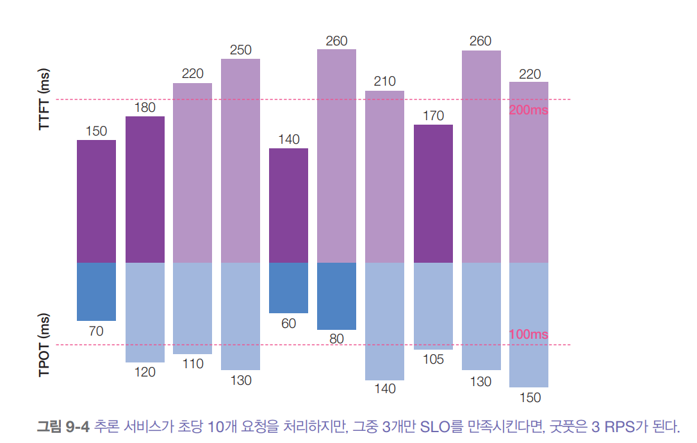  
  
# **활용률, MFU, MBU**  
활용률(utilization) 지표는 리소스가 얼마나 효율적으로 사용되고 있는지 측정한다. 보통 전체 사용 가능한 용량 중에서 실제로 쓰이고 있는 비율을 
말한다.  
  
자주 쓰이지만 오해받는 지표가 GPU 활용률인데 엔비디아가 이런 혼란을 어느 정도 만들어냈다. GPU 사용량을 모니터링하는 공식 엔비디아 도구는 nvidia-smi다
(SMI는 시스템 관리 인터페이스, system management interface를 뜻한다). 이 도구가 보여주는 지표 중 하나가 GPU 활용률인데 이는 GPU가 실제로 
작업을 처리하는 시간의 비율을 의미한다. 예를 들어 GPU 클러스터에서 10시간 동안 추론을 실행했는데 그중 5시간 동안 GPU가 실제로 작업을 처리했다면 
GPU 활용률은 50%다.  
  
하지만 작업을 처리하고 있다고 해서 효율적으로 하고 있다는 뜻은 아니다. 간단한 예로 초당 100개 연산이 가능한 작은 GPU를 생각해 보자. nvidia-smi의 
활용률 정의에 따르면 이 GPU는 초당 1개 연산만 하고 있어도 100% 활용률로 나타날 수 있다.  
  
100개 연산이 가능한 머신에 돈을 내고 1개 연산만 쓴다면 돈 낭비다. 그래서 실제로 nvidia-smi의 GPU 활용률 지표는 별로 도움이 되지 않는다. 정말 
중요한 활용률 지표는 머신이 할 수 있는 모든 연산 중에서 정해진 시간에 실제로 몇 개를 하고 있는지다. 이 지표를 MFU(model FLOP/s utilization)라고 
해서 엔비디아 GPU 활용률 지표와 구분해서 사용한다.  
  
MFU란 시스템이 최고 FLOP/s로 동작할 떄 달성할 수 있는 이론상 최대 처리량 대비 실제 처리량(tokens/s)이 어느 정도인지를 나타내는 효율 지표다. 칩 
제조사가 광고하는 최대 FLOP/s에서 칩이 초당 100개 토큰을 생성할 수 있지만 실제 추론 서비스에서는 초당 20개 토큰만 생성한다면 MFU는 20%다.  
  
마찬가지로 메모리 대역폭은 비싸기 떄문에 하드웨어 대역폭이 얼마나 효율적으로 활용되고 있는지도 알고 싶을 것이다. MBU(model bandwidth utilization)는 
사용 가능한 메모리 대역폭 중 실제 쓰이는 비율을 측정한다. 칩의 최대 대역폭이 1TB/s인데 추론에서 500GB/s만 사용한다면 MBU는 50%다.  
  
LM 추론에 사용되는 메모리 대역폭을 연산하는 것은 간단하다.  
  
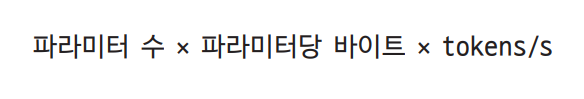  
  
MBU는 다음과 같이 연산한다.  
  
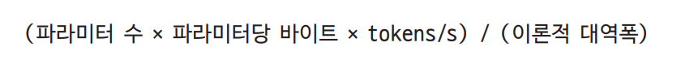  
  
예를 들어 70억 파라미터 모델을 FP16(파라미터당 2바이트)으로 사용해서 초당 100토큰을 얻는다면 사용되는 대역폭은 다음과 같다.  
  
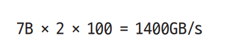  
  
이걸 보면 양자화가 왜 중요한지 알 수 있다. 파라미터당 바이트 수가 적을수록 모델이 소중한 대역폭을 덜 소모한다.  
  
이론적 메모리 대역폭이 2TB/s인 A100-80GB GPU에서 한다면 MBU는 다음과 같다.  
  
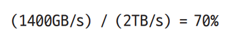  
  
처리량(tokens/s)과 MBU, 그리고 처리량과 MFU 사이의 관계는 일반적으로 선형이라서 일부 사람들은 처리량으로 MBU와 MFU를 표현하기도 한다.  
  
좋은 MFU와 MBU 수준은 모델, 하드웨어, 작업에 따라 다르다. 연산 제약 작업은 보통 MFU가 높고 MBU가 낮으며 대역폭 제약 작업은 흔히 MFU가 낮고 
MBU가 높다.  
  
학습은 추론보다 작업 패턴이 예측 가능해서 더 효율적인 최적화(배치 처리 개선 등)를 적용할 수 있기 떄문에 학습 MFU가 보통 추론 MFU보다 높다. 
추론에서 프리필 단계는 연산 위주고 디코딩 단계는 메모리 대역폭 위주다. 그래서 보통 프리필 떄의 MFU가 디코딩 떄의 MFU보다 높다. 모델 학습에서는 
집필 시점에서 MFU 50% 이상을 일반적으로 좋다고 보지만 하드웨어에 따라 쉽지 않을 수 있다. 아래 표는 다양한 모델과 가속기의 MFU 예시다.  
  
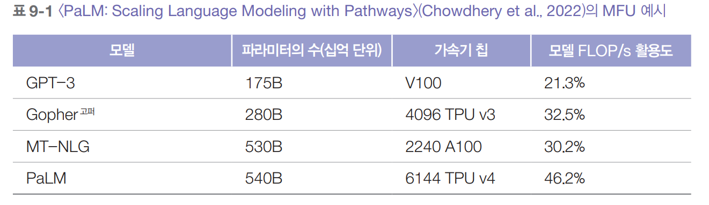  
  
아래 그림은 서로 다른 하드웨어에서 라마 2-70B를 FP16으로 추론할 떄의 MBU를 보여준다. 수치가 떨어지는 이유는 사용자가 늘어나면 연산 부하가 커져서 
병목이 대역폭에서 연산으로 옮겨지기 떄문인 것으로 보인다.  
  
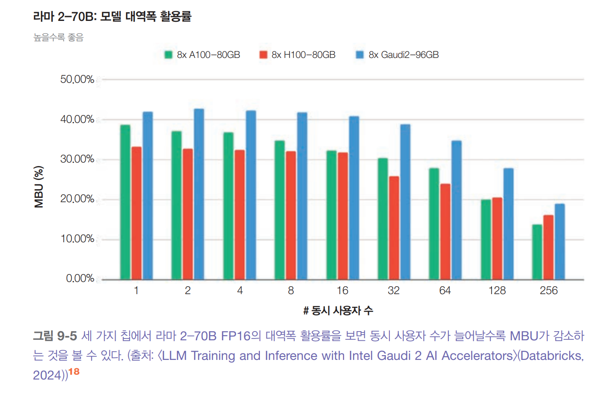  
  
활용률 지표는 시스템이 얼마나 효율적으로 돌아가는지 확인하는 데 유용하다. 같은 하드웨어에서 비슷한 작업을 할 떄 활용률이 높다면 보통 서비스가 
점점 더 효율적으로 바뀌고 있다는 뜻이다. 하지만 목표가 활용률이 제일 높은 칩을 고르는 것이 아니다. 진짜 중요한 건 작업을 더 빠르고 저렴하게 처리하는 
것이다. 비용도 늘고 지연 시간도 증가한다면 활용률이 높아도 소용없다.  
  
# **AI 가속기**  
소프트웨어가 얼마나 빠르고 저렴하게 돌아가는지는 어떤 하드웨어에서 실행되느냐에 달려 있다. 모든 하드웨어에서 작동하는 최적화 기법들이 있지만 
하드웨어를 제대로 이해하면 훨씬 깊이 있는 최적화를 할 수 있다. 여기서는 추론 관점에서 하드웨어를 살펴보지만 이는 학습 과정에도 적용할 수 있다.  
  
AI 모델과 하드웨어의 발전은 늘 함께 얽혀서 진행됐다. 1970년대 첫 번째 AI 빙하기가 온 이유 중 하나는 강력한 컴퓨터가 없었기 떄문이다.  
  
2012년에 딥러닝이 다시 주목받은 것도 컴퓨팅 파워와 직결되어 있다. 알렉스넷이 유명해진 이유로 많이 꼽히는 것은 바로 신경망 학습에 GPU를 성공적으로 
사용한 첫 번째 논문이기 떄문이다. 알렉스넷이 나오기 몇 달 전 구글이 발표한 연구에 따르면 알렉스넷 규모의 모델을 학습하려면 수천 개의 CPU가 필요했다. 
수천 개의 CPU가 아닌 몇 개의 GPU만으로 모델 학습이 가능해졌고 이를 통해 박사과정 학생들과 연구자들을 중심으로 딥러닝 연구 붐이 일어났다.  
  
# **가속기의 정의**  
가속기는 단순하게 설명하면 특정 종류의 연산 작업을 빠르게 처리하도록 만들어진 칩이다. AI 가속기는 AI 작업 전용으로 설계된다. 가장 널리 쓰이는 AI 
가속기는 GPU고 2020년대 초 AI 시대를 이끈 일등공신은 두말할 나위 없이 엔비디아다.  
  
CPU와 GPU의 주요 차이점은 CPU는 범용 작업용으로 GPU는 병렬 처리용으로 만들어졌다는 것이다.  
  
- CPU는 강력한 코어 몇 개를 가지고 있다. 보통 고급 소비자용 머신에는 최대 64개 코어까지 있다. 많은 CPU 코어가 멀티스레드 작업을 효과적으로 처리할 
수는 있지만 운영체제 실행, I/O(입출력) 작업 관리, 복잡한 순차 프로세스 처리 같은 높은 단일 스레드 성능이 필요한 작업에 특히 뛰어나다.  
- GPU는 수천 개의 작고 상대적으로 약한 코어를 가지고 있다. 그래픽 렌더링이나 ML처럼 다량의 작은 독립적인 연산으로 나눌 수 있는 작업에 최적화되어 
있다. 대부분 ML 작업은 병렬화에 매우 용이한 행렬 곱셈 연산이 주를 이룬다.  
  
효율적인 병렬 처리를 추구하면 연산 능력은 늘어나지만 메모리 설계와 전력 소비에 어려움이 생긴다.  
  
엔비디아 GPU의 성공은 많은 AI 워크로드의 속도를 높이기 위해 설계된 많은 가속기의 등장을 이끌었다. 여기에는 AMD의 최신 GPU, 구글의 텐서 처리 장치
(tensor processing unit, TPU), 인텔의 하바나 가우디, 그래프코어의 지능형 처리 장치(intelligent processing unit, IPU), 그로크의 언어 처리 
장치(language processing unit, LPU), 세레브라스의 웨이퍼 스케일 양자 처리 장치(quant processing unit, QPU) 등이 그 예이고 계속해서 
더 많은 칩들이 나오고 있다.  
  
많은 칩이 학습과 추론을 모두 처리할 수 있지만 최근 떠로으는 중요한 흐름 중 하나는 추론 전용 칩이다. 데시슬라보프등의 연구에 따르면 보편적으로 
사용되는 시스템에서는 추론 비용이 학습 비용을 넘어설 수 있으며 이미 배포되어 운영 중인 AI 시스템은 ML 관련 비용의 최대 90%를 추론이 차지하는 것으로 
나타났다.  
  
학습은 역전파 떄문에 훨씬 더 많은 메모리가 필요하고 일반적으로 낮은 정밀도에서는 수행하기 더 어렵다. 게다가 학습은 보통 처리량에 집중하는 반면 
추론은 지연 시간을 줄이는 것을 목표로 한다. 따라서 추론용으로 설계된 칩들은 대용량 메모리보다는 낮은 정밀도와 더 빠른 메모리 접근에 최적화된 경우가 
많다. 이런 칩의 예로는 애플킈 Neural Engine, AWS의 Inferentia, 메타의 MTIA가 있다. 구글의 엣지 TPU나 엔비디아의 Jetson Xavier 같은 엣지 
컴퓨팅용 칩 역시 일반적으로 추론을 목표로 한다.  
  
트랜스포머 전용 칩처럼 특정 모델 아키텍처에 특화된 칩들도 있다. 현재 많은 칩이 데이터 센터용으로 설계되며 스마트폰이나 노트북 같은 소비자용 기기를 
위한 칩도 점점 더 많이 설계되고 있다.  
  
하드웨어 아키텍처마다 메모리 레이아웃과 특화된 연산 유닛(compute unit)이 다르며 이는 시간이 지나면서 계속 발전한다. 아래 그림에서 볼 수 있듯이 
이런 유닛들은 스칼라, 벡터, 텐서와 같은 특정 데이터 유형에 최적화되어 있다.  
  
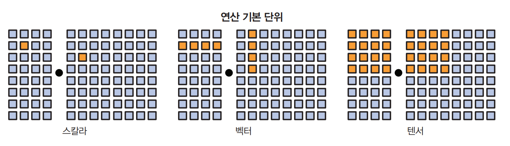  
  
한 칩 안에는 여러 데이터 유형에 최적화된 다양한 연산 유닛이 함꼐 들어 있을 수 있다. 예를 들어 GPU는 원래 벡터 연산을 지원했지만 최신 GPU 대부분은 
행렬과 텐서 연산에 특화된 텐서 코어를 포함한다. 반면 TPU는 처음부터 텐서 연산을 주된 연산 방식으로 삼아 만들어졌다. 특정 하드웨어에서 모델을 
효율적으로 돌리려면 그 하드웨어의 메모리 구조와 연산 방식을 고려해야 한다.  
  
칩의 사양에는 특정 용도로 칩을 평가할 떄 도움이 되는 자세한 정보가 많이 들어 있다. 하지만 어떤 용도든 중요한 핵심 특성은 연산 성능, 메모리 크기와 
대역폭, 전력 소모다. 이런 특성들을 설명하기 위해 GPU를 예시로 든다.  
  
# **연산 성능**  
연산 성능은 보통 칩이 정해진 시간에 수행할 수 있는 연산 수로 측정한다. 가장 많이 쓰는 지표는 초당 부동 소수점 연산 횟수를 측정하는 FLOP/s다
(보통 FLOPS로 표기). 하지만 현실적으로 애플리케이션이 이 최대 FLOP/s 수치를 달성할 가능성은 거의 없다. 실제 FLOP/s와 이론적인 최고 FLOP/s 
사이의 비율은 하나의 활용도 지표가 된다.  
  
칩이 1초에 수행할 수 있는 연산 횟수는 수치 정밀도에 따라 달라진다. 정밀도가 높을수록 칩이 실행할 수 있는 연산은 줄어든다. 32비트 숫자 두 개를 
더하는 것이 16비트 숫자 두 개를 더하는 것보다 일반적으로 두 배의 연산이 필요하다고 생각해 보자. 다만 칩의 최적화 방식이 저마다 다르기 떄문에 칩이 
주어진 시간에 수행할 수 있는 32비트 연산 횟수가 16비트 연산 횟수의 정확히 절반이 되지 않는다.  
  
아래 표는 엔비디아 H100 SXM 칩의 여러 정밀도 형식별 FLOP/s 사양을 보여준다.  
  
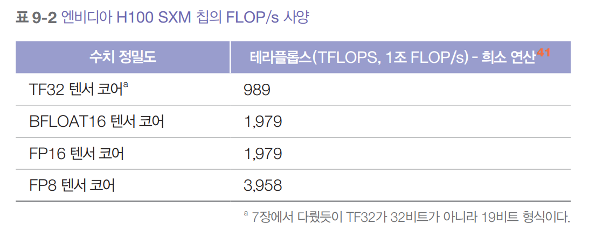  
  
# **메모리 크기와 대역폭**  
GPU는 수많은 코어가 병렬로 작동하기 떄문에 메모리에서 이 코어들로 데이터를 계속해서 옮겨야 하므로 데이터 전송 속도가 중요하다. 특히 거대한 가중치 
행렬과 학습 데이터를 다루는 AI 모델에서는 데이터 전송이 매우 중요하다. 이런 대량의 데이터가 빠르게 전송되어야 코어들이 효율적으로 계속 바쁘게 
돌아간다. 그래서 GPU 메모리는 CPU 메모리보다 더 넓은 대역폭과 더 낮은 지연 시간이 필요하고 따라서 GPU 메모리는 더 고급 메모리 기술이 필요하다. 
이것이 GPU 메모리가 CPU 메모리보다 비싼 이유 중 하나다.  
  
좀 더 구체적으로 말하면 CPU는 보통 2D 구조인 DDR SDRAM(double data rate synchronous dynamic random-access memory)을 사용한다. GPU, 
특히 고급형 3D 적층 구조인 HBM(high-bandwith memory)을 많이 사용한다.  
  
가속기의 메모리는 크기와 대역폭으로 평가된다. 이 수치들은 가속기가 들어가는 전체 시스템의 맥락 안에서 평가되어야 한다. GPU 같은 가속기는 보통 아래 
그림처럼 세단계 메모리와 상호작용한다.  
  
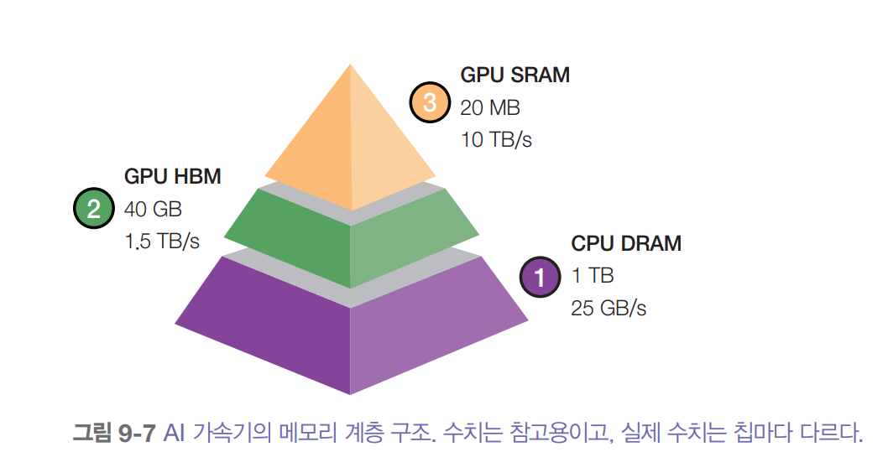  
  
# **CPU 메모리(DRAM)**  
가속기는 보통 CPU와 함꼐 사용되어 CPU 메모리(시스템 메모리, 호스트 메모리, 또는 그냥 CPU DRAM)에 접근할 수 있다.  
  
CPU 메모리는 보통 이런 메모리 유형 중 대역폭이 가장 낮고 데이터 저송 속도는 25GB/s에서 50GB/s 정도다. CPU 메모리 크기는 다양하다. 일반 노트북은 
16~64GB 정도고 고급 워크스테이션은 1TB 이상도 가능하다.  
  
**# GPU 고대역폭 메모리(HBM)**  
GPU 전용 메모리로 CPU 메모리보다 빠르게 접근하기 위해 GPU 가까이에 둔다.  
  
HBM은 훨씬 높은 대역폭을 제공하며 데이터 전송 속도는 보통 256GB/s에서 1.5TB/s 이상이다. 이 속도는 대량 데이터 전송과 높은 처리량 작업을 효율적으로 
처리하는 데 꼭 필요하다. 소비자용 GPU는 약 24~80GB의 HBM을 가진다.  
  
# **GPU 온칩 SRAM**  
칩 안에 바로 들어 있는 메모리로 자주 쓰는 데이터와 지시를 거의 바로 접근할 수 있게 저장한다. SRAM으로 만들어진 L1과 L2 캐시가 포함되고 일부 
구조에서는 L3 캐시도 포함한다. 이 캐시들은 레지스터 파일과 공유 메모리 같은 다른 부품들과 함께 더 큰 온칩 메모리의 일부가 된다.  
  
SRAM은 데이터 전송 속도가 매우 빨라서 종종 10TB/s를 넘는다. GPU SRAM의 크기는 작아서 보통 40MB 이하다.  
  
GPU 최적화의 상당 부분은 이 메모리 계층 구조를 어떻게 최대한 활용하느냐에 달려 있다. 하지만 파이토치와 텐서플로 같은 인기 프레임워크들은 아직 
메모리 접근을 세밀하게 제어할 수 없다. 그래서 많은 AI 연구자와 엔지니어가 CUDA(compute unified device architecture), 오픈AI의 트리톤, 
ROCm(radeon open compute) 같은 GPU 프로그래밍 언어에 관심을 갖게 되었다. ROCm은 엔비디아의 독점 CUDA에 맞서는 AMD의 오픈 소스 대안이다.  
  
# **전력 소모**  
칩은 연산할 떄 트랜지스터를 사용한다. 각 연산은 트랜지스터가 켜졌다 꺼졌다 하면서 이뤄지는데 이 과정에서 에너지가 필요하다. GPU는 수십억 개의 트랜지스터가 
들어 있다. 엔비디아 A100은 540억 개, H100은 800억 개의 트랜지스터를 가진다. 가속기를 제대로 활용하면 수십억 개의 트랜지스터가 빠르게 상태를 
바꾸면서 엄청난 양의 에너지를 소비하고 상당한 열을 발생시킨다. 이 열을 식히려면 냉각 시스템이 필요한데 이 시스템에도 전기가 필요하므로 데이터센터 
전체 에너지 소비가 늘어난다.  
  
이처럼 데이터 센터의 에너지 소모는 환경에 엄청난 영향을 줄 수 있어서 기업들이 친환경 데이터센터 기술에 투자해야 한다는 압박이 커지고 있다. 엔비디아 
H100이 1년 내내 최대 성능으로 돌아가면 약 7000kWh를 소비한다. 참고로 미국 가정의 연간 평균 전력 사용량은 10000kWh다. 이렇게 전력 소모가 크다 보니 
이제는 컴퓨팅 확장에서 전력이 가장 큰 걸림돌이 되고 있다.  
  
가속기는 보통 최대 전력 소모량이나 대체 지표인 열 설계 전력(thermal design power, TDP)로 전력 소모를 표시한다.  
  
- 최대 전력 소모량은 칩이 최대 부하 상태에서 뽑아낼 수 있는 최대 전력을 나타낸다.  
- TDP는 칩이 일반적인 작업을 할 떄 냉각 시스템이 방출해야 하는 최대 열을 나타낸다. 전력 소비를 정확히 측정한 건 아니지만 예상 전력 소모량을 
나타내는 지표다. CPU와 GPU에서 최대 전력 소모량은 대략 TDP의 1.1배에서 1.5배 정도지만 정확한 비율은 구조와 작업에 따라 달라진다.  
  
물론 클라우드 업체를 사용하면 냉각이나 전력 걱정은 안 해도 된다. 하지만 이 수치들은 가속기가 환경과 전체 전력 수요에 미치는 영향을 이해하는 데 
여전히 도움이 된다.  
  
# **가속기 선택**  
어떤 가속기를 쓸지는 작업 종류에 따라 달라진다. 연산 중심 작업이라면 FLOP/s가 높은 칩을 찾는 것이 좋다. 메모리 중심 작업이라면 대역폭이 넓고 
메모리 용량이 큰 칩에 투자하는 것이 훨씬 편할 것이다.  
  
칩을 살 때는 세 가지 핵심 질문을 해봐야 한다.  
  
- 이 하드웨어로 원하는 작업을 실행할 수 있는가?  
- 실행하는 데 얼마나 걸리는가?  
- 비용이 얼마나 드는가?  
  
FLOP/s 메모리 크기, 메모리 대역폭이 처음 두 질문에 답해주는 핵심 수치다. 마지막 질문은 간단하다. 클라우드 업체의 가격은 보통 사용한 만큼 내는 
방식이고 업체끼리 비슷비슷하다. 하드웨어를 직접 산다면 구입 가격과 계속 나가는 전력 소모비를 합쳐서 비용을 연산할 수 있다.  
  
# **추론 최적화**  
추론 최적화는 모델, 하드웨어, 서비스 수준에서 할 수 있다. 차이를 설명하기 위해 양궁에 비유해 보자. 모델 수준 최적화는 더 좋은 화살을 만드는 
것이고 하드웨어 수준 최적화는 더 강하고 실력 있는 궁수를 기르는 것과 같다. 그리고 서비스 수준 최적화는 활부터 조준 환경까지 전체 사격 과정을 개선하는 
것과 같다.  
  
이상적으로는 속도와 비용을 위해 모델을 최적화해도 모델 품질은 그대로여야 한다. 하지만 많은 최적화 기법이 모델 성능을 떨어뜨릴 수 있다. 아래 그림은 
라마 모델을 여러 추론 서비스 제공업체가 제공할 때 각 벤치마크의 성능 차이를 보여준다.  
  
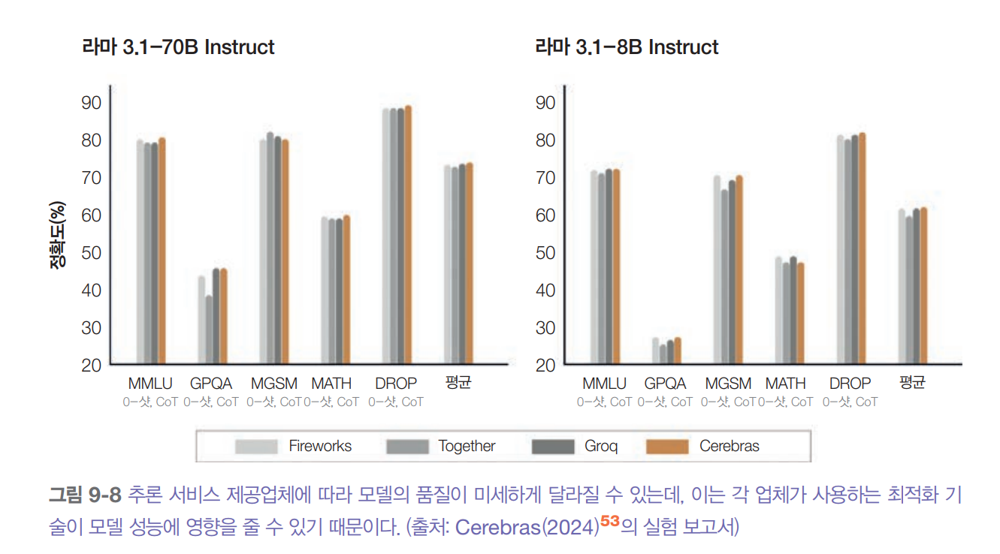  
  
하드웨어 설계는 범위를 벗어나므로 모델과 서비스 수준 기법들을 다룬다. 실제 운영 환경에서는 보통 여러 기법들을 함께 사용한다.  
  
# **모델 최적화**  
모델 수준 최적화는 모델 자체를 수정하는 방식으로 효율성을 높이는 것을 목표로 하며 이 때문에 모델의 성능이 바뀔 수 있다. 많은 파운데이션 모델이 
트랜스포머 아키텍처를 따르고 자기회귀 언어 모델 구성 요소를 포함하고 있다. 이런 모델들은 추론을 리소스 집약적으로 만드는 세 가지 특성이 있다. 모델 크기, 
자기회귀 디코딩, 어텐션 메커니즘이다.  
  
# **모델 압축**  
모델 압축은 모델 크기를 줄이는 여러 기법을 말한다. 모델이 작아지면 속도도 발라질 수 있다. 두 가지 대표적인 모델 압축 기법이 있는데 양자화와 증류다. 
양자화는 모델의 정밀도를 낮춰서 메모리 사용량을 줄이고 처리량을 늘리는 것이다. 모델 증류는 작은 모델이 큰 모델의 동작을 따라하도록 학습시키는 것이다.  
  
모델 증류를 보면 더 적은 파라미터로 큰 모델의 동작을 잡아낼 수 있다는 걸 알 수 있다. 그렇다면 큰 모델 안에 전체 모델의 동작을 담을 수 있는 
파라미터의 부분집합이 존재하지 않을까? 이럭싱 프루닝(pruning)의 핵심 아이디어다.  
  
신경망에서 프루닝은 두 가지 뜻이 있다. 하나는 신경망 노드 전체를 제거하는 것으로 아키텍처를 바꾸고 파라미터 개수를 줄인다. 다른 하나는 예측에 별로 
도움이 안 되는 파라미터를 찾아서 0으로 설정하는 것이다. 이 경우 프루닝은 전체 파라미터 개수를 줄이지 않고 0이 아닌 파라미터 개수만 줄인다. 이렇게 
하면 모델이 더 희소해져서 모델 저장 공간도 줄고 연산도 빨라진다.  
  
프루닝한 모델은 그대로 써도 되지만 추가로 파인튜닝해서 남은 파라미터를 조정하고 프루닝 떄문에 떨어진 성능을 회복할 수 있다.  
  
프루닝은 유망한 모델 아키텍처를 발견하는 데 도움이 될 수 있다. 또한 프루닝 전보다 작아진 이런 아키텍처들은 처음부터 새로 학습시킬 수도 있다.  
  
프루닝 관련 논문을 찾아보면 프루닝으로 좋은 결과를 낸 경우가 많다. 예를 들어 프랭클과 카빈의 연구는 프루닝 기법으로 일부 학습된 네트워크의 0이 
아닌 파라미터 개수를 90% 이상 줄이면서도 정확도는 그대로 유지하고 메모리 사용량을 줄이며 속도를 개선할 수 있다고 보여줬다.  
  
하지만 실제로 프루닝을 쓰는 경우가 많지 않다. 원본 모델 아키텍처에 대한 이해가 필요해서 하기가 더 어렵고 다른 방법들보다 성능 향상도 훨씬 적은 
경우가 많기 떄문이다. 또한 프루닝은 희소 모델을 만드는데 모든 하드웨어 아키텍처가 그 희소성의 이점을 잘 활용하도록 설계되어 있지는 않다.  
  
그래서 가중치 전용 양자화(weight-only quantization)가 이 분야에서 단언코 가장 인기 있는 방법이다. 쓰기 쉽고 많은 모델에서 바로 작동하며 효과가 
뛰어나기 떄문이다. 모델 정밀도를 32비트에서 16비트로 줄이면 메모리 사용량이 절반으로 줄어든다. 하지만 양자화는 거의 한계에 다다르고 있다. 값 
하나당 1비트보다 더 낮출 수는 없기 떄문이다. 한편 증류 역시 많이 쓰이는데 사용자의 필요에 맞춰 훨씬 큰 모델과 비슷하게 동작하는 작은 모델을 만들 
수 있기 떄문이다.  
  
# **자기회귀 디코딩 병목 현상 극복하기**  
자기회귀 언어 모델은 토큰을 하나씩 차례로 생성한다. 토큰 하나를 생성하는 데 100ms가 걸린다면 100개 토큰으로 이루어진 응답은 10초가 걸린다. 토큰을 
하나씩 만들 떄마다 가속기의 고대역폭 메모리에서 연산 유닛으로 모델 파라미터 전체를 옮겨야 한다. 그래서 이 작업은 대역폭을 많이 잡아먹는다. 모델이 
한 번에 토큰 하나밖에 만들지 못해 FLOP/s를 조금밖에 안 써서 연산 효율이 떨어진다. 이 과정은 느릴 뿐만 아니라 비용도 많이 든다. 여러 모델 API 
업체에서 출력 토큰은 입력 토큰보다 대략 2~4배의 비용이 든다. 애니스케일은 실험에서 출력 토큰 하나가 지연 시간에 미치는 영향이 입력 토큰 100개와 
맞먹을 수 있다는 것을 발견했다. 자기회귀 생성 과정을 조금만 개선해도 사용자 경험이 크게 향상될 수 있다.  
  
이 분야가 빠르게 발전하면서 불가능해 보이는 이 병목을 극복하는 새로운 기법들이 개발되고 있다. 언젠가는 이런 병목 자체가 없는 아키텍처가 나올지도 
모른다. 여기서 다루는 기법들은 해결책이 어떤 모습일지 보여주기 위한 예시일 뿐이며 이 기법들 자체도 계속 발전하고 있다.  
  
# **추측 디코딩**  
추측 디코딩(speculative decoding, 추측 샘플링 speculative sampling이라고도 함)은 더 빠르지만 성능이 낮은 모델을 사용해서 토큰 시퀀스를 생성한 
다음 이를 목표 모델이 검증하는 방식이다. 목표 모델은 원래 사용하려 했던 모델이다. 더 빠른 모델은 초안 출력을 제안하기 떄문에 초안 모델이나 제안 모델이라고 
불린다.  
  
입력 토큰이 x1, x2, ..., xt라고 가정하자.  
  
1. 초안(draft) 모델이 K개의 토큰 시퀀스를 생성한다.  
2. 목표 모델이 이 K개의 생성된 토큰을 병렬로 검증한다.  
3. 목표 모델이 초안 시퀀스를 왼쪽부터 순서대로 검증하여 처음으로 예측이 엇갈리는 지점 바로 앞까지의 토큰들만 수락한다.  
4. 목표 모델이 j개 초안 토큰을 수락한다고 가정하자. 그러면 목표 모델은 추가로 하나의 토큰을 직접 생성한다.  
  
이후 과정은 1단계로 돌아가서 드래프트 모델이 xt+j를 바탕으로 K개 토큰을 다시 생성한다. 이 과정은 아래 그림에서 볼 수 있다.  
  
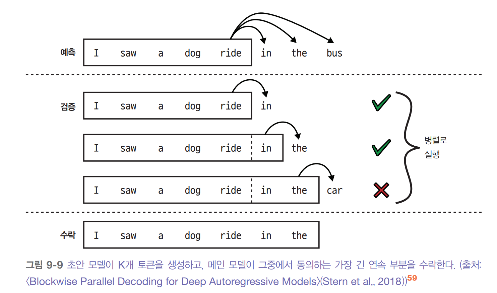  
  
만약 초안 토큰이 하나도 수락되지 않으면 이 반복은 목표 모델이 생성한 하나의 토큰만 만들어 낸다. 만약 모든 초안 토큰이 수락되면 이 반복은 K+1개 
토큰(K개는 초안 모델이, 1개는 목표 모델이 생성)을 만들어 낸다.  
  
모든 초안 시퀀스가 거부된다면 목표 모델은 검증 작업에 더해 전체 응답을 직접 생성해야 하므로 오히려 지연 시간은 늘어날 수 있다. 하지만 다음과 같은 세 
가지 통찰 덕분에 이런 상황을 피할 수 있다.  
  
1. 검증은 병렬화할 수 있지만 생성은 순차적이기 떄문에 목표 모델이 토큰 시퀀스를 검증하는 데 걸리는 시간은 직접 생성하는 데 걸리는 시간보다 짧다. 
추측 디코딩은 사실상 디코딩의 연산 방식을 프리필 방식으로 바꾸는 효과가 있다.  
2. 출력 토큰 시퀀스에서 어떤 토큰은 다른 토큰보다 예측하기 쉽다. 예측하기 쉬운 토큰들을 잘 맞추는 약한 초안 모델을 선택할 수 있어서 초안 토큰 
수락률이 높아진다.  
3. 디코딩은 메모리 대역폭에 제약을 받아서 디코딩 과정에서 보통 남는 FLOP을 검증에 활용할 수 있다.  
  
수락률은 도메인에 따라 다르다. 코드처럼 정해진 구조를 따르는 텍스트에서는 수락률이 보통 더 높다. K 값이 클수록 목표 모델이 검증하는 횟수는 줄어들지만 
드래프트 토큰 수락률이 낮아진다. 초안 모델은 어떤 아키텍처든 될 수 있지만 가능하면 목표 모델과 같은 어휘와 토크나이저를 쓰는 게 좋다. 물론 새로 초안 
모델을 학습시키거나 기존의 약한 모델을 가져다 쓸 수 있다.  
  
예를 들어 친칠라-70B의 디코딩을 빠르게 하려고 딥마인드는 같ㅌ은 아키텍처의 40억 파라미터 초안 모델을 학습시켰다. 초안 모델은 목표 모델보다 8배 
빠르게 토큰을 생성할 수 있다(토큰당 1.8ms 대 14.1ms) 그 결과 응답 품질의 저하 없이 전체 응답 지연 시간을 절반 이상 줄였다. T5-XXL에서도 비슷한 속도 
향상을 달성했다.  
  
이 접근법은 비교적 구현하기 쉽고 모델 품질을 바꾸지 않기 떄문에 최근 큰 주목을 받고 있다. 예를 들어 파이토치에서 50줄의 코드로 이 기능을 구현할 
수 있다. vLLM, TensorRT-LLM, llama.cpp 같은 유명한 추론 프레임워크에도 이미 들어가 있다.  
  
# **참조 기반 추론**  
응답할 때 입력의 토큰들을 참조해야 하는 경우가 많다. 예를 들어 첨부된 문서에 대해 모델에게 질의하면 모델이 문서 내용을 그대로 인용할 수 있다. 
또 다른 예로는 코드의 버그를 고쳐달라고 하면 모델이 원본 코드 대부분을 조금만 바꿔서 재사용할 수 있다. 모델이 이렇게 반복되는 토큰들을 새로 생성하게 
하는 대신 입력을 바로 복사해서 생성 속도를 높이면 어떨까? 이게 참조 기반 추론의 핵심 아이디어다.  
  
참조 기반 추론은 추측 디코딩과 비슷하지만 모델을 사용해서 초안 토큰을 생성하는 대신 입력에서 초안 토큰을 가져오는 점에서 차이가 있다. 여기서 핵심 
과제는 각 디코딩 단계에서 컨텍스트에서 가장 관련성 높은 텍스트 구간을 찾아내는 알고리즘을 개발하는 것이다. 가장 간단한 방법은 현재 토큰들과 일치하는 
텍스트 구간을 찾는 것이다.  
  
추측 디코딩과 달리 참조 기반 추론은 추가 모델이 필요없다. 하지만 검색 시스템, 코딩, 멀티 턴 대화처럼 컨텍스트와 출력 사이에 상당한 중복이 있는 
생성 시나리오에서만 유용하다. Inference with Reference: Lossless Acceleration of Large Language Models에서 이 기법을 통해 해당 활용 
사례에서 2배의 생성 속도 향상을 달성했다고 주장한다.  
  
참조 기반 추론의 작동 방식 예시는 아래 그림에 나와있다.  
  
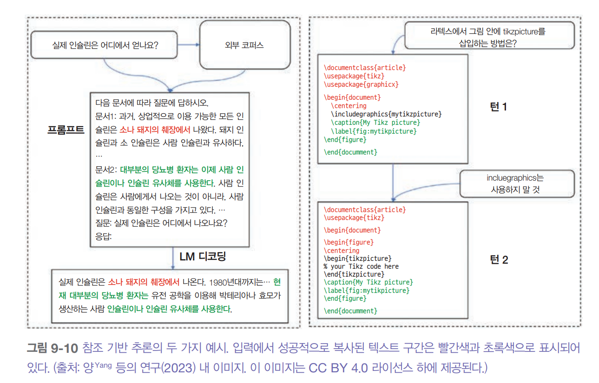  
  

  

